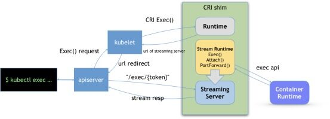
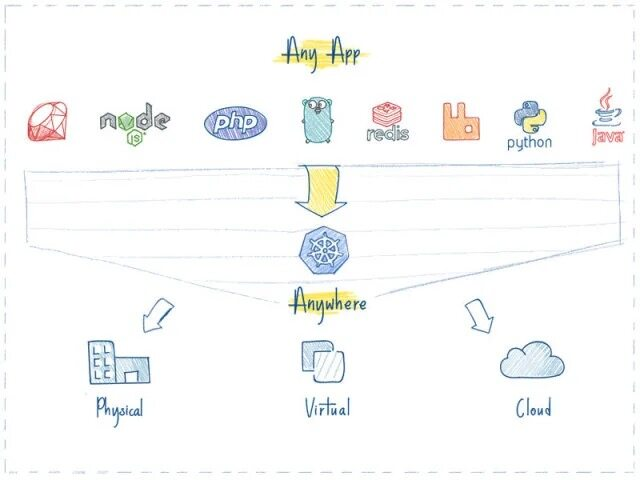
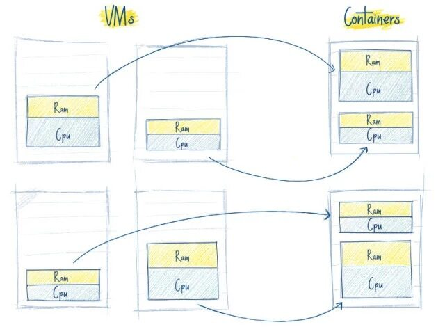
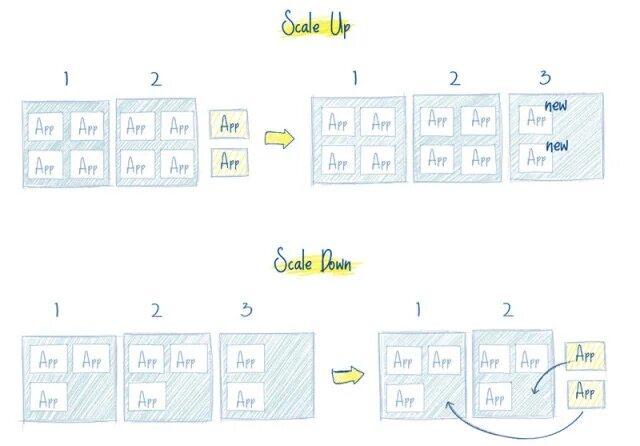
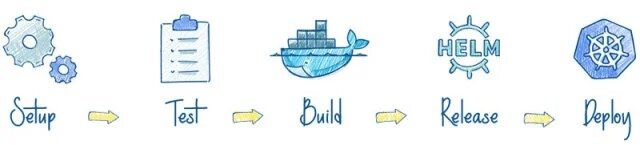
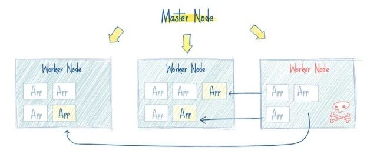

# 1.容器运行时与K8s概览

首先我们要明确一个知识点就是**容器本质上就是一个进程**，一个特殊的进程，是通过 Namespace 实现资源（网络、文件系统等）隔离，通过 Cgroups 实现资源（CPU、内存）限制，让我们使用起来就感觉像在操作虚拟机一样，但其和虚拟机有本质上的区别，那就是**容器和宿主机是共享同一个内核的**。为了将我们的应用进程运行在容器中，当然就需要有一些方便的接口或者命令去调用 Linux 的系统功能来实现，而容器运行时就是用来运行和管理容器进程、镜像的工具。

## 容器运行时分类
当然最火大家最熟悉的容器运行时非 Docker 莫属了，Docker 凭借一己之力大大推进了容器技术的普及。当然随着容器生态的不断发展，业界也慢慢出现了其他的运行时，比如 Containerd、rkt、kata container、cri-o 等等，这些运行时提供的功能不尽相同，有些只有容器运行的功能，有些除运行容器之外还提供了容器镜像的管理功能。根据容器运行时提供的功能，我们可以将容器运行时分为**低层运行时和高层运行时**。

低层运行时主要负责与宿主机操作系统打交道，根据指定的容器镜像在宿主机上运行容器进程，并**对容器的整个生命周期进行管理**，也就是负责设置容器 Namespace、Cgroups 等基础操作的组件，常见的低层运行时有：

- `runc`：传统的运行时，基于 Linux Namespace 和 Cgroups 技术实现，代表实现 Docker、Containerd
- `runv`：基于虚拟机管理程序的运行时，通过虚拟化 guest kernel，将容器和主机隔离开来，使得其边界更加清晰，代表实现是 Kata Container 和 Firecracker
- `runsc`：`runc` + `safety`，通过拦截应用程序的所有系统调用，提供安全隔离的轻量级容器运行时沙箱，代表实现是谷歌的 gVisor

高层运行时主要**负责镜像的管理**等工作，为容器的运行做准备，主流的高层运行时包括 Containerd、CRI-O。高层运行时与低层运行时各司其职，容器运行时一般先由高层运行时将容器镜像下载下来，并解压转换为容器运行需要的操作系统文件，再由低层运行时启动和管理容器。

## Docker
从 Docker 1.11 版本开始，Docker 容器运行就不是简单通过 Docker Daemon 来启动了，而是通过集成 Containerd、runc 等多个组件来完成的。虽然 Docker Daemon 守护进程模块在不停的重构，但是基本功能和定位没有太大的变化，一直都是 CS 架构，守护进程负责和 Docker Client 端交互，并管理 Docker 镜像和容器。现在的架构中组件 Containerd 就会负责集群节点上容器的生命周期管理，并向上为 Docker Daemon 提供 gRPC 接口。


当我们要创建一个容器的时候，现在 Docker Daemon 并不能直接帮我们创建了，而是请求 `Containerd` 来创建一个容器，Containerd 收到请求后，也并不会直接去操作容器，而是创建一个叫做 `Containerd-shim` 的进程，让这个进程去操作容器，我们指定容器进程是需要一个父进程来做状态收集、维持 `stdin` 等 `fd` 打开等工作的，假如这个父进程就是 Containerd，那如果 Containerd 挂掉的话，整个宿主机上所有的容器都得退出了，而引入 `Containerd-shim` 这个垫片就可以来规避这个问题了。

然后创建容器需要做一些 Namespaces 和 Cgroups 的配置，以及挂载 root 文件系统等操作，这些操作其实已经有了标准的规范，那就是 `OCI`（开放容器标准），`runc` 就是它的一个参考实现（Docker 被逼无耐将 `libcontainer` 捐献出来改名为 `runc` 的），这个标准其实就是一个文档，主要规定了容器镜像的结构、以及容器需要接收哪些操作指令，比如 `create`、`start`、`stop`、`delete` 等这些命令。`runc` 就可以按照这个 OCI 文档来创建一个符合规范的容器，既然是标准肯定就有其他 OCI 实现，比如 Kata、gVisor 这些容器运行时也都是符合 OCI 标准的。

所以真正启动容器是通过 `Containerd-shim` 去调用 `runc` 来启动容器的，`runc` 启动完容器后本身会直接退出，`Containerd-shim` 则会成为容器进程的父进程, 负责收集容器进程的状态, 上报给 Containerd, 并在容器中 `pid` 为 1 的进程退出后接管容器中的子进程进行清理, 确保不会出现僵尸进程。

而 Docker 将容器操作都迁移到 `Containerd` 中去是因为当前做 Swarm，想要进军 PaaS 市场，做了这个架构切分，让 Docker Daemon 专门去负责上层的封装编排，当然后面的结果我们知道 Swarm 在 Kubernetes 面前是惨败，然后 Docker 公司就把 `Containerd` 项目捐献给了 CNCF 基金会，这个也是现在的 Docker 架构。

## CRI
Kubernetes 中提供了一个叫着 CRI 的容器运行时接口，那么这个 CRI 到底是什么呢？这个其实也和 Docker 的发展密切相关的。

在 Kubernetes 早期的时候，当时 Docker 实在是太火了，Kubernetes 当然会先选择支持 Docker，而且是通过硬编码的方式直接调用 Docker API，后面随着 Docker 的不断发展以及 Google 的主导，出现了更多容器运行时，Kubernetes 为了支持更多更精简的容器运行时，Google 就和红帽主导推出了 CRI 标准，用于将 Kubernetes 平台和特定的容器运行时（当然主要是为了干掉 Docker）解耦。

`CRI`（`Container Runtime Interface` 容器运行时接口）本质上就是 Kubernetes 定义的一组与容器运行时进行交互的接口，所以只要实现了这套接口的容器运行时都可以对接到 Kubernetes 平台上来。不过 Kubernetes 推出 CRI 这套标准的时候还没有现在的统治地位，所以有一些容器运行时可能不会自身就去实现 CRI 接口，于是就有了 `shim（垫片）`， 一个 `shim` 的职责就是作为适配器将各种容器运行时本身的接口适配到 Kubernetes 的 CRI 接口上，其中 `dockershim` 就是 Kubernetes 对接 Docker 到 CRI 接口上的一个垫片实现。


从上图可以看到，CRI 主要有 gRPC client、gRPC Server 和具体的容器运行时三个组件。其中 Kubelet 作为 gRPC 的客户端来调用 CRI 接口；CRI shim 作为 gRPC 服务端来响应 CRI 请求，负责将 CRI 请求的内容转换为具体的容器运行时 API，在 kubelet 和运行时之间充当翻译的角色。具体的容器创建逻辑是，Kubernetes 在通过调度指定一个具体的节点运行 Pod，该节点的 Kubelet 在接到 Pod 创建请求后，调用一个叫作 `GenericRuntime` 的通用组件来发起创建 Pod 的 CRI 请求给 CRI shim；CRI shim 监听一个端口来响应 Kubelet，在收到 CRI 请求后，将其转化为具体的容器运行时指令，并调用相应的容器运行时来创建 Pod。

### CRI 规范
所以任何容器运行时想要接入 Kubernetes，都需要实现一个自己的 CRI shim，来实现 CRI 接口规范。

那么 CRI 有哪些接口需要实现呢？

最新的 CRI 定义位于 Kubernetes 源码包 [staging/src/k8s.io/cri-api/pkg/apis/runtime/v1/api.proto](https://github.com/kubernetes/kubernetes/blob/release-1.26/staging/src/k8s.io/cri-api/pkg/apis/runtime/v1/api.proto)，主要定义了两类接口：
`ImageService` 和 `RuntimeService`，比之前的定义多了不少方法。

- `ImageService` 主要定义拉取镜像、查看和删除镜像等操作。
- `RuntimeService` 定义了容器相关的操作，包括管理容器的生命周期，以及与容器交互的调用（exec/attach/port-forward）等操作。


`ImageService` 的操作比较简单，就是拉取、删除、查看镜像状态及获取镜像列表这几个操作，下面我们着重介绍下 `RuntimeService`。

从接口中可以看出 `RuntimeService` 除了有 container 的管理接口外，还包含 `PodSandbox` 相关的管理接口和 `exec`、`attach` 等与容器交互的接口。

`PodSandbox` 这个概念对应的是 Kubernetes 里的 Pod，它描述了 Kubernetes 里的 Pod 与容器运行相关的属性或者信息，如 HostName、CgroupParent 等，设计这个的初衷是因为 Pod 里所有容器的资源和环境信息是共享的，但是不同的容器运行时实现共享的机制不同，如 Docker 中 Pod 会是一个 Linux 命名空间，各容器网络信息的共享通过创建 `pause` 容器的方法来实现，而 Kata Containers 则直接将 Pod 具化为一个轻量级的虚拟机，将这个逻辑抽象为 `PodSandbox` 接口，可以让不同的容器运行时在 Pod 实现上自由发挥，自己解释和实现 Pod 的逻辑。

`Exec`、`Attach` 和 `PortForward` 是三个和容器进行数据交互的接口，由于交互数据需要长链接来传输，这些接口被称为 `Streaming API`。CRI shim 依赖一套独立的 Streaming Server 机制来实现客户端与容器的交互需求。长连接比较消耗网络资源，为了避免因长连接给 kubelet 节点带来网络流量瓶颈，CRI 要求容器运行时启动一个对应请求的单独的流服务器，让客户端直接与流服务器进行连同交互。



上图所示，`kubectl exec` 命令实现过程如下：

-  客户端发送 kubectl exec 命令给 apiserver；
-  apiserver 调用 kubelet 的 Exec API；
-  kubelet 调用 CRI 的 Exec 接口（具体的执行者为实现该接口的 CRI Shim ）；
-  CRI Shim 向 kubelet 返回 Streaming Server 的地址和端口；
-  kubelet 以 redirect 的方式返回给 apiserver
-  apiserver 通过重定向来向 Streaming Server 发起真正的 `/exec/{token}` 请求，与它建立长连接，完成 Exec 的请求和响应。

kubelet 在引入 CRI 之后，主要的架构如下图所示，其中 `Generic Runtime Manager` 负责发送容器创建、删除等 CRI 请求，`Container Runtime Interface(CRI)` 负责定义 CRI 接口规范，具体的 CRI 实现可分为两种：kubelet 内置的 `dockershim` 和远端的 CRI shim。其中 `dockershim` 是 Kubernetes 自己实现的适配 Docker 接口的 CRI 接口实现，主要用来将 CRI 请求里的内容组装成 Docker API 请求发给 Docker Daemon；远端的 CRI shim 主要是用来匹配其他的容器运行时工具到 kubelet。CRI shim 主要负责响应 kubelet 发送的 CRI 请求，并将请求转化为具体的运行时命令发送给具体的运行时（如 runc、kata 等）；Stream Server 用来响应客户端与容器的交互，除此之外，CRI 还提供接入 CNI 的能力以实现 Pod 网络的共享，常用的远端 CRI 的实现有 CRI-Containerd、CRI-O 等。


### 为何抛弃 Docker
从上图可以看出，Kubernetes 把 dockershim 内置在了官方的代码库中，将 Docker 设计为 Kubernetes 默认的容器运行时工具。但是官方在 Kubernetes 1.20 版本的更新日志中声明已经废用对 Docker 的支持，在 Kubernetes 1.24 版本中，dockershim 代码也如期被删除。

那 Kubernetes 为何要抛弃 Docker 呢？

这和 Docker 的整体架构也是有关系的，Docker 最初是一个单体引擎，主要负责容器镜像的制作、上传、拉取及容器的运行及管理。随着容器技术的繁荣发展，为了促进容器技术相关的规范生成和 Docker 自身项目的发展，Docker 将单体引擎拆分为三部分，分别为 `runc`、`containerd` 和 `dockerd`，其中 `runc` 主要负责容器的运行和生命周期的管理、 `containerd` 主要负责容器镜像的下载和解压等镜像管理功能、`dockerd` 主要负责提供镜像构建、上传等功能同时提供容器存储和网络的映射功能，同时也是 Docker 服务器端的守护进程，用来响应 Docker 客户端发来的各种容器、镜像管理的任务。Docker 公司将 runc 捐献给了 OCI，将 containerd 捐献给了 CNCF，剩下的 dockerd 作为 Docker 运行时由 Docker 公司自己维护。

如前所述，Kubernetes 在引入 CRI 之后，kubelet 需要通过 CRI shim 去调用具体的容器运行时工具，由于早期 Kubernetes 对 Docker 的支持是内置的，因此官方自己实现了 dockershim，通过 dockershim 去访问 dockerd。


假设我们使用的是 Docker，当我们在 Kubernetes 中创建一个 Pod 的时候，首先就是 kubelet 通过 CRI 接口调用 `dockershim`，请求创建一个容器，kubelet 可以视作一个简单的 CRI Client, 而 dockershim 就是接收请求的 Server，不过他们都是在 kubelet 内置的。

`dockershim` 收到请求后, 转化成 dockerd 能识别的请求, 发到 Docker Daemon 上请求创建一个容器，请求到了 Docker Daemon 后续就是 Docker 创建容器的流程了，去调用 `Containerd`，然后创建 `Containerd-shim` 进程，通过该进程去调用 `runc` 去真正创建容器。

其实我们仔细观察也不难发现使用 Docker 的话其实是**调用链太长**，真正容器相关的操作其实 Containerd 就完全足够了，Docker 太过于复杂笨重了，当然 Docker 深受欢迎的很大一个原因就是提供了很多对用户操作比较友好的功能，但是对于 Kubernetes 来说压根不需要这些功能，因为都是通过接口去操作容器的，所以自然也就可以将容器运行时切换到 Containerd 来。


切换到 Containerd 可以消除掉中间环节，操作体验也和以前一样，但是由于直接用容器运行时调度容器，所以它们对 Docker 来说是不可见的。 因此，你以前用来检查这些容器的 Docker 工具就不能使用了。

你不能再使用 `docker ps` 或 `docker inspect` 命令来获取容器信息。由于不能列出容器，因此也不能获取日志、停止容器，甚至不能通过 `docker exec` 在容器中执行命令。

当然我们仍然可以下载镜像，或者用 `docker build` 命令构建镜像，但用 Docker 构建、下载的镜像，对于容器运行时和 Kubernetes，均不可见。为了在 Kubernetes 中使用，需要把镜像推送到镜像仓库中去。

从上图可以看出在 Containerd 1.0 中，对 CRI 的适配是通过一个单独的 `CRI-Containerd` 进程来完成的，这是因为最开始 Containerd 还会去适配其他的系统（比如 swarm），所以没有直接实现 CRI，所以这个对接工作就交给 `CRI-Containerd` 这个 shim 了。

然后到了 Containerd 1.1 版本后就去掉了 `CRI-Containerd` 这个 shim，直接把适配逻辑作为插件的方式集成到了 Containerd 主进程中，现在这样的调用就更加简洁了。


与此同时 Kubernetes 社区也做了一个专门用于 Kubernetes 的 CRI 运行时 [CRI-O](https://cri-o.io/)，直接兼容 CRI 和 OCI 规范。


这个方案和 Containerd 的方案显然比默认的 dockershim 简洁很多，不过由于大部分用户都比较习惯使用 Docker，所以大家还是更喜欢使用 `dockershim` 方案。

但是随着 CRI 方案的发展，以及其他容器运行时对 CRI 的支持越来越完善，Kubernetes 社区在 2020 年 7 月份就开始着手移除 dockershim 方案了：[https://github.com/kubernetes/enhancements/tree/master/keps/sig-node/2221-remove-dockershim](https://github.com/kubernetes/enhancements/tree/master/keps/sig-node/2221-remove-dockershim)，现在的移除计划是在 1.20 版本中将 kubelet 中内置的 dockershim 代码分离，将内置的 dockershim 标记为`维护模式`，当然这个时候仍然还可以使用 dockershim，在 1.24 版本已经移出了 dockershim 代码。

那么这是否就意味这 Kubernetes 不再支持 Docker 了呢？当然不是的，这只是废弃了内置的 `dockershim` 功能而已，Docker 和其他容器运行时将一视同仁，不会单独对待内置支持，如果我们还想直接使用 Docker 这种容器运行时应该怎么办呢？可以将 dockershim 的功能单独提取出来独立维护一个 [cri-dockerd（社区有）](https://github.com/Mirantis/cri-dockerd) 即可，就类似于 Containerd 1.0 版本中提供的 `CRI-Containerd`，当然还有一种办法就是 Docker 官方社区将 CRI 接口内置到 Dockerd 中去实现。

但是我们也清楚 Dockerd 也是去调用的 Containerd，而 Containerd 1.1 版本后就内置实现了 CRI，所以 Docker 也没必要再去单独实现 CRI 了，当 Kubernetes 不再内置支持开箱即用的 Docker 的以后，最好的方式当然也就是直接使用 Containerd 这种容器运行时，而且该容器运行时也已经经过了生产环境实践的，所以我们也是建议大家使用 Containerd 这种容器运行时的。

## K8s 简介
[Kubernetes（简称 K8s）](https://kubernetes.io/) 的出现是容器化技术发展的必然结果，**容器化**是应用程序级别的虚拟化，运行单个内核上有多个独立的用户空间实例，这些实例就是容器；**容器**提供了将应用程序的代码、运行时、系统工具、系统库和配置打包到一个实例中的标准方法，而且容器是共享一个内核的；由于容器技术的兴起，导致大量的容器应用出现，所以就出现了一些用来支持应用程序容器化部署和组织的**容器编排**技术，一些流行的开源容器编排工具有 Docker Swarm、Kubernetes 等，但是在发展过程中 Kubernetes 现在已经成为了容器编排领域事实上的一个标准了。


[Kubernetes](https://kubernetes.io/) 是 Google 团队发起的一个开源项目，它的目标是管理跨多个主机的容器，用于自动部署、扩展和管理容器化的应用程序，主要实现语言为 Go 语言，他的理论基础来源与 Google 内部的 Borg 项目，所以 Kubernetes 项目的理论基础就比其他开源项目要“先进”很多，因为 Borg 系统一直依赖就被称为 Google 公司内部最强大的“私密武器”。

### 为什么使用 K8s
使用 Kubernetes 的理由很多，最重要的理由是，IT 行业从来都是由新技术驱动的。Docker 容器化技术已经被很多公司采用，**从单机走向集群已成为必然**。云计算的蓬勃发展正在加速这一进程，Kubernetes 作为当前被业界广泛认可和看好的基于 Docker 的大规模容器化分布式系统解决方案，得到了以谷歌为首的 IT 巨头们的大力宣传和维持推进。

2015 年，谷歌联合 20 多家公司一起建立了 CNCF（Cloud Native Computing Foundation，云原生计算基金会）开源组织来推广 Kubernetes，并由此开创了云原生应用（Cloud Native Application）的新时代。作为 CNCF “钦定”的官方云原生平台，Kubernetes 正在颠覆应用程序的开发方式。我们可以从以下几个方面来看看为什么需要使用 K8s！

**一个平台搞定所有**
使用 Kubernetes 部署任何应用都是小菜一碟。只要应用可以打包成镜像，能够容器部署，Kubernetes 就一定能启动它。



不管什么语言、什么框架写的应用（如 Java, Python, Node.js），Kubernetes 都可以在任何环境中安全的启动它，如物理服务器、虚拟机、云环境。

**云环境无缝迁移**
如果你有更换云环境的需求，例如从 GCP 到 AWS，使用 Kubernetes 的话，你就不用有任何担心。


Kubernetes 完全兼容各种云服务提供商，例如 Google Cloud、Amazon、Microsoft Azure、阿里云等，还可以工作在 CloudStack, OpenStack, VSphere 上等。

**高效的利用资源**
看下图，左边是 4 个虚拟机，黄色和蓝色部分是运行的应用，白色部分是未使用的内存和处理器资源。右边，同样的应用打包运行在容器中。



Kubernetes 如果发现有节点工作不饱和，便会重新分配 Pod，帮助我们节省开销，高效的利用内存、处理器等资源。

如果一个节点宕机了，Kubernetes 会自动重新创建之前运行在此节点上的 Pod，在其他节点上运行。

**开箱即用的自动缩放能力**
网络、负载均衡、复制等特性，对于 Kubernetes 都是开箱即用的。

Pod 是无状态运行的，任何时候有 Pod 宕了，立马会有其他 Pod 接替它的工作，用户完全感觉不到。

如果用户量突然暴增，现有的 Pod 规模不足了，那么会自动创建出一批新的 Pod，以适应当前的需求。



反之亦然，当负载降下来的时候，Kubernetes 也会自动缩减 Pod 的数量。

**使 DevOps 更简单**
你不必精通 Chef 或 Ansible 这类工具，只需要对 CI 服务写个简单的脚本然后运行它，就会使用你的代码创建一个新的 Pod，并部署到 Kubernetes 集群里面。



应用打包在容器中使其可以安全的运行在任何地方，例如你的 PC、一个云服务器，使得测试极其简单。

**可靠性**
Kubernetes 如此流行的一个重要原因是：应用会一直顺利运行，不会被 Pod 或节点的故障所中断。

如果出现故障，Kubernetes 会创建必要数量的应用镜像，并分配到健康的 Pod 或节点中，直到系统恢复。



一个容器化的基础设施是有自愈能力的，可以提供应用程序的不间断操作，即使一部分基础设施出现故障。

**总结**
Kubernetes 使得应用的启动、迁移、部署变得简单又安全。

不必担心应用迁移后工作出现问题，也不用担心一台服务器无法应付突发的用户量。

需要注意的是，你的应用最好使用微服务架构进行开发，因为微服务应用比单体应用更适合做容器化。

不要为了单纯的使用 Kubernetes 而引入，要看你的系统规模是否值得去用，否则可能适得其反，毕竟 Kubernetes 的学习是需要一定成本。

接下来我们就来了解下 Kubernetes 的架构和具体的相关概念吧。

### 架构
Kubernetes 项目依托着 Borg 项目的理论优势，确定了一个如下图所示的全局架构图：


从上面我们可以看出 Kubernetes 由 Master 和 Node 两种节点组成，这两种角色分别对应着控制节点和工作节点（可以理解为老板和员工）。

其中 Master 节点由三个独立的组件组成，它们分别是负责整个集群通信的 API 服务的 `kube-apiserver`、负责容器调度的 `kube-scheduler` 以及负责维护集群状态的 `kube-controller-manager` 组件。整个集群的数据都是通过 kube-apiserver 保存到 etcd 数据库中的，而其他所有组件的通信也都是通过 kube-apiserver 和 etcd 数据库进行通信的，都不会直接和 etcd 进行通信。

工作节点上最核心的组件就是 `kubelet`，当然还有底层的容器运行时，比如 Docker，其中 kubelet 就是主要来实现和底层的容器运行时进行通信的，这个通信的过程也被 Kubernetes 抽象成了一个 `CRI`（Container Runtime Interface）的远程调用接口，这个接口里面定义了容器运行时的所有标准操作，比如创建容器、删除容器等等。所以对于 Kubernetes 来说他根本不关心你部署的到底是什么容器运行时，只要你这个容器运行时可以实现 CRI 接口就可以被 Kubernetes 来管理。

kubelet 的另外一个重要功能就是调用网络插件（`CNI`）和存储插件（`CSI`）为容器配置网络和存储功能，同样的 kubelet 也是把这两个重要功能通过接口暴露给外部了，所以如果我们想要实现自己的网络插件，只需要使用 CNI 就可以很方便的对接到 Kubernetes 集群当中去。

可能下面的架构图看上去更清晰一些：


### 组件
上面我介绍了 Kubernetes 集群的整体架构，下面我们再来更加详细的了解下这些组件的功能。


#### kube-apiserver
API Server 提供了资源对象的唯一操作入口，其它所有组件都必须通过它提供的 API 来操作资源数据。**只有 API Server 会与 etcd 进行通信，其它模块都必须通过 API Server 访问集群状态**。API Server 作为 Kubernetes 系统的入口，封装了核心对象的增删改查操作。API Server 以 RESTFul 接口方式提供给外部客户端和内部组件调用，API Server 再对相关的资源数据（`全量查询 + 变化监听`）进行操作，以达到实时完成相关的业务功能。以 API Server 为 Kubernetes 入口的设计主要有以下好处：

- 保证了集群状态访问的安全
- API Server 隔离了集群状态访问和后端存储实现，这样 API Server 状态访问的方式不会因为后端存储技术 Etcd 的改变而改变，让后端存储方式选择更加灵活，方便了整个架构的扩展


#### kube-controller-manager


Controller Manager 用于实现 Kubernetes 集群故障检测和恢复的自动化工作。主要负责执行各种控制器：

- Replication Controller：主要是定期关联 Replication Controller (RC) 和 Pod，以保证集群中一个 RC (一种资源对象) 所关联的 Pod 副本数始终保持为与预设值一致。
- Node Controller：Kubelet 在启动时会通过 API Server 注册自身的节点信息，并定时向 API Server 汇报状态信息。API Server 在接收到信息后将信息更新到 Etcd 中。Node Controller 通过 API Server 实时获取 Node 的相关信息，实现管理和监控集群中的各个 Node 节点的相关控制功能。
- ResourceQuota Controller：资源配额管理控制器用于确保指定的资源对象在任何时候都不会超量占用系统上物理资源。
- Namespace Controller：用户通过 API Server 可以创建新的 Namespace 并保存在 Etcd 中，Namespace Controller 定时通过 API Server 读取这些 Namespace 信息来操作 Namespace。比如：Namespace 被 API 标记为优雅删除，则将该 Namespace 状态设置为 Terminating 并保存到 Etcd 中。同时 Namespace Controller 删除该 Namespace 下的 ServiceAccount、Deployment、Pod 等资源对象。
- Service Account Controller：服务账号控制器主要在命名空间内管理 ServiceAccount，以保证名为 default 的 ServiceAccount 在每个命名空间中存在。
- Token Controller：令牌控制器作为 Controller Manager 的一部分，主要用作：监听 serviceAccount 的创建和删除动作以及监听 secret 的添加、删除动作。
- Service Controller：服务控制器主要用作监听 Service 的变化。比如：创建的是一个 LoadBalancer 类型的 Service，Service Controller 则要确保外部的云平台上对该 Service 对应的 LoadBalancer 实例被创建、删除以及相应的路由转发表被更新。
- Endpoint Controller：Endpoints 表示了一个 Service 对应的所有 Pod 副本的访问地址，而 Endpoints Controller 是负责生成和维护所有 Endpoints 对象的控制器。Endpoint Controller 负责监听 Service 和对应的 Pod 副本的变化。定期关联 Service 和 Pod (关联信息由 Endpoint 对象维护)，以保证 Service 到 Pod 的映射总是最新的。


#### kube-scheduler
Scheduler 是负责整个集群的资源调度的，主要的职责如下所示：

- 主要用于收集和分析当前 Kubernetes 集群中所有 Node 节点的资源 (包括内存、CPU 等) 负载情况，然后依据资源占用情况分发新建的 Pod 到 Kubernetes 集群中可用的节点
- 实时监测 Kubernetes 集群中未分发和已分发的所有运行的 Pod
- 实时监测 Node 节点信息，由于会频繁查找 Node 节点，所以 Scheduler 同时会缓存一份最新的信息在本地
- 在分发 Pod 到指定的 Node 节点后，会把 Pod 相关的 Binding 信息写回 API Server，以方便其它组件使用


#### kubelet
kubelet 是负责容器真正运行的核心组件，主要的职责如下所示：

- 负责 Node 节点上 Pod 的创建、修改、监控、删除等全生命周期的管理
- 定时上报本地 Node 的状态信息给 API Server
- kubelet 是 Master 和 Node 之间的桥梁，接收 API Server 分配给它的任务并执行
- kubelet 通过 API Server 间接与 Etcd 集群交互来读取集群配置信息
- kubelet 在 Node 上做的主要工作具体如下： 
   1. 设置容器的环境变量、给容器绑定 Volume、给容器绑定 Port、根据指定的 Pod 运行一个单一容器、给指定的 Pod 创建 Network 容器
   2. 同步 Pod 的状态
   3. 在容器中运行命令、杀死容器、删除 Pod 的所有容器

#### kube-proxy
kube-proxy 是为了解决外部网络能够访问集群中容器提供的应用服务而设计的，Proxy 运行在每个 Node 上。

每创建一个 Service，kube-proxy 就会从 API Server 获取 Services 和 Endpoints 的配置信息，然后根据其配置信息在 Node 上启动一个 Proxy 的进程并监听相应的服务端口。

当接收到外部请求时，kube-proxy 会根据 Load Balancer 将请求分发到后端正确的容器处理。

kube-proxy 不但解决了同一宿主机相同服务端口冲突的问题，还提供了 Service 转发服务端口对外提供服务的能力。

kube-proxy 后端使用`随机、轮循`等负载均衡算法进行调度。

#### kubectl
Kubectl 是 Kubernetes 的集群管理命令行客户端工具集。通过 Kubectl 命令对 API Server 进行操作，API Server 响应并返回对应的命令结果，从而达到对 Kubernetes 集群的管理


### 核心资源对象
上面我们都是在架构层面了解 Kubernetes，但是似乎没有发现关于容器的说明，Kubernetes 作为容器编排引擎，那么他是怎么去对容器进行编排的呢？在 Kubernetes 集群中抽象了很多集群内部的资源对象，我们可以通过这些资源对象去操作容器的编排工作。


#### Pod
Pod 是一组紧密关联的`容器集合`，它们共享 PID、IPC、Network 和 UTS namespace，是 Kubernetes 调度的`基本单位`。Pod 的设计理念是支持多个容器在一个 Pod 中共享网络和文件系统，可以通过进程间通信和文件共享这种简单高效的方式组合完成服务。我们知道容器本质上就是进程，那么 Pod 实际上就是进程组了，只是这一组进程是作为一个整体来进行调度的。


在 Kubernetes 中，所有资源对象都使用资源清单（yaml 或 json）来定义，比如我们可以定义一个简单的 nginx 服务，它包含一个镜像为 nginx 的容器：

```yaml
apiVersion: v1
kind: Pod
metadata:
  name: nginx
  namespace: default
  labels:
    app: nginx
spec:
  containers:
    - name: nginx
      image: nginx
      ports:
        - containerPort: 80
```

定义了这样一个资源清单文件后，我们就可以利用上面我们提到的 Kubectl 工具将这个 Pod 创建到 Kubernetes 集群中：

```shell
kubectl apply -f nginx-pod.yaml
```

Pod 在 Kubernetes 集群中被创建的基本流程如下所示：


- 用户通过 REST API 创建一个 Pod
- apiserver 将其写入 etcd
- scheduluer 检测到未绑定 Node 的 Pod，开始调度并更新 Pod 的 Node 绑定
- kubelet 检测到有新的 Pod 调度过来，通过 container runtime 运行该 Pod
- kubelet 通过 container runtime 取到 Pod 状态，并更新到 apiserver 中


#### Label
Label 标签在 Kubernetes 资源对象中使用很多，也是非常重要的一个属性，Label 是识别 Kubernetes 对象的标签，以 `key/value` 的方式附加到对象上（key 最长不能超过 63 字节，value 可以为空，也可以是不超过 253 字节的字符串）上面我们定义的 Nginx 的 Pod 就添加了一个 `app=nginx` 的 Label 标签。Label 不提供唯一性，并且实际上经常是很多对象（如 Pods）都使用相同的 Label 来标志具体的应用。Label 定义好后其他对象可以使用 `Label Selector` 来选择一组相同 Label 的对象（比如 Service 用 Label 来选择一组 Pod）。Label Selector 支持以下几种方式：

- 等式，如 `app=nginx` 和 `env!=production`
- 集合，如 `env in (production, qa)`
- 多个 Label（它们之间是`AND`关系），如`app=nginx,env=test`


#### Namespace
Namespace（命名空间）是对一组资源和对象的抽象集合，比如可以用来将系统内部的对象划分为不同的项目组或用户组。常见的 Pods、Services、Deployments 等都是属于某一个 Namespace 的（默认是 default），比如上面我们的 Nginx Pod 没有指定 namespace，则默认就在 default 命名空间下面，而 Node, PersistentVolumes 等资源则不属于任何 Namespace，是全局的。

> 注意它并不是 Linux Namespace，二者没有任何关系，它只是 Kubernetes 划分不同工作空间的一个逻辑单位。


#### Deployment
我们说了 Pod 是 Kubernetes 集群中的最基本的调度单元，但是如果想要创建同一个容器的多份拷贝，需要一个一个分别创建出来么，那么能否将 Pods 划到一个逻辑组里面呢？Deployment 就是来管理 Pod 的资源对象。

Deployment 确保任意时间都有指定数量的 Pod“副本”在运行。如果为某个 Pod 创建了 Deployment 并且指定 3 个副本，它会创建 3 个 Pod，并且持续监控它们。如果某个 Pod 不响应，那么 Deployment 会替换它，始终保持总数为 3。

如果之前不响应的 Pod 恢复了，现在就有 4 个 Pod 了，那么 Deployment 会将其中一个终止保持总数为 3。如果在运行中将副本总数改为 5，Deployment 会立刻启动 2 个新 Pod，保证总数为 5。持回滚和滚动升级。

当创建 Deployment 时，需要指定两个东西：

- Pod 模板：用来创建 Pod 副本的模板
- Label 标签：Deployment 需要监控的 Pod 的标签。

现在已经创建了 Pod 的一些副本，那么这些副本上如何进行负载呢？如何把这些 Pod 暴露出去呢？这个时候我们就需要用到 Service 这种资源对象了。


#### Service
Service 是应用服务的抽象，通过 Labels 为应用提供`负载均衡和服务发现`。匹配 Labels 的 Pod IP 和端口列表组成 Endpoints，由 kube-proxy 负责将服务 IP 负载均衡到这些 Endpoints 上。

每个 Service 都会自动分配一个 cluster IP（仅在集群内部可访问的虚拟地址）和 DNS 名，其他容器可以通过该地址或 DNS 来访问服务，而不需要了解后端容器的运行。


> 原文: <https://www.yuque.com/cnych/k8s4/fb9x83f5g4hvtong>