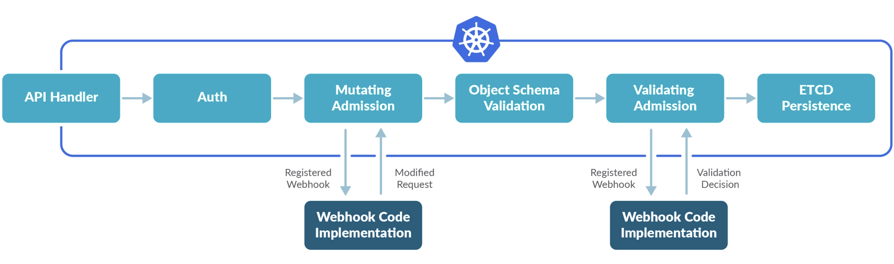

# 10.准入控制器

Kubernetes 提供了需要扩展其内置功能的方法，最常用的可能是自定义资源类型和自定义控制器了，除此之外，Kubernetes 还有一些其他非常有趣的功能，比如 `admission webhooks` 就可以用于扩展 API，用于修改某些 Kubernetes 资源的基本行为。

准入控制器是在**对象持久化之前**用于对 Kubernetes API Server 的请求进行拦截的代码段，在请求经过**身份验证**和**授权之后**放行通过。准入控制器可能正在 `validating`、`mutating` 或者都在执行，`Mutating` 控制器可以修改他们处理的资源对象，`Validating` 控制器不会，如果任何一个阶段中的任何控制器拒绝了请求，则会立即拒绝整个请求，并将错误返回给最终的用户。

这意味着有一些特殊的控制器可以拦截 Kubernetes API 请求，并根据自定义的逻辑修改或者拒绝它们。Kubernetes 有自己实现的一个控制器列表：[https://kubernetes.io/docs/reference/access-authn-authz/admission-controllers/#what-does-each-admission-controller-do](https://kubernetes.io/docs/reference/access-authn-authz/admission-controllers/#what-does-each-admission-controller-do)，当然你也可以编写自己的控制器，虽然这些控制器听起来功能比较强大，但是这些控制器需要被编译进 kube-apiserver，并且只能在 apiserver 启动时启动。

也可以直接使用 kube-apiserver 启动参数查看内置支持的控制器：

```shell
kube-apiserver --help |grep enable-admission-plugins
```

由于上面的控制器的限制，我们就需要用到**动态**的概念了，而不是和 apiserver 耦合在一起，`Admission webhooks` 就通过一种动态配置方法解决了这个限制问题。


## admission webhook 是什么?

在 Kubernetes apiserver 中包含两个特殊的准入控制器：`MutatingAdmissionWebhook` 和`ValidatingAdmissionWebhook`，这两个控制器将发送准入请求到外部的 HTTP 回调服务并接收一个准入响应。如果启用了这两个准入控制器，Kubernetes 管理员可以在集群中创建和配置一个 admission webhook。



整体的步骤如下所示：

-  
   1. 检查集群中是否启用了 admission webhook 控制器，并根据需要进行配置。
-  
   2. 编写处理准入请求的 HTTP 回调，回调可以是一个部署在集群中的简单 HTTP 服务，甚至也可以是一个 `serverless` 函数。
-  
   3. 通过 `MutatingWebhookConfiguration` 和 `ValidatingWebhookConfiguration` 资源配置 admission webhook。

这两种类型的 admission webhook 之间的区别是非常明显的：`validating webhooks` 可以拒绝请求，但是它们却不能修改准入请求中获取的对象，而 `mutating webhooks` 可以在返回准入响应之前通过创建补丁来修改对象，如果 webhook 拒绝了一个请求，则会向最终用户返回错误。

现在非常火热的 Service Mesh 应用 `istio` 就是通过 mutating webhooks 来自动将 `Envoy` 这个 sidecar 容器注入到 Pod 中去的：[https://istio.io/latest/docs/setup/additional-setup/sidecar-injection/](https://istio.io/latest/docs/setup/additional-setup/sidecar-injection/)。


## 创建配置一个 Admission Webhook

上面我们介绍了 Admission Webhook 的理论知识，接下来我们在一个真实的 Kubernetes 集群中来实际测试使用下，我们将创建一个 webhook 的 webserver，将其部署到集群中，然后创建 webhook 配置查看是否生效。

首先确保在 apiserver 中启用了 `MutatingAdmissionWebhook` 和 `ValidatingAdmissionWebhook` 这两个控制器，通过参数 `--enable-admission-plugins` 进行配置，当前 v1.25+ 版本已经内置默认开启了，如果没有开启则需要添加上这两个参数，然后重启 apiserver。

然后通过运行下面的命令检查集群中是否启用了准入注册 API：

```shell
☸ ➜ kubectl api-versions |grep admission
admissionregistration.k8s.io/v1
```

满足了这些先决条件之后，我们就可以来编写 admission webhook 服务器了，其实就是开发一个 webserver，在该服务中处理由 APIServer 发送过来的一个 `AdmissionReview` 请求，格式如下所示：

```json
{
  "apiVersion": "admission.k8s.io/v1",
  "kind": "AdmissionReview",
  ...
  "request": {
    # Random uid uniquely identifying this admission call
    "uid": "d595e125-9489-4d1c-877d-0a05984355c8",
    # object is the new object being admitted.
    "object": {"apiVersion":"v1","kind":"Pod", ...},
    ...
  }
}
```

然后构造一个 `AdmissionReview` 对象返回回去即可。

```json
{
  "apiVersion": "admission.k8s.io/v1",
  "kind": "AdmissionReview",
  "response": {
    "uid": "<value from request.uid>",
    "allowed": true
  }
}
// 或者
{
  "apiVersion": "admission.k8s.io/v1",
  "kind": "AdmissionReview",
  "response": {
    "uid": "<value from request.uid>",
    "allowed": false,
    "status": {
      "code": 402,
      "status": "Failure",
      "message": "xxx",
      "reason": "xxxx"
    }
  }
}
```

其决定作用的字段是 `.response.uid` 和 `.response.allowed`，前者唯一确定请求，后者表示通过或者不通过，status 字段主要供错误提示。

我们可以直接参考 Kubernetes e2e 测试中的示例实现代码 [https://github.com/kubernetes/kubernetes/blob/release-1.25/test/images/agnhost/webhook/main.go](https://github.com/kubernetes/kubernetes/blob/release-1.25/test/images/agnhost/webhook/main.go)。


### 编写 webhook

满足了前面的先决条件后，接下来我们就来实现一个 webhook 示例，通过监听两个不同的 HTTP 端点（validate 和 mutate）来进行 `validating` 和 `mutating webhook` 验证。

这个 webhook 的完整代码可以在 Github 上获取：[https://github.com/cnych/admission-webhook-example(train4 分支)](https://github.com/cnych/admission-webhook-example)，该仓库 Fork 自项目 [https://github.com/banzaicloud/admission-webhook-example](https://github.com/banzaicloud/admission-webhook-example)。这个 webhook 是一个简单的带 TLS 认证的 HTTP 服务，用 Deployment 方式部署在我们的集群中。

代码中主要的逻辑在两个文件中：`main.go` 和 `webhook.go`，main.go 文件包含创建 HTTP 服务的代码，而 webhook.go 包含 `validates` 和 `mutates` 两个 webhook 的逻辑，大部分代码都比较简单，首先查看 main.go 文件，查看如何使用标准 golang 包来启动 HTTP 服务，以及如何从命令行标志中读取 TLS 配置的证书：

```
flag.StringVar(&parameters.certFile, "tlsCertFile", "/etc/webhook/certs/cert.pem", "File containing the x509 Certificate for HTTPS.")
flag.StringVar(&parameters.keyFile, "tlsKeyFile", "/etc/webhook/certs/key.pem", "File containing the x509 private key to --tlsCertFile.")
```

然后一个比较重要的是 serve 函数，用来处理传入的 `mutate` 和 `validating` 函数 的 HTTP 请求。该函数从请求中反序列化 `AdmissionReview` 对象，执行一些基本的内容校验，根据 URL 路径调用相应的 `mutate` 和 `validate` 函数，然后序列化 AdmissionReview 对象：

```
// Serve method for webhook server
func (whsvr *WebhookServer) serve(w http.ResponseWriter, r *http.Request) {
	var body []byte
	if r.Body != nil {
		if data, err := ioutil.ReadAll(r.Body); err == nil {
			body = data
		}
	}
	if len(body) == 0 {
		glog.Error("empty body")
		http.Error(w, "empty body", http.StatusBadRequest)
		return
	}

	// verify the content type is accurate
	contentType := r.Header.Get("Content-Type")
	if contentType != "application/json" {
		glog.Errorf("Content-Type=%s, expect application/json", contentType)
		http.Error(w, "invalid Content-Type, expect `application/json`", http.StatusUnsupportedMediaType)
		return
	}

	var admissionResponse *admissionv1.AdmissionResponse
	ar := admissionv1.AdmissionReview{}
	if _, _, err := deserializer.Decode(body, nil, &ar); err != nil {
		glog.Errorf("Can't decode body: %v", err)
		admissionResponse = &admissionv1.AdmissionResponse{
			Result: &metav1.Status{
				Message: err.Error(),
			},
		}
	} else {
		fmt.Println(r.URL.Path)
		if r.URL.Path == "/mutate" {
			admissionResponse = whsvr.mutate(&ar)
		} else if r.URL.Path == "/validate" {
			admissionResponse = whsvr.validate(&ar)
		}
	}

	admissionReview := admissionv1.AdmissionReview{}
	admissionReview.TypeMeta = metav1.TypeMeta{
		Kind:       "AdmissionReview",
		APIVersion: "admission.k8s.io/v1",
	}
	if admissionResponse != nil {
		admissionReview.Response = admissionResponse
		if ar.Request != nil {
			admissionReview.Response.UID = ar.Request.UID
		}
	}

	resp, err := json.Marshal(admissionReview)
	if err != nil {
		glog.Errorf("Can't encode response: %v", err)
		http.Error(w, fmt.Sprintf("could not encode response: %v", err), http.StatusInternalServerError)
	}
	glog.Infof("Ready to write reponse ...")
	if _, err := w.Write(resp); err != nil {
		glog.Errorf("Can't write response: %v", err)
		http.Error(w, fmt.Sprintf("could not write response: %v", err), http.StatusInternalServerError)
	}
}
```

主要的准入逻辑是 `validate` 和 `mutate` 两个函数。`validate` 函数检查资源对象是否需要校验：不验证 `kube-system` 命名空间中的资源，如果想要显示的声明不验证某个资源，可以通过在资源对象中添加一个 `admission-webhook-example.qikqiak.com/validate=false` 的 `annotation` 进行声明。如果需要验证，则根据资源类型的 kind，和标签与其对应项进行比较，将 service 或者 deployment 资源从请求中反序列化出来。如果缺少某些 label 标签，则响应中的 Allowed 会被设置为 false。如果验证失败，则会在响应中写入失败原因，最终用户在尝试创建资源时会收到失败的信息。validate 函数实现如下所示：

```
// validate deployments and services
func (whsvr *WebhookServer) validate(ar *admissionv1.AdmissionReview) *admissionv1.AdmissionResponse {
	req := ar.Request
	var (
		availableLabels                 map[string]string
		objectMeta                      *metav1.ObjectMeta
		resourceNamespace, resourceName string
	)

	glog.Infof("AdmissionReview for Kind=%v, Namespace=%v Name=%v (%v) UID=%v patchOperation=%v UserInfo=%v",
		req.Kind, req.Namespace, req.Name, resourceName, req.UID, req.Operation, req.UserInfo)

	switch req.Kind.Kind {
	case "Deployment":
		var deployment appsv1.Deployment
		if err := json.Unmarshal(req.Object.Raw, &deployment); err != nil {
			glog.Errorf("Could not unmarshal raw object: %v", err)
			return &admissionv1.AdmissionResponse{
				Result: &metav1.Status{
					Message: err.Error(),
				},
			}
		}
		resourceName, resourceNamespace, objectMeta = deployment.Name, deployment.Namespace, &deployment.ObjectMeta
		availableLabels = deployment.Labels
	case "Service":
		var service corev1.Service
		if err := json.Unmarshal(req.Object.Raw, &service); err != nil {
			glog.Errorf("Could not unmarshal raw object: %v", err)
			return &admissionv1.AdmissionResponse{
				Result: &metav1.Status{
					Message: err.Error(),
				},
			}
		}
		resourceName, resourceNamespace, objectMeta = service.Name, service.Namespace, &service.ObjectMeta
		availableLabels = service.Labels
	}

	if !validationRequired(ignoredNamespaces, objectMeta) {
		glog.Infof("Skipping validation for %s/%s due to policy check", resourceNamespace, resourceName)
		return &admissionv1.AdmissionResponse{
			Allowed: true,
		}
	}

	allowed := true
	var result *metav1.Status
	glog.Info("available labels:", availableLabels)
	glog.Info("required labels", requiredLabels)
	for _, rl := range requiredLabels {
		if _, ok := availableLabels[rl]; !ok {
			allowed = false
			result = &metav1.Status{
				Reason: "required labels are not set",
			}
			break
		}
	}

	return &admissionv1.AdmissionResponse{
		Allowed: allowed,
		Result:  result,
	}
}
```

判断是否需要进行校验的方法如下，可以通过 namespace 进行忽略，也可以通过 annotations 设置进行配置：

```
func validationRequired(ignoredList []string, metadata *metav1.ObjectMeta) bool {
	required := admissionRequired(ignoredList, admissionWebhookAnnotationValidateKey, metadata)
	glog.Infof("Validation policy for %v/%v: required:%v", metadata.Namespace, metadata.Name, required)
	return required
}

func admissionRequired(ignoredList []string, admissionAnnotationKey string, metadata *metav1.ObjectMeta) bool {
	// skip special kubernetes system namespaces
	for _, namespace := range ignoredList {
		if metadata.Namespace == namespace {
			glog.Infof("Skip validation for %v for it's in special namespace:%v", metadata.Name, metadata.Namespace)
			return false
		}
	}

	annotations := metadata.GetAnnotations()
	if annotations == nil {
		annotations = map[string]string{}
	}

	var required bool
	switch strings.ToLower(annotations[admissionAnnotationKey]) {
	default:
		required = true
	case "n", "no", "false", "off":
		required = false
	}
	return required
}
```

`mutate` 函数的代码是非常类似的，但不是仅仅比较标签并在响应中设置 Allowed，而是创建一个补丁，将缺失的标签添加到资源中，并将 `not_available` 设置为标签的值。

```
// main mutation process
func (whsvr *WebhookServer) mutate(ar *admissionv1.AdmissionReview) *admissionv1.AdmissionResponse {
	req := ar.Request
	var (
		availableLabels, availableAnnotations map[string]string
		objectMeta                            *metav1.ObjectMeta
		resourceNamespace, resourceName       string
	)

	glog.Infof("AdmissionReview for Kind=%v, Namespace=%v Name=%v (%v) UID=%v patchOperation=%v UserInfo=%v",
		req.Kind, req.Namespace, req.Name, resourceName, req.UID, req.Operation, req.UserInfo)

	switch req.Kind.Kind {
	case "Deployment":
		var deployment appsv1.Deployment
		if err := json.Unmarshal(req.Object.Raw, &deployment); err != nil {
			glog.Errorf("Could not unmarshal raw object: %v", err)
			return &admissionv1.AdmissionResponse{
				Result: &metav1.Status{
					Message: err.Error(),
				},
			}
		}
		resourceName, resourceNamespace, objectMeta = deployment.Name, deployment.Namespace, &deployment.ObjectMeta
		availableLabels = deployment.Labels
	case "Service":
		var service corev1.Service
		if err := json.Unmarshal(req.Object.Raw, &service); err != nil {
			glog.Errorf("Could not unmarshal raw object: %v", err)
			return &admissionv1.AdmissionResponse{
				Result: &metav1.Status{
					Message: err.Error(),
				},
			}
		}
		resourceName, resourceNamespace, objectMeta = service.Name, service.Namespace, &service.ObjectMeta
		availableLabels = service.Labels
	}

	if !mutationRequired(ignoredNamespaces, objectMeta) {
		glog.Infof("Skipping validation for %s/%s due to policy check", resourceNamespace, resourceName)
		return &admissionv1.AdmissionResponse{
			Allowed: true,
		}
	}

	annotations := map[string]string{admissionWebhookAnnotationStatusKey: "mutated"}
	patchBytes, err := createPatch(availableAnnotations, annotations, availableLabels, addLabels)
	if err != nil {
		return &admissionv1.AdmissionResponse{
			Result: &metav1.Status{
				Message: err.Error(),
			},
		}
	}

	glog.Infof("AdmissionResponse: patch=%v\n", string(patchBytes))
	return &admissionv1.AdmissionResponse{
		Allowed: true,
		Patch:   patchBytes,
		PatchType: func() *admissionv1.PatchType {
			pt := admissionv1.PatchTypeJSONPatch
			return &pt
		}(),
	}
}
```


### 构建

其实我们已经将代码打包成一个 docker 镜像了，你可以直接使用，镜像仓库地址为：`cnych/admission-webhook-example:v4`。当然如果你希望更改部分代码，那就需要重新构建项目了，由于这个项目采用 go 语言开发，包管理工具更改为了 `go mod`，所以我们需要确保构建环境提前安装好 go 环境，当然 docker 也是必不可少的，因为我们需要的是打包成一个 docker 镜像。

获取项目：

```shell
☸ ➜ mkdir admission-webhook && cd admission-webhook
☸ ➜ git clone https://github.com/cnych/admission-webhook-example.git
☸ ➜ git checkout train4 # train4分支
```

我们可以看到代码根目录下面有一个 build 的脚本，只需要提供我们自己的 docker 镜像用户名然后直接构建即可：

```shell
☸ ➜ export DOCKER_USER=cnych
☸ ➜ ./build
```


### 部署

向 apiserver 注册 admission webhook，apiserver 如何知晓服务存在，如何调用接口，这就需要使用到 `ValidatingWebhookConfiguration` 和 `MutatingWebhookConfiguration` 对象了，通过创建该资源对象，apiserver 会在其 `ValidatingAdmissionWebhook` 控制器模块中注册我们的 webhook，在创建该对象的时候有几个注意事项：

- apiserver 只支持 HTTPS webhook，因此必须准备 TLS 证书，一般使用 Kubernetes `CertificateSigningRequest` 或者 `cert-manager` 获取即可。
- `clientConfig.caBundle` 用于指定签发 TLS 证书的 CA 证书，如果使用 Kubernetes `CertificateSigningRequest` 签发证书，则可以从 kube-public namespace clusterinfo 获取集群 CA，base64 格式化再写入 `clientConfig.caBundle` 即可; 如果使用 `cert-manager` 签发证书，则组件会自动注入证书。
- 为防止自己拦截自己，可以使用 `objectSelector` 将自身排除在外。
- 集群内部署时，使用 service ref 指定服务
- 集群外部署时，使用 url 指定 HTTPS 接口

我们这里创建一个如下所示的 `ValidatingWebhookConfiguration` 对象：

```yaml
apiVersion: admissionregistration.k8s.io/v1
kind: ValidatingWebhookConfiguration
metadata:
  name: validation-webhook-example-cfg
  labels:
    app: admission-webhook-example
  annotations:
    cert-manager.io/inject-ca-from: default/admission-example-tls-secret # $(CERTIFICATE_NAMESPACE)/$(CERTIFICATE_NAME)
webhooks:
  - name: required-labels.qikqiak.com
    admissionReviewVersions:
      - v1
    clientConfig:
      caBundle: "" # "<Kubernetes CA> or <cert-manager CA>"
      service:
        name: admission-webhook-example-svc
        namespace: default
        port: 443
        path: /validate
    rules:
      - operations: ["CREATE"]
        apiGroups: ["apps", ""]
        apiVersions: ["v1"]
        resources: ["deployments", "services"]
    namespaceSelector:
      matchLabels:
        admission-webhook-example: enabled
    failurePolicy: Fail
    matchPolicy: Exact
    sideEffects: None
```

在该对象中我们注册了一个 validating 的 webhook，通过 `clientConfig.service` 指定了该 webhook 的地址，正常情况下我们还需要指定 `caBundle` 的内容，但是我们这里配置了一个 `cert-manager.io/inject-ca-from: default/admission-example-tls-secret` 的 annotations，这样我们可以借助 `cert-manager` 来自动注入 CA 内容，另外我们还配置了 `namespaceSelector`，表示具有 `admission-webhook-example: enabled` 标签的命名空间才会应用该 webhook。

所以我们这里还需要部署 `cert-manager`：

```bash
☸ ➜ kubectl apply -f https://github.com/cert-manager/cert-manager/releases/download/v1.10.1/cert-manager.yaml
```

安装完成后会在 `cert-manager` 命名空间中运行如下几个 Pod：

```bash
☸ ➜ kubectl get pods -n cert-manager
NAME                                      READY   STATUS    RESTARTS   AGE
cert-manager-74d949c895-4v8kj             1/1     Running   0          71s
cert-manager-cainjector-d9bc5979d-2tt4v   1/1     Running   0          71s
cert-manager-webhook-84b7ddd796-7wdgk     1/1     Running   0          71s
```

`cert-manager` 具有一个名为 `CA injector` 的组件，该组件负责将 CA bundle 注入到 `Mutating | ValidatingWebhookConfiguration` 中去。所谓我们需要在 `Mutating | ValidatingWebhookConfiguration` 对象中使用 key 为 `certmanager.k8s.io/inject-ca-from` 的 annotation，annotation 的 value 应该以 `<certificate-namespace>/<certificate-name>` 的格式指向现有证书 CR 实例。

这里我们创建如下所示的 `Certificate` 对象，只需要 `selfSigned` 的 `Issuer` 即可：

```yaml
apiVersion: cert-manager.io/v1
kind: Issuer
metadata:
  name: admission-example-issuer
  namespace: default
spec:
  selfSigned: {}
---
apiVersion: cert-manager.io/v1
kind: Certificate
metadata:
  name: admission-example-tls-secret
spec:
  duration: 8760h
  renewBefore: 8000h
  subject:
    organizations:
      - qikqiak.com
  commonName: admission-webhook-example-svc.default
  isCA: false
  privateKey:
    algorithm: RSA
    encoding: PKCS1
    size: 2048
  usages:
    - digital signature
    - key encipherment
    - server auth
  dnsNames:
    - admission-webhook-example-svc
    - admission-webhook-example-svc.default
    - admission-webhook-example-svc.default.svc
  issuerRef:
    kind: Issuer
    name: admission-example-issuer
  secretName: admission-webhook-example-certs
```

需要注意的是这里的 `Certificate` 对象名称要和上面的 annotations 对应，然后我们将最后签发的证书写入到名为 `admission-webhook-example-certs` 的 Secret 对象中了。

接下来就可以部署我们的 webhook server 了，部署是非常简单的，只是需要配置服务的 TLS 配置。我们可以在代码根目录下面的 deployment 文件夹下面查看 `deployment.yaml` 文件中关于证书的配置声明，会发现从命令行参数中读取的证书和私钥文件是通过一个 secret 对象挂载进来的：

```yaml
args:
	- -tlsCertFile=/etc/webhook/certs/tls.crt
	- -tlsKeyFile=/etc/webhook/certs/tls.key
[...]
	volumeMounts:
	- name: webhook-certs
		mountPath: /etc/webhook/certs
		readOnly: true
volumes:
- name: webhook-certs
  secret:
    secretName: admission-webhook-example-certs
```

这个 `admission-webhook-example-certs` 对象就是上面 Cert-manager 创建的 `Certificate` 对象自动生成的，一旦 secret 对象创建成功，我们就可以直接创建 deployment 和 service 对象。

```shell
☸ ➜ kubectl apply -f deployment/rbac.yaml
☸ ➜ kubectl apply -f deployment/deployment.yaml
deployment.apps "admission-webhook-example-deployment" created
☸ ➜ kubectl apply -f deployment/service.yaml
service "admission-webhook-example-svc" created
```

然后我们在 default 这个 namespace 中添加上如下的标签：

```shell
☸ ➜ kubectl label namespace default admission-webhook-example=enabled
namespace "default" labeled
```

最后，创建上面的 `validatingwebhookconfigurations` 对象即可，一旦创建成功后，就会拦截请求然后调用我们的 webhook 服务了：

```shell
☸ ➜ kubectl get validatingwebhookconfigurations
NAME                             WEBHOOKS   AGE
validation-webhook-example-cfg   1          9m52s
```


### 测试

现在让我们创建一个 deployment 资源来验证下是否有效，代码仓库下有一个 `sleep.yaml` 的资源清单文件，直接创建即可：

```shell
☸ ➜ kubectl apply -f deployment/sleep.yaml
Error from server (required labels are not set): error when creating "deployment/sleep.yaml": admission webhook "required-labels.qikqiak.com" denied the request: required labels are not set
```

正常情况下创建的时候会出现上面的错误信息，因为我们没有带上任何需要的标签，然后部署另外一个 `sleep-with-labels.yaml` 的资源清单：

```shell
☸ ➜ kubectl apply -f deployment/sleep-with-labels.yaml
deployment.apps "sleep" created
```

可以看到可以正常部署，然后我们将上面的 deployment 删除，然后部署另外一个 `sleep-no-validation.yaml` 资源清单，该清单中不存在所需的标签，但是配置了 `admission-webhook-example.qikqiak.com/validate=false` 这样的 annotation，所以正常也是可以正常创建的：

```shell
☸ ➜ kubectl delete deployment sleep
☸ ➜ kubectl apply -f deployment/sleep-no-validation.yaml
deployment.apps "sleep" created
```


### 部署 mutating webhook

用同样的方式我们可以创建一个 `MutatingWebhookConfiguration` 对象。首先，我们将上面的 `validating webhook` 删除，防止对 mutating 产生干扰，然后部署新的配置。`mutating webhook` 与 `validating webhook` 配置基本相同，但是 webook server 的路径是 `/mutate`。

```yaml
apiVersion: admissionregistration.k8s.io/v1
kind: MutatingWebhookConfiguration
metadata:
  name: mutating-webhook-example-cfg
  labels:
    app: admission-webhook-example
  annotations:
    cert-manager.io/inject-ca-from: default/admission-example-tls-secret
webhooks:
  - name: mutating-example.qikqiak.com
    admissionReviewVersions:
      - v1
    clientConfig:
      caBundle: "" # "<Kubernetes CA> or <cert-manager CA>"
      service:
        name: admission-webhook-example-svc
        namespace: default
        port: 443
        path: /mutate
    rules:
      - operations: ["CREATE"]
        apiGroups: ["apps", ""]
        apiVersions: ["v1"]
        resources: ["deployments", "services"]
    namespaceSelector:
      matchLabels:
        admission-webhook-example: enabled
    failurePolicy: Fail
    matchPolicy: Exact
    sideEffects: None
```

现在我们可以再次部署上面的 sleep 应用程序，然后查看是否正确添加 label 标签：

```shell
☸ ➜ kubectl get mutatingwebhookconfigurations
NAME                           WEBHOOKS   AGE
mutating-webhook-example-cfg   1          42s
☸ ➜ kubectl apply -f deployment/sleep.yaml
deployment.apps "sleep" created
☸ ➜ kubectl get deploy sleep -o yaml
apiVersion: apps/v1
kind: Deployment
metadata:
  annotations:
    admission-webhook-example.qikqiak.com/status: mutated
    deployment.kubernetes.io/revision: "1"
  creationTimestamp: "2023-01-05T08:43:59Z"
  generation: 1
  labels:
    app.kubernetes.io/component: not_available
    app.kubernetes.io/instance: not_available
    app.kubernetes.io/managed-by: not_available
    app.kubernetes.io/name: not_available
    app.kubernetes.io/part-of: not_available
    app.kubernetes.io/version: not_available
  name: sleep
  namespace: default
# ......
```

最后，我们重新创建 `validating webhook`，来一起测试。现在，尝试再次创建 sleep 应用。正常是可以创建成功的，我们可以查看下 [admission-controllers 的文档](https://kubernetes.io/docs/reference/access-authn-authz/admission-controllers/#what-are-they)。

准入控制分两个阶段进行，第一阶段，运行 `mutating admission` 控制器，第二阶段运行 `validating admission` 控制器。

所以 `mutating webhook` 在第一阶段添加上缺失的 labels 标签，然后 `validating webhook` 在第二阶段就不会拒绝这个 deployment 了，因为标签已经存在了，用 `not_available` 设置他们的值。

```shell
☸ ➜ kubectl apply -f deployment/validatingwebhook.yaml
validatingwebhookconfiguration.admissionregistration.k8s.io "validation-webhook-example-cfg" created
☸ ➜ kubectl delete -f deployment/sleep.yaml
deployment.apps "sleep" deleted
☸ ➜ kubectl apply -f deployment/sleep.yaml
deployment.apps/sleep created
```

但是如果我们有这样的相关需求就单独去开发一个准入控制器的 webhook 是不是就显得非常麻烦，不够灵活了，为了解决这个问题我们可以使用 Kubernetes 提供的一些策略管理引擎，在不需要编写代码的情况也可以来实现我们的这些需求，比如 `Kyverno`、`Gatekeeper` 等等，在 Kubernetes v1.26 版本官方也加入了策略管理的支持，这些知识点我们将在后面深入学习。


> 原文: <https://www.yuque.com/cnych/k8s4/inb70glb8385um2t>