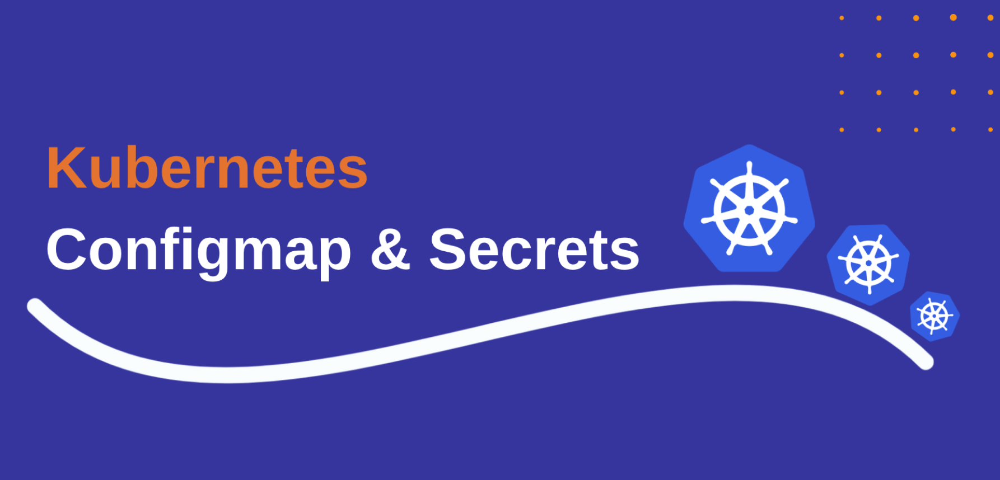

# 11.ConfigMap与Secret

前面我们学习了一些常用的资源对象的使用，但是单纯依靠这些资源对象，还不足以满足我们的日常需求，一个重要的需求就是应用的配置管理、敏感信息的存储和使用（如：密码、Token 等）、安全管控、身份认证等等。




## ConfigMap

对于应用的可变配置在 Kubernetes 中是通过一个 `ConfigMap` 资源对象来实现的，ConfigMap 是一种 API 对象，用来将非机密性的数据保存到键值对中。使用时 Pods 可以将其用作环境变量、命令行参数或者存储卷中的配置文件。ConfigMap 将你的环境配置信息和容器镜像进行解耦，便于应用配置的修改。不过需要注意 ConfigMap 并不提供保密或者加密功能。如果你想存储的数据是机密的，则可以使用 Secret 对象，或者使用其他第三方工具来保证你的数据的私密性，而不是用 ConfigMap。

我们知道许多应用经常会有从配置文件、命令行参数或者环境变量中读取一些配置信息的需求，这些配置信息我们肯定不会直接写死到应用程序中去的，比如你一个应用连接一个 redis 服务，下一次想更换一个了的，还得重新去修改代码，重新制作一个镜像，这肯定是不可取的，而 `ConfigMap` 就给我们提供了向容器中注入配置信息的能力，不仅可以用来保存单个属性，还可以用来保存整个配置文件，比如我们可以用来配置一个 redis 服务的访问地址，也可以用来保存整个 redis 的配置文件等等。

值得注意的是 ConfigMap 虽然也是一个 K8s 资源对象，但是和其他 Kubernetes 对象都有一个 `spec` 属性不同的是，ConfigMap 使用 `data` 和 `binaryData` 字段，这些字段能够接收键值对作为其值，`data` 和 `binaryData` 字段都是可选的，`data` 字段设计用来保存 UTF-8 字符串，而 `binaryData` 则被设计用来保存二进制数据作为 base64 编码的字串。`data` 或 `binaryData` 字段下面的每个键的名称都必须由字母数字字符或者 `-`、`_` 或 `.` 组成，在 `data` 下保存的键名不可以与在 `binaryData` 下出现的键名有重叠。此外从 v1.19 版本开始，我们还可以添加一个 `immutable` 字段到 ConfigMap 对象中，用于创建不可变更的 ConfigMap。


### 创建

`ConfigMap` 资源对象使用 `key-value` 形式的键值对来配置数据，这些数据可以在 Pod 里面使用，如下所示的资源清单：

```yaml
apiVersion: v1
kind: ConfigMap
metadata:
  name: cm-demo
  namespace: default
data:
  data.1: hello
  data.2: world
  config: |
    property.1=value-1
    property.2=value-2
    property.3=value-3
```

其中配置数据在 `data` 属性下面进行配置，前两个被用来保存单个属性，后面一个被用来保存一个配置片段。

我们可以看到 `config` 后面有一个竖线符 `|`，这在 yaml 中表示**保留文本块中的换行符**，每行的缩进和行尾空白都会被去掉，而额外的缩进会被保留。

```yaml
lines: |
  我是第一行
  我是第二行
    我是吴彦祖
      我是第四行
  我是第五行

# JSON
{"lines": "我是第一行\n我是第二行\n  我是吴彦祖\n     我是第四行\n我是第五行\n"}
```

除了竖线之外还可以使用 `>` 右尖括号，用来表示折叠换行，文本块中的换行替换为空格，注意：会保留最后一行的换行符。

```yaml
lines: >
  我是第一行
  我也是第一行
  我仍是第一行
  我依旧是第一行

  我是第二行
  这么巧我也是第二行

# JSON
{"lines": "我是第一行 我也是第一行 我仍是第一行 我依旧是第一行\n我是第二行 这么巧我也是第二行\n"}
```

除了这两个指令之外，我们还可以使用竖线和加号或者减号进行配合使用，`+` 表示保留文本块最后一行的换行，`-` 表示删除字符串最后一行的换行符。

```yaml
value: |
  hello

# {"value": "hello\n"}

value: |-
  hello

# {"value": "hello"}

value: |+
  hello


# {"value": "hello\n\n"} (有多少个回车就有多少个\n)
```

当然同样的我们可以使用 `kubectl create -f xx.yaml` 来创建上面的 `ConfigMap` 对象，但是如果我们不知道怎么创建 `ConfigMap` 的话，不要忘记 `kubectl` 工具是我们最好的帮手，可以使用 `kubectl create configmap -h` 来查看关于创建 `ConfigMap` 的帮助信息：

```shell
Examples:
  # Create a new configmap named my-config based on folder bar
  kubectl create configmap my-config --from-file=path/to/bar

  # Create a new configmap named my-config with specified keys instead of file basenames on disk
  kubectl create configmap my-config --from-file=key1=/path/to/bar/file1.txt --from-file=key2=/path/to/bar/file2.txt

  # Create a new configmap named my-config with key1=config1 and key2=config2
  kubectl create configmap my-config --from-literal=key1=config1 --from-literal=key2=config2
```

我们可以看到可以从一个指定的目录来创建一个 `ConfigMap` 对象，比如我们有一个 `testcm` 的目录，该目录下面包含一些配置文件，redis 和 mysql 的连接信息，如下：

```shell
☸ ➜ ls testcm
redis.conf
mysql.conf

☸ ➜ cat testcm/redis.conf
host=127.0.0.1
port=6379

☸ ➜ cat testcm/mysql.conf
host=127.0.0.1
port=3306
```

然后我们就可以使用 `from-file` 关键字来创建包含这个目录下面所以配置文件的 `ConfigMap`：

```shell
☸ ➜ kubectl create configmap cm-demo1 --from-file=testcm
configmap "cm-demo1" created
```

其中 `from-file` 参数指定在该目录下面的所有文件都会被用在 `ConfigMap` 里面创建一个键值对，键的名字就是文件名，值就是文件的内容。创建完成后，同样我们可以使用如下命令来查看 `ConfigMap` 列表：

```shell
☸ ➜ kubectl get configmap
NAME       DATA      AGE
cm-demo1   2         17s
```

可以看到已经创建了一个 cm-demo1 的 `ConfigMap` 对象，然后可以使用 `describe` 命令查看详细信息：

```shell
☸ ➜ kubectl describe configmap cm-demo1
Name:         cm-demo1
Namespace:    default
Labels:       <none>
Annotations:  <none>

Data
====
mysql.conf:
----
host=127.0.0.1
port=3306
redis.conf:
----
host=127.0.0.1
port=6379

BinaryData
====

Events:  <none>
```

我们可以看到两个 `key` 是 testcm 目录下面的文件名称，对应的 `value` 值就是文件内容，这里值得注意的是如果文件里面的配置信息很大的话，`describe` 的时候可能不会显示对应的值，要查看完整的键值，可以使用如下命令：

```shell
☸ ➜ kubectl get configmap cm-demo1 -o yaml
apiVersion: v1
data:
  mysql.conf: |-
    host=127.0.0.1
    port=3306
  redis.conf: |-
    host=127.0.0.1
    port=6379
kind: ConfigMap
metadata:
  creationTimestamp: "2023-01-07T06:23:39Z"
  name: cm-demo1
  namespace: default
  resourceVersion: "730635"
  uid: 73262763-89b5-4629-954b-0781cdc525fd
```

除了通过文件目录进行创建，我们也可以使用指定的文件进行创建 `ConfigMap`，同样的，以上面的配置文件为例，我们创建一个 redis 的配置的一个单独 `ConfigMap` 对象：

```shell
☸ ➜ kubectl create configmap cm-demo2 --from-file=testcm/redis.conf
configmap "cm-demo2" created
☸ ➜ kubectl get configmap cm-demo2 -o yaml
apiVersion: v1
data:
  redis.conf: |-
    host=127.0.0.1
    port=6379
kind: ConfigMap
metadata:
  creationTimestamp: "2023-01-07T06:24:57Z"
  name: cm-demo2
  namespace: default
  resourceVersion: "730788"
  uid: cbc6bde0-38b3-42e2-83dc-80ee8ca5ade0
```

我们可以看到一个关联 `redis.conf` 文件配置信息的 `ConfigMap` 对象创建成功了，另外值得注意的是 `--from-file` 这个参数可以使用多次，比如我们这里使用两次分别指定 `redis.conf` 和 `mysql.conf` 文件，就和直接指定整个目录是一样的效果了。

另外，通过帮助文档我们可以看到我们还可以直接使用字符串进行创建，通过 `--from-literal` 参数传递配置信息，同样的，这个参数可以使用多次，格式如下：

```shell
☸ ➜ kubectl create configmap cm-demo3 --from-literal=db.host=localhost --from-literal=db.port=3306
configmap "cm-demo3" created
☸ ➜ kubectl get configmap cm-demo3 -o yaml
apiVersion: v1
data:
  db.host: localhost
  db.port: "3306"
kind: ConfigMap
metadata:
  creationTimestamp: "2023-01-07T06:25:57Z"
  name: cm-demo3
  namespace: default
  resourceVersion: "730891"
  uid: 23756c48-3872-49a2-8364-9c0123056bbb
```


### 使用

`ConfigMap` 创建成功了，那么我们应该怎么在 Pod 中来使用呢？我们可以使用四种方式来使用 ConfigMap 配置 Pod 中的容器：

- 在容器命令和参数内
- 容器的环境变量
- 在只读卷里面添加一个文件，让应用来读取
- 编写代码在 Pod 中运行，使用 Kubernetes API 来读取 ConfigMap

这些不同的方法适用于不同的数据使用方式，对前三个方法，kubelet 会使用 ConfigMap 中的数据在 Pod 中启动容器。第四种方法需要编写代码才能读取 ConfigMap 数据。

首先，我们使用 `ConfigMap` 来填充我们的环境变量，如下所示的 Pod 资源对象：

```yaml
apiVersion: v1
kind: Pod
metadata:
  name: testcm1-pod
spec:
  containers:
    - name: testcm1
      image: busybox
      command: ["/bin/sh", "-c", "env"]
      env:
        - name: DB_HOST
          valueFrom:
            configMapKeyRef:
              name: cm-demo3
              key: db.host
        - name: DB_PORT
          valueFrom:
            configMapKeyRef:
              name: cm-demo3
              key: db.port
      envFrom:
        - configMapRef:
            name: cm-demo1
```

这个 Pod 运行后会输出如下所示的信息：

```shell
☸ ➜ kubectl logs testcm1-pod
......
DB_HOST=localhost
DB_PORT=3306
mysql.conf=host=127.0.0.1
port=3306
redis.conf=host=127.0.0.1
port=6379
......
```

我们可以看到 `DB_HOST` 和 `DB_PORT` 都已经正常输出了，另外的环境变量是因为我们这里直接把 `cm-demo1` 给注入进来了，所以把他们的整个键值给输出出来了，这也是符合预期的。

另外我们也可以使用 `ConfigMap` 来设置命令行参数，`ConfigMap` 也可以被用来设置容器中的命令或者参数值，如下 Pod:

```yaml
apiVersion: v1
kind: Pod
metadata:
  name: testcm2-pod
spec:
  containers:
    - name: testcm2
      image: busybox
      command: ["/bin/sh", "-c", "echo $(DB_HOST) $(DB_PORT)"]
      env:
        - name: DB_HOST
          valueFrom:
            configMapKeyRef:
              name: cm-demo3
              key: db.host
        - name: DB_PORT
          valueFrom:
            configMapKeyRef:
              name: cm-demo3
              key: db.port
```

运行这个 Pod 后会输出如下信息：

```shell
☸ ➜ kubectl logs testcm2-pod
localhost 3306
```

另外一种是非常常见的使用 `ConfigMap` 的方式：通过**数据卷**使用，在数据卷里面使用 ConfigMap，就是将文件填入数据卷，在这个文件中，键就是文件名，键值就是文件内容，如下资源对象所示：

```yaml
apiVersion: v1
kind: Pod
metadata:
  name: testcm3-pod
spec:
  volumes:
    - name: config-volume
      configMap:
        name: cm-demo2
  containers:
    - name: testcm3
      image: busybox
      command: ["/bin/sh", "-c", "cat /etc/config/redis.conf"]
      volumeMounts:
        - name: config-volume
          mountPath: /etc/config
```

运行这个 Pod 的，查看日志：

```shell
☸ ➜ kubectl logs testcm3-pod
host=127.0.0.1
port=6379
```

当然我们也可以在 `ConfigMap` 值被映射的数据卷里去控制路径，如下 Pod 定义：

```yaml
apiVersion: v1
kind: Pod
metadata:
  name: testcm4-pod
spec:
  volumes:
    - name: config-volume
      configMap:
        name: cm-demo1
        items:
          - key: mysql.conf
            path: path/to/msyql.conf
  containers:
    - name: testcm4
      image: busybox
      command: ["/bin/sh", "-c", "cat /etc/config/path/to/msyql.conf"]
      volumeMounts:
        - name: config-volume
          mountPath: /etc/config
```

运行这个 Pod 的，查看日志：

```shell
☸ ➜ kubectl logs testcm4-pod
host=127.0.0.1
port=3306
```

另外需要注意的是，当 `ConfigMap` 以数据卷的形式挂载进 `Pod` 的时，这时更新 `ConfigMap（或删掉重建ConfigMap）`，Pod 内挂载的配置信息会热更新。kubelet 组件会在每次周期性同步时检查所挂载的 `ConfigMap` 是否为最新。这时可以增加一些监测配置文件变更的脚本，然后重加载对应服务就可以实现应用的热更新。以环境变量方式使用的 `ConfigMap` 数据不会被自动更新，更新这些数据需要重新启动 Pod。

> 只有通过 Kubernetes API 创建的 Pod 才能使用 `ConfigMap`，其他方式创建的（比如静态 Pod）不能使用；ConfigMap 文件大小限制为 `1MB`（ETCD 的要求）。


### 使用 subPath

上面我们介绍了可以将 `ConfigMap` 以数据卷的形式挂载到容器中去，但是如果原本容器目录下已经有一些文件或者数据，将数据挂载进去后便会覆盖容器目录下的数据，这个时候我们可以指定 `volumeMounts.subPath` 属性来指定卷内的子路径，而不是其根路径。

比如我们将一个 Nginx 容器的配置放置到一个 `ConfigMap` 对象中来进行管理：

```yaml
# nginx-config.yaml
apiVersion: v1
kind: ConfigMap
metadata:
  name: nginx-config
data:
  nginx.conf: |
    user  nginx;
    worker_processes  1;

    error_log  /var/log/nginx/error.log warn;
    pid        /var/run/nginx.pid;

    events {
        worker_connections  1024;
    }

    http {
        include       /etc/nginx/mime.types;
        default_type  application/octet-stream;

        log_format  main  '$remote_addr - $remote_user [$time_local] "$request" '
                          '$status $body_bytes_sent "$http_referer" '
                          '"$http_user_agent" "$http_x_forwarded_for"';

        access_log  /var/log/nginx/access.log  main;

        sendfile        on;
        keepalive_timeout  65;
        include /etc/nginx/conf.d/*.conf;
    }
```

然后我们将上面的配置文件挂载到容器中去使用，创建如下所示的一个资源对象：

```yaml
# nginx-deploy.yaml
apiVersion: apps/v1
kind: Deployment
metadata:
  name: nginx
spec:
  selector:
    matchLabels:
      app: nginx
  template:
    metadata:
      labels:
        app: nginx
    spec:
      containers:
        - name: web
          image: nginx:1.7.9
          ports:
            - containerPort: 80
          volumeMounts:
            - name: config
              mountPath: /etc/nginx
      volumes:
        - name: config
          configMap:
            name: nginx-config
            items:
              - key: nginx.conf
                path: nginx.conf
```

按照我们的想法是将 `ConfigMap` 中的 `nginx.conf` 挂载到容器的 `/etc/nginx` 目录下面去，但是该目录下面原本已经有很多文件了，所以用上面的方式会将该目录中的数据覆盖掉，这样就会导致我们的 Nginx 应用启动失败。

```bash
☸ ➜ kubectl apply -f nginx-config.yaml
configmap/nginx-config created
☸ ➜ k8strain4 kubectl apply -f nginx-deploy.yaml
deployment.apps/nginx created
☸ ➜ kubectl get pods -l app=nginx
NAME                     READY   STATUS             RESTARTS      AGE
nginx-5456544546-w66kw   0/1     CrashLoopBackOff   2 (17s ago)   32s
☸ ➜ kubectl logs -f nginx-5456544546-w66kw
2023/01/07 07:25:15 [emerg] 1#0: open() "/etc/nginx/mime.types" failed (2: No such file or directory) in /etc/nginx/nginx.conf:12
nginx: [emerg] open() "/etc/nginx/mime.types" failed (2: No such file or directory) in /etc/nginx/nginx.conf:12
```

我们只需要在容器的 `volumeMounts` 中通过 `subPath` 指定下子路径即可：

```yaml
volumeMounts:
  - name: config
    mountPath: /etc/nginx/nginx.conf
    subPath: nginx.conf
```

更新后我们的容器就可以正常启动了：

```bash
☸ ➜ kubectl get pods -l app=nginx
NAME                     READY   STATUS    RESTARTS   AGE
nginx-7498977d8c-s4v97   1/1     Running   0          2s
```

除此之外我们还可以使用带有扩展环境变量的 `subPath`，该功能在 v1.17 版本已经进行稳定状态了，通过使用 `subPathExpr` 字段可以基于 downward API 环境变量来构造 `subPath` 目录名，不过需要注意 `subPath` 和 `subPathExpr` 属性是互斥的。

我们经常有在容器中创建以 Pod 名为路径的目录来保存日志数据，我们就可以使用该特性来实现。比如我们在 Pod 中使用 `subPathExpr` 在 `hostPath` 卷的 `/var/log` 中创建目录 `pod1`，`hostPath` 卷采用来自 downward API 的 Pod 名称生成目录名，然后宿主机目录 `/var/log/pod1` 被挂载到容器的 `/logs` 中。如下资源对象所示：

```yaml
apiVersion: v1
kind: Pod
metadata:
  name: pod1
spec:
  containers:
    - name: container1
      env:
        - name: POD_NAME
          valueFrom:
            fieldRef:
              apiVersion: v1
              fieldPath: metadata.name
      image: busybox:1.28
      command:
        [
          "sh",
          "-c",
          "while true; do echo 'Hello' >> /logs/hello.txt; sleep 1; done",
        ]
      volumeMounts:
        - name: log
          mountPath: /logs
          subPathExpr: $(POD_NAME) # 包裹变量名的是小括号，而不是大括号
  restartPolicy: Never
  volumes:
    - name: log
      hostPath:
        path: /var/log
```

当我们创建上面的资源对象后会通过 downward api 获取到 `POD_NAME` 环境变量的值为 `pod1`，然后通过 `subPathExpr` 会在宿主机的 `/var/log` 目录下面创建 `pod1` 子目录，然后和容器中的 `/logs` 目录进行映射，所以最终日志数据会出现在宿主机的 `/var/log/pod1` 目录下面。

```bash
☸ ➜ kubectl get pods -o wide
NAME                                                    READY   STATUS    RESTARTS      AGE     IP           NODE          NOMINATED NODE   READINESS GATES
pod1                                                    1/1     Running   0             2m5s    10.244.1.8   demo-worker   <none>           <none>
# demo-worker 节点上查看
# tail -f /var/log/pod1/hello.txt
Hello
Hello
Hello
Hello
Hello
```


### 不可变更的 ConfigMap

Kubernetes 特性 Immutable Secret 和 ConfigMaps 提供了一种将各个 Secret 和 ConfigMap 设置为不可变更的选项。对于大量使用 ConfigMap 的集群（至少有数万个各不相同的 ConfigMap 给 Pod 挂载）而言，禁止更改 ConfigMap 的数据有以下好处：

- 保护应用，使之免受意外（不想要的）更新所带来的负面影响。
- 通过大幅降低对 kube-apiserver 的压力提升集群性能，这是因为系统会关闭对已标记为不可变更的 ConfigMap 的 watch 操作。

此功能在 v1.21 版本就已经是稳定的特性了，可以通过 `ImmutableEphemeralVolumes` 特性门控来控制，我们只需要通过将 `immutable` 字段设置为 true 即可创建不可变更的 ConfigMap，例如：

```yaml
# immu-cm.yaml
apiVersion: v1
kind: ConfigMap
metadata:
  name: immu-cm
data:
  mysql.conf: |-
    host=127.0.0.1
    port=3306
immutable: true
```

一旦某 ConfigMap 被标记为不可变更，则无法逆转这一变化，也无法更改 `data` 或 `binaryData` 字段的内容，只能删除并重建 `ConfigMap`。因为现有的 Pod 会维护一个已被删除的 ConfigMap 的挂载点，建议重新创建这些 Pods。

当我们修改上面的 ConfigMap 数据内容后，重新更新该对象就会出现如下所示的错误信息：

```bash
☸ ➜ kubectl apply -f immu-cm.yaml
The ConfigMap "immu-cm" is invalid: data: Forbidden: field is immutable when `immutable` is set
```


## Secret

`ConfigMap` 这个资源对象是 Kubernetes 当中非常重要的一个资源对象，一般情况下 ConfigMap 是用来存储一些非安全的配置信息，如果涉及到一些安全相关的数据的话用 ConfigMap 就非常不妥了，因为 ConfigMap 是明文存储的，这个时候我们就需要用到另外一个资源对象了：`Secret`，`Secret` 用来保存敏感信息，例如密码、OAuth 令牌和 ssh key 等等，将这些信息放在 `Secret` 中比放在 Pod 的定义中或者 Docker 镜像中要更加安全和灵活。

`Secret` 主要使用的有以下几种类型：

- `Opaque`：base64 编码格式的 Secret，用来存储密码、密钥等；但数据也可以通过 `base64 –decode` 解码得到原始数据，所有加密性很弱。
- `kubernetes.io/dockercfg`: `~/.dockercfg` 文件的序列化形式
- `kubernetes.io/dockerconfigjson`：用来存储私有 `docker registry` 的认证信息，`~/.docker/config.json` 文件的序列化形式
- `kubernetes.io/service-account-token`：用于 `ServiceAccount`
- `kubernetes.io/ssh-auth`：用于 SSH 身份认证的凭据
- `kubernetes.io/basic-auth`：用于基本身份认证的凭据
- `bootstrap.kubernetes.io/token`：用于启动引导令牌数据

> 上面是 Secret 对象内置支持的几种类型，通过为 Secret 对象的 type 字段设置一个非空的字符串值，也可以定义并使用自己 Secret 类型，如果 type 值为空字符串，则被视为 Opaque 类型。Kubernetes 并不对类型的名称作任何限制。


需要注意的是默认情况下，Kubernetes Secret 未加密存储在 APIServer 的底层数据存储 etcd 中，任何拥有 API 访问权限的人都可以检索或修改 Secret，任何有权访问 etcd 的人也可以。此外，任何有权限在命名空间中创建 Pod 的人都可以使用该访问权限读取该命名空间中的任何 Secret。为了更安全地使用 Secret，我们可以执行以下步骤来加强安全：

- 为 Secret 启用静态加密。
- 以最小特权访问 Secret 并启用或配置 RBAC 规则。
- 限制 Secret 对特定容器的访问。
- 考虑使用外部 Secret 存储驱动。

在后续课程中我们也会陆续接触到这些方案。


### Opaque Secret

`Secret` 资源包含 2 个键值对： `data` 和 `stringData`，`data` 字段用来存储 base64 编码的任意数据，提供 `stringData` 字段是为了方便，它允许 Secret 使用未编码的字符串。`data` 和 `stringData` 的键必须由字母、数字、`-`，`_` 或 `.` 组成。

比如我们来创建一个用户名为 `admin`，密码为 `admin321` 的 `Secret` 对象，首先我们需要先把用户名和密码做 `base64` 编码：

```shell
☸ ➜ echo -n "admin" | base64
YWRtaW4=
☸ ➜ echo -n "admin321" | base64
YWRtaW4zMjE=
```

然后我们就可以利用上面编码过后的数据来编写一个 YAML 文件：

```yaml
# secret-demo.yaml
apiVersion: v1
kind: Secret
metadata:
  name: mysecret
type: Opaque
data:
  username: YWRtaW4=
  password: YWRtaW4zMjE=
```

然后我们就可以使用 kubectl 命令来创建了：

```shell
☸ ➜ kubectl apply -f secret-demo.yaml
secret "mysecret" created
```

利用 `get secret` 命令查看：

```shell
☸ ➜ kubectl get secret
NAME                  TYPE                                  DATA      AGE
mysecret              Opaque                                2         40s
```

我们可以使用 `describe` 命令查看详情：

```shell
☸ ➜ kubectl describe secret mysecret
Name:         mysecret
Namespace:    default
Labels:       <none>
Annotations:  <none>

Type:  Opaque

Data
====
password:  8 bytes
username:  5 bytes
```

我们可以看到利用 describe 命令查看到的 Data 没有直接显示出来，如果想看到 Data 里面的详细信息，同样我们可以输出成 YAML 文件进行查看：

```shell
☸ ➜ kubectl get secret mysecret -o yaml
apiVersion: v1
data:
  password: YWRtaW4zMjE=
  username: YWRtaW4=
kind: Secret
# ......
```

对于某些场景，你可能希望使用 `stringData` 字段，这字段可以将一个非 base64 编码的字符串直接放入 Secret 中， 当创建或更新该 Secret 时，此字段将被编码。

比如当我们部署应用时，使用 Secret 存储配置文件， 你希望在部署过程中，填入部分内容到该配置文件。例如，如果你的应用程序使用以下配置文件:

```yaml
apiUrl: "https://my.api.com/api/v1"
username: "<user>"
password: "<password>"
```

那么我们就可以使用以下定义将其存储在 Secret 中:

```yaml
apiVersion: v1
kind: Secret
metadata:
  name: mysecret
type: Opaque
stringData:
  config.yaml: |
    apiUrl: "https://my.api.com/api/v1"
    username: <user>
    password: <password>
```

比如我们直接创建上面的对象后重新获取对象的话 `config.yaml` 的值会被编码：

```shell
☸ ➜ kubectl get secret mysecret -o yaml
apiVersion: v1
data:
  config.yaml: YXBpVXJsOiAiaHR0cHM6Ly9teS5hcGkuY29tL2FwaS92MSIKdXNlcm5hbWU6IDx1c2VyPgpwYXNzd29yZDogPHBhc3N3b3JkPgo=
kind: Secret
metadata:
  name: mysecret
  namespace: default
  resourceVersion: "857340"
  uid: 5a28d296-5f53-4e4c-92f3-c1d7c952ace2
type: Opaque
```

创建好 `Secret` 对象后，有两种方式来使用它：

- 以环境变量的形式
- 以 Volume 的形式挂载


### 环境变量

首先我们来测试下环境变量的方式，同样的，我们来使用一个简单的 busybox 镜像来测试下:

```yaml
# secret1-pod.yaml
apiVersion: v1
kind: Pod
metadata:
  name: secret1-pod
spec:
  containers:
    - name: secret1
      image: busybox
      command: ["/bin/sh", "-c", "env"]
      env:
        - name: USERNAME
          valueFrom:
            secretKeyRef:
              name: mysecret
              key: username
        - name: PASSWORD
          valueFrom:
            secretKeyRef:
              name: mysecret
              key: password
```

主要需要注意的是上面环境变量中定义的 `secretKeyRef` 字段，和我们前文的 `configMapKeyRef` 类似，一个是从 `Secret` 对象中获取，一个是从 `ConfigMap` 对象中获取，创建上面的 Pod：

```shell
☸ ➜ kubectl create -f secret1-pod.yaml
pod "secret1-pod" created
```

然后我们查看 Pod 的日志输出：

```shell
☸ ➜ kubectl logs secret1-pod
...
USERNAME=admin
PASSWORD=admin321
...
```

可以看到有 USERNAME 和 PASSWORD 两个环境变量输出出来。


### Volume 挂载

同样的我们用一个 Pod 来验证下 `Volume` 挂载，创建一个 Pod 文件：

```yaml
# secret2-pod.yaml
apiVersion: v1
kind: Pod
metadata:
  name: secret2-pod
spec:
  containers:
    - name: secret2
      image: busybox
      command: ["/bin/sh", "-c", "ls /etc/secrets"]
      volumeMounts:
        - name: secrets
          mountPath: /etc/secrets
  volumes:
    - name: secrets
      secret:
        secretName: mysecret
```

创建 Pod，然后查看输出日志：

```shell
☸ ➜ kubectl create -f secret-pod2.yaml
pod "secret2-pod" created
☸ ➜ kubectl logs secret2-pod
password
username
```

可以看到 Secret 把两个 key 挂载成了两个对应的文件。当然如果想要挂载到指定的文件上面，是不是也可以使用前面 ConfigMap 的方法：在 `secretName` 下面添加 `items` 指定 `key` 和 `path`。


### kubernetes.io/dockerconfigjson

除了上面的 `Opaque` 这种类型外，我们还可以来创建用户 `docker registry` 认证的 `Secret`，直接使用``kubectl create` 命令创建即可，如下：

```shell
☸ ➜ kubectl create secret docker-registry myregistry --docker-server=DOCKER_SERVER --docker-username=DOCKER_USER --docker-password=DOCKER_PASSWORD --docker-email=DOCKER_EMAIL
secret "myregistry" created
```

除了上面这种方法之外，我们也可以通过指定文件的方式来创建镜像仓库认证信息，需要注意对应的 `KEY` 和 `TYPE`：

```shell
kubectl create secret generic myregistry --from-file=.dockerconfigjson=/root/.docker/config.json --type=kubernetes.io/dockerconfigjson
```

然后查看 Secret 列表：

```shell
☸ ➜ kubectl get secret
NAME                  TYPE                                  DATA      AGE
myregistry            kubernetes.io/dockerconfigjson        1         15s
mysecret              Opaque                                2         34m
```

注意看上面的 TYPE 类型，`myregistry` 对应的是 `kubernetes.io/dockerconfigjson`，同样的可以使用 describe 命令来查看详细信息：

```shell
☸ ➜ kubectl describe secret myregistry
Name:         myregistry
Namespace:    default
Labels:       <none>
Annotations:  <none>

Type:  kubernetes.io/dockerconfigjson

Data
====
.dockerconfigjson:  152 bytes
```

同样的可以看到 Data 区域没有直接展示出来，如果想查看的话可以使用 `-o yaml` 来输出展示出来：

```shell
☸ ➜ kubectl get secret myregistry -o yaml
apiVersion: v1
data:
  .dockerconfigjson: eyJhdXRocyI6eyJET0NLRVJfU0VSVkVSIjp7InVzZXJuYW1lIjoiRE9DS0VSX1VTRVIiLCJwYXNzd29yZCI6IkRPQ0tFUl9QQVNTV09SRCIsImVtYWlsIjoiRE9DS0VSX0VNQUlMIiwiYXV0aCI6IlJFOURTMFZTWDFWVFJWSTZSRTlEUzBWU1gxQkJVMU5YVDFKRSJ9fX0=
kind: Secret
metadata:
  name: myregistry
  namespace: default
type: kubernetes.io/dockerconfigjson
```

可以把上面的 `data.dockerconfigjson` 下面的数据做一个 `base64` 解码，看看里面的数据是怎样的呢？

```shell
☸ ➜ echo eyJhdXRocyI6eyJET0NLRVJfU0VSVkVSIjp7InVzZXJuYW1lIjoiRE9DS0VSX1VTRVIiLCJwYXNzd29yZCI6IkRPQ0tFUl9QQVNTV09SRCIsImVtYWlsIjoiRE9DS0VSX0VNQUlMIiwiYXV0aCI6IlJFOURTMFZTWDFWVFJWSTZSRTlEUzBWU1gxQkJVMU5YVDFKRSJ9fX0= | base64 -d
{"auths":{"DOCKER_SERVER":{"username":"DOCKER_USER","password":"DOCKER_PASSWORD","email":"DOCKER_EMAIL","auth":"RE9DS0VSX1VTRVI6RE9DS0VSX1BBU1NXT1JE"}}}
```

如果我们需要拉取私有仓库中的 Docker 镜像的话就需要使用到上面的 `myregistry` 这个 `Secret`：

```shell
apiVersion: v1
kind: Pod
metadata:
  name: foo
spec:
  containers:
  - name: foo
    image: 192.168.1.100:5000/test:v1
  imagePullSecrets:
  - name: myregistry
```

> `ImagePullSecrets` 与 `Secrets` 不同，因为 `Secrets` 可以挂载到 Pod 中，但是 `ImagePullSecrets` 只能由 Kubelet 访问。


我们需要拉取私有仓库镜像 `192.168.1.100:5000/test:v1`，我们就需要针对该私有仓库来创建一个如上的 `Secret`，然后在 Pod 中指定 `imagePullSecrets`。

除了设置 `Pod.spec.imagePullSecrets` 这种方式来获取私有镜像之外，我们还可以通过在 `ServiceAccount` 中设置 `imagePullSecrets`，然后就会自动为使用该 SA 的 Pod 注入 `imagePullSecrets` 信息：

```yaml
apiVersion: v1
kind: ServiceAccount
metadata:
  name: default
  namespace: default
secrets:
  - name: default-token-5tsh4
imagePullSecrets:
  - name: myregistry
```


### kubernetes.io/basic-auth

该类型用来存放用于基本身份认证所需的凭据信息，使用这种 Secret 类型时，Secret 的 data 字段（不一定）必须包含以下两个键（相当于是约定俗成的一个规定）：

- `username`: 用于身份认证的用户名
- `password`: 用于身份认证的密码或令牌

以上两个键的键值都是 `base64` 编码的字符串。 然你也可以在创建 Secret 时使用 `stringData` 字段来提供明文形式的内容。下面的 YAML 是基本身份认证 Secret 的一个示例清单：

```yaml
apiVersion: v1
kind: Secret
metadata:
  name: secret-basic-auth
type: kubernetes.io/basic-auth
stringData:
  username: admin
  password: admin321
```

提供基本身份认证类型的 Secret 仅仅是出于用户方便性考虑，我们也可以使用 Opaque 类型来保存用于基本身份认证的凭据，不过使用内置的 Secret 类型的有助于对凭据格式进行统一处理。


### kubernetes.io/ssh-auth

该类型用来存放 SSH 身份认证中所需要的凭据，使用这种 Secret 类型时，你就不一定必须在其 data（或 stringData）字段中提供一个 `ssh-privatekey` 键值对，作为要使用的 SSH 凭据。

如下所示是一个 SSH 身份认证 Secret 的配置示例：

```yaml
apiVersion: v1
kind: Secret
metadata:
  name: secret-ssh-auth
type: kubernetes.io/ssh-auth
data:
  ssh-privatekey: |
    MIIEpQIBAAKCAQEAulqb/Y ...
```

同样提供 SSH 身份认证类型的 Secret 也仅仅是出于用户方便性考虑，我们也可以使用 Opaque 类型来保存用于 SSH 身份认证的凭据，只是使用内置的 Secret 类型的有助于对凭据格式进行统一处理。


### kubernetes.io/tls

该类型用来存放证书及其相关密钥（通常用在 TLS 场合）。此类数据主要提供给 Ingress 资源，用以校验 TLS 链接，当使用此类型的 Secret 时，Secret 配置中的 data （或 stringData）字段必须包含 `tls.key` 和 `tls.crt`主键。下面的 YAML 包含一个 TLS Secret 的配置示例：

```yaml
apiVersion: v1
kind: Secret
metadata:
  name: secret-tls
type: kubernetes.io/tls
data:
  tls.crt: |
    MIIC2DCCAcCgAwIBAgIBATANBgkqh ...
  tls.key: |
    MIIEpgIBAAKCAQEA7yn3bRHQ5FHMQ ...
```

提供 TLS 类型的 Secret 仅仅是出于用户方便性考虑，我们也可以使用 Opaque 类型来保存用于 TLS 服务器与/或客户端的凭据。不过，使用内置的 Secret 类型的有助于对凭据格式进行统一化处理。当使用 kubectl 来创建 TLS Secret 时，我们可以像下面的例子一样使用 tls 子命令：

```shell
☸ ➜ kubectl create secret tls my-tls-secret \
  --cert=path/to/cert/file \
  --key=path/to/key/file
```

需要注意的是用于 `--cert` 的公钥证书必须是 `.PEM` 编码的 （Base64 编码的 DER 格式），且与 `--key` 所给定的私钥匹配，私钥必须是通常所说的 PEM 私钥格式，且未加密。对这两个文件而言，PEM 格式数据的第一行和最后一行（例如，证书所对应的 `--------BEGIN CERTIFICATE-----` 和 `-------END CERTIFICATE----`）都不会包含在其中。


### kubernetes.io/service-account-token

另外一种 `Secret` 类型就是 `kubernetes.io/service-account-token`，用于被 `ServiceAccount` 引用。

从 v1.22 版本开始，这种类型的 Secret 不再被用来向 Pod 中加载凭据数据，现在可以通过 TokenRequest API 来获得令牌，而不是使用服务账号令牌 Secret 对象。 通过 TokenRequest API 获得的令牌比保存在 Secret 对象中的令牌更加安全，因为这些令牌有着被限定的生命期，并且不会被其他 API 客户端读取，我们可以使用 `kubectl create token` 命令调用 TokenRequest API 获得令牌。

只有在你无法使用 TokenRequest API 来获取令牌，并且你能够接受因为将永不过期的令牌凭据写入到可读取的 API 对象而带来的安全风险时，才应该创建服务账号令牌 Secret 对象。

使用这种 Secret 类型时，你需要确保对象的注解 `kubernetes.io/service-account-name` 被设置为某个已有的 ServiceAccount 名称。如果你同时负责 ServiceAccount 和 Secret 对象的创建，应该先创建 ServiceAccount 对象。

当 Secret 对象被创建之后，某个 Kubernetes 控制器会填写 Secret 的其它字段，例如 `kubernetes.io/service-account.uid` 注解以及 `data` 字段中的 token 键值，使之包含实际的令牌内容。

下面的配置实例声明了一个 ServiceAccount 令牌 Secret：

```yaml
apiVersion: v1
kind: Secret
metadata:
  name: secret-sa-sample
  annotations:
    kubernetes.io/service-account.name: "sa-name"
type: kubernetes.io/service-account-token
data:
  # 你可以像 Opaque Secret 一样在这里添加额外的键/值对
  extra: YmFyCg==
```

创建了 Secret 之后，等待 Kubernetes 在 `data` 字段中填充 token 主键，关于 ServiceAccount 的工作原理将在后面的章节深入学习。


## Secret vs ConfigMap

最后我们来对比下 `Secret` 和 `ConfigMap` 这两种资源对象的异同点：


### 相同点

- key/value 的形式
- 属于某个特定的命名空间
- 可以导出到环境变量
- 可以通过目录/文件形式挂载
- 通过 volume 挂载的配置信息均可热更新


### 不同点

- Secret 可以被 ServerAccount 关联
- Secret 可以存储 `docker register` 的鉴权信息，用在 `ImagePullSecret` 参数中，用于拉取私有仓库的镜像
- Secret 支持 `Base64` 加密
- Secret 分为 `kubernetes.io/service-account-token`、`kubernetes.io/dockerconfigjson`、`Opaque` 等多种类型，而 `Configmap` 不区分类型

> 同样 Secret 文件大小限制为 `1MB`（ETCD 的要求）；Secret 虽然采用 `Base64` 编码，但是我们还是可以很方便解码获取到原始信息，所以对于非常重要的数据还是需要慎重考虑，可以考虑使用 [Vault](https://www.vaultproject.io/) 来进行加密管理。


> 原文: <https://www.yuque.com/cnych/k8s4/nkodsknvqqhlqh4y>