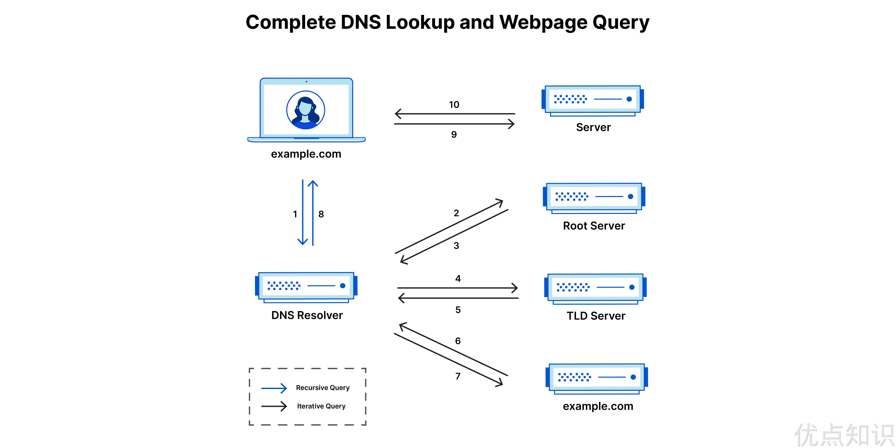
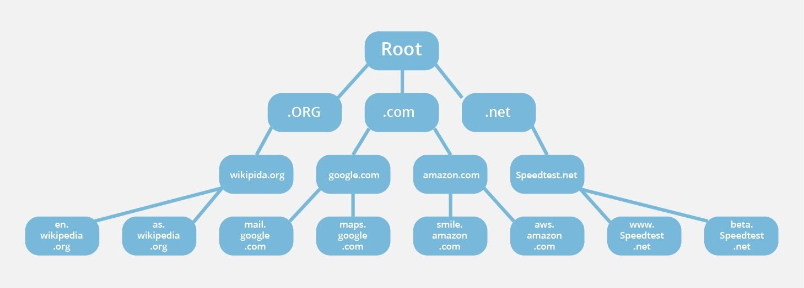

# 15.服务发现

前面我们讲解了 Service 的用法，我们可以通过 Service 生成的 ClusterIP(VIP) 来访问 Pod 提供的服务，但是在使用的时候还有一个问题：我们怎么知道某个应用的 VIP 呢？比如我们有两个应用，一个是 api 应用，一个是 db 应用，两个应用都是通过 Deployment 进行管理的，并且都通过 Service 暴露出了端口提供服务。api 需要连接到 db 这个应用，我们只知道 db 应用的名称和 db 对应的 Service 的名称，但是并不知道它的 VIP 地址，如果我们知道了 VIP 的地址是不是就行了？


## 环境变量

为了解决上面的问题，在之前的版本中，Kubernetes 采用了环境变量的方法，每个 Pod 启动的时候，会通过环境变量设置所有服务的 IP 和 port 信息，这样 Pod 中的应用可以通过读取环境变量来获取依赖服务的地址信息，这种方法使用起来相对简单，但是有一个很大的问题就是依赖的服务必须在 Pod 启动之前就存在，不然是不会被注入到环境变量中的。比如我们首先创建一个 Nginx 服务：

```yaml
# test-nginx.yaml
apiVersion: apps/v1
kind: Deployment
metadata:
  name: nginx-deploy
spec:
  replicas: 2
  selector:
    matchLabels:
      app: nginx
  template:
    metadata:
      labels:
        app: nginx
    spec:
      containers:
        - name: nginx
          image: nginx:1.7.9
          ports:
            - containerPort: 80
---
apiVersion: v1
kind: Service
metadata:
  name: nginx-service
  labels:
    name: nginx-service
spec:
  ports:
    - port: 5000
      targetPort: 80
  selector:
    app: nginx
```

创建上面的服务：

```shell
☸ ➜ kubectl apply -f test-nginx.yaml
deployment.apps "nginx-deploy" created
service "nginx-service" created
☸ ➜ kubectl get pods
NAME                                      READY     STATUS    RESTARTS   AGE
...
nginx-deploy-75675f5897-47h4t             1/1       Running   0          53s
nginx-deploy-75675f5897-mmm8w             1/1       Running   0          53s
...
☸ ➜ kubectl get svc
NAME            TYPE        CLUSTER-IP       EXTERNAL-IP   PORT(S)          AGE
...
nginx-service   ClusterIP   10.107.225.42    <none>        5000/TCP         1m
...
```

我们可以看到两个 Pod 和一个名为 nginx-service 的服务创建成功了，该 Service 监听的端口是 5000，同时它会把流量转发给它代理的所有 Pod（我们这里就是拥有 `app: nginx` 标签的两个 Pod）。

现在我们再来创建一个普通的 Pod，观察下该 Pod 中的环境变量是否包含上面的 `nginx-service` 的服务信息：

```yaml
# test-pod.yaml
apiVersion: v1
kind: Pod
metadata:
  name: test-pod
spec:
  containers:
    - name: test-service-pod
      image: busybox
      command: ["/bin/sh", "-c", "env"]
```

然后创建该测试的 Pod：

```shell
☸ ➜ kubectl apply -f test-pod.yaml
pod "test-pod" created
```

等 Pod 创建完成后，我们查看日志信息：

```shell
☸ ➜ kubectl logs test-pod
...
KUBERNETES_PORT=tcp://10.96.0.1:443
KUBERNETES_SERVICE_PORT=443
HOSTNAME=test-pod
HOME=/root
NGINX_SERVICE_PORT_5000_TCP_ADDR=10.107.225.42
NGINX_SERVICE_PORT_5000_TCP_PORT=5000
NGINX_SERVICE_PORT_5000_TCP_PROTO=tcp
KUBERNETES_PORT_443_TCP_ADDR=10.96.0.1
PATH=/usr/local/sbin:/usr/local/bin:/usr/sbin:/usr/bin:/sbin:/bin
NGINX_SERVICE_SERVICE_HOST=10.107.225.42
NGINX_SERVICE_PORT_5000_TCP=tcp://10.107.225.42:5000
KUBERNETES_PORT_443_TCP_PORT=443
KUBERNETES_PORT_443_TCP_PROTO=tcp
NGINX_SERVICE_SERVICE_PORT=5000
NGINX_SERVICE_PORT=tcp://10.107.225.42:5000
KUBERNETES_SERVICE_PORT_HTTPS=443
KUBERNETES_PORT_443_TCP=tcp://10.96.0.1:443
KUBERNETES_SERVICE_HOST=10.96.0.1
PWD=/
...
```

我们可以看到打印了很多环境变量信息，其中就包括我们刚刚创建的 nginx-service 这个服务，有 HOST、PORT、PROTO、ADDR 等，也包括其他已经存在的 Service 的环境变量，现在如果我们需要在这个 Pod 里面访问 nginx-service 的服务，我们是不是可以直接通过 `NGINX_SERVICE_SERVICE_HOST` 和 `NGINX_SERVICE_SERVICE_PORT` 就可以了，但是如果这个 Pod 启动起来的时候 nginx-service 服务还没启动起来，在环境变量中我们是无法获取到这些信息的，当然我们可以通过 `initContainer` 之类的方法来确保 nginx-service 启动后再启动 Pod，但是这种方法毕竟增加了 Pod 启动的复杂性，所以这不是最优的方法，局限性太多了。


## DNS

DNS 其实就是一个分布式的树状命名系统，它就像一个去中心化的分布式数据库，存储着从域名到 IP 地址的映射。当一台主机想要通过域名访问某个服务的内容时，需要先通过当前域名获取对应的 IP 地址，这时就需要通过一个 DNS 解析器负责域名的解析。


### DNS 解析过程

所有 DNS 服务器都属于以下四个类别之一：**递归解析器**、**根域名服务器**、**顶级域名服务器**和**权威性域名服务器**。在典型 DNS 查找中（当没有正在进行的高速缓存时），这四个 DNS 服务器协同工作来完成将指定域的 IP 地址提供给客户端的任务（客户端通常是一个存根解析器 - 内置于操作系统的简单解析器）。

- DNS 解析器 - 该解析器可被视为被要求去图书馆的某个地方查找特定图书的图书馆员。DNS 解析器是一种服务器，旨在通过 Web 浏览器等应用程序接收客户端计算机的查询。然后，解析器一般负责发出其他请求，以便满足客户端的 DNS 查询。
- 根域名服务器 - 根域名服务器是将人类可读的主机名解析为 IP 地址的第一步，可将其视为指向不同书架的图书馆中的索引。
- TLD 域名服务器 - 顶级域服务器（TLD）可被视为图书馆中的特定书架，此域名服务器是搜索特定 IP 地址的下一步，其托管主机名的最后一部分（比如在 `example.com` 中，TLD 服务器为 `com`）。
- 权威性域名服务器 - 可将这个最终域名服务器视为书架上的字典，其中特定名称可被转换成其定义。权威性域名服务器是域名服务器查询中的最后一站。如果权威性域名服务器能够访问请求的记录，则其会将已请求主机名的 IP 地址返回到发出初始请求的 DNS 解析器（图书管理员）。

下面我们简单介绍下 DNS 查找 IP 地址的步骤（不考虑缓存）。DNS 服务器根据域名的层级，进行分级查询，需要明确的是，每一级域名都有自己的 NS（Name Server 的缩写）记录，NS 记录指向该级域名的域名服务器。

1. 用户在 Web 浏览器中键入 `example.com`，查询传输到 Internet 中，并被 DNS 解析器接收。
2. 接着，解析器向 DNS 根域名服务器（`.`）发起查询请求。
3. 然后，根服务器返回其域信息的顶级域 DNS 服务器（例如 `.com` 或 `.net`）的 NS 记录和 A 记录给该解析器。例如：在访问 `example.com` 时，我们的请求指向 `.com` TLD 服务器。
4. 然后，解析器向 `.com` TLD 服务器发出请求。
5. TLD 服务器随后返回域名 `example.com` 的权威性域名服务器 NS 记录和 A 记录。
6. 最后，解析器将查询发送到域的域名服务器。
7. `example.com` 的 IP 地址从权威性域名服务器返回到解析器。
8. 然后 DNS 解析器使用最初请求的域的 IP 地址响应 Web 浏览器。
9. 浏览器向该 IP 地址发出 HTTP 请求。
10. 位于该 IP 的服务器返回将在浏览器中呈现的网页。

DNS 查找经过前面 8 个步骤返回 `example.com` 的 IP 地址后，浏览器便能发出对该网页的请求。




### 根域名服务器

每个 DNS 解析器都知道 `13` 个 DNS 根域名服务器，它们是 DNS 解析器搜寻 DNS 记录的第一站，根服务器接受解析器的查询，根域名服务器根据该域的扩展名（`.com`、`.net`、`.org` 等），将解析器定向到 TLD 域名服务器进行响应。一个普遍的误解是，世界上只有 13 台根服务器。实际上根服务器有许多，但只有 13 个 IP 地址用于查询不同的根服务器网络。DNS 原始架构的限制要求根区域中最多只能有 13 个服务器地址。在 Internet 面世之初，这 13 个 IP 地址的每一个都只有一台服务器，其中大多数位于美国。如今，这 13 个 IP 地址中的每一个都有多个服务器，这些服务器使用 Anycast 路由基于负荷和距离分发请求。目前，地球上每座有人生活的大陆上都分布着 600 多台 DNS 根服务器。

> 每个 DNS 解析器都在其软件中内置了 13 个 IP 根服务器地址的列表，每次发起 DNS 查找时，解析器的第一个通信就是与这 13 个 IP 地址之一进行的。


DNS 的管理通过使用不同的受管理分区或区域的层次结构构造，其**根区域位于该层次结构的最顶部**。根服务器是在根区域中运行的 DNS 域名服务器，这些服务器可以直接回答针对根区域内存储或缓存的记录的查询，还可以将其他请求引向相应的顶级域 (TLD) 服务器。TLD 服务器是 DNS 层次结构中比根服务器低一级的 DNS 服务器组，它们是解析 DNS 查询的必要部分。



需要注意的是其实每个域名后面都有一个根域名，因为对于所有域名都是一样的所以平时是省略的。如：`www.baidu.com` 真正的域名是 `www.baidu.com.root`，简写为 `www.baidu.com.`，因为，根域名 `.root` 对于所有域名都是一样的，所以平时是省略的。

在未缓存的 DNS 查询期间，每当用户在浏览器中输入网址，该操作都会触发 DNS 查找，并且所有 DNS 查找都从根区域开始。查找到达根区域后，将沿 DNS 系统的层次结构向下移动，首先到达 TLD 服务器，然后到达特定域（可能还有子域）的服务器，直到最终到达权威性名服务器，以查到正确的域名，其中包含要搜索的网站的 IP 地址，然后，该 IP 地址被返回给客户端。


### 顶级域名服务器

顶级（TLD）域名服务器维护共享通用域扩展名的所有域名的信息，例如 `.com`、`.net` 或 url 中最后一个点之后的任何内容。例如，`.com` 顶级域名服务器包含以 `.com` 结尾的每个网站的信息。如果用户正在搜索 `google.com`，则在收到来自根域名服务器的响应后，递归解析器将向 `.com` 顶级域名服务器发送查询，后者将通过针对该域的**权威性域名服务器**进行响应。

TLD 域名服务器的管理由 Internet 编号分配机构（IANA）加以处理，其为 ICANN 的一个分支机构，IANA 将 TLD 服务器分为两个主要组：

- 通用顶级域：这些是非特定国家/地区的域，一些最知名的通用 TLD 包括 `.com`、`.org`、`.net`、`.edu` 和 `.gov`。
- 国家/地区代码顶级域：这些包括特定于某个国家/地区或州的任何域。例如，`.uk`、`.us`、`.ru` 等。


### 权威性域名服务器

当域名解析器收到来自 TLD 域名服务器的响应时，该响应会将解析器定向到权威性域名服务器，**权威性域名服务器通常是解析器查找 IP 地址过程中的最后一步**。权威名称服务器包含特定于其服务域名的信息（例如 `google.com`），并且它可为解析器提供在 DNS A 记录中找到的服务器的 IP 地址，或者如果该域具有 CNAME 记录（别名），它将为解析器提供一个别名域，这时解析器将必须执行全新 DNS 查找，以便从权威性域名服务器获取记录（通常为包含 IP 地址的 A 记录）。


### dig 域名

上面我们了解了用于处理域名解析的 DNS 服务器是树形的，只是在树的组织和每一层的职责上有一些不同。DNS 解析器从根域名服务器查找到顶级域名服务器的 IP 地址，又从顶级域名服务器查找到权威域名服务器的 IP 地址，最终从权威域名服务器查出了对应服务的 IP 地址。

```bash
☸ ➜ dig -t A youdianzhishi.com +trace
```

我们可以使用 `dig` 命令来追踪下我们的网站 `youdianzhishi.com` 域名对应的 IP 地址是如何被解析出来的，可以看到首先会向预置的 13 个根域名服务器发出请求获取顶级域名的地址。

```bash
; <<>> DiG 9.10.6 <<>> -t A youdianzhishi.com +trace
;; global options: +cmd
.                       702     IN      NS      k.root-servers.net.
.                       702     IN      NS      a.root-servers.net.
.                       702     IN      NS      e.root-servers.net.
.                       702     IN      NS      g.root-servers.net.
.                       702     IN      NS      c.root-servers.net.
.                       702     IN      NS      b.root-servers.net.
.                       702     IN      NS      f.root-servers.net.
.                       702     IN      NS      h.root-servers.net.
.                       702     IN      NS      j.root-servers.net.
.                       702     IN      NS      l.root-servers.net.
.                       702     IN      NS      d.root-servers.net.
.                       702     IN      NS      m.root-servers.net.
.                       702     IN      NS      i.root-servers.net.
;; Received 239 bytes from 114.114.114.114#53(114.114.114.114) in 52 ms
```

根域名服务器是 DNS 中最高级别的域名服务器，域名的格式从上面返回的结果可以看到是 `.root-servers.net`，每个根域名服务器中只存储了顶级域服务器的 IP 地址。在这里，我们获取到了以下的 13 条 NS 记录，也就是 13 台 `com.` 顶级域名 DNS 服务器：

```bash
com.                    172800  IN      NS      a.gtld-servers.net.
com.                    172800  IN      NS      b.gtld-servers.net.
com.                    172800  IN      NS      c.gtld-servers.net.
com.                    172800  IN      NS      d.gtld-servers.net.
com.                    172800  IN      NS      e.gtld-servers.net.
com.                    172800  IN      NS      f.gtld-servers.net.
com.                    172800  IN      NS      g.gtld-servers.net.
com.                    172800  IN      NS      h.gtld-servers.net.
com.                    172800  IN      NS      i.gtld-servers.net.
com.                    172800  IN      NS      j.gtld-servers.net.
com.                    172800  IN      NS      k.gtld-servers.net.
com.                    172800  IN      NS      l.gtld-servers.net.
com.                    172800  IN      NS      m.gtld-servers.net.
com.                    86400   IN      DS      30909 8 2 E2D3C916F6DEEAC73294E8268FB5885044A833FC5459588F4A9184CF C41A5766
com.                    86400   IN      RRSIG   DS 8 1 86400 20230212210000 20230130200000 951 . pUPgz2AiJLZH3jC5I/zzWbuMQocN2224Gzrx6hAcAOzx9JtS8VKCgmmD jnp83pR4//VT/UWin288qRWehP1wG4eA46tuVuHk8yJzI5Ycr/BD4utx G95E+k/w0M/X3lv09AQ60Bn4w2JuGdFmtces9vuGN09c+SDrAm16S6SC QFiTk0OdLSJNuC/4LvwXpqCDNZI2MQAEyE1RGrmwR6EJbWA7O1eIRgKx i5j7PN5Ukbajnim5vpBdTgrl1RIhoEtIn/jyLYgIra5kXUH5/PKKQD/S mi9ky6oUdxuR14J/nPskQuMSdiju1grYXIe0RhJfWaWmiokUQowHgSwE GSl2AQ==
;; Received 1177 bytes from 199.9.14.201#53(b.root-servers.net) in 175 ms
```

当 DNS 解析器从根域名服务器中查询到了顶级域名 `.com` 服务器的地址之后，就可以访问这些顶级域名服务器其中的一台 `g.gtld-servers.net` 获取权威 DNS 的服务器的地址了：

```bash
youdianzhishi.com.      172800  IN      NS      dns21.hichina.com.
youdianzhishi.com.      172800  IN      NS      dns22.hichina.com.
CK0POJMG874LJREF7EFN8430QVIT8BSM.com. 86400 IN NSEC3 1 1 0 - CK0Q2D6NI4I7EQH8NA30NS61O48UL8G5  NS SOA RRSIG DNSKEY NSEC3PARAM
CK0POJMG874LJREF7EFN8430QVIT8BSM.com. 86400 IN RRSIG NSEC3 8 2 86400 20230203052250 20230127041250 36739 com. Nqt3NHORJhbULI+qEuRyzTsns+q3HJdMPQBYCZ902Pb+xy4L5yAazTVW kpAq79D9pnrrkxAcVAlRCHiwVl5dyV19y+WywBN0RZqsCtZ8eov7yeQf jJnafS/LoaQsz1+JluFKT0LgYhdjRyzf2caeRj1uagqFr6YPQkIvdpxD ZNjLLqpiJM5grwYxS1gRVuUmsuCi7nctkhuP5qupYEWo1g==
U5N4JG8G5FNQQHA7JQ7IST07RHUJNL2M.com. 86400 IN NSEC3 1 1 0 - U5N4UBHTCVO3DI2VRP6OTQOLFFDDKVBF  NS DS RRSIG
U5N4JG8G5FNQQHA7JQ7IST07RHUJNL2M.com. 86400 IN RRSIG NSEC3 8 2 86400 20230205062241 20230129051241 36739 com. OrfFsjhFCKW2eFl2YmFupJiO+dGVne5D7hGvn/kn5dHTBUmnR4fqAZfM uMFCetKxUJ6BNCVtLN1XI/192zZ+oCa17dpCW2MyxT1+kvmCS7fPqA2s qkXoTT6NE1etkGKvgd+MTlShIITPilk6L4rm3yqxpo/q86T6NwoICCsy D4gBEpEER03ePN56XrwoFSnLMv6WZZS+iX7PBcchODfTlg==
;; Received 955 bytes from 192.42.93.30#53(g.gtld-servers.net) in 195 ms
```

这里的权威 DNS 服务是我在域名提供商进行配置的，当有客户端请求 [youdianzhishi.com](https://youdianzhishi.com) 域名对应的 IP 地址时，其实会从我使用的 DNS 服务商（阿里云）处请求服务的 IP 地址：

```bash
youdianzhishi.com. 600 IN A 39.106.22.102
;; Received 62 bytes from 120.76.107.40#53(dns21.hichina.com) in 26 ms
```

最终，DNS 解析器从 `dns21.hichina.com` 服务中获取了我们网站的 IP 地址，浏览器或者其他设备就能够通过该 IP 向服务器获取请求的内容了。


## CoreDNS

到这里我们其实能够发现 DNS 就是一种最早的服务发现的手段，虽然服务器的 IP 地址可能会变动，但是通过相对不会变动的域名，我们总是可以找到提供对应服务的服务器。

在微服务架构中，服务注册的方式大体上有两种，一种是使用 Zookeeper 和 etcd 等配置管理中心，另一种就是使用 DNS 服务。由于上面我们介绍的环境变量这种方式的局限性，我们需要一种更加智能的方案，其实我们可以自己思考一种比较理想的方案：那就是可以直接使用 Service 的名称，因为 Service 的名称不会变化，我们不需要去关心分配的 ClusterIP 的地址，因为这个地址并不是固定不变的，所以如果我们直接使用 Service 的名字，然后对应的 ClusterIP 地址的转换能够自动完成就很好了。我们知道名字和 IP 直接的转换是不是和我们平时访问的网站非常类似啊？他们之间的转换功能通过 DNS 就可以解决了，同样的，Kubernetes 也提供了 DNS 的方案来解决上面的服务发现的问题。

CoreDNS 其实就是一个 DNS 服务，而 DNS 作为一种常见的服务发现手段，所以很多开源项目以及工程师都会使用 CoreDNS 为集群提供服务发现的功能，Kubernetes 就在集群中使用 CoreDNS 解决服务发现的问题。CoreDNS 是基于 Go 编写的 HTTP/2 Web 服务器 Caddy 构建的，其大多数功能都是由插件来实现的，插件和服务本身都使用了 Caddy 提供的一些功能。现在的 K8s 集群默认直接安装的就是 CoreDNS 了：

```shell
☸ ➜ kubectl get pods -n kube-system -l k8s-app=kube-dns
NAME                       READY   STATUS    RESTARTS   AGE
coredns-667f964f9b-sthqq   1/1     Running   0          32m
coredns-667f964f9b-zj4r4   1/1     Running   0          33m
```

CoreDNS 内部采用插件机制，所有功能都是插件形式编写，用户也可以扩展自己的插件，以下是 Kubernetes 部署 CoreDNS 时的默认配置：

```yaml
☸ ➜ kubectl get cm coredns -n kube-system -o yaml
apiVersion: v1
data:
  Corefile: |
    .:53 {
        errors  # 启用错误记录，错误信息输出到 stdout
        health {  # 启用健康检查检查端点，8080:health
           lameduck 5s
        }
        ready  # 插件状态报告，8181:ready，可用来做可读性检查
        # 处理 K8s 域名解析，提供集群内服务解析能力，基于服务和 Pod 的 IP 来应答 DNS 查询
        kubernetes cluster.local in-addr.arpa ip6.arpa {
           pods insecure  # 为了与 kube-dns 向后兼容，还可以使用 pods verified 选项，可以使得仅在相同名字空间中存在具有匹配 IP 的 Pod 时才返回 A 记录。
           fallthrough in-addr.arpa ip6.arpa
           ttl 30
        }
        prometheus :9153  # 启用 metrics 指标，9153:metrics
        forward . /etc/resolv.conf {
           # 默认情况下任何不属于 Kubernetes 集群内部的域名，其 DNS 请求都将指向 forward 指定的 DNS 服务器地址，这里面第一个 “.” 代表所有域名，后面 “/etc/resolv.conf” 表示使用宿主机的域名解析服务器。
           max_concurrent 1000
        }
        cache 30  # 启用缓存
        loop  # 环路检测，如果检测到环路，则停止 CoreDNS。
        reload  # 允许自动重新加载已更改的 Corefile，编辑 ConfigMap 配置后，需要等待一段时间生效
        loadbalance  # 负载均衡，默认 round_robin
    }
kind: ConfigMap
metadata:
  name: coredns
  namespace: kube-system
```

- 每个 `{}` 代表一个 zone，格式是 `Zone:port{}`，其中 `.` 代表默认 zone
- `{}` 内的每个名称代表插件的名称，只有配置的插件才会启用，当解析域名时，会先匹配 zone（都未匹配会执行默认 zone），然后 zone 内的插件从上到下依次执行(这个顺序并不是配置文件内谁在前面的顺序，而是代码 `core/dnsserver/zdirectives.go` 内的顺序)，匹配后返回处理（执行过的插件从下到上依次处理返回逻辑），不再执行下一个插件


### CoreDNS 扩展配置

我们可以根据自己的实际需求，针对不同场景来扩展 CoreDNS 的配置。

**开启日志服务**

如果需将 CoreDNS 每次域名解析的日志打印出来，我们可以开启 Log 插件，只需要在 Corefile 里加上 `log` 即可，示例配置如下：

```yaml
Corefile: |
  .:53 {
      errors
      log  # 启用 log 插件
      health {
        lameduck 15s
      }
      ready
      kubernetes cluster.local in-addr.arpa ip6.arpa {
        pods insecure
        fallthrough in-addr.arpa ip6.arpa
        ttl 30
      }
      prometheus :9153
      forward . /etc/resolv.conf {
        prefer_udp
      }
      cache 30
      loop
      reload
      loadbalance
  }
```

**特定域名使用自定义 DNS 服务器**

如果 `example.com` 类型后缀的域名需要使用自建 DNS 服务器（比如 `10.10.0.10`）进行解析的话，我们可为域名配置一个单独的服务块，示例配置如下：

```yaml
Corefile: |
  .:53 {
    # 省略......
  }
  example.com:53 {
    errors
    cache 30
    forward . 10.10.0.10
    prefer_udp
  }
```

**自定义 Hosts**

如果需要为特定域名指定 hosts 映射，如为 `www.example.com` 指定 IP 为 `127.0.0.1`，那么可以使用 Hosts 插件来配置，示例配置如下：

```yaml
Corefile: |
  .:53 {
      errors
      health {
         lameduck 15s
      }
      ready
      
      hosts {  # 使用 hosts 插件
        127.0.0.1 www.example.com
        fallthrough
      }
    
      kubernetes cluster.local in-addr.arpa ip6.arpa {
        pods insecure
        fallthrough in-addr.arpa ip6.arpa
        ttl 30
      }
      prometheus :9153
      forward . /etc/resolv.conf {
        prefer_udp
      }
      cache 30
      loop
      reload
      loadbalance
  }
```

**集群外部访问集群内服务**

如果你希望在集群外的进程能够访问到集群内的服务，可以可以通过将节点的 `/etc/resolv.conf` 文件内 nameserver 配置为集群 kube-dns 的 ClusterIP 地址来达到目的，但不推荐该方式，如果你使用的是云服务器，在内网场景下，可以将集群内的服务通过内网 SLB 进行暴露，然后通过云服务商提供的解析服务添加 A 记录到该 SLB 的内网 IP 进行解析，比如阿里云的 `PrivateZone` 服务。

**统一域名访问服务**

我们可以实现在公网、内网和集群内部通过统一域名 `foo.example.com` 访问你的服务，原理如下：

- 集群内的服务 `foo.default.svc.cluster.local` 通过公网 SLB 进行了暴露，且有域名 `foo.example.com` 解析到该公网 SLB 的 IP。
- 集群内服务 `foo.default.svc.cluster.local` 通过内网 SLB 进行了暴露，且通过云解析 PrivateZone（比如在阿里云）在 VPC 内网中将 `foo.example.com` 解析到该内网 SLB 的 IP。
- 在集群内部，可以通过 `Rewrite` 插件将 `foo.example.com` CNAME 到 `foo.default.svc.cluster.local`。

示例配置如下：

```yaml
Corefile: |
  .:53 {
      errors
      health {
         lameduck 15s
      }
      ready
      
      rewrite stop {
        name regex foo.example.com foo.default.svc.cluster.local
        answer name foo.default.svc.cluster.local foo.example.com 
      }

      kubernetes cluster.local in-addr.arpa ip6.arpa {
        pods insecure
        fallthrough in-addr.arpa ip6.arpa
        ttl 30
      }
      prometheus :9153
      forward . /etc/resolv.conf {
        prefer_udp
      }
      cache 30
      loop
      reload
      loadbalance
  }
```

**禁止对 IPv6 类型的 AAAA 记录查询返回**

如果 K8s 节点没有禁用 IPV6 的话，容器内进程请求 CoreDNS 时的默认行为是同时发起 IPV4 和 IPV6 解析，而通常我们只需要用到 IPV4，当容器请求某个域名时，CoreDNS 解析不到 IPV6 记录，就会 forward 到 upstream 去解析，如果到 upstream 需要经过较长时间(比如跨公网，跨机房专线)，就会拖慢整个解析流程的速度，业务层面就会感知 DNS 解析慢。

CoreDNS 有一个 template 的插件，可以用它来禁用 IPV6 的解析，只需要给 CoreDNS 加上如下的配置:

```yaml
Corefile: |
  .:53 {
      errors
      health {
        lameduck 15s
      }
      # 新增以下一行Template插件，其它数据请保持不变。
      template IN AAAA .
      # ......
  }
```

该配置的含义是在 CoreDNS 中将 AAAA 记录类型拦截，返回域名不存在，以减少不必要的网络通信。


### 使用

CoreDNS 的 Service 地址一般情况下是固定的，类似于 kubernetes 这个 Service 地址一般就是第一个 IP 地址 `10.96.0.1`，CoreDNS 的 Service 地址就是 `10.96.0.10`，该 IP 被分配后，kubelet 会将使用 `--cluster-dns=<dns-service-ip>` 参数配置的 DNS 传递给每个容器。DNS 名称也需要域名，本地域可以使用参数`--cluster-domain = <default-local-domain>` 在 kubelet 中配置：

```yaml
☸ ➜ cat /var/lib/kubelet/config.yaml
......
clusterDNS:
- 10.96.0.10
clusterDomain: cluster.local
......
```

我们前面说了如果我们建立的 Service 如果支持域名形式进行解析，就可以解决我们的服务发现的功能，那么利用 CoreDNS 可以将 Service 生成怎样的 DNS 记录呢？

- 普通的 Service：会生成 `servicename.namespace.svc.cluster.local` 的域名，会解析到 Service 对应的 ClusterIP 上，在 Pod 之间的调用可以简写成 `servicename.namespace`，如果处于同一个命名空间下面，甚至可以只写成 `servicename` 即可访问
- Headless Service：无头服务，就是把 clusterIP 设置为 None 的，会被解析为指定 Pod 的 IP 列表，同样还可以通过 `podname.servicename.namespace.svc.cluster.local` 访问到具体的某一个 Pod。

接下来我们来使用一个简单 Pod 来测试下 CoreDNS 的使用。

```yaml
# dns-utils.yaml
apiVersion: v1
kind: Pod
metadata:
  name: dnsutils
spec:
  containers:
    - name: dnsutils
      image: cnych/jessie-dnsutils:1.3
      command:
        - sleep
        - "infinity"
      imagePullPolicy: IfNotPresent
  restartPolicy: Always
```

直接应用上面的资源清单即可：

```shell
☸ ➜ kubectl apply -f dns-utils.yaml
☸ ➜ kubectl get pods dnsutils
NAME       READY   STATUS    RESTARTS   AGE
dnsutils   1/1     Running   0          110s
```

一旦 Pod 处于运行状态，我们就可以在该环境里执行 `nslookup` 命令，如果你看到类似下列的内容，则表示 DNS 是正常运行的。

```bash
☸ ➜ kubectl exec -i -t dnsutils -- nslookup kubernetes.default

Server:         10.96.0.10
Address:        10.96.0.10#53

Name:   kubernetes.default.svc.cluster.local
Address: 10.96.0.1
```

如果 `nslookup` 命令执行失败，可以先检查下本地的 DNS 配置，查看 `resolv.conf` 文件的内容：

```bash
☸ ➜ kubectl exec -ti dnsutils -- cat /etc/resolv.conf
```

正常该文件内容如下所示：

```bash
search default.svc.cluster.local svc.cluster.local cluster.local
nameserver 10.96.0.10
options ndots:5
```

可以看到 `nameserver` 的地址 `10.96.0.10`，该 IP 地址即是在安装 CoreDNS 插件的时候集群分配的一个固定的 IP 地址，我们可以通过下面的命令进行查看：

```shell
☸ ➜ kubectl get svc kube-dns -n kube-system
NAME       TYPE        CLUSTER-IP   EXTERNAL-IP   PORT(S)                  AGE
kube-dns   ClusterIP   10.96.0.10   <none>        53/UDP,53/TCP,9153/TCP   67d
```

也就是说我们这个 Pod 现在默认的 `nameserver` 就是 `kube-dns` 的地址，现在我们来访问下前面我们创建的 nginx-service 服务，先在 Pod 中添加 `wget` 命令：

```shell
☸ ➜ kubectl exec -ti dnsutils -- /bin/bash
root@dnsutils:/# apt-get install wget -y
```

然后我们去访问下 `nginx-service` 服务：

```bash
root@dnsutils:/# wget -q -O- nginx-service.default.svc.cluster.local
```

但是上面我们使用 wget 命令去访问 nginx-service 服务域名的时候被 hang 住了，没有得到期望的结果，这是因为上面我们建立 Service 的时候暴露的端口是 5000：

```shell
/ # wget -q -O- nginx-service.default.svc.cluster.local:5000
<!DOCTYPE html>
<html>
<head>
<title>Welcome to nginx!</title>
<style>
    body {
        width: 35em;
        margin: 0 auto;
        font-family: Tahoma, Verdana, Arial, sans-serif;
    }
</style>
</head>
<body>
<h1>Welcome to nginx!</h1>
<p>If you see this page, the nginx web server is successfully installed and
working. Further configuration is required.</p>

<p>For online documentation and support please refer to
<a href="http://nginx.org/">nginx.org</a>.

Commercial support is available at
<a href="http://nginx.com/">nginx.com</a>.</p>

<p><em>Thank you for using nginx.</em></p>
</body>
</html>
```

加上 5000 端口，就正常访问到服务，再试一试访问：`nginx-service.default.svc`、`nginx-service.default`、`nginx-service`，不出意外这些域名都可以正常访问到期望的结果。

到这里我们是不是就实现了在集群内部通过 Service 的域名形式进行互相通信了，大家下去试着看看访问不同 namespace 下面的服务呢？

我们再来总结一下，在 Kubernetes 集群内部，域名的全称是 `servicename.namespace.svc.cluster.local`，服务名就是 K8s 的 Service 名称，比如当我们执行 `curl s` 的时候，必须就有一个名为 `s` 的 Service 对象，在容器内部，会根据 `/etc/resolve.conf` 进行解析，使用 `nameserver 10.96.0.10` 进行解析，然后用字符串 `s` 依次带入 `search` 域进行查找，分别是：`s.default.svc.cluster.local -> s.svc.cluster.local -> s.cluster.local`，直到找到为止。

所以，我们执行 `curl s`，或者执行 `curl s.default`，都可以完成 DNS 请求，这 2 个不同的操作，会分别进行不同的 DNS 查找步骤：

```bash
// curl s，可以一次性找到（s + default.svc.cluster.local）
s.default.svc.cluster.local

// curl s.default，第一次找不到（s.default + default.svc.cluster.local）
s.default.default.svc.cluster.local
// 第二次查找可以找到（s.default + svc.cluster.local）
s.default.svc.cluster.local
```

那么问题来了，`curl s` 要比 `curl s.default` 效率高吗？

答案是肯定的，因为 `curl s.default` 多经过了一次 DNS 查询，当执行 `curl s.default`，也就使用了带有命名空间的内部域名时，容器的第一个 DNS 请求是：

```bash
// s.default + default.svc.cluster.local
s.default.default.svc.cluster.local
```

当请求不到 DNS 结果时，使用下面的搜索域

```bash
// s.default + svc.cluster.local
s.default.svc.cluster.local
```

进行请求，此时才可以得到正确的 DNS 解析。

**ndots**

其实 `/etc/resolv.conf` 这个文件，并不止包含 `nameserver` 和 `search` 域，还包含了非常重要的一项：`ndots`，上面我们没有提及这个配置项。

```bash
/ # cat /etc/resolv.conf
search default.svc.cluster.local svc.cluster.local cluster.local
nameserver 10.96.0.10
options ndots:5
/ #
```

`ndots:5` 表示如果查询的域名包含的点 `.` 不到 5 个，那么进行 DNS 查找，将使用非完全限定名称（或者叫非绝对域名），如果你查询的域名包含点数大于等于 5，那么 DNS 查询，默认会使用绝对域名进行查询。

比如我们请求的域名是 `a.b.c.d.e`，这个域名中有 4 个点，那么容器中进行 DNS 请求时，会使用非绝对域名进行查找，使用非绝对域名，会按照 `/etc/resolv.conf` 中的 search 域，走一遍追加匹配：

```bash
a.b.c.d.e.default.svc.cluster.local.
a.b.c.d.e.svc.cluster.local.
a.b.c.d.e.cluster.local.
```

直到找到为止，如果走完了 search 域还找不到，则使用 `a.b.c.d.e.` 作为绝对域名进行 DNS 查找。

我们通过抓包分析一个具体案例，由于 CoreDNS 容器往往不具备 bash，所以无法通过 `kubectl exec` 的方式进入容器内抓包，我们可以给 CoreDNS 添加上 `log` 插件来记录解析日志。

```bash
☸ ➜ kubectl get pods -n kube-system -l k8s-app=kube-dns -o wide
NAME                       READY   STATUS    RESTARTS      AGE     IP           NODE                 NOMINATED NODE   READINESS GATES
coredns-565d847f94-k9hnk   1/1     Running   3 (27h ago)   6d22h   10.244.2.2   demo-worker2         <none>           <none>
coredns-565d847f94-kc6qc   1/1     Running   3 (27h ago)   6d22h   10.244.0.2   demo-control-plane   <none>           <none>
```

由于 CoreDNS 的 Pod 存在多个，那么 DNS 请求，可能会均分到所有 DNS 服务的容器上，我们如果只查看单个 DNS 服务容器抓到的包，可能就不全了，所以我们可以指定特定的一个 Pod 来进行 DNS 解析：

1. 域名中点数少于 5 个的情况，比如对域名 `a.b.c.d.ccccc` 进行 DNS 解析请求：

```bash
root@dnsutils:/# nslookup  a.b.c.d.ccccc 10.244.0.2
Server:         10.244.0.2
Address:        10.244.0.2#53

** server can't find a.b.c.d.ccccc: NXDOMAIN
```

对应 CoreDNS Pod（`10.244.0.2` 这个 Pod）的日志如下所示：

```bash
[INFO] 10.244.1.8:36066 - 32561 "A IN a.b.c.d.ccccc.default.svc.cluster.local. udp 57 false 512" NXDOMAIN qr,aa,rd 150 0.000878375s
[INFO] 10.244.1.8:46624 - 28834 "A IN a.b.c.d.ccccc.svc.cluster.local. udp 49 false 512" NXDOMAIN qr,aa,rd 142 0.000083375s
[INFO] 10.244.1.8:42002 - 46475 "A IN a.b.c.d.ccccc.cluster.local. udp 45 false 512" NXDOMAIN qr,aa,rd 138 0.000119708s
[INFO] 10.244.1.8:58041 - 58796 "A IN a.b.c.d.ccccc. udp 31 false 512" NXDOMAIN qr,rd,ra 31 0.269390917s
```

从上面的日志可以看出当点数少于 5 个的时候，先加上搜索域去进行解析的，解析失败后切换到下一个搜索域继续，最后再加一个 `.` 进行解析 `a.b.c.d.ccccc.`。

我们可以再请求一个正常的域名验证下：

```bash
root@dnsutils:/# nslookup youdianzhishi.com 10.244.0.2
Server:         10.244.0.2
Address:        10.244.0.2#53

Name:   youdianzhishi.com
Address: 39.106.22.102
```

对应 CoreDNS 的日志为：

```bash
[INFO] 10.244.1.8:42909 - 62036 "A IN youdianzhishi.com.default.svc.cluster.local. udp 61 false 512" NXDOMAIN qr,aa,rd 154 0.000994042s
[INFO] 10.244.1.8:37866 - 24597 "A IN youdianzhishi.com.svc.cluster.local. udp 53 false 512" NXDOMAIN qr,aa,rd 146 0.000103s
[INFO] 10.244.1.8:57768 - 45976 "A IN youdianzhishi.com.cluster.local. udp 49 false 512" NXDOMAIN qr,aa,rd 142 0.000111083s
[INFO] 10.244.1.8:58678 - 3976 "A IN youdianzhishi.com. udp 35 false 512" NOERROR qr,rd,ra 68 0.019599292s
```

可以看到仍然是先走 search 域最后再添加的一个 `.` 进行解析，也就是绝对域名，这样来看肯定就存在浪费请求的情况，当然我们在请求的时候直接手动在域名后面加上一个 `.` 直接变成绝对域名解析也是可以避免走 search 域的：

```bash
nslookup youdianzhishi.com. 10.244.0.2
```

对应的 CoreDNS 日志：

```bash
[INFO] 10.244.1.8:55386 - 7685 "A IN youdianzhishi.com. udp 35 false 512" NOERROR qr,rd,ra 68 0.022736709s
```

2. 域名中点数>=5 个的情况，比如对域名 `a.b.c.d.e.ccccc` 进行 DNS 解析请求：

```bash
root@dnsutils:/# nslookup  a.b.c.d.e.ccccc 10.244.0.2
Server:         10.244.0.2
Address:        10.244.0.2#53

** server can't find a.b.c.d.e.ccccc: NXDOMAIN

root@dnsutils:/#
```

对应 CoreDNS 的日志如下所示：

```bash
[INFO] 10.244.1.8:44788 - 6603 "A IN a.b.c.d.e.ccccc. udp 33 false 512" NXDOMAIN qr,rd,ra 33 0.221383584s
```

可以看到现在没有进行 search 域匹配了。

上面我们提到了可以在请求的域名末尾加一个 `.` 来对 DNS 请求进行优化，但是我们平时在使用的时候没有这种习惯，在 Kubernetes 中，默认设置了 `ndots` 值为 5，是因为，Kubernetes 认为内部域名，最长为 5，要保证内部域名的请求，优先走集群内部的 DNS，而不是将内部域名的 DNS 解析请求，有打到外网的机会，所以 Kubernetes 设置 `ndots` 为 5 是一个比较合理的行为。

但是我们也可以自己去定制这个长度，为自己的业务 Pod 单独配置 `ndots` 即可，如下所示：

```yaml
# dns-demo.yaml
apiVersion: v1
kind: Pod
metadata:
  name: dns-demo
spec:
  containers:
    - name: dnsutils
      image: cnych/jessie-dnsutils:1.3
      command:
        - sleep
        - "infinity"
      imagePullPolicy: IfNotPresent
  restartPolicy: Always
  dnsConfig:
    options:
      - name: ndots
        value: "1"
```

创建该 Pod 后，我们可以查看下对应的 `/etc/resolv.conf` 文件：

```bash
☸ ➜ kubectl exec -it dns-demo -- /bin/bash
root@dns-demo:/# cat /etc/resolv.conf
search default.svc.cluster.local svc.cluster.local cluster.local
nameserver 10.96.0.10
options ndots:1
```

可以看到对应的 `ndots` 值现在是 1 了。现在我们来做一次 dns 解析，再观察下对应的 CoreDNS 日志：

```bash
root@dns-demo:/# nslookup youdianzhishi.com 10.244.0.2
Server:         10.244.0.2
Address:        10.244.0.2#53

Non-authoritative answer:
Name:   youdianzhishi.com
Address: 39.106.22.102
```

对应的 CoreDNS 日志：

```bash
[INFO] 10.244.1.10:45675 - 58353 "A IN youdianzhishi.com. udp 35 false 512" NOERROR qr,rd,ra 68 0.028348042s
```

可以看到直接就是绝对域名的形式进行解析了，所以这种方法也是可以对解析过程进行优化的。

**补充说明**

我们这里是给 CoreDNS 添加的一个 `log` 插件来观察的解析日志，在实际的工作中可能我们可能也需要对一些应用进行抓包观察，可能单纯通过日志没办法获取相关信息，而该应用镜像中又不包含抓包需要的 `tcpdump` 命令，这个时候应该如何来进行抓包呢？

我们这里还是以 CoreDNS 为例，要抓去 DNS 容器的包，就需要先进入到该容器的网络中去。

```bash
☸ ➜ kubectl get pods -n kube-system -l k8s-app=kube-dns -o wide
NAME                       READY   STATUS    RESTARTS      AGE     IP           NODE                 NOMINATED NODE   READINESS GATES
coredns-565d847f94-k9hnk   1/1     Running   3 (27h ago)   6d22h   10.244.2.2   demo-worker2         <none>           <none>
coredns-565d847f94-kc6qc   1/1     Running   3 (27h ago)   6d22h   10.244.0.2   demo-control-plane   <none>           <none>
```

比如 `coredns-565d847f94-kc6qc` Pod 位于节点 `demo-control-plane`，我们可以先进入该节点，使用 `crictl` 命令找到该 Pod 对应的容器 ID：

```bash
☸ ➜ crictl ps
CONTAINER           IMAGE               CREATED             STATE               NAME                      ATTEMPT             POD ID              POD
68ab2eb5bbf1b       b19406328e70d       28 hours ago        Running             coredns                   3                   e26958373719f       coredns-565d847f94-kc6qc
# ......
```

我们这里对应的容器 ID 就是 `68ab2eb5bbf1b`，通过下面的命令找到它的 Pid：

```bash
☸ ➜ crictl inspect -o go-template --template '{{.info.pid}}' 68ab2eb5bbf1b
734
```

然后进入该容器的网络 Namespace 中去：

```bash
☸ ➜ nsenter -n -t 734
```

然后使用 `tcpdump` 命令抓取 DNS 网络包：

```bash
☸ ➜ tcpdump -i eth0 udp dst port 53
```

同样在上面的容器中进行 `youdianzhishi.com` 域名查找：

```bash
root@dnsutils:/# nslookup youdianzhishi.com 10.244.0.2
```

此时就可以看到对应的数据包：

```bash
# tcpdump -i eth0 udp dst port 53
tcpdump: verbose output suppressed, use -v[v]... for full protocol decode
listening on eth0, link-type EN10MB (Ethernet), snapshot length 262144 bytes
07:04:18.240109 IP bogon.57667 > bogon.domain: 23632+ A? youdianzhishi.com.default.svc.cluster.local. (61)
07:04:18.247543 IP bogon.51149 > bogon.domain: 15693+ A? youdianzhishi.com.svc.cluster.local. (53)
07:04:18.248298 IP bogon.37429 > bogon.domain: 32802+ A? youdianzhishi.com.cluster.local. (49)
07:04:18.249071 IP bogon.39268 > bogon.domain: 40146+ A? youdianzhishi.com. (35)
07:04:18.249454 IP bogon.41227 > bogon.domain: 50756+ [1au] A? youdianzhishi.com. (46)
07:04:18.278614 IP bogon.52881 > bogon.domain: 53201+ PTR? 8.1.244.10.in-addr.arpa. (41)
07:04:18.281611 IP bogon.50450 > bogon.domain: 10560+ PTR? 2.0.244.10.in-addr.arpa. (41)
07:04:18.303217 IP bogon.54977 > bogon.domain: 25719+ PTR? 2.65.168.192.in-addr.arpa. (43)
```

当然也可以利用 [kubectl-debug](https://github.com/JamesTGrant/kubectl-debug) 这样的工具进行辅助调试，但是进入容器网络命名空间进行抓包是最基本的知识点，需要我们掌握。


## Pod 的 DNS 策略

DNS 策略可以单独对 Pod 进行设定，目前 Kubernetes 支持以下特定 Pod 的 DNS 策略。这些策略可以在 Pod 规范中的 `dnsPolicy` 字段设置：

- `Default`: 有人说 Default 的方式，是使用宿主机的方式，这种说法并不准确。这种方式其实是让 kubelet 来决定使用何种 DNS 策略。而 kubelet 默认的方式，就是使用宿主机的 `/etc/resolv.conf`（可能这就是有人说使用宿主机的 DNS 策略的方式吧），但是，kubelet 是可以灵活来配置使用什么文件来进行 DNS 策略的，我们完全可以使用 kubelet 的参数 `–resolv-conf=/etc/resolv.conf` 来决定你的 DNS 解析文件地址。
- `ClusterFirst`: 这种方式，表示 Pod 内的 DNS 使用集群中配置的 DNS 服务，简单来说，就是使用 Kubernetes 中 kubedns 或 coredns 服务进行域名解析。如果解析不成功，才会使用宿主机的 DNS 配置进行解析。
- `ClusterFirstWithHostNet`：在某些场景下，我们的 Pod 是用 HostNetwork 模式启动的，一旦用 HostNetwork 模式，表示这个 Pod 中的所有容器，都要使用宿主机的 `/etc/resolv.conf` 配置进行 DNS 查询，但如果你还想继续使用 Kubernetes 的 DNS 服务，那就将 dnsPolicy 设置为 `ClusterFirstWithHostNet`。
- `None`: 表示空的 DNS 设置，这种方式一般用于想要自定义 DNS 配置的场景，往往需要和 `dnsConfig` 配合一起使用达到自定义 DNS 的目的。

> 需要注意的是 `Default` 并不是默认的 DNS 策略，如果未明确指定 dnsPolicy，则使用 `ClusterFirst`。


下面的示例显示了一个 Pod，其 DNS 策略设置为 `ClusterFirstWithHostNet`，因为它已将 `hostNetwork` 设置为 true。

```yaml
apiVersion: v1
kind: Pod
metadata:
  name: busybox
  namespace: default
spec:
  containers:
    - image: busybox:1.28
      command:
        - sleep
        - "3600"
      imagePullPolicy: IfNotPresent
      name: busybox
  restartPolicy: Always
  hostNetwork: true
  dnsPolicy: ClusterFirstWithHostNet
```


## Pod 的 DNS 配置

Pod 的 DNS 配置可让用户对 Pod 的 DNS 设置进行更多控制。`dnsConfig` 字段是可选的，它可以与任何 `dnsPolicy` 设置一起使用。 但是，**当 Pod 的 dnsPolicy 设置为 "None" 时，必须指定 dnsConfig 字段**。

用户可以在 dnsConfig 字段中指定以下属性：

- `nameservers`：将用作于 Pod 的 DNS 服务器的 IP 地址列表，最多可以指定 3 个 IP 地址。当 Pod 的 `dnsPolicy` 设置为 "None" 时，列表必须至少包含一个 IP 地址，否则此属性是可选的。所列出的服务器将合并到从指定的 DNS 策略生成的基本名称服务器，并删除重复的地址。
- `searches`：用于在 Pod 中查找主机名的 DNS 搜索域的列表。此属性是可选的。 指定此属性时，所提供的列表将合并到根据所选 DNS 策略生成的基本搜索域名中。重复的域名将被删除，Kubernetes 最多允许 6 个搜索域。
- `options`：可选的对象列表，其中每个对象可能具有 name 属性（必需）和 value 属性（可选）。此属性中的内容将合并到从指定的 DNS 策略生成的选项。重复的条目将被删除。

以下是具有自定义 DNS 设置的 Pod 示例：

```yaml
apiVersion: v1
kind: Pod
metadata:
  namespace: default
  name: dns-example
spec:
  containers:
    - name: test
      image: nginx
  dnsPolicy: "None"
  dnsConfig:
    nameservers:
      - 1.2.3.4
    searches:
      - ns1.svc.cluster-domain.example
      - my.dns.search.suffix
    options:
      - name: ndots
        value: "2"
      - name: edns0
```

创建上面的 Pod 后，容器 test 会在其 `/etc/resolv.conf` 文件中获取以下内容：

```shell
nameserver 1.2.3.4
search ns1.svc.cluster-domain.example my.dns.search.suffix
options ndots:2 edns0
```


> 原文: <https://www.yuque.com/cnych/k8s4/orlzmzlvqsuk8stl>