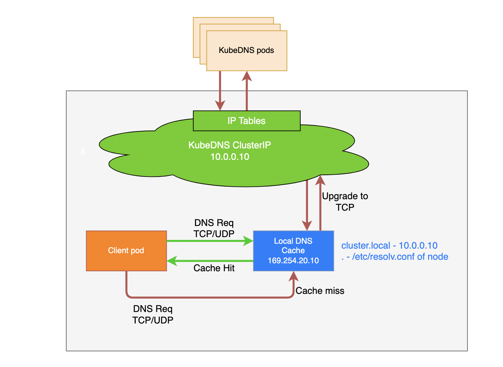

# 16.NodeLocal DNSCache

前面我们讲解了在 Kubernetes 中我们可以使用 CoreDNS 来进行集群的域名解析，但是如果在集群规模较大并发较高的情况下我们仍然需要对 DNS 进行优化，典型的就是大家比较熟悉的 CoreDNS 会出现超时 5s 的情况，可能有部分同学遇到过该问题。


## 5s 超时问题

DNS 解析出现的 5s 超时的问题，并不是 Kubernertes 的问题，而是 `conntrack` 的一个 bug，也就是连接跟踪表。Weave works 的工程师 Martynas Pumputis 对这个问题做了很详细的分析：[https://www.weave.works/blog/racy-conntrack-and-dns-lookup-timeouts](https://www.weave.works/blog/racy-conntrack-and-dns-lookup-timeouts)。由于 `conntrack` 涉及到内核的一些知识，这里我们也不用太深入了，感兴趣的可以自行去了解，可以参考文章 [https://opengers.github.io/openstack/openstack-base-netfilter-framework-overview/](https://opengers.github.io/openstack/openstack-base-netfilter-framework-overview/) 进行更多了解。

我们简单总结下：当加载内核模块 `nf_conntrack` 后，conntrack 机制就开始工作，对于每个通过 conntrack 的数据包，内核都为其生成一个 conntrack 条目用以跟踪此连接，对于后续通过的数据包，内核会判断若此数据包属于一个已有的连接，则更新所对应的 conntrack 条目的状态(比如更新为 `ESTABLISHED` 状态)，否则内核会为它新建一个 conntrack 条目。所有的 conntrack 条目都存放在一张表里，称为连接跟踪表。连接跟踪表存放于系统内存中，可以用 `cat /proc/net/nf_conntrack` 查看当前跟踪的所有 conntrack 条目（Ubuntu 则是 `conntrack` 命令）。

而出现该问题的根源在于 DNS 客户端（`glibc` 或 `musl libc`）会并发请求 A（ipv4 地址）和 AAAA（ipv6 地址）记录，跟 DNS Server 通信自然会先 connect 建立 fd，后面请求报文使用这个 fd 来发送，由于 UDP 是无状态协议，connect 时并不会创建 conntrack 表项, 而并发请求的 A 和 AAAA 记录默认使用同一个 fd 发包，这时它们源 Port 相同，当并发发包时，两个包都还没有被插入 conntrack 表项，所以 `netfilter` 会为它们分别创建 conntrack 表项，而集群内请求 kube-dns 都是访问的 Cluster-IP，报文最终会被 DNAT 成一个 endpoint 的 Pod IP，当两个包被 DNAT 成同一个 IP，最终它们的五元组就相同了，在最终插入的时候后面那个包就会被丢掉，如果 dns 的 pod 副本只有一个实例的情况就很容易发生，现象就是 dns 请求超时，client 默认策略是等待 5s 自动重试，如果重试成功，我们看到的现象就是 dns 请求有 5s 的延时，

netfilter conntrack 模块为每个连接创建 conntrack 表项时，表项的创建和最终插入之间还有一段逻辑，没有加锁，是一种乐观锁的过程。conntrack 表项并发刚创建时五元组不冲突的话可以创建成功，但中间经过 NAT 转换之后五元组就可能变成相同，第一个可以插入成功，后面的就会插入失败，因为已经有相同的表项存在。比如一个 SYN 已经做了 NAT 但是还没到最终插入的时候，另一个 SYN 也在做 NAT，因为之前那个 SYN 还没插入，这个 SYN 做 NAT 的时候就认为这个五元组没有被占用，那么它 NAT 之后的五元组就可能跟那个还没插入的包相同.

所以总结来说，**根本原因是内核 conntrack 模块的 bug，DNS client(在 linux 上一般就是 resolver)会并发地请求 A 和 AAAA 记录 netfilter 做 NAT 时可能发生资源竞争导致部分报文丢弃**.

- 只有多个线程或进程，并发从同一个 socket 发送相同五元组的 UDP 报文时，才有一定概率会发生
- glibc、musl(alpine 的 libc 库)都使用 `parallel query`，就是并发发出多个查询请求，因此很容易碰到这样的冲突，造成查询请求被丢弃
- 由于 ipvs 也使用了 conntrack, 使用 kube-proxy 的 ipvs 模式，并不能避免这个问题


### 解决方法

要彻底解决这个问题最好当然是内核上去 FIX 掉这个 BUG，除了这种方法之外我们还可以使用其他方法来进行规避，我们可以避免相同五元组 DNS 请求的并发。

在 `resolv.conf` 中就有两个相关的参数可以进行配置：

- `single-request-reopen`：发送 A 类型请求和 AAAA 类型请求使用不同的源端口，这样两个请求在 conntrack 表中不占用同一个表项，从而避免冲突。
- `single-request`：避免并发，改为串行发送 A 类型和 AAAA 类型请求，没有了并发，从而也避免了冲突。

要给容器的 `resolv.conf` 加上 options 参数，有几个办法：

-  
   1. 在容器的 `ENTRYPOINT` 或者 `CMD` 脚本中，执行 `/bin/echo 'options single-request-reopen' >> /etc/resolv.conf`
-  
   2. 在 Pod 的 postStart hook 中添加：

```yaml
lifecycle:
  postStart:
    exec:
      command:
        - /bin/sh
        - -c
        - "/bin/echo 'options single-request-reopen' >> /etc/resolv.conf"
```

-  
   3. 使用 `template.spec.dnsConfig` 配置:

```yaml
template:
  spec:
    dnsConfig:
      options:
        - name: single-request-reopen
```

-  
   4. 使用 ConfigMap 覆盖 Pod 里面的 `/etc/resolv.conf`：

```yaml
apiVersion: v1
kind: ConfigMap
metadata:
  name: resolvconf
data:
  resolv.conf: |
    nameserver 1.2.3.4
    search default.svc.cluster.local svc.cluster.local cluster.local
    options ndots:5 single-request-reopen timeout:1
---
# Pod Spec
spec:
  volumeMounts:
    - name: resolv-conf
      mountPath: /etc/resolv.conf
      subPath: resolv.conf # 在某个目录下面挂载一个文件（保证不覆盖当前目录）需要使用subPath -> 不支持热更新
---
volumes:
  - name: resolv-conf
    configMap:
      name: resolvconf
      items:
        - key: resolv.conf
          path: resolv.conf
```

-  
   5. 使用 TCP：默认情况下 dns 的请求一般都是使用 UDP 请求的, 因为力求效率，不需要三握四挥。由于 TCP 没有这个问题，我们可以在容器的 `resolv.conf` 中增加 `options use-vc`, 强制 glibc 使用 TCP 协议发送 DNS query。

```yaml
template:
  spec:
    dnsConfig:
      options:
        - name: use-vc
```

-  
   6. 使用 `MutatingAdmissionWebhook`，用于对一个指定的资源的操作之前，对这个资源进行变更。我们也可以通过 MutatingAdmissionWebhook 来自动给所有 Pod 注入上面第三或第四种方法中的相关内容。

上面的方法在一定程度上可以解决 DNS 超时的问题，但更好的方式是**使用本地 DNS 缓存**，容器的 DNS 请求都发往本地的 DNS 缓存服务，也就不需要走 DNAT，当然也不会发生 `conntrack` 冲突了，而且还可以有效提升 CoreDNS 的性能瓶颈。


## NodeLocal DNSCache

`NodeLocal DNSCache` 通过在集群节点上运行一个 DaemonSet 来提高集群 DNS 性能和可靠性。处于 ClusterFirst 的 DNS 模式下的 Pod 可以连接到 kube-dns 的 ClusterIP 进行 DNS 查询，通过 kube-proxy 组件添加的 iptables 规则将其转换为 CoreDNS 端点。通过在每个集群节点上运行 DNS 缓存，`NodeLocal DNSCache` 可以缩短 DNS 查找的延迟时间、使 DNS 查找时间更加一致，以及减少发送到 kube-dns 的 DNS 查询次数。

在集群中运行 `NodeLocal DNSCache` 有如下几个好处：

- 如果本地没有 CoreDNS 实例，则具有最高 DNS QPS 的 Pod 可能必须到另一个节点进行解析，使用 `NodeLocal DNSCache` 后，拥有本地缓存将有助于改善延迟
- 跳过 DNAT 和连接跟踪将有助于减少 conntrack 竞争并避免 UDP DNS 条目填满 conntrack 表（上面提到的 5s 超时问题就是这个原因造成的）
- 从本地缓存代理到 kube-dns 服务的连接可以升级到 TCP，TCP conntrack 条目将在连接关闭时被删除，而 UDP 条目必须超时(默认 `nfconntrackudp_timeout` 是 30 秒)
- 将 DNS 查询从 UDP 升级到 TCP 将减少归因于丢弃的 UDP 数据包和 DNS 超时的尾部等待时间，通常长达 30 秒（3 次重试+ 10 秒超时）



要安装 `NodeLocal DNSCache` 也非常简单，直接获取官方的资源清单即可：

```shell
wget https://github.com/kubernetes/kubernetes/raw/master/cluster/addons/dns/nodelocaldns/nodelocaldns.yaml
```

该资源清单文件中我们重点看下 NodeLocalDNS 的配置对象：

```yaml
apiVersion: v1
kind: ConfigMap
metadata:
  name: node-local-dns
  namespace: kube-system
  labels:
    addonmanager.kubernetes.io/mode: Reconcile
data:
  Corefile: |
    __PILLAR__DNS__DOMAIN__:53 {
        errors
        cache {
                success 9984 30
                denial 9984 5
        }
        reload
        loop
        bind __PILLAR__LOCAL__DNS__ __PILLAR__DNS__SERVER__
        forward . __PILLAR__CLUSTER__DNS__ {
                force_tcp
        }
        prometheus :9253
        health __PILLAR__LOCAL__DNS__:8080
        }
    in-addr.arpa:53 {
        errors
        cache 30
        reload
        loop
        bind __PILLAR__LOCAL__DNS__ __PILLAR__DNS__SERVER__
        forward . __PILLAR__CLUSTER__DNS__ {
                force_tcp
        }
        prometheus :9253
        }
    ip6.arpa:53 {
        errors
        cache 30
        reload
        loop
        bind __PILLAR__LOCAL__DNS__ __PILLAR__DNS__SERVER__
        forward . __PILLAR__CLUSTER__DNS__ {
                force_tcp
        }
        prometheus :9253
        }
    .:53 {
        errors
        cache 30
        reload
        loop
        bind __PILLAR__LOCAL__DNS__ __PILLAR__DNS__SERVER__
        forward . __PILLAR__UPSTREAM__SERVERS__
        prometheus :9253
        }
```

其中包含几个变量值得注意：

- `__PILLAR__DNS__SERVER__` ：表示 kube-dns 这个 Service 的 ClusterIP，可以通过命令 `kubectl get svc -n kube-system | grep kube-dns | awk'{ print ☸ ➜3 }'` 获取（我们这里就是 `10.96.0.10`）
- `__PILLAR__LOCAL__DNS__`：表示 DNSCache 本地监听的 IP 地址，该地址可以是任何地址，只要该地址不和你的集群里现有的 IP 地址发生冲突。 推荐使用本地范围内的地址，例如 IPv4 链路本地区段 `169.254.0.0/16` 内的地址（默认一般取 `169.254.20.10` 即可），或者 IPv6 唯一本地地址区段 `fd00::/8` 内的地址
- `__PILLAR__DNS__DOMAIN__`：表示集群域，默认就是 `cluster.local`

另外还有两个参数 `__PILLAR__CLUSTER__DNS__` 和 `__PILLAR__UPSTREAM__SERVERS__`，这两个参数会进行自动配置，对应的值来源于 kube-dns 的 ConfigMap 和定制的 `Upstream Server` 配置。直接执行如下所示的命令即可安装：

```shell
☸ ➜ sed 's/registry.k8s.io\/dns/cnych/g
s/__PILLAR__DNS__SERVER__/10.96.0.10/g
s/__PILLAR__LOCAL__DNS__/169.254.20.10/g
s/__PILLAR__DNS__DOMAIN__/cluster.local/g' nodelocaldns.yaml |
kubectl apply -f -
```

可以通过如下命令来查看对应的 Pod 是否已经启动成功：

```shell
☸ ➜ kubectl get pods -n kube-system -l k8s-app=node-local-dns
NAME                   READY   STATUS    RESTARTS   AGE
node-local-dns-8cwhw   1/1     Running   0          3m3s
node-local-dns-8dj4t   1/1     Running   0          3m1s
node-local-dns-g7tvw   1/1     Running   0          2m13s
```

需要注意的是这里使用 DaemonSet 部署 node-local-dns 使用了 `hostNetwork=true`，会占用宿主机的 8080 端口，所以需要保证该端口未被占用。

但是到这里还没有完，如果 kube-proxy 组件使用的是 ipvs 模式的话我们还需要修改 kubelet 的 `--cluster-dns` 参数，将其指向 `169.254.20.10`，DaemonSet 会在每个节点创建一个网卡来绑这个 IP，Pod 向本节点这个 IP 发 DNS 请求，缓存没有命中的时候才会再代理到上游集群 DNS 进行查询。

```bash
☸ ➜ ip a
6: nodelocaldns: <BROADCAST,NOARP> mtu 1500 qdisc noop state DOWN group default
    link/ether 96:3a:e3:a1:ab:ec brd ff:ff:ff:ff:ff:ff
    inet 169.254.20.10/32 scope global nodelocaldns
       valid_lft forever preferred_lft forever
    inet 10.96.0.10/32 scope global nodelocaldns
       valid_lft forever preferred_lft forever
# ......
```

iptables 模式下 Pod 还是向原来的集群 DNS 请求，节点上有这个 IP 监听，会被本机拦截，再请求集群上游 DNS，所以不需要更改 `--cluster-dns` 参数。

> 使用 kubeadm 安装的集群只需要替换节点上 `/var/lib/kubelet/config.yaml` 文件中的 clusterDNS 这个参数值，然后重启即可：


```
```shell
sed -i 's/10.96.0.10/169.254.20.10/g' /var/lib/kubelet/config.yaml
systemctl daemon-reload && systemctl restart kubelet
```
```

如果担心线上环境修改 `--cluster-dns` 参数会产生影响，强烈推荐先在新部署的 Pod 中通过 `dnsConfig` 配置使用新的 localdns 的地址来进行解析。

待 node-local-dns 安装配置完成后，我们可以部署一个新的 Pod 来验证下：

```yaml
# test-node-local-dns.yaml
apiVersion: v1
kind: Pod
metadata:
  name: test-node-local-dns
spec:
  dnsPolicy: None
  dnsConfig:
    nameservers: # 如果dnsPolicy!=None，则会将nameservers合并到原有的
      - 169.254.20.10
    searches:
      - default.svc.cluster.local
      - svc.cluster.local
      - cluster.local
    options:
      - name: ndots
        value: "5"
  containers:
    - name: test
      image: cnych/jessie-dnsutils:1.3
      command:
        - sleep
        - "infinity"
      imagePullPolicy: IfNotPresent
```

直接部署：

```shell
☸ ➜ kubectl apply -f test-node-local-dns.yaml
☸ ➜ kubectl exec -it test-node-local-dns /bin/sh
# cat /etc/resolv.conf
search default.svc.cluster.local svc.cluster.local cluster.local
nameserver 169.254.20.10
options ndots:5
```

我们可以看到 nameserver 已经变成 `169.254.20.10` 了，同样简单测试下是否可以正常工作：

```bash
# nslookup youdianzhishi.com
Server:         169.254.20.10
Address:        169.254.20.10#53

Non-authoritative answer:
Name:   youdianzhishi.com
Address: 39.106.22.102

# nslookup kubernetes.default
Server:         169.254.20.10
Address:        169.254.20.10#53

Name:   kubernetes.default.svc.cluster.local
Address: 10.96.0.1
```

`NodeLocal DNSCache` 可以提升 DNS 的性能和可靠性的，所以也非常推荐用在生产环境，唯一的缺点就是由于 LocalDNS 使用的是 DaemonSet 模式部署，所以如果需要更新镜像则可能会中断服务（不过可以使用一些第三方的增强组件来实现原地升级解决这个问题，比如 [openkruise](https://openkruise.io)）。


> 原文: <https://www.yuque.com/cnych/k8s4/etwo4hko1ga0wu71>