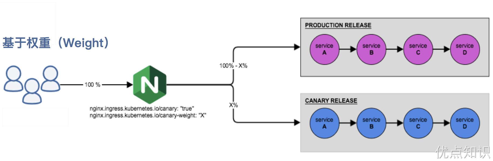
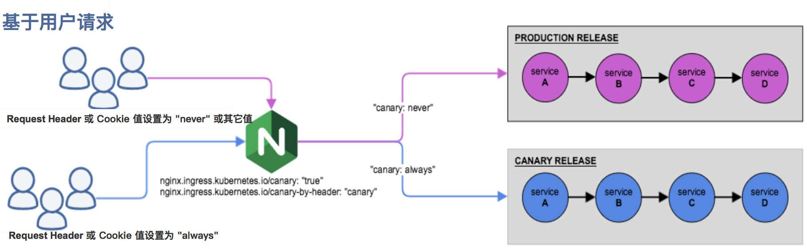
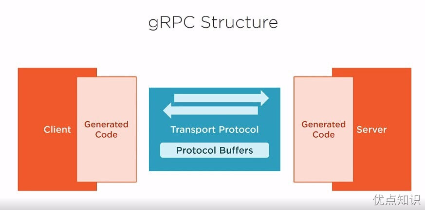

# 19.ingress-nginx

现在我们已经安装了 `ingress-nginx`，并可以通过 LoadBalancer 负载均衡器来暴露其服务了，那么接下来我们就来了解下 `ingress-nginx` 的一些具体配置使用，要进行一些自定义配置，有几种方式可以实现：使用 Configmap 在 Nginx 中设置全局配置、通过 Ingress 的 Annotations 设置特定 Ingress 的规则、自定义模板。

```shell
☸ ➜ kubectl get svc ingress-nginx-controller -n ingress-nginx
NAME                       TYPE           CLUSTER-IP      EXTERNAL-IP   PORT(S)                      AGE
ingress-nginx-controller   LoadBalancer   10.96.127.133   172.18.0.10   80:30877/TCP,443:30615/TCP   42h
```

接下来我们用于测试的应用都使用下面的 nginx 应用：

```yaml
apiVersion: apps/v1
kind: Deployment
metadata:
  name: nginx
spec:
  selector:
    matchLabels:
      app: nginx
  template: # pod 模板
    metadata:
      labels:
        app: nginx
    spec:
      containers:
        - name: app
          image: nginx # 该应用进程暴露的是80端口
          ports:
            - containerPort: 80
---
apiVersion: v1
kind: Service
metadata:
  name: nginx
spec:
  selector:
    app: nginx
  ports:
    - name: http
      port: 80 # 这个是Service的端口
```


## Basic Auth

我们可以在 Ingress 对象上配置一些基本的 Auth 认证，比如 Basic Auth，可以用 `htpasswd` 生成一个密码文件来验证身份验证。

```shell
☸ ➜ htpasswd -c auth foo
New password:
Re-type new password:
Adding password for user foo
```

然后根据上面的 auth 文件创建一个 secret 对象：

```shell
☸ ➜ kubectl create secret generic basic-auth --from-file=auth
secret/basic-auth created
☸ ➜ kubectl get secret basic-auth -o yaml
apiVersion: v1
data:
  auth: Zm9vOiRhcHIxJDdEVEZuR1kxJG15THFZRi5CZGNPSjlCcGRWWWl0QjEK
kind: Secret
metadata:
  name: basic-auth
  namespace: default
type: Opaque
```

然后对上面的 my-nginx 应用创建一个具有 Basic Auth 的 Ingress 对象：

```yaml
# ingress-basic-auth.yaml
apiVersion: networking.k8s.io/v1
kind: Ingress
metadata:
  name: ingress-with-auth
  namespace: default
  annotations:
    nginx.ingress.kubernetes.io/auth-type: basic # 认证类型
    nginx.ingress.kubernetes.io/auth-secret: basic-auth # 包含 user/password 定义的 secret 对象名
    nginx.ingress.kubernetes.io/auth-realm: "Authentication Required - foo" # 要显示的带有适当上下文的消息，说明需要身份验证的原因
spec:
  ingressClassName: nginx # 使用 nginx 的 IngressClass（关联的 ingress-nginx 控制器）
  rules:
    - host: bauth.172.18.0.10.nip.io # 将域名映射到 nginx 服务
      http:
        paths:
          - path: /
            pathType: Prefix
            backend:
              service: # 将所有请求发送到 nginx 服务的 80 端口
                name: nginx
                port:
                  number: 80
```

直接创建上面的资源对象，然后通过下面的命令或者在浏览器中直接打开配置的域名：

```shell
☸ ➜ kubectl get ingress ingress-with-auth
NAME                CLASS   HOSTS                      ADDRESS       PORTS   AGE
ingress-with-auth   nginx   bauth.172.18.0.10.nip.io   172.18.0.10   80      26s
# 请求域名
☸ ➜ curl -v http://bauth.172.18.0.10.nip.io
*   Trying 172.18.0.10:80...
* Connected to bauth.172.18.0.10.nip.io (172.18.0.10) port 80 (#0)
> GET / HTTP/1.1
> Host: bauth.172.18.0.10.nip.io
> User-Agent: curl/7.81.0
> Accept: */*
>
* Mark bundle as not supporting multiuse
< HTTP/1.1 401 Unauthorized
< Date: Thu, 16 Feb 2023 07:38:27 GMT
< Content-Type: text/html
< Content-Length: 172
< Connection: keep-alive
< WWW-Authenticate: Basic realm="Authentication Required - foo"
<
<html>
<head><title>401 Authorization Required</title></head>
<body>
<center><h1>401 Authorization Required</h1></center>
<hr><center>nginx</center>
</body>
</html>
* Connection #0 to host bauth.172.18.0.10.nip.io left intact
```

我们可以看到出现了 401 认证失败错误，然后带上我们配置的用户名和密码进行认证：

```shell
# 带上basic auth进行认证
☸ ➜ curl -v http://bauth.172.18.0.10.nip.io -u 'foo:foo321'
*   Trying 172.18.0.10:80...
* Connected to bauth.172.18.0.10.nip.io (172.18.0.10) port 80 (#0)
* Server auth using Basic with user 'foo'
> GET / HTTP/1.1
> Host: bauth.172.18.0.10.nip.io
> Authorization: Basic Zm9vOmZvbzMyMQ==
> User-Agent: curl/7.81.0
> Accept: */*
>
* Mark bundle as not supporting multiuse
< HTTP/1.1 200 OK
< Date: Thu, 16 Feb 2023 07:39:21 GMT
< Content-Type: text/html
< Content-Length: 615
< Connection: keep-alive
< Last-Modified: Tue, 13 Dec 2022 15:53:53 GMT
< ETag: "6398a011-267"
< Accept-Ranges: bytes
<
<!DOCTYPE html>
<html>
<head>
<title>Welcome to nginx!</title>
<style>
html { color-scheme: light dark; }
body { width: 35em; margin: 0 auto;
font-family: Tahoma, Verdana, Arial, sans-serif; }
</style>
</head>
<body>
<h1>Welcome to nginx!</h1>
<p>If you see this page, the nginx web server is successfully installed and
working. Further configuration is required.</p>

<p>For online documentation and support please refer to
<a href="http://nginx.org/">nginx.org</a>.

Commercial support is available at
<a href="http://nginx.com/">nginx.com</a>.</p>

<p><em>Thank you for using nginx.</em></p>
</body>
</html>
* Connection #0 to host bauth.172.18.0.10.nip.io left intact
```

可以看到已经认证成功了。除了可以使用我们自己在本地集群创建的 Auth 信息之外，还可以使用外部的 Basic Auth 认证信息，比如我们使用 `https://httpbin.org` 的外部 Basic Auth 认证，创建如下所示的 Ingress 资源对象：

```yaml
# ingress-basic-auth-external.yaml
apiVersion: networking.k8s.io/v1
kind: Ingress
metadata:
  annotations:
    # 配置外部认证服务地址
    nginx.ingress.kubernetes.io/auth-url: https://httpbin.org/basic-auth/user/passwd
  name: external-auth
  namespace: default
spec:
  ingressClassName: nginx
  rules:
    - host: external-bauth.172.18.0.10.nip.io
      http:
        paths:
          - path: /
            pathType: Prefix
            backend:
              service:
                name: nginx
                port:
                  number: 80
```

上面的资源对象创建完成后，再进行简单的测试：

```shell
☸ ➜ kubectl get ingress external-auth
NAME            CLASS   HOSTS                               ADDRESS       PORTS   AGE
external-auth   nginx   external-bauth.172.18.0.10.nip.io   172.18.0.10   80      41s
☸ ➜ curl -k http://external-bauth.172.18.0.10.nip.io
<html>
<head><title>401 Authorization Required</title></head>
<body>
<center><h1>401 Authorization Required</h1></center>
<hr><center>nginx</center>
</body>
</html>
```

然后使用正确的用户名和密码测试：

```shell
☸ ➜  curl -k http://external-bauth.172.18.0.10.nip.io -u 'user:passwd'
<!DOCTYPE html>
<html>
<head>
<title>Welcome to nginx!</title>
<style>
html { color-scheme: light dark; }
body { width: 35em; margin: 0 auto;
font-family: Tahoma, Verdana, Arial, sans-serif; }
</style>
</head>
<body>
<h1>Welcome to nginx!</h1>
<p>If you see this page, the nginx web server is successfully installed and
working. Further configuration is required.</p>

<p>For online documentation and support please refer to
<a href="http://nginx.org/">nginx.org</a>.

Commercial support is available at
<a href="http://nginx.com/">nginx.com</a>.</p>

<p><em>Thank you for using nginx.</em></p>
</body>
</html>
```

当然除了 Basic Auth 这一种简单的认证方式之外，`ingress-nginx` 还支持一些其他高级的认证，比如我们可以使用 GitHub OAuth 来认证 Kubernetes 的 Dashboard。


## URL Rewrite

`ingress-nginx` 很多高级的用法可以通过 Ingress 对象的 `annotation` 进行配置，比如常用的 URL Rewrite 功能。很多时候我们会将 `ingress-nginx` 当成网关使用，比如对访问的服务加上 `/app` 这样的前缀，在 `nginx` 的配置里面我们知道有一个 `proxy_pass` 指令可以实现：

```shell
location /app/ {
  proxy_pass http://127.0.0.1/remote/;
}
```

`proxy_pass` 后面加了 `/remote` 这个路径，此时会将匹配到该规则路径中的 `/app` 用 `/remote` 替换掉，相当于截掉路径中的 `/app`。同样的在 Kubernetes 中使用 `ingress-nginx` 又该如何来实现呢？我们可以使用 `rewrite-target` 的注解来实现这个需求，比如现在我们想要通过 `rewrite.172.18.0.10.nip.io/gateway/` 来访问到 Nginx 服务，则我们需要对访问的 URL 路径做一个 Rewrite，在 PATH 中添加一个 gateway 的前缀，关于 Rewrite 的操作在 [ingress-nginx 官方文档](https://kubernetes.github.io/ingress-nginx/examples/rewrite/)中也给出对应的说明:


按照要求我们需要在 `path` 中匹配前缀 `gateway`，然后通过 `rewrite-target` 指定目标，Ingress 对象如下所示：

```yaml
# ingress-rewrite.yaml
apiVersion: networking.k8s.io/v1
kind: Ingress
metadata:
  name: rewrite
  annotations:
    nginx.ingress.kubernetes.io/rewrite-target: /$2
spec:
  ingressClassName: nginx
  rules:
    - host: rewrite.172.18.0.10.nip.io
      http:
        paths:
          - path: /gateway(/|$)(.*)
            pathType: Prefix
            backend:
              service:
                name: nginx
                port:
                  number: 80
```

更新后，我们可以预见到直接访问域名肯定是不行了，因为我们没有匹配 `/` 的 path 路径：

```shell
☸ ➜ curl rewrite.172.18.0.10.nip.io
<html>
<head><title>404 Not Found</title></head>
<body>
<center><h1>404 Not Found</h1></center>
<hr><center>nginx</center>
</body>
</html>
```

但是我们带上 `gateway` 的前缀再去访问就正常了：

```shell
☸ ➜ curl rewrite.172.18.0.10.nip.io/gateway
<!DOCTYPE html>
<html>
<head>
<title>Welcome to nginx!</title>
<style>
html { color-scheme: light dark; }
body { width: 35em; margin: 0 auto;
font-family: Tahoma, Verdana, Arial, sans-serif; }
</style>
</head>
<body>
<h1>Welcome to nginx!</h1>
<p>If you see this page, the nginx web server is successfully installed and
working. Further configuration is required.</p>

<p>For online documentation and support please refer to
<a href="http://nginx.org/">nginx.org</a>.

Commercial support is available at
<a href="http://nginx.com/">nginx.com</a>.</p>

<p><em>Thank you for using nginx.</em></p>
</body>
</html>
```

我们可以看到已经可以访问到了，这是因为我们在 `path` 中通过正则表达式 `/gateway(/|$)(.*)` 将匹配的路径设置成了 `rewrite-target` 的目标路径了，所以我们访问 `rewrite.172.18.0.10.nip.io/gateway` 的时候实际上相当于访问的就是后端服务的 `/` 路径。

要解决我们访问主域名出现 404 的问题，我们可以给应用设置一个 `app-root` 的注解，这样当我们访问主域名的时候会自动跳转到我们指定的 `app-root` 目录下面，如下所示：

```yaml
# ingress-rewrite2.yaml
apiVersion: networking.k8s.io/v1
kind: Ingress
metadata:
  name: rewrite
  annotations:
    nginx.ingress.kubernetes.io/app-root: /gateway/
    nginx.ingress.kubernetes.io/rewrite-target: /$2
spec:
  ingressClassName: nginx
  rules:
    - host: rewrite.172.18.0.10.nip.io
      http:
        paths:
          - path: /gateway(/|$)(.*)
            pathType: Prefix
            backend:
              service:
                name: nginx
                port:
                  number: 80
```

这个时候我们更新应用后访问主域名 `rewrite.172.18.0.10.nip.io` 就会自动跳转到 `rewrite.qikqiak.com/gateway/` 路径下面去了。

```shell
☸ ➜ curl rewrite.172.18.0.10.nip.io
<html>
<head><title>302 Found</title></head>
<body>
<center><h1>302 Found</h1></center>
<hr><center>nginx</center>
</body>
</html>
```

但是还有一个问题是我们的 path 路径其实也匹配了 `/gateway` 这样的路径，可能我们更加希望我们的应用在最后添加一个 `/` 这样的 slash，同样我们可以通过 `configuration-snippet` 配置来完成，如下 Ingress 对象：

```yaml
# ingress-rewrite3.yaml
apiVersion: networking.k8s.io/v1
kind: Ingress
metadata:
  name: rewrite
  annotations:
    nginx.ingress.kubernetes.io/app-root: /gateway/
    nginx.ingress.kubernetes.io/rewrite-target: /$2
    nginx.ingress.kubernetes.io/configuration-snippet: |
      rewrite ^(/gateway)$ $1/ redirect;
spec:
  ingressClassName: nginx
  rules:
    - host: rewrite.172.18.0.10.nip.io
      http:
        paths:
          - path: /gateway(/|$)(.*)
            pathType: Prefix
            backend:
              service:
                name: nginx
                port:
                  number: 80
```

更新后我们的应用就都会以 `/` 这样的 slash 结尾了，这样就完成了我们的需求，如果你原本对 nginx 的配置就非常熟悉的话应该可以很快就能理解这种配置方式了。


## 灰度发布

在日常工作中我们经常需要对服务进行版本更新升级，所以我们经常会使用到滚动升级、蓝绿发布、灰度发布等不同的发布操作。而 `ingress-nginx` 支持通过 [Annotations 配置](https://kubernetes.github.io/ingress-nginx/user-guide/nginx-configuration/annotations/#canary)来实现不同场景下的灰度发布和测试，可以满足金丝雀发布、蓝绿部署与 A/B 测试等业务场景。首先需要添加 `nginx.ingress.kubernetes.io/canary：true` 注解来启用 canary 功能，然后可以启用以下配置金丝雀的注解：

- `nginx.ingress.kubernetes.io/canary-by-header`：基于 Request Header 的流量切分，适用于灰度发布以及 A/B 测试。当 Request Header 设置为 always 时，请求将会被一直发送到 Canary 版本；当 Request Header 设置为 never 时，请求不会被发送到 Canary 入口；对于任何其他 Header 值，将忽略 Header，并通过优先级将请求与其他金丝雀规则进行优先级的比较。
- `nginx.ingress.kubernetes.io/canary-by-header-value`：要匹配的 Request Header 的值，用于通知 Ingress 将请求路由到 Canary Ingress 中指定的服务。当 Request Header 设置为此值时，它将被路由到 Canary 入口。该规则允许用户自定义 Request Header 的值，必须与上一个 annotation (`canary-by-header`) 一起使用。
- `nginx.ingress.kubernetes.io/canary-by-header-pattern`：这与 `canary-by-header-value` 的工作方式相同，只是它进行 PCRE 正则匹配。请注意，当设置 `canary-by-header-value` 时，此注解将被忽略，当给定的 Regex 在请求处理过程中导致错误时，该请求将被视为不匹配。
- `nginx.ingress.kubernetes.io/canary-weight`：基于服务权重的流量切分，适用于蓝绿部署，权重范围 0 - 100 按百分比将请求路由到 Canary Ingress 中指定的服务。权重为 0 意味着该金丝雀规则不会向 Canary 入口的服务发送任何请求，权重为 100 意味着所有请求都将被发送到 Canary 入口。
- `nginx.ingress.kubernetes.io/canary-by-cookie`：基于 cookie 的流量切分，适用于灰度发布与 A/B 测试。用于通知 Ingress 将请求路由到 Canary Ingress 中指定的服务的 cookie。当 cookie 值设置为 always 时，它将被路由到 Canary 入口；当 cookie 值设置为 never 时，请求不会被发送到 Canary 入口；对于任何其他值，将忽略 cookie 并将请求与其他金丝雀规则进行优先级的比较。
- `nginx.ingress.kubernetes.io/canary-weight-total`：流量总权重，如果未指定，则默认为 100。

> 需要注意的是金丝雀规则按优先顺序进行排序：`canary-by-header - > canary-by-cookie - > canary-weight`


总的来说可以把以上的几个 annotation 规则划分为以下两类：

-  基于权重的 Canary 规则
 
-  基于用户请求的 Canary 规则
 

下面我们通过一个示例应用来对灰度发布功能进行说明。

**第一步. 部署 Production 应用**

首先创建一个 production 环境的应用资源清单：

```yaml
# production.yaml
apiVersion: apps/v1
kind: Deployment
metadata:
  name: production
  labels:
    app: production
spec:
  selector:
    matchLabels:
      app: production
  template:
    metadata:
      labels:
        app: production
    spec:
      containers:
        - name: production
          # arm架构使用该镜像：mirrorgooglecontainers/echoserver-arm:1.8
          image: mirrorgooglecontainers/echoserver:1.10
          ports:
            - containerPort: 8080
          env:
            - name: NODE_NAME
              valueFrom:
                fieldRef:
                  fieldPath: spec.nodeName
            - name: POD_NAME
              valueFrom:
                fieldRef:
                  fieldPath: metadata.name
            - name: POD_NAMESPACE
              valueFrom:
                fieldRef:
                  fieldPath: metadata.namespace
            - name: POD_IP
              valueFrom:
                fieldRef:
                  fieldPath: status.podIP
---
apiVersion: v1
kind: Service
metadata:
  name: production
  labels:
    app: production
spec:
  ports:
    - port: 80
      targetPort: 8080
      name: http
  selector:
    app: production
```

然后创建一个用于 production 环境访问的 Ingress 资源对象：

```yaml
# production-ingress.yaml
apiVersion: networking.k8s.io/v1
kind: Ingress
metadata:
  name: production
spec:
  ingressClassName: nginx
  rules:
    - host: echo.172.18.0.10.nip.io
      http:
        paths:
          - path: /
            pathType: Prefix
            backend:
              service:
                name: production
                port:
                  number: 80
```

直接创建上面的几个资源对象：

```shell
☸ ➜ kubectl apply -f production.yaml
☸ ➜ kubectl apply -f production-ingress.yaml
☸ ➜ kubectl get pods -l app=production
NAME                        READY   STATUS    RESTARTS   AGE
production-ffdc67bc-cvlsd   1/1     Running   0          2m50s
☸ ➜ kubectl get ingress production
NAME         CLASS   HOSTS                     ADDRESS       PORTS   AGE
production   nginx   echo.172.18.0.10.nip.io   172.18.0.10   80      12s
```

应用部署成功后即可正常访问应用：

```shell
☸ ➜ curl http://echo.172.18.0.10.nip.io

Hostname: production-ffdc67bc-cvlsd

Pod Information:
        node name:      demo-worker2
        pod name:       production-ffdc67bc-cvlsd
        pod namespace:  default
        pod IP: 10.244.2.13

Server values:
        server_version=nginx: 1.13.3 - lua: 10008

Request Information:
        client_address=10.244.1.2
        method=GET
        real path=/
        query=
        request_version=1.1
        request_uri=http://echo.172.18.0.10.nip.io:8080/

Request Headers:
        accept=*/*
        host=echo.172.18.0.10.nip.io
        user-agent=curl/7.81.0
        x-forwarded-for=172.18.0.10
        x-forwarded-host=echo.172.18.0.10.nip.io
        x-forwarded-port=80
        x-forwarded-proto=http
        x-forwarded-scheme=http
        x-real-ip=172.18.0.10
        x-request-id=0d060d9d3a67f89a96afdbf84f2e7124
        x-scheme=http

Request Body:
        -no body in request-
```

**第二步. 创建 Canary 版本**

参考将上述 Production 版本的 `production.yaml` 文件，再创建一个 Canary 版本的应用。

```yaml
# canary.yaml
apiVersion: apps/v1
kind: Deployment
metadata:
  name: canary
  labels:
    app: canary
spec:
  selector:
    matchLabels:
      app: canary
  template:
    metadata:
      labels:
        app: canary
    spec:
      containers:
        - name: canary
          image: mirrorgooglecontainers/echoserver:1.10
          ports:
            - containerPort: 8080
          env:
            - name: NODE_NAME
              valueFrom:
                fieldRef:
                  fieldPath: spec.nodeName
            - name: POD_NAME
              valueFrom:
                fieldRef:
                  fieldPath: metadata.name
            - name: POD_NAMESPACE
              valueFrom:
                fieldRef:
                  fieldPath: metadata.namespace
            - name: POD_IP
              valueFrom:
                fieldRef:
                  fieldPath: status.podIP
---
apiVersion: v1
kind: Service
metadata:
  name: canary
  labels:
    app: canary
spec:
  ports:
    - port: 80
      targetPort: 8080
      name: http
  selector:
    app: canary
```

接下来就可以通过配置 Annotation 规则进行流量切分了。

**第三步. Annotation 规则配置**

**1. 基于权重**：基于权重的流量切分的典型应用场景就是蓝绿部署，可通过将权重设置为 0 或 100 来实现。例如，可将 Green 版本设置为主要部分，并将 Blue 版本的入口配置为 Canary。最初，将权重设置为 0，因此不会将流量代理到 Blue 版本。一旦新版本测试和验证都成功后，即可将 Blue 版本的权重设置为 100，即所有流量从 Green 版本转向 Blue。

创建一个基于权重的 Canary 版本的应用路由 Ingress 对象。

```yaml
# canary-ingress.yaml
apiVersion: networking.k8s.io/v1
kind: Ingress
metadata:
  name: canary
  annotations:
    nginx.ingress.kubernetes.io/canary: "true" # 要开启灰度发布机制，首先需要启用 Canary
    nginx.ingress.kubernetes.io/canary-weight: "30" # 分配30%流量到当前Canary版本
spec:
  ingressClassName: nginx
  rules:
    - host: echo.172.18.0.10.nip.io
      http:
        paths:
          - path: /
            pathType: Prefix
            backend:
              service:
                name: canary
                port:
                  number: 80
```

直接创建上面的资源对象即可：

```shell
☸ ➜ kubectl apply -f canary.yaml
☸ ➜ kubectl apply -f canary-ingress.yaml
☸ ➜ kubectl get pods
NAME                        READY   STATUS    RESTARTS   AGE
canary-768ddb9c79-rsngx     1/1     Running   0          35s
production-ffdc67bc-cvlsd   1/1     Running   0          7m51s
☸ ➜ kubectl get svc
NAME                       TYPE        CLUSTER-IP       EXTERNAL-IP   PORT(S)                      AGE
canary                     ClusterIP   10.106.91.106    <none>        80/TCP                       8m23s
production                 ClusterIP   10.105.182.15    <none>        80/TCP                       22m
☸ ➜ kubectl get ingress
NAME                CLASS   HOSTS                               ADDRESS       PORTS   AGE
canary              nginx   echo.172.18.0.10.nip.io             172.18.0.10   80      8s
production          nginx   echo.172.18.0.10.nip.io             172.18.0.10   80      20m
```

Canary 版本应用创建成功后，接下来我们在命令行终端中来不断访问这个应用，观察 Hostname 变化：

```shell
☸ ➜ for i in $(seq 1 10); do curl -s echo.172.18.0.10.nip.io | grep "Hostname"; done
Hostname: production-ffdc67bc-cvlsd
Hostname: canary-768ddb9c79-rsngx
Hostname: production-ffdc67bc-cvlsd
Hostname: production-ffdc67bc-cvlsd
Hostname: production-ffdc67bc-cvlsd
Hostname: canary-768ddb9c79-rsngx
Hostname: production-ffdc67bc-cvlsd
Hostname: canary-768ddb9c79-rsngx
Hostname: production-ffdc67bc-cvlsd
Hostname: production-ffdc67bc-cvlsd
```

由于我们给 Canary 版本应用分配了 30% 左右权重的流量，所以上面我们访问 10 次有 3 次（不是一定）访问到了 Canary 版本的应用，符合我们的预期。

**2. 基于 Request Header**: 基于 Request Header 进行流量切分的典型应用场景即灰度发布或 A/B 测试场景。

在上面的 Canary 版本的 Ingress 对象中新增一条 annotation 配置 `nginx.ingress.kubernetes.io/canary-by-header: canary`（这里的 value 可以是任意值），使当前的 Ingress 实现基于 Request Header 进行流量切分，由于 `canary-by-header` 的优先级大于 `canary-weight`，所以会忽略原有的 `canary-weight` 的规则。

```yaml
annotations:
  nginx.ingress.kubernetes.io/canary: "true" # 要开启灰度发布机制，首先需要启用 Canary
  nginx.ingress.kubernetes.io/canary-by-header: canary # 基于header的流量切分
  nginx.ingress.kubernetes.io/canary-weight: "30" # 会被忽略，因为配置了 canary-by-headerCanary版本
```

更新上面的 Ingress 资源对象后，我们在请求中加入不同的 Header 值，再次访问应用的域名。

> 注意：当 Request Header 设置为 never 或 always 时，请求将不会或一直被发送到 Canary 版本，对于任何其他 Header 值，将忽略 Header，并通过优先级将请求与其他 Canary 规则进行优先级的比较。


```shell
☸ ➜ for i in $(seq 1 10); do curl -s -H "canary: never" echo.172.18.0.10.nip.io | grep "Hostname"; done
Hostname: production-ffdc67bc-cvlsd
Hostname: production-ffdc67bc-cvlsd
Hostname: production-ffdc67bc-cvlsd
Hostname: production-ffdc67bc-cvlsd
Hostname: production-ffdc67bc-cvlsd
Hostname: production-ffdc67bc-cvlsd
Hostname: production-ffdc67bc-cvlsd
Hostname: production-ffdc67bc-cvlsd
Hostname: production-ffdc67bc-cvlsd
Hostname: production-ffdc67bc-cvlsd
```

这里我们在请求的时候设置了 `canary: never` 这个 Header 值，所以请求没有发送到 Canary 应用中去。如果设置为其他值呢：

```shell
☸ ➜ for i in $(seq 1 10); do curl -s -H "canary: other-value" echo.172.18.0.10.nip.io | grep "Hostname"; done
Hostname: production-ffdc67bc-cvlsd
Hostname: canary-768ddb9c79-rsngx
Hostname: production-ffdc67bc-cvlsd
Hostname: production-ffdc67bc-cvlsd
Hostname: production-ffdc67bc-cvlsd
Hostname: production-ffdc67bc-cvlsd
Hostname: production-ffdc67bc-cvlsd
Hostname: canary-768ddb9c79-rsngx
Hostname: production-ffdc67bc-cvlsd
Hostname: production-ffdc67bc-cvlsd
```

由于我们请求设置的 Header 值为 `canary: other-value`，所以 ingress-nginx 会通过优先级将请求与其他 Canary 规则进行优先级的比较，我们这里也就会进入 `canary-weight: "30"` 这个规则去。

这个时候我们可以在上一个 annotation (即 `canary-by-header`）的基础上添加一条 `nginx.ingress.kubernetes.io/canary-by-header-value: user-value` 这样的规则，就可以将请求路由到 Canary Ingress 中指定的服务了。

```yaml
annotations:
  nginx.ingress.kubernetes.io/canary: "true" # 要开启灰度发布机制，首先需要启用 Canary
  nginx.ingress.kubernetes.io/canary-by-header-value: user-value
  nginx.ingress.kubernetes.io/canary-by-header: canary # 基于header的流量切分
  nginx.ingress.kubernetes.io/canary-weight: "30" # 分配30%流量到当前Canary版本
```

同样更新 Ingress 对象后，重新访问应用，当 Request Header 满足 `canary: user-value`时，所有请求就会被路由到 Canary 版本：

```shell
☸ ➜ for i in $(seq 1 10); do curl -s -H "canary: user-value" echo.172.18.0.10.nip.io | grep "Hostname"; done
Hostname: canary-768ddb9c79-rsngx
Hostname: canary-768ddb9c79-rsngx
Hostname: canary-768ddb9c79-rsngx
Hostname: canary-768ddb9c79-rsngx
Hostname: canary-768ddb9c79-rsngx
Hostname: canary-768ddb9c79-rsngx
Hostname: canary-768ddb9c79-rsngx
Hostname: canary-768ddb9c79-rsngx
Hostname: canary-768ddb9c79-rsngx
Hostname: canary-768ddb9c79-rsngx
```

**3. 基于 Cookie**：与基于 Request Header 的 annotation 用法规则类似。例如在 A/B 测试场景下，需要让地域为北京的用户访问 Canary 版本。那么当 cookie 的 annotation 设置为 `nginx.ingress.kubernetes.io/canary-by-cookie: "users_from_Beijing"`，此时后台可对登录的用户请求进行检查，如果该用户访问源来自北京则设置 cookie `users_from_Beijing` 的值为 `always`，这样就可以确保北京的用户仅访问 Canary 版本。

同样我们更新 Canary 版本的 Ingress 资源对象，采用基于 Cookie 来进行流量切分，

```yaml
annotations:
  nginx.ingress.kubernetes.io/canary: "true" # 要开启灰度发布机制，首先需要启用 Canary
  nginx.ingress.kubernetes.io/canary-by-cookie: "users_from_Beijing" # 基于 cookie
  nginx.ingress.kubernetes.io/canary-weight: "30" # 会被忽略，因为配置了 canary-by-cookie
```

更新上面的 Ingress 资源对象后，我们在请求中设置一个 `users_from_Beijing=always` 的 Cookie 值，再次访问应用的域名。

```shell
☸ ➜ for i in $(seq 1 10); do curl -s -b "users_from_Beijing=always" echo.172.18.0.10.nip.io | grep "Hostname"; done
Hostname: canary-768ddb9c79-rsngx
Hostname: canary-768ddb9c79-rsngx
Hostname: canary-768ddb9c79-rsngx
Hostname: canary-768ddb9c79-rsngx
Hostname: canary-768ddb9c79-rsngx
Hostname: canary-768ddb9c79-rsngx
Hostname: canary-768ddb9c79-rsngx
Hostname: canary-768ddb9c79-rsngx
Hostname: canary-768ddb9c79-rsngx
Hostname: canary-768ddb9c79-rsngx
```

我们可以看到应用都被路由到了 Canary 版本的应用中去了，如果我们将这个 Cookie 值设置为 never，则不会路由到 Canary 应用中。


## HTTPS

如果我们需要用 HTTPS 来访问我们这个应用的话，就需要监听 443 端口了，同样用 HTTPS 访问应用必然就需要证书，这里我们用 `openssl` 来创建一个自签名的证书：

```shell
☸ ➜ openssl req -x509 -nodes -days 365 -newkey rsa:2048 -keyout tls.key -out tls.crt -subj "/CN=foo.bar.com"
```

然后通过 Secret 对象来引用证书文件：

```shell
# 要注意证书文件名称必须是 tls.crt 和 tls.key
☸ ➜ kubectl create secret tls foo-tls --cert=tls.crt --key=tls.key
secret/who-tls created
```

这个时候我们就可以创建一个 HTTPS 访问应用的：

```yaml
apiVersion: networking.k8s.io/v1
kind: Ingress
metadata:
  name: ingress-with-auth
  annotations:
    # 认证类型
    nginx.ingress.kubernetes.io/auth-type: basic
    # 包含 user/password 定义的 secret 对象名
    nginx.ingress.kubernetes.io/auth-secret: basic-auth
    # 要显示的带有适当上下文的消息，说明需要身份验证的原因
    nginx.ingress.kubernetes.io/auth-realm: "Authentication Required - foo"
spec:
  ingressClassName: nginx
  tls: # 配置 tls 证书
    - hosts:
        - foo.bar.com
      secretName: foo-tls
  rules:
    - host: foo.bar.com
      http:
        paths:
          - path: /
            pathType: Prefix
            backend:
              service:
                name: nginx
                port:
                  number: 80
```

除了自签名证书或者购买正规机构的 CA 证书之外，我们还可以通过一些工具来自动生成合法的证书，[cert-manager](https://cert-manager.io/) 是一个云原生证书管理开源项目，可以用于在 Kubernetes 集群中提供 HTTPS 证书并自动续期，支持 `Let's Encrypt/HashiCorp/Vault` 这些免费证书的签发。在 Kubernetes 中，可以通过 Kubernetes Ingress 和 Let's Encrypt 实现外部服务的自动化 HTTPS。前面我们学习了 ingress-nginx 的常用使用，本节我们来介绍下其他高级使用。


## TCP 与 UDP

由于在 Ingress 资源对象中没有直接对 TCP 或 UDP 服务的支持，要在 `ingress-nginx` 中提供支持，需要在控制器启动参数中添加 `--tcp-services-configmap` 和 `--udp-services-configmap` 标志指向一个 ConfigMap，其中的 key 是要使用的外部端口，value 值是使用格式 `<namespace/service name>:<service port>:[PROXY]:[PROXY]` 暴露的服务，端口可以使用端口号或者端口名称，最后两个字段是可选的，用于配置 PROXY 代理。

比如现在我们要通过 `ingress-nginx` 来暴露一个 MongoDB 服务，首先创建如下的应用：

```yaml
# mongo.yaml
apiVersion: apps/v1
kind: Deployment
metadata:
  name: mongo
  labels:
    app: mongo
spec:
  selector:
    matchLabels:
      app: mongo
  template:
    metadata:
      labels:
        app: mongo
    spec:
      volumes:
        - name: data
          emptyDir: {}
      containers:
        - name: mongo
          image: mongo:4.0
          ports:
            - containerPort: 27017
          volumeMounts:
            - name: data
              mountPath: /data/db
---
apiVersion: v1
kind: Service
metadata:
  name: mongo
spec:
  selector:
    app: mongo
  ports:
    - port: 27017
```

直接创建上面的资源对象：

```shell
☸ ➜ kubectl apply -f mongo.yaml
☸ ➜ kubectl get svc mongo
NAME    TYPE        CLUSTER-IP   EXTERNAL-IP   PORT(S)     AGE
mongo   ClusterIP   10.96.3.95   <none>        27017/TCP   2m35s
☸ ➜ kubectl get pods -l app=mongo
NAME                     READY   STATUS    RESTARTS   AGE
mongo-578c58f879-qfg49   1/1     Running   0          2m19s
```

现在我们要通过 `ingress-nginx` 来暴露上面的 MongoDB 服务，我们需要创建一个如下所示的 ConfigMap：

```yaml
# tcp-ingress.yaml
apiVersion: v1
kind: ConfigMap
metadata:
  name: ingress-nginx-tcp
  namespace: ingress-nginx
data:
  "27017": default/mongo:27017
```

然后在 `ingress-nginx` 的启动参数中添加 `--tcp-services-configmap=$(POD_NAMESPACE)/ingress-nginx-tcp` 这样的配置：

```yaml
containers:
  - args:
      - /nginx-ingress-controller
      - --publish-service=$(POD_NAMESPACE)/ingress-nginx-controller
      - --election-id=ingress-nginx-leader
      - --controller-class=k8s.io/ingress-nginx
      - --ingress-class=nginx
      - --configmap=$(POD_NAMESPACE)/ingress-nginx-controller
      - --tcp-services-configmap=$(POD_NAMESPACE)/ingress-nginx-tcp
      - --validating-webhook=:8443
      - --validating-webhook-certificate=/usr/local/certificates/cert
      - --validating-webhook-key=/usr/local/certificates/key
    env:
```

重新部署即可。由于我们这里安装的 `ingress-nginx` 是通过 LoadBalancer 的 Service 暴露出去的，那么自然我们也需要通过 Service 去暴露我们这里的 tcp 端口，所以我们还需要更新 ingress-nginx 的 Service 对象，如下所示：

```yaml
apiVersion: v1
kind: Service
metadata:
  labels:
    app.kubernetes.io/component: controller
    app.kubernetes.io/instance: ingress-nginx
    app.kubernetes.io/name: ingress-nginx
    app.kubernetes.io/part-of: ingress-nginx
    app.kubernetes.io/version: 1.5.1
  annotations:
    lb.kubesphere.io/v1alpha1: openelb
    protocol.openelb.kubesphere.io/v1alpha1: layer2
    eip.openelb.kubesphere.io/v1alpha2: eip-pool
  name: ingress-nginx-controller
  namespace: ingress-nginx
spec:
  externalTrafficPolicy: Local
  ipFamilies:
    - IPv4
  ipFamilyPolicy: SingleStack
  ports:
    - appProtocol: http
      name: http
      port: 80
      protocol: TCP
      targetPort: http
    - appProtocol: https
      name: https
      port: 443
      protocol: TCP
      targetPort: https
    - name: mongo # 暴露 27017 端口
      port: 27017
      protocol: TCP
      targetPort: 27017
  selector:
    app.kubernetes.io/component: controller
    app.kubernetes.io/instance: ingress-nginx
    app.kubernetes.io/name: ingress-nginx
  type: LoadBalancer
```

更新该 Service 对象即可：

```shell
☸ ➜ kubectl get svc ingress-nginx-controller -n ingress-nginx
NAME                       TYPE           CLUSTER-IP      EXTERNAL-IP   PORT(S)                                      AGE
ingress-nginx-controller   LoadBalancer   10.96.127.133   172.18.0.10   80:30877/TCP,443:30615/TCP,27017:30696/TCP   3d18h
```

现在我们就可以通过 LB 地址 `172.18.0.10` 加上暴露的 27017 端口去访问 Mongo 服务了，比如我们这里在节点上安装了 MongoDB 客户端 `mongosh`，使用命令 `mongosh "mongodb://172.18.0.10:27017"` 就可以访问到我们的 Mongo 服务了：

```shell
☸ ➜ mongosh "mongodb://172.18.0.10:27017"
Current Mongosh Log ID: 63f0814f292e3b15b3db5e2d
Connecting to:          mongodb://172.18.0.10:27017/?directConnection=true&appName=mongosh+1.7.1
Using MongoDB:          4.0.28
Using Mongosh:          1.7.1

For mongosh info see: https://docs.mongodb.com/mongodb-shell/

# ......

test> show dbs
admin   32.00 KiB
config  12.00 KiB
local   32.00 KiB
test>
```

同样的我们也可以去查看最终生成的 `nginx.conf` 配置文件：

```shell
☸ ➜ kubectl exec -it ingress-nginx-controller-7dfbf8d769-jfv27 -n ingress-nginx -- cat /etc/nginx/nginx.conf
......
    # TCP services
    server {
            preread_by_lua_block {
                    ngx.var.proxy_upstream_name="tcp-default-mongo-27017";
            }

            listen                  27017;

            listen                  [::]:27017;

            proxy_timeout           600s;
            proxy_next_upstream     on;
            proxy_next_upstream_timeout 600s;
            proxy_next_upstream_tries   3;

            proxy_pass              upstream_balancer;

    }

    # UDP services

    # Stream Snippets
```

TCP 相关的配置位于 `stream` 配置块下面。从 Nginx 1.9.13 版本开始提供 UDP 负载均衡，同样我们也可以在 `ingress-nginx` 中来代理 UDP 服务，比如我们可以去暴露 `kube-dns` 的服务，同样需要创建一个如下所示的 ConfigMap：

```yaml
apiVersion: v1
kind: ConfigMap
metadata:
  name: ingress-nginx-udp
  namespace: ingress-nginx
data:
  53: "kube-system/kube-dns:53"
```

然后需要在 `ingress-nginx` 参数中添加一个 `- --udp-services-configmap=$(POD_NAMESPACE)ingress-nginx-udp` 这样的配置，Service 中也要加上暴露的 53 端口，然后重新更新即可。


## 全局配置

除了可以通过 `annotations` 对指定的 Ingress 进行定制之外，我们还可以配置 `ingress-nginx` 的全局配置，在控制器启动参数中通过标志 `--configmap` 指定了一个全局的 ConfigMap 对象，我们可以将全局的一些配置直接定义在该对象中即可：

```yaml
containers:
  - args:
    - /nginx-ingress-controller
    - --configmap=$(POD_NAMESPACE)/ingress-nginx-controller
    ......
```

这里我们用于全局配置的 ConfigMap 名就为 `ingress-nginx-controller`：

```shell
☸ ➜ kubectl get configmap ingress-nginx-controller -n ingress-nginx
NAME                       DATA   AGE
ingress-nginx-controller   1      7d
```

比如我们可以添加如下所示的一些常用配置：

```yaml
➜ kubectl edit configmap ingress-nginx-controller -n ingress-nginx
apiVersion: v1
data:
  allow-snippet-annotations: "true"
  client-header-buffer-size: 32k  # 注意不是下划线
  client-max-body-size: 5m
  use-gzip: "true"
  gzip-level: "7"
  large-client-header-buffers: 4 32k
  proxy-connect-timeout: 11s
  proxy-read-timeout: 12s
  keep-alive: "75"   # 启用keep-alive，连接复用，提高QPS
  keep-alive-requests: "100"
  upstream-keepalive-connections: "10000"
  upstream-keepalive-requests: "100"
  upstream-keepalive-timeout: "60"
  disable-ipv6: "true"
  disable-ipv6-dns: "true"
  max-worker-connections: "65535"
  max-worker-open-files: "10240"
kind: ConfigMap
......
```

修改完成后 Nginx 配置会自动重载生效，我们可以查看 `nginx.conf` 配置文件进行验证：

```shell
☸ ➜ kubectl exec -it ingress-nginx-controller-gc582 -n ingress-nginx -- cat /etc/nginx/nginx.conf |grep large_client_header_buffers
        large_client_header_buffers     4 32k;
```

此外往往我们还需要对 `ingress-nginx` 部署的节点进行性能优化，修改一些内核参数，使得适配 Nginx 的使用场景，一般我们是直接去修改节点上的内核参数（可以参考官方博客 [https://www.nginx.com/blog/tuning-nginx/](https://www.nginx.com/blog/tuning-nginx/) 进行调整），为了能够统一管理，我们可以使用 `initContainers` 来进行配置：

```yaml
initContainers:
- command:
  - /bin/sh
  - -c
  - |
    mount -o remount rw /proc/sys
    sysctl -w net.core.somaxconn=655350  # 积压队列设置，具体的配置视具体情况而定
    sysctl -w net.ipv4.tcp_tw_reuse=1
    sysctl -w net.ipv4.ip_local_port_range="1024 65535"
    sysctl -w fs.file-max=1048576
    sysctl -w fs.inotify.max_user_instances=16384
    sysctl -w fs.inotify.max_user_watches=524288
    sysctl -w fs.inotify.max_queued_events=16384
image: busybox
imagePullPolicy: IfNotPresent
name: init-sysctl
securityContext:
  capabilities:
    add:
    - SYS_ADMIN
    drop:
    - ALL
......
```

部署完成后通过 `initContainers` 就可以修改节点内核参数了，生产环境建议对节点内核参数进行相应的优化。性能优化需要有丰富的经验，关于 nginx 的性能优化可以参考文章 [https://cloud.tencent.com/developer/article/1026833](https://cloud.tencent.com/developer/article/1026833)。


## gRPC

ingress-nginx 控制器同样也支持 gRPC 服务的。gRPC 是 Google 开源的一个高性能 RPC 通信框架，通过 Protocol Buffers 作为其 IDL，在不同语言开发的平台上使用，同时 gRPC 基于 HTTP/2 协议实现，提供了多路复用、头部压缩、流控等特性，极大地提高了客户端与服务端的通信效率。在 gRPC 服务中，客户端应用可以同本地方法一样调用到位于不同服务器上的服务端应用方法，可以很方便地创建分布式应用和服务。同其他 RPC 框架一样，gRPC 也需要定义一个服务接口，同时指定被远程调用的方法和返回类型。服务端需要实现被定义的接口，同时运行一个 gRPC 服务器来处理客户端请求。



我们这里使用 gRPC 示例应用 [https://github.com/grpc/grpc-go/blob/master/examples/features/reflection/server/main.go](https://github.com/grpc/grpc-go/blob/master/examples/features/reflection/server/main.go) 来进行说明。首先我们需要将该应用构建成一个容器镜像，可以用如下的 Dockerfile 进行构建：

```dockerfile
FROM golang:buster as build

WORKDIR /go/src/greeter-server

RUN curl -o main.go https://raw.githubusercontent.com/grpc/grpc-go/master/examples/features/reflection/server/main.go && \
  go mod init greeter-server && \
  go mod tidy && \
  go build -o /greeter-server main.go

FROM gcr.io/distroless/base-debian10

COPY --from=build /greeter-server /

EXPOSE 50051

CMD ["/greeter-server"]
```

然后我们就可以使用该镜像来部署应用了，对应的资源清单文件如下所示：

```yaml
# grpc-ingress-app.yaml
apiVersion: apps/v1
kind: Deployment
metadata:
  labels:
    app: go-grpc-greeter-server
  name: go-grpc-greeter-server
spec:
  selector:
    matchLabels:
      app: go-grpc-greeter-server
  template:
    metadata:
      labels:
        app: go-grpc-greeter-server
    spec:
      containers:
        - image: cnych/go-grpc-greeter-server:v0.1 # 换成你自己的镜像
          resources:
            limits:
              cpu: 100m
              memory: 100Mi
            requests:
              cpu: 50m
              memory: 50Mi
          name: go-grpc-greeter-server
          ports:
            - containerPort: 50051
---
apiVersion: v1
kind: Service
metadata:
  labels:
    app: go-grpc-greeter-server
  name: go-grpc-greeter-server
spec:
  ports:
    - port: 80
      protocol: TCP
      targetPort: 50051
  selector:
    app: go-grpc-greeter-server
  type: ClusterIP
```

直接应用上面的资源清单即可：

```shell
☸ ➜ kubectl apply -f grpc-ingress.yaml
☸ ➜ kubectl get pods -l app=go-grpc-greeter-server
NAME                                     READY   STATUS    RESTARTS   AGE
go-grpc-greeter-server-bb776ccb4-wqkx6   1/1     Running   0          98s
☸ ➜ kubectl get svc -l app=go-grpc-greeter-server
NAME                     TYPE        CLUSTER-IP    EXTERNAL-IP   PORT(S)   AGE
go-grpc-greeter-server   ClusterIP   10.96.83.53   <none>        80/TCP    104s
```

接下来我们就需要创建 Ingress 对象来暴露上面的 gRPC 服务了，由于 gRPC 服务只运行在 HTTPS 端口（默认 443）上，因此需要域名和对应的 SSL 证书，这里我们使用域名 `grpc.172.18.0.10.nip.io` 和自签的 SSL 证书。

**申请 SSL 证书**

使用 Ingress 转发 gRPC 服务需要对应域名拥有 SSL 证书，使用 TLS 协议进行通信，这里我们使用 OpenSSL 来生成自签证书。

复制以下内容并保存至 `openssl.cnf` 文件中。

```latex
[ req ]
#default_bits           = 2048
#default_md             = sha256
#default_keyfile        = privkey.pem
distinguished_name      = req_distinguished_name
attributes              = req_attributes
req_extensions          = v3_req

[ req_distinguished_name ]
countryName                     = Country Name (2 letter code)
countryName_min                 = 2
countryName_max                 = 2
stateOrProvinceName             = State or Province Name (full name)
localityName                    = Locality Name (eg, city)
0.organizationName              = Organization Name (eg, company)
organizationalUnitName          = Organizational Unit Name (eg, section)
commonName                      = Common Name (eg, fully qualified host name)
commonName_max                  = 64
emailAddress                    = Email Address
emailAddress_max                = 64

[ req_attributes ]
challengePassword               = A challenge password
challengePassword_min           = 4
challengePassword_max           = 20

[v3_req]
# Extensions to add to a certificate request
basicConstraints = CA:FALSE
keyUsage = nonRepudiation, digitalSignature, keyEncipherment
subjectAltName = @alt_names

[alt_names]
DNS.1 = grpc.172.18.0.10.nip.io
```

然后执行以下命令签署证书请求：

```shell
☸ ➜ openssl req -new -nodes -keyout grpc.key -out grpc.csr -config openssl.cnf -subj "/C=CN/ST=Beijing/L=Beijing/O=Youdianzhishi/OU=TrainService/CN=grpc.172.18.0.10.nip.io"
```

然后执行以下命令签署证书：

```shell
☸ ➜ openssl x509 -req -days 3650 -in grpc.csr -signkey grpc.key -out grpc.crt -extensions v3_req -extfile openssl.cnf
```

命令执行成功后，可得到证书 `grpc.crt` 与私钥文件 `grpc.key`，然后执行以下命令将名称为 grpc-secret 的 TLS Secret 添加到集群中。

```shell
☸ ➜ kubectl create secret tls grpc-secret --key grpc.key --cert grpc.crt
```

**创建 Ingress 资源**

然后创建如下所示的 Ingress 对象来暴露 gRPC 服务：

```yaml
# grpc-ingress.yaml
apiVersion: networking.k8s.io/v1
kind: Ingress
metadata:
  annotations:
    nginx.ingress.kubernetes.io/ssl-redirect: "true"
    # 必须要配置以指明后端服务为gRPC服务
    nginx.ingress.kubernetes.io/backend-protocol: "GRPC"
  name: grpc-ingress
  namespace: default
spec:
  ingressClassName: nginx
  rules:
    - host: grpc.172.18.0.10.nip.io
      http:
        paths:
          - path: /
            pathType: Prefix
            backend:
              service:
                name: go-grpc-greeter-server
                port:
                  number: 80
  tls:
    - secretName: grpc-secret
      hosts:
        - grpc.172.18.0.10.nip.io
```

注意在该对象中我们添加了一个注解 `nginx.ingress.kubernetes.io/backend-protocol: "GRPC"`，表示后端服务为 gRPC 服务，所以必须要加上，同样直接创建该对象即可。

```shell
☸ ➜ kubectl get ingress grpc-ingress
NAME           CLASS   HOSTS                     ADDRESS       PORTS     AGE
grpc-ingress   nginx   grpc.172.18.0.10.nip.io   172.18.0.10   80, 443   2m13s
```

**测试**

接下来我们还需要安装一个 [gRPCurl](https://github.com/fullstorydev/grpcurl) 工具，该工具类似于 cURL，但用于与 gRPC 服务器交互的命令行工具。

本地安装 `gRPCurl` 工具后，可以输入 `grpcurl <域名>:443 list` 命令验证请求是否成功转发到后端服务。我们这里使用域名 `grpc.172.18.0.10.nip.io` 以及自签证书，所以执行该命令的时候需要添加一个 `-insecure` 参数：

```shell
☸ ➜ grpcurl -insecure grpc.172.18.0.10.nip.io:443 list
grpc.examples.echo.Echo
grpc.reflection.v1alpha.ServerReflection
helloworld.Greeter
☸ ➜ grpcurl -insecure grpc.172.18.0.10.nip.io:443 helloworld.Greeter/SayHello
{
  "message": "Hello "
}
```

正常会输出如上所示的结果，表明流量被 Ingress 成功转发到了后端 gRPC 服务。


> 原文: <https://www.yuque.com/cnych/k8s4/uukqz78rcdazmfg8>