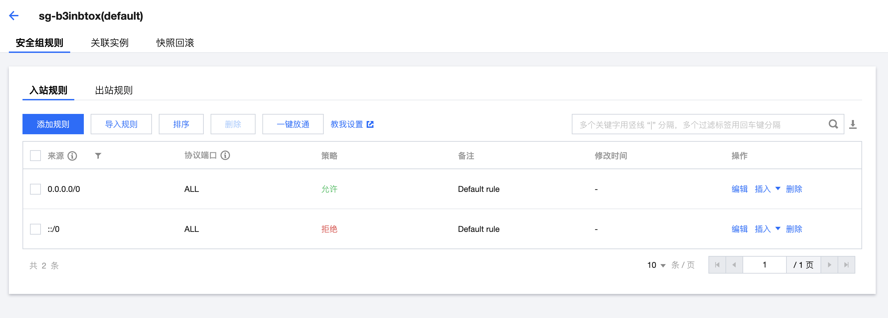
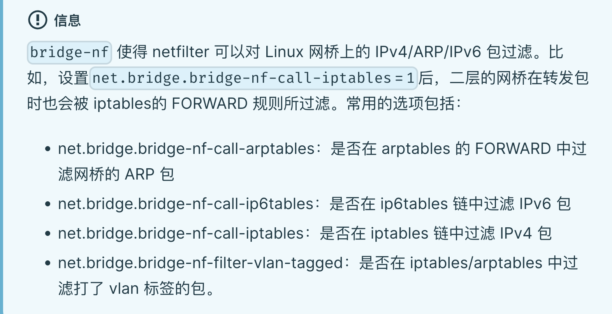
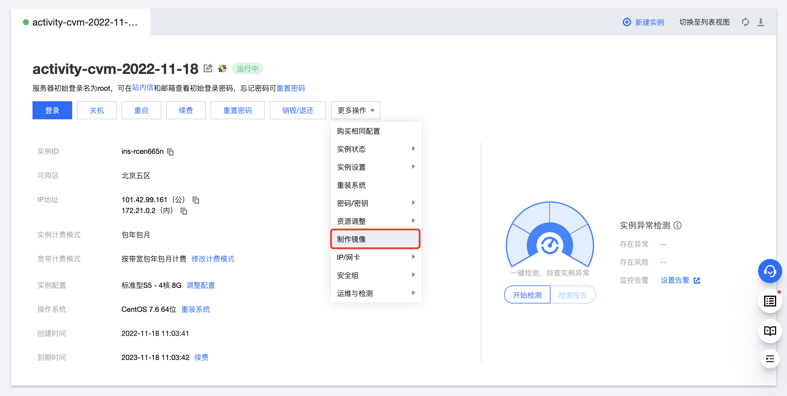
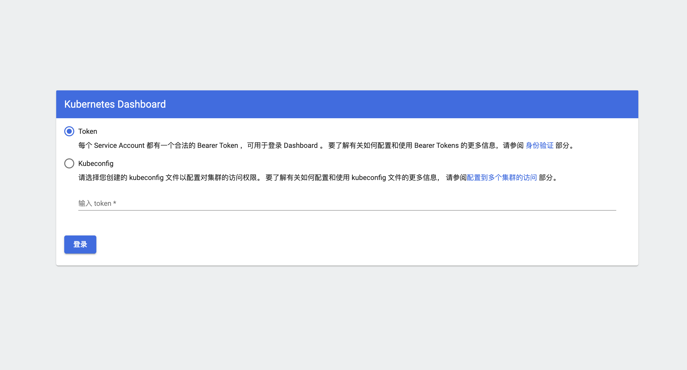
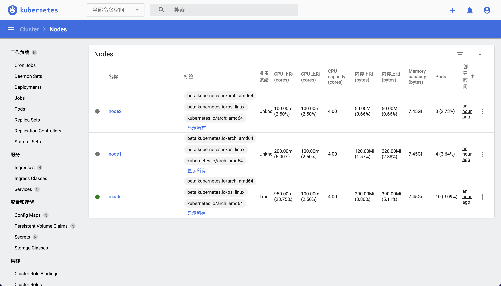
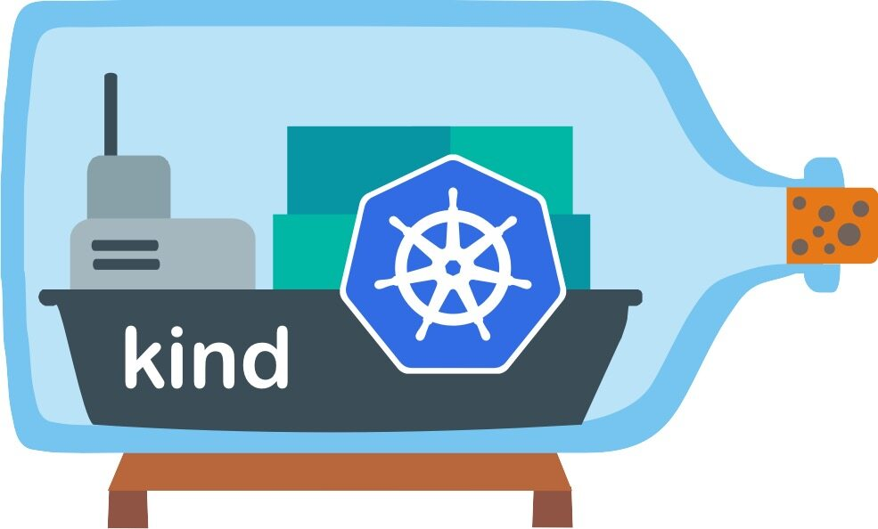
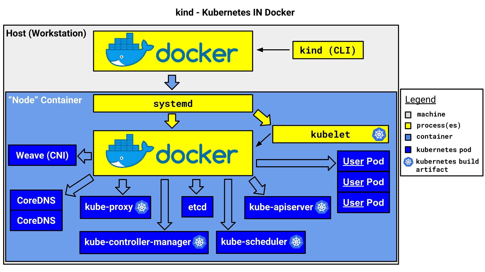
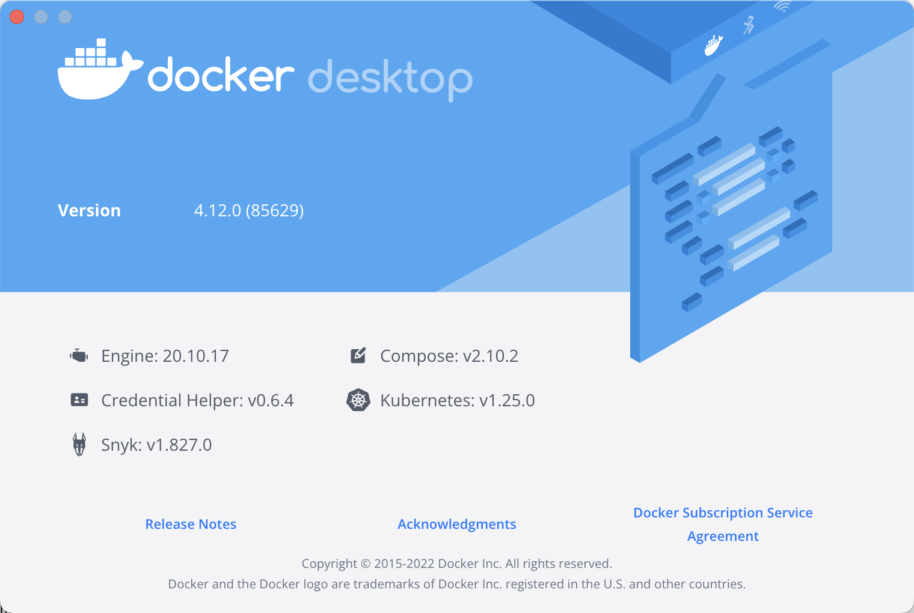

# 2.部署Kubernetes集群

在对容器运行时和 K8s 有了一个整体上的认识后，接下来我们就需要来搭建一个 K8s 集群了，这里我们将会使用 Kubeadm 和 Kind 两种工具来搭建集群。


## Kubeadm


Kubeadm 是一个安装 K8s 集群的工具包，可帮助你以更简单、合理安全和可扩展的方式引导最佳实践 Kubernetes 群集。它还支持为你管理 Bootstrap Tokens 并升级/降级集群。

Kubeadm 的目标是建立一个通过 Kubernetes 一致性测试的最小可行集群 ，但不会安装其他功能插件。在设计上并未安装网络解决方案，所以需要用户自行安装第三方符合 CNI 的网络解决方案（如 flanal，calico 等）。此外 Kubeadm 可以在多种设备上运行，可以是 Linux 笔记本电脑、虚拟机、物理/云服务器或 Raspberry Pi，这使得 Kubeadm 非常适合与不同种类的配置系统（例如 Terraform，Ansible 等）集成。

Kubeadm 在 2018 年 12 月 3 日发布的 [Kubernetes 1.13](https://kubernetes.io/blog/2018/12/03/kubernetes-1-13-release-announcement/) 版本中就已经宣布 GA 了，所以可以支持生产环境。

现在我们就来使用 Kubeadm 从头搭建一个使用 Containerd 作为容器运行时的 K8s 集群，这里我们安装的是最新稳定版 `v1.25.4` 版本。


### 环境准备

3 个节点，都是 Centos 7.6 系统，内核版本：`3.10.0-1160.71.1.el7.x86_64`，在每个节点上添加 hosts 信息：

```shell
☸ ➜ cat /etc/hosts
172.21.0.2 master
172.21.0.3 node1
172.21.0.4 node2
```

> 节点的 hostname 必须使用**标准的 DNS 命名**，另外千万别用默认 `localhost` 的 hostname，会导致各种错误出现的。在 Kubernetes 项目里，机器的名字以及一切存储在 Etcd 中的 API 对象，都必须使用标准的 DNS 命名（RFC 1123）。可以使用命令 `hostnamectl set-hostname xxx` 来修改 hostname。


下面是一些环境准备工作，需要在所有节点配置。

首先禁用防火墙：

```shell
☸ ➜ systemctl stop firewalld
☸ ➜ systemctl disable firewalld
```

禁用 `SELINUX`：

```shell
☸ ➜ setenforce 0
# 使用下面命令验证是否禁用成功
☸ ➜ cat /etc/selinux/config
SELINUX=disabled
```

如果使用的是云服务器，比如阿里云、腾讯云等，需要配置安全组，放开端口，如果只是为了测试方便可以直接全部放开，对于生产环境则只需要放开 K8s 要是使用到的一些端口，比如 6443 等等。



由于开启内核 ipv4 转发需要加载 `br_netfilter` 模块，所以加载下该模块：

```shell
☸ ➜ modprobe br_netfilter
```

最好将上面的命令设置成开机启动，因为重启后模块失效，下面是开机自动加载模块的方式，在 `etc/rc.d/rc.local` 文件末尾添加如下脚本内容：

```shell
for file in /etc/sysconfig/modules/*.modules ; do
[ -x $file ] && $file
done
```

然后在 `/etc/sysconfig/modules/` 目录下新建如下文件：

```shell
☸ ➜ mkdir -p /etc/sysconfig/modules/
☸ ➜ vi /etc/sysconfig/modules/br_netfilter.modules
modprobe br_netfilter
```

增加权限：

```shell
☸ ➜ chmod 755 br_netfilter.modules
```

然后重启后，模块就可以自动加载了：

```shell
☸ ➜ lsmod |grep br_netfilter
br_netfilter           22256  0
bridge                151336  1 br_netfilter
```

然后创建 `/etc/sysctl.d/k8s.conf` 文件，添加如下内容：

```shell
net.bridge.bridge-nf-call-ip6tables = 1
net.bridge.bridge-nf-call-iptables = 1
net.ipv4.ip_forward = 1
# 下面的内核参数可以解决ipvs模式下长连接空闲超时的问题
net.ipv4.tcp_keepalive_intvl = 30
net.ipv4.tcp_keepalive_probes = 10
net.ipv4.tcp_keepalive_time = 600
```



执行如下命令使修改生效：

```shell
☸ ➜ sysctl -p /etc/sysctl.d/k8s.conf
```

安装 ipvs：

```shell
☸ ➜ cat > /etc/sysconfig/modules/ipvs.modules <<EOF
#!/bin/bash
modprobe -- ip_vs
modprobe -- ip_vs_rr
modprobe -- ip_vs_wrr
modprobe -- ip_vs_sh
modprobe -- nf_conntrack_ipv4
EOF
☸ ➜ chmod 755 /etc/sysconfig/modules/ipvs.modules && bash /etc/sysconfig/modules/ipvs.modules && lsmod | grep -e ip_vs -e nf_conntrack_ipv4
```

上面脚本创建了 `/etc/sysconfig/modules/ipvs.modules` 文件，保证在节点重启后能自动加载所需模块。使用 `lsmod | grep -e ip_vs -e nf_conntrack_ipv4` 命令查看是否已经正确加载所需的内核模块。

接下来还需要确保各个节点上已经安装了 ipset 软件包，为了便于查看 ipvs 的代理规则，最好安装一下管理工具 ipvsadm：

```shell
☸ ➜ yum install ipset
☸ ➜ yum install ipvsadm
```

然后记得一定要同步服务器时间，这里我们使用 `chrony` 来进行同步，其他工具也可以：

```shell
☸ ➜ yum install chrony -y
☸ ➜ systemctl enable chronyd
☸ ➜ systemctl start chronyd
☸ ➜ chronyc sources
210 Number of sources = 4
MS Name/IP address         Stratum Poll Reach LastRx Last sample
===============================================================================
^? time.cloudflare.com           3   6     3     1  -2328us[-2328us] +/-   87ms
^? 119.28.183.184                2   6     3     1  -3438us[-3438us] +/-   75ms
^? ip-64-111-99-224.nodes.d>     0   6     0     -     +0ns[   +0ns] +/-    0ns
^? time.cloudflare.com           3   6     3     0  -6207us[-6207us] +/-   92ms
☸ ➜ date
Thu Dec  1 10:20:51 CST 2022
```

关闭 swap 分区：

```shell
☸ ➜ swapoff -a
```

修改 `/etc/fstab` 文件，注释掉 SWAP 的自动挂载，使用 `free -m` 确认 swap 已经关闭。swappiness 参数调整，修改 `/etc/sysctl.d/k8s.conf` 添加下面一行：

```shell
vm.swappiness=0
```

执行 `sysctl -p /etc/sysctl.d/k8s.conf` 使修改生效。

当然如果是生产环境使用还可以先对内核参数进行统一的调优。


### 安装 Containerd

接下来需要安装 Containerd 容器运行时。

> 如果在安装集群的过程出现了容器运行时的问题，启动不起来，可以尝试使用 `yum install containerd.io` 来安装 Containerd。


首先需要在节点上安装 `seccomp` 依赖，这一步很重要：

```shell
☸ ➜ rpm -qa |grep libseccomp
libseccomp-2.3.1-4.el7.x86_64
# 如果没有安装 libseccomp 包则可以执行下面的命令安装依赖
☸ ➜ wget http://mirror.centos.org/centos/7/os/x86_64/Packages/libseccomp-2.3.1-4.el7.x86_64.rpm
☸ ➜ yum install libseccomp-2.3.1-4.el7.x86_64.rpm -y
```

由于 Containerd 需要依赖底层的 runc 工具，所以我们也需要先安装 runc，不过 Containerd 提供了一个包含相关依赖的压缩包 `cri-containerd-cni-${VERSION}.${OS}-${ARCH}.tar.gz`，可以直接使用这个包来进行安装，强烈建议使用该安装包，不然可能因为 runc 版本问题导致不兼容。

首先从 [release 页面](https://github.com/containerd/containerd/releases)下载最新的 `1.6.10` 版本的压缩包：

```shell
☸ ➜ wget https://github.com/containerd/containerd/releases/download/v1.6.10/cri-containerd-1.6.10-linux-amd64.tar.gz
# 如果有限制，也可以替换成下面的 URL 加速下载
# wget https://ghdl.feizhuqwq.cf/https://github.com/containerd/containerd/releases/download/v1.6.10/cri-containerd-1.6.10-linux-amd64.tar.gz
```

直接将压缩包解压到系统的各个目录中：

```shell
☸ ➜ tar -C / -xzf cri-containerd-1.6.10-linux-amd64.tar.gz
```

记得将 `/usr/local/bin` 和 `/usr/local/sbin` 追加到 `PATH` 环境变量中：

```shell
☸ ➜ echo $PATH
/usr/local/sbin:/usr/local/bin:/usr/sbin:/usr/bin:/root/bin
☸ ➜ containerd -v
containerd github.com/containerd/containerd v1.6.10 770bd0108c32f3fb5c73ae1264f7e503fe7b2661
☸ ➜ runc -h
runc: symbol lookup error: runc: undefined symbol: seccomp_notify_respond
```

可以正常执行 `containerd -v` 命令证明 Containerd 安装成功了，但是执行 `runc -h` 命令的时候却出现了类似 `runc: undefined symbol: seccomp_notify_respond` 的错误，这是因为我们当前系统默认安装的 `libseccomp` 是 `2.3.1` 版本，该版本已经不能满足我们这里的 `v1.6.10` 版本的 Containerd 了（从 `1.5.7` 版本开始就不兼容了），需要 2.4 以上的版本，所以我们需要重新安装一个高版本的 `libseccomp`。

```bash
☸ ➜ rpm -qa | grep libseccomp
libseccomp-2.3.1-4.el7.x86_64
# 下载高于 2.4 以上的包
☸ ➜ wget http://rpmfind.net/linux/centos/8-stream/BaseOS/x86_64/os/Packages/libseccomp-2.5.1-1.el8.x86_64.rpm
☸ ➜ rpm -ivh libseccomp-2.5.1-1.el8.x86_64.rpm
☸ ➜ rpm -qa | grep libseccomp
libseccomp-2.5.1-1.el8.x86_64
```

现在 `runc` 命令就可以正常使用了：

```bash
☸ ➜ runc -v
runc version 1.1.4
commit: v1.1.4-0-g5fd4c4d1
spec: 1.0.2-dev
go: go1.18.8
libseccomp: 2.5.1
```

Containerd 的默认配置文件为 `/etc/containerd/config.toml`，我们可以通过如下所示的命令生成一个默认的配置：

```shell
☸ ➜ mkdir -p /etc/containerd
☸ ➜ containerd config default > /etc/containerd/config.toml
```

对于使用 systemd 作为 init system 的 Linux 的发行版，使用 `systemd` 作为容器的 `cgroup driver` 可以确保节点在资源紧张的情况更加稳定，所以推荐将 containerd 的 cgroup driver 配置为 systemd。

修改前面生成的配置文件 `/etc/containerd/config.toml`，在 `plugins."io.containerd.grpc.v1.cri".containerd.runtimes.runc.options` 配置块下面将 `SystemdCgroup` 设置为 `true`：

```toml
[plugins."io.containerd.grpc.v1.cri".containerd.runtimes.runc]
  ...
  [plugins."io.containerd.grpc.v1.cri".containerd.runtimes.runc.options]
    SystemdCgroup = true
    ....
```

然后再为镜像仓库配置一个加速器，需要在 cri 配置块下面的 `registry` 配置块下面进行配置 `registry.mirrors`：

```toml
[plugins."io.containerd.grpc.v1.cri"]
  ...
  # sandbox_image = "registry.k8s.io/pause:3.6"
  sandbox_image = "registry.aliyuncs.com/k8sxio/pause:3.8"
  ...
  [plugins."io.containerd.grpc.v1.cri".registry]
    [plugins."io.containerd.grpc.v1.cri".registry.mirrors]
      [plugins."io.containerd.grpc.v1.cri".registry.mirrors."docker.io"]
        endpoint = ["https://bqr1dr1n.mirror.aliyuncs.com"]
```

> 现在社区已经将 K8s 默认的镜像仓库从 `k8s.gcr.io` 迁移到了 `registry.k8s.io`，不过国内正常情况下还是不能使用，所以如果我们的节点不能正常获取 `registry.k8s.io` 的镜像，那么我们需要在上面重新配置 `sandbox_image` 镜像，Containerd 模式下直接通过 kubelet 覆盖该镜像不会生效：`Warning: For remote container runtime, --pod-infra-container-image is ignored in kubelet, which should be set in that remote runtime instead`。


由于上面我们下载的 Containerd 压缩包中包含一个 `etc/systemd/system/containerd.service` 的文件，这样我们就可以通过 systemd 来配置 Containerd 作为守护进程运行了，现在我们就可以启动 Containerd 了，直接执行下面的命令即可：

```shell
☸ ➜ systemctl daemon-reload
☸ ➜ systemctl enable containerd --now
```

启动完成后就可以使用 Containerd 的 CLI 工具 `ctr` 和 `crictl` 了，比如查看版本：

```shell
☸ ➜ ctr version
Client:
  Version:  v1.6.10
  Revision: 770bd0108c32f3fb5c73ae1264f7e503fe7b2661
  Go version: go1.18.8

Server:
  Version:  v1.6.10
  Revision: 770bd0108c32f3fb5c73ae1264f7e503fe7b2661
  UUID: 9b89c1b6-27d0-434b-8c71-243c7af750c5
☸ ➜ crictl version
Version:  0.1.0
RuntimeName:  containerd
RuntimeVersion:  v1.6.10
RuntimeApiVersion:  v1
```


### 初始化集群

上面的相关环境配置完成后，接着我们就可以来安装 Kubeadm 了，我们这里是通过指定 yum 源的方式来进行安装的：

```shell
☸ ➜ cat <<EOF > /etc/yum.repos.d/kubernetes.repo
[kubernetes]
name=Kubernetes
baseurl=https://packages.cloud.google.com/yum/repos/kubernetes-el7-x86_64
enabled=1
gpgcheck=1
repo_gpgcheck=1
gpgkey=https://packages.cloud.google.com/yum/doc/yum-key.gpg
        https://packages.cloud.google.com/yum/doc/rpm-package-key.gpg
EOF
```

当然了，上面的 yum 源是需要科学上网的，如果不能科学上网的话，我们可以使用阿里云的源进行安装：

```shell
☸ ➜ cat <<EOF > /etc/yum.repos.d/kubernetes.repo
[kubernetes]
name=Kubernetes
baseurl=http://mirrors.aliyun.com/kubernetes/yum/repos/kubernetes-el7-x86_64
enabled=1
gpgcheck=0
repo_gpgcheck=0
gpgkey=http://mirrors.aliyun.com/kubernetes/yum/doc/yum-key.gpg
        http://mirrors.aliyun.com/kubernetes/yum/doc/rpm-package-key.gpg
EOF
```

然后安装 kubeadm、kubelet、kubectl：

```shell
# --disableexcludes 禁掉除了kubernetes之外的别的仓库
☸ ➜ yum makecache fast
☸ ➜ yum install -y kubelet-1.25.4 kubeadm-1.25.4 kubectl-1.25.4 --disableexcludes=kubernetes
☸ ➜ kubeadm version
kubeadm version: &version.Info{Major:"1", Minor:"25", GitVersion:"v1.25.4", GitCommit:"872a965c6c6526caa949f0c6ac028ef7aff3fb78", GitTreeState:"clean", BuildDate:"2022-11-09T13:35:06Z", GoVersion:"go1.19.3", Compiler:"gc", Platform:"linux/amd64"}
```

可以看到我们这里安装的是 `v1.25.4` 版本，然后将 master 节点的 kubelet 设置成开机启动：

```shell
☸ ➜ systemctl enable --now kubelet
```

到这里为止**上面所有的操作都需要在所有节点执行配置**，在云环境上面的话我们可以将当前环境直接做成一个镜像，然后创建新节点的时候直接使用该镜像即可，这样可以避免重复的工作。



当我们执行 `kubelet --help` 命令的时候可以看到原来大部分命令行参数都被 `DEPRECATED`了，这是因为官方推荐我们使用 `--config` 来指定配置文件，在配置文件中指定原来这些参数的配置，可以通过官方文档 [Set Kubelet parameters via a config file](https://kubernetes.io/docs/tasks/administer-cluster/kubelet-config-file/) 了解更多相关信息，这样 Kubernetes 就可以支持动态 Kubelet 配置（Dynamic Kubelet Configuration）了，参考 [Reconfigure a Node’s Kubelet in a Live Cluster](https://kubernetes.io/docs/tasks/administer-cluster/reconfigure-kubelet/)。

接下来我们可以通过下面的命令在 master 节点上输出集群初始化默认使用的配置：

```shell
☸ ➜ kubeadm config print init-defaults --component-configs KubeletConfiguration > kubeadm.yaml
```

然后根据我们自己的需求修改配置，比如修改 `imageRepository` 指定集群初始化时拉取 Kubernetes 所需镜像的地址，kube-proxy 的模式为 ipvs，另外需要注意的是我们这里准备安装 flannel 网络插件的，需要将 `networking.podSubnet` 设置为 `10.244.0.0/16`：

```yaml
# kubeadm.yaml
apiVersion: kubeadm.k8s.io/v1beta3
bootstrapTokens:
  - groups:
      - system:bootstrappers:kubeadm:default-node-token
    token: abcdef.0123456789abcdef
    ttl: 24h0m0s
    usages:
      - signing
      - authentication
kind: InitConfiguration
localAPIEndpoint:
  advertiseAddress: 172.21.0.2
  bindPort: 6443
nodeRegistration:
  criSocket: unix:///var/run/containerd/containerd.sock
  imagePullPolicy: IfNotPresent
  name: master
  taints:
    - effect: "NoSchedule"
      key: "node-role.kubernetes.io/master"
---
apiServer:
  timeoutForControlPlane: 4m0s
apiVersion: kubeadm.k8s.io/v1beta3
certificatesDir: /etc/kubernetes/pki
clusterName: kubernetes
controllerManager: {}
dns: {}
etcd:
  local:
    dataDir: /var/lib/etcd
imageRepository: registry.aliyuncs.com/k8sxio
kind: ClusterConfiguration
kubernetesVersion: 1.25.4
networking:
  dnsDomain: cluster.local
  serviceSubnet: 10.96.0.0/12
  podSubnet: 10.244.0.0/16 # 指定 pod 子网
scheduler: {}
---
apiVersion: kubeproxy.config.k8s.io/v1alpha1
kind: KubeProxyConfiguration
mode: ipvs # kube-proxy 模式
---
apiVersion: kubelet.config.k8s.io/v1beta1
authentication:
  anonymous:
    enabled: false
  webhook:
    cacheTTL: 0s
    enabled: true
  x509:
    clientCAFile: /etc/kubernetes/pki/ca.crt
authorization:
  mode: Webhook
  webhook:
    cacheAuthorizedTTL: 0s
    cacheUnauthorizedTTL: 0s
cgroupDriver: systemd
clusterDNS:
  - 10.96.0.10
clusterDomain: cluster.local
cpuManagerReconcilePeriod: 0s
evictionPressureTransitionPeriod: 0s
fileCheckFrequency: 0s
healthzBindAddress: 127.0.0.1
healthzPort: 10248
httpCheckFrequency: 0s
imageMinimumGCAge: 0s
kind: KubeletConfiguration
logging:
  flushFrequency: 0
  options:
    json:
      infoBufferSize: "0"
  verbosity: 0
memorySwap: {}
nodeStatusReportFrequency: 0s
nodeStatusUpdateFrequency: 0s
rotateCertificates: true
runtimeRequestTimeout: 0s
shutdownGracePeriod: 0s
shutdownGracePeriodCriticalPods: 0s
staticPodPath: /etc/kubernetes/manifests
streamingConnectionIdleTimeout: 0s
syncFrequency: 0s
volumeStatsAggPeriod: 0s
```

> 对于上面的资源清单的文档比较杂，要想完整了解上面的资源对象对应的属性，可以查看对应的 godoc 文档，地址:[https://godoc.org/k8s.io/kubernetes/cmd/kubeadm/app/apis/kubeadm/v1beta3](https://godoc.org/k8s.io/kubernetes/cmd/kubeadm/app/apis/kubeadm/v1beta3)。


在开始初始化集群之前可以使用 `kubeadm config images pull --config kubeadm.yaml` 预先在各个服务器节点上拉取所 k8s 需要的容器镜像。

配置文件准备好过后，可以使用如下命令先将相关镜像 pull 下面：

```shell
☸ ➜ kubeadm config images pull --config kubeadm.yaml
[config/images] Pulled registry.aliyuncs.com/k8sxio/kube-apiserver:v1.25.4
[config/images] Pulled registry.aliyuncs.com/k8sxio/kube-controller-manager:v1.25.4
[config/images] Pulled registry.aliyuncs.com/k8sxio/kube-scheduler:v1.25.4
[config/images] Pulled registry.aliyuncs.com/k8sxio/kube-proxy:v1.25.4
[config/images] Pulled registry.aliyuncs.com/k8sxio/pause:3.8
[config/images] Pulled registry.aliyuncs.com/k8sxio/etcd:3.5.5-0
failed to pull image "registry.aliyuncs.com/k8sxio/coredns:v1.9.3": output: E1201 11:16:23.106965   12850 remote_image.go:238] "PullImage from image service failed" err="rpc error: code = NotFound desc = failed to pull and unpack image \"registry.aliyuncs.com/k8sxio/coredns:v1.9.3\": failed to resolve reference \"registry.aliyuncs.com/k8sxio/coredns:v1.9.3\": registry.aliyuncs.com/k8sxio/coredns:v1.9.3: not found" image="registry.aliyuncs.com/k8sxio/coredns:v1.9.3"
time="2022-12-01T11:16:23+08:00" level=fatal msg="pulling image: rpc error: code = NotFound desc = failed to pull and unpack image \"registry.aliyuncs.com/k8sxio/coredns:v1.9.3\": failed to resolve reference \"registry.aliyuncs.com/k8sxio/coredns:v1.9.3\": registry.aliyuncs.com/k8sxio/coredns:v1.9.3: not found"
, error: exit status 1
To see the stack trace of this error execute with --v=5 or higher
```

上面在拉取 `coredns` 镜像的时候出错了，没有找到这个镜像，我们可以手动 pull 该镜像，然后重新 tag 下镜像地址即可：

```shell
☸ ➜ ctr -n k8s.io i pull docker.io/coredns/coredns:1.9.3
docker.io/coredns/coredns:1.9.3:                                                  resolved       |++++++++++++++++++++++++++++++++++++++|
index-sha256:8e352a029d304ca7431c6507b56800636c321cb52289686a581ab70aaa8a2e2a:    done           |++++++++++++++++++++++++++++++++++++++|
manifest-sha256:bdb36ee882c13135669cfc2bb91c808a33926ad1a411fee07bd2dc344bb8f782: done           |++++++++++++++++++++++++++++++++++++++|
config-sha256:5185b96f0becf59032b8e3646e99f84d9655dff3ac9e2605e0dc77f9c441ae4a:   done           |++++++++++++++++++++++++++++++++++++++|
layer-sha256:d92bdee797857f997be3c92988a15c196893cbbd6d5db2aadcdffd2a98475d2d:    done           |++++++++++++++++++++++++++++++++++++++|
layer-sha256:f2401d57212f95ea8e82ff8728f4f99ef02d4b39459837244d1b049c5d43de43:    done           |++++++++++++++++++++++++++++++++++++++|
elapsed: 18.7s                                                                    total:  13.1 M (718.5 KiB/s)
unpacking linux/amd64 sha256:8e352a029d304ca7431c6507b56800636c321cb52289686a581ab70aaa8a2e2a...
done: 567.56858ms
☸ ➜ ctr -n k8s.io i tag docker.io/coredns/coredns:1.9.3 registry.aliyuncs.com/k8sxio/coredns:v1.9.3
```

> 注意这一步其实应该在 node 节点上去操作。


然后就可以使用上面的配置文件在 master 节点上进行初始化：

```shell
☸ ➜ kubeadm init --config kubeadm.yaml
[init] Using Kubernetes version: v1.25.4
[preflight] Running pre-flight checks
[preflight] Pulling images required for setting up a Kubernetes cluster
[preflight] This might take a minute or two, depending on the speed of your internet connection
[preflight] You can also perform this action in beforehand using 'kubeadm config images pull'
[certs] Using certificateDir folder "/etc/kubernetes/pki"
[certs] Generating "ca" certificate and key
[certs] Generating "apiserver" certificate and key
[certs] apiserver serving cert is signed for DNS names [kubernetes kubernetes.default kubernetes.default.svc kubernetes.default.svc.cluster.local master] and IPs [10.96.0.1 172.21.0.2]
[certs] Generating "apiserver-kubelet-client" certificate and key
[certs] Generating "front-proxy-ca" certificate and key
[certs] Generating "front-proxy-client" certificate and key
[certs] Generating "etcd/ca" certificate and key
[certs] Generating "etcd/server" certificate and key
[certs] etcd/server serving cert is signed for DNS names [localhost master] and IPs [172.21.0.2 127.0.0.1 ::1]
[certs] Generating "etcd/peer" certificate and key
[certs] etcd/peer serving cert is signed for DNS names [localhost master] and IPs [172.21.0.2 127.0.0.1 ::1]
[certs] Generating "etcd/healthcheck-client" certificate and key
[certs] Generating "apiserver-etcd-client" certificate and key
[certs] Generating "sa" key and public key
[kubeconfig] Using kubeconfig folder "/etc/kubernetes"
[kubeconfig] Writing "admin.conf" kubeconfig file
[kubeconfig] Writing "kubelet.conf" kubeconfig file
[kubeconfig] Writing "controller-manager.conf" kubeconfig file
[kubeconfig] Writing "scheduler.conf" kubeconfig file
[kubelet-start] Writing kubelet environment file with flags to file "/var/lib/kubelet/kubeadm-flags.env"
[kubelet-start] Writing kubelet configuration to file "/var/lib/kubelet/config.yaml"
[kubelet-start] Starting the kubelet
[control-plane] Using manifest folder "/etc/kubernetes/manifests"
[control-plane] Creating static Pod manifest for "kube-apiserver"
[control-plane] Creating static Pod manifest for "kube-controller-manager"
[control-plane] Creating static Pod manifest for "kube-scheduler"
[etcd] Creating static Pod manifest for local etcd in "/etc/kubernetes/manifests"
[wait-control-plane] Waiting for the kubelet to boot up the control plane as static Pods from directory "/etc/kubernetes/manifests". This can take up to 4m0s
[apiclient] All control plane components are healthy after 6.003035 seconds
[upload-config] Storing the configuration used in ConfigMap "kubeadm-config" in the "kube-system" Namespace
[kubelet] Creating a ConfigMap "kubelet-config" in namespace kube-system with the configuration for the kubelets in the cluster
[upload-certs] Skipping phase. Please see --upload-certs
[mark-control-plane] Marking the node master as control-plane by adding the labels: [node-role.kubernetes.io/control-plane node.kubernetes.io/exclude-from-external-load-balancers]
[mark-control-plane] Marking the node master as control-plane by adding the taints [node-role.kubernetes.io/master:NoSchedule]
[bootstrap-token] Using token: abcdef.0123456789abcdef
[bootstrap-token] Configuring bootstrap tokens, cluster-info ConfigMap, RBAC Roles
[bootstrap-token] Configured RBAC rules to allow Node Bootstrap tokens to get nodes
[bootstrap-token] Configured RBAC rules to allow Node Bootstrap tokens to post CSRs in order for nodes to get long term certificate credentials
[bootstrap-token] Configured RBAC rules to allow the csrapprover controller automatically approve CSRs from a Node Bootstrap Token
[bootstrap-token] Configured RBAC rules to allow certificate rotation for all node client certificates in the cluster
[bootstrap-token] Creating the "cluster-info" ConfigMap in the "kube-public" namespace
[kubelet-finalize] Updating "/etc/kubernetes/kubelet.conf" to point to a rotatable kubelet client certificate and key
[addons] Applied essential addon: CoreDNS
[addons] Applied essential addon: kube-proxy

Your Kubernetes control-plane has initialized successfully!

To start using your cluster, you need to run the following as a regular user:

  mkdir -p $HOME/.kube
  sudo cp -i /etc/kubernetes/admin.conf $HOME/.kube/config
  sudo chown $(id -u):$(id -g) $HOME/.kube/config

Alternatively, if you are the root user, you can run:

  export KUBECONFIG=/etc/kubernetes/admin.conf

You should now deploy a pod network to the cluster.
Run "kubectl apply -f [podnetwork].yaml" with one of the options listed at:
  https://kubernetes.io/docs/concepts/cluster-administration/addons/

Then you can join any number of worker nodes by running the following on each as root:

kubeadm join 172.21.0.2:6443 --token abcdef.0123456789abcdef \
        --discovery-token-ca-cert-hash sha256:fc6f8c628bb51ae4cd228aefea957ca0be06188644e8bef992bbb3a9ce40fd5a
```

根据安装提示拷贝 kubeconfig 文件：

```shell
☸ ➜ mkdir -p $HOME/.kube
☸ ➜ sudo cp -i /etc/kubernetes/admin.conf $HOME/.kube/config
☸ ➜ sudo chown $(id -u):$(id -g) $HOME/.kube/config
```

然后可以使用 kubectl 命令查看 master 节点是否已经初始化成功了：

```shell
☸ ➜ kubectl get nodes
NAME     STATUS     ROLES           AGE    VERSION
master   NotReady   control-plane   104s   v1.25.4
```

现在节点还处于 `NotReady` 状态，是因为还没有安装 CNI 插件，我们可以先添加一个 Node 节点，再部署网络插件。


### 添加节点

记住初始化集群上面的配置和操作要提前做好，将 master 节点上面的 `$HOME/.kube/config` 文件拷贝到 node 节点对应的文件中（如果想在 node 节点上操作 kubectl），安装 kubeadm、kubelet、kubectl（可选），然后执行上面初始化完成后提示的 join 命令即可：

```shell
☸ ➜ kubeadm join 172.21.0.2:6443 --token abcdef.0123456789abcdef \
        --discovery-token-ca-cert-hash sha256:fc6f8c628bb51ae4cd228aefea957ca0be06188644e8bef992bbb3a9ce40fd5a
[preflight] Running pre-flight checks
[preflight] Reading configuration from the cluster...
[preflight] FYI: You can look at this config file with 'kubectl -n kube-system get cm kubeadm-config -o yaml'
[kubelet-start] Writing kubelet configuration to file "/var/lib/kubelet/config.yaml"
[kubelet-start] Writing kubelet environment file with flags to file "/var/lib/kubelet/kubeadm-flags.env"
[kubelet-start] Starting the kubelet
[kubelet-start] Waiting for the kubelet to perform the TLS Bootstrap...

This node has joined the cluster:
* Certificate signing request was sent to apiserver and a response was received.
* The Kubelet was informed of the new secure connection details.

Run 'kubectl get nodes' on the control-plane to see this node join the cluster.
```

> 如果忘记了上面的 join 命令可以使用命令 `kubeadm token create --print-join-command` 重新获取。


执行成功后运行 get nodes 命令：

```shell
☸ ➜ kubectl get nodes
NAME     STATUS     ROLES           AGE   VERSION
master   NotReady   control-plane   15m   v1.25.4
node1    NotReady   <none>          98s   v1.25.4
```

这个时候其实集群还不能正常使用，因为还没有安装网络插件，接下来安装网络插件，可以在文档 [https://kubernetes.io/docs/concepts/cluster-administration/addons](https://kubernetes.io/docs/concepts/cluster-administration/addons/#networking-and-network-policy) 中选择我们自己的网络插件，这里我们安装 flannel:

```shell
☸ ➜ wget https://raw.githubusercontent.com/flannel-io/flannel/v0.20.1/Documentation/kube-flannel.yml
# 如果有节点是多网卡，则需要在资源清单文件中指定内网网卡
# 搜索到名为 kube-flannel-ds 的 DaemonSet，在kube-flannel容器下面
☸ ➜ vi kube-flannel.yml
......
containers:
- name: kube-flannel
#image: flannelcni/flannel:v0.20.1 for ppc64le and mips64le (dockerhub limitations may apply)
image: docker.io/rancher/mirrored-flannelcni-flannel:v0.20.1
command:
- /opt/bin/flanneld
args:
- --ip-masq
- --kube-subnet-mgr
- --iface=eth0 # 如果是多网卡的话，指定内网网卡的名称
......
☸ ➜ kubectl apply -f kube-flannel.yml  # 安装 flannel 网络插件
```

隔一会儿查看 Pod 运行状态：

```shell
☸ ➜ kubectl get pods -A
NAMESPACE      NAME                             READY   STATUS    RESTARTS   AGE
kube-flannel   kube-flannel-ds-9zrh2            1/1     Running   0          12m
kube-flannel   kube-flannel-ds-gxwp5            1/1     Running   0          12m
kube-system    coredns-7b884d5cb7-bfsb8         1/1     Running   0          104s
kube-system    coredns-7b884d5cb7-qmpgn         1/1     Running   0          64s
kube-system    etcd-master                      1/1     Running   1          38m
kube-system    kube-apiserver-master            1/1     Running   1          38m
kube-system    kube-controller-manager-master   1/1     Running   1          38m
kube-system    kube-proxy-bqwpt                 1/1     Running   0          23m
kube-system    kube-proxy-c7z25                 1/1     Running   0          37m
kube-system    kube-proxy-q668d                 1/1     Running   0          15m
kube-system    kube-scheduler-master            1/1     Running   1          38m
```

> 当我们部署完网络插件后执行 `ifconfig` 命令，正常会看到新增的 `cni0` 与 `flannel.1` 这两个虚拟设备，但是如果没有看到 `cni0` 这个设备也不用太担心，我们可以观察 `/var/lib/cni` 目录是否存在，如果不存在并不是说部署有问题，而是该节点上暂时还没有应用运行，我们只需要在该节点上运行一个 Pod 就可以看到该目录会被创建，并且 `cni0` 设备也会被创建出来。


用同样的方法添加另外一个节点即可。


### Dashboard

直接执行下面的命令一键安装即可：

```shell
# 推荐使用下面这种方式
☸ ➜ wget https://raw.githubusercontent.com/kubernetes/dashboard/v2.7.0/aio/deploy/recommended.yaml
☸ ➜ vi recommended.yaml
# 修改Service为NodePort类型
......
kind: Service
apiVersion: v1
metadata:
  labels:
    k8s-app: kubernetes-dashboard
  name: kubernetes-dashboard
  namespace: kubernetes-dashboard
spec:
  ports:
    - port: 443
      targetPort: 8443
  selector:
    k8s-app: kubernetes-dashboard
  type: NodePort  # 加上type=NodePort变成NodePort类型的服务
......
```

> 在 YAML 文件中可以看到新版本 Dashboard 集成了一个 `metrics-scraper` 的组件，可以通过 Kubernetes 的 Metrics API 收集一些基础资源的监控信息，并在 web 页面上展示，所以要想在页面上展示监控信息就需要提供 Metrics API，比如安装 Metrics Server。


直接创建：

```shell
☸ ➜ kubectl apply -f recommended.yaml
```

新版本的 Dashboard 会被默认安装在 `kubernetes-dashboard` 这个命名空间下面：

```shell
☸ ➜ kubectl get pods -n kubernetes-dashboard
NAME                                         READY   STATUS    RESTARTS   AGE
dashboard-metrics-scraper-64bcc67c9c-bkphf   1/1     Running   0          2m31s
kubernetes-dashboard-5c8bd6b59-xv84b         1/1     Running   0          2m31s
```

然后查看 Dashboard 的 NodePort 端口：

```shell
☸ ➜ kubectl get svc -n kubernetes-dashboard
NAME                        TYPE        CLUSTER-IP     EXTERNAL-IP   PORT(S)         AGE
dashboard-metrics-scraper   ClusterIP   10.105.19.9    <none>        8000/TCP        3m23s
kubernetes-dashboard        NodePort    10.101.65.43   <none>        443:31845/TCP   3m23s
```

然后可以通过上面的 31845 端口去访问 Dashboard，要记住使用 https，Chrome 不生效可以使用 `Firefox` 测试，如果没有 Firefox 下面打不开页面，可以点击下页面中的 `信任证书`即可：


信任后就可以访问到 Dashboard 的登录页面了：



然后创建一个具有全局所有权限的用户来登录 Dashboard：

```yaml
# admin.yaml
apiVersion: v1
kind: ServiceAccount
metadata:
  name: admin-user
  namespace: kubernetes-dashboard
---
apiVersion: rbac.authorization.k8s.io/v1
kind: ClusterRoleBinding
metadata:
  name: admin-user
roleRef:
  apiGroup: rbac.authorization.k8s.io
  kind: ClusterRole
  name: cluster-admin
subjects:
  - kind: ServiceAccount
    name: admin-user
    namespace: kubernetes-dashboard
```

直接创建即可：

```shell
☸ ➜ kubectl apply -f admin.yaml
```

现在我们需要找到可以用来登录的令牌，可以使用 `kubectl create token` 命令来请求一个 service account token：

```bash
# 请求创建一个 token 作为 kubernetes-dashboard 命名空间中的 admin-user 这个 sa 对 kube-apiserver 进行身份验证
☸ ➜ kubectl -n kubernetes-dashboard create token admin-user
```

上面的命令执行后会打印出如下所示的 token：

```bash
eyJhbGciOiJSUzI1NiIsImtpZCI6ImZEWFJ5NU1EV0FhcWlsLWVKRnNoMlQ3bDg0d2RWU0hnWTlSUmVockZYM2MifQ.eyJhdWQiOlsiaHR0cHM6Ly9rdWJlcm5ldGVzLmRlZmF1bHQuc3ZjLmNsdXN0ZXIubG9jYWwiXSwiZXhwIjoxNjY5ODcyOTU5LCJpYXQiOjE2Njk4NjkzNTksImlzcyI6Imh0dHBzOi8va3ViZXJuZXRlcy5kZWZhdWx0LnN2Yy5jbHVzdGVyLmxvY2FsIiwia3ViZXJuZXRlcy5pbyI6eyJuYW1lc3BhY2UiOiJrdWJlcm5ldGVzLWRhc2hib......
```

然后用上面的字符串作为 token 登录 Dashboard 即可：



到这里我们就完成了使用 kubeadm 搭建 v1.25.4 版本的 kubernetes 集群。


### 清理

如果你的集群安装过程中遇到了其他问题，我们可以使用下面的命令来进行重置：

```shell
☸ ➜ kubeadm reset
☸ ➜ ifconfig cni0 down && ip link delete cni0
☸ ➜ ifconfig flannel.1 down && ip link delete flannel.1
☸ ➜ rm -rf /var/lib/cni/
```


## Kind



[Kind](https://kind.sigs.k8s.io) 是 `Kubernetes in Docker` 的简写，是一个使用 Docker 容器作为 Node 节点，在本地创建和运行 Kubernetes 集群的工具。适用于在本机创建 Kubernetes 集群环境进行开发和测试。使用 Kind 搭建的集群无法在生产中使用，但是如果你只是想在本地简单的玩玩 K8s，不想占用太多的资源，那么使用 Kind 是你不错的选择。

Kind 内部也是使用 Kubeadm 创建和启动集群节点，并使用 Containerd 作为容器运行时，所以弃用 `dockershim` 对 Kind 没有什么影响。

Kind 的架构图如下所示，它将 Docker 容器作为 Kubernetes 的 Node 节点，并在该 Node 中安装 Kubernetes 组件，包括一个或者多个 Control Plane 和一个或者多个 Work Nodes。这就解决了在本机运行多个 Node 的问题，而不需要虚拟化。




### 安装

要使用 Kind 的前提是提供一个 Docker 环境，可以使用下面的命令快速安装。

```bash
sudo sh -c "$(curl -fsSL https://get.docker.com)"
```

当然也可以使用桌面版，比如我本地是 Mac m1 环境，安装了 Docker Desktop 版本。



Docker 安装过后接下来可以安装一个 kubectl 工具，Kind 本身不需要 kubectl，安装 kubectl 可以在本机直接管理 Kubernetes 集群。

**Linux 系统**

```bash
curl -LO "https://dl.k8s.io/release/$(curl -L -s https://dl.k8s.io/release/stable.txt)/bin/linux/amd64/kubectl"
sudo install -o root -g root -m 0755 kubectl /usr/local/bin/kubectl
#验证版本
kubectl version --client
```

**MacOS 系统**

```bash
brew install kubectl
#验证版本
kubectl version --client
```

接下来就可以安装 Kind 了，最简单的方式是在 [Github Release 页面](https://github.com/kubernetes-sigs/kind/releases) 直接下载对应的安装包即可，比如我们这里安装最新的 `v0.17.0` 版本：

```bash
☸ ➜ wget https://github.com/kubernetes-sigs/kind/releases/download/v0.17.0/kind-darwin-amd64
# 可以使用下面的命令加速
# wget https://ghps.cc/https://github.com/kubernetes-sigs/kind/releases/download/v0.17.0/kind-darwin-amd64
☸ ➜ chmod +x kind-darwin-amd64
☸ ➜ sudo mv kind-darwin-amd64 /usr/local/bin/kind
# 验证版本
☸ ➜ kind version
kind v0.17.0 go1.19.2 darwin/amd64
```

对于 Mac 系统也可以使用 `brew install kind` 进行一键安装。


### 操作

要了解 Kind 的操作，最简单的方式就是直接执行一条 `kind` 命令，或者 `kind -h`，这也是我们了解任何 CLI 工具最基础的方法：

```bash
☸ ➜ kind
kind creates and manages local Kubernetes clusters using Docker container 'nodes'

Usage:
  kind [command]

Available Commands:
  build       Build one of [node-image]
  completion  Output shell completion code for the specified shell (bash, zsh or fish)
  create      Creates one of [cluster]
  delete      Deletes one of [cluster]
  export      Exports one of [kubeconfig, logs]
  get         Gets one of [clusters, nodes, kubeconfig]
  help        Help about any command
  load        Loads images into nodes
  version     Prints the kind CLI version

Flags:
  -h, --help              help for kind
      --loglevel string   DEPRECATED: see -v instead
  -q, --quiet             silence all stderr output
  -v, --verbosity int32   info log verbosity, higher value produces more output
      --version           version for kind

Use "kind [command] --help" for more information about a command.
```

从上面的命令可以看出 kind 工具包含很多可用的命令，比如 `build`、`create`、`delete`、`load` 等等，其中最重要的应该属于 `create` 命令了，该命令可以用来创建一个集群，用同样的方式我们可以继续查看 `kind create` 命令的使用方法：

```bash
☸ ➜ kind create -h
Creates one of local Kubernetes cluster (cluster)

Usage:
  kind create [flags]
  kind create [command]

Available Commands:
  cluster     Creates a local Kubernetes cluster

Flags:
  -h, --help   help for create

Global Flags:
      --loglevel string   DEPRECATED: see -v instead
  -q, --quiet             silence all stderr output
  -v, --verbosity int32   info log verbosity, higher value produces more output

Use "kind create [command] --help" for more information about a command.
```

可以看出只有一个 `cluster` 子命令可用，但是该子命令后面如何操作呢？

```bash
☸ ➜ kind create cluster -h
Creates a local Kubernetes cluster using Docker container 'nodes'

Usage:
  kind create cluster [flags]

Flags:
      --config string       path to a kind config file
  -h, --help                help for cluster
      --image string        node docker image to use for booting the cluster
      --kubeconfig string   sets kubeconfig path instead of $KUBECONFIG or $HOME/.kube/config
  -n, --name string         cluster name, overrides KIND_CLUSTER_NAME, config (default kind)
      --retain              retain nodes for debugging when cluster creation fails
      --wait duration       wait for control plane node to be ready (default 0s)

Global Flags:
      --loglevel string   DEPRECATED: see -v instead
  -q, --quiet             silence all stderr output
  -v, --verbosity int32   info log verbosity, higher value produces more output
```

可以看到 `create cluster` 后面没有可用的子命令了，但是有一些 `Flags` 标志可以传递，但其实不传递任何的参数也可以创建一个 K8s 集群，这属于最简单创建 K8s 的方式，只需要执行如下所示的命令即可创建一个默认的集群（目前最新版本只支持到 K8s `v1.25.3` 版本）：

```bash
☸ ➜ kind create cluster
Creating cluster "kind" ...
 ✓ Ensuring node image (kindest/node:v1.25.3) 🖼
 ✓ Preparing nodes 📦
 ✓ Writing configuration 📜
 ✓ Starting control-plane 🕹️
 ✓ Installing CNI 🔌
 ✓ Installing StorageClass 💾
Set kubectl context to "kind-kind"
You can now use your cluster with:

kubectl cluster-info --context kind-kind

Thanks for using kind! 😊
```

创建完成后就可以直接使用 kubectl 命令管理该 K8s 集群了：

```bash
☸ ➜ kubectl get nodes
NAME                 STATUS   ROLES           AGE   VERSION
kind-control-plane   Ready    control-plane   88s   v1.25.3
☸ ➜ kubectl get pods -A
NAMESPACE            NAME                                         READY   STATUS    RESTARTS   AGE
kube-system          coredns-565d847f94-vfxg9                     1/1     Running   0          2m4s
kube-system          coredns-565d847f94-whgsv                     1/1     Running   0          2m4s
kube-system          etcd-kind-control-plane                      1/1     Running   0          2m18s
kube-system          kindnet-lp8kf                                1/1     Running   0          2m4s
kube-system          kube-apiserver-kind-control-plane            1/1     Running   0          2m19s
kube-system          kube-controller-manager-kind-control-plane   1/1     Running   0          2m18s
kube-system          kube-proxy-mv86p                             1/1     Running   0          2m4s
kube-system          kube-scheduler-kind-control-plane            1/1     Running   0          2m18s
local-path-storage   local-path-provisioner-684f458cdd-4f999      1/1     Running   0          2m4s
```

默认的集群名称为 `kind`，在创建的时候我们可以使用参数 `--name` 指定创建的集群名称，可以创建多个群集：

```bash
☸ ➜ kind create cluster --name kind-2
```

此外还可以指定启动集群的 Node 镜像：

```bash
☸ ➜ kind create cluster --name kind-3 --image kindest/node:v1.23.4
```

然后可以使用 `kind get clusters` 命令来获取集群列表：

```bash
☸ ➜ kind get clusters
kind
kind-2
kind-3
```

当有多个集群的时候，我们可以使用 kubectl 来切换要管理的集群：

```bash
# 切换到集群 `kind`
☸ ➜ kubectl config use-context kind-kind

# 切换到群集`kind-2`
☸ ➜ kubectl config use-context kind-kind-2
```

要删除集群也非常简单，比如要删除 kind-2 集群：

```bash
☸ ➜ kind delete cluster --name kind-2
```

Kind 集群中的 Docker 镜像可以从互联网直接拉取，有时候可能比较缓慢，我们可以将本机镜像导入到 Kind 集群中去，比如使用如下命令可以将镜像导入到 `kind-control-plane` 节点去：

```bash
☸ ➜ kind load docker-image --nodes kind-control-plane nginx:mainline-alpine
Image: "" with ID "sha256:e08a7adafd859e875957b027d89dfcbbe8cce7a5525ad88460c23a91febbfdac" not yet present on node "kind-control-plane", loading...
```


### 配置集群

上面我们介绍的是 kind 命令的一些常用操作，此外我们还可以通过一个文件来配置要创建的 K8s 集群，比如定义一个如下所示的 `config.yaml` 文件：

```yaml
# config.yaml
kind: Cluster
apiVersion: kind.x-k8s.io/v1alpha4
name: demo
nodes:
  - role: control-plane
  - role: worker
  - role: worker
```

该配置文件表示我们一共要创建 3 个节点，一个控制节点，两个工作节点，在创建集群的时候只需要通过 `--config` 参数指定该文件即可：

```bash
☸ ➜ kind create cluster --config config.yaml
```

创建后的集群名称为 `demo`，一共包括 3 个节点：

```bash
☸ ➜ kubectl get nodes
NAME                 STATUS   ROLES           AGE   VERSION
demo-control-plane   Ready    control-plane   32s   v1.25.3
demo-worker          Ready    <none>          12s   v1.25.3
demo-worker2         Ready    <none>          13s   v1.25.3
```

如果想创建一个 HA 模式的控制平面，那么我们可以定义如下所示的配置文件，只需要指定 3 个(奇数个) `control-plane` 角色的节点即可：

```yaml
kind: Cluster
apiVersion: kind.x-k8s.io/v1alpha4
nodes:
  - role: control-plane
  - role: control-plane
  - role: control-plane
  - role: worker
  - role: worker
  - role: worker
```

此外我们还可以将 Node 的端口映射到宿主主，通过配置文件中的 `extraPortMappings` 属性可以实现该功能，如下所示配置可以将 `control-plane` 节点 80 端口映射到宿主机的 80 端口上：

```yaml
kind: Cluster
apiVersion: kind.x-k8s.io/v1alpha4
nodes:
  - role: control-plane
    extraPortMappings:
      - containerPort: 80
        hostPort: 80
        listenAddress: "0.0.0.0" # Optional, defaults to "0.0.0.0"
        protocol: udp # Optional, defaults to tcp
```

如果要将端口映射与 NodePort 一起使用，kind 节点的 containerPort 和 Service 的 nodePort 需要相等。

```yaml
kind: Cluster
apiVersion: kind.x-k8s.io/v1alpha4
nodes:
  - role: control-plane
    extraPortMappings:
      - containerPort: 30950
        hostPort: 80
```

然后将 `nodePort` 设置为 30950。

```yaml
kind: Pod
apiVersion: v1
metadata:
  name: foo
  labels:
    app: foo
spec:
  containers:
    - name: foo
      image: hashicorp/http-echo:0.2.3
      args:
        - "-text=foo"
      ports:
        - containerPort: 5678
---
apiVersion: v1
kind: Service
metadata:
  name: foo
spec:
  type: NodePort
  ports:
    - name: http
      nodePort: 30950
      port: 5678
  selector:
    app: foo
```

同样我们也可以在配置文件中指定 Node 的容器镜像版本运行指定版本的 Kubernetes 群集。可以在[官方 release 页面](https://github.com/kubernetes-sigs/kind/releases)中中查找需要镜像 tag，带上 sha256 shasum（非必须），例如：

```yaml
kind: Cluster
apiVersion: kind.x-k8s.io/v1alpha4
nodes:
  - role: control-plane
    image: kindest/node:v1.18.15@sha256:5c1b980c4d0e0e8e7eb9f36f7df525d079a96169c8a8f20d8bd108c0d0889cc4
  - role: worker
    image: kindest/node:v1.18.15@sha256:5c1b980c4d0e0e8e7eb9f36f7df525d079a96169c8a8f20d8bd108c0d0889cc4
```

此外还有一些其他定制操作，比如 Kind 创建的集群默认自带一个轻量级的 CNI 插件 `kindnetd`，我们也可以禁用默认设置来安装其他 CNI，比如 Calico。

```yaml
kind: Cluster
apiVersion: kind.x-k8s.io/v1alpha4
networking:
  # the default CNI will not be installed
  disableDefaultCNI: true
```

还可以在 iptables 和 ipvs 之间配置将要使用的 kube-proxy 模式，默认情况下使用 `iptables`：

```yaml
kind: Cluster
apiVersion: kind.x-k8s.io/v1alpha4
networking:
  kubeProxyMode: "ipvs"
```

另外我们可以讲宿主机的路径挂载到某个节点上用于数据持久化等。

```yaml
kind: Cluster
apiVersion: kind.x-k8s.io/v1alpha4
nodes:
  - role: control-plane
    # add a mount from /path/to/my/files on the host to /files on the node
    extraMounts:
      - hostPath: /path/to/my/files
        containerPath: /files
```

我们还可以给节点定制不同的标签，这对于节点筛选非常有用，只需要在节点中添加 `labels` 配置即可。

```yaml
kind: Cluster
apiVersion: kind.x-k8s.io/v1alpha4
nodes:
  - role: control-plane
  - role: worker
    extraPortMappings:
      - containerPort: 30950
        hostPort: 80
    labels:
      tier: frontend
  - role: worker
    labels:
      tier: backend
```

Kind 使用 Kubeadm 来配置的集群节点，他会在第一个控制平面节点上运行 `kubeadm init` 命令，我们可以使用 kubeadm InitConfiguration 来进行一些定制。

```yaml
kind: Cluster
apiVersion: kind.x-k8s.io/v1alpha4
nodes:
  - role: control-plane
    kubeadmConfigPatches:
      - |
        kind: InitConfiguration
        nodeRegistration:
          kubeletExtraArgs:
            node-labels: "my-label=true"
```

如果你想进行更多的定制，那么在 `kubeadm init` 期间有四种配置类型可用: `InitConfiguration`、 `ClusterConfiguration`、 `KubeProxyConfiguration`、 `KubeletConfiguration`。例如，我们可以使用 kubeadm ClusterConfiguration 来覆盖 apiserver 标志:

```yaml
kind: Cluster
apiVersion: kind.x-k8s.io/v1alpha4
nodes:
  - role: control-plane
    kubeadmConfigPatches:
      - |
        kind: ClusterConfiguration
        apiServer:
            extraArgs:
              enable-admission-plugins: NodeRestriction,MutatingAdmissionWebhook,ValidatingAdmissionWebhook
```

在 Kind 集群中的 worker 或控制平面(在 HA 模式下)节点上，Kind 会执行 `kubeadm join` 命令，我们也可以使用 JoinConfiguration (spec) 来进行定制：

```yaml
kind: Cluster
apiVersion: kind.x-k8s.io/v1alpha4
nodes:
  - role: control-plane
  - role: worker
  - role: worker
    kubeadmConfigPatches:
      - |
        kind: JoinConfiguration
        nodeRegistration:
          kubeletExtraArgs:
            node-labels: "my-label2=true"
  - role: control-plane
    kubeadmConfigPatches:
      - |
        kind: JoinConfiguration
        nodeRegistration:
          kubeletExtraArgs:
            node-labels: "my-label3=true"
```

此外 Kind 还有很多其他的实践方式，在后续课程中我们也会慢慢接触到。


> 原文: <https://www.yuque.com/cnych/k8s4/yrgiiy54yc1cefx9>