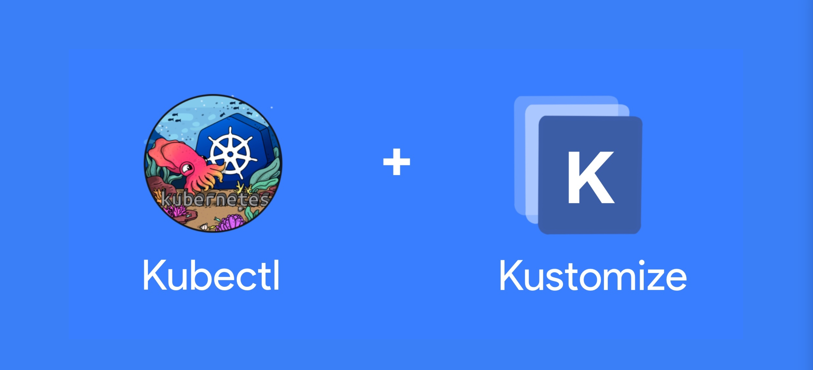
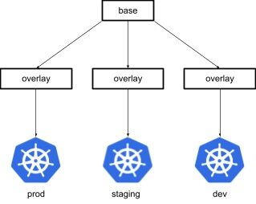

# 25.Kustomize

我们总是需要使用 Kubernetes 自定义我们的部署，我不知道为什么，但现在主要的工具是 HELM，它抛弃了我们在 docker 和 Kubernetes 上学到的所有逻辑。在这里给大家介绍一个替代品，叫做 `Kustomize`。




## 简介

Kustomize 不是一个新工具，它自 2017 年以来一直在建设中，并在 1.14 版本中作为原生 kubectl 子命令引入。Kustomize 由 Google 和 Kubernetes 社区构建，符合 Kubernetes 使用 Kubernetes 对象定义配置文件和以声明方式管理这些配置的原则。Kustomize 配置对象称为 Kustomization，用于描述如何生成或转换其他 Kubernetes 对象。Kustomization 在名为 `kustomization.yaml` 的文件中以声明方式定义，此文件可由 Kustomize 本身生成和修改。

在 kustomize 中，可以定义常见、可重复使用的 kustomization（称为基础）并使用多个其他 kustomization（称为覆盖层）对其进行修补，这些 kustomization 可以选择性地覆盖基础中定义的设置以生成变体。然后，Kustomize 根据 kustomization 基础和覆盖层中定义的配置转换和生成资源，此过程称为融合或渲染。接下来，这些渲染资源会写入标准输出或文件，并保持原始 YAML 文件不变，以便许多不同的叠加层重复使用基础。



这种无模板方法在 Kustomization 库的易用性和可重用性方面非常强大。使用它你能够以几乎任何想要的方式自定义 Kubernetes 配置，而无需为每个单独的用例提供大量值。


### Kustomize 的优势

- **Kustomize 是无模板的**：使用模板和值文件时，YAML 文件中的几乎所有规范都可以成为需要值的参数，并且值文件可能会非常大。Kustomize 处理配置数据，而不是将配置模板化为文本或将配置表示为代码。原始 YAML 可读且可重复使用，无论 Kustomize 是否呈现原始 YAML。Kustomize 模型不同；无需对所有内容进行参数化，因此可以更轻松地重复使用常用配置。
- **Kustomize 可以在 Kubernetes 命令行界面中以原生方式运行**：从 1.14 版开始，Kustomize 内置于 kubectl 中。因此，只要您使用 kubectl，就无需将 Kustomize 作为单独的依赖项来进行安装或管理。
- **Kustomize 完全是声明性的**：作为 Kubernetes 原生工具，Kustomize 与 Kubernetes 的声明式配置方法保持一致。您无需以命令方式逐步描述该工具应如何自定义资源，只需声明您想要的内容即可，Kustomize 会提供这些内容。
- **Kustomize 允许你重复使用同一基础配置来管理多项不同的配置**：你可以在多个不同环境（例如，开发、预演、生产）中使用一个基础文件，并且使用最小的唯一叠加层为每个环境自定义基础。
- **Kustomize 易于使用**：你可以从非常简单的配置开始，然后逐步构建更复杂的功能（每次构建一层）。
- **Kustomize 可扩展且可自定义**：Kustomize 支持插件框架，可让你以容器化和可执行 Kubernetes 资源模型 (KRM) 函数的方式编写自己的生成器和转换器。


## 使用


### 基础

要开始使用 Kustomize，你需要有原始的 yaml 文件来描述你要部署到集群中的任何资源。我们这里的示例将这些文件将存储在文件夹 `./k8s/base/` 中。

这些文件将永远不会被修改，我们将在它们上面应用自定义来创建新的资源定义。

注意：你可以随时使用命令 `kubectl apply -f ./k8s/base/` 构建基础模板（例如，用于开发环境）。
在此示例中，我们将使用一个 Service 和一个 Deployment 资源：

```yaml
apiVersion: v1
kind: Service
metadata:
  name: sl-demo-app
spec:
  ports:
    - name: http
      port: 8080
  selector:
    app: sl-demo-app
```

```yaml
apiVersion: apps/v1
kind: Deployment
metadata:
  name: sl-demo-app
spec:
  selector:
    matchLabels:
      app: sl-demo-app
  template:
    metadata:
      labels:
        app: sl-demo-app
    spec:
      containers:
        - name: app
          image: foo/bar:latest
          ports:
            - name: http
              containerPort: 8080
              protocol: TCP
```

我们将在该文件夹中添加一个名为 `kustomization.yaml` 的新文件：

```yaml
apiVersion: kustomize.config.k8s.io/v1beta1
kind: Kustomization

resources:
  - service.yaml
  - deployment.yaml
```

该文件将是你核心文件，它描述了你使用的资源，这些资源文件是相对于当前文件的路径。

> 注意：这个 `kustomization.yaml` 文件在运行 `kubectl apply -f ./k8s/base/` 时可能会导致错误，你可以使用参数 `--validate=false` 运行它，或者干脆不对整个文件夹运行命令。


要将该 base 基础模板应用到集群，你只需执行以下命令：

```shell
☸ ➜ kubectl apply -k k8s/base
```

但是这样会直接将我们的模板应用到集群中，有时候我们可能希望将模板渲染出来看下结果是否正确，这个时候我们可以去直接使用 kustomize 的命令 `kustomize build` 来实现，所以我们需要单独安装下 kustomize，对于 Mac 用户可以直接使用 brew 命令一键安装，其他系统可以直接前往 [Release 页面下载二进制文件](https://kubectl.docs.kubernetes.io/installation/kustomize/)，然后放入 PATH 路径即可。

```shell
☸ ➜ brew install kustomize
```

> 直接使用 `kubectl kustomize` 命令也可以替换 `kustomize build` 命令。


要查看将在你的集群中应用了什么，我们将在本文中主要使用命令 `kustomize build` 而不是 `kubectl apply -k`。

`kustomize build k8s/base` 命令的结果如下，会直接将两个文件连接在一起：

```shell
☸ ➜ kustomize build k8s/base
apiVersion: v1
kind: Service
metadata:
  name: sl-demo-app
spec:
  ports:
  - name: http
    port: 8080
  selector:
    app: sl-demo-app
---
apiVersion: apps/v1
kind: Deployment
metadata:
  name: sl-demo-app
spec:
  selector:
    matchLabels:
      app: sl-demo-app
  template:
    metadata:
      labels:
        app: sl-demo-app
    spec:
      containers:
      - image: foo/bar:latest
        name: app
        ports:
        - containerPort: 8080
          name: http
          protocol: TCP
```


### 定制

现在，我们想要针对特定  场景来定制我们的应用程序，例如，针对我们的生产环境，接下来我们将看到如何通过一些修改来增强我们的基础。

Kustomize 支持众多的功能特性：

| 字段 | 类型 | 解释 |
| --- | --- | --- |
| namespace | string | 为所有资源添加名字空间 |
| namePrefix | string | 此字段的值将被添加到所有资源名称前面 |
| nameSuffix | string | 此字段的值将被添加到所有资源名称后面 |
| commonLabels | map[string]string | 要添加到所有资源和选择算符的标签 |
| commonAnnotations | map[string]string | 要添加到所有资源的注解 |
| resources | []string | 列表中的每个条目都必须能够解析为现有的资源配置文件 |
| configMapGenerator | [][configmapargs](https://github.com/kubernetes-sigs/kustomize/blob/master/api/types/configmapargs.go#L7) | 列表中的每个条目都会生成一个 ConfigMap |
| secretGenerator | [][secretargs](https://github.com/kubernetes-sigs/kustomize/blob/master/api/types/secretargs.go#L7) | 列表中的每个条目都会生成一个 Secret |
| generatorOptions | [GeneratorOptions](https://github.com/kubernetes-sigs/kustomize/blob/master/api/types/generatoroptions.go#L7) | 更改所有 ConfigMap 和 Secret 生成器的行为 |
| bases | []string | 列表中每个条目都应能解析为一个包含 kustomization.yaml 文件的目录 |
| patchesStrategicMerge | []string | 列表中每个条目都能解析为某 Kubernetes 对象的策略性合并补丁 |
| patchesJson6902 | [][patch](https://github.com/kubernetes-sigs/kustomize/blob/master/api/types/patch.go#L10) | 列表中每个条目都能解析为一个 Kubernetes 对象和一个 JSON 补丁 |
| vars | [][var](https://github.com/kubernetes-sigs/kustomize/blob/master/api/types/var.go#L19) | 每个条目用来从某资源的字段来析取文字 |
| images | [][image](https://github.com/kubernetes-sigs/kustomize/blob/master/api/types/image.go#L8) | 每个条目都用来更改镜像的名称、标记与/或摘要，不必生成补丁 |
| configurations | []string | 列表中每个条目都应能解析为一个包含 [Kustomize 转换器配置](https://github.com/kubernetes-sigs/kustomize/tree/master/examples/transformerconfigs)
 的文件 |
| crds | []string | 列表中每个条目都应能够解析为 Kubernetes 类别的 OpenAPI 定义文件 |


我们这里的主要目标不是涵盖上面 Kustomize 的全部功能，而是作为一个标准示例向你展示此工具背后的理念。

首先，我们将创建文件夹 `k8s/overlays/prod`，其中包含一个 `kustomization.yaml` 文件，包含以下内容：

```yaml
apiVersion: kustomize.config.k8s.io/v1beta1
kind: Kustomization

bases:
  - ../../base
```

如果我们构建它，我们将看到与之前构建 base 时相同的结果。

```shell
☸ ➜ kustomize build k8s/overlays/prod
```

**为 Deployment 定义环境变量**

在 `base` 中，我们没有定义任何环境变量，现在我们将添加 `env` 变量到 `base` 中去，要做到这一点，非常简单，我们只需要创建我们想要在 base 之上应用的 yaml 块，并在 `kustomization.yaml` 中引用它。

`custom-env.yaml` 包含的环境变量如下所示：

```yaml
apiVersion: apps/v1
kind: Deployment
metadata:
  name: sl-demo-app
spec:
  template:
    spec:
      containers:
        - name: app # (1)
          env:
            - name: CUSTOM_ENV_VARIABLE
              value: Value defined by Kustomize ❤️
```

> 注意：这里的 `name` (1) 非常重要，可以让 Kustomize 找到需要修改的正确容器。


你可以看到这个 yaml 文件本身是无效的，但它只描述了我们想在之前的 base 上添加的内容。

我们只需将此文件添加到 `k8s/overlays/prod/kustomization.yaml` 中的 `patches` 属性下面即可：

```yaml
apiVersion: kustomize.config.k8s.io/v1beta1
kind: Kustomization

resources:
  - ../../base

patches:
  - path: custom-env.yaml
```

如果现在我们来构建，将会得到下面的结果:

```shell
☸ ➜ kustomize build k8s/overlays/prod
apiVersion: v1
kind: Service
metadata:
  name: sl-demo-app
spec:
  ports:
  - name: http
    port: 8080
  selector:
    app: sl-demo-app
---
apiVersion: apps/v1
kind: Deployment
metadata:
  name: sl-demo-app
spec:
  selector:
    matchLabels:
      app: sl-demo-app
  template:
    metadata:
      labels:
        app: sl-demo-app
    spec:
      containers:
      - env:
        - name: CUSTOM_ENV_VARIABLE
          value: Value defined by Kustomize ❤️
        image: foo/bar:latest
        name: app
        ports:
        - containerPort: 8080
          name: http
          protocol: TCP
```

可以看到我们上面定义的 `env` 块已应用在我们的 `base` 之上了，现在 `CUSTOM_ENV_VARIABLE` 将出现在我们的 `deployment.yaml` 中。

`patches` 属性中可以直接指定一个 yaml 文件，也可以直接在该属性这里修改资源，补丁可以包括容器镜像、端口、环境变量等。比如可以在 `kustomization.yaml` 文件中添加以下内容：

```yaml
patches:
  - target:
      kind: Deployment
      name: sl-demo-app
    patch: |-
      - op: replace
        path: /spec/template/spec/containers/0/image
        value: my-image:latest
```

上述内容将基础资源中名为 `sl-demo-app` 的 Deployment 的容器镜像修改为 `my-image:latest`。

**更改副本数量**

接下来我们想添加有关副本数量的信息，像之前一样，仅包含定义副本所需的额外信息的块或 yaml 就足够了：

```yaml
# replica-and-rollout-strategy.yaml
apiVersion: apps/v1
kind: Deployment
metadata:
  name: sl-demo-app
spec:
  replicas: 10
  strategy:
    rollingUpdate:
      maxSurge: 1
      maxUnavailable: 1
    type: RollingUpdate
```

和以前一样，我们将它添加到 `kustomization.yaml` 中的 `patches` 列表中：

```yaml
apiVersion: kustomize.config.k8s.io/v1beta1
kind: Kustomization

resources:
  - ../../base

patches:
  - path: custom-env.yaml
  - path: replica-and-rollout-strategy.yaml
```

同样执行命令 `kustomize build k8s/overlays/prod` 后会得到如下结果：

```shell
☸ ➜ kustomize build k8s/overlays/prod
apiVersion: v1
kind: Service
metadata:
  name: sl-demo-app
spec:
  ports:
  - name: http
    port: 8080
  selector:
    app: sl-demo-app
---
apiVersion: apps/v1
kind: Deployment
metadata:
  name: sl-demo-app
spec:
  replicas: 10
  selector:
    matchLabels:
      app: sl-demo-app
  strategy:
    rollingUpdate:
      maxSurge: 1
      maxUnavailable: 1
    type: RollingUpdate
  template:
    metadata:
      labels:
        app: sl-demo-app
    spec:
      containers:
      - env:
        - name: CUSTOM_ENV_VARIABLE
          value: Value defined by Kustomize ❤️
        image: foo/bar:latest
        name: app
        ports:
        - containerPort: 8080
          name: http
          protocol: TCP
```

可以看到副本数和 `rollingUpdate` 策略已经应用在 `base` 之上了。

**通过命令行使用 Secret 定义**

我们经常会从命令行将一些变量设置为 Secret 数据，这里我们使用 kustomize 的一个子命令来编辑 `kustomization.yaml` 并为创建一个 Secret，如下所示

```shell
☸ ➜ cd k8s/overlays/prod
☸ ➜ kustomize edit add secret sl-demo-app --from-literal=db-password=12345
```

上面的命令会修改 `kustomization.yaml` 文件并在其中添加一个 `SecretGenerator`，内容如下所示：

```yaml
apiVersion: kustomize.config.k8s.io/v1beta1
kind: Kustomization

resources:
  - ../../base

patches:
  - path: custom-env.yaml
  - path: replica-and-rollout-strategy.yaml
secretGenerator:
  - literals:
      - db-password=12345
    name: sl-demo-app
    type: Opaque
```

同样如果从示例项目的根文件夹运行 `kustomize build k8s/overlays/prod` 命令将获得以下输出。

```yaml
apiVersion: v1
data:
  db-password: MTIzNDU=
kind: Secret
metadata:
  name: sl-demo-app-gkmm8tkdd7
type: Opaque
---
apiVersion: v1
kind: Service
metadata:
  name: sl-demo-app
spec:
  ports:
    - name: http
      port: 8080
  selector:
    app: sl-demo-app
---
apiVersion: apps/v1
kind: Deployment
metadata:
  name: sl-demo-app
spec:
  replicas: 10
  selector:
    matchLabels:
      app: sl-demo-app
  strategy:
    rollingUpdate:
      maxSurge: 1
      maxUnavailable: 1
    type: RollingUpdate
  template:
    metadata:
      labels:
        app: sl-demo-app
    spec:
      containers:
        - env:
            - name: CUSTOM_ENV_VARIABLE
              value: Value defined by Kustomize ❤️
          image: foo/bar:latest
          name: app
          ports:
            - containerPort: 8080
              name: http
              protocol: TCP
```

注意上面生成的 Secret 对象名称是 `sl-demo-app-gkmm8tkdd7` 而不是 `sl-demo-app`，这是正常的，如果 Secret 内容发生变化，就可以触发 Deployment 的滚动更新。

如果想在我们的 Deployment 中使用这个 Secret，我们只需要像以前一样添加一个使用 Secret 的新层定义即可。比如我们将 `db-password` 值以环境变量的方式注入 pod，则可以声明如下的层文件：

```yaml
# database-secret.yaml
apiVersion: apps/v1
kind: Deployment
metadata:
  name: sl-demo-app
spec:
  template:
    spec:
      containers:
        - name: app
          env:
            - name: "DB_PASSWORD"
              valueFrom:
                secretKeyRef:
                  name: sl-demo-app
                  key: db.password
```

然后在 `kustomization.yaml` 文件 `pathes` 中添加上面的层文件：

```yaml
apiVersion: kustomize.config.k8s.io/v1beta1
kind: Kustomization

resources:
  - ../../base

patches:
  - path: custom-env.yaml
  - path: replica-and-rollout-strategy.yaml
  - path: database-secret.yaml

secretGenerator:
  - literals:
      - db-password=12345
    name: sl-demo-app
    type: Opaque
```

构建后可以得到如下的结果：

```shell
☸ ➜ kustomize build k8s/overlays/prod
apiVersion: v1
data:
  db-password: MTIzNDU=
kind: Secret
metadata:
  name: sl-demo-app-gkmm8tkdd7
type: Opaque
---
apiVersion: v1
kind: Service
metadata:
  name: sl-demo-app
spec:
  ports:
  - name: http
    port: 8080
  selector:
    app: sl-demo-app
---
apiVersion: apps/v1
kind: Deployment
metadata:
  name: sl-demo-app
spec:
  replicas: 10
  selector:
    matchLabels:
      app: sl-demo-app
  strategy:
    rollingUpdate:
      maxSurge: 1
      maxUnavailable: 1
    type: RollingUpdate
  template:
    metadata:
      labels:
        app: sl-demo-app
    spec:
      containers:
      - env:
        - name: DB_PASSWORD
          valueFrom:
            secretKeyRef:
              key: db.password
              name: sl-demo-app-gkmm8tkdd7
        - name: CUSTOM_ENV_VARIABLE
          value: Value defined by Kustomize ❤️
        image: foo/bar:latest
        name: app
        ports:
        - containerPort: 8080
          name: http
          protocol: TCP
```

可以看到 Deployment 中新增了 `DB_PASSWORD` 这部分内容，使用的 `secretKeyRef.name` 名称则为 Secret 的名称。

**更改镜像**

与 Secret 一样，有一个自定义指令允许直接从命令行更改镜像或标签，如果你是通过 CI/CD 来发布应用这将非常有用，如下所示：

```shell
☸ ➜ cd k8s/overlays/prod
☸ ➜ TAG_VERSION=3.4.5 # (1)
☸ ➜ kustomize edit set image foo/bar=foo/bar:☸ ➜TAG_VERSION
```

这里的 `TAG_VERSION` 通常是我们的 CI/CD 系统来定义的，上面的命令执行后，`kustomization.yaml` 文件中会新增一个 `images` 的属性，里面包括 `newName` 和 `newTag` 两个属性：

```yaml
apiVersion: kustomize.config.k8s.io/v1beta1
kind: Kustomization

resources:
  - ../../base

patches:
  - path: custom-env.yaml
  - path: replica-and-rollout-strategy.yaml
  - path: database-secret.yaml

secretGenerator:
  - literals:
      - db-password=12345
    name: sl-demo-app
    type: Opaque
images:
  - name: foo/bar
    newName: foo/bar
    newTag: 3.4.5
```

同样执行 build 命令后得到的 Deployment 中的 image 就是 `foo/bar:3.4.5`。

**变量**

有些时候，Pod 中运行的应用可能需要使用来自其他对象的配置值。 例如，某 Deployment 对象的 Pod 需要从环境变量或命令行参数中读取 Service 的名称。由于在 `kustomization.yaml` 文件中添加 `namePrefix` 或 `nameSuffix` 时 Service 名称可能发生变化，所以建议不要在命令参数中进行硬编码。对于这种使用场景，Kustomize 可以通过 `vars` 将 Service 名称注入到容器中。

比如我们这里创建一个 `k8s/overlays/vars` 的 overlay，其中的添加一个 `deployment.yaml` 文件，内容如下诉讼：

```yaml
apiVersion: apps/v1
kind: Deployment
metadata:
  name: my-nginx
spec:
  selector:
    matchLabels:
      run: my-nginx
  replicas: 2
  template:
    metadata:
      labels:
        run: my-nginx
    spec:
      containers:
        - name: my-nginx
          image: nginx
          command: ["start", "--host", "$(MY_SERVICE_NAME)"]
```

同样再创建一个 `service.yaml` 文件，内容如下所示：

```yaml
apiVersion: v1
kind: Service
metadata:
  name: my-nginx
  labels:
    run: my-nginx
spec:
  ports:
    - port: 80
      protocol: TCP
  selector:
    run: my-nginx
```

注意看在 Deployment 的命令中我们使用了一个 `☸ ➜(MY_SERVICE_NAME)` 变量，所以接下来我们创建一个 `kustomization.yaml` 文件，在其中来定义该变量，内容如下所示：

```yaml
namePrefix: dev-
nameSuffix: "-001"

resources:
  - deployment.yaml
  - service.yaml

vars:
  - name: MY_SERVICE_NAME
    objref:
      kind: Service
      name: my-nginx
      apiVersion: v1
    # fieldref:  # 如果不指定 fieldref ，则使用默认的 metadata.name
    #   fieldpath: metadata.name
```

这里我们定义了变量 `MY_SERVICE_NAME`，其中的 `objref` 表示该变量的值来自于的对应引用。现在我们来构建该 overlay 查看结果：

```shell
☸ ➜ kustomize build k8s/overlays/vars
apiVersion: v1
kind: Service
metadata:
  labels:
    run: my-nginx
  name: dev-my-nginx-001
spec:
  ports:
  - port: 80
    protocol: TCP
  selector:
    run: my-nginx
---
apiVersion: apps/v1
kind: Deployment
metadata:
  name: dev-my-nginx-001
spec:
  replicas: 2
  selector:
    matchLabels:
      run: my-nginx
  template:
    metadata:
      labels:
        run: my-nginx
    spec:
      containers:
      - command:
        - start
        - --host
        - dev-my-nginx-001
        image: nginx
        name: my-nginx
```

可以看到我们定义的参数被替换成了 `dev-my-nginx-001`，这恰好是加上了前缀和后缀的结果。

**融合不同团队的配置数据**

比如现在有一个场景是在生产环境中有一个由多个内部团队（注册、结账和搜索等）共同开发的 Java 商店服务。

这个服务在不同的环境（development、testing、staging 和 production）中运行，从 Java 的 `properties` 文件中读取配置。为每个环境维护一个大的 `properties` 文件是比较困难的，因为这个文件需要频繁的修改，并且这些修改都需要由 devops 工程师来进行，因为：

- 这个文件包含 devops 工程师需要知道，而开发人员不必知道的值
- 比如生产环境的 `properties` 包含敏感数据，比如生产数据库的登录凭据。

实际上属性可以分为不同的类别，比如国际化数据、物理常量，外部服务位置等静态数据，这些无论哪个环境，都一样的配置，这些都只需要一组配置，可以将这组配置放在一个文件中 `common.properties`。

而静态资源（HTML、CSS、JavaScript）的位置，产品和用户的数据表，负载均衡的端口，日志收集等。这些属性的不同，恰恰是环境的不同之处。DevOps 或 SRE 工程师需要完全控制生产环境中的这些配置；测试需要调整数据库来支持测试；而开发则希望尝试开发中遇到的各种不同的情景。我们就可以将这些值放入：

- `development/plumbing.properties`
- `staging/plumbing.properties`
- `production/plumbing.properties`

而对于一些机密配置，比如用户表的位置、数据库凭证、解密密钥等，这些需要 devops 工程师控制，其他人没有访问权限。我们可以将这些值放入：

- `development/secret.properties`
- `staging/secret.properties`
- `production/secret.properties`

对于这些机密配置可以使用一些专门用于存储密码的服务，然后使用 kustomize 中的 `secretGenerator` 字段在 Kubernetes 中创建 Secret 对象。

在实际操作的时候基于相同的 base 创建 n 个 overlays 来创建 n 个集群环境，这里面我们就只使用 `development` 和 `production` 两个环境即可，其他环境都是一样的方式。

首先我们在 base 中添加共有的资源文件，并在 `kustomization.yaml` 文件引入该配置：

```shell
☸ ➜ cat <<EOF >k8s/base/common.properties
color=blue
height=10m
EOF

☸ ➜ cat <<EOF >k8s/base/kustomization.yaml
configMapGenerator:
- name: my-configmap
  files:
  - common.properties
EOF
```

然后创建一个 development 环境的 overlay：

```shell
☸ ➜ mkdir -p k8s/overlays/development

☸ ➜ cat <<EOF >k8s/overlays/development/plumbing.properties
port=30000
EOF

☸ ➜ cat <<EOF >k8s/overlays/development/secret.properties
dbpassword=thisisdbpassword
EOF

☸ ➜ cat <<EOF >k8s/overlays/development/kustomization.yaml
resources:
- ../../base
namePrefix: dev-
nameSuffix: -v1
configMapGenerator:
- name: my-configmap
  behavior: merge
  files:
  - plumbing.properties
  - secret.properties
EOF
```

这里我们在 deployment 的 overlay 中引用了前面定义的 base 资源，并通过 `configMapGenerator` `behavior: merge` 配置来合并其他的配置文件。现在我们就可以生成开发使用的 ConfigMaps 了：

```shell
☸ ➜ kustomize build k8s/overlays/development
apiVersion: v1
data:
  common.properties: |
    color=blue
    height=10m
  plumbing.properties: |
    port=30000
  secret.properties: |
    dbpassword=thisisdbpassword
kind: ConfigMap
metadata:
  name: dev-my-configmap-v1-5cm82kbdm8
```

可以看到最后输出的 ConfigMap 内容就包含了几个地方的属性文件内容。

同样的方式接下来创建 production 环境的 overlay：

```shell
☸ ➜ mkdir -p k8s/overlays/production

☸ ➜ cat <<EOF >k8s/overlays/production/plumbing.properties
port=8080
EOF

☸ ➜ cat <<EOF >k8s/overlays/production/secret.properties
dbpassword=thisShouldProbablyBeInASecretInstead
EOF

☸ ➜ cat <<EOF >k8s/overlays/production/kustomization.yaml
resources:
- ../../base
namePrefix: prod-
configMapGenerator:
- name: my-configmap
  behavior: merge
  files:
  - plumbing.properties
  - secret.properties
EOF
```

可以看到配置文件和开发环境几乎一样，只是我们只需要在 production 的 overlay 里面定义该环境需要的配置即可，现在我们来生成用于生产的 ConfigMap：

```shell
☸ ➜ kustomize build k8s/overlays/production
apiVersion: v1
data:
  common.properties: |
    color=blue
    height=10m
  plumbing.properties: |
    port=8080
  secret.properties: |
    dbpassword=thisShouldProbablyBeInASecretInstead
kind: ConfigMap
metadata:
  name: prod-my-configmap-k6fh945db9
```

我们可以直接在 CI/CD 流程中执行如下命令，将应用部署到集群：

```shell
☸ ➜ kustomize build k8s/overlay/production | kubectl apply -f -
```


## 总结

通过上面的这些简单示例我们可以了解如何利用 Kustomize 的强大功能来定义 Kubernetes 资源文件，甚至无需使用模板系统。我们所做的所有修改文件都将应用在原始文件之上，而无需使用花括号和命令式修改对其进行更改。


> 原文: <https://www.yuque.com/cnych/k8s4/tbmaxgit1wpqg1fk>