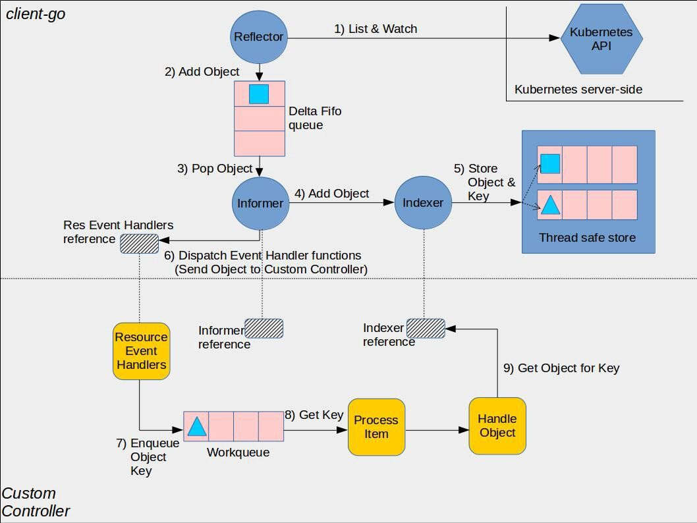
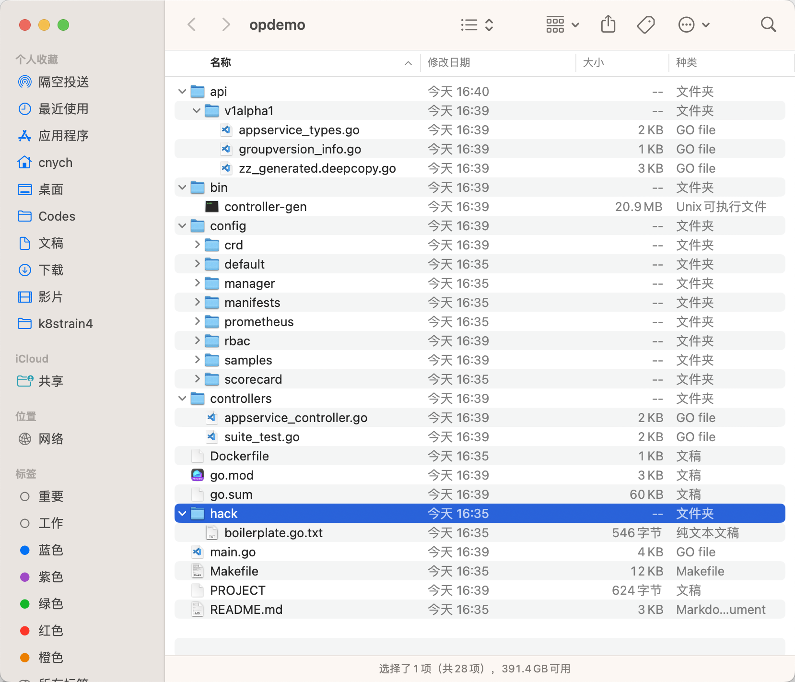

# 27.CRD与Operator

`Custom Resource Define` 简称 CRD，是 Kubernetes（v1.7+）为提高可扩展性，让开发者去自定义资源的一种方式。CRD 资源可以动态注册到集群中，注册完毕后，用户可以通过 kubectl 来创建访问这个自定义的资源对象，类似于操作 Pod 一样。不过需要注意的是 CRD 仅仅是资源的定义而已，需要一个 Controller 去监听 CRD 的各种事件来添加自定义的业务逻辑。


## 定义

如果说只是对 CRD 资源本身进行 CRUD 操作的话，不需要 Controller 也是可以实现的，相当于就是只有数据存入了 etcd 中，而没有对这个数据的相关操作而已。比如我们可以定义一个如下所示的 CRD 资源清单文件：

```yaml
# crd-demo.yaml
apiVersion: apiextensions.k8s.io/v1
kind: CustomResourceDefinition
metadata:
  # name 必须匹配下面的spec字段：<plural>.<group>
  name: crontabs.stable.example.com
spec:
  # group 名用于 REST API 中的定义：/apis/<group>/<version>
  group: stable.example.com
  # 列出自定义资源的所有 API 版本
  versions:
    - name: v1beta1 # 版本名称，比如 v1、v2beta1 等等
      served: true # 是否开启通过 REST APIs 访问 `/apis/<group>/<version>/...`
      storage: true # 必须将一个且只有一个版本标记为存储版本
      schema: # 定义自定义对象的声明规范
        openAPIV3Schema:
          description: Define CronTab YAML Spec
          type: object
          properties:
            spec:
              type: object
              properties:
                cronSpec:
                  type: string
                image:
                  type: string
                replicas:
                  type: integer
  # 定义作用范围：Namespaced（命名空间级别）或者 Cluster（整个集群）
  scope: Namespaced
  names:
    # kind 是 sigular 的一个驼峰形式定义，在资源清单中会使用
    kind: CronTab
    # plural 名字用于 REST API 中的定义：/apis/<group>/<version>/<plural>
    plural: crontabs
    # singular 名称用于 CLI 操作或显示的一个别名
    singular: crontab
    # shortNames 相当于缩写形式
    shortNames:
      - ct
```

> 需要注意的是 v1.16 版本以后已经 GA 了，使用的是 v1 版本，之前都是 v1beta1，定义规范有部分变化，所以要注意版本变化。


这个地方的定义和我们定义普通的资源对象比较类似，我们说我们可以随意定义一个自定义的资源对象，但是在创建资源的时候，肯定不是任由我们随意去编写 YAML 文件的，当我们把上面的 CRD 文件提交给 Kubernetes 之后，Kubernetes 会对我们提交的声明文件进行校验，从定义可以看出 CRD 是基于 [OpenAPI v3 schem](https://github.com/OAI/OpenAPI-Specification/blob/master/versions/3.0.0.md#schemaObject) 进行规范的。当然这种校验只是对于字段的类型进行校验，比较初级，如果想要更加复杂的校验，这个时候就需要通过 Kubernetes 的 admission webhook 来实现了。关于校验的更多用法，可以前往[官方文档](https://kubernetes.io/docs/tasks/access-kubernetes-api/custom-resources/custom-resource-definitions/#validation)查看。

同样现在我们可以直接使用 kubectl 来创建这个 CRD 资源清单：

```shell
☸ ➜ kubectl apply -f crd-demo.yaml
customresourcedefinition.apiextensions.k8s.io/crontabs.stable.example.com created
```

这个时候我们可以查看到集群中已经有我们定义的这个 CRD 资源对象了：

```shell
☸ ➜ kubectl get crd |grep example
crontabs.stable.example.com                      2019-12-19T02:37:54Z
```

这个时候一个新的 namespace 级别的 RESTful API 就会被创建：

```shell
/apis/stable/example.com/v1beta1/namespaces/*/crontabs/...
```

然后我们就可以使用这个 API 端点来创建和管理自定义的对象，这些对象的类型就是上面创建的 CRD 对象规范中的 `CronTab`。

现在在 Kubernetes 集群中我们就多了一种新的资源叫做 `crontabs.stable.example.com`，我们就可以使用它来定义一个 `CronTab` 资源对象了，这个自定义资源对象里面可以包含的字段我们在定义的时候通过 `schema` 进行了规范，比如现在我们来创建一个如下所示的资源清单：

```yaml
# crd-crontab-demo.yaml
apiVersion: stable.example.com/v1beta1
kind: CronTab
metadata:
  name: my-new-cron-object
spec:
  cronSpec: "* * * * */5"
  image: my-awesome-cron-image
```

我们可以直接创建这个对象：

```shell
☸ ➜ kubectl apply -f crd-crontab-demo.yaml
crontab.stable.example.com/my-new-cron-object created
```

然后我们就可以用 kubectl 来管理我们这里创建 CronTab 对象了，比如：

```shell
☸ ➜ kubectl get ct  # 简写
NAME                 AGE
my-new-cron-object   42s
☸ ➜ kubectl get crontab
NAME                 AGE
my-new-cron-object   88s
```

在使用 kubectl 的时候，资源名称是不区分大小写的，我们可以使用 CRD 中定义的单数或者复数形式以及任何简写。我们也可以查看创建的这个对象的原始 YAML 数据：

```shell
☸ ➜ kubectl get ct -o yaml
apiVersion: v1
items:
- apiVersion: stable.example.com/v1beta1
  kind: CronTab
  metadata:
    annotations:
      kubectl.kubernetes.io/last-applied-configuration: |
        {"apiVersion":"stable.example.com/v1beta1","kind":"CronTab","metadata":{"annotations":{},"name":"my-new-cron-object","namespace":"default"},"spec":{"cronSpec":"* * * * */5","image":"my-awesome-cron-image"}}
    creationTimestamp: "2019-12-19T02:52:55Z"
    generation: 1
    name: my-new-cron-object
    namespace: default
    resourceVersion: "12342275"
    selfLink: /apis/stable.example.com/v1beta1/namespaces/default/crontabs/my-new-cron-object
    uid: dace308d-5f54-4232-9c7b-841adf6bab62
  spec:
    cronSpec: '* * * * */5'
    image: my-awesome-cron-image
kind: List
metadata:
  resourceVersion: ""
  selfLink: ""
```

我们可以看到它包含了上面我们定义的 `cronSpec` 和 `image` 字段。


## Controller

就如上面我们说的，现在我们自定义的资源创建完成了，但是也只是单纯的把资源清单数据存入到了 etcd 中而已，并没有什么其他用处，因为我们没有定义一个对应的 Controller 来处理他。

官方提供了一个自定义 Controller 的示例：[https://github.com/kubernetes/sample-controller](https://github.com/kubernetes/sample-controller)，实现了：

- 如何注册资源 Foo
- 如何创建、删除和查询 Foo 对象
- 如何监听 Foo 资源对象的变化情况

要想了解 Controller 的实现原理和方式，我们就需要了解下 [client-go](https://github.com/kubernetes/client-go/) 这个库的实现，Kubernetes 部分代码也是基于这个库实现的，也包含了开发自定义控制器时可以使用的各种机制，这些机制在 client-go 源码的 [tools/cache](https://github.com/kubernetes/client-go/tree/master/tools/cache) 目录下面有定义。

下图显示了 client-go 中的各个组件是如何工作的以及与我们要编写的自定义控制器代码的交互入口：



**client-go 组件**：

- Reflector：通过 Kubernetes API 监控 Kubernetes 的资源类型 采用 List/Watch 机制, 可以 Watch 任何资源包括 CRD 添加 object 对象到 FIFO 队列，然后 Informer 会从队列里面取数据
- Informer：controller 机制的基础，循环处理 object 对象 从 Reflector 取出数据，然后将数据给到 Indexer 去缓存，提供对象事件的 handler 接口，只要给 Informer 添加 `ResourceEventHandler` 实例的回调函数，去实现 `OnAdd(obj interface{})`、 `OnUpdate(oldObj, newObj interface{})` 和 `OnDelete(obj interface{})` 这三个方法，就可以处理好资源的创建、更新和删除操作了。
- Indexer：提供 object 对象的索引，是线程安全的，缓存对象信息

**controller 组件**：

- Informer reference: controller 需要创建合适的 Informer 才能通过 Informer reference 操作资源对象
- Indexer reference: controller 创建 Indexer reference 然后去利用索引做相关处理
- Resource Event Handlers：Informer 会回调这些 handlers
- Work queue: Resource Event Handlers 被回调后将 key 写到工作队列，这里的 key 相当于事件通知，后面根据取出事件后，做后续的处理
- Process Item：从工作队列中取出 key 后进行后续处理，具体处理可以通过 Indexer reference controller 可以直接创建上述两个引用对象去处理，也可以采用工厂模式，官方都有相关示例

`client-go/tool/cache/` 和自定义 Controller 的控制流([图片来源](https://itnext.io/how-to-create-a-kubernetes-custom-controller-using-client-go-f36a7a7536cc))：


如上图所示主要有两个部分，一个是发生在 `SharedIndexInformer` 中，另外一个是在自定义控制器中。

1.  `Reflector` 通过 Kubernetes APIServer 执行对象（比如 Pod）的 `ListAndWatch` 查询，记录和对象相关的三种事件类型`Added`、`Updated`、`Deleted`，然后将它们传递到 `DeltaFIFO` 中去。 
2.  `DeltaFIFO` 接收到事件和 watch 事件对应的对象，然后将他们转换为 `Delta` 对象，这些 `Delta` 对象被附加到队列中去等待处理，对于已经删除的，会检查线程安全的 store 中是否已经存在该文件，从而可以避免在不存在某些内容时排队执行删除操作。 
3.  Cache 控制器（不要和自定义控制器混淆）调用 `Pop()` 方法从 `DeltaFIFO` 队列中出队列，`Delta` 对象将传递到 `SharedIndexInformer` 的 `HandleDelta()` 方法中以进行进一步处理。 
4.  根据 `Delta` 对象的操作（事件）类型，首先在 `HandleDeltas` 方法中通过 `indexer` 的方法将对对象保存到线程安全的 Store 中，然后，通过 `SharedIndexInformer` 中的 `sharedProcessor` 的 `distribution()` 方法将这些对象发送到事件 handlers，这些事件处理器由自定义控制器通过 `SharedInformer` 的方法比如 `AddEventHandlerWithResyncPeriod()` 进行注册。 
5.  已注册的事件处理器通过添加或更新时间的 `MetaNamespaceKeyFunc()` 或删除事件的 `DeletionHandingMetaNamespaceKeyFunc()` 将对象转换为格式为 `namespace/name` 或只是 `name` 的 key，然后将这个 key 添加到自定义控制器的 `workqueue` 中，`workqueues` 的实现可以在 `util/workqueue` 中找到。 
6.  自定义的控制器通过调用定义的 handlers 处理器从 workqueue 中 pop 一个 key 出来进行处理，handlers 将调用 indexer 的 `GetByKey()` 从线程安全的 store 中获取对象，我们的业务逻辑就是在这个 handlers 里面实现。 

`client-go` 中也有自定义 Controller 的样例代码，位于：`k8s.io/client-go/examples/workqueue/main.go`。


## Operator

`Operator` 就可以看成是 CRD 和 Controller 的一种组合特例，Operator 是一种思想，它结合了特定领域知识并通过 CRD 机制扩展了 Kubernetes API 资源，使用户管理 Kubernetes 的内置资源（Pod、Deployment 等）一样创建、配置和管理应用程序，Operator 是一个特定的应用程序的控制器，通过扩展 Kubernetes API 资源以代表 Kubernetes 用户创建、配置和管理复杂应用程序的实例，通常包含资源模型定义和控制器，通过 `Operator` 通常是为了实现某种特定软件（通常是有状态服务）的自动化运维。

我们完全可以通过上面的方式编写一个 CRD 对象，然后去手动实现一个对应的 Controller 就可以实现一个 Operator，但是我们也发现从头开始去构建一个 CRD 控制器并不容易，需要对 Kubernetes 的 API 有深入了解，并且 RBAC 集成、镜像构建、持续集成和部署等都需要很大工作量。为了解决这个问题，社区就推出了对应的简单易用的 Operator 框架，比较主流的是 [kubebuilder](https://github.com/kubernetes-sigs/kubebuilder) 和 [Operator Framework](https://coreos.com/operators)，这两个框架的使用基本上差别不大，我们可以根据自己习惯选择一个即可。


## Operator Framework

[Operator Framework](https://sdk.operatorframework.io) 是 CoreOS 开源的一个用于快速开发 Operator 的工具包，该框架包含两个主要的部分：

- Operator SDK: 无需了解复杂的 Kubernetes API 特性，即可让你根据你自己的专业知识构建一个 Operator 应用。
- Operator Lifecycle Manager（OLM）: 帮助你安装、更新和管理跨集群的运行中的所有 Operator（以及他们的相关服务）


Operator SDK 提供以下工作流来开发一个新的 Operator：

1. 使用 SDK 创建一个新的 Operator 项目
2. 通过添加自定义资源（CRD）定义新的资源 API
3. 指定使用 SDK API 来 watch 的资源
4. 定义 Operator 的协调（reconcile）逻辑
5. 使用 Operator SDK 构建并生成 Operator 部署清单文件


## 示例

我们平时在部署一个简单的 Webserver 到 Kubernetes 集群中的时候，都需要先编写一个 Deployment 的控制器，然后创建一个 Service 对象，通过 Pod 的 label 标签进行关联，最后通过 Ingress 或者 type=NodePort 类型的 Service 来暴露服务，每次都需要这样操作，是不是略显麻烦，我们就可以创建一个自定义的资源对象，通过我们的 CRD 来描述我们要部署的应用信息，比如镜像、服务端口、环境变量等等，然后创建我们的自定义类型的资源对象的时候，通过控制器去创建对应的 Deployment 和 Service，是不是就方便很多了，相当于我们用一个资源清单去描述了 Deployment 和 Service 要做的两件事情。

这里我们将创建一个名为 AppService 的 CRD 资源对象，然后定义如下的资源清单进行应用部署：

```yaml
apiVersion: app.ydzs.io/v1beta1
kind: AppService
metadata:
  name: nginx-app
spec:
  size: 2
  image: nginx:1.7.9
  ports:
    - port: 80
      targetPort: 80
      nodePort: 30002
```

通过这里的自定义的 AppService 资源对象去创建副本数为 2 的 Pod，然后通过 `nodePort=30002` 的端口去暴露服务，接下来我们就来一步一步的实现我们这里的这个简单的 Operator 应用。


### 开发环境

要开发 Operator 自然 Kubernetes 集群是少不了的，还需要 Golang 的环境，这里的安装就不多说了。然后需要安装 `operator-sdk`，operator sdk 安装方法非常多，我们可以直接在 github 上面下载需要使用的版本，然后放置到 PATH 环境下面即可，当然也可以将源码 clone 到本地手动编译安装即可，如果你是 Mac，当然还可以使用常用的 brew 工具进行安装：

```shell
☸ ➜ brew install operator-sdk
......
☸ ➜ operator-sdk version
operator-sdk version: "v0.19.1", commit: "24395e17b0f2601320227b7ca32b5f54db000e42", kubernetes version: "v1.18.2", go version: "go1.13.12 darwin/amd64"
☸ ➜ go version
go version go1.19.1 darwin/arm64
```


### 创建项目

环境准备好了，接下来就可以使用 `operator-sdk` 直接创建一个新的项目了，命令格式为：`operator-sdk new`。

按照上面我们预先定义的 CRD 资源清单，我们这里可以这样创建：

```shell
☸ ➜ mkdir opdemo && cd opdemo
☸ ➜ export GOPROXY="https://goproxy.cn" # 使用包代理，加速
# 使用 sdk 创建一个名为 opdemo 的 operator 项目
☸ ➜ operator-sdk init --domain ydzs.io --repo github.com/cnych/opdemo
Writing kustomize manifests for you to edit...
Writing scaffold for you to edit...
Get controller runtime:
$ go get sigs.k8s.io/controller-runtime@v0.14.1
Update dependencies:
$ go mod tidy
Next: define a resource with:
$ operator-sdk create api
☸ ➜ tree -L 2
.
├── Dockerfile
├── Makefile
├── PROJECT
├── README.md
├── config
│   ├── default
│   ├── manager
│   ├── manifests
│   ├── prometheus
│   ├── rbac
│   └── scorecard
├── go.mod
├── go.sum
├── hack
│   └── boilerplate.go.txt
└── main.go

8 directories, 8 files
```

到这里一个全新的 Operator 项目就新建完成了。使用 `operator-sdk new` 命令创建新的 Operator 项目后，项目目录就包含了很多生成的文件夹和文件。

接下来我们需要添加 api 的定义以及对应的 controller 实现。


### 添加 API

接下来为我们的自定义资源添加一个新的 API，按照上面我们预定义的资源清单文件，在 Operator 相关根目录下面执行如下命令：

```shell
☸ ➜ operator-sdk create api --group app.ydzs.io --version v1alpha1 --kind=AppService --resource --controller
Writing kustomize manifests for you to edit...
Writing scaffold for you to edit...
api/v1alpha1/appservice_types.go
controllers/appservice_controller.go
Update dependencies:
$ go mod tidy
Running make:
$ make generate
mkdir -p /Users/cnych/Documents/course/k8strain4/opdemo/bin
test -s /Users/cnych/Documents/course/k8strain4/opdemo/bin/controller-gen && /Users/cnych/Documents/course/k8strain4/opdemo/bin/controller-gen --version | grep -q v0.11.1 || \
        GOBIN=/Users/cnych/Documents/course/k8strain4/opdemo/bin go install sigs.k8s.io/controller-tools/cmd/controller-gen@v0.11.1
go: downloading sigs.k8s.io/controller-tools v0.11.1
go: downloading golang.org/x/tools v0.4.0
go: downloading github.com/gobuffalo/flect v0.3.0
/Users/cnych/Documents/course/k8strain4/opdemo/bin/controller-gen object:headerFile="hack/boilerplate.go.txt" paths="./..."
Next: implement your new API and generate the manifests (e.g. CRDs,CRs) with:
$ make manifests
```

添加完成后，我们可以看到类似于下面的这样项目结构：


这样整个 Operator 项目的脚手架就已经搭建完成了，接下来就是具体的实现了。


### 自定义 API

打开源文件 `api/v1alpha1/appservice_types.go`，需要我们根据我们的需求去自定义结构体 `AppServiceSpec`，我们最上面预定义的资源清单中就有 `size`、`image`、`ports` 这些属性，所有我们需要用到的属性都需要在这个结构体中进行定义：

```go
type AppServiceSpec struct {
	// INSERT ADDITIONAL SPEC FIELDS - desired state of cluster
	// Important: Run "operator-sdk generate k8s" to regenerate code after modifying this file
	// Add custom validation using kubebuilder tags: https://book.kubebuilder.io/beyond_basics/generating_crd.html
	Size  	  *int32                      `json:"size"`
	Image     string                      `json:"image"`
	Resources *Resources                  `json:"resources,omitempty"`
	Envs      []corev1.EnvVar             `json:"envs,omitempty"`
	Ports     []corev1.ServicePort        `json:"ports,omitempty"`
}
type Resources struct {
	// Limits describes the maximum amount of compute resources allowed.
	// +optional
	Limits corev1.ResourceList `json:"limits,omitempty" protobuf:"bytes,1,rep,name=limits,casttype=ResourceList,castkey=ResourceName"`
	// Requests describes the minimum amount of compute resources required.
	// If Requests is omitted for a container, it defaults to Limits if that is explicitly specified,
	// otherwise to an implementation-defined value.
	// +optional
	Requests corev1.ResourceList `json:"requests,omitempty" protobuf:"bytes,2,rep,name=requests,casttype=ResourceList,castkey=ResourceName"`
}
```

代码中会涉及到一些包名的导入，由于包名较多，所以我们会使用一些别名进行区分，主要的包含下面几个：

```go
import (
    appsv1 "k8s.io/api/apps/v1"
    corev1 "k8s.io/api/core/v1"
    appv1 "github.com/cnych/opdemo/pkg/apis/app/v1"
    metav1 "k8s.io/apimachinery/pkg/apis/meta/v1"
)
```

这里的 resources、envs、ports 的定义都是直接引用的 `"k8s.io/api/core/v1"` 中定义的结构体，而且需要注意的是我们这里使用的是 `ServicePort`，而不是像传统的 Pod 中定义的 ContanerPort，这是因为我们的资源清单中不仅要描述容器的 Port，还要描述 Service 的 Port。

然后一个比较重要的结构体 `AppServiceStatus` 用来描述资源的状态，当然我们可以根据需要去自定义状态的描述，我这里就偷懒直接使用 Deployment 的状态了：

```go
type AppServiceStatus struct {
	// INSERT ADDITIONAL STATUS FIELD - define observed state of cluster
	// Important: Run "operator-sdk generate k8s" to regenerate code after modifying this file
	// Add custom validation using kubebuilder tags: https://book.kubebuilder.io/beyond_basics/generating_crd.html
	appsv1.DeploymentStatus `json:",inline"`
}
```

定义完成后，在项目根目录下面执行如下命令：

```shell
☸ ➜ make generate
```

该命令是用来根据我们自定义的 API 描述来自动生成一些代码，目录 `api/v1alpha1/` 下面以 `zz_generated` 开头的文件就是自动生成的代码，里面的内容并不需要我们去手动编写。

这样我们就算完成了对自定义资源对象的 API 的声明。


### 实现业务逻辑

上面 API 描述声明完成了，接下来就需要我们来进行具体的业务逻辑实现了，编写具体的 controller 实现，打开源文件`controllers/appservice_controller.go`，需要我们去更改的地方也不是很多，核心的就是`Reconcile` 方法，该方法就是去不断的 watch 资源的状态，然后根据状态的不同去实现各种操作逻辑，核心代码如下：

```go
func (r *AppServiceReconciler) Reconcile(ctx context.Context, req ctrl.Request) (ctrl.Result, error) {
	reqLogger := log.Log.WithValues("Request.Namespace", req.Namespace, "Request.Name", req.Name)
	reqLogger.Info("Reconciling AppService")

	// Fetch the AppService instance
	instance := &appv1alpha1.AppService{}
	err := r.Get(context.TODO(), req.NamespacedName, instance)
	if err != nil {
		if errors.IsNotFound(err) {
			// Request object not found, could have been deleted after reconcile request.
			// Owned objects are automatically garbage collected. For additional cleanup logic use finalizers.
			// Return and don't requeue
			return ctrl.Result{}, nil
		}
		// Error reading the object - requeue the request.
		return ctrl.Result{}, err
	}

	if instance.DeletionTimestamp != nil {
		return ctrl.Result{}, err
	}

	// 如果不存在，则创建关联资源
	// 如果存在，判断是否需要更新
	//   如果需要更新，则直接更新
	//   如果不需要更新，则正常返回

	deploy := &appsv1.Deployment{}
	if err := r.Get(context.TODO(), req.NamespacedName, deploy); err != nil && errors.IsNotFound(err) {
		// 创建关联资源
		// 1. 创建 Deploy
		deploy := NewDeploy(instance)
		if err := r.Create(context.TODO(), deploy); err != nil {
			return ctrl.Result{}, err
		}
		// 2. 创建 Service
		service := NewService(instance)
		if err := r.Create(context.TODO(), service); err != nil {
			return ctrl.Result{}, err
		}
		// 3. 关联 Annotations
		data, _ := json.Marshal(instance.Spec)
		if instance.Annotations != nil {
			instance.Annotations["spec"] = string(data)
		} else {
			instance.Annotations = map[string]string{"spec": string(data)}
		}

		if err := r.Update(context.TODO(), instance); err != nil {
			return ctrl.Result{}, nil
		}
		return ctrl.Result{}, nil
	}

	oldspec := appv1alpha1.AppServiceSpec{}
	if err := json.Unmarshal([]byte(instance.Annotations["spec"]), &oldspec); err != nil {
		return ctrl.Result{}, err
	}

	if !reflect.DeepEqual(instance.Spec, oldspec) {
		// 更新关联资源
		newDeploy := NewDeploy(instance)
		oldDeploy := &appsv1.Deployment{}
		if err := r.Get(context.TODO(), req.NamespacedName, oldDeploy); err != nil {
			return ctrl.Result{}, err
		}
		oldDeploy.Spec = newDeploy.Spec
		if err := r.Update(context.TODO(), oldDeploy); err != nil {
			return ctrl.Result{}, err
		}

		newService := NewService(instance)
		oldService := &corev1.Service{}
		if err := r.Get(context.TODO(), req.NamespacedName, oldService); err != nil {
			return ctrl.Result{}, err
		}
		oldService.Spec = newService.Spec
		if err := r.Update(context.TODO(), oldService); err != nil {
			return ctrl.Result{}, err
		}

		return ctrl.Result{}, nil
	}

	return reconcile.Result{}, nil
}
```

上面就是业务逻辑实现的核心代码，逻辑很简单，就是去判断资源是否存在，不存在，则直接创建新的资源，创建新的资源除了需要创建 Deployment 资源外，还需要创建 Service 资源对象，因为这就是我们的需求，当然你还可以自己去扩展，比如在创建一个 Ingress 对象。更新也是一样的，去对比新旧对象的声明是否一致，不一致则需要更新，同样的，两种资源都需要更新的。

另外两个核心的方法就是上面的 `resources.NewDeploy(instance)` 和 `resources.NewService(instance)` 方法，这两个方法实现逻辑也很简单，就是根据 CRD 中的声明去填充 Deployment 和 Service 资源对象的 Spec 对象即可。

NewDeploy 方法实现如下：

```go
func NewDeploy(app *appv1alpha1.AppService) *appsv1.Deployment {
	labels := map[string]string{"app": app.Name}
	selector := &metav1.LabelSelector{MatchLabels: labels}
	return &appsv1.Deployment{
		TypeMeta: metav1.TypeMeta{
			APIVersion: "apps/v1",
			Kind:       "Deployment",
		},
		ObjectMeta: metav1.ObjectMeta{
			Name:      app.Name,
			Namespace: app.Namespace,

			OwnerReferences: []metav1.OwnerReference{
				*metav1.NewControllerRef(app, schema.GroupVersionKind{
					Group: appsv1.SchemeGroupVersion.Group,
					Version: appsv1.SchemeGroupVersion.Version,
					Kind: "AppService",
				}),
			},
		},
		Spec: appsv1.DeploymentSpec{
			Replicas: app.Spec.Size,
			Template: corev1.PodTemplateSpec{
				ObjectMeta: metav1.ObjectMeta{
					Labels: labels,
				},
				Spec: corev1.PodSpec{
					Containers: newContainers(app),
				},
			},
			Selector: selector,
		},
	}
}

func newContainers(app *appv1alpha1.AppService) []corev1.Container {
	var containerPorts []corev1.ContainerPort
	for _, svcPort := range app.Spec.Ports {
		cport := corev1.ContainerPort{}
		cport.ContainerPort = svcPort.TargetPort.IntVal
		containerPorts = append(containerPorts, cport)
	}
	return []corev1.Container{
		{
			Name: app.Name,
			Image: app.Spec.Image,
			Resources: corev1.ResourceRequirements{
				Requests: app.Spec.Resources.Requests,
				Limits: app.Spec.Resources.Limits,
			},
			Ports: containerPorts,
			ImagePullPolicy: corev1.PullIfNotPresent,
			Env: app.Spec.Envs,
		},
	}
}
```

newService 对应的方法实现如下：

```go
func NewService(app *appv1alpha1.AppService) *corev1.Service {
	return &corev1.Service {
		TypeMeta: metav1.TypeMeta {
			Kind: "Service",
			APIVersion: "v1",
		},
		ObjectMeta: metav1.ObjectMeta{
			Name: app.Name,
			Namespace: app.Namespace,
			OwnerReferences: []metav1.OwnerReference{
				*metav1.NewControllerRef(app, schema.GroupVersionKind{
					Group: appsv1.SchemeGroupVersion.Group,
					Version: appsv1.SchemeGroupVersion.Version,
					Kind: "AppService",
				}),
			},
		},
		Spec: corev1.ServiceSpec{
			Type: corev1.ServiceTypeNodePort,
			Ports: app.Spec.Ports,
			Selector: map[string]string{
				"app": app.Name,
			},
		},
	}
}
```

同样注意导入的包：

```go
import (
	"context"
	"encoding/json"
	"reflect"

	appsv1 "k8s.io/api/apps/v1"
	corev1 "k8s.io/api/core/v1"
	"k8s.io/apimachinery/pkg/api/errors"
	metav1 "k8s.io/apimachinery/pkg/apis/meta/v1"
	"k8s.io/apimachinery/pkg/runtime"
	"k8s.io/apimachinery/pkg/runtime/schema"
	ctrl "sigs.k8s.io/controller-runtime"
	"sigs.k8s.io/controller-runtime/pkg/client"
	"sigs.k8s.io/controller-runtime/pkg/log"
	"sigs.k8s.io/controller-runtime/pkg/reconcile"

	appv1alpha1 "github.com/cnych/opdemo/api/v1alpha1"
)
```

这样我们就实现了 AppService 这种资源对象的业务逻辑。


### 调试

如果我们本地有一个可以访问的 Kubernetes 集群，我们也可以直接进行调试。然后现在我们可以本地进行调试运行，只需要执行如下命令即可：

```shell
☸ ➜ make install run
test -s /Users/cnych/Documents/course/k8strain4/opdemo/bin/controller-gen && /Users/cnych/Documents/course/k8strain4/opdemo/bin/controller-gen --version | grep -q v0.11.1 || \
        GOBIN=/Users/cnych/Documents/course/k8strain4/opdemo/bin go install sigs.k8s.io/controller-tools/cmd/controller-gen@v0.11.1
/Users/cnych/Documents/course/k8strain4/opdemo/bin/controller-gen rbac:roleName=manager-role crd webhook paths="./..." output:crd:artifacts:config=config/crd/bases
/Users/cnych/Documents/course/k8strain4/opdemo/bin/kustomize build config/crd | kubectl apply -f -
customresourcedefinition.apiextensions.k8s.io/appservices.app.ydzs.io.ydzs.io unchanged
/Users/cnych/Documents/course/k8strain4/opdemo/bin/controller-gen object:headerFile="hack/boilerplate.go.txt" paths="./..."
go fmt ./...
go vet ./...
go run ./main.go
2023-03-18T17:31:33+08:00       INFO    controller-runtime.metrics      Metrics server is starting to listen    {"addr": ":8080"}
2023-03-18T17:31:33+08:00       INFO    setup   starting manager
2023-03-18T17:31:33+08:00       INFO    Starting server {"path": "/metrics", "kind": "metrics", "addr": "[::]:8080"}
2023-03-18T17:31:33+08:00       INFO    Starting server {"kind": "health probe", "addr": "[::]:8081"}
2023-03-18T17:31:33+08:00       INFO    Starting EventSource    {"controller": "appservice", "controllerGroup": "app.ydzs.io.ydzs.io", "controllerKind": "AppService", "source": "kind source: *v1alpha1.AppService"}
2023-03-18T17:31:33+08:00       INFO    Starting Controller     {"controller": "appservice", "controllerGroup": "app.ydzs.io.ydzs.io", "controllerKind": "AppService"}
2023-03-18T17:31:33+08:00       INFO    Starting workers        {"controller": "appservice", "controllerGroup": "app.ydzs.io.ydzs.io", "controllerKind": "AppService", "worker count": 1}
```

上面的命令会在本地运行 Operator 应用，通过 `~/.kube/config` 去关联集群信息，同时安装 CRD：

```shell
☸ ➜ kubectl get crd |grep app
appservices.app.ydzs.io.ydzs.io
```

现在我们去定义一个 `AppService` 类型的资源然后观察本地 Operator 的变化情况，资源清单文件就是我们上面预定义的（config/samples/app.ydzs.io_v1alpha1_appservice.yaml）:

```yaml
apiVersion: app.ydzs.io.ydzs.io/v1alpha1
kind: AppService
metadata:
  labels:
    app.kubernetes.io/name: appservice
    app.kubernetes.io/instance: appservice-sample
    app.kubernetes.io/part-of: opdemo
    app.kubernetes.io/managed-by: kustomize
    app.kubernetes.io/created-by: opdemo
  name: appservice-sample
spec:
  size: 2
  image: nginx:1.7.9
  ports:
    - port: 80
      targetPort: 80
      nodePort: 30002
```

直接创建这个资源对象：

```shell
☸ ➜ kubectl apply -f config/samples/
appservice.app.ydzs.io.ydzs.io/appservice-sample created
```

我们可以看到我们的应用创建成功了，这个时候查看 Operator 的调试窗口会有如下的信息出现：

```shell
......
2023-03-18T17:42:00+08:00       INFO    Reconciling AppService  {"Request.Namespace": "default", "Request.Name": "appservice-sample"}
2023-03-18T17:42:00+08:00       INFO    Reconciling AppService  {"Request.Namespace": "default", "Request.Name": "appservice-sample"}
......
```

然后我们可以去查看集群中是否有符合我们预期的资源出现：

```shell
☸ ➜ kubectl get appservice
NAME                AGE
appservice-sample   15s
☸ ➜ kubectl get deploy
NAME                     READY   UP-TO-DATE   AVAILABLE   AGE
appservice-sample        2/2     2            2           61s
☸ ➜ kubectl get svc
NAME                TYPE        CLUSTER-IP      EXTERNAL-IP   PORT(S)        AGE
appservice-sample   NodePort    10.96.65.194    <none>        80:30002/TCP   70s
```

看到了吧，我们定义了两个副本（size=2），这里就出现了两个 Pod，还有一个 NodePort=30002 的 Service 对象，我们也可以通过该端口去访问应用。

如果修改了 API 定义，请使用以下方法生成清单，如 CR 或 CRD：

```shell
☸ ➜ make manifests
```

如果应用在安装过程中出现了任何问题，我们都可以通过本地的 Operator 调试窗口找到有用的信息，然后调试修改即可。


### 部署

自定义的资源对象现在测试通过了，但是如果我们是在本地运行的，当我们本地将控制器停止后，我们可以猜想到就没办法处理 AppService 资源对象的一些操作了，所以我们需要将我们的业务逻辑实现部署到集群中去。

首先构建并推送控制器镜像：

```shell
☸ ➜ make docker-build docker-push IMG=<some-registry>/opdemo:tag
```

然后可以使用指定的镜像来部署控制器到集群中去：

```shell
☸ ➜ make deploy IMG=<some-registry>/opdemo:tag
```

如果需要清理，则直接执行下面的命令即可：

```shell
☸ ➜ make uninstall
```


> 原文: <https://www.yuque.com/cnych/k8s4/ocszr8ok7g3p05ki>