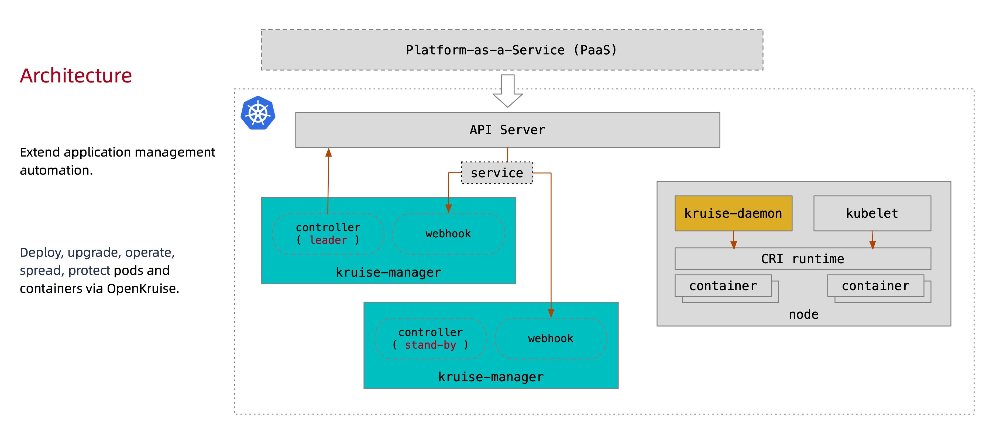
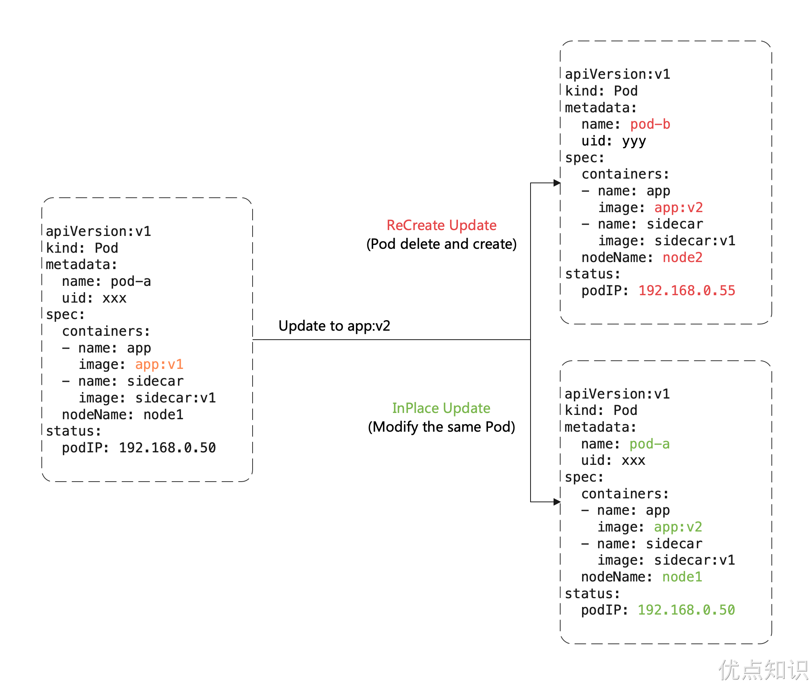
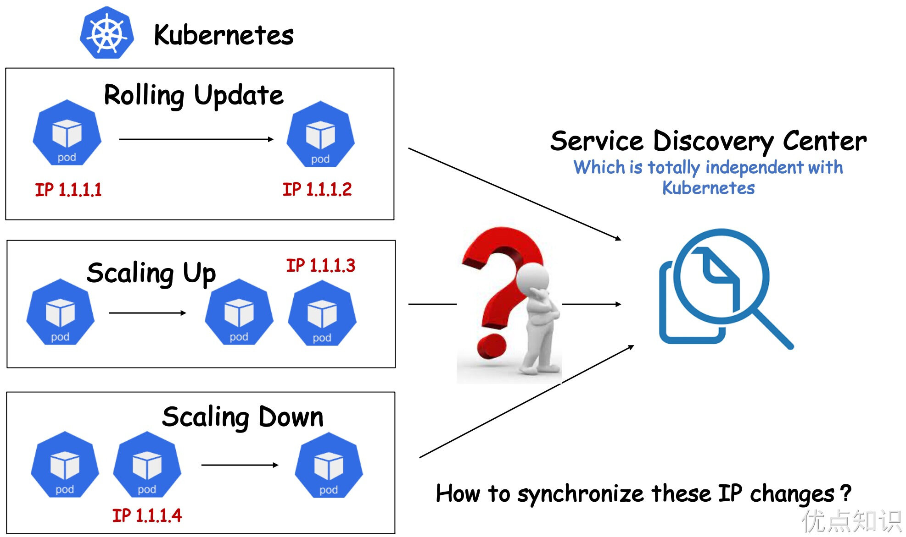
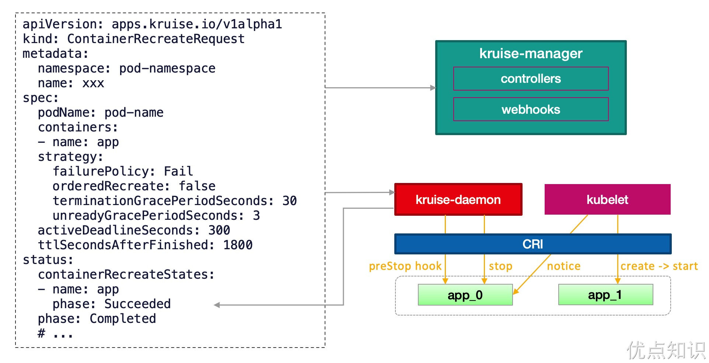

# 29.OpenKruise

[OpenKruise](https://openkruise.io) 是一个基于 Kubernetes 的**扩展套件**，主要聚焦于云原生应用的自动化，比如部署、发布、运维以及可用性防护。OpenKruise 提供的绝大部分能力都是基于 CRD 扩展来定义的，它们不存在于任何外部依赖，可以运行在任意纯净的 Kubernetes 集群中。Kubernetes 自身提供的一些应用部署管理功能，对于大规模应用与集群的场景这些功能是远远不够的，OpenKruise 弥补了 Kubernetes 在应用部署、升级、防护、运维等领域的不足。

OpenKruise 提供了以下的一些核心能力：

- **增强版本的 Workloads**：OpenKruise 包含了一系列增强版本的工作负载，比如 CloneSet、Advanced StatefulSet、Advanced DaemonSet、BroadcastJob 等。它们不仅支持类似于 Kubernetes 原生 Workloads 的基础功能，还提供了如原地升级、可配置的扩缩容/发布策略、并发操作等。其中，原地升级是一种升级应用容器镜像甚至环境变量的全新方式，它只会用新的镜像重建 Pod 中的特定容器，整个 Pod 以及其中的其他容器都不会被影响。因此它带来了更快的发布速度，以及避免了对其他 Scheduler、CNI、CSI 等组件的负面影响。
- **应用的旁路管理**：OpenKruise 提供了多种通过旁路管理应用 sidecar 容器、多区域部署的方式，**旁路**意味着你可以不需要修改应用的 Workloads 来实现它们。比如，SidecarSet 能帮助你在所有匹配的 Pod 创建的时候都注入特定的 sidecar 容器，甚至可以原地升级已经注入的 sidecar 容器镜像、并且对 Pod 中其他容器不造成影响。而 WorkloadSpread 可以约束无状态 Workload 扩容出来 Pod 的区域分布，赋予单一 workload 的多区域和弹性部署的能力。
- **高可用性防护**：OpenKruise 可以保护你的 Kubernetes 资源不受级联删除机制的干扰，包括 CRD、Namespace、以及几乎全部的 Workloads 类型资源。相比于 Kubernetes 原生的 PDB 只提供针对 Pod Eviction 的防护，PodUnavailableBudget 能够防护 Pod Deletion、Eviction、Update 等许多种 voluntary disruption 场景。
- **高级的应用运维能力**：OpenKruise 也提供了很多高级的运维能力来帮助你更好地管理应用，比如可以通过 ImagePullJob 来在任意范围的节点上预先拉取某些镜像，或者指定某个 Pod 中的一个或多个容器被原地重启。


## 架构

下图是 OpenKruise 的整体架构：



所有 OpenKruise 的功能都是通过 Kubernetes CRD 来提供的。其中 `Kruise-manager` 是一个运行控制器和 webhook 的中心组件，它通过 Deployment 部署在 `kruise-system` 命名空间中。
从逻辑上来看，如 `cloneset-controller`、`sidecarset-controller` 这些的控制器都是独立运行的，不过为了减少复杂度，它们都被打包在一个独立的二进制文件、并运行在 `kruise-controller-manager-xxx` 这个 Pod 中。除了控制器之外，`kruise-controller-manager-xxx` 中还包含了针对 Kruise CRD 以及 Pod 资源的 admission webhook。`Kruise-manager` 会创建一些 webhook configurations 来配置哪些资源需要感知处理、以及提供一个 Service 来给 kube-apiserver 调用。

从 v0.8.0 版本开始提供了一个新的 `Kruise-daemon` 组件，它通过 DaemonSet 部署到每个节点上，提供镜像预热、容器重启等功能。


## 安装

这里我们同样还是使用 Helm 方式来进行安装，需要注意从 v1.0.0 开始，OpenKruise 要求在 Kubernetes >= 1.16 以上版本的集群中安装和使用。

首先添加 charts 仓库：

```shell
➜ helm repo add openkruise https://openkruise.github.io/charts/
➜ helm repo update
```

然后执行下面的命令安装最新版本的应用：

```shell
➜ helm upgrade --install kruise openkruise/kruise --version 1.3.0
```

该 charts 在模板中默认定义了命名空间为 `kruise-system`，所以在安装的时候可以不用指定，如果你的环境访问 DockerHub 官方镜像较慢，则可以使用下面的命令将镜像替换成阿里云的镜像：

```shell
➜ helm upgrade --install kruise openkruise/kruise --set manager.image.repository=openkruise-registry.cn-shanghai.cr.aliyuncs.com/openkruise/kruise-manager --version 1.3.0
```

应用部署完成后会在 `kruise-system` 命名空间下面运行 2 个 `kruise-manager` 的 Pod，同样它们之间采用 leader-election 的方式选主，同一时间只有一个提供服务，达到高可用的目的，此外还会以 DaemonSet 的形式启动 `kruise-daemon` 组件：

```shell
➜ kubectl get pods -n kruise-system
NAME                                         READY   STATUS    RESTARTS   AGE
kruise-controller-manager-7d78fc5c97-d6mbb   1/1     Running   0          52s
kruise-controller-manager-7d78fc5c97-wccbn   1/1     Running   0          52s
kruise-daemon-9f94k                          1/1     Running   0          52s
kruise-daemon-bqj69                          1/1     Running   0          52s
kruise-daemon-h95pf                          1/1     Running   0          52s
```

如果不想使用默认的参数进行安装，也可以自定义配置，可配置的 values 值可以参考 charts 文档 [https://github.com/openkruise/charts](https://github.com/openkruise/charts) 进行定制。


## CloneSet

`CloneSet` 控制器是 OpenKruise 提供的对原生 Deployment 的增强控制器，在使用方式上和 Deployment 几乎一致，如下所示是我们声明的一个 CloneSet 资源对象：

```yaml
# cloneset-demo.yaml
apiVersion: apps.kruise.io/v1alpha1
kind: CloneSet
metadata:
  name: cs-demo
spec:
  replicas: 3
  selector:
    matchLabels:
      app: cs
  template:
    metadata:
      labels:
        app: cs
    spec:
      containers:
        - name: nginx
          image: nginx:alpine
          imagePullPolicy: IfNotPresent
          ports:
            - containerPort: 80
```

直接创建上面的这个 CloneSet 对象：

```shell
➜ kubectl apply -f cloneset-demo.yaml
➜ kubectl get cloneset cs-demo
NAME      DESIRED   UPDATED   UPDATED_READY   READY   TOTAL   AGE
cs-demo   3         3         0               0       3       8s
➜ kubectl describe cloneset cs-demo
Name:         cs-demo
Namespace:    default
Labels:       <none>
Annotations:  <none>
API Version:  apps.kruise.io/v1alpha1
Kind:         CloneSet
# ......
Events:
  Type    Reason            Age   From                 Message
  ----    ------            ----  ----                 -------
  Normal  SuccessfulCreate  21s   cloneset-controller  succeed to create pod cs-demo-jfx5s
  Normal  SuccessfulCreate  21s   cloneset-controller  succeed to create pod cs-demo-kg9p2
  Normal  SuccessfulCreate  21s   cloneset-controller  succeed to create pod cs-demo-n72fr
```

该对象创建完成后我们可以通过 `kubectl describe` 命令查看对应的 Events 信息，可以发现 `cloneset-controller` 是直接创建的 Pod，这个和原生的 Deployment 就有一些区别了，Deployment 是通过 ReplicaSet 去创建的 Pod，所以从这里也可以看出来 CloneSet 是直接管理 Pod 的，3 个副本的 Pod 此时也创建成功了：

```shell
➜ kubectl get pods -l app=cs
NAME            READY   STATUS    RESTARTS   AGE
cs-demo-jfx5s   1/1     Running   0          58s
cs-demo-kg9p2   1/1     Running   0          58s
cs-demo-n72fr   1/1     Running   0          58s
```

CloneSet 虽然在使用上和 Deployment 比较类似，但还是有非常多比 Deployment 更高级的功能，下面我们来详细介绍下。


### 扩缩容

**流式扩容**

CloneSet 在扩容的时候可以通过 `ScaleStrategy.MaxUnavailable` 来限制扩容的步长，这样可以对服务应用的影响最小，可以设置一个绝对值或百分比，如果不设置该值，则表示不限制。

比如我们在上面的资源清单中添加如下所示数据：

```yaml
apiVersion: apps.kruise.io/v1alpha1
kind: CloneSet
metadata:
  name: cs-demo
spec:
  minReadySeconds: 60
  scaleStrategy:
    maxUnavailable: 1
  replicas: 5
  ......
```

上面我们配置 `scaleStrategy.maxUnavailable` 为 1，结合 `minReadySeconds` 参数，表示在扩容时，只有当上一个扩容出的 Pod 已经 Ready 超过一分钟后，CloneSet 才会执行创建下一个 Pod，比如这里我们扩容成 5 个副本，更新上面对象后查看 CloneSet 的事件：

```shell
➜ kubectl describe cloneset cs-demo
......
Events:
  Type     Reason            Age                From                 Message
  ----     ------            ----               ----                 -------
  Normal   SuccessfulCreate  4m25s              cloneset-controller  succeed to create pod cs-demo-jfx5s
  Normal   SuccessfulCreate  4m25s              cloneset-controller  succeed to create pod cs-demo-kg9p2
  Normal   SuccessfulCreate  4m25s              cloneset-controller  succeed to create pod cs-demo-n72fr
  Warning  ScaleUpLimited    66s                cloneset-controller  scaleUp is limited because of scaleStrategy.maxUnavailable, limit: 1
  Normal   SuccessfulCreate  66s                cloneset-controller  succeed to create pod cs-demo-x8ndf
  Warning  ScaleUpLimited    64s (x6 over 66s)  cloneset-controller  scaleUp is limited because of scaleStrategy.maxUnavailable, limit: 0
  Normal   SuccessfulCreate  5s                 cloneset-controller  succeed to create pod cs-demo-2sfzz
```

可以看到第一时间扩容了一个 Pod，由于我们配置了 `minReadySeconds: 60`，也就是新扩容的 Pod 创建成功超过 1 分钟后才会扩容另外一个 Pod，上面的 Events 信息也能表现出来，查看 Pod 的 `AGE` 也能看出来扩容的 2 个 Pod 之间间隔了 1 分钟左右：

```shell
➜ kubectl get pods -l app=cs
NAME            READY   STATUS    RESTARTS   AGE
cs-demo-2sfzz   1/1     Running   0          22s
cs-demo-jfx5s   1/1     Running   0          4m42s
cs-demo-kg9p2   1/1     Running   0          4m42s
cs-demo-n72fr   1/1     Running   0          4m42s
cs-demo-x8ndf   1/1     Running   0          83s
```

当 CloneSet 被缩容时，我们还可以指定一些 Pod 来删除，这对于 StatefulSet 或者 Deployment 来说是无法实现的， StatefulSet 是根据序号来删除 Pod，而 Deployment/ReplicaSet 目前只能根据控制器里定义的排序来删除。而 CloneSet 允许用户在缩小 replicas 数量的同时，指定想要删除的 Pod 名字，如下所示：

```yaml
apiVersion: apps.kruise.io/v1alpha1
kind: CloneSet
metadata:
  name: cs-demo
spec:
  minReadySeconds: 60
  scaleStrategy:
    maxUnavailable: 1
    podsToDelete:
    - cs-demo-n72fr
  replicas: 4
  ......
```

更新上面的资源对象后，会将应用缩到 4 个 Pod，如果在 `podsToDelete` 列表中指定了 Pod 名字，则控制器会优先删除这些 Pod，对于已经被删除的 Pod，控制器会自动从 `podsToDelete` 列表中清理掉。比如我们更新上面的资源对象后 `cs-demo-n72fr` 这个 Pod 会被移除，其余会保留下来：

```shell
➜ kubectl get pods -l app=cs
NAME            READY   STATUS    RESTARTS   AGE
cs-demo-2sfzz   1/1     Running   0          61s
cs-demo-jfx5s   1/1     Running   0          5m21s
cs-demo-kg9p2   1/1     Running   0          5m21s
cs-demo-x8ndf   1/1     Running   0          2m2s
```

如果你只把 Pod 名字加到 `podsToDelete`，但没有修改 replicas 数量，那么控制器会先把指定的 Pod 删掉，然后再扩一个新的 Pod，另一种直接删除 Pod 的方式是在要删除的 Pod 上打 `apps.kruise.io/specified-delete: true` 标签。

相比于手动直接删除 Pod，使用 `podsToDelete` 或 `apps.kruise.io/specified-delete: true` 方式会有 CloneSet 的 `maxUnavailable/maxSurge` 来保护删除， 并且会触发 `PreparingDelete` 生命周期的钩子。

**PVC 模板**

一个比较奇特的特性，CloneSet 允许用户配置 PVC 模板 `volumeClaimTemplates`，用来给每个 Pod 生成独享的 PVC，这是 Deployment 所不支持的，因为往往有状态的应用才需要单独设置 PVC，在使用 CloneSet 的 PVC 模板的时候需要注意下面的这些事项：

- 每个被自动创建的 PVC 会有一个 `ownerReference` 指向 CloneSet，因此 CloneSet 被删除时，它创建的所有 Pod 和 PVC 都会被删除。
- 每个被 CloneSet 创建的 Pod 和 PVC，都会带一个 `apps.kruise.io/cloneset-instance-id: xxx` 的 label。关联的 Pod 和 PVC 会有相同的 `instance-id`，且它们的名字后缀都是这个 `instance-id`。
- 如果一个 Pod 被 CloneSet controller 缩容删除时，这个 Pod 关联的 PVC 都会被一起删掉。
- 如果一个 Pod 被外部直接调用删除或驱逐时，这个 Pod 关联的 PVC 还都存在；并且 CloneSet controller 发现数量不足重新扩容时，新扩出来的 Pod 会复用原 Pod 的 `instance-id` 并关联原来的 PVC。
- 当 Pod 被重建升级时，关联的 PVC 会跟随 Pod 一起被删除、新建。
- 当 Pod 被原地升级时，关联的 PVC 会持续使用。

以下是一个带有 PVC 模板的例子：

```yaml
# cloneset-pvc.yaml
apiVersion: apps.kruise.io/v1alpha1
kind: CloneSet
metadata:
  labels:
    app: sample
  name: sample-data
spec:
  replicas: 3
  selector:
    matchLabels:
      app: sample
  template:
    metadata:
      labels:
        app: sample
    spec:
      containers:
        - name: nginx
          image: nginx:alpine
          volumeMounts:
            - name: data-vol
              mountPath: /usr/share/nginx/html
  volumeClaimTemplates:
    - metadata:
        name: data-vol
      spec:
        accessModes: ["ReadWriteOnce"]
        resources:
          requests:
            storage: 20Gi
```

比如应用上面的资源对象后会自动创建 3 个 Pod 和 3 个 PVC，每个 Pod 都会挂载一个 PVC：

```shell
➜ kubectl get pods -l app=sample
NAME                READY   STATUS    RESTARTS   AGE
sample-data-t4vq6   0/1     Pending   0          2m13s
sample-data-vcjnl   0/1     Pending   0          2m13s
sample-data-znwjd   0/1     Pending   0          2m13s
➜ kubectl get pvc -l app=sample
NAME                         STATUS    VOLUME   CAPACITY   ACCESS MODES   STORAGECLASS   AGE
data-vol-sample-data-t4vq6   Pending                                                     2m46s
data-vol-sample-data-vcjnl   Pending                                                     2m46s
data-vol-sample-data-znwjd   Pending                                                     2m46s
```


### 升级

CloneSet 一共提供了 3 种升级方式：

- `ReCreate`: 删除旧 Pod 和它的 PVC，然后用新版本重新创建出来，这是默认的方式
- `InPlaceIfPossible`: 会优先尝试原地升级 Pod，如果不行再采用重建升级
- `InPlaceOnly`: 只允许采用原地升级，因此，用户只能修改上一条中的限制字段，如果尝试修改其他字段会被拒绝

这里有一个重要概念：**原地升级**，这也是 OpenKruise 提供的核心功能之一，当我们要升级一个 Pod 中镜像的时候，下图展示了**重建升级**和**原地升级**的区别：



**重建升级**时我们需要删除旧 Pod、创建新 Pod：

- Pod 名字和 uid 发生变化，因为它们是完全不同的两个 Pod 对象（比如 Deployment 升级）
- Pod 名字可能不变、但 uid 变化，因为它们是不同的 Pod 对象，只是复用了同一个名字（比如 StatefulSet 升级）
- Pod 所在 Node 名字可能发生变化，因为新 Pod 很可能不会调度到之前所在的 Node 节点
- Pod IP 发生变化，因为新 Pod 很大可能性是不会被分配到之前的 IP 地址

但是对于**原地升级**，我们仍然复用同一个 Pod 对象，只是修改它里面的字段：

- 可以避免如调度、分配 IP、挂载 volume 等额外的操作和代价
- 更快的镜像拉取，因为会复用已有旧镜像的大部分 layer 层，只需要拉取新镜像变化的一些 layer
- 当一个容器在原地升级时，Pod 中的其他容器不会受到影响，仍然维持运行

所以显然如果能用**原地升级**方式来升级我们的工作负载，对在线应用的影响是最小的。上面我们提到 CloneSet 升级类型支持 `InPlaceIfPossible`，这意味着 Kruise 会尽量对 Pod 采取原地升级，如果不能则退化到重建升级，以下的改动会被允许执行原地升级：

- 更新 workload 中的 `spec.template.metadata.*`，比如 labels/annotations，Kruise 只会将 metadata 中的改动更新到存量 Pod 上。
- 更新 workload 中的 `spec.template.spec.containers[x].image`，Kruise 会原地升级 Pod 中这些容器的镜像，而不会重建整个 Pod。
- 从 Kruise v1.0 版本开始，更新 `spec.template.metadata.labels/annotations` 并且 container 中有配置 env from 这些改动的 `labels/anntations`，Kruise 会原地升级这些容器来生效新的 env 值。

否则，其他字段的改动，比如 `spec.template.spec.containers[x].env` 或 `spec.template.spec.containers[x].resources`，都是会回退为重建升级。

比如我们将上面的应用升级方式设置为 `InPlaceIfPossible`，只需要在资源清单中添加 `spec.updateStrategy.type: InPlaceIfPossible` 即可：

```yaml
apiVersion: apps.kruise.io/v1alpha1
kind: CloneSet
metadata:
  name: cs-demo
spec:
  updateStrategy:
    type: InPlaceIfPossible
  ......
  # image: nginx:1.7.9
```

更新后可以发现 Pod 的状态并没有发生什么大的变化，名称、IP 都一样，唯一变化的是镜像 tag：

```shell
➜ kubectl get pods -l app=cs
NAME            READY   STATUS    RESTARTS      AGE
cs-demo-2sfzz   1/1     Running   1 (18s ago)   36m
cs-demo-jfx5s   1/1     Running   0             40m
cs-demo-kg9p2   1/1     Running   0             40m
cs-demo-x8ndf   1/1     Running   0             37m
➜ kubectl describe cloneset cs-demo
Name:         cs-demo
Namespace:    default
Labels:       <none>
Annotations:  <none>
API Version:  apps.kruise.io/v1alpha1
Kind:         CloneSet
......
Events:
  Type    Reason                      Age    From                 Message
  ----    ------                      ----   ----                 -------
  #  ......
  Normal   SuccessfulUpdatePodInPlace  6m58s              cloneset-controller  successfully update pod cs-demo-2sfzz in-place(revision cs-demo-7cb9c88699)
  Normal   SuccessfulUpdatePodInPlace  5m46s              cloneset-controller  successfully update pod cs-demo-x8ndf in-place(revision cs-demo-7cb9c88699)
  Normal   SuccessfulUpdatePodInPlace  4m43s              cloneset-controller  successfully update pod cs-demo-kg9p2 in-place(revision cs-demo-7cb9c88699)
  Normal   SuccessfulUpdatePodInPlace  3m40s              cloneset-controller  successfully update pod cs-demo-jfx5s in-place(revision cs-demo-7cb9c88699)
➜ kubectl describe pod cs-demo-2sfzz
......
Events:
  Type    Reason     Age                  From               Message
  ----    ------     ----                 ----               -------
  Normal  Scheduled  44m                  default-scheduler  Successfully assigned default/cs-demo-2sfzz to node2
  Normal  Pulled     44m                  kubelet            Container image "nginx:alpine" already present on machine
  Normal  Killing    8m8s                 kubelet            Container nginx definition changed, will be restarted
  Normal  Pulling    8m8s                 kubelet            Pulling image "nginx:1.7.9"
  Normal  Created    7m58s (x2 over 44m)  kubelet            Created container nginx
  Normal  Started    7m58s (x2 over 44m)  kubelet            Started container nginx
  Normal  Pulled     7m58s                kubelet            Successfully pulled image "nginx:1.7.9" in 9.720841233s (9.720847295s including waiting)
```

这就是原地升级的效果，原地升级整体工作流程如下图所示：


如果你在安装或升级 Kruise 的时候启用了 `PreDownloadImageForInPlaceUpdate` 这个 feature-gate，CloneSet 控制器会自动在所有旧版本 pod 所在节点上预热你正在灰度发布的新版本镜像，这对于应用发布加速很有帮助。

默认情况下 CloneSet 每个新镜像预热时的并发度都是 1，也就是一个个节点拉镜像，如果需要调整，你可以在 CloneSet 通过 `apps.kruise.io/image-predownload-parallelism` 这个 annotation 来设置并发度。

另外从 Kruise v1.1.0 开始，还可以使用 `apps.kruise.io/image-predownload-min-updated-ready-pods` 来控制在少量新版本 Pod 已经升级成功之后再执行镜像预热。它的值可能是绝对值数字或是百分比。

```yaml
apiVersion: apps.kruise.io/v1alpha1
kind: CloneSet
metadata:
  annotations:
    apps.kruise.io/image-predownload-parallelism: "5"
    apps.kruise.io/image-predownload-min-updated-ready-pods: "2"
```

> 注意，为了避免大部分不必要的镜像拉取，目前只针对 `replicas > 3` 的 CloneSet 做自动预热。


此外 CloneSet 还支持分批进行灰度，在 `updateStrategy` 属性中可以配置 `partition` 参数，该参数可以用来**保留旧版本 Pod 的数量或百分比**，默认为 0：

- 如果是数字，控制器会将 `(replicas - partition)` 数量的 Pod 更新到最新版本
- 如果是百分比，控制器会将 `(replicas * (100% - partition))` 数量的 Pod 更新到最新版本

比如，我们将上面示例中的的 image 更新为 `nginx:latest` 并且设置 `partition=2`，更新后，过一会查看可以发现只升级了 2 个 Pod：

```shell
➜ kubectl get pods -l app=cs -L controller-revision-hash
NAME            READY   STATUS    RESTARTS      AGE   CONTROLLER-REVISION-HASH
cs-demo-2sfzz   1/1     Running   1 (11m ago)   47m   cs-demo-7cb9c88699
cs-demo-jfx5s   1/1     Running   2 (99s ago)   52m   cs-demo-7c4d79f5bc
cs-demo-kg9p2   1/1     Running   2 (27s ago)   52m   cs-demo-7c4d79f5bc
cs-demo-x8ndf   1/1     Running   1 (10m ago)   48m   cs-demo-7cb9c88699
➜ kubectl get pods -o custom-columns='DATA:metadata.name,CONTAINERS:spec.containers[*].name,IMAGES:spec.containers[*].image' -l app=cs
DATA            CONTAINERS   IMAGES
cs-demo-2sfzz   nginx        nginx:1.7.9
cs-demo-jfx5s   nginx        nginx:latest
cs-demo-kg9p2   nginx        nginx:latest
cs-demo-x8ndf   nginx        nginx:1.7.9
```

此外 CloneSet 还支持一些更高级的用法，比如可以定义优先级策略来控制 Pod 发布的优先级规则，还可以定义策略来将一类 Pod 打散到整个发布过程中，也可以暂停 Pod 发布等操作。


### 生命周期钩子

每个 CloneSet 管理的 Pod 会有明确所处的状态，在 Pod label 中的 `lifecycle.apps.kruise.io/state` 标记：

- `Normal`：正常状态
- `PreparingUpdate`：准备原地升级
- `Updating`：原地升级中
- `Updated`：原地升级完成
- `PreparingDelete`：准备删除

而生命周期钩子，则是通过在上述状态流转中卡点，来实现原地升级前后、删除前的自定义操作（比如开关流量、告警等）。CloneSet 的 `lifecycle` 下面主要支持 `preDelete` 和 `inPlaceUpdate` 两个属性。

```yaml
apiVersion: apps.kruise.io/v1alpha1
kind: CloneSet
spec:

  # 通过 finalizer 定义 hook
  lifecycle:
    preDelete:  # PreDelete 是 Pod 被删除之前的 hook
      finalizersHandler:
      - example.io/unready-blocker
    inPlaceUpdate: # InPlaceUpdate 是 Pod 更新之前和更新后的 hook
      finalizersHandler:
      - example.io/unready-blocker

  # 或者也可以通过 label 定义
  lifecycle:
    inPlaceUpdate:
      labelsHandler:
        example.io/block-unready: "true"
```

**升级/删除 Pod 前将其置为 NotReady**

```yaml
lifecycle:
  preDelete:
    markPodNotReady: true
    finalizersHandler:
      - example.io/unready-blocker
  inPlaceUpdate:
    markPodNotReady: true
    finalizersHandler:
      - example.io/unready-blocker
```

-  如果设置 `preDelete.markPodNotReady=true`: 
   - Kruise 将会在 Pod 进入 `PreparingDelete` 状态时，将 `KruisePodReady` 这个 Pod Condition 设置为 False, Pod 将变为 NotReady。
-  如果设置 `inPlaceUpdate.markPodNotReady=true`: 
   - Kruise 将会在 Pod 进入 `PreparingUpdate` 状态时，将 KruisePodReady 这个 Pod Condition 设置为 False, Pod 将变为 NotReady。
   - Kruise 将会尝试将 KruisePodReady 这个 Pod Condition 设置回 True。

我们可以利用这一特性，在容器真正被停止之前将 Pod 上的流量先行排除，防止流量损失。

**流转示意图**


-  当 CloneSet 删除一个 Pod（包括正常缩容和重建升级）时： 
   - 如果没有定义 lifecycle hook 或者 Pod 不符合 preDelete 条件，则直接删除
   - 否则，先只将 Pod 状态改为 `PreparingDelete`。等用户 controller 完成任务去掉 label/finalizer、Pod 不符合 preDelete 条件后，kruise 才执行 Pod 删除
   - 需要注意的是 `PreparingDelete` 状态的 Pod 处于删除阶段，不会被升级
-  当 CloneSet 原地升级一个 Pod 时： 
   - 升级之前，如果定义了 lifecycle hook 且 Pod 符合 `inPlaceUpdate` 条件，则将 Pod 状态改为 `PreparingUpdate`
   - 等用户 controller 完成任务去掉 label/finalizer、Pod 不符合 `inPlaceUpdate` 条件后，kruise 将 Pod 状态改为 `Updating` 并开始升级
   - 升级完成后，如果定义了 lifecycle hook 且 Pod 不符合 `inPlaceUpdate` 条件，将 Pod 状态改为 Updated
   - 等用户 controller 完成任务加上 label/finalizer、Pod 符合 `inPlaceUpdate` 条件后，kruise 将 Pod 状态改为 Normal 并判断为升级成功

关于从 PreparingDelete 回到 Normal 状态，从设计上是支持的（通过撤销指定删除），但我们一般不建议这种用法。由于 PreparingDelete 状态的 Pod 不会被升级，当回到 Normal 状态后可能立即再进入发布阶段，对于用户处理 hook 是一个难题。

**用户 controller 逻辑示例**

按上述例子，可以定义：

- `example.io/unready-blocker finalizer` 作为 hook
- `example.io/initialing` annotation 作为初始化标记

在 CloneSet template 模板里带上这个字段：

```yaml
apiVersion: apps.kruise.io/v1alpha1
kind: CloneSet
spec:
  template:
    metadata:
      annotations:
        example.io/initialing: "true"
      finalizers:
        - example.io/unready-blocker
  # ...
  lifecycle:
    preDelete:
      finalizersHandler:
        - example.io/unready-blocker
    inPlaceUpdate:
      finalizersHandler:
        - example.io/unready-blocker
```

而后用户 controller 的逻辑如下：

- 对于 Normal 状态的 Pod，如果 annotation 中有 `example.io/initialing: true` 并且 Pod status 中的 ready condition 为 True，则接入流量、去除这个 annotation
- 对于 `PreparingDelete` 和 `PreparingUpdate` 状态的 Pod，切走流量，并去除 `example.io/unready-blocker` finalizer
- 对于 Updated 状态的 Pod，接入流量，并打上 `example.io/unready-blocker finalizer`

**使用场景**

因为各种各样的历史原因和客观因素，有些用户可能无法将自己公司的整套体系架构 Kubernetes 化，比如有些用户暂时无法使用 Kubernetes 本身提供的 Service 服务发现机制，而是使用了独立于 Kubernetes 之外的另外一套服务注册和发现体系。在这种架构下，如果用户对服务进行 Kubernetes 化改造，可能会遇到诸多问题。例如，每当 Kubernetes 成功创建出一个 Pod，都需要自行将该 Pod 注册到服务发现中心，以便能够对内对外提供服务；相应的，想要下线一个 Pod，也通常先要将其在服务发现中心删除，才能将 Pod 优雅下线，否则就可能导致流量损失。但是在原生的 Kubernetes 体系中， Pod 的生命周期由 Workload 管理（例如 Deployment），当这些 Workload 的 Replicas 字段发生变化后，相应的 Controller 会立即添加或删除掉 Pod，用户很难定制化地去管理 Pod 的生命周期。

面对这类问题，一般来说有两种解决思路：一是约束 Kubernetes 的弹性能力，例如规定只能由特定的链路对 Workload 进行扩缩容，以保证在删除 Pod 前先把 Pod IP 在服务注册中心摘除，但这样一来会制约 Kubernetes 本身的弹性能力, 并且也增加了链路管控的难度和风险。 二是在根本上改造现有的服务发现体系，显然这是一个更加漫长和高风险的事情。



那么有没有一种既能够充分利用 Kubernetes 弹性能力，又避免对既有服务发现体系进行改造，快速弥补两个系统之间的间隙的方法呢？

OpenKruise CloneSet 就提供了这样一组高度可定制化的扩展能力来专门应对此类场景，让用户能够对 Pod 生命周期做更精细化、定制化的管理。CloneSet 在 Pod 生命周期中几个重要的时间节点预留了 Hook，使得用户可以在这些时间节点插入一些定制化的扩展动作。比如，在 Pod 升级前，将 Pod IP 在服务发现中心删除，升级完成后再将 Pod IP 注册到服务发现中心，或者做一些特殊的嗅探和监控动作。

我们假设现在有这样一个场景：

- 用户不使用 Kubernetes Service 作为服务发现机制，服务发现体系完全独立于 Kubernetes；
- 使用 CloneSet 作为 Kubernetes 工作负载。

并且对具体的需求做如下合理假设：

-  当 Kubernetes Pod 被创建时： 
   - 在创建成功，且 Pod Ready 之后，将 Pod IP 注册到服务发现中心；
-  当 Kubernetes Pod 原地升级时： 
   - 在升级之前，需要将 Pod IP 从服务发现中心删除（或主动 FailOver）；
   - 在升级完成，且 Pod Ready 之后，将 Pod IP 再次注册到服务发现中心；
-  当 Kubernetes Pod 被删除时： 
   - 在删除之前，需要先将 Pod IP 从服务发现中心删除；

基于以上假设，其实我们就可以利用 CloneSet LifeCycle 来编写一个简单的 Operator 实现用户定义的 Pod 生命周期管理机制。

前面我们提到了 CloneSet LifeCycle 将 Pod 的生命周期定义为了 5 种状态，5 种状态之间的转换逻辑由一个状态机所控制。我们可以只选择自己所关心的一种或多种，编写一个独立的 Operator 来实现这些状态的转换，控制 Pod 的生命周期，并在所关心的时间节点插入自己的定制化逻辑。

```yaml
apiVersion: apps.kruise.io/v1alpha1
kind: CloneSet
metadata:
  namespace: demo
  name: cloneset-lifecycle-demo
spec:
  replicas: 2
  ##########################################################################
  ## 生命周期配置
  lifecycle:
    inPlaceUpdate:
      labelsHandler:
        ## 定义标签:
        ##    1. 为 cloneset 控制器阻止原地更新 Pod 操作
        ##    2. 通知 operator 执行 inPlace update 钩子
        example.com/unready-blocker-inplace: "true"
    preDelete:
      labelsHandler:
        ## 定义标签:
        ##    1. 为 cloneset 控制器阻止删除 pod 操作
        ##    2. 通知 operator 执行 preDelete 钩子
        example.com/unready-blocker-delete: "true"
  ##########################################################################
  selector:
    matchLabels:
      app: nginx
  template:
    metadata:
      labels:
        app: nginx
        ## 这个标签可以用来判断此 Pod 是否是新创建的
        example.com/newly-create: "true"
        ## 对应于 spec.lifecycle.inPlaceUpdate.labelsHandler.example.com/unready-blocker-inplace
        example.com/unready-blocker-inplace: "true"
        ## 对应 spec.lifecycle.preDelete.labelsHandler.example.com/unready-blocker-inplace
        example.com/unready-blocker-delete: "true"
      containers:
        - name: main
          image: nginx:latest
          imagePullPolicy: Always
  updateStrategy:
    maxUnavailable: 20%
    type: InPlaceIfPossible
```

在前面的 CRD 章节和大家讲解过如何开发一个 Operator，这里过程我们就不在赘述了，这里直接给出控制器的核心代码：

```go
const (
    deleteHookLabel  = "example.com/unready-blocker-delete"
    inPlaceHookLabel = "example.com/unready-blocker-inplace"
    newlyCreateLabel = "example.com/newly-create"
)

func (r *SampleReconciler) Reconcile(req ctrl.Request) (ctrl.Result, error) {
    ... ...

    switchLabel := func(pod *v1.Pod, key, value string) error {
        body := fmt.Sprintf(`{"metadata":{"labels":{"%s":"%s"}}}`, key, value)
        if err := r.Patch(context.TODO(), pod, client.RawPatch(types.StrategicMergePatchType, []byte(body))); err != nil {
            return err
        }
        return nil
    }

    /*
        Pod LifeCycle Hook 逻辑
    */
    switch {
    // 处理新创建的 Pod
    case IsNewlyCreateHooked(pod):
        // 将此 Pod 注册到你的服务发现中心
        if err := postRegistry(pod); err != nil {
            return reconcile.Result{}, err
        }
        if err := switchLabel(pod, newlyCreateLabel, "false"); err != nil {
            return reconcile.Result{}, err
        }

    // 处理准备进行原地升级的 Pod
    case IsPreUpdateHooked(pod):
        // 让服务发现中心将此 Pod fail over
        if err := postFailOver(pod); err != nil {
            return reconcile.Result{}, err
        }
        if err := switchLabel(pod, inPlaceHookLabel, "false"); err != nil {
            return reconcile.Result{}, err
        }

    // 处理更新完成后的 Pod
    case IsUpdatedHooked(pod):
        // 让服务发现中心重新注册 Pod
        if err := postRegistry(pod); err != nil {
            return reconcile.Result{}, err
        }
        if err := switchLabel(pod, inPlaceHookLabel, "true"); err != nil {
            return reconcile.Result{}, err
        }

    // 处理准备删除的 Pod
    case IsPreDeleteHooked(pod):
        // 从你的服务发现中心取消该Pod的注册
        if err := postUnregister(pod); err != nil {
            return reconcile.Result{}, err
        }
        if err := switchLabel(pod, deleteHookLabel, "false"); err != nil {
            return reconcile.Result{}, err
        }
    }

    return ctrl.Result{}, nil
}

func IsNewlyCreateHooked(pod *v1.Pod) bool {
    return kruiseappspub.LifecycleStateType(pod.Labels[kruiseappspub.LifecycleStateKey]) == kruiseappspub.LifecycleStateNormal && pod.Labels[newlyCreateLabel] == "true" && IsPodReady(pod)
}

func IsPreUpdateHooked(pod *v1.Pod) bool {
    return kruiseappspub.LifecycleStateType(pod.Labels[kruiseappspub.LifecycleStateKey]) == kruiseappspub.LifecycleStatePreparingUpdate && pod.Labels[inPlaceHookLabel] == "true"
}

func IsUpdatedHooked(pod *v1.Pod) bool {
    return kruiseappspub.LifecycleStateType(pod.Labels[kruiseappspub.LifecycleStateKey]) == kruiseappspub.LifecycleStateUpdated && pod.Labels[inPlaceHookLabel] == "false" && IsPodReady(pod)
}

func IsPreDeleteHooked(pod *v1.Pod) bool {
    return kruiseappspub.LifecycleStateType(pod.Labels[kruiseappspub.LifecycleStateKey]) == kruiseappspub.LifecycleStatePreparingDelete && pod.Labels[DeleteHookLabel] == "true"
}
```

上述代码中四个分支分别从上到下对应 Pod 的创建后、升级前、升级后、删除前等四个重要声明周期节点，我们可以根据自己的实际需求来完善相应的 Hook，我们这里上述几个 Hook 的行为具体为：

- `postRegistry(pod *v1.Pod)`: 发送请求通知服务发现中心注册该 Pod 服务；
- `postFailOver(pod *v1.Pod)`: 发送请求通知服务发现中心 Fail Over 该 Pod 服务；
- `postUnregiste(pod *v1.Pod)`: 发送请求通知服务发现中心将该 Pod 服务注销。

这就是 CloneSet Lifecycle 的强大之处，我们完全可以根据需求在 Pod 生命周期管理中插入定制化逻辑。


## Advanced StatefulSet

该控制器在原生的 StatefulSet 基础上增强了发布能力，比如 `maxUnavailable` 并行发布、原地升级等，该对象的名称也是 `StatefulSet`，但是 apiVersion 是 `apps.kruise.io/v1beta1`，这个 CRD 的所有默认字段、默认行为与原生 StatefulSet 完全一致，除此之外还提供了一些可选字段来扩展增强的策略。因此，用户从原生 StatefulSet 迁移到 `Advanced StatefulSet`，只需要把 `apiVersion` 修改后提交即可：

```yaml
-  apiVersion: apps/v1
+  apiVersion: apps.kruise.io/v1beta1
   kind: StatefulSet
   metadata:
     name: sample
   spec:
     #...
```


### 最大不可用

Advanced StatefulSet 在滚动更新策略中新增了 `maxUnavailable` 来支持并行 Pod 发布，它会保证发布过程中最多有多少个 Pod 处于不可用状态。注意，`maxUnavailable` 只能配合 `podManagementPolicy` 为 `Parallel` 来使用。

这个策略的效果和 Deployment 中的类似，但是可能会导致发布过程中的 order 顺序不能严格保证，如果不配置 `maxUnavailable`，它的默认值为 1，也就是和原生 StatefulSet 一样只能串行发布 Pod，即使把 `podManagementPolicy` 配置为 `Parallel` 也是这样。

比如现在我们创建一个如下所示的 Advanced StatefulSet：

```yaml
# advanced-sts-demo.yaml
apiVersion: apps.kruise.io/v1beta1
kind: StatefulSet
metadata:
  name: web
  namespace: default
spec:
  serviceName: "nginx-headless"
  podManagementPolicy: Parallel
  replicas: 5
  updateStrategy:
    type: RollingUpdate
    rollingUpdate:
      maxUnavailable: 3 # 40% of 5 = 2
      # partition: 4
  selector:
    matchLabels:
      app: nginx
  template:
    metadata:
      labels:
        app: nginx # @
    spec:
      containers:
        - name: nginx
          image: nginx
          ports:
            - name: web
              containerPort: 80
```

直接创建该对象，由于对象名称也是 StatefulSet，所以不能直接用 `get sts` 来获取了，要通过 `get asts` 获取：

```shell
➜ kubectl get asts
NAME   DESIRED   CURRENT   UPDATED   READY   AGE
web    5         5         5         5       21s
➜ kubectl get pods -l app=nginx
NAME    READY   STATUS    RESTARTS   AGE
web-0   1/1     Running   0          32s
web-1   1/1     Running   0          32s
web-2   1/1     Running   0          32s
web-3   1/1     Running   0          32s
web-4   1/1     Running   0          32s
```

该应用下有五个 Pod，并且应用能容忍 3 个副本不可用，当我们把 StatefulSet 里的 Pod 升级版本的时候，可以通过以下步骤来做：

-  
   1. 设置 maxUnavailable=3
-  
   2. (可选) 如果需要灰度升级，设置 `partition=4`，Partition 默认的意思是 order 大于等于这个数值的 Pod 才会更新，在这里就只会更新 P4，即使我们设置了 `maxUnavailable=3`。
-  
   3. 在 P4 升级完成后，把 partition 调整为 0，此时，控制器会同时升级 P1、P2、P3 三个 Pod。注意，如果是原生 StatefulSet，只能串行升级 P3、P2、P1。
-  
   4. 一旦这三个 Pod 中有一个升级完成了，控制器会立即开始升级 P0。

比如这里我们把上面应用的镜像版本进行修改，更新后查看 Pod 状态，可以看到有 3 个 Pod 并行升级的：

```shell
➜ kubectl get pods -l app=nginx
NAME    READY   STATUS              RESTARTS   AGE
web-0   1/1     Running             0          3m58s
web-1   1/1     Running             0          3m58s
web-2   0/1     ContainerCreating   0          1s
web-3   0/1     ContainerCreating   0          2s
web-4   0/1     ContainerCreating   0          1s
```


### 原地升级

此外 Advanced StatefulSet 也增加了 `podUpdatePolicy` 来允许用户指定重建升级还是原地升级。此外还在原地升级中提供了 graceful period 选项，作为优雅原地升级的策略。用户如果配置了 `gracePeriodSeconds` 这个字段，控制器在原地升级的过程中会先把 Pod status 改为 `not-ready`，然后等一段时间（gracePeriodSeconds），最后再去修改 Pod spec 中的镜像版本。这样，就为 endpoints-controller 这些控制器留出了充足的时间来将 Pod 从 endpoints 端点列表中去除。

如果使用 `InPlaceIfPossible` 或 `InPlaceOnly` 策略，必须要增加一个 `InPlaceUpdateReady readinessGate`，用来在原地升级的时候控制器将 Pod 设置为 NotReady，比如设置上面的应用为原地升级的方式：

```yaml
apiVersion: apps.kruise.io/v1beta1
kind: StatefulSet
metadata:
  name: web
  namespace: default
spec:
  serviceName: "nginx-headless"
  podManagementPolicy: Parallel
  replicas: 5
  updateStrategy:
    type: RollingUpdate
    rollingUpdate:
      podUpdatePolicy: InPlaceIfPossible # 尽可能执行原地升级
      maxUnavailable: 3 # 允许并行更新，最大不可以实例数为3
      inPlaceUpdateStrategy:
        gracePeriodSeconds: 10 # 原地升级的优雅时间
  selector:
    matchLabels:
      app: nginx
  template:
    metadata:
      labels:
        app: nginx
    spec:
      readinessGates:
        - conditionType: InPlaceUpdateReady # 确保 Pod 在发生原地更新时保持在 NotReady 状态
      containers:
        - name: nginx
          image: nginx
          ports:
            - name: web
              containerPort: 80
```

这里我们设置 `updateStrategy.rollingUpdate.podUpdatePolicy` 为 `InPlaceIfPossible` 模式，表示尽可能使用原地升级的方式进行更新，此外在 Pod 模板中我们还添加了一个 `readinessGates` 属性，可以用来确保 Pod 在发生原地更新时保持在 NotReady 状态。比如我们现在使用上面资源清单更新应用，然后重新修改镜像的版本更新，则会进行原地升级：

```shell
➜ kubectl describe asts web
Events:
  Type    Reason                      Age                  From                    Message
  ----    ------                      ----                 ----                    -------
  Normal  SuccessfulUpdatePodInPlace  3m30s                statefulset-controller  successfully update pod web-4 in-place(revision web-84644dfc7d)
  Normal  SuccessfulUpdatePodInPlace  3m30s                statefulset-controller  successfully update pod web-3 in-place(revision web-84644dfc7d)
  Normal  SuccessfulUpdatePodInPlace  3m30s                statefulset-controller  successfully update pod web-2 in-place(revision web-84644dfc7d)
```

同样的 Advanced StatefulSet 也支持原地升级自动预热。

也可以通过设置 paused 为 true 来暂停发布，不过控制器还是会做 replicas 数量管理：

```yaml
apiVersion: apps.kruise.io/v1beta1
kind: StatefulSet
spec:
  # ...
  updateStrategy:
    rollingUpdate:
      paused: true
```

另外 Advanced StatefulSet 还支持序号保留功能，通过在 `reserveOrdinals` 字段中写入需要保留的序号，Advanced StatefulSet 会自动跳过创建这些序号的 Pod，如果 Pod 已经存在，则会被删除。

> 注意，`spec.replicas` 是期望运行的 Pod 数量，`spec.reserveOrdinals` 是要跳过的序号。


```yaml
apiVersion: apps.kruise.io/v1beta1
kind: StatefulSet
spec:
  # ...
  replicas: 4
  reserveOrdinals:
    - 1
```

比如上面的描述 `replicas=4, reserveOrdinals=[1]` 的 Advanced StatefulSet，表示实际运行的 Pod 序号为 [0,2,3,4]。

- 如果要把 Pod-3 做迁移并保留序号，则把 3 追加到 reserveOrdinals 列表中，控制器会把 Pod-3 删除并创建 Pod-5（此时运行中 Pod 为 [0,2,4,5]）。
- 如果只想删除 Pod-3，则把 3 追加到 reserveOrdinals 列表并同时把 replicas 减一修改为 3。控制器会把 Pod-3 删除（此时运行中 Pod 为 [0,2,4]）。

为了避免在一个新 Advanced StatefulSet 创建后有大量失败的 pod 被创建出来，从 Kruise v0.10.0 版本开始引入了在 scale strategy 中的 maxUnavailable 策略，这和 CloneSet 的流式扩容是一样的方式。

```yaml
apiVersion: apps.kruise.io/v1beta1
kind: StatefulSet
spec:
  # ...
  replicas: 100
  scaleStrategy:
    maxUnavailable: 10% # percentage or absolute number
```

当这个字段被设置之后，Advanced StatefulSet 会保证创建 pod 之后不可用 pod 数量不超过这个限制值。比如说，上面这个 StatefulSet 一开始只会一次性创建 `100*10%=10` 个 pod，在此之后，每当一个 pod 变为 running、ready 状态后，才会再创建一个新 pod 出来。

> 注意，这个功能只允许在 podManagementPolicy 是 `Parallel` 的 StatefulSet 中使用。


同样 Advanced StatefulSet 和 CloneSet 提供的生命周期钩子也是一样的，可以通过 `spec.lifecycle` 字段来设置：

```yaml
apiVersion: apps.kruise.io/v1beta1
kind: StatefulSet
spec:
  # ...
  lifecycle:
    preDelete:
      exec:
        command:
          - /bin/sh
          - -c
          - echo "preDelete"
```


## Advanced DaemonSet

同样这个控制器基于原生 `DaemonSet` 上增强了发布能力，比如灰度分批、按 Node label 选择、暂停、热升级等。同样的该对象的 Kind 名字也是 `DaemonSet`，只是 apiVersion 是 `apps.kruise.io/v1alpha1`，这个 CRD 的所有默认字段、默认行为与原生 DaemonSet 完全一致，除此之外还提供了一些可选字段来扩展增强的策略。

因此，用户从原生 DaemonSet 迁移到 Advanced DaemonSet，只需要把 apiVersion 修改后提交即可：

```yaml
-  apiVersion: apps/v1
+  apiVersion: apps.kruise.io/v1alpha1
   kind: DaemonSet
   metadata:
     name: sample
   spec:
     #...
```


### 升级

Advanced DaemonSet 在 `spec.updateStrategy.rollingUpdate` 中有一个 `rollingUpdateType` 字段，标识了如何进行滚动升级：

- `Standard`: 对于每个节点，控制器会先删除旧的 daemon Pod，再创建一个新 Pod，和原生 DaemonSet 行为一致，同样也可以通过 `maxUnavailable` 或 `maxSurge` 来控制重建新旧 Pod 的顺序。
- `Surging`: 对于每个 node，控制器会先创建一个新 Pod，等它 ready 之后再删除老 Pod。
- `InPlaceIfPossible`: 控制器会尽量采用原地升级的方式，如果不行则重建升级，注意，在这个类型下，只能使用 `maxUnavailable` 而不能用 `maxSurge`。

创建如下所示的资源对象：

```yaml
# advance-ds-demo.yaml
apiVersion: apps.kruise.io/v1alpha1
kind: DaemonSet
metadata:
  name: nginx
  namespace: default
spec:
  updateStrategy:
    type: RollingUpdate
    rollingUpdate:
      rollingUpdateType: Standard
  selector:
    matchLabels:
      k8s-app: nginx
  template:
    metadata:
      labels:
        k8s-app: nginx
    spec:
      containers:
        - image: nginx:1.7.9
          name: nginx
          ports:
            - name: http
              containerPort: 80
```

创建后需要通过 `get daemon` 来获取该对象：

```shell
➜ kubectl get daemon
NAME    DESIRED   CURRENT   READY   UP-TO-DATE   AVAILABLE   AGE
nginx   2         2         2       2            2           107s
➜ kubectl get pods -l k8s-app=nginx -o wide
NAME          READY   STATUS    RESTARTS   AGE   IP            NODE    NOMINATED NODE   READINESS GATES
nginx-vjwxf   1/1     Running   0          2m    10.244.2.57   node2   <none>           1/1
nginx-z9zgg   1/1     Running   0          2m    10.244.3.36   node1   <none>           1/1
```

我们这里只有两个 Work 节点，所以一共运行了 2 个 Pod，每个节点上一个，和默认的 DaemonSet 行为基本一致。此外这个策略还支持用户通过配置 node 标签的 selector，来指定灰度升级某些特定类型 node 上的 Pod，比如现在我们只升级 node1 节点的应用，则可以使用 `selector` 标签来标识：

```yaml
apiVersion: apps.kruise.io/v1alpha1
kind: DaemonSet
spec:
  # ...
  updateStrategy:
    type: RollingUpdate
    rollingUpdate:
      rollingUpdateType: Standard
      selector:
        matchLabels:
          kubernetes.io/hostname: node1
# ...
```

更新应用后可以看到只会更新 node1 节点上的 Pod：

```shell
➜ kubectl describe daemon nginx
......
Events:
  Type    Reason            Age   From                  Message
  ----    ------            ----  ----                  -------
  Normal  SuccessfulCreate  8m1s  daemonset-controller  Created pod: nginx-z9zgg
  Normal  SuccessfulCreate  8m1s  daemonset-controller  Created pod: nginx-vjwxf
  Normal  SuccessfulDelete  10s   daemonset-controller  Deleted pod: nginx-z9zgg
  Normal  SuccessfulCreate  10s   daemonset-controller  Created pod: nginx-xvrg6
```

和前面两个控制器一样，Advanced DaemonSet 也支持分批灰度升级，使用 Partition 进行配置，Partition 的语义是**保留旧版本 Pod 的数量**，默认为 0，如果在发布过程中设置了 partition，则控制器只会将 `(status.DesiredNumberScheduled - partition)` 数量的 Pod 更新到最新版本。

```yaml
apiVersion: apps.kruise.io/v1alpha1
kind: DaemonSet
spec:
  # ...
  updateStrategy:
    type: RollingUpdate
    rollingUpdate:
      partition: 10
      paused: true # 暂停发布
```

同样 Advanced DaemonSet 也是支持原地升级的，只需要设置 `rollingUpdateType` 为支持原地升级的类型即可，比如这里我们将上面的应用升级方式设置为 `InPlaceIfPossible` 即可：

```yaml
apiVersion: apps.kruise.io/v1alpha1
kind: DaemonSet
spec:
  # ...
  updateStrategy:
    type: RollingUpdate
    rollingUpdate:
      rollingUpdateType: InPlaceIfPossible
```

更新后可以通过查看控制器的事件来验证是否是通过原地升级方式更新应用：

```shell
➜ kubectl describe daemon nginx
......
Events:
  Type    Reason                      Age   From                  Message
  ----    ------                      ----  ----                  -------
  Normal  SuccessfulDelete            76s   daemonset-controller  Deleted pod: nginx-xvrg6
  Normal  SuccessfulCreate            75s   daemonset-controller  Created pod: nginx-kqqmr
  Normal  SuccessfulDelete            31s   daemonset-controller  Deleted pod: nginx-vjwxf
  Normal  SuccessfulCreate            31s   daemonset-controller  Created pod: nginx-5jmwc
  Normal  SuccessfulUpdatePodInPlace  28s   daemonset-controller  successfully update pod nginx-kqqmr in-place
```

不过需要注意目前 Advanced DaemonSet 只支持 PreDelete hook，它允许用户在 daemon Pod 被删除前执行一些自定义的逻辑。


## BroadcastJob

这个控制器将 Pod 分发到集群中每个节点上，类似于 DaemonSet，但是 BroadcastJob 管理的 Pod 并不是长期运行的 daemon 服务，而是类似于 Job 的任务类型 Pod，在每个节点上的 Pod 都执行完成退出后，`BroadcastJob` 和这些 Pod 并不会占用集群资源。这个控制器非常有利于做升级基础软件、巡检等过一段时间需要在整个集群中跑一次的工作。

比如我们声明一个如下所示的 `BroadcastJob` 对象：

```yaml
# bcj-demo.yaml
apiVersion: apps.kruise.io/v1alpha1
kind: BroadcastJob
metadata:
  name: bcj-demo
  namespace: default
spec:
  template:
    spec:
      restartPolicy: Never
      containers: # 一定不是一个常驻前台的进程，一定是一个任务，执行完成后需要退出的
        - name: counter
          image: busybox
          command:
            - "/bin/sh"
            - "-c"
            - "for i in 9 8 7 6 5 4 3 2 1; do echo $i; done"
```

直接创建上面的资源对象，

```shell
➜ kubectl get bcj bcj-demo
NAME       DESIRED   ACTIVE   SUCCEEDED   FAILED   AGE
bcj-demo   2         0        2           0        15s
➜ kubectl get pods -o wide
NAME             READY   STATUS      RESTARTS   AGE   IP            NODE    NOMINATED NODE   READINESS GATES
bcj-demo-dkj56   0/1     Completed   0          26s   10.244.3.39   node1   <none>           1/1
bcj-demo-lkkk6   0/1     Completed   0          26s   10.244.2.59   node2   <none>           1/1
```

我们可以看到创建了一个 BroadcastJob 对象后，同时启动了两个 Pod 任务，每个节点上一个，这和原生的 Job 是不太一样的。创建的 BroadcastJob 一共有以下几种状态：

- `Desired` : 期望的 Pod 数量（等同于当前集群中匹配的节点数量）
- `Active`: 运行中的 Pod 数量
- `SUCCEEDED`: 执行成功的 Pod 数量
- `FAILED`: 执行失败的 Pod 数量

此外在 `BroadcastJob` 对象中还可以配置任务完成后的一些策略，比如配置 `completionPolicy.ttlSecondsAfterFinished: 30`，表示这个 job 会在执行结束后 30s 被删除。

```yaml
apiVersion: apps.kruise.io/v1alpha1
kind: BroadcastJob

spec:
  completionPolicy:
    type: Always
    ttlSecondsAfterFinished: 30
  # ......
```

配置 `completionPolicy.activeDeadlineSeconds` 为 10，表示这个 job 会在运行超过 10s 之后被标记为失败，并把下面还在运行的 Pod 删除掉。

```yaml
apiVersion: apps.kruise.io/v1alpha1
kind: BroadcastJob

spec:
  completionPolicy:
    type: Always
    activeDeadlineSeconds: 10
  # ......
```

`completionPolicy` 类型除了 `Always` 之外还可以设置为 `Never`，表示这个 job 会持续运行即使当前所有节点上的 Pod 都执行完成了。

```yaml
apiVersion: apps.kruise.io/v1alpha1
kind: BroadcastJob

spec:
  completionPolicy:
    type: Never
  # ......
```

比如说，用户希望对集群中每个节点都下发一个配置，包括后续新增的节点，那么就可以创建一个 `Never` 策略的 `BroadcastJob`。

此外也可以配置 `Parallelism` 表示最多能允许多少个 Pod 同时在执行任务，默认不做限制。比如，一个集群里有 10 个 node、并设置了 `Parallelism` 为 3，那么 `BroadcastJob` 会保证同时只会有 3 个 node 上的 Pod 在执行。每当一个 Pod 执行完成，`BroadcastJob` 才会创建一个新 Pod 执行。


## AdvancedCronJob

`AdvancedCronJob` 是对于原生 CronJob 的扩展版本，根据用户设置的 `schedule` 规则，周期性创建 Job 执行任务，而 `AdvancedCronJob` 的 template 支持多种不同的 job 资源：

```yaml
apiVersion: apps.kruise.io/v1alpha1
kind: AdvancedCronJob
spec:
  template:
    # Option 1: use jobTemplate, which is equivalent to original CronJob
    jobTemplate:
      # ...
    # Option 2: use broadcastJobTemplate, which will create a BroadcastJob object when cron schedule triggers
    broadcastJobTemplate:
      # ...
```

- `jobTemplate`：与原生 CronJob 一样创建 Job 执行任务
- `broadcastJobTemplate`：周期性创建 BroadcastJob 执行任务


```yaml
apiVersion: apps.kruise.io/v1alpha1
kind: AdvancedCronJob
metadata:
  name: acj-test
spec:
  schedule: "*/1 * * * *"
  template:
    broadcastJobTemplate:
      spec:
        completionPolicy:
          type: Always
          ttlSecondsAfterFinished: 30
        template:
          spec:
            restartPolicy: Never
            containers: # 一定不是一个常驻前台的进程，一定是一个任务，执行完成后需要退出的
              - name: counter
                image: busybox
                command:
                  - "/bin/sh"
                  - "-c"
                  - "for i in 9 8 7 6 5 4 3 2 1; do echo $i; done"
```

上述 YAML 定义了一个 `AdvancedCronJob`，每分钟创建一个 `BroadcastJob` 对象，这个 `BroadcastJob` 会在所有节点上运行一个 job 任务。

```shell
➜ kubectl get acj
NAME       SCHEDULE      TYPE           LASTSCHEDULETIME   AGE
acj-test   */1 * * * *   BroadcastJob                      8s
➜ kubectl get bcj
NAME                  DESIRED   ACTIVE   SUCCEEDED   FAILED   AGE
acj-test-1646305200   2         0        2           0        25s
➜ kubectl get pods
NAME                        READY   STATUS        RESTARTS        AGE
acj-test-1646305200-c4jbr   0/1     Completed     0               41s
acj-test-1646305200-stsm9   0/1     Completed     0               41s
```

默认情况下，所有 AdvancedCronJob schedule 调度时，都是基于 `kruise-controller-manager` 容器本地的时区所计算的。

在 v1.3.0 版本中引入了 `spec.timeZone` 字段，可以将它设置为任意合法时区的名字。例如，设置 `spec.timeZone: "Asia/Shanghai"` 则 Kruise 会根据国内的时区计算 schedule 任务触发时间。


## SidecarSet

SidecarSet 支持通过 admission webhook 来自动为集群中创建的符合条件的 Pod 注入 sidecar 容器，除了在 Pod 创建时候注入外，SidecarSet 还提供了为 Pod 原地升级其中已经注入的 sidecar 容器镜像的能力。SidecarSet 将 sidecar 容器的定义和生命周期与业务容器解耦，它主要用于管理无状态的 sidecar 容器，比如监控、日志等 agent。

比如我们定义一个如下所示的 SidecarSet 资源对象：

```yaml
# sidecarset-demo.yaml
apiVersion: apps.kruise.io/v1alpha1
kind: SidecarSet
metadata:
  name: scs-demo
spec:
  selector:
    matchLabels: # 非常重要的属性，会去匹配具有 app=nginx 的 Pod
      app: nginx
  updateStrategy:
    type: RollingUpdate
    maxUnavailable: 1
  containers:
    - name: sidecar1
      image: busybox
      command: ["sleep", "999d"]
      volumeMounts:
        - name: log-volume
          mountPath: /var/log
  volumes: # 该属性会被合并到 pod.spec.volumes 去
    - name: log-volume
      emptyDir: {}
```

直接创建这个资源对象即可：

```shell
➜ kubectl get sidecarset
NAME       MATCHED   UPDATED   READY   AGE
scs-demo   0         0         0       6s
```

需要注意上面我们在定义 SidecarSet 对象的时候里面有一个非常重要的属性就是 label selector，会去匹配具有 `app=nginx` 的 Pod，然后向其中注入下面定义的 `sidecar1` 这个容器，比如定义如下所示的一个 Pod，该 Pod 中包含 `app=nginx` 的标签，这样可以和上面的 SidecarSet 对象匹配：

```yaml
apiVersion: v1
kind: Pod
metadata:
  labels:
    app: nginx # 匹配 SidecarSet 里面指定的标签
  name: test-pod
spec:
  containers:
    - name: app
      image: nginx:1.7.9
```

直接创建上面的资源对象：

```shell
➜ kubectl get pod test-pod
NAME       READY   STATUS    RESTARTS   AGE
test-pod   2/2     Running   0          22s
```

可以看到该 Pod 中有 2 个容器，被自动注入了上面定义的 `sidecar1` 容器：

```yaml
➜ kubectl get pod test-pod -o yaml
apiVersion: v1
kind: Pod
metadata:
  labels:
    app: nginx
  name: test-pod
  namespace: default
spec:
  containers:
  - command:
    - sleep
    - 999d
    env:
    - name: IS_INJECTED
      value: "true"
    image: busybox
    imagePullPolicy: Always
    name: sidecar1
    resources: {}
    volumeMounts:
    - mountPath: /var/log
      name: log-volume
  - image: nginx:1.7.9
    imagePullPolicy: IfNotPresent
    name: app
# ......
  volumes:
  - emptyDir: {}
    name: log-volume
# ......
```

现在我们去更新 SidecarSet 中的 sidecar 容器镜像替换成 `busybox:1.35.0`：

```shell
➜ kubectl patch sidecarset scs-demo --type='json' -p='[{"op": "replace", "path": "/spec/containers/0/image", "value": "busybox:1.35.0"}]'
sidecarset.apps.kruise.io/scs-demo patched
```

更新后再去查看 Pod 中的 sidecar 容器：

```shell
➜ kubectl get pod test-pod
NAME       READY   STATUS    RESTARTS      AGE
test-pod   2/2     Running   1 (67s ago)   28m
➜ kubectl describe pod test-pod
......
Events:
  Type    Reason     Age                From               Message
  ----    ------     ----               ----               -------
  # ......
  Normal  Created    10m                kubelet            Created container app
  Normal  Started    10m                kubelet            Started container app
  Normal  Killing    114s               kubelet            Container sidecar1 definition changed, will be restarted
  Normal  Pulling    84s                kubelet            Pulling image "busybox:1.35.0"
  Normal  Created    77s (x2 over 11m)  kubelet            Created container sidecar1
  Normal  Started    77s (x2 over 11m)  kubelet            Started container sidecar1
  Normal  Pulled     77s                kubelet            Successfully pulled image "busybox:1.35.0" in 6.901558972s (6.901575894s including waiting)
➜ kubectl get pod test-pod -o yaml |grep busybox
    kruise.io/sidecarset-inplace-update-state: '{"scs-demo":{"revision":"f78z4854d9855xd6478fzx9c84645z2548v24z26455db46bdfzw44v49v98f2cw","updateTimestamp":"2023-04-04T08:05:18Z","lastContainerStatuses":{"sidecar1":{"imageID":"docker.io/library/busybox@sha256:b5d6fe0712636ceb7430189de28819e195e8966372edfc2d9409d79402a0dc16"}}}}'
    image: busybox:1.35.0
    image: docker.io/library/busybox:1.35.0
    imageID: docker.io/library/busybox@sha256:223ae047b1065bd069aac01ae3ac8088b3ca4a527827e283b85112f29385fb1b
```

可以看到 Pod 中的 sidecar 容器镜像被原地升级成 `busybox:1.35.0` 了， 对主容器没有产生任何影响。


### 基本特性

需要注意的是 sidecar 的注入只会发生在 Pod 创建阶段，并且只有 Pod spec 会被更新，不会影响 Pod 所属的工作负载 template 模板。 `spec.containers` 除了默认的 k8s container 字段，还扩展了如下一些字段，来方便注入：

```yaml
apiVersion: apps.kruise.io/v1alpha1
kind: SidecarSet
metadata:
  name: sidecarset
spec:
  selector:
    matchLabels:
      app: sample
  containers:
    # 默认的 K8s 容器字段
    - name: nginx
      image: nginx:alpine
      volumeMounts:
        - mountPath: /nginx/conf
          name: nginxconf
      # 扩展的 sidecar 容器字段
      podInjectPolicy: BeforeAppContainer
      shareVolumePolicy: # 数据卷共享
        type: disabled | enabled
      transferEnv: # 环境变量共享
        - sourceContainerName: main # 会把main容器中的PROXY_IP环境变量注入到当前定义的sidecar容器中
          envName: PROXY_IP
  volumes:
    - Name: nginxconf
      hostPath: /data/nginx/conf
```

- `podInjectPolicy` 定义了容器 注入到 `pod.spec.containers` 中的位置 
   - `BeforeAppContainer`：表示注入到 pod 原 containers 的前面(默认)
   - `AfterAppContainer`： 表示注入到 pod 原 containers 的后面
- 数据卷共享 
   - 共享指定卷：通过 `spec.volumes` 来定义 sidecar 自身需要的 volume
   - 共享所有卷：通过 `spec.containers[i].shareVolumePolicy.type = enabled | disabled` 来控制是否挂载 pod 应用容器的卷，常用于日志收集等 sidecar，配置为 `enabled` 后会把应用容器中所有挂载点注入 sidecar 同一路经下（sidecar 中本身就有声明的数据卷和挂载点除外）
- 环境变量共享：可以通过 `spec.containers[i].transferEnv` 来从别的容器获取环境变量，会把名为 `sourceContainerName` 容器中名为 `envName` 的环境变量拷贝到本容器

SidecarSet 不仅支持 sidecar 容器的原地升级，而且提供了非常丰富的升级、灰度策略。同样在 SidecarSet 对象中 `updateStrategy` 属性下面也可以配置 `partition` 来定义保留旧版本 Pod 的数量或百分比，默认为 0；同样还可以配置的有 `maxUnavailable` 属性，表示在发布过程中的最大不可用数量。

- 当 `{matched pod}=100,partition=40,maxUnavailable=10`，控制器会发布 100-40=60 个 Pod 到新版本，但是同一时间只会发布 10 个 Pod，每发布好一个 Pod 才会再找一个发布，直到 60 个发布完成。
- 当 `{matched pod}=100,partition=80,maxUnavailable=30`，控制器会发布 20 个 Pod 到新版本，因为满足 maxUnavailable 数量，所以这 20 个 Pod 会同时发布。

同样也可以设置 `paused: true` 来暂停发布，此时对于新创建的、扩容的 pod 依旧会实现注入能力，已经更新的 pod 会保持更新后的版本不动，还没有更新的 pod 会暂停更新。

```yaml
apiVersion: apps.kruise.io/v1alpha1
kind: SidecarSet
metadata:
  name: sidecarset
spec:
  # ...
  updateStrategy:
    type: RollingUpdate
    maxUnavailable: 20%
    partition: 10
    paused: true
```


### 金丝雀发布

对于有金丝雀发布需求的业务，可以通过 `selector` 来实现，对于需要率先金丝雀灰度的 pod 打上固定的 `[canary.release] = true` 的标签，再通过 `selector.matchLabels` 来选中该 pod 即可。

比如现在我们有一个 3 副本的 Pod，也具有 `app=nginx` 的标签，如下所示

```yaml
apiVersion: apps/v1
kind: Deployment
metadata:
  name: nginx
  namespace: default
spec:
  replicas: 3
  revisionHistoryLimit: 3
  selector:
    matchLabels:
      app: nginx
  template:
    metadata:
      labels:
        app: nginx
    spec:
      containers:
        - name: ngx
          image: nginx:1.7.9
          ports:
            - containerPort: 80
```

创建后现在就具有 4 个 `app=nginx` 标签的 Pod 了，由于都匹配上面创建的 SidecarSet 对象，所以都会被注入一个 `sidecar1` 的容器，镜像为 `busybox`：

```shell
➜ kubectl get pods -l app=nginx
NAME                    READY   STATUS    RESTARTS       AGE
nginx-6457955f7-7hnjw   2/2     Running   0              51s
nginx-6457955f7-prkgz   2/2     Running   0              51s
nginx-6457955f7-tbtxk   2/2     Running   0              51s
test-pod                2/2     Running   0              4m2s
```

现在如果我们想为 `test-pod` 这个应用来执行灰度策略，将 sidecar 容器镜像更新成 `busybox:1.35.0`，则可以在 `updateStrategy` 下面添加 `selector.matchLabels` 属性 `canary.release: "true"`：

```yaml
piVersion: apps.kruise.io/v1alpha1
kind: SidecarSet
metadata:
  name: test-sidecarset
spec:
  updateStrategy:
    type: RollingUpdate
    selector:
      matchLabels:
        canary.release: "true"
  containers:
    - name: sidecar1
      image: busybox:1.35.0
  # ......
```

然后同样需要给 test-pod 添加上 `canary.release=true` 这个标签：

```yaml
apiVersion: v1
kind: Pod
metadata:
  labels:
    app: nginx
    canary.release: "true"
  name: test-pod
spec:
  containers:
    - name: app
      image: nginx:1.7.9
```

更新后可以发现 test-pod 的 sidecar 镜像更新了，其他 Pod 没有变化，这样就实现了 sidecar 的灰度功能：

```shell
➜ kubectl describe pod test-pod
Events:
  Type    Reason     Age                    From               Message
  ----    ------     ----                   ----               -------
  Normal  Killing    7m53s                  kubelet            Container sidecar1 definition changed, will be restarted
  Normal  Created    7m23s (x2 over 8m17s)  kubelet            Created container sidecar1
  Normal  Started    7m23s (x2 over 8m17s)  kubelet            Started container sidecar1
  Normal  Pulling    7m23s                  kubelet            Pulling image "busybox"
  Normal  Pulled     7m23s                  kubelet            Successfully pulled image "busybox" in 603.928658ms
```


### 热升级

SidecarSet 原地升级会先停止旧版本的容器，然后创建新版本的容器，这种方式适合不影响 Pod 服务可用性的 sidecar 容器，比如说日志收集的 Agent。

但是对于很多代理或运行时的 sidecar 容器，例如 Istio Envoy，这种升级方法就有问题了，Envoy 作为 Pod 中的一个代理容器，代理了所有的流量，如果直接重启，Pod 服务的可用性会受到影响，如果需要单独升级 envoy sidecar，就需要复杂的优雅终止和协调机制，所以我们为这种 sidecar 容器的升级提供了一种新的解决方案。

```yaml
# hotupgrade-sidecarset.yaml
apiVersion: apps.kruise.io/v1alpha1
kind: SidecarSet
metadata:
  name: hotupgrade-sidecarset
spec:
  selector:
    matchLabels:
      app: hotupgrade
  containers:
    - name: sidecar
      image: openkruise/hotupgrade-sample:sidecarv1
      imagePullPolicy: Always
      lifecycle:
        postStart:
          exec:
            command:
              - /bin/sh
              - /migrate.sh
      upgradeStrategy:
        upgradeType: HotUpgrade
        hotUpgradeEmptyImage: openkruise/hotupgrade-sample:empty
```

- `upgradeType`: `HotUpgrade` 代表该 sidecar 容器的类型是热升级方案
- `hotUpgradeEmptyImage`: 当热升级 sidecar 容器时，业务必须要提供一个 empty 容器用于热升级过程中的容器切换，empty 容器同 sidecar 容器具有相同的配置（除了镜像地址），例如：`command`、`lifecycle`、`probe` 等，但是它不做任何工作。
- `lifecycle.postStart`: 在 postStart 这个 hook 中完成热升级过程中的状态迁移，该脚本需要由业务根据自身的特点自行实现，例如：nginx 热升级需要完成 Listen FD 共享以及流量排水（reload）操作。

整体来说热升级特性总共包含以下两个过程：

- Pod 创建时，注入热升级容器
- 原地升级时，完成热升级流程

**注入热升级容器**

Pod 创建时，SidecarSet Webhook 将会注入两个容器：

- `{sidecarContainer.name}-1`: 如下图所示 `envoy-1`，这个容器代表正在实际工作的 sidecar 容器，例如：`envoy:1.16.0`
- `{sidecarContainer.name}-2`: 如下图所示 `envoy-2`，这个容器是业务配置的 `hotUpgradeEmptyImage` 容器，例如：`empty:1.0`，用于后面的热升级机制


**热升级流程**

热升级流程主要分为三个步骤：

- `Upgrade`: 将 empty 容器升级为当前最新的 sidecar 容器，例如：envoy-2.Image = envoy:1.17.0
- `Migration`: `lifecycle.postStart` 完成热升级流程中的状态迁移，当迁移完成后退出
- `Reset`: 状态迁移完成后，热升级流程将设置 envoy-1 容器为 empty 镜像，例如：envoy-1.Image = empty:1.0

上述三个步骤完成了热升级中的全部流程，当对 Pod 执行多次热升级时，将重复性的执行上述三个步骤。


这里我们以 OpenKruise 的官方示例来进行说明，首先创建上面的 `hotupgrade-sidecarset` 这个 SidecarSet。然后创建一个如下所示的 CloneSet 对象：

```yaml
# hotupgrade-cloneset.yaml
apiVersion: apps.kruise.io/v1alpha1
kind: CloneSet
metadata:
  name: busybox
  labels:
    app: hotupgrade
spec:
  replicas: 1
  selector:
    matchLabels:
      app: hotupgrade
  template:
    metadata:
      labels:
        app: hotupgrade
    spec:
      containers:
        - name: busybox
          image: openkruise/hotupgrade-sample:busybox
```

创建完成后，CloneSet 管理的 Pod 已经注入 `sidecar-1` 和 `sidecar-2` 两个容器：

```shell
➜ kubectl get sidecarset hotupgrade-sidecarset
NAME                    MATCHED   UPDATED   READY   AGE
hotupgrade-sidecarset   1         1         0       58s
➜ kubectl get pods -l app=hotupgrade
NAME            READY   STATUS    RESTARTS   AGE
busybox-nd5bp   3/3     Running   0          31s
➜ kubectl describe pod busybox-nd5bp
Name:             busybox-nd5bp
Namespace:        default
Node:             node2/10.206.16.10
# ......
Controlled By:  CloneSet/busybox
Containers:
  sidecar-1:
    Container ID:   containerd://511aa4b60d36483177e92805653c1b618495e47d8d5de331008259f78b3be89e
    Image:          openkruise/hotupgrade-sample:sidecarv1
    Image ID:       docker.io/openkruise/hotupgrade-sample@sha256:3d677ca19712b67d2c264374736d71089d21e100eff341f6b4bb0f5288ec6f34
    Environment:
      IS_INJECTED:             true
      SIDECARSET_VERSION:       (v1:metadata.annotations['version.sidecarset.kruise.io/sidecar-1'])
      SIDECARSET_VERSION_ALT:   (v1:metadata.annotations['versionalt.sidecarset.kruise.io/sidecar-1'])
    # ......
  sidecar-2:
    Container ID:   containerd://6b0678695ccb977695248e41108606b409ad0c7e3e4fe1ba9b48e839e3c235ef
    Image:          openkruise/hotupgrade-sample:empty
    Image ID:       docker.io/openkruise/hotupgrade-sample@sha256:606be602967c9f91c47e4149af4336c053e26225b717a1b5453ac8fa9a401cc5
    Environment:
      IS_INJECTED:             true
      SIDECARSET_VERSION:       (v1:metadata.annotations['version.sidecarset.kruise.io/sidecar-2'])
      SIDECARSET_VERSION_ALT:   (v1:metadata.annotations['versionalt.sidecarset.kruise.io/sidecar-2'])
    # ......
  busybox:
    Container ID:   containerd://da7eebb0161bab37f7de75635e68c5284a973a21f6d3f095bb5e8212ac8ce908
    Image:          openkruise/hotupgrade-sample:busybox
    Image ID:       docker.io/openkruise/hotupgrade-sample@sha256:08f9ede05850686e1200240e5e376fc76245dd2eb56299060120b8c3dba46dc9
    # ......
# ......
Events:
  Type    Reason     Age   From               Message
  ----    ------     ----  ----               -------
  Normal  Scheduled  50s   default-scheduler  Successfully assigned default/busybox-nd5bp to node2
  Normal  Pulling    49s   kubelet            Pulling image "openkruise/hotupgrade-sample:sidecarv1"
  Normal  Pulled     41s   kubelet            Successfully pulled image "openkruise/hotupgrade-sample:sidecarv1" in 7.929984849s (7.929998445s including waiting)
  Normal  Created    41s   kubelet            Created container sidecar-1
  Normal  Started    41s   kubelet            Started container sidecar-1
  Normal  Pulling    36s   kubelet            Pulling image "openkruise/hotupgrade-sample:empty"
  Normal  Pulled     29s   kubelet            Successfully pulled image "openkruise/hotupgrade-sample:empty" in 7.434180553s (7.434189239s including waiting)
  Normal  Created    29s   kubelet            Created container sidecar-2
  Normal  Started    29s   kubelet            Started container sidecar-2
  Normal  Pulling    29s   kubelet            Pulling image "openkruise/hotupgrade-sample:busybox"
  Normal  Pulled     22s   kubelet            Successfully pulled image "openkruise/hotupgrade-sample:busybox" in 6.583450981s (6.583456512s including waiting)
  Normal  Created    22s   kubelet            Created container busybox
  Normal  Started    22s   kubelet            Started container busybox
......
```

busybox 主容器每 100 毫秒会请求一次 sidecar(version=v1)服务：

```shell
➜ kubectl logs -f busybox-nd5bp -c busybox
I0404 09:12:26.513128       1 main.go:39] request sidecar server success, and response(body=This is version(v1) sidecar)
I0404 09:12:26.623496       1 main.go:39] request sidecar server success, and response(body=This is version(v1) sidecar)
I0404 09:12:26.733958       1 main.go:39] request sidecar server success, and response(body=This is version(v1) sidecar)
......
```

现在我们去升级 sidecar 容器，将镜像修改为 `openkruise/hotupgrade-sample:sidecarv2`：

```shell
➜ kubectl patch sidecarset hotupgrade-sidecarset --type='json' -p='[{"op": "replace", "path": "/spec/containers/0/image", "value": "openkruise/hotupgrade-sample:sidecarv2"}]'
```

更新后再去观察 pod 的状态，可以看到 sidecar-2 镜像正常更新了：

```shell
➜ kubectl get pods -l app=hotupgrade
NAME            READY   STATUS    RESTARTS      AGE
busybox-nd5bp   3/3     Running   2 (45s ago)   23m
➜ kubectl describe pods busybox-nd5bp
......
Events:
  ......
  Normal  Pulling                33s                kubelet                Pulling image "openkruise/hotupgrade-sample:sidecarv2"
  Normal  Killing                33s                kubelet                Container sidecar-2 definition changed, will be restarted
  Normal  Started                25s (x2 over 22m)  kubelet                Started container sidecar-2
  Normal  Created                25s (x2 over 22m)  kubelet                Created container sidecar-2
  Normal  Pulled                 25s                kubelet                Successfully pulled image "openkruise/hotupgrade-sample:sidecarv2" in 8.169453753s (8.16946743s including waiting)
  Normal  Killing                14s                kubelet                Container sidecar-1 definition changed, will be restarted
  Normal  ResetContainerSucceed  14s                sidecarset-controller  reset sidecar container image empty successfully
  Normal  Pulling                14s                kubelet                Pulling image "openkruise/hotupgrade-sample:empty"
  Normal  Created                12s (x2 over 22m)  kubelet                Created container sidecar-1
  Normal  Started                12s (x2 over 22m)  kubelet                Started container sidecar-1
  Normal  Pulled                 12s                kubelet                Successfully pulled image "openkruise/hotupgrade-sample:empty" in 1.766097364s (1.766109087s including waiting)
```

并且在更新过程中观察 busybox 容器仍然会不断请求 sidecar 服务，但是并没有失败的请求出现：

```shell
➜ kubectl logs -f busybox-nd5bp -c busybox
I0306 11:08:47.587727       1 main.go:39] request sidecar server success, and response(body=This is version(v1) sidecar)
I0404 09:14:28.588973       1 main.go:39] request sidecar server success, and response(body=This is version(v2) sidecar)
# ......
```

整个热升级示例代码可以参考仓库的实现：[https://github.com/openkruise/samples/tree/master/hotupgrade](https://github.com/openkruise/samples/tree/master/hotupgrade)。


## Container Restart

`ContainerRecreateRequest` 控制器可以帮助用户重启/重建存量 Pod 中一个或多个容器。和 Kruise 提供的原地升级类似，当一个容器重建的时候，Pod 中的其他容器还保持正常运行，重建完成后，Pod 中除了该容器的 `restartCount` 增加以外不会有什么其他变化。

不过需要注意之前临时写到旧容器 `rootfs` 中的文件会丢失，但是 volume mount 挂载卷中的数据都还存在。这个功能依赖于 `kruise-daemon` 组件来停止 Pod 容器。

为要重建容器的 Pod 提交一个 `ContainerRecreateRequest` 自定义资源（缩写 CRR）：

```yaml
# crr-demo.yaml
apiVersion: apps.kruise.io/v1alpha1
kind: ContainerRecreateRequest
metadata:
  name: crr-dmo
spec:
  podName: pod-name
  containers: # 要重建的容器名字列表，至少要有 1 个
    - name: app
    - name: sidecar
  strategy:
    failurePolicy: Fail # 'Fail' 或 'Ignore'，表示一旦有某个容器停止或重建失败， CRR 立即结束
    orderedRecreate: false # 'true' 表示要等前一个容器重建完成了，再开始重建下一个
    terminationGracePeriodSeconds: 30 # 等待容器优雅退出的时间，不填默认用 Pod 中定义的
    unreadyGracePeriodSeconds: 3 # 在重建之前先把 Pod 设为 not ready，并等待这段时间后再开始执行重建
    minStartedSeconds: 10 # 重建后新容器至少保持运行这段时间，才认为该容器重建成功
  activeDeadlineSeconds: 300 # 如果 CRR 执行超过这个时间，则直接标记为结束（未结束的容器标记为失败）
  ttlSecondsAfterFinished: 1800 # CRR 结束后，过了这段时间自动被删除掉
```

一般来说，列表中的容器会一个个被停止，但可能同时在被重建和启动，除非 `orderedRecreate` 被设置为 true。`unreadyGracePeriodSeconds` 功能依赖于 `KruisePodReadinessGate` 这个 feature-gate，后者会在每个 Pod 创建的时候注入一个 `readinessGate`，否则，默认只会给 Kruise 工作负载创建的 Pod 注入 readinessGate，也就是说只有这些 Pod 才能在 CRR 重建时使用 `unreadyGracePeriodSeconds`。

当用户创建了一个 CRR，Kruise webhook 会把当时容器的 containerID/restartCount 记录到 `spec.containers[x].statusContext` 之中。 在 kruise-daemon 执行的过程中，如果它发现实际容器当前的 `containerID` 与 `statusContext` 不一致或 `restartCount` 已经变大，则认为容器已经被重建成功了（比如可能发生了一次原地升级）。



一般情况下，kruise-daemon 会执行 preStop hook 后把容器停掉，然后 kubelet 感知到容器退出，则会新建一个容器并启动。最后 kruise-daemon 看到新容器已经启动成功超过 `minStartedSeconds` 时间后，会上报这个容器的 phase 状态为 Succeeded。

如果容器重建和原地升级操作同时触发了：

- 如果 kubelet 根据原地升级要求已经停止或重建了容器，kruise-daemon 会判断容器重建已经完成。
- 如果 kruise-daemon 先停了容器，Kubelet 会继续执行原地升级，即创建一个新版本容器并启动。
- 如果针对一个 Pod 提交了多个 `ContainerRecreateRequest` 资源，会按时间先后一个个执行。


## ImagePullJob

`NodeImage` 和 `ImagePullJob` 是从 Kruise v0.8.0 版本开始提供的 CRD。Kruise 会自动为每个节点创建一个 NodeImage，它包含了哪些镜像需要在这个 Node 上做预热，比如我们这里 3 个节点，则会自动创建 3 个 NodeImage 对象：

```shell
➜ kubectl get nodeimage
NAME      DESIRED   PULLING   SUCCEED   FAILED   AGE
master1   0         0         0         0        5d
node1     0         0         0         0        5d
node2     0         0         0         0        5d
```

比如我们查看 node1 节点上的 NodeImage 对象：

```yaml
➜ kubectl get nodeimage node1 -o yaml
apiVersion: apps.kruise.io/v1alpha1
kind: NodeImage
metadata:
  name: node1
  # ......
spec: {}
status:
  desired: 0
  failed: 0
  pulling: 0
  succeeded: 0
```

比如我们希望在这个节点上拉去一个 `ubuntu:latest` 镜像，则可以按照如下所示的去修改 spec：

```yaml
......
spec:
  images:
    ubuntu:  # 镜像 name
      tags:
      - tag: latest  # 镜像 tag
        pullPolicy:
          ttlSecondsAfterFinished: 300  # [required] 拉取完成（成功或失败）超过 300s 后，将这个任务从 NodeImage 中清除
          timeoutSeconds: 600           # [optional] 每一次拉取的超时时间, 默认为 600
          backoffLimit: 3               # [optional] 拉取的重试次数，默认为 3
          activeDeadlineSeconds: 1200   # [optional] 整个任务的超时时间，无默认值
```

更新后我们可以从 status 中看到拉取进度以及结果，并且你会发现拉取完成 600s 后任务会被清除。

```shell
➜ kubectl describe nodeimage node1
Name:         node1
Namespace:
# ......
Spec:
  Images:
    Ubuntu:
      Tags:
        Created At:  2023-04-04T09:29:18Z
        Pull Policy:
          Active Deadline Seconds:     1200
          Backoff Limit:               3
          Timeout Seconds:             600
          Ttl Seconds After Finished:  300
        Tag:                           latest
Status:
  Desired:  1
  Failed:   0
  Image Statuses:
    Ubuntu:
      Tags:
        Completion Time:  2023-04-04T09:29:28Z
        Phase:            Succeeded
        Progress:         100
        Start Time:       2023-04-04T09:29:18Z
        Tag:              latest
  Pulling:                0
  Succeeded:              1
Events:
  Type    Reason            Age   From                       Message
  ----    ------            ----  ----                       -------
  Normal  PullImageSucceed  11s   kruise-daemon-imagepuller  Image ubuntu:latest, ecalpsedTime 10.066193581s
```

我们可以在 node1 节点上查看到这个镜像已经被拉取下来了：

```shell
ubuntu@node1:~$ sudo ctr -n k8s.io i ls  |grep ubuntu
docker.io/library/ubuntu:latest                                                                                                    application/vnd.oci.image.index.v1+json                   sha256:67211c14fa74f070d27cc59d69a7fa9aeff8e28ea118ef3babc295a0428a6d21 28.2 MiB  linux/amd64,linux/arm/v7,linux/arm64/v8,linux/ppc64le,linux/s390x                                                                  io.cri-containerd.image=managed
docker.io/library/ubuntu@sha256:67211c14fa74f070d27cc59d69a7fa9aeff8e28ea118ef3babc295a0428a6d21                                   application/vnd.oci.image.index.v1+json                   sha256:67211c14fa74f070d27cc59d69a7fa9aeff8e28ea118ef3babc295a0428a6d21 28.2 MiB  linux/amd64,linux/arm/v7,linux/arm64/v8,linux/ppc64le,linux/s390x                                                                  io.cri-containerd.image=managed
ubuntu@node1:~$
```

此外用户可以创建 `ImagePullJob` 对象，来指定一个镜像要在哪些节点上做预热。


比如创建如下所示的 `ImagePullJob` 资源对象：

```yaml
apiVersion: apps.kruise.io/v1alpha1
kind: ImagePullJob
metadata:
  name: job-with-always
spec:
  image: nginx:1.9.1 # [required] 完整的镜像名 name:tag
  parallelism: 10 # [optional] 最大并发拉取的节点梳理, 默认为 1
  selector: # [optional] 指定节点的 名字列表 或 标签选择器 (只能设置其中一种)
    names:
      - node1
      - node2
    matchLabels:
      node-type: xxx
  # podSelector:         # [optional] pod label 选择器来在这些 pod 所在节点上拉取镜像, 与 selector 不能同时设置.
  #  pod-label: xxx
  completionPolicy:
    type: Always # [optional] 默认为 Always
    activeDeadlineSeconds: 1200 # [optional] 无默认值, 只对 Alway 类型生效
    ttlSecondsAfterFinished: 300 # [optional] 无默认值, 只对 Alway 类型生效
  pullPolicy: # [optional] 默认 backoffLimit=3, timeoutSeconds=600
    backoffLimit: 3
    timeoutSeconds: 300
  pullSecrets:
    - secret-name1
    - secret-name2
```

我们可以在 `selector` 字段中指定节点的名字列表或标签选择器 (只能设置其中一种)，如果没有设置 selector 则会选择所有节点做预热。或者可以配置 `podSelector` 来在这些 pod 所在节点上拉取镜像，podSelector 与 selector 不能同时设置。

同时，ImagePullJob 有两种 `completionPolicy` 类型:

- `Always`：表示这个 job 是一次性预热，不管成功、失败都会结束
- `activeDeadlineSeconds`：整个 job 的 deadline 结束时间
- `ttlSecondsAfterFinished`：结束后超过这个时间，自动清理删除 job
- `Never`：表示这个 job 是长期运行、不会结束，并且会每天都会在匹配的节点上重新预热一次指定的镜像

同样如果你要预热的镜像来自私有仓库，则可以通过 `pullSecrets` 来指定仓库的 Secret 信息。

如果这个镜像来自一个私有仓库，则可以通过 `pullSecrets` 来指定仓库的 Secret 信息。

```yaml
# ...
spec:
  pullSecrets:
    - secret-name1
    - secret-name2
```

因为 `ImagePullJob` 是一种 namespaced-scope 资源，所以这些 Secret 必须存在 `ImagePullJob` 所在的 namespace 中。然后你只需要在 pullSecrets 字段中写上这些 secret 的名字即可。


## 容器启动顺序

`Container Launch Priority` 提供了控制一个 Pod 中容器启动顺序的方法。通常来说 Pod 容器的启动和退出顺序是由 Kubelet 管理的，Kubernetes 曾经有一个 [KEP](https://github.com/kubernetes/enhancements/tree/master/keps/sig-node/753-sidecar-containers) 计划在 container 中增加一个 type 字段来标识不同类型容器的启停优先级，但是由于[sig-node 考虑到对现有代码架构的改动太大](https://github.com/kubernetes/enhancements/issues/753#issuecomment-713471597)，所以将该提案拒绝了。

> 这个功能作用在 Pod 对象上，不管它的 owner 是什么类型的，因此可以适用于 Deployment、CloneSet 以及其他的工作负载。


比如我们可以设置按照容器顺序启动，只需要在 Pod 中定义一个 `apps.kruise.io/container-launch-priority` 的注解即可：

```yaml
apiVersion: v1
kind: Pod
  annotations:
    apps.kruise.io/container-launch-priority: Ordered
spec:
  containers:
  - name: sidecar
    # ...
  - name: main
    # ...
```

Kruise 会保证前面的容器（sidecar）会在后面容器（main）之前启动。

此外我们还可以按自定义顺序启动，但是需要在 Pod 容器中添加 `KRUISE_CONTAINER_PRIORITY` 这个环境变量:

```yaml
apiVersion: v1
kind: Pod
spec:
  containers:
    - name: main
      # ...
    - name: sidecar
      env:
        - name: KRUISE_CONTAINER_PRIORITY
          value: "1"
      # ...
```

该环境变量值的范围在 `[-2147483647, 2147483647]`，不写默认是 0，权重高的容器，会保证在权重低的容器之前启动，但是需要注意相同权重的容器不保证启动顺序。


## 资源分发

在对 Secret、ConfigMap 等命名空间级别资源进行跨 namespace 分发及同步的场景中，原生 Kubernetes 目前只支持用户手动分发与同步，十分地不方便。比如：

- 当用户需要使用 SidecarSet 的 `imagePullSecrets` 能力时，要先重复地在相关 namespaces 中创建对应的 Secret，并且需要确保这些 Secret 配置的正确性和一致性。
- 当用户想要采用 ConfigMap 来配置一些通用的环境变量时，往往需要在多个 namespaces 做 ConfigMap 的下发，并且后续的修改往往也要求多 namespaces 之间保持同步。
- 在多个命名空间中的 Ingress 对象需要使用同一个 Secret 对象

面对这些需要跨命名空间进行资源分发和多次同步的场景，OpenKruise 设计了一个新的 CRD - `ResourceDistribution`，可以更便捷的自动化分发和同步这些资源。

`ResourceDistribution` 目前支持 `Secret` 和 `ConfigMap` 两类资源的分发和同步。

`ResourceDistribution` 是全局的 CRD，其主要由 `resource` 和 `targets` 两个字段构成，其中 `resource` 字段用于描述用户所要分发的资源，`targets` 字段用于描述用户所要分发的目标命名空间。

```yaml
apiVersion: apps.kruise.io/v1alpha1
kind: ResourceDistribution
metadata:
  name: sample
spec:
  resource: ... ...
  targets: ... ...
```

其中 `resource` 字段必须是一个完整、正确的资源描述，如下所示：

```yaml
apiVersion: apps.kruise.io/v1alpha1
kind: ResourceDistribution
metadata:
  name: sample
spec:
  resource:
    apiVersion: v1
    kind: ConfigMap
    metadata:
      name: game-demo
    data:
      game.properties: |
        enemy.types=aliens,monsters
        player.maximum-lives=5
      player_initial_lives: "3"
      ui_properties_file_name: user-interface.properties
      user-interface.properties: |
        color.good=purple
        color.bad=yellow
        allow.textmode=true
  targets: ... ...
```

> 用户可以先在本地某个命名空间中创建相应资源并进行测试，确认资源配置正确后再拷贝过来。


`targets` 字段目前支持四种规则来描述用户所要分发的目标命名空间，包括 `allNamespaces`、`includedNamespaces`、`namespaceLabelSelector` 以及 `excludedNamespaces`：

- `allNamespaces`: bool 值，如果为 true，则分发至所有命名空间；
- `includedNamespaces`: 通过 Name 来匹配目标命名空间；
- `namespaceLabelSelector`：通过 LabelSelector 来匹配目标命名空间；
- `excludedNamespaces`: 通过 Name 来排除某些不想分发的命名空间；

`allNamespaces`、`includedNamespaces`、`namespaceLabelSelector` 之间是**或(OR)**的关系，而 `excludedNamespaces` 一旦被配置，则会显式地排除掉这些命名空间。另外，`targets` 还将自动忽略 `kube-system` 和 `kube-public` 两个命名空间。

一个配置正确的 targets 字段如下所示：

```yaml
apiVersion: apps.kruise.io/v1alpha1
kind: ResourceDistribution
metadata:
  name: sample
spec:
  resource: ... ...
  targets:
    includedNamespaces:
      list:
        - name: ns-1
        - name: ns-4
    namespaceLabelSelector:
      matchLabels:
        group: test
    excludedNamespaces:
      list:
        - name: ns-3
```

该配置表示该 `ResourceDistribution` 的目标命名空间一定会包含 `ns-1` 和 `ns-4`，并且 Labels 满足 `namespaceLabelSelector` 的命名空间也会被包含进目标命名空间，但是，即使 `ns-3` 即使满足 `namespaceLabelSelector` 也不会被包含，因为它已经在 `excludedNamespaces` 中被显式地排除了。

如果同步的资源需要更新则可以去更新 `resource` 字段，更新后会自动地对所有目标命名空间中的资源进行同步更新。每一次更新资源时，`ResourceDistribution` 都会计算新版本资源的哈希值，并记录到资源的 Annotations 之中，当 `ResourceDistribution` 发现新版本的资源与目前资源的哈希值不同时，才会对资源进行更新。

```yaml
apiVersion: v1
kind: ConfigMap
metadata:
  name: demo
  annotations:
    kruise.io/resourcedistribution.resource.from: sample
    kruise.io/resourcedistribution.resource.distributed.timestamp: 2021-09-06 08:44:52.7861421 +0000 UTC m=+12896.810364601
    kruise.io/resourcedistribution.resource.hashcode: 0821a13321b2c76b5bd63341a0d97fb46bfdbb2f914e2ad6b613d10632fa4b63
... ...
```

当然非常不建议用户绕过 `ResourceDistribution` 直接对资源进行修改，除非用户知道自己在做什么。

- 因为直接修改资源后，资源的哈希值不会被自动计算，因此，下次 resource 字段被修改后，`ResourceDistribution` 可能将用户对这些资源的直接修改覆盖掉；
- `ResourceDistribution` 通过 `kruise.io/resourcedistribution.resource.from` 来判断资源是否由该 `ResourceDistribution` 分发，如果该 Annotation 被修改或删除，则被修改的资源会被 `ResourceDistribution` 当成冲突资源，并且无法通过 `ResourceDistribution` 进行同步更新。

除了这些增强控制器之外 OpenKruise 还有很多高级的特性，可以前往官网 [https://openkruise.io](https://openkruise.io) 了解更多信息。


> 原文: <https://www.yuque.com/cnych/k8s4/vfpgn3rvx45w6gw2>