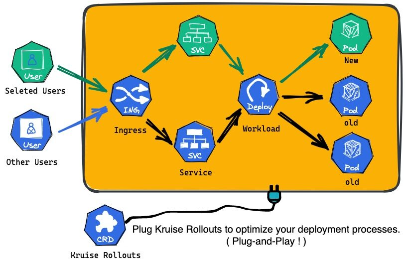
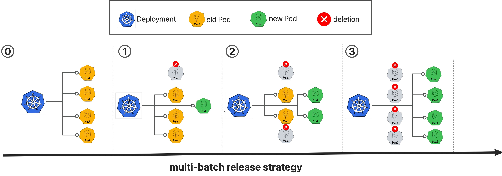
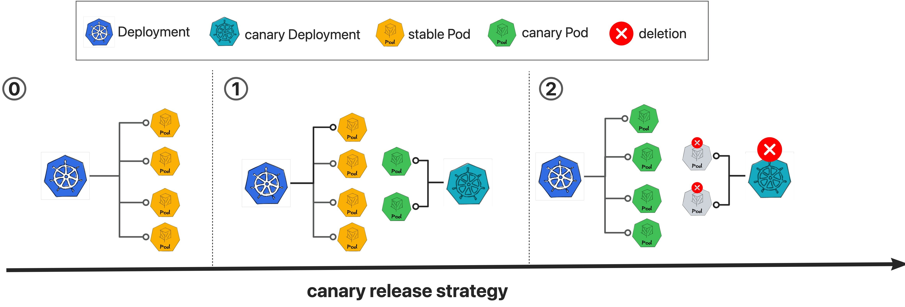
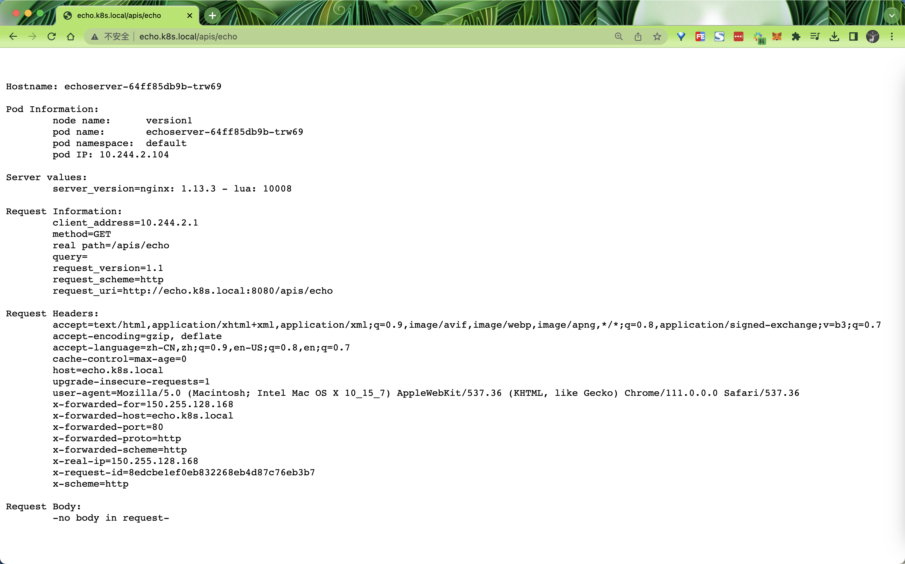
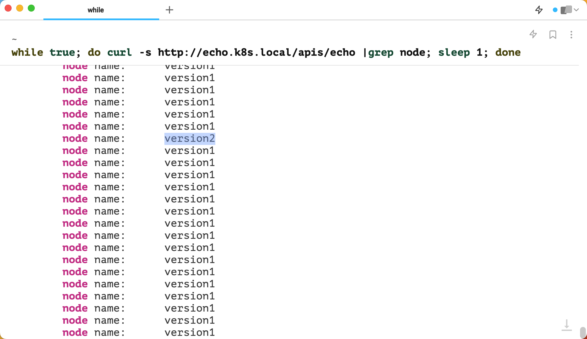
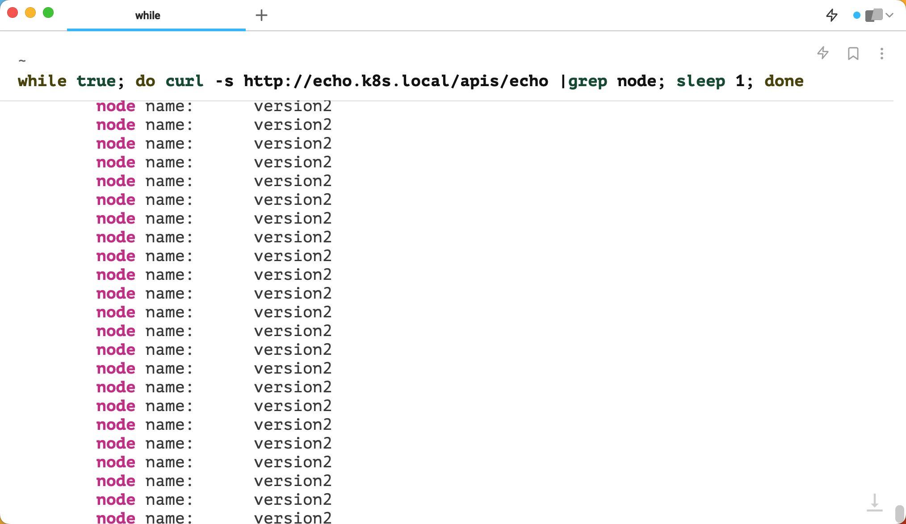
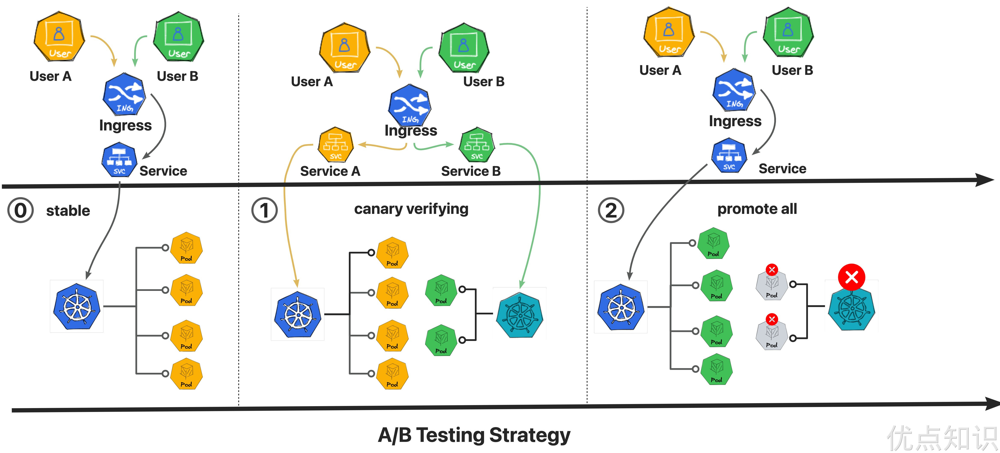

# 30.Kruise Rollouts

`Kruise Rollouts` 是 OpenKruise 提供的一个旁路组件，用于提供先进的渐进式交付功能。它支持金丝雀、多批次和 A/B 测试交付模式，可以帮助实现对应用程序变更的平稳和可控发布，同时它与 Gateway API 和各种 Ingress 实现的兼容性使其更容易与你现有基础架构集成。总的来说，Kruise Rollouts 对于希望优化其部署流程的 Kubernetes 用户来说是一个有价值的工具！



`Kruise Rollouts` 具有以下几个主要特点：

- **更多的发布策略** 
   - Deployment、CloneSet、StatefulSet 和 Advanced StatefulSet 的多批次更新策略。
   - Deployment 的金丝雀更新策略。
- **更多流量路由管理策略** 
   - 在更新工作负载时进行流量细粒度加权流量转移。
   - 基于 HTTP 头和 Cookie 进行 A/B 测试，根据流量进行转移。
- **更多流量协议支持** 
   - Ingress 控制器集成：NGINX、ALB、Higress。
   - 通过 Gateway API 与服务网格集成。
   - 可插拔的 Lua 脚本，轻松扩展到其他 Kubernetes 流量协议（甚至 CRD）。
- **容易集成** 
   - 轻松与 GitOps 风格的基于 Kubernetes 的 PaaS 集成。

和其他发布组件相比，Kruise Rollouts 有什么优势？

| 组件 | **Kruise Rollouts** | Argo Rollouts | Flux Flagger |
| --- | --- | --- | --- |
| 核心概念 | 增强现有工作负载 | 替换你的工作负载 | 管理你的工作负载 |
| 架构 | 旁路 | 一种新的工作负载类型 | 旁路 |
| 插拔式组件，热插拔 | 是 | 否 | 否 |
| 发布类型 | 多批次，金丝雀，A/B 测试 | 多批次，金丝雀，蓝绿部署，A/B 测试 | 金丝雀，蓝绿部署，A/B 测试 |
| 工作负载类型 | Deployment,StatefulSet,CloneSet,Advaned StatefulSet,DaemonSet(WIP) | Agro-Rollout | Deployment. DaemonSet |
| 流量类型 | Ingress、GatewayAPI、CRD（需要 Lua 脚本） | Ingress、GatewayAPI、APISIX、Traefik、SMI 等 | Ingress、GatewayAPI、APISIX、Traefik、SMI 等 |
| 迁移成本 | 无需迁移你的工作负载和 Pod | 必须迁移你的工作负载和 Pod | 必须迁移你的 Pod |
| HPA 兼容 | 是 | 是 | 否 |


整体上对比，`Kruise Rollouts` 与 `Argo Rollouts` 有相似的架构，但是功能上 `Kruise Rollouts` 更加强大，支持更多的发布策略和流量路由管理策略，同时也支持更多的流量协议。`Kruise Rollouts` 也是一个旁路组件，不需要迁移你的工作负载和 Pod，你可以在任何时候安装它，它会自动发现你的工作负载并管理它们。而和 `Flagger` 相比，`Kruise Rollouts` 支持更多的发布策略和流量路由管理策略，同时也支持更多的流量协议。

所以，如果你想要更多的发布策略和流量路由管理策略，同时也想要更多的流量协议支持，那么 `Kruise Rollouts` 就是一个不错的选择！


## 安装

要使用 `Kruise Rollouts`，需要 Kubernetes 版本 >= 1.19，如果要使用 CloneSet 作为工作负载类型，则还需要安装 [OpenKruise](https://openkruise.io/docs/installation)。

这里我们使用 Helm 来安装 `Kruise Rollouts`，你可以使用 `helm repo add` 命令来添加 `Kruise` 的 Helm 仓库：

```bash
➜ helm repo add openkruise https://openkruise.github.io/charts/
➜ helm repo update
```

然后可以使用 `helm install` 命令来一键安装 `Kruise Rollouts`：

```bash
➜ helm upgrade --install kruise-rollout openkruise/kruise-rollout --version 0.3.0
```

如果你没办法访问 DockerHub，可以使用阿里云的镜像仓库：

```bash
➜ helm upgrade --install kruise-rollout openkruise/kruise-rollout --version 0.3.0 --set image.repository=openkruise-registry.cn-shanghai.cr.aliyuncs.com/openkruise/kruise-rollout
```

该命令默认会在 `kruise-rollout` 命名空间中安装 `Kruise Rollouts`，可以通过 `kubectl get pods -n kruise-rollout` 命令来查看安装结果：

```bash
➜ kubectl get pods -n kruise-rollout
NAME                                                READY   STATUS    RESTARTS   AGE
kruise-rollout-controller-manager-b4d64789d-9kmgm   1/1     Running   0          3m18s
kruise-rollout-controller-manager-b4d64789d-gln5n   1/1     Running   0          3m18s
```

如果想更改默认安装的命名空间，则可以通过 `installation.namespace` 参数来进行指定。

安装后可以看到在 `kruise-rollout` 命名空间中多了一个 `kruise-rollout-controller-manager` 的 Deployment，它是 `Kruise Rollouts` 的控制器，它会自动发现你的工作负载并管理它们。

同样还会安装 3 个用于 Rollout 的 CRD：

```bash
➜ kubectl get crd |grep rollout
batchreleases.rollouts.kruise.io           2023-04-08T06:44:51Z
rollouthistories.rollouts.kruise.io        2023-04-08T06:44:51Z
rollouts.rollouts.kruise.io                2023-04-08T06:44:51Z
```


## 使用

接下来我们来使用 `Kruise Rollouts` 来管理一个工作负载，这里我们使用 Deployment 作为示例。

首先我们创建一个如下所示的 Deployment 工作负载：

```yaml
# workload-demo.yaml
apiVersion: apps/v1
kind: Deployment
metadata:
  name: workload-demo
  namespace: default
spec:
  replicas: 10
  selector:
    matchLabels:
      app: demo
  template:
    metadata:
      labels:
        app: demo
    spec:
      containers:
        - name: busybox
          image: busybox:1.28.3
          command: ["/bin/sh", "-c", "sleep 100d"]
          env:
            - name: VERSION
              value: "version-1"
```

直接应用该资源对象即可：

```bash
➜ kubectl apply -f workload-demo.yaml
➜ kubectl get pods
NAME                             READY   STATUS    RESTARTS   AGE
workload-demo-6c7764b765-69ls9   1/1     Running   0          25m
workload-demo-6c7764b765-9zxr7   1/1     Running   0          26m
workload-demo-6c7764b765-hrd55   1/1     Running   0          25m
workload-demo-6c7764b765-krhfd   1/1     Running   0          25m
workload-demo-6c7764b765-mvrdk   1/1     Running   0          25m
workload-demo-6c7764b765-qzzl2   1/1     Running   0          25m
workload-demo-6c7764b765-tgt4k   1/1     Running   0          26m
workload-demo-6c7764b765-tjgcg   1/1     Running   0          26m
workload-demo-6c7764b765-x5b94   1/1     Running   0          26m
workload-demo-6c7764b765-xj5hb   1/1     Running   0          26m
```


### 多批次更新策略

多批次更新策略是 `Kruise Rollouts` 的一个特性，它可以让你在更新工作负载时，可以控制每批次更新的 Pod 数量，以及每批次更新的时间间隔。

接下来我们需要创建一个 Rollout 对象来管理这个工作负载，比如我们想使用**多批次更新策略**将 Deployment 从 `version-1` 升级到 `version-2`。

- 第 1 批：只升级 1 个 Pod；
- 在第 2 批中：50% 的 Pod 应该升级，即 5 个更新的 Pod；
- 在第 3 批中：100% 的 Pod 应该被升级，即 10 个更新的 Pod。



> 目前，多批次更新策略可以在 CloneSet、StatefulSet、Advanced StatefulSet 和 Deployment 上工作。


那么我们可以创建如下所示的 Rollout 对象：

```yaml
# rollouts-demo.yaml
apiVersion: rollouts.kruise.io/v1alpha1
kind: Rollout
metadata:
  name: rollouts-demo
  namespace: default
  annotations:
    rollouts.kruise.io/rolling-style: partition # 使用多批次更新策略，只能配置 "partition" or "canary"
    # "partition" 意味着像 CloneSet 一样分批滚动，不会创建任何额外的 Workload
    # “canary” 表示以金丝雀方式滚动，并将创建一个金丝雀工作负载，对于Deployment默认是canary
spec:
  objectRef: # 定义工作负载
    workloadRef: # 关联需要管理的工作负载
      apiVersion: apps/v1
      kind: Deployment
      name: workload-demo
  strategy: # 定义升级策略
    canary: # 使用 Canary 策略
      steps: # 定义多批次更新策略
        - replicas: 1
        - replicas: 50%
        - replicas: 100%
```

直接创建该 Rollout 对象即可。

```bash
➜ kubectl apply -f rollouts-demo.yaml
➜ kubectl get rollout
NAME            STATUS    CANARY_STEP   CANARY_STATE   MESSAGE                            AGE
rollouts-demo   Healthy   3             Completed      workload deployment is completed   6s
```

创建 Rollout 对象后，其实已经开始管理工作负载了，上面的 `kubectl get rollout` 命令可以看到 Rollout 的状态为 `Healthy`，但现在工作负载的版本还是 `version-1`，我们可以通过将 Deployment 升级到 `version-2` 版本，来观察下 Rollout 的状态变化。

```bash
➜ kubectl patch deployment workload-demo -p \
'{"spec":{"template":{"spec":{"containers":[{"name":"busybox", "env":[{"name":"VERSION", "value":"version-2"}]}]}}}}'
```

稍等片刻，我们会看到 Deployment 更新了一个 Pod：

```bash
➜ kubectl get deploy
NAME            READY   UP-TO-DATE   AVAILABLE   AGE
workload-demo   10/10   1            10          30m
➜ kubectl get replicaset
NAME                       DESIRED   CURRENT   READY   AGE
workload-demo-6c7764b765   9         9         9       30m
workload-demo-6dd59d49b5   1         1         1       34s
➜ kubectl get pods
NAME                             READY   STATUS    RESTARTS   AGE
workload-demo-6c7764b765-69ls9   1/1     Running   0          30m
workload-demo-6c7764b765-hrd55   1/1     Running   0          30m
workload-demo-6c7764b765-krhfd   1/1     Running   0          30m
workload-demo-6c7764b765-mvrdk   1/1     Running   0          30m
workload-demo-6c7764b765-qzzl2   1/1     Running   0          30m
workload-demo-6c7764b765-tgt4k   1/1     Running   0          31m
workload-demo-6c7764b765-tjgcg   1/1     Running   0          31m
workload-demo-6c7764b765-x5b94   1/1     Running   0          31m
workload-demo-6c7764b765-xj5hb   1/1     Running   0          31m
workload-demo-6dd59d49b5-mpthm   1/1     Running   0          52s
```

现在我们再查看 Rollout 的状态：

```bash
➜ kubectl describe rollout rollouts-demo
Name:         rollouts-demo
Namespace:    default
Labels:       <none>
Annotations:  rollouts.kruise.io/hash: 77cxd69w47b7bwddwv2w7vxvb4xxdbwcx9x289vw69w788w4w6z4x8dd4vbz2zbw
              rollouts.kruise.io/rolling-style: partition
API Version:  rollouts.kruise.io/v1alpha1
Kind:         Rollout
# ......
Status:
  Canary Status:
    Canary Ready Replicas:         1
    Canary Replicas:               1
    Canary Revision:               6dd59d49b5
    Current Step Index:            1
    Current Step State:            StepPaused
    Last Update Time:              2023-04-08T07:27:24Z
    Message:                       BatchRelease is at state Ready, rollout-id , step 1
    Observed Workload Generation:  8
    Pod Template Hash:             6dd59d49b5
    Rollout Hash:                  77cxd69w47b7bwddwv2w7vxvb4xxdbwcx9x289vw69w788w4w6z4x8dd4vbz2zbw
    Stable Revision:               6c7764b765
  Conditions:
    Last Transition Time:  2023-04-08T07:27:16Z
    Last Update Time:      2023-04-08T07:27:16Z
    Message:               Rollout is in Progressing
    Reason:                InRolling
    Status:                True
    Type:                  Progressing
  Message:                 Rollout is in step(1/3), and you need manually confirm to enter the next step
  Observed Generation:     2
  Phase:                   Progressing
Events:
  Type    Reason       Age   From                Message
  ----    ------       ----  ----                -------
  Normal  Progressing  110s  rollout-controller  upgrade step(1) canary pods with new versions done
➜ kubectl get rollout
NAME            STATUS        CANARY_STEP   CANARY_STATE   MESSAGE                                                                         AGE
rollouts-demo   Progressing   1             StepPaused     Rollout is in step(1/3), and you need manually confirm to enter the next step   6m17s
```

可以看到现在 Rollout 的状态为 `Progressing`，并且在第 1 步，当前的金丝雀状态为 `StepPaused`，这是因为我们使用了 `partition` 策略，需要手动确认才能进入下一步。

为了方便手动确认，我们可以安装使用 `kubectl-kruise` 这个插件。如果你已经安装过 [Krew](https://krew.sigs.k8s.io/) 这个插件，那么可以直接通过 `kubectl krew install kruise-tools` 来安装。

如果没有安装 Krew，可以直接前往 [Release 页面](https://github.com/openkruise/kruise-tools/releases) 下载对应的二进制文件，然后将其放到 `PATH` 路径下即可。

```bash
➜ tar -xvf kubectl-kruise-darwin-arm64.tar.gz
➜ sudo mv darwin-arm64/kubectl-kruise /usr/local/bin/
```

然后就可以使用 `kubectl-kruise` 或者 `kubectl kruise` 命令了：

```bash
➜ kubectl-kruise --help
# or
➜ kubectl kruise --help
```

`kubectl-kruise` 插件安装完成后，我们就可以通过 `kubectl-kruise rollout approve` 命令来手动确认继续发布第二批次了：

```bash
➜ kubectl kruise rollout approve rollout/rollouts-demo -n default
rollout.rollouts.kruise.io/rollouts-demo approved
```

确认后现在我们再去查看下现在工作负载的状态：

```bash
➜ kubectl get deploy
NAME            READY   UP-TO-DATE   AVAILABLE   AGE
workload-demo   10/10   5            10          45m
➜ kubectl get replicaset
NAME                       DESIRED   CURRENT   READY   AGE
workload-demo-6c7764b765   5         5         5       45m
workload-demo-6dd59d49b5   5         5         5       15m
➜ kubectl get rollout
NAME            STATUS        CANARY_STEP   CANARY_STATE   MESSAGE                                                                         AGE
rollouts-demo   Progressing   2             StepPaused     Rollout is in step(2/3), and you need manually confirm to enter the next step   18m
```

可以看到现在工作负载已经有 5 个是新版本的了，Rollout 对象也已经进入了第 2 步，如果我们再次手动确认，那么就会进入第 3 步，然后就会将所有的工作负载全部更新为新版本。

继续执行确认操作：

```bash
➜ kubectl kruise rollout approve rollout/rollouts-demo -n default
rollout.rollouts.kruise.io/rollouts-demo approved
```

可以看到现在工作负载已经全部更新为新版本了，Rollout 对象也显示金丝雀发布已经完成：

```bash
➜ kubectl get deploy
NAME            READY   UP-TO-DATE   AVAILABLE   AGE
workload-demo   10/10   10           10          47m
➜ kubectl get replicaset
NAME                       DESIRED   CURRENT   READY   AGE
workload-demo-6c7764b765   0         0         0       48m
workload-demo-6dd59d49b5   10        10        10      17m
➜ kubectl get rollout
NAME            STATUS    CANARY_STEP   CANARY_STATE   MESSAGE                                  AGE
rollouts-demo   Healthy   3             Completed      Rollout progressing has been completed   21m
```

到这里我们的分批次发布就完成了。

上面我们使用 `kubectl kruise rollout approve` 命令来进行手动确认的，那么还有其他方法吗？目前，有两种方法，例如，如果你已完成第一批并要发送第二批：

- 方法一：可以将第一批的 `pause.duration` 字段设置为 `duration:0`，会自动进入下一批。
- 方法二：可以更新 `rollout.status.canaryStatus.currentStepState` 字段为 `StepReady`，同样会自动进入下一批次。

这两种方法都有自己的优点和缺点：

- 对于第一种方法，它可以确保你的操作幂等性，但是在下一个发布之前，你需要将发布策略重置回其原始状态（例如，将持续 `duration` 重置为 nil）

```yaml
kind: Rollout
spec:
  strategy:
    canary:
      steps:
        - replicas: 1
          pause:
            duration: 0
        - ... ...
```

- 对于方法二，你无需在下一次发布之前更改任何内容。不过在确认之前，需要查看 Rollout 的状态，使用 update 接口，而不是 Kubernetes 客户端的 patch 接口，或者使用我们的 kubectl-kruise 工具，也就是上面我们使用的方法。

```bash
➜ kubectl kruise rollout approve rollout/<your-rollout-name> -n <your-rollout-namespace>
```

那么如果现在我们想要回滚操作怎么办呢？事实上，Kruise Rollout 不提供直接回滚的能力。Kruise Rollout 更喜欢用户可以直接回滚工作负载规范来回滚他们的应用程序。当用户需要从 `version-2` 回滚到 `version-1` 时，Kruise Rollout 会使用原生的滚动升级策略快速回滚，而不是遵循 multi-batch checkpoint 策略。

此外还有一些其他注意事项值得我们注意：

- **持续发布**：假设 Rollout 正在从 `version-1` 发布到 `version-2`（未完成）。现在，工作负载被修改为 `version-3`，Rollout 将从开始步骤（第一步）开始进行。
- **HPA 兼容性**：假设你将 HPA 配置为你的工作负载并使用多批更新策略，我们建议使用**百分比**来指定 `steps[x].replicas`。如果在 rollout 过程中副本被放大/缩小，旧版本和新版本副本将根据百分比配置进行缩放。


### 金丝雀发布策略

金丝雀发布策略允许用户在发布新版本时，将流量分配给新版本的一小部分，以便在发布新版本之前，可以对其进行测试。如果测试通过，则可以将流量分配给新版本的所有副本，否则可以回滚到旧版本。

> 目前金丝雀发布策略只支持 Deployment 工作负载。




比如现在我们有一个如下所示的 Deployment 工作负载：

```yaml
# workload-canary-demo.yaml
apiVersion: apps/v1
kind: Deployment
metadata:
  name: echoserver
  labels:
    app: echoserver
spec:
  replicas: 5
  selector:
    matchLabels:
      app: echoserver
  template:
    metadata:
      labels:
        app: echoserver
    spec:
      containers:
        - name: echoserver
          image: registry.aliyuncs.com/google_containers/echoserver:1.10
          ports:
            - containerPort: 8080
          env:
            - name: VERSION # 表示当前是 v1 版本
              value: v1
            - name: NODE_NAME # 这里我们使用该环境变量来表示版本，这样后续只需要更改该环境变量的值即可
              value: version1
            - name: POD_NAME
              valueFrom:
                fieldRef:
                  fieldPath: metadata.name
            - name: POD_NAMESPACE
              valueFrom:
                fieldRef:
                  fieldPath: metadata.namespace
            - name: POD_IP
              valueFrom:
                fieldRef:
                  fieldPath: status.podIP
# nginx ingress 配置
---
apiVersion: v1
kind: Service
metadata:
  name: echoserver
  labels:
    app: echoserver
spec:
  ports:
    - port: 80
      targetPort: 8080
  selector:
    app: echoserver
---
apiVersion: networking.k8s.io/v1
kind: Ingress
metadata:
  name: echoserver
spec:
  ingressClassName: nginx
  rules:
    - host: echo.k8s.local
      http:
        paths:
          - path: /apis/echo
            pathType: Exact
            backend:
              service:
                name: echoserver
                port:
                  number: 80
```

由于要我们这里要使用金丝雀发布策略，所以需要指定流量来源，这里我们使用 Ingress 来指定流量来源。在 Ingress 中，我们指定了 `echo.k8s.local` 作为域名，然后在 `paths` 中指定了 `/apis/echo` 作为路径。

直接应用上面的资源对象即可：

```bash
➜ kubectl apply -f workload-canary-demo.yaml
➜ kubectl get ingress echoserver
NAME         CLASS   HOSTS            ADDRESS       PORTS   AGE
echoserver   nginx   echo.k8s.local   10.98.12.94   80      2m42s
➜ kubectl get svc echoserver
NAME         TYPE        CLUSTER-IP     EXTERNAL-IP   PORT(S)   AGE
echoserver   ClusterIP   10.97.158.14   <none>        80/TCP    2m48s
➜ kubectl get pods -l app=echoserver
NAME                          READY   STATUS    RESTARTS   AGE
echoserver-6995b4bc86-4dzvb   1/1     Running   0          2m54s
echoserver-6995b4bc86-9b4qg   1/1     Running   0          2m54s
echoserver-6995b4bc86-bl82m   1/1     Running   0          2m54s
echoserver-6995b4bc86-n27v7   1/1     Running   0          2m54s
echoserver-6995b4bc86-wgjwp   1/1     Running   0          2m54s
```

部署后我们就可以通过 `http://echo.k8s.local/apis/echo` 来访问我们的服务了。



然后接下来我们就可以使用 Rollout 来进行金丝雀发布了，定义一个如下所示的 Rollout 对象：

```yaml
# rollout-canary-demo.yaml
apiVersion: rollouts.kruise.io/v1alpha1
kind: Rollout
metadata:
  name: rollouts-canary-demo
  annotations:
    rollouts.kruise.io/rolling-style: canary # 指定金丝雀发布策略
spec:
  objectRef:
    workloadRef:
      apiVersion: apps/v1
      kind: Deployment
      name: echoserver
  strategy:
    canary: # 金丝雀发布策略
      steps: # 步骤
        - weight: 5 # 导入5%的流量
          pause: {} # 表示人工确认
          replicas: 1 # 第一批发布的副本个数
        - weight: 40 # 导入40%的流量，没有配置 replicas，也表示发布40%的副本数
          pause: { duration: 30 } # 不需要人工确认，等待30s继续下一批
        - weight: 60
          pause: { duration: 30 }
        - weight: 80
          pause: { duration: 30 }
        - weight: 100
          pause: { duration: 10 }
      trafficRoutings: # 流量路由
        - service: echoserver
          ingress:
            classType: nginx
            name: echoserver
```

同样直接应用上面的资源对象即可：

```bash
➜ kubectl apply -f rollout-canary-demo.yaml
rollout.kruise.io/rollouts-canary-demo created
➜ kubectl get rollout rollouts-canary-demo
NAME                   STATUS    CANARY_STEP   CANARY_STATE   MESSAGE                            AGE
rollouts-canary-demo   Healthy   5             Completed      workload deployment is completed   2m53s
```

目前第一次不会有任何变化，当我们进行下一次发布的时候才能看到效果，比如这里我们修改一下 `workload-canary-demo.yaml` 中的 `NODE_NAME` 环境变量，将其修改为 `version2`，然后再次应用，这样就会触发一次新的发布。

我们可以开一个新的终端来查看工作负载的版本变化：

```bash
➜ while true; do curl -s http://echo.k8s.local/apis/echo |grep node; sleep 1; done
```

应用后我们再次查看工作负载的变化：

```bash
➜ kubectl get deploy
NAME               READY   UP-TO-DATE   AVAILABLE   AGE
echoserver         5/5     0            5           26m
echoserver-prxs8   1/1     1            1           10s
➜ kubectl get pods
NAME                                READY   STATUS    RESTARTS   AGE
echoserver-64ff85db9b-5fr82         1/1     Running   0          19m
echoserver-64ff85db9b-75wds         1/1     Running   0          19m
echoserver-64ff85db9b-trw69         1/1     Running   0          19m
echoserver-64ff85db9b-w7mc4         1/1     Running   0          19m
echoserver-64ff85db9b-wcrf4         1/1     Running   0          19m
echoserver-prxs8-5ccc576f44-x988t   1/1     Running   0          4s
➜ kubectl get ingress
NAME                CLASS   HOSTS            ADDRESS       PORTS   AGE
echoserver          nginx   echo.k8s.local   10.98.12.94   80      34m
echoserver-canary   nginx   echo.k8s.local   10.98.12.94   80      8m27s
➜ kubectl get ingress echoserver-canary -oyaml
apiVersion: networking.k8s.io/v1
kind: Ingress
metadata:
  annotations:
    nginx.ingress.kubernetes.io/canary: "true"
    nginx.ingress.kubernetes.io/canary-weight: "5"
# ......
➜ kubectl get svc
NAME                TYPE        CLUSTER-IP      EXTERNAL-IP   PORT(S)    AGE
echoserver          ClusterIP   10.97.158.14    <none>        80/TCP     34m
echoserver-canary   ClusterIP   10.111.53.82    <none>        80/TCP     8m40s
```

可以看到现在自动创建了一个新的 Deployment，其副本数为 1，这个 Deployment 就是我们的金丝雀 Deployment，同样为了引入流量进来，也创建了新的 Service 和 Ingress 对象。同样查看 Rollout 状态：

```bash
➜ kubectl get rollout rollouts-canary-demo
NAME                   STATUS        CANARY_STEP   CANARY_STATE   MESSAGE                                                                         AGE
rollouts-canary-demo   Progressing   1             StepPaused     Rollout is in step(1/5), and you need manually confirm to enter the next step   9m26s
```

可以看到现在 Rollout 的状态为 `Progressing`，并且处于第一步，也就是上面我们配置的第一布：

```yaml
- weight: 5 # 导入5%的流量
  pause: {} # 表示人工确认
  replicas: 1 # 第一批发布的副本个数
```

会导入 5% 的流量进入金丝雀 Deployment，并且只发布一个新版本的副本，并且需要人工确认，再新开的终端中也可以看到会出现 `version2` 的版本：



接下来我们需要手动确认，同样可以通过 `kubectl rollout` 命令来确认：

```bash
➜ kubectl kruise rollout approve rollout/rollouts-canary-demo -n default
rollout.rollouts.kruise.io/rollouts-canary-demo approved
```

确认后就会进行第二步的发布：

```yaml
- weight: 40 # 导入40%的流量，没有配置 replicas，也表示发布40%的副本数
  pause: { duration: 30 } # 不需要人工确认，等待30s继续下一批
```

这个时候会导入 40% 的流量进入金丝雀 Deployment，副本数也会增加到 40% 的副本数，这个时候不需要人工确认，等待 30s 后继续下一步：

```bash
➜ kubectl get deploy
NAME               READY   UP-TO-DATE   AVAILABLE   AGE
echoserver         5/5     0            5           56m
echoserver-prxs8   2/2     2            2           30m
```

由于后续步骤不需要手动确认，所以慢慢地会发布完所有的副本：

```bash
➜ kubectl get deploy
NAME         READY   UP-TO-DATE   AVAILABLE   AGE
echoserver   5/5     5            5           59m
➜ kubectl get pods
NAME                          READY   STATUS    RESTARTS   AGE
echoserver-5ccc576f44-6cl72   1/1     Running   0          51s
echoserver-5ccc576f44-9z6sw   1/1     Running   0          51s
echoserver-5ccc576f44-g2gqj   1/1     Running   0          51s
echoserver-5ccc576f44-hrltf   1/1     Running   0          51s
echoserver-5ccc576f44-r2j2z   1/1     Running   0          50s
➜ kubectl get rollout rollouts-canary-demo
NAME                   STATUS    CANARY_STEP   CANARY_STATE   MESSAGE                                  AGE
rollouts-canary-demo   Healthy   5             Completed      Rollout progressing has been completed   42m
```



发布完成后，会自动删除金丝雀 Deployment 和 Pod，同时会将流量切换到新的 Deployment 上。

到这里，我们就完成了一个金丝雀发布的过程。


### A/B 测试

A/B 测试是一种常见的测试方法，它的原理是将用户分成几组，一组使用原有的版本，另一组使用新的版本，然后观察两组用户的行为，从而判断新版本是否更好。通常 A/B 测试的目的是为了验证新版本的功能是否可用，或者新版本是否能够带来更好的用户体验，需要结合具体的业务场景来进行。

> 目前 A/B Testing 策略可以在 CloneSet、StatefulSet、Advanced StatefulSet 和 Deployment 上工作。


此外 A/B Testing 需要结合金丝雀或多批次发布策略，如下图所示。



下面我们举一个 A/B Testing 多批发布策略的例子：

```yaml
apiVersion: rollouts.kruise.io/v1alpha1
kind: Rollout
metadata:
  name: rollouts-demo
  annotations:
    rollouts.kruise.io/rolling-style: partition
spec:
  objectRef:
    workloadRef:
    apiVersion: apps/v1
    kind: Deployment
    name: workload-demo
  strategy:
    canary:
      steps:
        - replicas: 1
          matches: # 匹配规则
            - headers: # HTTP Header 匹配规则
                - key: user-agent # HTTP Header 名称
                  type: Exact # 匹配类型
                  value: pc # 匹配值
        - replicas: 50%
        - replicas: 100%
    trafficRoutings:
      - service: service-demo
        ingress:
          classType: nginx
          name: ingress-demo
```

当应用该策略后：

- 第一批会更新 1 个 Pod，HTTP Header `user-agent=pc` 的流量会被引导到新版 Pod，其他流量会被引导到稳定版 Pod，需要人工确认下一批。
- 第 2 批更新 50% Pod，Header 匹配规则取消，所有流量将遵循原来的负载均衡规则。需要人工确认下一批。
- 100% Pod 将在第 3 批更新，Header 匹配规则被取消，所有流量将遵循原来的负载均衡规则。


> 原文: <https://www.yuque.com/cnych/k8s4/qe4sbdtb7ku9f4c9>