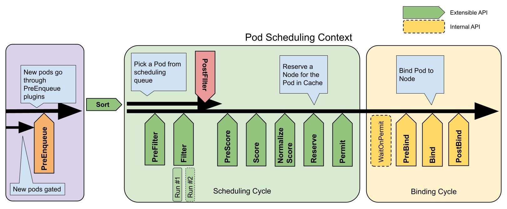

# 32.调度器原理

`kube-scheduler` 是 kubernetes 的核心组件之一，主要负责整个集群资源的调度功能，根据特定的调度算法和策略，将 Pod 调度到最优的工作节点上面去，从而更加合理、更加充分的利用集群的资源，这也是我们选择使用 kubernetes 一个非常重要的理由。如果一门新的技术不能帮助企业节约成本、提供效率，我相信是很难推进的。


## 调度流程

默认情况下，`kube-scheduler` 提供的默认调度器能够满足我们绝大多数的要求，我们前面和大家接触的示例也基本上用的默认的策略，都可以保证我们的 Pod 可以被分配到资源充足的节点上运行。但是在实际的线上项目中，可能我们自己会比 kubernetes 更加了解我们自己的应用，比如我们希望一个 Pod 只能运行在特定的几个节点上，或者这几个节点只能用来运行特定类型的应用，这就需要我们的调度器能够可控。

`kube-scheduler` 的主要作用就是根据特定的调度算法和调度策略将 Pod 调度到合适的 Node 节点上去，是一个独立的二进制程序，启动之后会一直监听 API Server，获取到 `PodSpec.NodeName` 为空的 Pod，对每个 Pod 都会创建一个 binding。


这个过程在我们看来好像比较简单，但在实际的生产环境中，需要考虑的问题就有很多了：

- 如何保证全部的节点调度的公平性？要知道并不是所有节点资源配置一定都是一样的
- 如何保证每个节点都能被分配资源？
- 集群资源如何能够被高效利用？
- 集群资源如何才能被最大化使用？
- 如何保证 Pod 调度的性能和效率？
- 用户是否可以根据自己的实际需求定制自己的调度策略？

考虑到实际环境中的各种复杂情况，kubernetes 的调度器采用插件化的形式实现，可以方便用户进行定制或者二次开发，我们可以自定义一个调度器并以插件形式和 kubernetes 进行集成。

kubernetes 调度器的源码位于 `kubernetes/pkg/scheduler` 中，其中 Scheduler 创建和运行的核心程序，对应的代码在 `pkg/scheduler/scheduler.go`，如果要查看 `kube-scheduler` 的入口程序，对应的代码在 `cmd/kube-scheduler/scheduler.go`。

调度主要分为以下几个部分：

- 首先是**预选过程**，过滤掉不满足条件的节点，这个过程称为 `Predicates`（过滤）
- 然后是**优选过程**，对通过的节点按照优先级排序，称之为 `Priorities`（打分）
- 最后从中选择优先级最高的节点，如果中间任何一步骤有错误，就直接返回错误

`Predicates` 阶段首先遍历全部节点，过滤掉不满足条件的节点，属于`强制性`规则，这一阶段输出的所有满足要求的节点将被记录并作为第二阶段的输入，如果所有的节点都不满足条件，那么 Pod 将会一直处于 Pending 状态，直到有节点满足条件，在这期间调度器会不断的重试。

所以我们在部署应用的时候，如果发现有 Pod 一直处于 Pending 状态，那么就是没有满足调度条件的节点，这个时候可以去检查下节点资源是否可用。

`Priorities` 阶段即再次对节点进行筛选，如果有多个节点都满足条件的话，那么系统会按照节点的优先级(`priorites`)大小对节点进行排序，最后选择优先级最高的节点来部署 Pod 应用。

下面是调度过程的简单示意图：


更详细的流程是这样的：

-  首先，客户端通过 API Server 的 REST API 或者 kubectl 工具创建 Pod 资源 
-  API Server 收到用户请求后，存储相关数据到 etcd 数据库中 
-  调度器监听 API Server 查看到还未被调度(bind)的 Pod 列表，循环遍历地为每个 Pod 尝试分配节点，这个分配过程就是我们上面提到的两个阶段： 
   - 预选阶段(Predicates)，过滤节点，调度器用一组规则过滤掉不符合要求的 Node 节点，比如 Pod 设置了资源的 request，那么可用资源比 Pod 需要的资源少的主机显然就会被过滤掉
   - 优选阶段(Priorities)，为节点的优先级打分，将上一阶段过滤出来的 Node 列表进行打分，调度器会考虑一些整体的优化策略，比如把 Deployment 控制的多个 Pod 副本尽量分布到不同的主机上，使用最低负载的主机等等策略
-  经过上面的阶段过滤后选择打分最高的 Node 节点和 Pod 进行 `binding` 操作，然后将结果存储到 etcd 中
最后被选择出来的 Node 节点对应的 kubelet 去执行创建 Pod 的相关操作（当然也是 watch APIServer 发现的）。 

目前调度器已经全部通过插件的方式实现了调度框架，默认开启的内置调度插件如以下代码所示：

```go
// pkg/scheduler/framework/plugins/registry.go

// NewInTreeRegistry 使用所有内部插件构建注册表。
// 外部插件可以通过 WithFrameworkOutOfTreeRegistry 选项注册额外的插件。
func NewInTreeRegistry() runtime.Registry {
	fts := plfeature.Features{
		EnableDynamicResourceAllocation:              feature.DefaultFeatureGate.Enabled(features.DynamicResourceAllocation),
		EnableReadWriteOncePod:                       feature.DefaultFeatureGate.Enabled(features.ReadWriteOncePod),
		EnableVolumeCapacityPriority:                 feature.DefaultFeatureGate.Enabled(features.VolumeCapacityPriority),
		EnableMinDomainsInPodTopologySpread:          feature.DefaultFeatureGate.Enabled(features.MinDomainsInPodTopologySpread),
		EnableNodeInclusionPolicyInPodTopologySpread: feature.DefaultFeatureGate.Enabled(features.NodeInclusionPolicyInPodTopologySpread),
		EnableMatchLabelKeysInPodTopologySpread:      feature.DefaultFeatureGate.Enabled(features.MatchLabelKeysInPodTopologySpread),
		EnablePodSchedulingReadiness:                 feature.DefaultFeatureGate.Enabled(features.PodSchedulingReadiness),
	}

	registry := runtime.Registry{
		dynamicresources.Name:                runtime.FactoryAdapter(fts, dynamicresources.New),
		selectorspread.Name:                  selectorspread.New,
		imagelocality.Name:                   imagelocality.New,
		tainttoleration.Name:                 tainttoleration.New,
		nodename.Name:                        nodename.New,
		nodeports.Name:                       nodeports.New,
		nodeaffinity.Name:                    nodeaffinity.New,
		podtopologyspread.Name:               runtime.FactoryAdapter(fts, podtopologyspread.New),
		nodeunschedulable.Name:               nodeunschedulable.New,
		noderesources.Name:                   runtime.FactoryAdapter(fts, noderesources.NewFit),
		noderesources.BalancedAllocationName: runtime.FactoryAdapter(fts, noderesources.NewBalancedAllocation),
		volumebinding.Name:                   runtime.FactoryAdapter(fts, volumebinding.New),
		volumerestrictions.Name:              runtime.FactoryAdapter(fts, volumerestrictions.New),
		volumezone.Name:                      volumezone.New,
		nodevolumelimits.CSIName:             runtime.FactoryAdapter(fts, nodevolumelimits.NewCSI),
		nodevolumelimits.EBSName:             runtime.FactoryAdapter(fts, nodevolumelimits.NewEBS),
		nodevolumelimits.GCEPDName:           runtime.FactoryAdapter(fts, nodevolumelimits.NewGCEPD),
		nodevolumelimits.AzureDiskName:       runtime.FactoryAdapter(fts, nodevolumelimits.NewAzureDisk),
		nodevolumelimits.CinderName:          runtime.FactoryAdapter(fts, nodevolumelimits.NewCinder),
		interpodaffinity.Name:                interpodaffinity.New,
		queuesort.Name:                       queuesort.New,
		defaultbinder.Name:                   defaultbinder.New,
		defaultpreemption.Name:               runtime.FactoryAdapter(fts, defaultpreemption.New),
		schedulinggates.Name:                 runtime.FactoryAdapter(fts, schedulinggates.New),
	}

	return registry
}
```

从上面我们可以看出调度器的一系列算法由各种插件在调度的不同阶段来完成，下面我们就先来了解下调度框架。


### 调度框架

调度框架定义了一组扩展点，用户可以实现扩展点定义的接口来定义自己的调度逻辑（我们称之为**扩展**），并将扩展注册到扩展点上，调度框架在执行调度工作流时，遇到对应的扩展点时，将调用用户注册的扩展。调度框架在预留扩展点时，都是有特定的目的，有些扩展点上的扩展可以改变调度程序的决策方法，有些扩展点上的扩展只是发送一个通知。

我们知道每当调度一个 Pod 时，都会按照两个过程来执行：**调度过程和绑定过程**。

调度过程为 Pod 选择一个合适的节点，绑定过程则将调度过程的决策应用到集群中（也就是在被选定的节点上运行 Pod），将调度过程和绑定过程合在一起，称之为**调度上下文（scheduling context）**。需要注意的是调度过程是`同步`运行的（同一时间点只为一个 Pod 进行调度），绑定过程可异步运行（同一时间点可并发为多个 Pod 执行绑定）。

调度过程和绑定过程遇到如下情况时会中途退出：

- 调度程序认为当前没有该 Pod 的可选节点
- 内部错误

这个时候，该 Pod 将被放回到 **待调度队列**，并等待下次重试。


#### 扩展点（Extension Points）

下图展示了调度框架中的调度上下文及其中的扩展点，一个扩展可以注册多个扩展点，以便可以执行更复杂的有状态的任务。



1.  `PreEnqueue` 该扩展在将 Pod 添加到内部活动队列之前被调用，其中 Pod 被标记为准备好进行调度。只有当所有 `PreEnqueue` 插件都返回 `Success` 时，才允许 Pod 进入活动队列。否则，它会被放入内部不可调度的 Pod 列表中，并且不会出现不可调度的情况。（可以向 Pod 的 API 添加一个 `.spec.schedulingGates` 字段，以标记 Pod 的调度准备是否就绪，当 Pod 准备好进行调度时，服务商可以更改此字段以向调度程序发出信号。） 
2.  `QueueSort` 扩展用于对 Pod 的待调度队列进行排序，以决定先调度哪个 Pod，`QueueSort` 扩展本质上只需要实现一个方法 `Less(*QueuedPodInfo, *QueuedPodInfo)` 用于比较两个 Pod 谁更优先获得调度即可，同一时间点只能有一个 `QueueSort` 插件生效。 
3.  `Pre-filter` 扩展用于对 Pod 的信息进行预处理，或者检查一些集群或 Pod 必须满足的前提条件，如果 `pre-filter` 返回了 error，则调度过程终止。 
4.  `Filter` 扩展用于排除那些不能运行该 Pod 的节点，对于每一个节点，调度器将按顺序执行 `filter` 扩展；如果任何一个 `filter` 将节点标记为不可选，则余下的 `filter` 扩展将不会被执行。调度器可以同时对多个节点执行 `filter` 扩展。 
5.  `Post-filter` 是一个通知类型的扩展点，调用该扩展的参数是 `filter` 阶段结束后被筛选为**可选节点**的节点列表，可以在扩展中使用这些信息更新内部状态，或者产生日志或 metrics 信息。 
6.  `Scoring` 扩展用于为所有可选节点进行打分，调度器将针对每一个节点调用 `Soring` 扩展，评分结果是一个范围内的整数。在 `normalize scoring` 阶段，调度器将会把每个 `scoring` 扩展对具体某个节点的评分结果和该扩展的权重合并起来，作为最终评分结果。 
7.  `Normalize scoring` 扩展在调度器对节点进行最终排序之前修改每个节点的评分结果，注册到该扩展点的扩展在被调用时，将获得同一个插件中的 `scoring` 扩展的评分结果作为参数，调度框架每执行一次调度，都将调用所有插件中的一个 `normalize scoring` 扩展一次。 
8.  `Reserve` 是一个通知性质的扩展点，有状态的插件可以使用该扩展点来获得节点上为 Pod 预留的资源，该事件发生在调度器将 Pod 绑定到节点之前，目的是避免调度器在等待 Pod 与节点绑定的过程中调度新的 Pod 到节点上时，发生实际使用资源超出可用资源的情况（因为绑定 Pod 到节点上是异步发生的）。这是调度过程的最后一个步骤，Pod 进入 reserved 状态以后，要么在绑定失败时触发 Unreserve 扩展，要么在绑定成功时，由 Post-bind 扩展结束绑定过程。 
9.  `Permit` 扩展用于阻止或者延迟 Pod 与节点的绑定。Permit 扩展可以做下面三件事中的一项： 
   - approve（批准）：当所有的 permit 扩展都 approve 了 Pod 与节点的绑定，调度器将继续执行绑定过程
   - deny（拒绝）：如果任何一个 permit 扩展 deny 了 Pod 与节点的绑定，Pod 将被放回到待调度队列，此时将触发 `Unreserve` 扩展
   - wait（等待）：如果一个 permit 扩展返回了 wait，则 Pod 将保持在 permit 阶段，直到被其他扩展 approve，如果超时事件发生，wait 状态变成 deny，Pod 将被放回到待调度队列，此时将触发 Unreserve 扩展
10.  `Pre-bind` 扩展用于在 Pod 绑定之前执行某些逻辑。例如，pre-bind 扩展可以将一个基于网络的数据卷挂载到节点上，以便 Pod 可以使用。如果任何一个 `pre-bind` 扩展返回错误，Pod 将被放回到待调度队列，此时将触发 Unreserve 扩展。 
11.  `Bind` 扩展用于将 Pod 绑定到节点上： 
   - 只有所有的 pre-bind 扩展都成功执行了，bind 扩展才会执行
   - 调度框架按照 bind 扩展注册的顺序逐个调用 bind 扩展
   - 具体某个 bind 扩展可以选择处理或者不处理该 Pod
   - 如果某个 bind 扩展处理了该 Pod 与节点的绑定，余下的 bind 扩展将被忽略
12.  `Post-bind` 是一个通知性质的扩展： 
   - Post-bind 扩展在 Pod 成功绑定到节点上之后被动调用
   - Post-bind 扩展是绑定过程的最后一个步骤，可以用来执行资源清理的动作
13.  `Unreserve` 是一个通知性质的扩展，如果为 Pod 预留了资源，Pod 又在被绑定过程中被拒绝绑定，则 unreserve 扩展将被调用。Unreserve 扩展应该释放已经为 Pod 预留的节点上的计算资源。在一个插件中，reserve 扩展和 unreserve 扩展应该成对出现。 

如果我们要实现自己的插件，必须向调度框架注册插件并完成配置，另外还必须实现扩展点接口，对应的扩展点接口我们可以在源码 `pkg/scheduler/framework/interface.go` 文件中找到，如下所示：

```go
// Plugin is the parent type for all the scheduling framework plugins.
type Plugin interface {
	Name() string
}

// PreEnqueuePlugin is an interface that must be implemented by "PreEnqueue" plugins.
// These plugins are called prior to adding Pods to activeQ.
// Note: an preEnqueue plugin is expected to be lightweight and efficient, so it's not expected to
// involve expensive calls like accessing external endpoints; otherwise it'd block other
// Pods' enqueuing in event handlers.
type PreEnqueuePlugin interface {
	Plugin
	// PreEnqueue is called prior to adding Pods to activeQ.
	PreEnqueue(ctx context.Context, p *v1.Pod) *Status
}

// LessFunc is the function to sort pod info
type LessFunc func(podInfo1, podInfo2 *QueuedPodInfo) bool

// QueueSortPlugin is an interface that must be implemented by "QueueSort" plugins.
// These plugins are used to sort pods in the scheduling queue. Only one queue sort
// plugin may be enabled at a time.
type QueueSortPlugin interface {
	Plugin
	// Less are used to sort pods in the scheduling queue.
	Less(*QueuedPodInfo, *QueuedPodInfo) bool
}

// EnqueueExtensions is an optional interface that plugins can implement to efficiently
// move unschedulable Pods in internal scheduling queues. Plugins
// that fail pod scheduling (e.g., Filter plugins) are expected to implement this interface.
type EnqueueExtensions interface {
	// EventsToRegister returns a series of possible events that may cause a Pod
	// failed by this plugin schedulable.
	// The events will be registered when instantiating the internal scheduling queue,
	// and leveraged to build event handlers dynamically.
	// Note: the returned list needs to be static (not depend on configuration parameters);
	// otherwise it would lead to undefined behavior.
	EventsToRegister() []ClusterEvent
}

// PreFilterExtensions is an interface that is included in plugins that allow specifying
// callbacks to make incremental updates to its supposedly pre-calculated
// state.
type PreFilterExtensions interface {
	// AddPod is called by the framework while trying to evaluate the impact
	// of adding podToAdd to the node while scheduling podToSchedule.
	AddPod(ctx context.Context, state *CycleState, podToSchedule *v1.Pod, podInfoToAdd *PodInfo, nodeInfo *NodeInfo) *Status
	// RemovePod is called by the framework while trying to evaluate the impact
	// of removing podToRemove from the node while scheduling podToSchedule.
	RemovePod(ctx context.Context, state *CycleState, podToSchedule *v1.Pod, podInfoToRemove *PodInfo, nodeInfo *NodeInfo) *Status
}

// PreFilterPlugin is an interface that must be implemented by "PreFilter" plugins.
// These plugins are called at the beginning of the scheduling cycle.
type PreFilterPlugin interface {
	Plugin
	// PreFilter is called at the beginning of the scheduling cycle. All PreFilter
	// plugins must return success or the pod will be rejected. PreFilter could optionally
	// return a PreFilterResult to influence which nodes to evaluate downstream. This is useful
	// for cases where it is possible to determine the subset of nodes to process in O(1) time.
	PreFilter(ctx context.Context, state *CycleState, p *v1.Pod) (*PreFilterResult, *Status)
	// PreFilterExtensions returns a PreFilterExtensions interface if the plugin implements one,
	// or nil if it does not. A Pre-filter plugin can provide extensions to incrementally
	// modify its pre-processed info. The framework guarantees that the extensions
	// AddPod/RemovePod will only be called after PreFilter, possibly on a cloned
	// CycleState, and may call those functions more than once before calling
	// Filter again on a specific node.
	PreFilterExtensions() PreFilterExtensions
}

// FilterPlugin is an interface for Filter plugins. These plugins are called at the
// filter extension point for filtering out hosts that cannot run a pod.
// This concept used to be called 'predicate' in the original scheduler.
// These plugins should return "Success", "Unschedulable" or "Error" in Status.code.
// However, the scheduler accepts other valid codes as well.
// Anything other than "Success" will lead to exclusion of the given host from
// running the pod.
type FilterPlugin interface {
	Plugin
	// Filter is called by the scheduling framework.
	// All FilterPlugins should return "Success" to declare that
	// the given node fits the pod. If Filter doesn't return "Success",
	// it will return "Unschedulable", "UnschedulableAndUnresolvable" or "Error".
	// For the node being evaluated, Filter plugins should look at the passed
	// nodeInfo reference for this particular node's information (e.g., pods
	// considered to be running on the node) instead of looking it up in the
	// NodeInfoSnapshot because we don't guarantee that they will be the same.
	// For example, during preemption, we may pass a copy of the original
	// nodeInfo object that has some pods removed from it to evaluate the
	// possibility of preempting them to schedule the target pod.
	Filter(ctx context.Context, state *CycleState, pod *v1.Pod, nodeInfo *NodeInfo) *Status
}

// PostFilterPlugin is an interface for "PostFilter" plugins. These plugins are called
// after a pod cannot be scheduled.
type PostFilterPlugin interface {
	Plugin
	// PostFilter is called by the scheduling framework.
	// A PostFilter plugin should return one of the following statuses:
	// - Unschedulable: the plugin gets executed successfully but the pod cannot be made schedulable.
	// - Success: the plugin gets executed successfully and the pod can be made schedulable.
	// - Error: the plugin aborts due to some internal error.
	//
	// Informational plugins should be configured ahead of other ones, and always return Unschedulable status.
	// Optionally, a non-nil PostFilterResult may be returned along with a Success status. For example,
	// a preemption plugin may choose to return nominatedNodeName, so that framework can reuse that to update the
	// preemptor pod's .spec.status.nominatedNodeName field.
	PostFilter(ctx context.Context, state *CycleState, pod *v1.Pod, filteredNodeStatusMap NodeToStatusMap) (*PostFilterResult, *Status)
}

// PreScorePlugin is an interface for "PreScore" plugin. PreScore is an
// informational extension point. Plugins will be called with a list of nodes
// that passed the filtering phase. A plugin may use this data to update internal
// state or to generate logs/metrics.
type PreScorePlugin interface {
	Plugin
	// PreScore is called by the scheduling framework after a list of nodes
	// passed the filtering phase. All prescore plugins must return success or
	// the pod will be rejected
	PreScore(ctx context.Context, state *CycleState, pod *v1.Pod, nodes []*v1.Node) *Status
}

// ScoreExtensions is an interface for Score extended functionality.
type ScoreExtensions interface {
	// NormalizeScore is called for all node scores produced by the same plugin's "Score"
	// method. A successful run of NormalizeScore will update the scores list and return
	// a success status.
	NormalizeScore(ctx context.Context, state *CycleState, p *v1.Pod, scores NodeScoreList) *Status
}

// ScorePlugin is an interface that must be implemented by "Score" plugins to rank
// nodes that passed the filtering phase.
type ScorePlugin interface {
	Plugin
	// Score is called on each filtered node. It must return success and an integer
	// indicating the rank of the node. All scoring plugins must return success or
	// the pod will be rejected.
	Score(ctx context.Context, state *CycleState, p *v1.Pod, nodeName string) (int64, *Status)

	// ScoreExtensions returns a ScoreExtensions interface if it implements one, or nil if does not.
	ScoreExtensions() ScoreExtensions
}

// ReservePlugin is an interface for plugins with Reserve and Unreserve
// methods. These are meant to update the state of the plugin. This concept
// used to be called 'assume' in the original scheduler. These plugins should
// return only Success or Error in Status.code. However, the scheduler accepts
// other valid codes as well. Anything other than Success will lead to
// rejection of the pod.
type ReservePlugin interface {
	Plugin
	// Reserve is called by the scheduling framework when the scheduler cache is
	// updated. If this method returns a failed Status, the scheduler will call
	// the Unreserve method for all enabled ReservePlugins.
	Reserve(ctx context.Context, state *CycleState, p *v1.Pod, nodeName string) *Status
	// Unreserve is called by the scheduling framework when a reserved pod was
	// rejected, an error occurred during reservation of subsequent plugins, or
	// in a later phase. The Unreserve method implementation must be idempotent
	// and may be called by the scheduler even if the corresponding Reserve
	// method for the same plugin was not called.
	Unreserve(ctx context.Context, state *CycleState, p *v1.Pod, nodeName string)
}

// PreBindPlugin is an interface that must be implemented by "PreBind" plugins.
// These plugins are called before a pod being scheduled.
type PreBindPlugin interface {
	Plugin
	// PreBind is called before binding a pod. All prebind plugins must return
	// success or the pod will be rejected and won't be sent for binding.
	PreBind(ctx context.Context, state *CycleState, p *v1.Pod, nodeName string) *Status
}

// PostBindPlugin is an interface that must be implemented by "PostBind" plugins.
// These plugins are called after a pod is successfully bound to a node.
type PostBindPlugin interface {
	Plugin
	// PostBind is called after a pod is successfully bound. These plugins are
	// informational. A common application of this extension point is for cleaning
	// up. If a plugin needs to clean-up its state after a pod is scheduled and
	// bound, PostBind is the extension point that it should register.
	PostBind(ctx context.Context, state *CycleState, p *v1.Pod, nodeName string)
}

// PermitPlugin is an interface that must be implemented by "Permit" plugins.
// These plugins are called before a pod is bound to a node.
type PermitPlugin interface {
	Plugin
	// Permit is called before binding a pod (and before prebind plugins). Permit
	// plugins are used to prevent or delay the binding of a Pod. A permit plugin
	// must return success or wait with timeout duration, or the pod will be rejected.
	// The pod will also be rejected if the wait timeout or the pod is rejected while
	// waiting. Note that if the plugin returns "wait", the framework will wait only
	// after running the remaining plugins given that no other plugin rejects the pod.
	Permit(ctx context.Context, state *CycleState, p *v1.Pod, nodeName string) (*Status, time.Duration)
}

// BindPlugin is an interface that must be implemented by "Bind" plugins. Bind
// plugins are used to bind a pod to a Node.
type BindPlugin interface {
	Plugin
	// Bind plugins will not be called until all pre-bind plugins have completed. Each
	// bind plugin is called in the configured order. A bind plugin may choose whether
	// or not to handle the given Pod. If a bind plugin chooses to handle a Pod, the
	// remaining bind plugins are skipped. When a bind plugin does not handle a pod,
	// it must return Skip in its Status code. If a bind plugin returns an Error, the
	// pod is rejected and will not be bound.
	Bind(ctx context.Context, state *CycleState, p *v1.Pod, nodeName string) *Status
}
```

对于调度框架插件的启用或者禁用，我们可以使用安装集群时的 [KubeSchedulerConfiguration](https://pkg.go.dev/k8s.io/kubernetes/pkg/scheduler/apis/config?utm_source=godoc#KubeSchedulerConfiguration) 资源对象来进行配置。下面的例子中的配置启用了一个实现了 `reserve` 和 `preBind` 扩展点的插件，并且禁用了另外一个插件，同时为插件 foo 提供了一些配置信息：

```yaml
apiVersion: kubescheduler.config.k8s.io/v1
kind: KubeSchedulerConfiguration

---
plugins:
  reserve:
    enabled:
      - name: foo
      - name: bar
    disabled:
      - name: baz
  preBind:
    enabled:
      - name: foo
    disabled:
      - name: baz

pluginConfig:
  - name: foo
    args: >
      foo插件可以解析的任意内容
```

扩展的调用顺序如下：

- 如果某个扩展点没有配置对应的扩展，调度框架将使用默认插件中的扩展
- 如果为某个扩展点配置且激活了扩展，则调度框架将先调用默认插件的扩展，再调用配置中的扩展
- 默认插件的扩展始终被最先调用，然后按照 `KubeSchedulerConfiguration` 中扩展的激活 `enabled` 顺序逐个调用扩展点的扩展
- 可以先禁用默认插件的扩展，然后在 `enabled` 列表中的某个位置激活默认插件的扩展，这种做法可以改变默认插件的扩展被调用时的顺序

假设默认插件 foo 实现了 `reserve` 扩展点，此时我们要添加一个插件 bar，想要在 foo 之前被调用，则应该先禁用 foo 再按照 bar foo 的顺序激活。示例配置如下所示：

```yaml
apiVersion: kubescheduler.config.k8s.io/v1
kind: KubeSchedulerConfiguration

---
profiles:
  - plugins:
      reserve:
        enabled:
          - name: bar
          - name: foo
        disabled:
          - name: foo
```

在源码目录 `pkg/scheduler/framework/plugins/examples` 中有几个示范插件，我们可以参照其实现方式。


#### 示例

其实要实现一个调度框架的插件，并不难，我们只要实现对应的扩展点，然后将插件注册到调度器中即可，下面是默认调度器在初始化的时候注册的插件：

```go
// pkg/scheduler/algorithmprovider/registry.go
func NewRegistry() Registry {
	return Registry{
		// FactoryMap:
		// New plugins are registered here.
		// example:
		// {
		//  stateful_plugin.Name: stateful.NewStatefulMultipointExample,
		//  fooplugin.Name: fooplugin.New,
		// }
	}
}
```

但是可以看到默认并没有注册一些插件，所以要想让调度器能够识别我们的插件代码，就需要自己来实现一个调度器了，当然这个调度器我们完全没必要完全自己实现，直接调用默认的调度器，然后在上面的 `NewRegistry()` 函数中将我们的插件注册进去即可。在 `kube-scheduler` 的源码文件 `kubernetes/cmd/kube-scheduler/app/server.go` 中有一个 `NewSchedulerCommand` 入口函数，其中的参数是一个类型为 `Option` 的列表，而这个 `Option` 恰好就是一个插件配置的定义：

```go
// Option configures a framework.Registry.
type Option func(framework.Registry) error

// NewSchedulerCommand creates a *cobra.Command object with default parameters and registryOptions
func NewSchedulerCommand(registryOptions ...Option) *cobra.Command {
  ......
}
```

所以我们完全就可以直接调用这个函数来作为我们的函数入口，并且传入我们自己实现的插件作为参数即可，而且该文件下面还有一个名为 `WithPlugin` 的函数可以来创建一个 `Option` 实例：

```go
func WithPlugin(name string, factory runtime.PluginFactory) Option {
	return func(registry runtime.Registry) error {
		return registry.Register(name, factory)
	}
}
```

所以最终我们的入口函数如下所示：

```go
package main

import (
	"k8s.io/component-base/cli"
	"k8s.io/kubernetes/cmd/kube-scheduler/app"
	"math/rand"
	"os"
	// Ensure scheme package is initialized.
	_ "simple-scheduler/pkg/scheduler/apis/config/schema"
	"simple-scheduler/pkg/scheduler/framework/plugins"
	"time"
)

func main() {
	rand.Seed(time.Now().UTC().UnixNano())
	command := app.NewSchedulerCommand(
		app.WithPlugin(plugins.Name, plugins.New))
	code := cli.Run(command)
	os.Exit(code)
}
```

其中 `app.WithPlugin(sample.Name, sample.New)` 就是我们接下来要实现的插件，从 `WithPlugin` 函数的参数也可以看出我们这里的 `sample.New` 必须是一个 `framework.PluginFactory` 类型的值，而 `PluginFactory` 的定义就是一个函数：

```go
type PluginFactory = func(configuration runtime.Object, f framework.Handle) (framework.Plugin, error)
```

所以 `sample.New` 实际上就是上面的这个函数，在这个函数中我们可以获取到插件中的一些数据然后进行逻辑处理即可，插件实现如下所示，我们这里只是简单获取下数据打印日志，如果你有实际需求的可以根据获取的数据就行处理即可，我们这里只是实现了 `PreFilter`、`Filter`、`PreBind` 三个扩展点，其他的可以用同样的方式来扩展即可：

```go
package plugins

import (
	"context"
	"fmt"
	v1 "k8s.io/api/core/v1"
	"k8s.io/apimachinery/pkg/runtime"
	"k8s.io/klog/v2"
	"k8s.io/kubernetes/pkg/scheduler/framework"
	"simple-scheduler/pkg/scheduler/apis/config"
	"simple-scheduler/pkg/scheduler/apis/config/validation"
)

const Name = "sample-plugin"

type Sample struct {
	args   *config.SampleArgs
	handle framework.Handle
}

func (s *Sample) Name() string {
	return Name
}

func (s *Sample) PreFilter(ctx context.Context, cycleState *framework.CycleState, pod *v1.Pod) (*framework.PreFilterResult, *framework.Status) {
	klog.V(3).Infof("prefilter pod: %v, args: %+v", pod.Name, s.args)
	return nil, nil
}

func (s *Sample) Filter(ctx context.Context, cycleState *framework.CycleState, pod *v1.Pod, nodeInfo *framework.NodeInfo) *framework.Status {
	klog.V(3).Infof("filter pod: %v, node: %v", pod.Name, nodeInfo.Node().Name)
	return framework.NewStatus(framework.Success, "")
}

func (s *Sample) PreBind(ctx context.Context, state *framework.CycleState, pod *v1.Pod, nodeName string) *framework.Status {
	if nodeInfo, err := s.handle.SnapshotSharedLister().NodeInfos().Get(nodeName); err != nil {
		return framework.NewStatus(framework.Error, fmt.Sprintf("prebind get node: %s info error: %s", nodeName, err.Error()))
	} else {
		klog.V(3).Infof("prebind node info: %+v", nodeInfo.Node())
		return framework.NewStatus(framework.Success, "")
	}
}

func New(fpArgs runtime.Object, fh framework.Handle) (framework.Plugin, error) {
	args, ok := fpArgs.(*config.SampleArgs)
	if !ok {
		return nil, fmt.Errorf("got args of type %T, want *SampleArgs", fpArgs)
	}
	if err := validation.ValidateSamplePluginArgs(*args); err != nil {
		return nil, err
	}
	return &Sample{
		args:   args,
		handle: fh,
	}, nil
}
```

> 完整代码可以前往仓库 [https://github.com/cnych/sample-scheduler-framework](https://github.com/cnych/sample-scheduler-framework) 获取。


这里还定义了一个调度去插件的参数：

```go
// +k8s:deepcopy-gen:interfaces=k8s.io/apimachinery/pkg/runtime.Object

// SampleArgs holds arguments to configure the Sample-Plugin plugin.
type SampleArgs struct {
	metav1.TypeMeta `json:",inline"`
	FavoriteColor   *string `json:"favoriteColor,omitempty"`
	FavoriteNumber  *int    `json:"favoriteNumber,omitempty"`
	ThanksTo        *string `json:"thanksTo,omitempty"`
}
```

在旧版本中提供了 framework.DecodeInto 函数可以直接将我们传递进来的参数进行转换，但是新版本必须是一个 `runtime.Object` 对象，所以必须实现对应的深拷贝方法，所以我们在结构体上面增加了 `+k8s:deepcopy-gen:interfaces=k8s.io/apimachinery/pkg/runtime.Object` 这个注解，然后通过 Kubernetes 源码中提供的 `hack/update-gen.sh` 脚本就可以自动生成对对应的深拷贝方法。

同意在文件 `register.go` 中，我们需要在对 `AddKnownTypes` 函数的调用中添加 `SampleArgs`。另外，请注意在 `main.go` 文件中我们导入了这里定义的 schema，它使用我们在 `pkg/apis` 中引入的所有配置初始化方案/配置文件。

实现完成后，编译打包成镜像即可，然后我们就可以当成普通的应用用一个 `Deployment` 控制器来部署即可，由于我们需要去获取集群中的一些资源对象，所以当然需要申请 RBAC 权限，然后同样通过 `--config` 参数来配置我们的调度器，同样还是使用一个 `KubeSchedulerConfiguration` 资源对象配置，可以通过 `plugins` 来启用或者禁用我们实现的插件，也可以通过 `pluginConfig` 来传递一些参数值给插件：

```yaml
# sample-scheduler.yaml
kind: ClusterRole
apiVersion: rbac.authorization.k8s.io/v1
metadata:
  name: sample-scheduler-clusterrole
rules:
  - apiGroups:
      - ""
    resources:
      - endpoints
      - events
    verbs:
      - create
      - get
      - update
  - apiGroups:
      - ""
    resources:
      - nodes
      - namespaces
    verbs:
      - get
      - list
      - watch
  - apiGroups:
      - ""
    resources:
      - pods
    verbs:
      - delete
      - get
      - list
      - watch
      - update
  - apiGroups:
      - ""
    resources:
      - bindings
      - pods/binding
    verbs:
      - create
  - apiGroups:
      - ""
    resources:
      - pods/status
    verbs:
      - patch
      - update
  - apiGroups:
      - ""
    resources:
      - replicationcontrollers
      - services
    verbs:
      - get
      - list
      - watch
  - apiGroups:
      - apps
      - extensions
    resources:
      - replicasets
    verbs:
      - get
      - list
      - watch
  - apiGroups:
      - apps
    resources:
      - statefulsets
    verbs:
      - get
      - list
      - watch
  - apiGroups:
      - policy
    resources:
      - poddisruptionbudgets
    verbs:
      - get
      - list
      - watch
  - apiGroups:
      - ""
    resources:
      - persistentvolumeclaims
      - persistentvolumes
    verbs:
      - get
      - list
      - watch
  - apiGroups:
      - ""
    resources:
      - configmaps
    verbs:
      - get
      - list
      - watch
  - apiGroups:
      - "storage.k8s.io"
    resources:
      - storageclasses
      - csinodes
      - csidrivers
      - csistoragecapacities
    verbs:
      - get
      - list
      - watch
  - apiGroups:
      - "coordination.k8s.io"
    resources:
      - leases
    verbs:
      - create
      - get
      - list
      - update
  - apiGroups:
      - "events.k8s.io"
    resources:
      - events
    verbs:
      - create
      - patch
      - update
---
apiVersion: v1
kind: ServiceAccount
metadata:
  name: sample-scheduler-sa
  namespace: kube-system
---
kind: ClusterRoleBinding
apiVersion: rbac.authorization.k8s.io/v1
metadata:
  name: sample-scheduler-clusterrolebinding
  namespace: kube-system
roleRef:
  apiGroup: rbac.authorization.k8s.io
  kind: ClusterRole
  name: sample-scheduler-clusterrole
subjects:
  - kind: ServiceAccount
    name: sample-scheduler-sa
    namespace: kube-system
---
apiVersion: v1
kind: ConfigMap
metadata:
  name: scheduler-config
  namespace: kube-system
data:
  scheduler-config.yaml: |
    apiVersion: kubescheduler.config.k8s.io/v1
    kind: KubeSchedulerConfiguration
    leaderElection:
      leaderElect: true
      leaseDuration: 15s
      renewDeadline: 10s
      resourceLock: endpointsleases
      resourceName: sample-scheduler
      resourceNamespace: kube-system
      retryPeriod: 2s
    profiles:
      - schedulerName: sample-scheduler
        plugins:
          preFilter:
            enabled:
              - name: Sample
          filter:
            enabled:
              - name: Sample
        pluginConfig:
          - name: Sample
            args: 
              favoriteColor: "#326CE5"
              favoriteNumber: 7
              thanksTo: "Kubernetes"
---
apiVersion: apps/v1
kind: Deployment
metadata:
  name: sample-scheduler
  namespace: kube-system
  labels:
    component: sample-scheduler
spec:
  selector:
    matchLabels:
      component: sample-scheduler
  template:
    metadata:
      labels:
        component: sample-scheduler
    spec:
      serviceAccountName: sample-scheduler-sa
      priorityClassName: system-cluster-critical
      volumes:
        - name: scheduler-config
          configMap:
            name: scheduler-config
      containers:
        - name: scheduler
          image: cnych/sample-scheduler:v0.26.3
          imagePullPolicy: Always
          command:
            - /bin/kube-scheduler
            - --config=/etc/kubernetes/scheduler-config.yaml
            - --v=3
          livenessProbe:
            httpGet:
              path: /healthz
              port: 10259
              scheme: HTTPS
            initialDelaySeconds: 15
          readinessProbe:
            httpGet:
              path: /healthz
              port: 10259
              scheme: HTTPS
          volumeMounts:
            - name: scheduler-config
              mountPath: /etc/kubernetes
```

直接部署上面的资源对象即可，这样我们就部署了一个名为 `sample-scheduler` 的调度器了，接下来我们可以部署一个应用来使用这个调度器进行调度：

```yaml
# test-scheduler.yaml
apiVersion: apps/v1
kind: Deployment
metadata:
  name: test-scheduler
spec:
  selector:
    matchLabels:
      app: test-scheduler
  template:
    metadata:
      labels:
        app: test-scheduler
    spec:
      schedulerName: sample-scheduler # 指定使用的调度器，不指定使用默认的default-scheduler
      containers:
        - image: nginx:1.7.9
          imagePullPolicy: IfNotPresent
          name: nginx
          ports:
            - containerPort: 80
```

这里需要注意的是我们现在手动指定了一个 `schedulerName` 的字段，将其设置成上面我们自定义的调度器名称 `sample-scheduler`。

我们直接创建这个资源对象，创建完成后查看我们自定义调度器的日志信息：

```shell
➜ kubectl get pods -n kube-system -l component=sample-scheduler
NAME                                READY   STATUS    RESTARTS   AGE
sample-scheduler-7b977c5564-hq5zr   1/1     Running   0          102s
➜ kubectl logs -f sample-scheduler-7b977c5564-hq5zr -n kube-system
I0418 11:41:03.570227       1 eventhandlers.go:118] "Add event for unscheduled pod" pod="default/test-scheduler-775757977d-d7v9x"
I0418 11:41:03.570348       1 schedule_one.go:81] "Attempting to schedule pod" pod="default/test-scheduler-775757977d-d7v9x"
I0418 11:41:03.570450       1 sample.go:29] prefilter pod: test-scheduler-775757977d-d7v9x, args: FavoriteColor: #326CE5, FavoriteNumber: 7, ThanksTo: Kubernetes
I0418 11:41:03.570541       1 sample.go:38] filter pod: test-scheduler-775757977d-d7v9x, node: node1
I0418 11:41:03.570568       1 sample.go:38] filter pod: test-scheduler-775757977d-d7v9x, node: node2
I0418 11:41:03.570600       1 sample.go:38] filter pod: test-scheduler-775757977d-d7v9x, node: node3
I0418 11:41:03.570939       1 default_binder.go:52] "Attempting to bind pod to node" pod="default/test-scheduler-775757977d-d7v9x" node="node2"
I0418 11:41:03.575178       1 schedule_one.go:252] "Successfully bound pod to node" pod="default/test-scheduler-775757977d-d7v9x" node="node2" evaluatedNodes=4 feasibleNodes=3
I0418 11:41:03.575413       1 eventhandlers.go:186] "Add event for scheduled pod" pod="default/test-scheduler-775757977d-d7v9x"
I0418 11:41:03.575454       1 eventhandlers.go:161] "Delete event for unscheduled pod" pod="default/test-scheduler-775757977d-d7v9x"
```

可以看到当我们创建完 Pod 后，在我们自定义的调度器中就出现了对应的日志，并且在我们定义的扩展点上面都出现了对应的日志，证明我们的示例成功了，也可以通过查看 Pod 的 `schedulerName` 来验证：

```shell
➜ kubectl get pods
NAME                              READY   STATUS    RESTARTS   AGE
test-scheduler-775757977d-d7v9x   1/1     Running   0          35s
➜ kubectl get pod test-scheduler-775757977d-d7v9x -o yaml
......
restartPolicy: Always
schedulerName: sample-scheduler
securityContext: {}
serviceAccount: default
......
```

从 Kubernetes v1.17 版本开始，`Scheduler Framework` 内置的预选和优选函数已经全部插件化，所以要扩展调度器我们应该掌握并理解调度框架这种方式。


## 调度器调优

作为 kubernetes 集群的默认调度器，kube-scheduler 主要负责将 Pod 调度到集群的 Node 上。在一个集群中，满足一个 Pod 调度请求的所有节点称之为 `可调度 Node`，调度器先在集群中找到一个 Pod 的可调度 Node，然后根据一系列函数对这些可调度 Node 进行打分，之后选出其中得分最高的 Node 来运行 Pod，最后，调度器将这个调度决定告知 `kube-apiserver`，这个过程叫做**绑定**。

在 Kubernetes 1.12 版本之前，kube-scheduler 会检查集群中所有节点的可调度性，并且给可调度节点打分。Kubernetes 1.12 版本添加了一个新的功能，允许调度器在找到一定数量的可调度节点之后就停止继续寻找可调度节点。该功能能提高调度器在大规模集群下的调度性能，这个数值是集群规模的百分比，这个百分比通过 `percentageOfNodesToScore` 参数来进行配置，其值的范围在 1 到 100 之间，最大值就是 100%，如果设置为 0 就代表没有提供这个参数配置。Kubernetes 1.14 版本又加入了一个特性，在该参数没有被用户配置的情况下，调度器会根据集群的规模自动设置一个集群比例，然后通过这个比例筛选一定数量的可调度节点进入打分阶段。该特性使用**线性公式**计算出集群比例，比如 100 个节点的集群下会取 50%，在 5000 节点的集群下取 10%，这个自动设置的参数的最低值是 5%，换句话说，调度器至少会对集群中 5% 的节点进行打分，除非用户将该参数设置的低于 5。

> 当集群中的可调度节点少于 50 个时，调度器仍然会去检查所有节点，因为可调度节点太少，不足以停止调度器最初的过滤选择。如果我们想要关掉这个范围参数，可以将 `percentageOfNodesToScore` 值设置成 100。


`percentageOfNodesToScore` 的值必须在 1 到 100 之间，而且其默认值是通过集群的规模计算得来的，另外 **50** 个 Node 的数值是硬编码在程序里面的，设置这个值的作用在于：**当集群的规模是数百个节点并且 percentageOfNodesToScore 参数设置的过低的时候，调度器筛选到的可调度节点数目基本不会受到该参数影响**。当集群规模较小时，这个设置对调度器性能提升并不明显，但是在超过 1000 个 Node 的集群中，将调优参数设置为一个较低的值可以很明显的提升调度器性能。

不过值得注意的是，该参数设置后可能会导致只有集群中少数节点被选为可调度节点，很多 Node 都没有进入到打分阶段，这样就会造成一种后果，一个本来可以在打分阶段得分很高的 Node 甚至都不能进入打分阶段，由于这个原因，所以这个参数不应该被设置成一个很低的值，通常的做法是不会将这个参数的值设置的低于 10，很低的参数值一般在调度器的吞吐量很高且对 Node 的打分不重要的情况下才使用。换句话说，只有当你更倾向于在可调度节点中任意选择一个 Node 来运行这个 Pod 时，才使用很低的参数设置。

如果你的集群规模只有数百个节点或者更少，实际上并不推荐你将这个参数设置得比默认值更低，因为这种情况下不太会有效的提高调度器性能。


## 优先级调度

与前面所讲的调度优选策略中的优先级（Priorities）不同，前面所讲的优先级指的是节点优先级，而我们这里所说的优先级指的是 Pod 的优先级，高优先级的 Pod 会优先被调度，或者在资源不足的情况牺牲低优先级的 Pod，以便于重要的 Pod 能够得到资源部署。

要定义 Pod 优先级，就需要先定义 `PriorityClass` 对象，该对象没有 Namespace 的限制：

```yaml
apiVersion: v1
kind: PriorityClass
metadata:
  name: high-priority
value: 1000000
globalDefault: false
description: "This priority class should be used for XYZ service pods only."
```

其中：

- value 为 32 位整数的优先级，该值越大，优先级越高
- globalDefault 用于未配置 PriorityClassName 的 Pod，整个集群中应该只有一个 `PriorityClass` 将其设置为 true

然后通过在 Pod 的 `spec.priorityClassName` 中指定已定义的 `PriorityClass` 名称即可：

```yaml
apiVersion: v1
kind: Pod
metadata:
  name: nginx
  labels:
    app: nginx
spec:
  containers:
    - name: nginx
      image: nginx
      imagePullPolicy: IfNotPresent
  priorityClassName: high-priority
```

另外一个值得注意的是当节点没有足够的资源供调度器调度 Pod，导致 Pod 处于 pending 时，抢占（preemption）逻辑就会被触发，抢占会尝试从一个节点删除低优先级的 Pod，从而释放资源使高优先级的 Pod 得到节点资源进行部署。


> 原文: <https://www.yuque.com/cnych/k8s4/ra8te7tfekwnavbp>