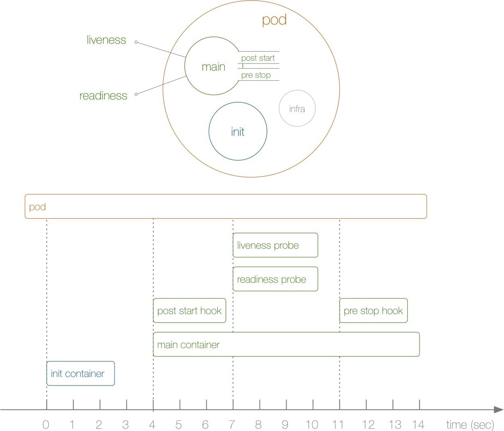
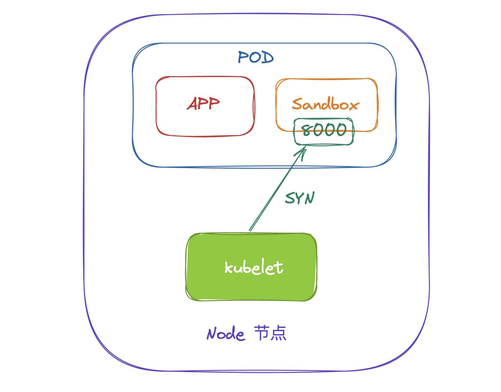
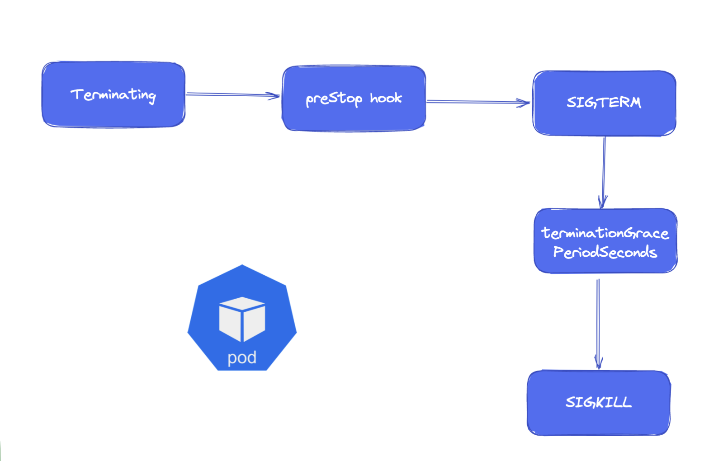
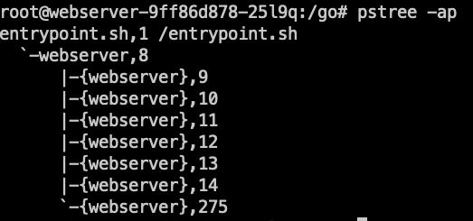

# 4.Pod生命周期

前面我们已经了解了 Pod 的设计原理，接下来我们来了解下 Pod 的生命周期。下图展示了一个 Pod 的完整生命周期过程，其中包含 `Init Container`、`Pod Hook`、`健康检查` 三个主要部分，接下来我们就来分别介绍影响 Pod 生命周期的部分。



首先在介绍 Pod 的生命周期之前，我们先了解下 Pod 的状态，因为 Pod 状态可以反应出当前我们的 Pod 的具体状态信息，也是我们分析排错的一个必备的方式。


## Pod 状态

首先先了解下 Pod 的状态值，我们可以通过 `kubectl explain pod.status` 命令来了解关于 Pod 状态的一些信息，Pod 的状态定义在 `PodStatus` 对象中，其中有一个 `phase` 字段，下面是 `phase` 的可能取值：

- 挂起（Pending）：Pod 信息已经提交给了集群，但是还没有被调度器调度到合适的节点或者 Pod 里的镜像正在下载
- 运行中（Running）：该 Pod 已经绑定到了一个节点上，Pod 中所有的容器都已被创建。至少有一个容器正在运行，或者正处于启动或重启状态
- 成功（Succeeded）：Pod 中的所有容器都被成功终止，并且不会再重启
- 失败（Failed）：Pod 中的所有容器都已终止了，并且至少有一个容器是因为失败终止。也就是说，容器以非`0`状态退出或者被系统终止
- 未知（Unknown）：因为某些原因无法取得 Pod 的状态，通常是因为与 Pod 所在主机通信失败导致的

除此之外，`PodStatus` 对象中还包含一个 `PodCondition` 的数组，里面包含的属性有：

- `lastProbeTime`：最后一次探测 Pod Condition 的时间戳。
- `lastTransitionTime`：上次 Condition 从一种状态转换到另一种状态的时间。
- `message`：上次 Condition 状态转换的详细描述。
- `reason`：Condition 最后一次转换的原因。
- `status`：Condition 状态类型，可以为 `True`, `False` 和 `Unknown`。
- `type`：Condition 类型，包括以下方面： 
   - `PodScheduled`：Pod 已经被调度到其他 node 里
   - `Ready`：Pod 能够提供服务请求，可以被添加到所有可匹配服务的负载平衡池中
   - `Initialized`：所有的`init containers`已经启动成功
   - `Unschedulable`：调度程序现在无法调度 Pod，例如由于缺乏资源或其他限制
   - `ContainersReady`：Pod 里的所有容器都是 ready 状态


## 重启策略

我们可以通过配置 `restartPolicy` 字段来设置 Pod 中所有容器的重启策略，其可能值为 `Always`、`OnFailure` 和 `Never`，默认值为 `Always`，`restartPolicy` 指通过 kubelet 在同一节点上重新启动容器。通过 kubelet 重新启动的退出容器将以指数增加延迟（10s，20s，40s…）重新启动，上限为 5 分钟，并在成功执行 10 分钟后重置。不同类型的的控制器可以控制 Pod 的重启策略：

- `Job`：适用于一次性任务如批量计算，任务结束后 Pod 会被此类控制器清除。Job 的重启策略只能是 `OnFailure` 或者 `Never`。
- `ReplicaSet`、`Deployment`：此类控制器希望 Pod 一直运行下去，它们的重启策略只能是 `Always`。
- `DaemonSet`：每个节点上启动一个 Pod，很明显此类控制器的重启策略也应该是 `Always`。


## 初始化容器

了解了 Pod 状态后，首先来了解下 Pod 中最先启动的 `Init Container`，也就是常说的**初始化容器**。`Init Container` 就是用来做初始化工作的容器，可以是一个或者多个，如果有多个的话，这些容器会按定义的顺序依次执行。我们知道一个 Pod 里面的所有容器是共享数据卷（要主动声明）和 `Network Namespace` 的，所以 `Init Container` 里面产生的数据可以被主容器使用到。从上面的 Pod 生命周期的图中可以看出初始化容器是独立与主容器之外的，只有所有的初始化容器执行完之后，主容器才会被启动。那么初始化容器有哪些应用场景呢：

- **等待其他模块 Ready**：这个可以用来解决服务之间的依赖问题，比如我们有一个 Web 服务，该服务又依赖于另外一个数据库服务，但是在我们启动这个 Web 服务的时候我们并不能保证依赖的这个数据库服务就已经就绪了，所以可能会出现一段时间内 Web 服务连接数据库异常。要解决这个问题的话我们就可以在 Web 服务的 Pod 中使用一个 `InitContainer`，在这个初始化容器中去检查数据库是否已经准备好了，准备好了过后初始化容器就结束退出，然后我们主容器的 Web 服务才开始启动，这个时候去连接数据库就不会有问题了。
- **做初始化配置**：比如集群里检测所有已经存在的成员节点，为主容器准备好集群的配置信息，这样主容器起来后就能用这个配置信息加入集群。
- **其它场景**：比如将 Pod 注册到一个中央数据库、配置中心等。

比如现在我们来实现一个功能，在 Nginx Pod 启动之前去重新初始化首页内容，如下所示的资源清单：

```yaml
# init-pod.yaml
apiVersion: v1
kind: Pod
metadata:
  name: init-demo
spec:
  volumes:
    - name: workdir
      emptyDir: {}
  initContainers:
    - name: install
      image: busybox
      command:
        - wget
        - "-O"
        - "/work-dir/index.html"
        - http://www.baidu.com # https
      volumeMounts:
        - name: workdir
          mountPath: "/work-dir"
  containers:
    - name: web
      image: nginx
      ports:
        - containerPort: 80
      volumeMounts:
        - name: workdir
          mountPath: /usr/share/nginx/html
```

上面的资源清单中我们首先在 Pod 顶层声明了一个名为 `workdir` 的 `Volume`，这里我们使用的是一个 `emptyDir{}` 类型的数据卷，这个是一个临时的目录，数据会保存在 kubelet 的工作目录下面，生命周期等同于 Pod 的生命周期。

然后我们定义了一个初始化容器，该容器会下载一个网页的 html 代码文件到 `/work-dir` 目录下面，但是由于我们又将该目录声明挂载到了全局的 Volume，同样的主容器 nginx 也将目录 `/usr/share/nginx/html` 声明挂载到了全局的 Volume，所以在主容器的该目录下面会同步初始化容器中创建的 `index.html` 文件。

直接创建上面的 Pod：

```shell
☸ ➜ kubectl apply -f init-pod.yaml
```

创建完成后可以查看该 Pod 的状态：

```shell
☸ ➜ kubectl get pods
NAME                            READY   STATUS     RESTARTS   AGE
init-demo                       0/1     Init:0/1   0          4s
```

可以发现 Pod 现在的状态处于 `Init:0/1` 状态，意思就是现在第一个初始化容器还在执行过程中，此时我们可以查看 Pod 的详细信息：

```shell
☸ ➜ kubectl describe pod init-demo
Name:         init-demo
Namespace:    default
Priority:     0
Node:         demo-worker2/172.18.0.4
Start Time:   Tue, 06 Dec 2022 15:09:49 +0800
Labels:       <none>
Annotations:  <none>
Status:       Running
IP:           10.244.2.2
IPs:
  IP:  10.244.2.2
Init Containers:
  install:
    Container ID:  containerd://d9cd4527896609efd96d988dfdfa35c258c1a75be3227bf43588a7833979603c
    Image:         busybox
    Image ID:      docker.io/library/busybox@sha256:59f225fdf34f28a07d22343ee415ee417f6b8365cf4a0d3a2933cbd8fd7cf8c1
    Port:          <none>
    Host Port:     <none>
    Command:
      wget
      -O
      /work-dir/index.html
      http://www.baidu.com
    State:          Terminated
      Reason:       Completed
      Exit Code:    0
      Started:      Tue, 06 Dec 2022 15:10:01 +0800
      Finished:     Tue, 06 Dec 2022 15:10:01 +0800
    Ready:          True
    Restart Count:  0
    Environment:    <none>
    Mounts:
      /var/run/secrets/kubernetes.io/serviceaccount from kube-api-access-54ljg (ro)
      /work-dir from workdir (rw)
Containers:
  web:
    Container ID:   containerd://a6c1a65e3062db9fba41a9b612e6a5a3e13779a14272fd2c9c05e0cabd51f1dc
    Image:          nginx
    Image ID:       docker.io/library/nginx@sha256:3b89317d99358692e82aa34d38c52085a937e437daaaf05aa17522460883452e
    Port:           80/TCP
    Host Port:      0/TCP
    State:          Running
      Started:      Tue, 06 Dec 2022 15:10:08 +0800
    Ready:          True
    Restart Count:  0
    Environment:    <none>
    Mounts:
      /usr/share/nginx/html from workdir (rw)
      /var/run/secrets/kubernetes.io/serviceaccount from kube-api-access-54ljg (ro)
Conditions:
  Type              Status
  Initialized       True
  Ready             True
  ContainersReady   True
  PodScheduled      True
Volumes:
  workdir:
    Type:       EmptyDir (a temporary directory that shares a pod's lifetime)
    Medium:
    SizeLimit:  <unset>
  kube-api-access-54ljg:
    Type:                    Projected (a volume that contains injected data from multiple sources)
    TokenExpirationSeconds:  3607
    ConfigMapName:           kube-root-ca.crt
    ConfigMapOptional:       <nil>
    DownwardAPI:             true
QoS Class:                   BestEffort
Node-Selectors:              <none>
Tolerations:                 node.kubernetes.io/not-ready:NoExecute op=Exists for 300s
                             node.kubernetes.io/unreachable:NoExecute op=Exists for 300s
Events:
  Type    Reason     Age    From               Message
  ----    ------     ----   ----               -------
  Normal  Scheduled  2m19s  default-scheduler  Successfully assigned default/init-demo to demo-worker2
  Normal  Pulling    2m19s  kubelet            Pulling image "busybox"
  Normal  Pulled     2m7s   kubelet            Successfully pulled image "busybox" in 11.45848663s
  Normal  Created    2m7s   kubelet            Created container install
  Normal  Started    2m7s   kubelet            Started container install
  Normal  Pulling    2m7s   kubelet            Pulling image "nginx"
  Normal  Pulled     2m     kubelet            Successfully pulled image "nginx" in 7.143303129s
  Normal  Created    2m     kubelet            Created container web
  Normal  Started    2m     kubelet            Started container web
```

从上面的描述信息里面可以看到初始化容器已经启动了，初始化容器执行完成后退出会变成 `Completed` 状态，然后才会启动主容器。待到主容器也启动完成后，Pod 就会变成 `Running` 状态，然后我们去访问下 Pod 主页，验证下是否有我们初始化容器中下载的页面信息：

```shell
☸ ➜ kubectl get pods -o wide
NAME        READY   STATUS    RESTARTS   AGE     IP           NODE           NOMINATED NODE   READINESS GATES
init-demo   1/1     Running   0          4m38s   10.244.2.2   demo-worker2   <none>           <none>
☸ ➜ curl 10.244.2.2
<!DOCTYPE html>
<!--STATUS OK--><html> <head><meta http-equiv=content-type content=text/html;charset=utf-8><meta http-equiv=X-UA-Compatible content=IE=Edge><meta content=always name=referrer><link rel=stylesheet type=text/css href=http://s1.bdstatic.com/r/www/cache/bdorz/baidu.min.css><title>百度一下，你就知道</title></head> <body link=#0000cc> <div id=wrapper> <div id=head> <div class=head_wrapper> <div class=s_form> <div class=s_form_wrapper> <div id=lg>  </div> <form id=form name=f action=//www.baidu.com/s class=fm> <input type=hidden name=bdorz_come value=1> <input type=hidden name=ie value=utf-8> <input type=hidden name=f value=8> <input type=hidden name=rsv_bp value=1> <input type=hidden name=rsv_idx value=1> <input type=hidden name=tn value=baidu><span class="bg s_ipt_wr"><input id=kw name=wd class=s_ipt value maxlength=255 autocomplete=off autofocus></span><span class="bg s_btn_wr"><input type=submit id=su value=百度一下 class="bg s_btn"></span> </form> </div> </div> <div id=u1> <a href=http://news.baidu.com name=tj_trnews class=mnav>新闻</a> <a href=http://www.hao123.com name=tj_trhao123 class=mnav>hao123</a> <a href=http://map.baidu.com name=tj_trmap class=mnav>地图</a> <a href=http://v.baidu.com name=tj_trvideo class=mnav>视频</a> <a href=http://tieba.baidu.com name=tj_trtieba class=mnav>贴吧</a> <noscript> <a href=http://www.baidu.com/bdorz/login.gif?login&amp;tpl=mn&amp;u=http%3A%2F%2Fwww.baidu.com%2f%3fbdorz_come%3d1 name=tj_login class=lb>登录</a> </noscript> <script>document.write('<a href="http://www.baidu.com/bdorz/login.gif?login&tpl=mn&u='+ encodeURIComponent(window.location.href+ (window.location.search === "" ? "?" : "&")+ "bdorz_come=1")+ '" name="tj_login" class="lb">登录</a>');</script> <a href=//www.baidu.com/more/ name=tj_briicon class=bri style="display: block;">更多产品</a> </div> </div> </div> <div id=ftCon> <div id=ftConw> <p id=lh> <a href=http://home.baidu.com>关于百度</a> <a href=http://ir.baidu.com>About Baidu</a> </p> <p id=cp>&copy;2017&nbsp;Baidu&nbsp;<a href=http://www.baidu.com/duty/>使用百度前必读</a>&nbsp; <a href=http://jianyi.baidu.com/ class=cp-feedback>意见反馈</a>&nbsp;京ICP证030173号&nbsp;  </p> </div> </div> </div> </body> </html>
```

可以看到现在我们的主容器内容已经变成我们初始化容器中下载的网页内容了。


## Pod Hook

我们知道 Pod 是 Kubernetes 集群中的最小单元，而 Pod 是由容器组成的，所以在讨论 Pod 的生命周期的时候我们可以先来讨论下容器的生命周期。实际上 Kubernetes 为我们的容器提供了生命周期的钩子，就是我们说的 `Pod Hook`，Pod Hook 是由 kubelet 发起的，当容器中的进程启动前或者容器中的进程终止之前运行，这是包含在容器的生命周期之中，我们可以同时为 Pod 中的所有容器都配置 hook。

Kubernetes 为我们提供了两种钩子函数：

- `PostStart`：Kubernetes 在容器创建后立即发送 `postStart` 事件，然而 `postStart` 处理函数的调用不保证早于容器的入口点（entrypoint） 的执行。`postStart` 处理函数与容器的代码是异步执行的，但 Kubernetes 的容器管理逻辑会一直阻塞等待 `postStart` 处理函数执行完毕。只有 `postStart` 处理函数执行完毕，容器的状态才会变成 `RUNNING`。
- `PreStop`：这个钩子在容器终止之前立即被调用。它是阻塞的，所以它必须在删除容器的调用发出之前完成。主要用于优雅关闭应用程序、通知其他系统等。

我们应该让钩子函数尽可能的轻量，当然有些情况下，长时间运行命令是合理的，比如在停止容器之前预先保存状态。

> Kubernetes 只有在 Pod 结束（Terminated）的时候才会发送 `preStop` 事件，这意味着在 Pod 完成（Completed）时 `preStop` 的事件处理逻辑不会被触发，可以查看 [issue #55087](https://github.com/kubernetes/kubernetes/issues/55807) 这个 issue 进行了解。


另外我们有两种方式来实现上面的钩子函数：

- `Exec` - 用于执行一段特定的命令，不过要注意的是该命令消耗的资源会被计入容器。
- `HTTP` - 对容器上的特定的端点执行 HTTP 请求。

以下示例中，定义了一个 Nginx Pod，其中设置了 `PostStart` 钩子函数，即在容器创建成功后，写入一句话到 `/usr/share/message` 文件中：

```yaml
# pod-poststart.yaml
apiVersion: v1
kind: Pod
metadata:
  name: hook-demo1
spec:
  containers:
    - name: hook-demo1
      image: nginx
      lifecycle:
        postStart:
          exec:
            command:
              [
                "/bin/sh",
                "-c",
                "echo Hello from the postStart handler > /usr/share/message",
              ]
```

直接创建上面的 Pod：

```shell
☸ ➜ kubectl apply -f pod-poststart.yaml
☸ ➜ kubectl get pods hook-demo1
NAME         READY   STATUS    RESTARTS   AGE
hook-demo1   1/1     Running   0          16s
```

创建成功后可以查看容器中 `/usr/share/message` 文件是否内容正确：

```shell
☸ ➜ kubectl exec -it hook-demo1 -- cat /usr/share/message
Hello from the postStart handler
```

以下示例中，定义了一个 Nginx Pod，其中设置了 `PreStop` 钩子函数，即在容器退出之前，优雅的关闭 Nginx：

```yaml
# pod-prestop.yaml
apiVersion: v1
kind: Pod
metadata:
  name: hook-demo2
spec:
  containers:
    - name: hook-demo2
      image: nginx
      lifecycle:
        preStop:
          exec:
            command: ["/usr/sbin/nginx", "-s", "quit"] # 优雅退出

---
apiVersion: v1
kind: Pod
metadata:
  name: hook-demo3
spec:
  volumes:
    - name: message
      hostPath:
        path: /tmp
  containers:
    - name: hook-demo2
      image: nginx
      ports:
        - containerPort: 80
      volumeMounts:
        - name: message
          mountPath: /usr/share/
      lifecycle:
        preStop:
          exec:
            command:
              [
                "/bin/sh",
                "-c",
                "echo Hello from the preStop Handler > /usr/share/message",
              ]
```

上面定义的两个 Pod，一个是利用 `preStop` 来进行优雅删除，另外一个是利用 `preStop` 来做一些信息记录的事情，同样直接创建上面的 Pod：

```shell
☸ ➜ kubectl apply -f pod-prestop.yaml
☸ ➜ kubectl get pods
NAME         READY   STATUS    RESTARTS   AGE
hook-demo2   1/1     Running   0          20s
hook-demo3   1/1     Running   0          20s
```

创建完成后，我们可以直接删除 hook-demo2 这个 Pod，在容器删除之前会执行 preStop 里面的优雅关闭命令，这个用法在后面我们的滚动更新的时候用来保证我们的应用零宕机非常有用。第二个 Pod 我们声明了一个 hostPath 类型的 Volume，在容器里面声明挂载到了这个 Volume，所以当我们删除 Pod，退出容器之前，在容器里面输出的信息也会同样的保存到宿主机（一定要是 Pod 被调度到的目标节点）的 `/tmp` 目录下面，我们可以查看 hook-demo3 这个 Pod 被调度的节点：

```shell
☸ ➜ kubectl describe pod hook-demo3
Name:         hook-demo3
Namespace:    default
Priority:     0
Node:         demo-worker2/172.18.0.4
......
```

可以看到这个 Pod 被调度到了 `demo-worker2` 这个节点上，我们可以先到该节点上查看 `/tmp` 目录下面目前没有任何内容：

```shell
☸ ➜ ls /tmp/
```

现在我们来删除 `hook-demo3` 这个 Pod，按照我们的设定在容器退出之前会执行 `preStop` 里面的命令，也就是会往 message 文件中输出一些信息：

```shell
☸ ➜ kubectl delete pod hook-demo3
pod "hook-demo3" deleted
☸ ➜ ls /tmp/
message
☸ ➜ cat /tmp/message
Hello from the preStop Handler
```

另外 Hook 调用的日志没有暴露给 Pod，如果处理程序由于某种原因失败，它将产生一个事件。对于 PostStart，这是 `FailedPostStartHook` 事件，对于 PreStop，是 `FailedPreStopHook` 事件，比如我们修改下面的 `lifecycle-events.yaml` 文件，将 postStart 命令更改为 `badcommand` 并应用它。

```yaml
# lifecycle-events.yaml
apiVersion: v1
kind: Pod
metadata:
  name: lifecycle-demo
spec:
  containers:
    - name: lifecycle-demo-container
      image: nginx
      lifecycle:
        postStart:
          exec:
            command:
              [
                "/bin/sh",
                "-c",
                "echo Hello from the postStart handler > /usr/share/message",
              ]
        preStop:
          exec:
            command:
              [
                "/bin/sh",
                "-c",
                "nginx -s quit; while killall -0 nginx; do sleep 1; done",
              ]
```

应用后我们可以通过运行 `kubectl describe pod lifecycle-demo` 后来查看一些结果事件的示例输出：

```shell
Events:
  Type     Reason               Age              From               Message
  ----     ------               ----             ----               -------
  Normal   Scheduled            7s               default-scheduler  Successfully assigned default/lifecycle-demo to demo-worker
  Normal   Pulled               6s               kubelet            Successfully pulled image "nginx" in 229.604315ms
  Normal   Pulling              4s (x2 over 6s)  kubelet            Pulling image "nginx"
  Normal   Created              4s (x2 over 5s)  kubelet            Created container lifecycle-demo-container
  Normal   Started              4s (x2 over 5s)  kubelet            Started container lifecycle-demo-container
  Warning  FailedPostStartHook  4s (x2 over 5s)  kubelet            Exec lifecycle hook ([badcommand]) for Container "lifecycle-demo-container" in Pod "lifecycle-demo_default(30229739-9651-4e5a-9a32-a8f1688862db)" failed - error: command 'badcommand' exited with 126: , message: "OCI runtime exec failed: exec failed: container_linux.go:380: starting container process caused: exec: \"badcommand\": executable file not found in $PATH: unknown\r\n"
  Normal   Killing              4s (x2 over 5s)  kubelet            FailedPostStartHook
  Normal   Pulled               4s               kubelet            Successfully pulled image "nginx" in 215.66395ms
  Warning  BackOff              2s (x2 over 3s)  kubelet            Back-off restarting failed container
```


## Pod 健康检查

现在在 Pod 的整个生命周期中，能影响到 Pod 的就只剩下健康检查这一部分了。在 Kubernetes 集群当中，我们可以通过配置 `liveness probe（存活探针`）、`readiness probe（就绪探针）` 以及 `startupProbe（启动探针）` 来影响容器的生命周期：

- kubelet 通过使用 `liveness probe` 来确定你的应用程序是否正在运行，通俗点将就是**是否还活着**。一般来说，如果你的程序一旦崩溃了， Kubernetes 就会立刻知道这个程序已经终止了，然后就会重启这个程序。而我们的 `liveness probe` 的目的就是来捕获到当前应用程序还没有终止，还没有崩溃，如果出现了这些情况，那么就重启处于该状态下的容器，使应用程序在存在 bug 的情况下依然能够继续运行下去。
- kubelet 使用 `readiness probe` 来确定容器是否已经就绪可以接收流量过来了。这个探针通俗点讲就是说**是否准备好了**，现在可以开始工作了。只有当 Pod 中的容器都处于就绪状态的时候 kubelet 才会认定该 Pod 处于就绪状态，因为一个 Pod 下面可能会有多个容器。如果就绪态探测失败，端点控制器将从与 Pod 匹配的所有服务的端点列表中删除该 Pod 的 IP 地址，这样我们的流量就不会被路由到这个 Pod 里面来了。
- kubelet 使用 `startup probe` 来指示容器中的应用是否已经启动。如果提供了启动探针，则所有其他探针都会被禁用，直到该探针成功为止。如果启动探测失败，kubelet 将杀死容器，而容器依其重启策略进行重启。如果容器没有提供启动探测，则默认状态为 Success。

**何时使用存活探针**

如果容器中的进程能够在遇到问题或不健康的情况下自行崩溃，则不一定需要存活态探针；kubelet 将根据 Pod 的 `restartPolicy` 自动执行修复操作。如果你希望容器在探测失败时被杀死并重新启动，那么请指定一个存活态探针， 并指定 `restartPolicy` 为 `Always` 或 `OnFailure`。

**何时使用就绪探针**

如果要仅在探测成功时才开始向 Pod 发送请求流量，那么就需要指定就绪态探针。在这种情况下，就绪态探针可能与存活态探针相同，就绪态探针的存在意味着 Pod 将在启动阶段不接收任何数据，并且只有在探针探测成功后才开始接收数据。

如果你希望容器能够自行进入维护状态，也可以指定一个就绪态探针，检查某个特定于就绪态的不同于存活态探测的端点。如果你的应用程序对后端服务有严格的依赖性，你可以同时实现存活态和就绪态探针。当应用程序本身是健康的，存活态探针检测通过后，就绪态探针会额外检查每个所需的后端服务是否可用，这可以帮助你避免将流量导向返回错误信息的 Pod。

如果你的容器需要在启动期间加载大型数据、配置文件等操作，那么这个时候我们可以使用**启动探针**。

> 请注意，如果你只是想在 Pod 被删除时能够排空请求，则不一定需要使用就绪态探针；在删除 Pod 时，Pod 会自动将自身置于未就绪状态，无论就绪态探针是否存在。 等待 Pod 中的容器停止期间，Pod 会一直处于未就绪状态。


**何时使用启动探针**

该探针在 Kubernetes v1.20 版本才变成稳定状态，对于所包含的容器需要较长时间才能启动就绪的 Pod 而言，启动探针是有用的。你不再需要配置一个较长的存活态探测时间间隔，只需要设置另一个独立的配置选项，对启动期间的容器执行探测，从而允许使用远远超出存活态时间间隔所允许的时长。

如果你的容器启动时间通常超出 `initialDelaySeconds + failureThreshold × periodSeconds` 总值，你应该设置一个启动探针，对存活态探针所使用的同一端点执行检查。 `periodSeconds` 的默认值是 10 秒，还应该将其 `failureThreshold` 设置得足够高，以便容器有充足的时间完成启动，并且避免更改存活态探针所使用的默认值。 这一设置有助于减少死锁状况的发生。

**容器探测**

probe 是由 kubelet 对容器执行的定期诊断，要执行诊断，kubelet 既可以在容器内执行代码，也可以发出一个网络请求。使用探针来检查容器有四种不同的方法。每个探针都必须准确定义为这四种机制中的一种：

- `exec`：在容器内执行指定命令，如果命令退出时返回码为 0 则认为诊断成功。
- `grpc`：使用 gRPC 执行一个远程过程调用，目标应该实现 gRPC 健康检查。如果响应的状态是 `SERVING`，则认为诊断成功，不过需要注意 gRPC 探针是一个 Alpha 特性，只有在启用了 `GRPCContainerProbe` 特性门时才能使用。
- `httpGet`：对容器的 IP 地址上指定端口和路径执行 HTTP GET 请求，如果响应的状态码大于等于 200 且小于 400，则诊断被认为是成功的。
- `tcpSocket`：使用此配置，kubelet 将尝试在指定端口上打开容器的套接字。如果可以建立连接，容器被认为是健康的，如果不能就认为是失败的。实际上就是检查端口。

每次探测都将获得以下三种结果之一：

- Success（成功）：容器通过了诊断。
- Failure（失败）：容器未通过诊断。
- Unknown（未知）：诊断失败，因此不会采取任何行动。

我们先来给大家演示下存活探针的使用方法，首先我们用 exec 执行命令的方式来检测容器的存活，如下：

```yaml
# liveness-exec.yaml
apiVersion: v1
kind: Pod
metadata:
  name: liveness-exec
spec:
  containers:
    - name: liveness
      image: busybox
      args:
        - /bin/sh
        - -c
        - touch /tmp/healthy; sleep 30; rm -rf /tmp/healthy; sleep 600
      livenessProbe:
        exec:
          command:
            - cat
            - /tmp/healthy
        initialDelaySeconds: 5
        periodSeconds: 5
```
我们这里需要用到一个新的属性 `livenessProbe`，下面通过 exec 执行一段命令:

- `periodSeconds`：表示让 kubelet 每隔 5 秒执行一次存活探针，也就是每 5 秒执行一次上面的 `cat /tmp/healthy` 命令，如果命令执行成功了，将返回 0，那么 kubelet 就会认为当前这个容器是存活的，如果返回的是非 0 值，那么 kubelet 就会把该容器杀掉然后重启它。默认是 10 秒，最小 1 秒。
- `initialDelaySeconds`：表示在第一次执行探针的时候要等待 5 秒，这样能够确保我们的容器能够有足够的时间启动起来。大家可以想象下，如果你的第一次执行探针等候的时间太短，是不是很有可能容器还没正常启动起来，所以存活探针很可能始终都是失败的，这样就会无休止的重启下去了，对吧？

我们在容器启动的时候，执行了如下命令：

```shell
/bin/sh -c "touch /tmp/healthy; sleep 30; rm -rf /tmp/healthy; sleep 600"
```

意思是说在容器最开始的 30 秒内创建了一个 `/tmp/healthy` 文件，在这 30 秒内执行 `cat /tmp/healthy` 命令都会返回一个成功的返回码。30 秒后，我们删除这个文件，现在执行 `cat /tmp/healthy` 是不是就会失败了（默认检测失败 3 次才认为失败），所以这个时候就会重启容器了。

我们来创建下该 Pod，然后在 30 秒内，查看 Pod 的 Event：

```shell
☸ ➜ kubectl apply -f liveness-exec.yaml
☸ ➜ kubectl describe pod liveness-exec
Name:         liveness-exec
Namespace:    default
......
Events:
  Type     Reason     Age                From               Message
  ----     ------     ----               ----               -------
  Normal   Scheduled  89s                default-scheduler  Successfully assigned default/liveness-exec to demo-worker2
  Normal   Pulled     85s                kubelet            Successfully pulled image "busybox" in 3.581556251s
  Warning  Unhealthy  44s (x3 over 54s)  kubelet            Liveness probe failed: cat: can't open '/tmp/healthy': No such file or directory
  Normal   Killing    44s                kubelet            Container liveness failed liveness probe, will be restarted
  Normal   Pulling    13s (x2 over 89s)  kubelet            Pulling image "busybox"
  Normal   Created    10s (x2 over 85s)  kubelet            Created container liveness
  Normal   Started    10s (x2 over 85s)  kubelet            Started container liveness
  Normal   Pulled     10s                kubelet            Successfully pulled image "busybox" in 3.84987046s
```

我们可以观察到容器是正常启动的，再隔一会儿查看下 Pod 的 Event，在最下面有一条信息显示 liveness probe 失败了，容器将要重启。然后可以查看到 Pod 的 `RESTARTS` 值加 1 了：

```shell
☸ ➜ kubectl get pods
NAME            READY   STATUS    RESTARTS      AGE
liveness-exec   1/1     Running   1 (16s ago)   106s
```

同样的，我们还可以使用 `HTTP GET` 请求来配置我们的存活探针，我们这里使用一个 liveness 镜像来验证演示下：

```yaml
# liveness-http.yaml
apiVersion: v1
kind: Pod
metadata:
  name: liveness-http
spec:
  containers:
    - name: liveness
      image: cnych/liveness
      args:
        - /server
      livenessProbe:
        httpGet:
          path: /healthz
          port: 8080
          httpHeaders:
            - name: X-Custom-Header
              value: Awesome
        initialDelaySeconds: 3
        periodSeconds: 3
```

同样的，根据 `periodSeconds` 属性我们可以知道 kubelet 需要每隔 3 秒执行一次 `liveness Probe`，该探针将向容器中的 server 的 8080 端口发送一个 HTTP GET 请求。如果 server 的 `/healthz` 路径的 handler 返回一个成功的返回码，kubelet 就会认定该容器是活着的并且很健康，如果返回失败的返回码，kubelet 将杀掉该容器并重启它。`initialDelaySeconds` 指定 kubelet 在该执行第一次探测之前需要等待 3 秒钟。

> 通常来说，任何大于`200`小于`400`的状态码都会认定是成功的返回码。其他返回码都会被认为是失败的返回码。


我们可以来查看下上面的 healthz 的实现：

```
http.HandleFunc("/healthz", func(w http.ResponseWriter, r *http.Request) {
    duration := time.Now().Sub(started)
    if duration.Seconds() > 10 {
        w.WriteHeader(500)
        w.Write([]byte(fmt.Sprintf("error: %v", duration.Seconds())))
    } else {
        w.WriteHeader(200)
        w.Write([]byte("ok"))
    }
})
```

大概意思就是最开始前 10s 返回状态码 200，10s 过后就返回状态码 500。所以当容器启动 3 秒后，kubelet 开始执行健康检查。第一次健康检查会成功，因为是在 10s 之内，但是 10 秒后，健康检查将失败，因为现在返回的是一个错误的状态码了，所以 kubelet 将会杀掉和重启容器。

同样的，我们来创建下该 Pod 测试下效果，10 秒后，查看 Pod 的 event，确认 liveness probe 失败并重启了容器：

```shell
☸ ➜ kubectl apply -f liveness-http.yaml
☸ ➜ kubectl describe pod liveness-http
Name:         liveness-http
Namespace:    default
......
Events:
  Type     Reason     Age                From               Message
  ----     ------     ----               ----               -------
  Normal   Scheduled  44s                default-scheduler  Successfully assigned default/liveness-http to demo-worker
  Normal   Pulled     41s                kubelet            Successfully pulled image "cnych/liveness" in 3.359937074s
  Normal   Pulling    21s (x2 over 45s)  kubelet            Pulling image "cnych/liveness"
  Warning  Unhealthy  21s (x3 over 29s)  kubelet            Liveness probe failed: HTTP probe failed with statuscode: 500
  Normal   Killing    21s                kubelet            Container liveness failed liveness probe, will be restarted
  Normal   Created    6s (x2 over 41s)   kubelet            Created container liveness
  Normal   Started    6s (x2 over 41s)   kubelet            Started container liveness
  Normal   Pulled     6s                 kubelet            Successfully pulled image "cnych/liveness" in 15.300179047s
☸ ➜ kubectl get pods
NAME            READY   STATUS    RESTARTS      AGE
liveness-http   1/1     Running   2 (16s ago)   76s
```

此外对于 HTTP 和 TCP 存活检测可以使用命名的 port，例如：

```yaml
ports:
  - name: liveness-port
    containerPort: 8080
    hostPort: 8080

livenessProbe:
  httpGet:
    path: /healthz
    port: liveness-port
```

不过需要注意应尽量避免使用 TCP 探测，因为 TCP 探测实际就是 kubelet 向指定端口发送 TCP SYN 握手包，当端口被监听内核就会直接响应 ACK，探测就会成功，当程序死锁或 hang 住的情况，这些并不影响端口监听，所以探测结果还是健康，流量打到表面健康但实际不健康的 Pod 上，就无法处理请求，从而引发业务故障。



有时候，会有一些现有的应用在启动时需要较长的初始化时间，前面我们提到了探针里面有一个 `initialDelaySeconds` 的属性，可以来配置第一次执行探针的等待时间，对于启动非常慢的应用这个参数非常有用，比如 `Jenkins`、`Gitlab` 这类应用，但是如何设置一个合适的初始延迟时间呢？这个就和应用具体的环境有关系了，所以这个值往往不是通用的，这样的话可能就会导致一个问题，我们的资源清单在别的环境下可能就会健康检查失败了。这个时候我们就可以使用 `startupProbe（启动探针）`，，该探针将推迟所有其他探针，直到 Pod 完成启动为止，使用方法和存活探针一样。技巧就是使用相同的命令来设置启动探测，针对 HTTP 或 TCP 检测，可以通过将 `failureThreshold * periodSeconds` 参数设置为足够长的时间来应对糟糕情况下的启动时间。

```yaml
ports:
  - name: liveness-port
    containerPort: 8080
    hostPort: 8080

livenessProbe:
  httpGet:
    path: /healthz
    port: liveness-port
  failureThreshold: 1
  periodSeconds: 10

startupProbe:
  httpGet:
    path: /healthz
    port: liveness-port
  failureThreshold: 30 # 尽量设置大点
  periodSeconds: 10
```

比如上面这里的配置表示我们的慢速容器最多可以有 5 分钟（30 个检查 `*` 10 秒= 300s）来完成启动。

有的时候，应用程序可能暂时无法对外提供服务，例如，应用程序可能需要在启动期间加载大量数据或配置文件。在这种情况下，你不想杀死应用程序，也不想对外提供服务。那么这个时候我们就可以使用 `readiness probe` 来检测和减轻这些情况，Pod 中的容器可以报告自己还没有准备，不能处理 Kubernetes 服务发送过来的流量。存活探针和就绪探针如果同时使用的话就可以确保流量不会到达还未准备好的容器，准备好过后，如果应用程序出现了错误，则会重新启动容器。

就绪探针的配置和存活探针的配置相似，唯一区别就是要使用 `readinessProbe` 字段，而不是 `livenessProbe` 字段。

```yaml
readinessProbe:
  exec:
    command:
      - cat
      - /tmp/healthy
  initialDelaySeconds: 5
  periodSeconds: 5
```

> 如果你的容器对外提供了服务，监听了端口，那么都应该配上就绪探针，就绪探针不通过就视为 Pod 不健康，然后会自动将不健康的 Pod 剔除，避免将业务流量转发给异常 Pod。


另外除了上面的 `initialDelaySeconds` 和 `periodSeconds` 属性外，探针还可以配置如下几个参数：

- `timeoutSeconds`：探测超时时间，默认 1 秒，最小 1 秒。
- `successThreshold`：探测失败后，最少连续探测成功多少次才被认定为成功，默认是 1，但是如果是 `liveness` 则必须是 1。最小值是 1。
- `failureThreshold`：探测成功后，最少连续探测失败多少次才被认定为失败，默认是 3，最小值是 1。


## Pod 的终止



1.  用户发出删除 Pod 指令，Pod 被删除，状态变为 `Terminating`，从 API 层面看就是 Pod metadata 中的 `deletionTimestamp` 字段会被标记上删除时间。 
2.  kube-proxy watch 到了就开始更新转发规则，将 Pod 从 service 的 endpoints 列表中摘除掉，新的流量不再转发到该 Pod。 
3.  kubelet watch 到了就开始销毁 Pod。 
   - 3.1. 如果 Pod 中有 container 配置了 preStop Hook ，则 Pod 被标记为 `Terminating` 状态时以同步的方式启动执行；若宽限期结束后 `preStop` 仍未执行结束，则会额外获得一个 2 秒的小宽限期。
   - 3.2. 发送 `SIGTERM` 信号给容器内主进程以通知容器进程开始优雅停止。
   - 3.3. 等待 container 中的主进程完全停止，如果在宽限期结束后还未完全停止，就发送 `SIGKILL` 信号将其强制杀死。
   - 3.4. 所有容器进程终止，清理 Pod 资源。
   - 3.5. 通知 APIServer Pod 销毁完成，完成 Pod 删除。

> 对于长连接类型的业务，比如游戏类应用，我们可以将 `terminationGracePeriodSeconds` 设置大一点，避免过早的被 `SIGKILL` 杀死，但是具体多长时间是不好预估的，所以最好在业务层面进行优化，比如 Pod 销毁时的优雅终止逻辑里面主动通知下客户端，让客户端连到新的后端，然后客户端来保证这两个连接的平滑切换。等旧 Pod 上所有客户端连接都连切换到了新 Pod 上，才最终退出。


**强制终止 Pod**

默认情况下，所有的删除操作都会有 30 秒钟的宽限期限。`kubectl delete` 命令支持 `--grace-period=<seconds>` 选项，允许你重载默认值，设定自己希望的期限值。

将宽限期限强制设置为 0 意味着立即从 APIServer 删除 Pod，如果 Pod 仍然运行于某节点上，强制删除操作会触发 kubelet 立即执行清理操作。

> 你必须在设置 `--grace-period=0` 的同时额外设置 `--force` 参数才能发起强制删除请求。


执行强制删除操作时，APIServer 不再等待来自 kubelet 的、关于 Pod 已经在原来运行的节点上终止执行的确认消息。APIServer 直接删除 Pod 对象，这样新的与之同名的 Pod 即可以被创建。在节点侧，被设置为立即终止的 Pod 仍然会在被强行杀死之前获得一点点的宽限时间。

对于已失败的 Pod 而言，对应的 API 对象仍然会保留在集群的 API 服务器上，直到用户或者控制器进程显式地将其删除。控制面组件会在 Pod 个数超出所配置的阈值 （根据 `kube-controller-manager` 的 `terminated-pod-gc-threshold` 设置）时删除已终止的 Pod（phase 值为 Succeeded 或 Failed）。这一行为会避免随着时间不断创建和终止 Pod 而引起的资源泄露问题。

**业务代码处理 SIGTERM 信号**

要实现优雅退出，我们需要业务代码得支持下优雅退出的逻辑，在业务代码里面处理下 `SIGTERM` 信号，一般主要逻辑就是"排水"，即等待存量的任务或连接完全结束，再退出进程。下面我们给出几种常用编程语言实现优雅退出的示例。

1. Golang：

```go
package main

import (
    "fmt"
    "os"
    "os/signal"
    "syscall"
)

func main() {

    sigs := make(chan os.Signal, 1)
    done := make(chan bool, 1)
    //registers the channel
    signal.Notify(sigs, syscall.SIGTERM)

    go func() {
        sig := <-sigs
        fmt.Println("Caught SIGTERM, shutting down")
        // Finish any outstanding requests, then...
        done <- true
    }()

    fmt.Println("Starting application")
    // Main logic goes here
    <-done
    fmt.Println("exiting")
}
```

2. Python

```python
import signal, time, os

def shutdown(signum, frame):
    print('Caught SIGTERM, shutting down')
    # Finish any outstanding requests, then...
    exit(0)

if __name__ == '__main__':
    # Register handler
    signal.signal(signal.SIGTERM, shutdown)
    # Main logic goes here
```

3. Nodejs

```javascript
process.on("SIGTERM", () => {
  console.log("The service is about to shut down!");

  // Finish any outstanding requests, then...
  process.exit(0);
});
```

4. Java

```java
import sun.misc.Signal;
import sun.misc.SignalHandler;

public class ExampleSignalHandler {
    public static void main(String... args) throws InterruptedException {
        final long start = System.nanoTime();
        Signal.handle(new Signal("TERM"), new SignalHandler() {
            public void handle(Signal sig) {
                System.out.format("\nProgram execution took %f seconds\n", (System.nanoTime() - start) / 1e9f);
                System.exit(0);
            }
        });
        int counter = 0;
        while(true) {
            System.out.println(counter++);
            Thread.sleep(500);
        }
    }
}
```

5. Shell

```shell
#!/bin/sh

## Redirecting Filehanders
ln -sf /proc/$$/fd/1 /log/stdout.log
ln -sf /proc/$$/fd/2 /log/stderr.log

## Pre execution handler
pre_execution_handler() {
  ## Pre Execution
  # TODO: put your pre execution steps here
  : # delete this nop
}

## Post execution handler
post_execution_handler() {
  ## Post Execution
  # TODO: put your post execution steps here
  : # delete this nop
}

## Sigterm Handler
sigterm_handler() {
  if [ $pid -ne 0 ]; then
    # the above if statement is important because it ensures
    # that the application has already started. without it you
    # could attempt cleanup steps if the application failed to
    # start, causing errors.
    kill -15 "$pid"
    wait "$pid"
    post_execution_handler
  fi
  exit 143; # 128 + 15 -- SIGTERM
}

## Setup signal trap
# on callback execute the specified handler
trap 'sigterm_handler' SIGTERM

## Initialization
pre_execution_handler

## Start Process
# run process in background and record PID
>/log/stdout.log 2>/log/stderr.log "$@" &
pid="$!"
# Application can log to stdout/stderr, /log/stdout.log or /log/stderr.log

## Wait forever until app dies
wait "$pid"
return_code="$?"

## Cleanup
post_execution_handler
# echo the return code of the application
exit $return_code
```

**收不到 SIGTERM 信号**

上面我们给出了几种常见的捕捉 SIGTERM 信号的代码，然后我们就可以执行停止逻辑以实现优雅退出了。在 Kubernetes 环境中，业务发版时经常会对工作负载进行滚动更新，当旧版本 Pod 被删除时，K8s 会对 Pod 中各个容器中的主进程发送 `SIGTERM` 信号，当达到退出宽限期后进程还未完全停止的话，就会发送 `SIGKILL` 信号将其强制杀死。但是有的场景下在 Kubernetes 环境中实际运行时，有时候可能会发现在滚动更新时，我们业务的优雅终止逻辑并没有被执行，现象是在等了较长时间后，业务进程直接被 `SIGKILL` 强制杀死了。

这是什么原因造成的呢？通常情况下这都是因为容器启动入口使用了 shell，比如使用了类似 `/bin/sh -c my-app` 这样的启动入口。或者使用 `/entrypoint.sh` 这样的脚本文件作为入口，在脚本中再启动业务进程，比如下面的 `entrypoint.sh` 文件：

```shell
#! /bin/bash

/webserver
```

这就可能就会导致容器内的业务进程收不到 `SIGTERM` 信号，原因是:

1. 容器主进程是 shell，业务进程是在 shell 中启动的，变成了 shell 进程的子进程了。



2. shell 进程默认是不会处理 `SIGTERM` 信号的，自己不会退出，也不会将信号传递给子进程，所以就导致了业务进程不会触发停止逻辑。
3. 当等到 K8s 优雅停止宽限时间 (`terminationGracePeriodSeconds`，默认 30s)，就只能发送 `SIGKILL` 强制杀死 shell 及其子进程了。

那么我们应该如何让我们的业务进程收到 `SIGTERM` 信号呢？当然如果可以的话，尽量不使用 shell 启动业务进程，这样当然最好了，此外我们还有其他解决方案。

1. 使用 exec 启动

在 shell 中启动二进制的命令前加一个 `exec` 命令即可让该二进制启动的进程代替当前 shell 进程，即让新启动的进程成为主进程:

```shell
#! /bin/bash
...

exec /webserver # 脚本中执行二进制
```

然后业务进程就可以正常接收所有信号了，实现优雅退出当然也可以了。

2. 多进程场景

通常我们一个容器只会有一个进程，但有些时候我们不得不启动多个进程，比如从传统部署迁移到 Kubernetes 的过渡期间，使用了富容器，即单个容器中需要启动多个业务进程，这时候我们可以通过 shell 来启动，但却无法使用上面的 `exec` 方式来传递信号了，因为 `exec` 只能让一个进程替代当前 shell 成为主进程。

这个时候我们可以在 shell 中使用 `trap` 来捕获信号，当收到信号后触发回调函数来将信号通过 `kill` 命令传递给业务进程，脚本示例:

```bash
#! /bin/bash

/bin/app1 & pid1="$!" # 启动第一个业务进程并记录 pid
echo "app1 started with pid $pid1"

/bin/app2 & pid2="$!" # 启动第二个业务进程并记录 pid
echo "app2 started with pid $pid2"

handle_sigterm() {
  echo "[INFO] Received SIGTERM"
  kill -SIGTERM $pid1 $pid2 # 传递 SIGTERM 给业务进程
  wait $pid1 $pid2 # 等待所有业务进程完全终止
}
trap handle_sigterm SIGTERM # 捕获 SIGTERM 信号并回调 handle_sigterm 函数

wait # 等待回调执行完，主进程再退出
```

3. 使用 `init` 系统

前面一种方案实际是用脚本实现了一个极简的 `init` 系统 (或 `supervisor`) 来管理所有子进程，只不过它的逻辑很简陋，仅仅简单的透传指定信号给子进程，其实社区有更完善的方案，[dumb-init](https://github.com/Yelp/dumb-init) 和 [tini](https://github.com/krallin/tini) 都可以作为 init 进程，作为主进程 (PID 1) 在容器中启动，然后它再运行 shell 来执行我们指定的脚本 (shell 作为子进程)，shell 中启动的业务进程也成为它的子进程，当它收到信号时会将其传递给所有的子进程，从而也能完美解决 shell 无法传递信号问题，并且还有回收僵尸进程的能力，这也是我们**强烈推荐**的一种方式。

如下所示是一个以 `dumb-init` 制作镜像的 Dockerfile 示例:

```
FROM ubuntu:22.04
RUN apt-get update && apt-get install -y dumb-init
ADD start.sh /
ADD app1 /bin/app1
ADD app2 /bin/app2
ENTRYPOINT ["dumb-init", "--"]
CMD ["/start.sh"]
```

下面则是以 `tini` 为例制作镜像的 Dockerfile 示例:

```
FROM ubuntu:22.04
ENV TINI_VERSION v0.19.0
ADD https://github.com/krallin/tini/releases/download/${TINI_VERSION}/tini /tini
COPY entrypoint.sh /entrypoint.sh
RUN chmod +x /tini /entrypoint.sh
ENTRYPOINT ["/tini", "--"]
CMD [ "/start.sh" ]
```

`start.sh` 脚本中当然也可以是多个进程：

```bash
#! /bin/bash
/bin/app1 &
/bin/app2 &
wait
```

优雅退出是 K8s 中非常重要的一个特性，对于实现我们的应用零宕机滚动更新非常重要，所以一定要掌握这部分知识点。


> 原文: <https://www.yuque.com/cnych/k8s4/ve7yhilipxh454sx>