# 40.Prometheus Operator

前面的章节中我们学习了用自定义的方式来对 Kubernetes 集群进行监控，基本上也能够完成监控报警的需求了。但实际上对上 Kubernetes 来说，还有更简单方式来监控报警，那就是 [Prometheus Operator](https://prometheus-operator.dev/)。Prometheus Operator 为监控 Kubernetes 资源和 Prometheus 实例的管理提供了简单的定义，简化在 Kubernetes 上部署、管理和运行 Prometheus 和 Alertmanager 集群。


## 介绍

Prometheus Operator 为 Kubernetes 提供了对 Prometheus 机器相关监控组件的本地部署和管理方案，该项目的目的是为了简化和自动化基于 Prometheus 的监控栈配置，主要包括以下几个功能：

- Kubernetes 自定义资源：使用 Kubernetes CRD 来部署和管理 Prometheus、Alertmanager 和相关组件。
- 简化的部署配置：直接通过 Kubernetes 资源清单配置 Prometheus，比如版本、持久化、副本、保留策略等等配置。
- Prometheus 监控目标配置：基于熟知的 Kubernetes 标签查询自动生成监控目标配置，无需学习 Prometheus 特地的配置。

首先我们先来了解下 Prometheus Operator 的架构图：


上图是 Prometheus-Operator 官方提供的架构图，各组件以不同的方式运行在 Kubernetes 集群中，其中 Operator 是最核心的部分，作为一个控制器，他会去创建 Prometheus、ServiceMonitor、AlertManager 以及 PrometheusRule 等 CRD 资源对象，然后会一直 Watch 并维持这些资源对象的状态。

在最新版本的 Operator 中提供了一下几个 CRD 资源对象：

- `Prometheus`
- `Alertmanager`
- `ServiceMonitor`
- `PodMonitor`
- `Probe`
- `ThanosRuler`
- `PrometheusRule`
- `AlertmanagerConfig`


### Prometheus

该 CRD 声明定义了 Prometheus 期望在 Kubernetes 集群中运行的配置，提供了配置选项来配置副本、持久化、报警实例等。

对于每个 Prometheus CRD 资源，Operator 都会以 StatefulSet 形式在相同的命名空间下部署对应配置的资源，Prometheus Pod 的配置是通过一个包含 Prometheus 配置的名为 `<prometheus-name>` 的 Secret 对象声明挂载的。

该 CRD 根据标签选择来指定部署的 Prometheus 实例应该覆盖哪些 `ServiceMonitors`，然后 Operator 会根据包含的 ServiceMonitors 生成配置，并在包含配置的 Secret 中进行更新。

如果未提供对 `ServiceMonitor` 的选择，则 Operator 会将 Secret 的管理留给用户，这样就可以提供自定义配置，同时还能享受 Operator 管理 Operator 的设置能力。


### Alertmanager

该 CRD 定义了在 Kubernetes 集群中运行的 Alertmanager 的配置，同样提供了多种配置，包括持久化存储。

对于每个 Alertmanager 资源，Operator 都会在相同的命名空间中部署一个对应配置的 StatefulSet，Alertmanager Pods 被配置为包含一个名为 `<alertmanager-name>` 的 Secret，该 Secret 以 `alertmanager.yaml` 为 key 的方式保存使用的配置文件。

当有两个或更多配置的副本时，Operator 会在**高可用**模式下运行 Alertmanager 实例。


### ThanosRuler

该 CRD 定义了一个 `Thanos Ruler` 组件的配置，以方便在 Kubernetes 集群中运行。通过 Thanos Ruler，可以跨多个 Prometheus 实例处理记录和警报规则。

一个 ThanosRuler 实例至少需要一个 `queryEndpoint`，它指向 `Thanos Queriers` 或 Prometheus 实例的位置。`queryEndpoints` 用于配置 Thanos 运行时的 `--query` 参数，更多信息也可以在 [Thanos 文档](https://prometheus-operator.dev/docs/operator/design/thanos.md)中找到。


### ServiceMonitor

该 CRD 定义了如何监控一组动态的服务，使用标签选择来定义哪些 Service 被选择进行监控。这可以让团队制定一个如何暴露监控指标的规范，然后按照这些规范自动发现新的服务，而无需重新配置。

为了让 Prometheus 监控 Kubernetes 内的任何应用，需要存在一个 Endpoints 对象，Endpoints 对象本质上是 IP 地址的列表，通常 Endpoints 对象是由 Service 对象来自动填充的，Service 对象通过标签选择器匹配 Pod，并将其添加到 Endpoints 对象中。一个 Service 可以暴露一个或多个端口，这些端口由多个 Endpoints 列表支持，这些端点一般情况下都是指向一个 Pod。

Prometheus Operator 引入的这个 ServiceMonitor 对象就会发现这些 Endpoints 对象，并配置 Prometheus 监控这些 Pod。`ServiceMonitorSpec` 的 endpoints 部分就是用于配置这些 Endpoints 的哪些端口将被 scrape 指标的。

> 注意：endpoints（小写）是 ServiceMonitor CRD 中的字段，而 Endpoints（大写）是 Kubernetes 的一种对象。


ServiceMonitors 以及被发现的目标都可以来自任何命名空间，这对于允许跨命名空间监控的场景非常重要。使用 `PrometheusSpec` 的 `ServiceMonitorNamespaceSelector`，可以限制各自的 Prometheus 服务器选择的 ServiceMonitors 的命名空间。使用 `ServiceMonitorSpec` 的 `namespaceSelector`，可以限制 Endpoints 对象被允许从哪些命名空间中发现，要在所有命名空间中发现目标，`namespaceSelector` 必须为空：

```yaml
spec:
  namespaceSelector:
    any: true
```


### PodMonitor

该 CRD 用于定义如何监控一组动态 pods，使用标签选择来定义哪些 pods 被选择进行监控。同样团队中可以制定一些规范来暴露监控的指标。

Pod 是一个或多个容器的集合，可以在一些端口上暴露 Prometheus 指标。

由 Prometheus Operator 引入的 PodMonitor 对象会发现这些 Pod，并为 Prometheus 服务器生成相关配置，以便监控它们。

`PodMonitorSpec` 中的 `PodMetricsEndpoints` 部分，用于配置 Pod 的哪些端口将被 scrape 指标，以及使用哪些参数。

PodMonitors 和发现的目标可以来自任何命名空间，这同样对于允许跨命名空间的监控用例是很重要的。使用 `PodMonitorSpec` 的 `namespaceSelector`，可以限制 Pod 被允许发现的命名空间，要在所有命名空间中发现目标，`namespaceSelector` 必须为空：

```yaml
spec:
  namespaceSelector:
    any: true
```

> `PodMonitor` 和 `ServieMonitor` 最大的区别就是不需要有对应的 Service。


### Probe

该 CRD 用于定义如何监控一组 Ingress 和静态目标。除了 target 之外，`Probe` 对象还需要一个 `prober`，它是监控的目标并为 Prometheus 提供指标的服务。例如可以通过使用 [blackbox-exporter](https://github.com/prometheus/blackbox_exporter/) 来提供这个服务。


### PrometheusRule

用于配置 Prometheus 的 Rule 规则文件，包括 recording rules 和 alerting，可以自动被 Prometheus 加载。


### AlertmanagerConfig

在以前的版本中要配置 Alertmanager 都是通过 Configmap 来完成的，在 v0.43 版本后新增该 CRD，可以将 Alertmanager 的配置分割成不同的子对象进行配置，允许将报警路由到自定义 Receiver 上，并配置抑制规则。

`AlertmanagerConfig` 可以在命名空间级别上定义，为 Alertmanager 提供一个聚合的配置。这里提供了一个如何使用它的[例子](https://prometheus-operator.dev/docs/operator/example/user-guides/alerting/alertmanager-config-example.yaml)。不过需要注意这个 CRD 还不稳定。

这样我们要在集群中监控什么数据，就变成了直接去操作 Kubernetes 集群的资源对象了，是这样比之前手动的方式就方便很多了。


## 安装

为了使用 Prometheus-Operator，这里我们直接使用 [kube-prometheus](https://github.com/prometheus-operator/kube-prometheus.git) 这个项目来进行安装，该项目和 Prometheus-Operator 的区别就类似于 Linux 内核和 CentOS/Ubuntu 这些发行版的关系，真正起作用的是 Operator 去实现的，而 kube-prometheus 只是利用 Operator 编写了一系列常用的监控资源清单。不过需要注意 Kubernetes 版本和 `kube-prometheus` 的兼容：

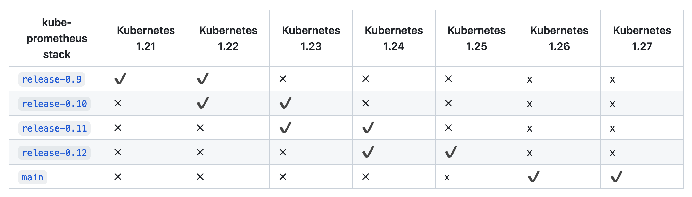

我们可以直接使用 `kube-prometheus` 的 [Helm Charts](https://prometheus-community.github.io/helm-charts/) 来进行快速安装，也可以直接手动安装。

首先 clone 项目代码，我们这里直接使用默认的 `main` 分支即可：

```shell
$ git clone https://github.com/prometheus-operator/kube-prometheus.git
$ cd kube-prometheus
```

首先创建需要的命名空间和 CRDs，等待它们可用后再创建其余资源：

```shell
$ kubectl create -f manifests/setup
customresourcedefinition.apiextensions.k8s.io/alertmanagerconfigs.monitoring.coreos.com created
customresourcedefinition.apiextensions.k8s.io/alertmanagers.monitoring.coreos.com created
customresourcedefinition.apiextensions.k8s.io/podmonitors.monitoring.coreos.com created
customresourcedefinition.apiextensions.k8s.io/probes.monitoring.coreos.com created
customresourcedefinition.apiextensions.k8s.io/prometheuses.monitoring.coreos.com created
customresourcedefinition.apiextensions.k8s.io/prometheusagents.monitoring.coreos.com created
customresourcedefinition.apiextensions.k8s.io/prometheusrules.monitoring.coreos.com created
customresourcedefinition.apiextensions.k8s.io/scrapeconfigs.monitoring.coreos.com created
customresourcedefinition.apiextensions.k8s.io/servicemonitors.monitoring.coreos.com created
customresourcedefinition.apiextensions.k8s.io/thanosrulers.monitoring.coreos.com created
namespace/monitoring created
```

这会创建一个名为 `monitoring` 的命名空间，以及相关的 CRD 资源对象声明。前面章节中我们讲解过 CRD 和 Operator 的使用，当我们声明完 CRD 过后，就可以来自定义资源清单了，但是要让我们声明的自定义资源对象生效就需要安装对应的 Operator 控制器，在 `manifests` 目录下面就包含了 Operator 的资源清单以及各种监控对象声明，比如 Prometheus、Alertmanager 等，直接应用即可：

```shell
$ until kubectl get servicemonitors --all-namespaces; do date; sleep 1; echo ""; done
No resources found
$ kubectl create -f manifests/
```

不过需要注意有一些资源的镜像来自于 `k8s.gcr.io`，如果不能正常拉取，则可以将镜像替换成可拉取的：

- `prometheusAdapter-deployment.yaml`：将 `image: registry.k8s.io/prometheus-adapter/prometheus-adapter:v0.10.0` 替换为 `cnych/prometheus-adapter:v0.10.0`
- `kubeStateMetrics-deployment.yaml`：将 `image: registry.k8s.io/kube-state-metrics/kube-state-metrics:v2.9.2` 替换为 `cnych/kube-state-metrics:v2.9.2`

这会自动安装 prometheus-operator、node-exporter、kube-state-metrics、grafana、prometheus-adapter 以及 prometheus 和 alertmanager 等大量组件，如果没成功可以多次执行上面的安装命令。

```shell
$ kubectl get pods -n monitoring
NAME                                   READY   STATUS    RESTARTS   AGE
alertmanager-main-0                    2/2     Running   0          3m10s
alertmanager-main-1                    2/2     Running   0          3m10s
alertmanager-main-2                    2/2     Running   0          3m10s
blackbox-exporter-7d8c77d7b9-dc548     3/3     Running   0          5m2s
grafana-79f47474f7-zpfcf               1/1     Running   0          5m
kube-state-metrics-687884f688-kjg4x    3/3     Running   0          46s
node-exporter-k2jgv                    2/2     Running   0          4m59s
node-exporter-xtwsh                    2/2     Running   0          4m59s
node-exporter-zsddg                    2/2     Running   0          4m59s
prometheus-adapter-f54b58cdc-59pck     1/1     Running   0          2m56s
prometheus-adapter-f54b58cdc-tq7c8     1/1     Running   0          2m56s
prometheus-k8s-0                       2/2     Running   0          3m9s
prometheus-k8s-1                       2/2     Running   0          3m9s
prometheus-operator-557b4f4977-jzjbv   2/2     Running   0          4m57s
$ kubectl get svc -n monitoring
NAME                    TYPE        CLUSTER-IP      EXTERNAL-IP   PORT(S)                      AGE
alertmanager-main       ClusterIP   10.104.40.205   <none>        9093/TCP,8080/TCP            5m23s
alertmanager-operated   ClusterIP   None            <none>        9093/TCP,9094/TCP,9094/UDP   3m30s
blackbox-exporter       ClusterIP   10.105.200.23   <none>        9115/TCP,19115/TCP           5m23s
grafana                 ClusterIP   10.96.14.117    <none>        3000/TCP                     5m20s
kube-state-metrics      ClusterIP   None            <none>        8443/TCP,9443/TCP            5m20s
node-exporter           ClusterIP   None            <none>        9100/TCP                     5m19s
prometheus-adapter      ClusterIP   10.100.88.159   <none>        443/TCP                      5m17s
prometheus-k8s          ClusterIP   10.107.61.114   <none>        9090/TCP,8080/TCP            5m18s
prometheus-operated     ClusterIP   None            <none>        9090/TCP                     3m29s
prometheus-operator     ClusterIP   None            <none>        8443/TCP                     5m17s
```

可以看到上面针对 grafana、alertmanager 和 prometheus 都创建了一个类型为 ClusterIP 的 Service，当然如果我们想要在外网访问这两个服务的话可以通过创建对应的 Ingress 对象或者使用 NodePort 类型的 Service，我们这里为了简单，直接使用 NodePort 类型的服务即可，编辑 `grafana`、`alertmanager-main` 和 `prometheus-k8s` 这 3 个 Service，将服务类型更改为 NodePort:

```shell
# 将 type: ClusterIP 更改为 type: NodePort
$ kubectl edit svc grafana -n monitoring
$ kubectl edit svc alertmanager-main -n monitoring
$ kubectl edit svc prometheus-k8s -n monitoring
$ kubectl get svc -n monitoring
NAME                    TYPE        CLUSTER-IP       EXTERNAL-IP   PORT(S)                         AGE
alertmanager-main       NodePort    10.102.174.254   <none>        9093:32660/TCP,8080:31615/TCP   49m
grafana                 NodePort    10.105.33.193    <none>        3000:31837/TCP                  49m
prometheus-k8s          NodePort    10.109.250.233   <none>        9090:31664/TCP,8080:31756/TCP   49m
......
```

更改完成后，我们就可以通过上面的 NodePort 去访问对应的服务了，比如查看 prometheus 的服务发现页面：

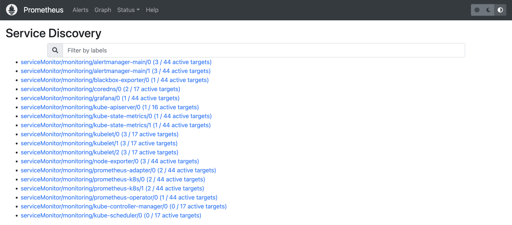

可以看到已经监控上了很多指标数据了，上面我们可以看到 Prometheus 是两个副本，我们这里通过 Service 去访问，按正常来说请求是会去轮询访问后端的两个 Prometheus 实例的，但实际上我们这里访问的时候始终是路由到后端的一个实例上去，因为这里的 Service 在创建的时候添加了 `sessionAffinity: ClientIP` 这样的属性，会根据 `ClientIP` 来做 session 亲和性，所以我们不用担心请求会到不同的副本上去：

```yaml
apiVersion: v1
kind: Service
metadata:
  labels:
    app.kubernetes.io/component: prometheus
    app.kubernetes.io/instance: k8s
    app.kubernetes.io/name: prometheus
    app.kubernetes.io/part-of: kube-prometheus
    app.kubernetes.io/version: 2.35.0
  name: prometheus-k8s
  namespace: monitoring
spec:
  ports:
    - name: web
      port: 9090
      targetPort: web
    - name: reloader-web
      port: 8080
      targetPort: reloader-web
  type: NodePort
  selector:
    app.kubernetes.io/component: prometheus
    app.kubernetes.io/instance: k8s
    app.kubernetes.io/name: prometheus
    app.kubernetes.io/part-of: kube-prometheus
  sessionAffinity: ClientIP
```

> 为什么会担心请求会到不同的副本上去呢？正常多副本应该是看成高可用的常用方案，理论上来说不同副本本地的数据是一致的，但是需要注意的是 Prometheus 的主动 Pull 拉取监控指标的方式，由于抓取时间不能完全一致，即使一致也不一定就能保证网络没什么问题，所以最终不同副本下存储的数据很大可能是不一样的，所以这里我们配置了 session 亲和性，可以保证我们在访问数据的时候始终是一致的。


## 配置

我们可以看到上面的监控指标大部分的配置都是正常的，只有两三个没有管理到对应的监控目标，比如 `kube-controller-manager` 和 `kube-scheduler` 这两个系统组件。

这其实就和 `ServiceMonitor` 的定义有关系了，我们先来查看下 kube-scheduler 组件对应的 ServiceMonitor 资源的定义，`manifests/kubernetesControlPlane-serviceMonitorKubeScheduler.yaml`：

```yaml
# kubernetesControlPlane-serviceMonitorKubeScheduler.yaml
apiVersion: monitoring.coreos.com/v1
kind: ServiceMonitor
metadata:
  labels:
    app.kubernetes.io/name: kube-scheduler
    app.kubernetes.io/part-of: kube-prometheus
  name: kube-scheduler
  namespace: monitoring
spec:
  endpoints:
    - bearerTokenFile: /var/run/secrets/kubernetes.io/serviceaccount/token
      interval: 30s # 每30s获取一次信息
      port: https-metrics # 对应 service 的端口名
      scheme: https # 注意是使用 https 协议
      tlsConfig:
        insecureSkipVerify: true # 跳过安全校验
  jobLabel: app.kubernetes.io/name # 用于从中检索任务名称的标签
  namespaceSelector: # 表示去匹配某一命名空间中的 Service，如果想从所有的namespace中匹配用any:true
    matchNames:
      - kube-system
  selector: # 匹配的 Service 的 labels，如果使用 mathLabels，则下面的所有标签都匹配时才会匹配该 service，如果使用 matchExpressions，则至少匹配一个标签的 service 都会被选择
    matchLabels:
      app.kubernetes.io/name: kube-scheduler
```

上面是一个典型的 `ServiceMonitor` 资源对象的声明方式，通过 `selector.matchLabels` 在 `kube-system` 这个命名空间下面匹配具有 `app.kubernetes.io/name=kube-scheduler` 这样的 Service，但是我们系统中根本就没有对应的 Service：

```shell
$ kubectl get svc -n kube-system -l app.kubernetes.io/name=kube-scheduler
No resources found in kube-system namespace.
```

所以我们需要去创建一个对应的 Service 对象，才能与 `ServiceMonitor` 进行关联：

```yaml
apiVersion: v1
kind: Service
metadata:
  namespace: kube-system
  name: kube-scheduler
  labels: # 必须和上面的 ServiceMonitor 下面的 matchLabels 保持一致
    app.kubernetes.io/name: kube-scheduler
spec:
  selector:
    component: kube-scheduler
  ports:
    - name: https-metrics
      port: 10259
      targetPort: 10259 # 需要注意现在版本默认的安全端口是10259
```

其中最重要的是上面 labels 和 selector 部分，labels 区域的配置必须和我们上面的 ServiceMonitor 对象中的 selector 保持一致，selector 下面配置的是 `component=kube-scheduler`，为什么会是这个 label 标签呢，我们可以去 describe 下 kube-scheduler 这个 Pod：

```shell
$ kubectl describe pod kube-scheduler-master1 -n kube-system
Name:                 kube-scheduler-master1
Namespace:            kube-system
Priority:             2000001000
Priority Class Name:  system-node-critical
Node:                 master1/192.168.0.106
Start Time:           Tue, 17 May 2022 15:15:43 +0800
Labels:               component=kube-scheduler
                      tier=control-plane
......
```

我们可以看到这个 Pod 具有 `component=kube-scheduler` 和 `tier=control-plane` 这两个标签，而前面这个标签具有更唯一的特性，所以使用前面这个标签较好，这样上面创建的 Service 就可以和我们的 Pod 进行关联了，直接应用即可：

```shell
$ kubectl apply -f manifests/kubernetesControlPlane-serviceMonitorKubeScheduler.yaml
$ kubectl get svc -n kube-system -l app.kubernetes.io/name=kube-scheduler
NAME             TYPE        CLUSTER-IP      EXTERNAL-IP   PORT(S)     AGE
kube-scheduler   ClusterIP   10.103.236.75   <none>        10259/TCP   5m9s
```

创建完成后，隔一小会儿后去 Prometheus 页面上查看 targets 下面 kube-scheduler 已经有采集的目标了，但是报了 `connect: connection refused` 这样的错误：

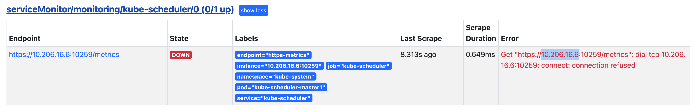

这是因为 kube-scheduler 启动的时候默认绑定的是 `127.0.0.1` 地址，所以要通过 IP 地址去访问就被拒绝了，我们可以查看 master 节点上的静态 Pod 资源清单来确认这一点：

```yaml
# /etc/kubernetes/manifests/kube-scheduler.yaml
apiVersion: v1
kind: Pod
metadata:
  creationTimestamp: null
  labels:
    component: kube-scheduler
    tier: control-plane
  name: kube-scheduler
  namespace: kube-system
spec:
  containers:
  - command:
    - kube-scheduler
    - --authentication-kubeconfig=/etc/kubernetes/scheduler.conf
    - --authorization-kubeconfig=/etc/kubernetes/scheduler.conf
    - --bind-address=127.0.0.1  # 绑定了127.0.0.1
    - --kubeconfig=/etc/kubernetes/scheduler.conf
    - --leader-elect=true
    - --port=0  # 如果为0，则不提供 HTTP 服务，--secure-port 默认值：10259，通过身份验证和授权为 HTTPS 服务的端口，如果为 0，则不提供 HTTPS。
......
```

我们可以直接将上面的 `--bind-address=127.0.0.1` 更改为 `--bind-address=0.0.0.0` 即可，更改后 kube-scheduler 会自动重启，重启完成后再去查看 Prometheus 上面的采集目标就正常了。

可以用同样的方式来修复下 kube-controller-manager 组件的监控，创建一个如下所示的 Service 对象，只是端口改成 10257：

```yaml
# kubernetesControlPlane-serviceMonitorKubeControllerManager
apiVersion: v1
kind: Service
metadata:
  namespace: kube-system
  name: kube-controller-manager
  labels:
    app.kubernetes.io/name: kube-controller-manager
spec:
  selector:
    component: kube-controller-manager
  ports:
    - name: https-metrics
      port: 10257
      targetPort: 10257 # controller-manager 的安全端口为10257
```

然后将 kube-controller-manager 静态 Pod 的资源清单文件中的参数 `--bind-address=127.0.0.1` 更改为 `--bind-address=0.0.0.0`。

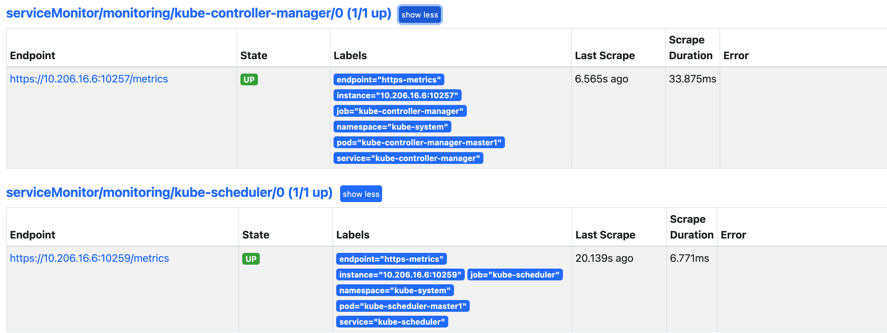

上面的监控数据配置完成后，我们就可以去查看下 Grafana 下面的监控图表了，同样使用上面的 NodePort 访问即可，第一次登录使用 `admin:admin` 登录即可，进入首页后，我们可以发现其实 Grafana 已经有很多配置好的监控图表了。

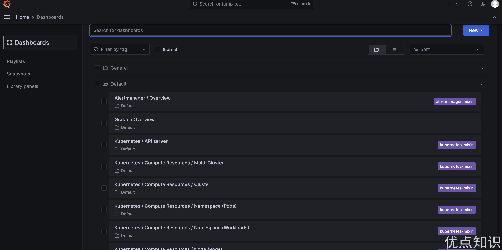

我们可以随便选择一个 Dashboard 查看监控图表信息。


接下来我们再来学习如何完全自定义一个 `ServiceMonitor` 以及其他的相关配置。

如果要清理 Prometheus-Operator，可以直接删除对应的资源清单即可：

```shell
$ kubectl delete -f manifests/
$ kubectl delete -f manifests/setup/
```


## 自定义监控报警

前面我们学习了 Prometheus Operator 的安装和基本使用方法，这节课给大家介绍如何在 `Prometheus Operator` 中添加一个自定义的监控项。

除了 Kubernetes 集群中的一些资源对象、节点以及组件需要监控，有的时候我们可能还需要根据实际的业务需求去添加自定义的监控项，添加一个自定义监控的步骤也是非常简单的。

- 第一步建立一个 ServiceMonitor 对象，用于 Prometheus 添加监控项
- 第二步为 ServiceMonitor 对象关联 metrics 数据接口的一个 Service 对象
- 第三步确保 Service 对象可以正确获取到 metrics 数据

接下来我们就来为大家演示如何添加 `etcd` 集群的监控。无论是 Kubernetes 集群外的还是使用 kubeadm 安装在集群内部的 etcd 集群，我们这里都将其视作集群外的独立集群，因为对于二者的使用方法没什么特殊之处。


### etcd 监控

由于我们这里演示环境使用的是 kubeadm 搭建的集群，我们可以使用 kubectl 工具去获取 etcd 启动的相关参数：

```shell
$ kubectl get pods -n kube-system -l component=etcd
NAME           READY   STATUS    RESTARTS       AGE
etcd-master1   1/1     Running   19 (12m ago)   11d
$ kubectl get pods etcd-master1 -n kube-system -o yaml
......
spec:
  containers:
  - command:
    - etcd
    - --advertise-client-urls=https://10.206.16.6:2379
    - --cert-file=/etc/kubernetes/pki/etcd/server.crt
    - --client-cert-auth=true
    - --data-dir=/var/lib/etcd
    - --experimental-initial-corrupt-check=true
    - --experimental-watch-progress-notify-interval=5s
    - --initial-advertise-peer-urls=https://10.206.16.6:2380
    - --initial-cluster=master1=https://10.206.16.6:2380
    - --key-file=/etc/kubernetes/pki/etcd/server.key
    - --listen-client-urls=https://127.0.0.1:2379,https://10.206.16.6:2379
    - --listen-metrics-urls=http://127.0.0.1:2381
    - --listen-peer-urls=https://10.206.16.6:2380
    - --name=master1
    - --peer-cert-file=/etc/kubernetes/pki/etcd/peer.crt
    - --peer-client-cert-auth=true
    - --peer-key-file=/etc/kubernetes/pki/etcd/peer.key
    - --peer-trusted-ca-file=/etc/kubernetes/pki/etcd/ca.crt
    - --snapshot-count=10000
    - --trusted-ca-file=/etc/kubernetes/pki/etcd/ca.crt
......
```

我们可以看到启动参数里面有一个 `--listen-metrics-urls=http://127.0.0.1:2381` 的配置，该参数就是来指定 metrics 接口运行在 2381 端口下面的，而且是 http 的协议，所以也不需要什么证书配置，这就比以前的版本要简单许多了，以前的版本需要用 https 协议访问，所以要配置对应的证书。

接下来我们直接创建对应的 ServiceMonitor 对象即可:

```yaml
# kubernetesControlPlane-serviceMonitorEtcd.yaml
apiVersion: monitoring.coreos.com/v1
kind: ServiceMonitor
metadata:
  name: etcd-k8s
  namespace: monitoring
  labels:
    k8s-app: etcd
spec:
  jobLabel: k8s-app
  endpoints:
    - port: metrics
      interval: 30s
  selector:
    matchLabels:
      k8s-app: etcd
  namespaceSelector:
    matchNames:
      - kube-system
```

上面我们在 monitoring 命名空间下面创建了名为 etcd-k8s 的 ServiceMonitor 对象，基本属性和前面章节中的一致，匹配 kube-system 这个命名空间下面的具有 `k8s-app=etcd` 这个 label 标签的 Service，`jobLabel` 表示用于检索 job 任务名称的标签，由于 etcd 的 metrics 接口在 2381 端口下面，不需要 https 安全认证，所以用默认的配置即可。关于 ServiceMonitor 更多的配置属性，可以参考[官方的 API 文档](https://github.com/coreos/prometheus-operator/blob/master/Documentation/api.md#servicemonitorspec)的描述。

然后我们直接创建这个 ServiceMonitor 对象即可：

```shell
$ kubectl apply -f kubernetesControlPlane-serviceMonitorEtcd.yaml
```

但实际上现在并不能监控到 etcd 集群，因为并没有一个满足 ServiceMonitor 条件的 Service 对象与之关联：

```shell
$ kubectl get svc -n kube-system -l k8s-app=etcd
No resources found.
```

所以接下来我们需要创建一个满足上面条件的 Service 对象，由于我们把 etcd 当成是集群外部的服务，所以要引入到集群中来我们就需要自定义 Endpoints 对象来创建 Service 对象了：

```yaml
apiVersion: v1
kind: Service
metadata:
  name: etcd-k8s
  namespace: kube-system
  labels: # 用于匹配ServiceMonitor资源对象的selector下面的标签
    k8s-app: etcd
spec:
  clusterIP: None # 自定义Endpoints的话一定要把Service的类型设置为None
  ports:
    - name: metrics
      port: 2381
      targetPort: 2381

# 要把k8s集群外部的服务引入到Service中来，是不是就要去做自定义的Endpoints资源对象呢？
---
apiVersion: v1
kind: Endpoints
metadata:
  name: etcd-k8s
  namespace: kube-system
  labels:
    k8s-app: etcd
subsets:
  - addresses:
      - ip: 10.206.16.6
        nodeName: k8s-master1
      # 如果还有其他外部的etcd节点，可以继续添加
    ports:
      - name: metrics
        port: 2381
```

我们这里创建的 Service 没有采用前面通过 label 标签的形式去匹配 Pod 的做法，因为前面我们说过很多时候我们创建的 etcd 集群是独立于集群之外的，这种情况下面我们就需要自定义一个 Endpoints，要注意 `metadata` 区域的内容要和 Service 保持一致，Service 的 clusterIP 设置为 None，新版本的 etcd 将 metrics 接口数据放置到了 2381 端口。直接创建该资源对象即可：

```shell
$ kubectl apply -f etcd-service.yaml
$ kubectl get svc -n kube-system -l k8s-app=etcd
NAME       TYPE        CLUSTER-IP   EXTERNAL-IP   PORT(S)    AGE
etcd-k8s   ClusterIP   None         <none>        2381/TCP   2d20h
```

创建完成后，隔一会儿去 Prometheus 的 Dashboard 中查看 targets，便会有 etcd 的监控项了：

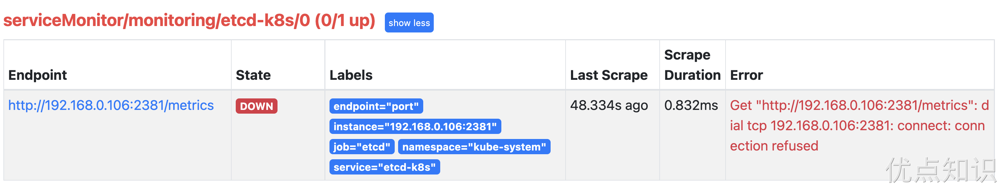

可以看到有一个明显的错误，2381 端口链接被拒绝，这是因为我们这里的 etcd 的 metrics 接口是监听在 `127.0.0.1` 这个 IP 上面的，所以访问会拒绝：

```shell
--listen-metrics-urls=http://127.0.0.1:2381
```

我们只需要在 `/etc/kubernetes/manifest/` 目录下面（静态 Pod 默认的目录）的 `etcd.yaml` 文件中将上面的`listen-metrics-urls` 更改成节点 IP 即可：

```shell
--listen-metrics-urls=http://0.0.0.0:2381
```

当 etcd 重启生效后，查看 etcd 这个监控任务就正常了：

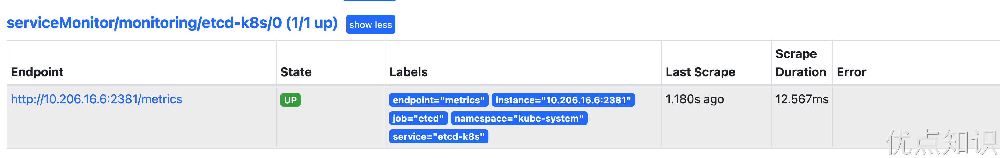

数据采集到后，可以在 grafana 中导入编号为 `3070` 的 dashboard，就可以获取到 etcd 的监控图表：

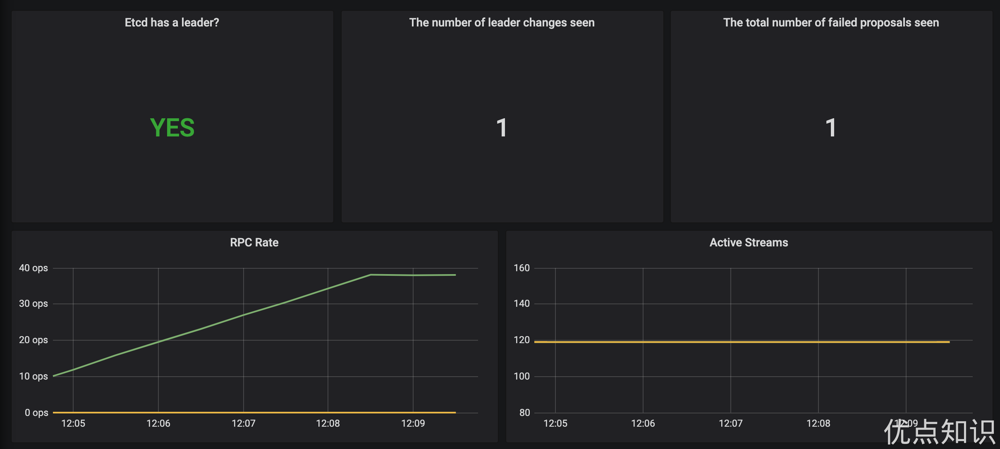


### 配置 PrometheusRule

现在我们知道怎么自定义一个 `ServiceMonitor` 对象了，但是如果需要自定义一个报警规则的话呢？我们去查看 Prometheus Dashboard 的 Alert 页面下面就已经有很多报警规则了，这一系列的规则其实都来自于项目 [https://github.com/kubernetes-monitoring/kubernetes-mixin](https://github.com/kubernetes-monitoring/kubernetes-mixin)，我们都通过 Prometheus Operator 安装配置上了。

但是这些报警信息是哪里来的呢？他们应该用怎样的方式通知我们呢？我们知道之前我们使用自定义的方式可以在 Prometheus 的配置文件之中指定 AlertManager 实例和 报警的 rules 文件，现在我们通过 Operator 部署的呢？我们可以在 Prometheus Dashboard 的 Config 页面下面查看关于 AlertManager 的配置：

```yaml
alerting:
  alert_relabel_configs:
    - separator: ;
      regex: prometheus_replica
      replacement: $1
      action: labeldrop
  alertmanagers:
    - follow_redirects: true
      enable_http2: true
      scheme: http
      path_prefix: /
      timeout: 10s
      api_version: v2
      relabel_configs:
        - source_labels: [__meta_kubernetes_service_name]
          separator: ;
          regex: alertmanager-main
          replacement: $1
          action: keep
        - source_labels: [__meta_kubernetes_endpoint_port_name]
          separator: ;
          regex: web
          replacement: $1
          action: keep
      kubernetes_sd_configs:
        - role: endpoints
          kubeconfig_file: ""
          follow_redirects: true
          enable_http2: true
          namespaces:
            own_namespace: false
            names:
              - monitoring
rule_files:
  - /etc/prometheus/rules/prometheus-k8s-rulefiles-0/*.yaml
```

上面 `alertmanagers` 的配置我们可以看到是通过 role 为 `endpoints` 的 kubernetes 的自动发现机制获取的，匹配的是服务名为 `alertmanager-main`，端口名为 `web` 的 Service 服务，我们可以查看下 `alertmanager-main` 这个 Service：

```shell
$ kubectl describe svc alertmanager-main -n monitoring
Name:                     alertmanager-main
Namespace:                monitoring
Labels:                   app.kubernetes.io/component=alert-router
                          app.kubernetes.io/instance=main
                          app.kubernetes.io/name=alertmanager
                          app.kubernetes.io/part-of=kube-prometheus
                          app.kubernetes.io/version=0.24.0
Annotations:              <none>
Selector:                 app.kubernetes.io/component=alert-router,app.kubernetes.io/instance=main,app.kubernetes.io/name=alertmanager,app.kubernetes.io/part-of=kube-prometheus
Type:                     NodePort
IP Family Policy:         SingleStack
IP Families:              IPv4
IP:                       10.109.67.21
IPs:                      10.109.67.21
Port:                     web  9093/TCP
TargetPort:               web/TCP
NodePort:                 web  32033/TCP
Endpoints:                10.244.1.193:9093,10.244.2.208:9093,10.244.2.210:9093
Port:                     reloader-web  8080/TCP
TargetPort:               reloader-web/TCP
NodePort:                 reloader-web  30181/TCP
Endpoints:                10.244.1.193:8080,10.244.2.208:8080,10.244.2.210:8080
Session Affinity:         ClientIP
External Traffic Policy:  Cluster
Events:                   <none>
```

可以看到服务名正是 `alertmanager-main`，Port 定义的名称也是 `web`，符合上面的规则，所以 Prometheus 和 AlertManager 组件就正确关联上了。而对应的报警规则文件位于：`/etc/prometheus/rules/prometheus-k8s-rulefiles-0/` 目录下面所有的 YAML 文件。我们可以进入 Prometheus 的 Pod 中验证下该目录下面是否有 YAML 文件：

```shell
$ kubectl exec -it prometheus-k8s-0 -n monitoring -- /bin/sh
/prometheus $
/prometheus $ ls /etc/prometheus/rules/prometheus-k8s-rulefiles-0/
monitoring-alertmanager-main-rules-dc3df300-1f19-4d1d-9103-c28f14b32bbb.yaml
monitoring-grafana-rules-e0efd9d6-68d9-4e7e-b88e-3bc9ee17c5e8.yaml
monitoring-kube-prometheus-rules-175c6f52-2005-4d3c-953d-a90812bed393.yaml
monitoring-kube-state-metrics-rules-606e0060-3725-4cc3-a525-1c11b3acc6ad.yaml
monitoring-kubernetes-monitoring-rules-27e4be68-acc1-411d-9d2d-0a2a649b973d.yaml
monitoring-node-exporter-rules-0057b6eb-40bf-4201-9e11-b99eea980bb2.yaml
monitoring-prometheus-k8s-prometheus-rules-13ac56da-1ce8-4c5e-afe8-0c36b7a34385.yaml
monitoring-prometheus-operator-rules-5ebcdd26-4170-4b05-b684-b953868964f1.yaml
/prometheus $ cat /etc/prometheus/rules/prometheus-k8s-rulefiles-0/monitoring-prometheus-k8s-prometheus-rules-13ac56da-1ce8-4c5e-afe
8-0c36b7a34385.yaml
d393.yaml
groups:
- name: prometheus
  rules:
  - alert: PrometheusBadConfig
    annotations:
      description: Prometheus {{$labels.namespace}}/{{$labels.pod}} has failed to
        reload its configuration.
      runbook_url: https://runbooks.prometheus-operator.dev/runbooks/prometheus/prometheusbadconfig
      summary: Failed Prometheus configuration reload.
    expr: |
      # Without max_over_time, failed scrapes could create false negatives, see
      # https://www.robustperception.io/alerting-on-gauges-in-prometheus-2-0 for details.
      max_over_time(prometheus_config_last_reload_successful{job="prometheus-k8s",namespace="monitoring"}[5m]) == 0
    for: 10m
    labels:
      severity: critical
......
```

这个 YAML 文件实际上就是我们之前创建的一个 `PrometheusRule` 文件包含的内容：

```shell
$ cat kubePrometheus-prometheusRule.yaml
apiVersion: monitoring.coreos.com/v1
kind: PrometheusRule
metadata:
  labels:
    app.kubernetes.io/component: prometheus
    app.kubernetes.io/instance: k8s
    app.kubernetes.io/name: prometheus
    app.kubernetes.io/part-of: kube-prometheus
    app.kubernetes.io/version: 2.45.0
    prometheus: k8s
    role: alert-rules
  name: prometheus-k8s-prometheus-rules
  namespace: monitoring
spec:
  groups:
  - name: prometheus
    rules:
    - alert: PrometheusBadConfig
      annotations:
        description: Prometheus {{$labels.namespace}}/{{$labels.pod}} has failed to
          reload its configuration.
        runbook_url: https://runbooks.prometheus-operator.dev/runbooks/prometheus/prometheusbadconfig
        summary: Failed Prometheus configuration reload.
      expr: |
        # Without max_over_time, failed scrapes could create false negatives, see
        # https://www.robustperception.io/alerting-on-gauges-in-prometheus-2-0 for details.
        max_over_time(prometheus_config_last_reload_successful{job="prometheus-k8s",namespace="monitoring"}[5m]) == 0
      for: 10m
      labels:
        severity: critical
......
```

我们这里的 `PrometheusRule` 的 name 为 `prometheus-k8s-prometheus-rules`，namespace 为 `monitoring`，我们可以猜想到我们创建一个 PrometheusRule 资源对象后，会自动在上面的 `prometheus-k8s-rulefiles-0` 目录下面生成一个对应的 `<namespace>-<name>-<xxx-id>.yaml` 文件，所以如果以后我们需要自定义一个报警选项的话，只需要定义一个 `PrometheusRule` 资源对象即可。至于为什么 Prometheus 能够识别这个 PrometheusRule 资源对象呢？这就需要查看我们创建的 prometheus 这个资源对象了，里面有非常重要的一个属性 `ruleSelector`，用来匹配 rule 规则的过滤器，我们这里没有过滤，所以可以匹配所有的，假设要求匹配具有 `prometheus=k8s` 和 `role=alert-rules` 标签的 `PrometheusRule` 资源对象，则可以添加下面的配置：

```yaml
ruleSelector:
  matchLabels:
    prometheus: k8s
    role: alert-rules
```

所以我们要想自定义一个报警规则，只需要创建一个能够被 prometheus 对象匹配的 `PrometheusRule` 对象即可，比如现在我们添加一个 etcd 是否可用的报警，我们知道 etcd 整个集群有一半以上的节点可用的话集群就是可用的，所以我们判断如果不可用的 etcd 数量超过了一半那么就触发报警，创建文件 `prometheus-etcdRules.yaml`：

```yaml
apiVersion: monitoring.coreos.com/v1
kind: PrometheusRule
metadata:
  name: etcd-k8s
  namespace: kube-system
  labels:
    k8s-app: etcd
spec:
  groups:
    - name: etcd
      rules:
        - alert: EtcdNoLeader
          expr: |
            etcd_server_has_leader{job="etcd"} == 0
          for: 1m
          labels:
            severity: critical
          annotations:
            summary: "Etcd No Leader (instance {{ $labels.instance }})"
            description: "Etcd instance {{ $labels.instance }} has no leader."
```

创建完成后，隔一会儿再去容器中查看下 rules 文件夹：

```shell
$ kubectl apply -f prometheus-etcdRules.yaml
prometheusrule.monitoring.coreos.com/etcd-k8s created
$ kubectl exec -it prometheus-k8s-0 /bin/sh -n monitoring
Defaulting container name to prometheus.
Use 'kubectl describe pod/prometheus-k8s-0 -n monitoring' to see all of the containers in this pod.
/prometheus $ ls /etc/prometheus/rules/prometheus-k8s-rulefiles-0/
kube-system-etcd-k8s-2bcfb2ba-2933-484f-8dee-0627b4796932.yaml
```

可以看到我们创建的 rule 文件已经被注入到了对应的 `rulefiles` 文件夹下面了，证明我们上面的设想是正确的。然后再去 Prometheus Dashboard 的 Alert 页面下面就可以查看到上面我们新建的报警规则了：

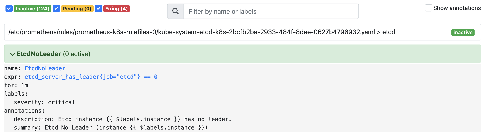


### 配置报警

我们知道了如何去添加一个报警规则配置项，但是这些报警信息用怎样的方式去发送呢？前面的课程中我们知道我们可以通过 AlertManager 的配置文件去配置各种报警接收器，现在我们是通过 Operator 提供的 alertmanager 资源对象创建的组件，应该怎样去修改配置呢？

首先我们去 Alertmanager 的页面上 `status` 路径下面查看 AlertManager 的配置信息:

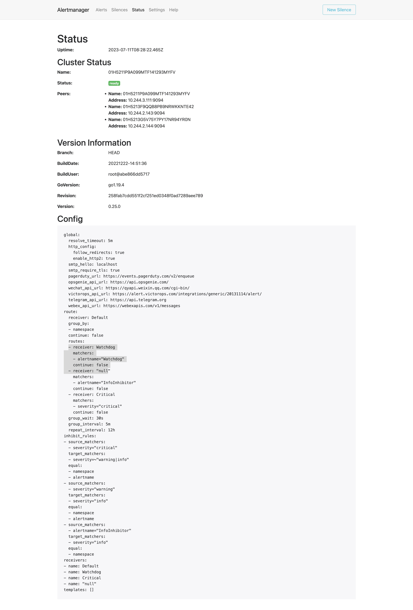

这些配置信息实际上是来自于 Prometheus-Operator 自动创建的名为 `alertmanager-main-generated` 的 Secret 对象：

```shell
$ kubectl get secret alertmanager-main-generated -n monitoring -o json | jq -r '.data."alertmanager.yaml"' | base64 --decode
"global":
  "resolve_timeout": "5m"
"inhibit_rules":
- "equal":
  - "namespace"
  - "alertname"
  "source_matchers":
  - "severity = critical"
  "target_matchers":
  - "severity =~ warning|info"
- "equal":
  - "namespace"
  - "alertname"
  "source_matchers":
  - "severity = warning"
  "target_matchers":
  - "severity = info"
- "equal":
  - "namespace"
  "source_matchers":
  - "alertname = InfoInhibitor"
  "target_matchers":
  - "severity = info"
"receivers":
- "name": "Default"
- "name": "Watchdog"
- "name": "Critical"
- "name": "null"
"route":
  "group_by":
  - "namespace"
  "group_interval": "5m"
  "group_wait": "30s"
  "receiver": "Default"
  "repeat_interval": "12h"
  "routes":
  - "matchers":
    - "alertname = Watchdog"
    "receiver": "Watchdog"
  - "matchers":
    - "alertname = InfoInhibitor"
    "receiver": "null"
  - "matchers":
    - "severity = critical"
    "receiver": "Critical"
```

我们可以看到内容和上面查看的配置信息是一致的，所以如果我们想要添加自己的接收器，我们就可以直接更改这个文件，但是这里的内容是 base64 编码过后的，如果手动添加内容就非常不方便，为此 Prometheus-Operator 新增了一个 `AlertmanagerConfig` 的 CRD，比如我们将 `Critical` 这个接收器的报警信息都发送到钉钉进行报警。

首先在 monitoring 命名空间下面部署一个简单的钉钉 webhook 处理器，前面 Alertmanager 章节已经学习过，这里就不赘述了。

然后新建一个 `AlertmanagerConfig` 类型的资源对象，可以通过 `kubectl explain alertmanagerconfig` 或者[在线 API 文档](https://github.com/prometheus-operator/prometheus-operator/blob/master/Documentation/user-guides/alerting.md)来查看字段的含义

```yaml
# alertmanager-config.yaml
apiVersion: monitoring.coreos.com/v1alpha1
kind: AlertmanagerConfig
metadata:
  name: dinghook
  namespace: monitoring
  labels: # 必须要有这个标签，用于关联Alertmanager资源对象
    alertmanager: main
spec:
  route:
    groupBy: ["alertname"]
    groupWait: 30s
    groupInterval: 5m
    repeatInterval: 12h
    receiver: demo
    routes:
      - receiver: demo
        match: alertname="Watchdog"
  receivers:
    - name: "demo"
      webhookConfigs:
        - url: "http://dingtalk-webhook.monitor.svc.cluster.local:8000/alertmanager/webhook"
          sendResolved: true
```

不过如果直接创建上面的配置是不会生效的，我们需要添加一个 Label 标签，并在 Alertmanager 的资源对象中通过标签来关联上面的这个对象，比如我们这里新增了一个 Label 标签：`alertmanagerConfig: main`，然后需要重新更新 Alertmanager 对象，添加 `alertmanagerConfigSelector` 属性去匹配 `AlertmanagerConfig` 资源对象：

```yaml
# alertmanager-alertmanager.yaml
apiVersion: monitoring.coreos.com/v1
kind: Alertmanager
metadata:
  labels:
    alertmanager: main
  name: main
  namespace: monitoring
spec:
  # ... 省略其他
  alertmanagerConfigSelector: # 匹配 AlertmanagerConfig 的标签
    matchLabels:
      alertmanagerConfig: main
```

现在我们重新更新上面的资源对象：

```shell
kubectl apply -f alertmanager-config.yaml
kubectl apply -f alertmanager-alertmanager.yaml
```

更新完成后默认的配置会和我们创建的配置进行合并，我们可以重新查看生成的 Secret 资源对象内容，也可以直接查看 Alertmanager 的 WEB UI 界面的配置内容：


可以看到我们在 AlertmanagerConfig 里面定义的名为 `Critical` 的 Receiver，在最终生成的配置中名称了 `monitoring-dinghook-Critical`，格式为 `<namespace>-<name>-<receiver name>`。

到这里我们就完成了 Prometheus Operator 的自定义监控和报警。


## 高级配置

前面我们一起学习了如何在 Prometheus Operator 下面自定义一个监控项，以及自定义报警规则的使用。那么我们还能够直接使用前面课程中的自动发现功能吗？如果在我们的 Kubernetes 集群中有了很多的 Service/Pod，那么我们都需要一个一个的去建立一个对应的 `ServiceMonitor` 或 `PodMonitor` 对象来进行监控吗？这样岂不是又变得麻烦起来了？


### 自动发现配置

为解决上面的问题，Prometheus Operator 为我们提供了一个额外的抓取配置来解决这个问题，我们可以通过添加额外的配置来进行服务发现进行自动监控。和前面自定义的方式一样，我们可以在 Prometheus Operator 当中去自动发现并监控具有 `prometheus.io/scrape=true` 这个 `annotations` 的 Service，之前我们定义的 Prometheus 的配置如下：

```yaml
- job_name: "endpoints"
  kubernetes_sd_configs:
    - role: endpoints
  relabel_configs: # 指标采集之前或采集过程中去重新配置
    - source_labels: [__meta_kubernetes_service_annotation_prometheus_io_scrape]
      action: keep # 保留具有 prometheus.io/scrape=true 这个注解的Service
      regex: true
    - source_labels: [__meta_kubernetes_service_annotation_prometheus_io_path]
      action: replace
      target_label: __metrics_path__
      regex: (.+)
    - source_labels:
        [__address__, __meta_kubernetes_service_annotation_prometheus_io_port]
      action: replace
      target_label: __address__
      regex: ([^:]+)(?::\d+)?;(\d+) # RE2 正则规则，+是一次多多次，?是0次或1次，其中?:表示非匹配组(意思就是不获取匹配结果)
      replacement: $1:$2
    - source_labels: [__meta_kubernetes_service_annotation_prometheus_io_scheme]
      action: replace
      target_label: __scheme__
      regex: (https?)
    - action: labelmap
      regex: __meta_kubernetes_service_label_(.+)
      replacement: $1
    - source_labels: [__meta_kubernetes_namespace]
      action: replace
      target_label: kubernetes_namespace
    - source_labels: [__meta_kubernetes_service_name]
      action: replace
      target_label: kubernetes_service
    - source_labels: [__meta_kubernetes_pod_name]
      action: replace
      target_label: kubernetes_pod
    - source_labels: [__meta_kubernetes_node_name]
      action: replace
      target_label: kubernetes_node
```

如果你对上面这个配置还不是很熟悉的话，建议去查看下前面关于 Kubernetes 常用资源对象监控章节的介绍，要想自动发现集群中的 Service，就需要我们在 Service 的 annotation 区域添加 `prometheus.io/scrape=true` 的声明，将上面文件直接保存为 `prometheus-additional.yaml`，然后通过这个文件创建一个对应的 Secret 对象：

```shell
$ kubectl create secret generic additional-configs --from-file=prometheus-additional.yaml -n monitoring
secret "additional-configs" created
```

然后我们需要在声明 prometheus 的资源对象文件中通过 `additionalScrapeConfigs` 属性添加上这个额外的配置：

```yaml
# prometheus-prometheus.yaml
apiVersion: monitoring.coreos.com/v1
kind: Prometheus
metadata:
  name: k8s
  namespace: monitoring
spec:
  # ...... 省略其他
  additionalScrapeConfigs:
    name: additional-configs
    key: prometheus-additional.yaml
```

关于 `additionalScrapeConfigs` 属性的具体介绍，我们可以使用 `kubectl explain` 命令来了解详细信息：

```shell
$ kubectl explain prometheus.spec.additionalScrapeConfigs
KIND:     Prometheus
VERSION:  monitoring.coreos.com/v1

RESOURCE: additionalScrapeConfigs <Object>

DESCRIPTION:
     AdditionalScrapeConfigs allows specifying a key of a Secret containing
     additional Prometheus scrape configurations. Scrape configurations
     specified are appended to the configurations generated by the Prometheus
     Operator. Job configurations specified must have the form as specified in
     the official Prometheus documentation:
     https://prometheus.io/docs/prometheus/latest/configuration/configuration/#scrape_config.
     As scrape configs are appended, the user is responsible to make sure it is
     valid. Note that using this feature may expose the possibility to break
     upgrades of Prometheus. It is advised to review Prometheus release notes to
     ensure that no incompatible scrape configs are going to break Prometheus
     after the upgrade.

FIELDS:
   key  <string> -required-
     The key of the secret to select from. Must be a valid secret key.

   name <string>
     Name of the referent. More info:
     https://kubernetes.io/docs/concepts/overview/working-with-objects/names/#names
     TODO: Add other useful fields. apiVersion, kind, uid?

   optional     <boolean>
     Specify whether the Secret or its key must be defined
```

添加完成后，直接更新 prometheus 这个 CRD 资源对象即可：

```shell
$ kubectl apply -f prometheus-prometheus.yaml
prometheus.monitoring.coreos.com "k8s" configured
```

隔一小会儿，可以前往 Prometheus 的 Dashboard 中查看配置已经生效了：

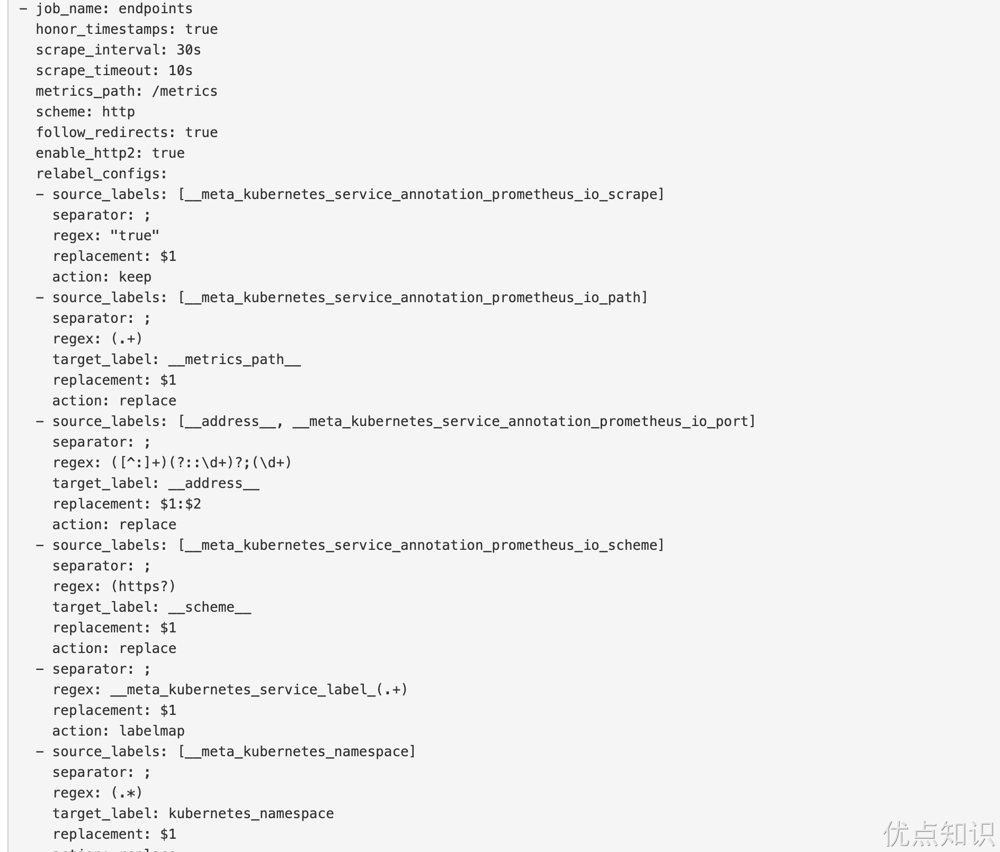

但是我们切换到 targets 页面下面却并没有发现对应的监控任务，查看 Prometheus 的 Pod 日志：

```shell
$ kubectl logs -f prometheus-k8s-0 prometheus -n monitoring
......
ts=2022-05-26T09:34:30.845Z caller=klog.go:108 level=warn component=k8s_client_runtime func=Warningf msg="pkg/mod/k8s.io/client-go@v0.23.5/tools/cache/reflector.go:167: failed to list *v1.Service: services is forbidden: User \"system:serviceaccount:monitoring:prometheus-k8s\" cannot list resource \"services\" in API group \"\" at the cluster scope"
ts=2022-05-26T09:34:30.845Z caller=klog.go:116 level=error component=k8s_client_runtime func=ErrorDepth msg="pkg/mod/k8s.io/client-go@v0.23.5/tools/cache/reflector.go:167: Failed to watch *v1.Service: failed to list *v1.Service: services is forbidden: User \"system:serviceaccount:monitoring:prometheus-k8s\" cannot list resource \"services\" in API group \"\" at the cluster scope"
ts=2022-05-26T09:34:40.552Z caller=klog.go:108 level=warn component=k8s_client_runtime func=Warningf msg="pkg/mod/k8s.io/client-go@v0.23.5/tools/cache/reflector.go:167: failed to list *v1.Pod: pods is forbidden: User \"system:serviceaccount:monitoring:prometheus-k8s\" cannot list resource \"pods\" in API group \"\" at the cluster scope"
ts=2022-05-26T09:34:40.552Z caller=klog.go:116 level=error component=k8s_client_runtime func=ErrorDepth msg="pkg/mod/k8s.io/client-go@v0.23.5/tools/cache/reflector.go:167: Failed to watch *v1.Pod: failed to list *v1.Pod: pods is forbidden: User \"system:serviceaccount:monitoring:prometheus-k8s\" cannot list resource \"pods\" in API group \"\" at the cluster scope"
```

可以看到有很多错误日志出现，都是 `xxx is forbidden`，这说明是 RBAC 权限的问题，通过 prometheus 资源对象的配置可以知道 Prometheus 绑定了一个名为 `prometheus-k8s` 的 ServiceAccount 对象，而这个对象绑定的是一个名为 `prometheus-k8s` 的 ClusterRole：

```yaml
# prometheus-clusterRole.yaml
apiVersion: rbac.authorization.k8s.io/v1
kind: ClusterRole
metadata:
  name: prometheus-k8s
rules:
  - apiGroups:
      - ""
    resources:
      - nodes/metrics
    verbs:
      - get
  - nonResourceURLs:
      - /metrics
    verbs:
      - get
```

上面的权限规则中我们可以看到明显没有对 Service 或者 Pod 的 `list` 权限，所以报错了，要解决这个问题，我们只需要添加上需要的权限即可：

```yaml
apiVersion: rbac.authorization.k8s.io/v1
kind: ClusterRole
metadata:
  name: prometheus-k8s
rules:
  - apiGroups:
      - ""
    resources:
      - nodes
      - services
      - endpoints
      - pods
      - nodes/proxy
    verbs:
      - get
      - list
      - watch
  - apiGroups:
      - ""
    resources:
      - configmaps
      - nodes/metrics
    verbs:
      - get
  - nonResourceURLs:
      - /metrics
    verbs:
      - get
```

更新上面的 `ClusterRole` 这个资源对象，然后重建下 Prometheus 的所有 Pod，正常就可以看到 targets 页面下面有 `endpoints` 这个监控任务了：

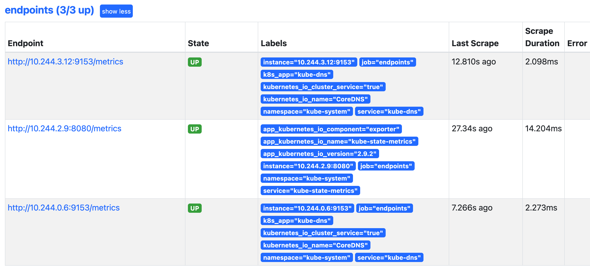

这里发现的几个抓取目标是因为 Service 中都有 `prometheus.io/scrape=true` 这个 annotation。

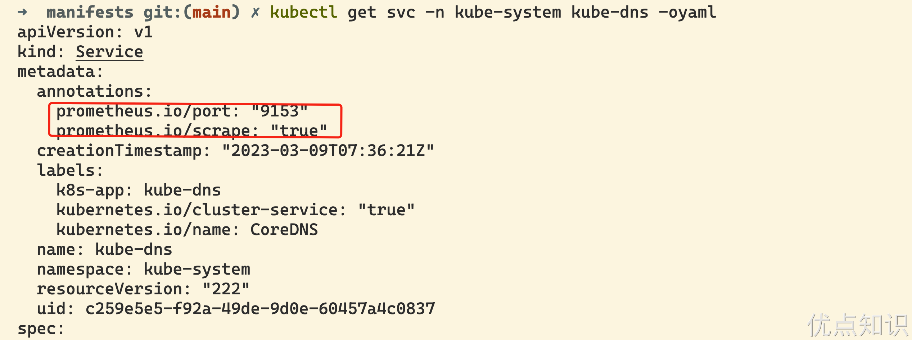


### 数据持久化

上面我们在修改完权限的时候，重启了 Prometheus 的 Pod，如果我们仔细观察的话会发现我们之前采集的数据已经没有了，这是因为我们通过 prometheus 这个 CRD 创建的 Prometheus 并没有做数据的持久化，我们可以直接查看生成的 Prometheus Pod 的挂载情况就清楚了：

```shell
$ kubectl get pod prometheus-k8s-0 -n monitoring -o yaml
......
    volumeMounts:
    - mountPath: /prometheus
      name: prometheus-k8s-db
......
  volumes:
......
  - emptyDir: {}
    name: prometheus-k8s-db
......
```

我们可以看到 Prometheus 的数据目录 `/prometheus` 实际上是通过 `emptyDir` 进行挂载的，我们知道 emptyDir 挂载的数据的生命周期和 Pod 生命周期一致的，所以如果 Pod 挂掉了，数据也就丢失了，这也就是为什么我们重建 Pod 后之前的数据就没有了的原因，对应线上的监控数据肯定需要做数据的持久化的，同样的 prometheus 这个 CRD 资源也为我们提供了数据持久化的配置方法，由于我们的 Prometheus 最终是通过 Statefulset 控制器进行部署的，所以我们这里通过 `StorageClass` 来做数据持久化，此外由于 Prometheus 本身对 NFS 存储没有做相关的支持，所以线上一定**不要用 NFS 来做数据持久化**，对于如何去为 prometheus 这个 CRD 对象配置存储数据，我们可以去查看官方文档 API，也可以用 `kubectl explain` 命令去了解：

```shell
$ kubectl explain prometheus.spec.storage
KIND:     Prometheus
VERSION:  monitoring.coreos.com/v1

RESOURCE: storage <Object>

DESCRIPTION:
     Storage spec to specify how storage shall be used.

FIELDS:
   disableMountSubPath  <boolean>
     Deprecated: subPath usage will be disabled by default in a future release,
     this option will become unnecessary. DisableMountSubPath allows to remove
     any subPath usage in volume mounts.

   emptyDir     <Object>
     EmptyDirVolumeSource to be used by the Prometheus StatefulSets. If
     specified, used in place of any volumeClaimTemplate. More info:
     https://kubernetes.io/docs/concepts/storage/volumes/#emptydir

   ephemeral    <Object>
     EphemeralVolumeSource to be used by the Prometheus StatefulSets. This is a
     beta field in k8s 1.21, for lower versions, starting with k8s 1.19, it
     requires enabling the GenericEphemeralVolume feature gate. More info:
     https://kubernetes.io/docs/concepts/storage/ephemeral-volumes/#generic-ephemeral-volumes

   volumeClaimTemplate  <Object>
     A PVC spec to be used by the Prometheus StatefulSets.
```

所以我们在 prometheus 的 CRD 对象中通过 `storage` 属性配置 `volumeClaimTemplate` 对象即可：

```yaml
# prometheus-prometheus.yaml
......
storage:
  volumeClaimTemplate:
    spec:
      storageClassName: local-path # 指定一个可用的 storageclass
      resources:
        requests:
          storage: 20Gi
```

然后更新 prometheus 这个 CRD 资源，更新完成后会自动生成两个 PVC 和 PV 资源对象：

```shell
$ kubectl apply -f prometheus-prometheus.yaml
prometheus.monitoring.coreos.com/k8s configured
$ kubectl get pvc -n monitoring
NAME                                 STATUS   VOLUME                                     CAPACITY   ACCESS MODES   STORAGECLASS   AGE
prometheus-k8s-db-prometheus-k8s-0   Bound    pvc-4c67d0a9-e97c-4820-9c66-340a7da3c53f   20Gi       RWO            local-path     4s
prometheus-k8s-db-prometheus-k8s-1   Bound    pvc-6f26e85c-01c6-483c-9d42-55166f77e5d0   20Gi       RWO            local-path     4s
$ kubectl get pv |grep monitoring
pvc-4c67d0a9-e97c-4820-9c66-340a7da3c53f   20Gi       RWO            Delete           Bound    monitoring/prometheus-k8s-db-prometheus-k8s-0                       local-path               17s
pvc-6f26e85c-01c6-483c-9d42-55166f77e5d0   20Gi       RWO            Delete           Bound    monitoring/prometheus-k8s-db-prometheus-k8s-1                       local-path               17s
```

现在我们再去看 Prometheus Pod 的数据目录就可以看到是关联到一个 PVC 对象上了：

```shell
$ kubectl get pod prometheus-k8s-0 -n monitoring -o yaml
......
    volumeMounts:
    - mountPath: /prometheus
      name: prometheus-k8s-db
......
  volumes:
  - name: prometheus-k8s-db
    persistentVolumeClaim:
      claimName: prometheus-k8s-db-prometheus-k8s-0
......
```

现在即使我们的 Pod 挂掉了，数据也不会丢失了。到这里 Prometheus Operator 的一些基本配置就算完成了，对于大型的监控集群还需要做一些其他配置，比如实现数据的远程存储。

关于 Prometheus Operator 的其他高级用法可以参考官方文档 [https://prometheus-operator.dev](https://prometheus-operator.dev) 了解更多信息。


> 原文: <https://www.yuque.com/cnych/k8s4/uhyml1qm397x6qxs>