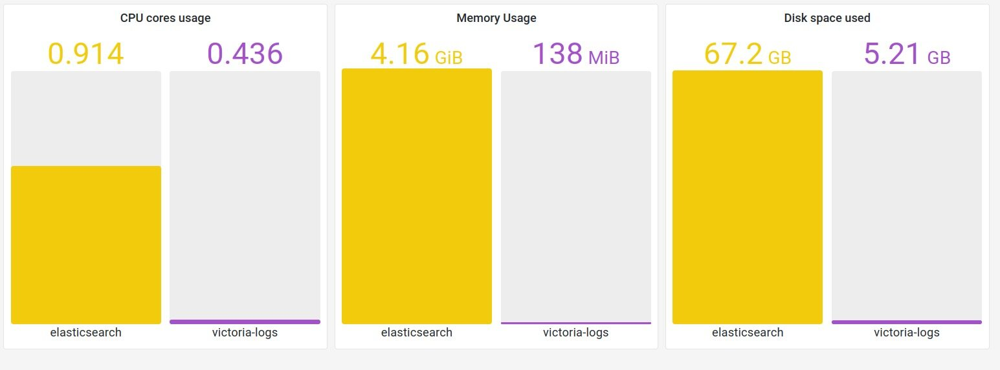
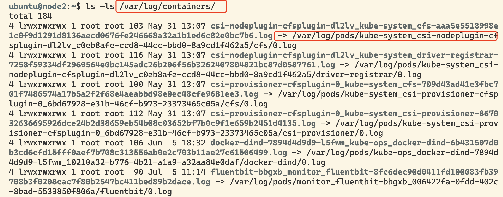
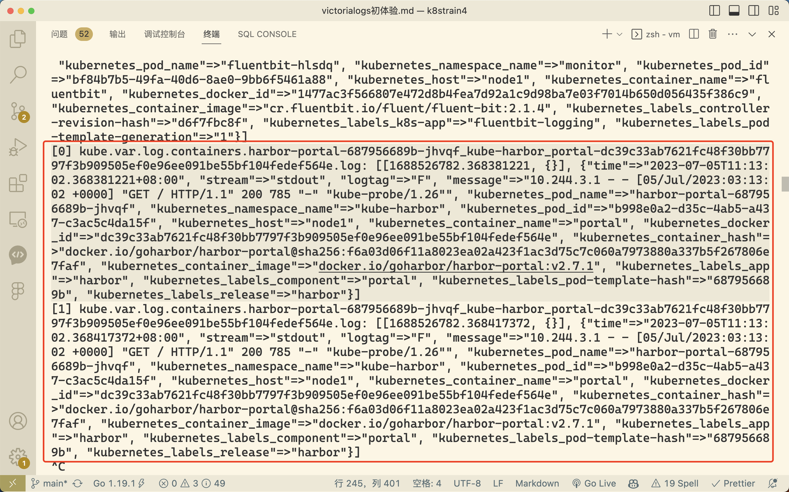
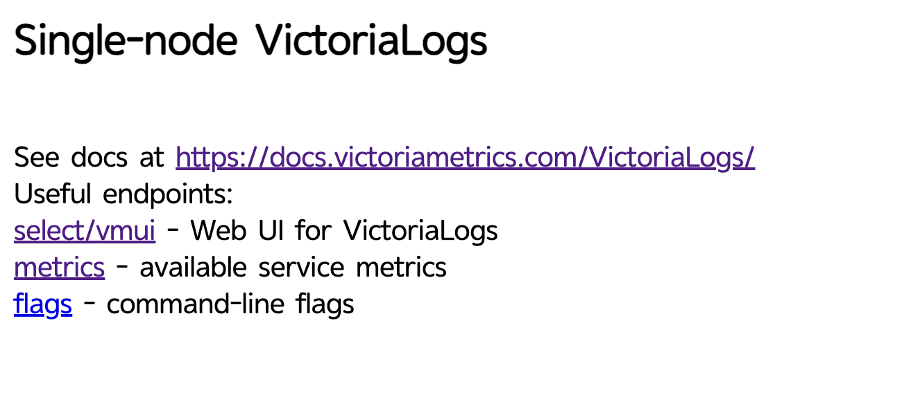
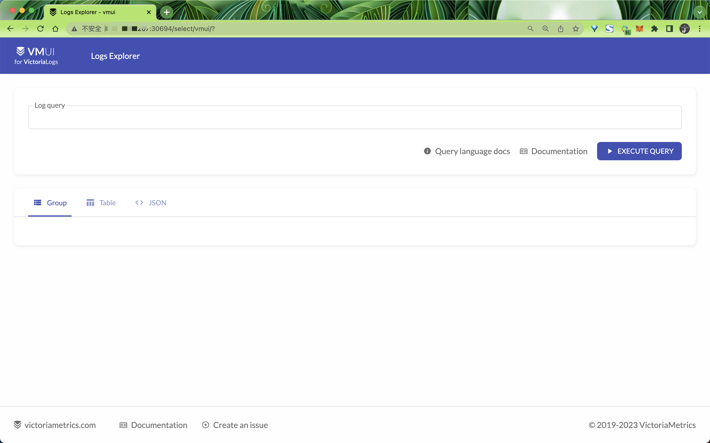
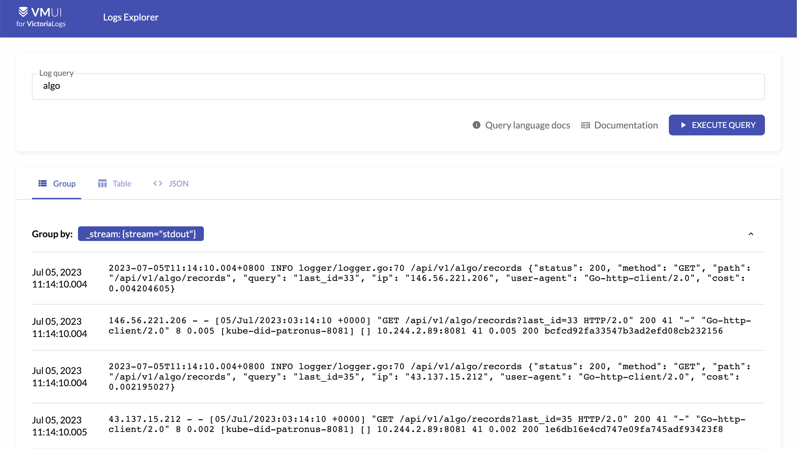
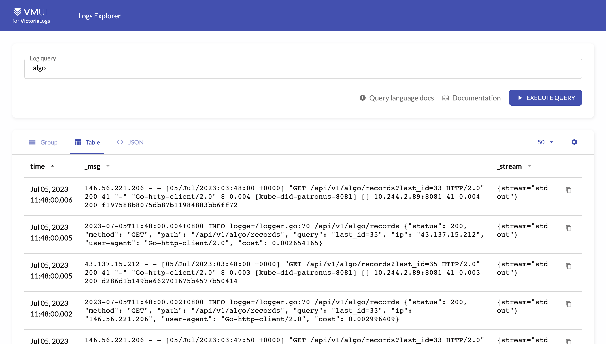

# 42.VictoriaLogs

`VictoriaLogs` 是 `VictoriaMetrics` 最新发布的开源、可扩展的日志记录解决方案，它可以帮助用户和企业将当前应用程序的监控扩展到更具战略性的“全系统状态”企业级可观测性。

当今市场上的许多现有日志解决方案只能为 IT 专业人员提供有限的数据库和集群实时操作的有限窗口。随着全球运维规模的扩大和复杂性的增加，这些早期的监控解决方案无法提供精细而简化的视图，以准确观察时间序列数据如何几乎实时地影响业务绩效。

[VictoriaLogs](https://victoriametrics.com/products/victorialogs) 由之前在 Google 和 Lyft 工作经验丰富的工程师构建，解决了这个问题。它的构建也同样遵循 VictoriaMetrics 的原则：简单、可靠和成本效益。

需要注意的是 `VictoriaLogs` 是一个日志存储和查询的后端，并没有提供直接的日志采集功能，而是兼容其他常见的日志采集工具，比如 `fluentbit`、`filebeat`、`logstash` 等。


## VictoriaLogs 的主要亮点

- 在生产工作负载上，所需的磁盘空间和内存 比 ElasticSearch 少 10 倍
- 比 ElasticSearch 和 Grafana Loki 更容易配置和操作
- LogsQL：一种简单但功能强大的查询语言



我们可以将 `VictoriaLogs` 预览版与生产中的现有解决方案一起运行，比较它们的资源使用情况，我们发布了一个开源基准测试，有关该基准的详细信息，请查看 `https://github.com/VictoriaMetrics/VictoriaMetrics/tree/master/deployment/logs-benchmark`。

**高效、易于使用的监控，可实现更好的可观测性**

`VictoriaLogs` 运行高效，可处理结构化和非结构化日志，以最大程度地向后兼容用户所需的复杂大规模基础设施，无论他们是学术界还是商业界、在电子商务或视频游戏团队中工作。

`VictoriaLogs` 专为易于安装和简单使用而设计，可加快对基础设施性能的分析，并加快解决实时时间序列环境中快速出现且每一秒都至关重要的复杂问题的平均时间。

`VictoriaLogs` 还极大地提高了系统的可观测性，以帮助企业识别和分析数据库性能问题、调试它们并预测未来的行为。这使内部和外部团队能够减少中断带来的直接和长期业务风险，顺利进行产品更新并增强客户体验。

**更快的日志查询**

为了进一步提高可用性，`VictoriaMetrics` 的新查询语言 `LogSQL` 是一种易于使用但功能强大的 `VictoriaLogs` 查询语言。它提供全文搜索功能，允许查询**数十亿条**日志的任意分析。`VictoriaLogs` 接受来自现有日志代理、管道和流的日志，并将它们有效地存储在高度优化的日志数据库中，然后可以使用 LogSQL 以闪电般的速度进行查询。


## 日志采集

比如现在我们需要采集 Kubernetes 集群的日志，然后将其存入到 `VictoriaLogs` 中去，我们这里的环境采用的是 containerd 这种容器运行时，所以在使用的时候需要和 docker 进行区分，这里我们使用 `fluentbit` 来采集日志，同样这里我们也将其部署到我们的 Kubernetes 集群中，完整的部署文件如下所示：

```yaml
apiVersion: v1
kind: ConfigMap
metadata:
  name: fluent-bit-config
  namespace: monitor
  labels:
    k8s-app: fluentbit-logging
    kubernetes.io/cluster-service: "true"
data:
  fluent-bit.conf: |
    [SERVICE]
        Flush         1
        Log_Level     info
        Daemon        off
        Parsers_File  parsers.conf
        HTTP_Server   On
        HTTP_Listen   0.0.0.0
        HTTP_Port     2020
    @INCLUDE input-kubernetes.conf
    @INCLUDE filter-kubernetes.conf
    @INCLUDE output.conf

  output.conf: |
    # [OUTPUT]
    #     Name            stdout
    #     Match           kube.var.log.containers.*.*
    [OUTPUT]
        Name http
        Match kube.var.log.containers.*.*
        host victorialogs
        port 9428
        compress gzip
        uri /insert/jsonline?_stream_fields=stream&_msg_field=message&_time_field=time
        format json_lines
        json_date_format iso8601
        header AccountID 0
        header ProjectID 0

  input-kubernetes.conf: |
    [INPUT]
        Name              tail
        Tag               kube.*
        Path              /var/log/containers/*.log
        Parser            cri
        DB                /var/log/flb_kube.db
        Mem_Buf_Limit     5MB
        Skip_Long_Lines   On
        Refresh_Interval  10

  filter-kubernetes.conf: |
    [FILTER]
        Name                kubernetes
        Match               kube.*
        Kube_URL            https://kubernetes.default.svc:443
        Kube_CA_File        /var/run/secrets/kubernetes.io/serviceaccount/ca.crt
        Kube_Token_File     /var/run/secrets/kubernetes.io/serviceaccount/token
        Kube_Tag_Prefix     kube.var.log.containers.
        Merge_Log           On
        Merge_Log_Trim      On
        Keep_Log            Off
        K8S-Logging.Parser  On
        K8S-Logging.Exclude Off
        Annotations         Off
        Labels              On

    [FILTER]
        Name          nest
        Match         kube.*
        Operation     lift
        Nested_under  kubernetes
        Add_prefix    kubernetes_

    [FILTER]
        Name          nest
        Match         kube.*
        Operation     lift
        Nested_under  kubernetes_labels
        Add_prefix    kubernetes_labels_

  parsers.conf: |
    [PARSER]
        Name        json
        Format      json
        Time_Key    time
        Time_Format %d/%b/%Y:%H:%M:%S %z
        Time_Keep   Off

    [PARSER]
        Name docker
        Format json
        Time_Key time
        Time_Format %Y-%m-%d %H:%M:%S
        Time_Keep Off

    [PARSER]
        Name        cri
        Format      regex
        Regex       ^(?<time>[^ ]+) (?<stream>stdout|stderr) (?<logtag>[^ ]*) (?<log>.*)$
        Time_Key    time
        Time_Format %Y-%m-%d %H:%M:%S

---
# fluentbit rbac
apiVersion: v1
kind: ServiceAccount
metadata:
  name: fluentbit
  namespace: monitor
  labels:
    k8s-app: fluentbit-logging
    kubernetes.io/cluster-service: "true"
---
apiVersion: rbac.authorization.k8s.io/v1
kind: ClusterRole
metadata:
  name: fluentbit
  namespace: monitor
  labels:
    k8s-app: fluentbit-logging
    kubernetes.io/cluster-service: "true"
rules:
  - apiGroups: [""]
    resources:
      - namespaces
      - pods
      - pods/log
    verbs: ["get", "list", "watch"]
  - apiGroups: ["extensions", "apps"]
    resources:
      - deployments
      - replicasets
    verbs: ["get", "list", "watch"]
---
apiVersion: rbac.authorization.k8s.io/v1
kind: ClusterRoleBinding
metadata:
  name: fluentbit
  namespace: monitor
  labels:
    k8s-app: fluentbit-logging
    kubernetes.io/cluster-service: "true"
roleRef:
  apiGroup: rbac.authorization.k8s.io
  kind: ClusterRole
  name: fluentbit
subjects:
  - kind: ServiceAccount
    name: fluentbit
    namespace: monitor
---
apiVersion: apps/v1
kind: DaemonSet
metadata:
  name: fluentbit
  namespace: monitor
  labels:
    k8s-app: fluentbit-logging
    kubernetes.io/cluster-service: "true"
spec:
  selector:
    matchLabels:
      k8s-app: fluentbit-logging
  template:
    metadata:
      labels:
        k8s-app: fluentbit-logging
    spec:
      serviceAccount: fluentbit
      serviceAccountName: fluentbit
      tolerations:
        - key: node-role.kubernetes.io/control-plane
          operator: Exists
          effect: NoSchedule
      containers:
        - name: fluentbit
          image: cr.fluentbit.io/fluent/fluent-bit:2.1.4
          imagePullPolicy: Always
          ports:
            - containerPort: 2020
          volumeMounts:
            - name: varlog
              mountPath: /var/log
            - name: fluent-bit-config
              mountPath: /fluent-bit/etc/fluent-bit.conf
              subPath: fluent-bit.conf
            - name: fluent-bit-config
              mountPath: /fluent-bit/etc/input-kubernetes.conf
              subPath: input-kubernetes.conf
            - name: fluent-bit-config
              mountPath: /fluent-bit/etc/filter-kubernetes.conf
              subPath: filter-kubernetes.conf
            - name: fluent-bit-config
              mountPath: /fluent-bit/etc/output.conf
              subPath: output.conf
      volumes:
        - name: varlog
          hostPath:
            path: /var/log
        - name: fluent-bit-config
          configMap:
            name: fluent-bit-config
```

首先在 ConfigMap 中我们配置了要采集的日志，日志源路径为 `/var/log/containers/*.log`，这是默认的容器日志路径，我们可以在节点上去查看，但是需要注意的是该路径下面的日志只是一个软连接，真正的日志路径在 `/var/log/pods` 下面，所以我们在 fluentbit 的 pod 中需要挂载宿主机的 `/var/log` 目录，只挂载 `/var/log/containers/` 目录则无法获取到真正的日志。



此外我们还为日志打上了 `kube.*` 标签，这是为了方便后续的日志过滤，我们可以根据标签来过滤日志进行相应的处理。

日志经过各种处理后，最重要的就是 `OUTPUT` 输出源的配置，在调试阶段我们可以先配置一个 `stdout` 的输出源。

```yaml
[OUTPUT]
    Name            stdout
    Match           kube.var.log.containers.*.*
```

这样我们就可以通过 fluentbit 的 pod 日志来查看日志是否被采集到了。



如果采集到了，那么我们就可以配置其他的输出源了，比如 `elasticsearch`、`kafka`、`redis` 等等，当然我们这里是要将日志输出到 `VictoriaLogs` 中，所以我们需要配置 `VictoriaLogs` 的输出源，如下所示：

```yaml
[OUTPUT]
    Name http
    Match kube.var.log.containers.*.*
    host victorialogs
    port 9428
    compress gzip
    uri /insert/jsonline?_stream_fields=stream&_msg_field=message&_time_field=time
    format json_lines
    json_date_format iso8601
    header AccountID 0
    header ProjectID 0
```

这里我们配置了 `VictoriaLogs` 的 `host` 和 `port`，其中最重要的是 `uri` 参数，这个参数是 `VictoriaLogs` 的插入接口 `/insert/jsonline?_stream_fields=stream&_msg_field=message&`，这里我们需要注意的是 `uri` 参数中的 `_stream_fields`、`_msg_field`、`_time_field` 这三个参数，这三个参数是 `VictoriaLogs` 的插入接口所必须的，其中 `_stream_fields` 是指定日志流的字段，这里我们指定为 `stream`，`_msg_field` 是指定日志内容的字段，这里我们指定为 `message`，`_time_field` 是指定日志时间的字段，这里我们指定为 `time`，具体要取什么字段需要根据我们的日志来决定，这样我们就可以将日志采集到 `VictoriaLogs` 中了。当然还有两个字段 `AccountID` 和 `ProjectID`，可以用来区分不同的租户，这里我们暂时不用，所以设置为 `0`。

直接部署上面的资源清单即可，部署完成后我们可以查看 fluentbit 的 pod 日志，如果日志中没有报错，那么就说明我们的 fluentbit 部署成功了，接下来就可以部署 `VictoriaLogs` 了。


## 安装 VictoriaLogs

由于 `VictoriaLogs` 目前预览版本仅仅是一个单节点的应用，所以我们只需要部署一个 `Deployment` 即可，如下所示：

```yaml
# deploy victorialogs
apiVersion: apps/v1
kind: Deployment
metadata:
  name: victorialogs
  namespace: monitor
  labels:
    app: victorialogs
spec:
  selector:
    matchLabels:
      app: victorialogs
  template:
    metadata:
      labels:
        app: victorialogs
    spec:
      containers:
        - name: victorialogs
          image: victoriametrics/victoria-logs:latest
          # command:
          #   - -storageDataPath=/vlogs  # 指定日志存储路径
          ports:
            - containerPort: 9428
          volumeMounts:
            - name: logs
              mountPath: victoria-logs-data # 默认日志存储路径
      volumes:
        - name: logs
          persistentVolumeClaim:
            claimName: victorialogs-pvc
---
# deploy victorialogs service
apiVersion: v1
kind: Service
metadata:
  name: victorialogs
  namespace: monitor
  labels:
    app: victorialogs
spec:
  ports:
    - port: 9428
      targetPort: 9428
  type: NodePort
  selector:
    app: victorialogs
---
# deploy victorialogs pvc
apiVersion: v1
kind: PersistentVolumeClaim
metadata:
  name: victorialogs-pvc
  namespace: monitor
spec:
  accessModes:
    - ReadWriteOnce
  storageClassName: cfsauto
  resources:
    requests:
      storage: 10Gi
```

这里我们需要注意的是 `VictoriaLogs` 的存储路径，`VictoriaLogs` 默认的存储路径是 `victoria-logs-data`，可以通过参数 `-storageDataPath` 进行指定，如果想要持久化日志数据，则需要将该路径进行挂载，比如我们这里就指定了一个 PVC 进行关联。另外由于上面 fluentbit 我们输出到了 `VictoriaLogs` 的 host 地址为 `victorialogs`，所以我们还需要创建名为 `victorialogs` 的 Service 对象将其暴露出去，并且要和 fluentbit 在同一个命名空间下，此外 `VictoriaLogs` 本身还自带一个 Web 界面，这里我们通过 `NodePort` 来对外进行暴露，这样我们就可以通过 `NodeIP:NodePort` 来访问 `VictoriaLogs` 了。

同样直接部署上面的资源清单即可，部署完成后我们可以查看 `VictoriaLogs` 的 pod 日志，如果日志中没有报错，那么就说明我们的 `VictoriaLogs` 部署成功了。

```bash
$ kubectl get pods -n monitor
NAME                            READY   STATUS    RESTARTS   AGE
fluentbit-6rmp8                 1/1     Running   0          28m
fluentbit-bbgxb                 1/1     Running   0          28m
fluentbit-xwrzs                 1/1     Running   0          28m
victorialogs-5856895b4c-mcffw   1/1     Running   0          41m
$ kubectl get svc -n monitor
NAME           TYPE        CLUSTER-IP      EXTERNAL-IP   PORT(S)             AGE
victorialogs   NodePort    10.101.31.122   <none>        9428:30694/TCP      48m
```

部署完成后我们就可以通过 `NodeIP:30694` 来访问 `VictoriaLogs` 如下所示：



点击 `select/vmui` 就可以跳转到 `VictoriaLogs` 的 Logs Explorer 界面了，如下所示：



然后我们就可以根据自己的需求来进行日志的查询了，比如查询日志中包含 `alog` 关键字的日志：



此外还有 Table 和 JSON 两种展示模式：



日志查询使用的是 `VictoriaLogs` 的 LogsQL 语法，具体语法可以参考官方文档： `https://docs.victoriametrics.com/VictoriaLogs/LogsQL.html`。

目前 `VictoriaLogs` 还处于预览版本，所以还有很多功能没有完善，只有简单的日志查询功能，比如目前还不支持日志的告警，可视化图表等等功能，但是 `VictoriaLogs` 的开发者已经在开发中了，相信很快就会支持了。


> 原文: <https://www.yuque.com/cnych/k8s4/lsfgin3o5bmiwcs8>