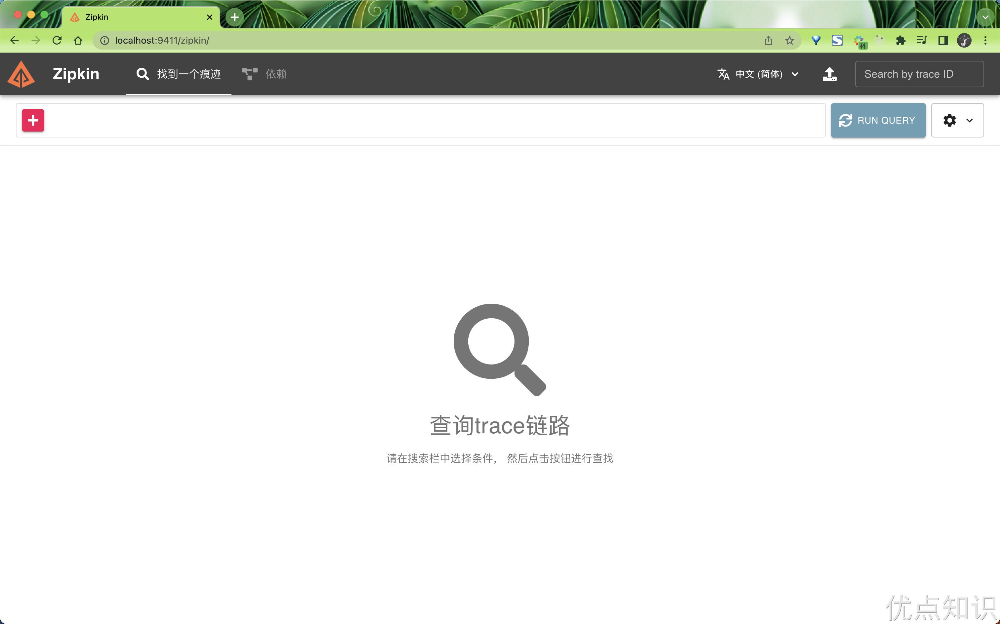
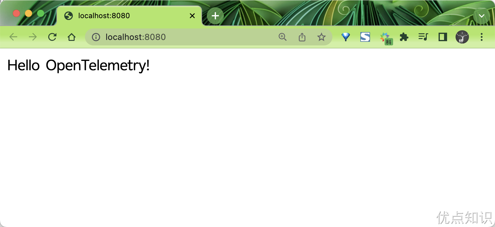

# 45.1 OpenTelemetry初体验

接下来我们通过一个简单的示例来体验下 OpenTelemetry 的简单使用。

这里我们会在本地创建并运行一个 nodejs 的项目，在该应用中我们会创建一个 server 来监听请求，比如一个 GET 请求。然后我们可以去了解下该应用程序中发生了哪些事情，比如根据应用的请求去衡量应用的性能，或者去了解下应用的行为。

所以创建项目后，我们接下来就需要在项目中引入 OpenTelemetry 的 SDK，这样做可以帮我们标准化遥测数据，一旦实施了 OpenTelemetry 并标准化了数据，接下来我们就需要考虑如何处理这些遥测数据，以及如何查看这些数据等等。为此我们当然就可以去使用一些分析工具了，比如 Prometheus、Jaeger、Zipkin、某些云平台等等，也就是我们常说的观测后端工具，通过这些分析工具，就可以为我们提供可观测性了。最后我们只需要把我们的数据发送到我们选择的分析工具即可。

我们这里将选择使用追踪工具 Zipkin 来进行演示。

> **遥测**是指从系统发出的关于其行为的数据，数据可以以追踪、指标和日志的形式出现。


### 创建示例项目

在开始之前，我们需要先安装一些工具，比如 nodejs、docker、docker-compose 等等，这里我们就不再赘述了，如果你还没有安装的话，可以参考下面的链接进行安装。

- [https://nodejs.org/zh-cn](https://nodejs.org/zh-cn)
- [https://docs.docker.com/engine/install](https://docs.docker.com/engine/install)

nodejs 的环境是必须的，因为我们的示例项目就是基于 nodejs 的，而 docker 和 docker-compose 是可选的，因为我们可以选择在本地安装这些工具，也可以选择在云上安装这些工具，这里我们选择在本地安装，比如我们可以使用 docker 在本地来运行 Zipkin 和 Prometheus。

接下来我们就可以创建项目了，首先我们创建一个名为 `otel-demo` 的目录，该目录用来存放我们的项目代码：

```bash
$ mkdir otel-demo && cd otel-demo
```

然后接下来我们可以先启动一个 docker 容器，为后面的实现做准备。前面我们提到过，在开始收集追踪数据之前，我们首先需要提供一个追踪数据的存储服务，这里我们就可以使用 Zipkin 来实现，所以我们可以通过 docker 来启动一个 Zipkin 容器（当然也可以选择直接下载 Zipkin 启动），如下所示：

```bash
$ docker run -d -p 9411:9411 --name zipkin openzipkin/zipkin
```

启动后我们就可以通过 `http://localhost:9411` 来访问 Zipkin 了，如下所示：



接下来我们就可以创建 nodejs 项目了，这里我们使用 `npm init -y` 来创建一个 nodejs 项目，如下所示：

```bash
$ npm init -y
Wrote to /Users/cnych/Documents/course/opentelemetry/otel-demo/package.json:

{
  "name": "otel-demo",
  "version": "1.0.0",
  "description": "",
  "main": "index.js",
  "scripts": {
    "test": "echo \"Error: no test specified\" && exit 1"
  },
  "keywords": [],
  "author": "",
  "license": "ISC"
}
```

该命令会为我们创建一个 `package.json` 的包描述文件，该文件用来描述我们的项目信息，比如项目名称、版本、描述、作者等等，这里我们将入口文件更改为 `app.js`，并在 `scripts` 中添加一条命令 `"start": "node app.js"`，更改后如下所示：

```json
{
  "name": "otel-demo",
  "version": "1.0.0",
  "description": "OpenTelemetry Demo",
  "main": "app.js",
  "scripts": {
    "start": "node app.js"
  },
  "keywords": [],
  "author": "",
  "license": "ISC"
}
```

由于我们这里需要使用到 `express` 库来创建一个 server，所以我们需要安装 `express` 库，如下所示：

```bash
$ npm install express
```

接下来就可以创建我们的应用逻辑代码了。

首先我们在 `app.js` 文件中使用 `express` 库来创建一个 server，代码如下所示：

```javascript
const express = require("express");

const PORT = process.env.PORT || 8080;
const app = express();

app.get("/", (req, res) => {
  res.send("Hello OpenTelemetry!");
});

app.listen(PORT, () => {
  console.log(`Server listening on http://localhost:${PORT}`);
});
```

上面的代码中，我们创建了一个 server，默认监听在 8080 端口上，然后在 `/` 路径下面返回了一个 `Hello OpenTelemetry!` 字符串。

然后我们就可以在项目根目录下面通过执行 `npm run start` 命令来启动我们的应用了：

```bash
$ npm run start

> otel-demo@1.0.0 start
> node app.js

Server listening on http://localhost:8080
```

现在我们就可以直接通过 `http://localhost:8080` 来访问我们的应用了。




### 集成 OpenTelemetry

接下来我们来实现下当进行 get 请求时进行 trace 追踪功能，由于系统使用的编程语言、框架和基础设施不尽相同，如果没有某种通用的方法实现起来就非常繁琐，这也就是 OpenTelemetry 要做的事情，他通过提供一组通用的 API、SDK 和工具集为我们的项目提供了良好的集成服务。

我们可以借助 OTel 自动埋点功能，无需修改代码库中的任何业务代码即可设置链路追踪。所有链路追踪配置并非直接编写在应用代码中，而是在脚本中定义，然后在运行时把脚本导入 Node.js 进程即可。

我们这里可以配置应用的自动埋点使用最基本的链路追踪目标位置，即控制台，当然测试完成后我们可以将其发送到外部的 OTel 收集器，比如 Jaeger、Zipkin 等等。

1. 首先需要安装 OTel 的 Node.js 依赖包：

```bash
$ npm install @opentelemetry/sdk-node@0.40.0 \
  @opentelemetry/auto-instrumentations-node@0.37.0
```

安装的这两个库提供了以下功能：

- `@opentelemetry/sdk-node`：生成并导出 OTel 数据
- `@opentelemetry/auto-instrumentations-node`：使用所有常见 Node.js 埋点的默认配置进行自动设置，比如我们这里将为 Express 提供检测，让示例应用程序自动为每个传入请求创建 span。

2. 然后在应用根目录下面新建一个名为 `tracing.js` 的文件，在其中添加 OTel 链路追踪的设置和配置代码：

```bash
$ touch tracing.js
```

3. 使用常用的文本编辑器，打开 `tracing.js` 文件薄情添加如下所示的代码：

```javascript
//1
const opentelemetry = require("@opentelemetry/sdk-node");
const {
  getNodeAutoInstrumentations,
} = require("@opentelemetry/auto-instrumentations-node");

//2
const sdk = new opentelemetry.NodeSDK({
  traceExporter: new opentelemetry.tracing.ConsoleSpanExporter(),
  instrumentations: [getNodeAutoInstrumentations()],
});

//3
sdk.start();
```

上面的代码完成了以下的一些操作：

- 从 OTel SDK 中导入所需的函数和对象。
- 新建 `NodeSDK` 实例并对其进行配置，以便： 
   - 将 `span` 发送至控制台 (`ConsoleSpanExporter`)。
   - 将自动埋点用作基本埋点组。该埋点加载了所有最常见的自动埋点库。
- 启动 SDK：一旦 SDK 已配置完成，调用 `start` 方法来构建 SDK 组件并将其注册到 OpenTelemetry API。

4. 然后启动示例服务并导入在上面创建的自动埋点脚本：

```bash
$ node --require ./tracing.js app.js
```

然后我们就可以控制台终端中开始看到大量与链路追踪相关的输出信息了：

```bash
......
{
  traceId: 'b7f432453eb0fc09c80bf682c15aa86f',
  parentId: undefined,
  traceState: undefined,
  name: 'fs statSync',
  id: '188af03d8d92b148',
  kind: 0,
  timestamp: 1688624928628000,
  duration: 7,
  attributes: {},
  status: { code: 0 },
  events: [],
  links: []
}
```

这也是一个典型的 OTel 中的链路追踪的信息。


### 集成外部可视化工具

上面我们是通过自动埋点的方式将链路追踪的信息输出到控制台，这对于开发调试阶段非常有用，但是这样的话我们就无法对链路追踪的信息进行可视化了，所以我们这里需要将链路追踪的信息发送到外部的可视化工具中，比如 Jaeger、Zipkin 等等。


#### 客户端数据上报

前面我们已经通过 Docker 的方式在本地启动了一个 Zipkin 的服务，接下来我们就来尝试下将链路追踪的信息发送到 Zipkin 中去。要想在 Jaeger 或者 Zipkin 中查看链路追踪数据，最终我们还是需要将客户端的数据上报到这些后端服务中去，这样才能看到完整的链路追踪数据、指标等数据。

客户端会根据一定的规则生成 traces、metrics、logs 等信息，然后就会将其推送到服务器远端。一般来说 OpenTelemetry 的服务端客户端传递数据的请求协议标准是 HTTP 和 GRPC 协议，在各语言的 SDK 以及服务端实现中都应该包含这两个数据协议的的实现。

由于一般来说调用链等数据的数据量极大，所以在客户端就会有一些类似于 `Batch` 的批处理操作选项，该选项会将多个 Span 信息整合到一起一并发送，以减小网络端的损耗。

客户端的这种数据上报我们会统称为 Export，同时，实现这些上报的组件我们统一称作 Exporters（导出器），Exporters 会包含不同种的数据协议和格式，默认的格式为 OTLP，其实就是 OpenTelemetry Protocol，即 OTel 的标准协议。

**OTLP**

-  OTLP 是指 OpenTelemetry Protocol，即 OpenTelemetry 数据协议。OTLP 规范规定了客户端和服务采集端之间的遥测数据的编码、传输和投送。 
-  OTLP 在实现上分为 `OTLP/gRPC` 和 `OTLP/HTTP`。 
   - `OTLP/HTTP` 在数据传输的时候支持两种模式：二进制和 json
   - 二进制使用 `proto3` 编码标准，且必须在请求头中标注 `Content-Type: application/x-protobuf`
   - JSON 格式使用 `proto3` 标准定义的 JSON Mapping 来处理 Protobuf 和 JSON 之间的映射关系。
   - `OTLP/gRPC` 分成普通请求和并发请求两种。 
      - 普通请求：在客户端和服务端建立连接后，客户端可以持续不断的发送请求到服务端，服务端会一一回应。
      - 并发请求：客户端可以在服务端未回应前发送下一个请求，以此提高并发量。


#### 修改自动埋点脚本

我们知道使用 OTel 自动埋点意味着无需修改项目中的任何内容即可设置链路追踪。但所有链路追踪配置都位于在运行时被导入 Node.js 进程的脚本中，所以这里我们就需要去将前面 `tracing.js` 脚本生成的链路追踪的目标位置从控制台更改为外部收集器。

1. 同样首先我们需要安装 OTLP Exporter（导出器）的 Node 依赖包：

```bash
$ npm install @opentelemetry/exporter-trace-otlp-http@0.40.0
```

`@opentelemetry/exporter-trace-otlp-http` 库可以通过 HTTP 导出 `OTLP` 格式的链路追踪信息，用于向 OTel 外部收集器发送遥测数据。

2. 打开 `tracing.js` 文件，并做如下所示的修改：

-  将下面的一行代码添加到文件顶部： 
```javascript
const {
  OTLPTraceExporter,
} = require("@opentelemetry/exporter-trace-otlp-http");
```
 

-  将 OTel SDK 的 `Exporter` 从前面的控制台导出器 `ConsoleSpanExporter` 更改为可通过 HTTP 向后兼容 OTLP Receiver 发送 OTLP 数据的 Exporter。

将 
```bash
traceExporter: new opentelemetry.tracing.ConsoleSpanExporter(),
```

	替换为  
```bash
  traceExporter: new OTLPTraceExporter({
    url: 'http://localhost:4318/v1/traces', //opentelemetry collector url 是可选的可以省略，默认为 http://localhost:4318/v1/traces
    headers: {}
  }),
```

3. 然后停止前面运行的示例服务，并重新启动示例服务：

```bash
node --require ./tracing.js app.js
```

4. 重新开启第二个终端会话，等待几秒钟后，然后向示例服务发送一些简单的请求：

```bash
curl -X GET http://localhost:8080/
```

在发送请求前等待几秒钟有助于 tracing 信息更容易被找到，因为在服务启动时自动埋点会生成许多链路追踪数据。

5. 然后在浏览器中，访问 Zipkin 用户界面：`http://localhost:9411/zipkin/`，并验证 OTLP 导出器是否按预期运行。不出意外我们应该是看不到任何链路追踪的信息的，原因也很简单，我们可以再看下前面我们是如何定义 OTLP Exporter 的，代码如下所示：

```javascript
traceExporter: new OTLPTraceExporter({
  url: "http://localhost:4318/v1/traces", //opentelemetry collector url 是可选的可以省略，默认为 http://localhost:4318/v1/traces
  headers: {},
});
```

`OTLPTraceExporter` 中有一个很重要的参数 `url`，这个 url 是 OpenTelemetry Collector 的 Url，默认为 `http://localhost:4318/v1/traces`，这里又引出一个非常重要的概念，即 OpenTelemetry Collector，OTel 的收集器。


> 原文: <https://www.yuque.com/cnych/k8s4/dfrlp1dhzu2ce9yn>