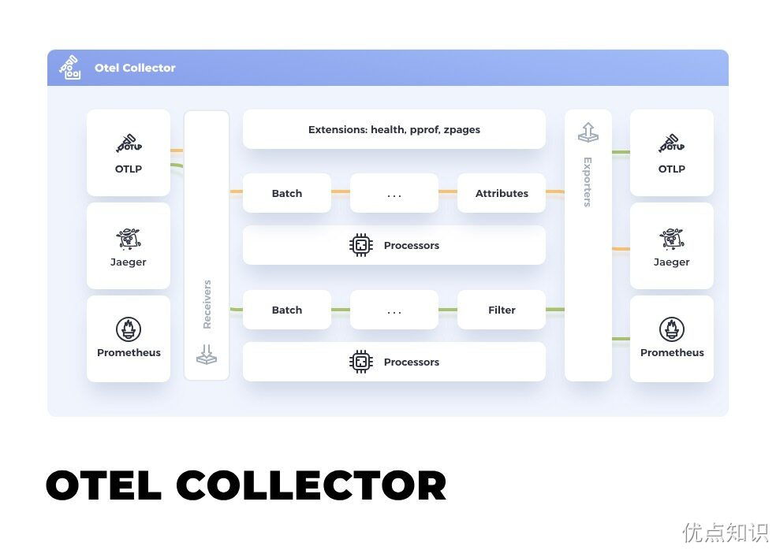
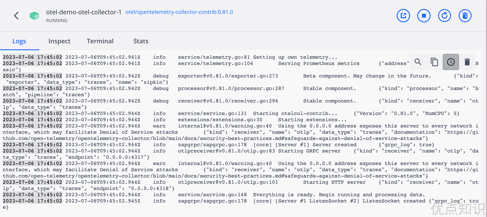
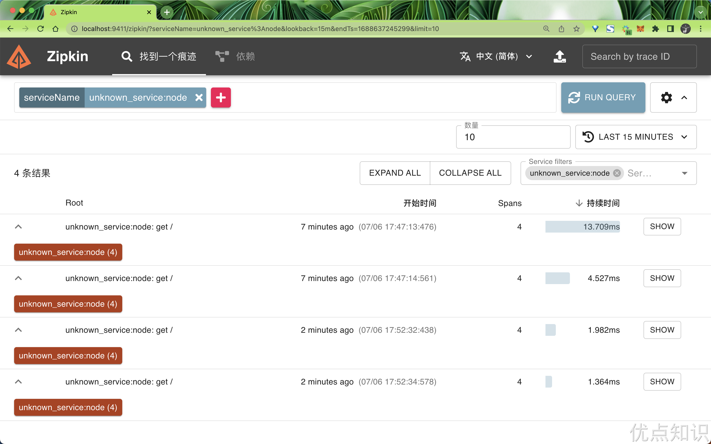
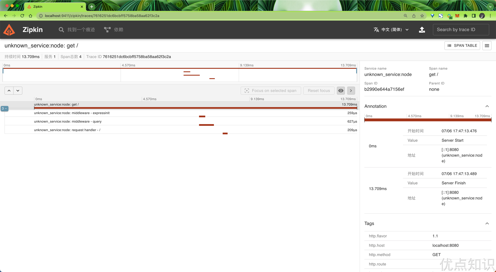
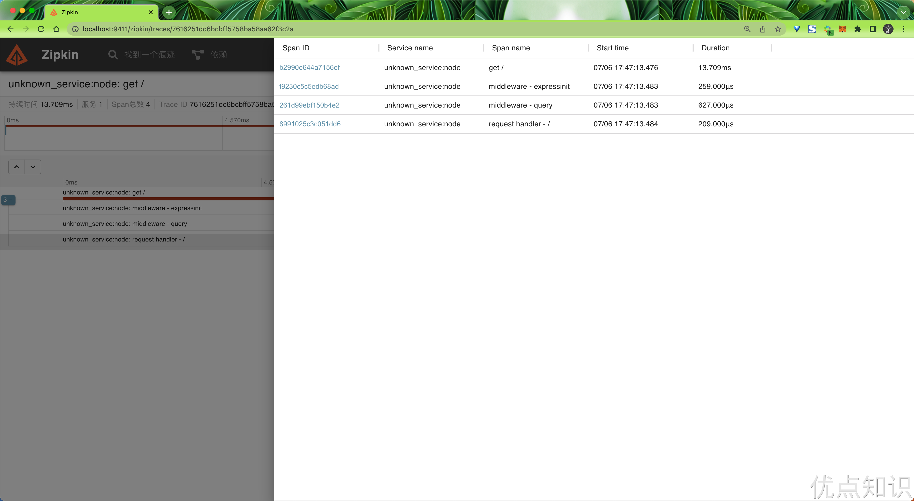
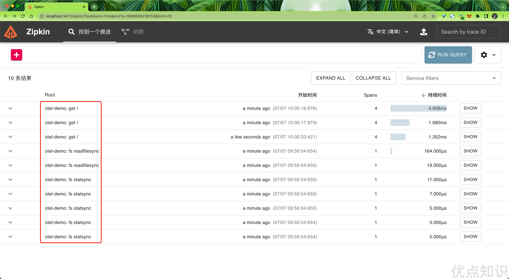
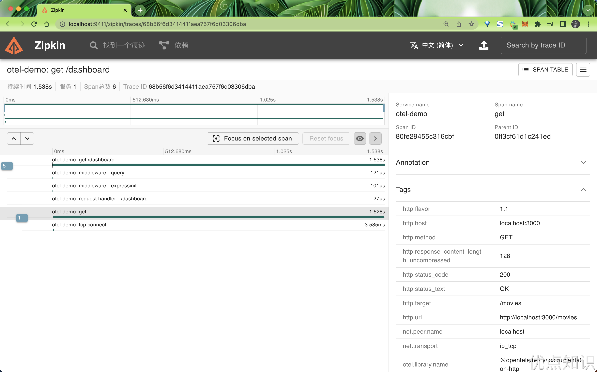
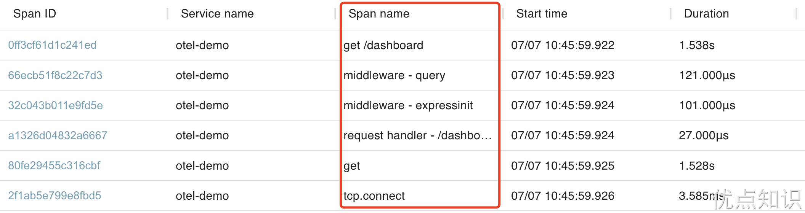

# 45.2 OpenTelemetry Collector

OpenTelemetry Collector 提供了一个与厂商无关的实现方式，用于**接收、处理和导出遥测数据**，它消除了运行、操作和维护多个代理/收集器的需求。

事实上收集器也并不是必需的，有的时候我们可以直接将遥测数据发送到外部的可视化工具中，比如 Jaeger、Zipkin 等等，但是这样的话我们就需要在每个应用中都进行配置，这样的话就会导致配置非常繁琐，而且也不利于统一管理，所以这里我们就可以使用 OpenTelemetry Collector 来解决这个问题。

而且 OpenTelemetry Collector 本身部署起来也非常灵活，可以将其部署为代理或网关。区别在于作为代理时，收集器实例与应用程序在同一主机上运行（sidecar 容器、daemonset 等）。此外一个或多个收集器实例也可以作为独立服务以每个集群、数据中心和地区的网关形式运行。

一般来说建议新应用选择代理部署，现有应用选择网关部署的方式，如果是 Kubernetes 环境，当然更建议部署为守护进程（代理模式）的方式。

收集器由四个组件组成，通过管道（Pipeline）进行启用：

- 接收器（Receiver）将数据发送到收集器中，可以通过推送或拉取方式发送
- 处理器（Processor）决定如何处理接收到的数据
- 导出器（Exporter）决定将数据发送到哪里，可以通过拉取或推送方式完成
- 连接器（Connectors）：连接器既是输出者又是接收者。连接器连接两个管道：它作为一个管道末端的导出器消耗数据，并作为另一个管道开始处的接收器发出数据。它可以消耗和发出相同数据类型或不同数据类型的数据。



当然我们也可以基于社区的组件进行自定义，以增强和扩展收集器管道。例如我们可以创建一个专用的导出器来接收并摄取指标、追踪和日志。


### OpenTelemetry Collector 配置

OpenTelemetry Collector 有一个专门的配置文件，用于指定各个组件的配置，下面我们来了解下收集器的一些核心配置属性。

**接收器（Receiver）**

接收器可以通过推送或拉取方式发送数据，是数据进入收集器的方式，接收器可以支持一个或多个数据源。

OTel Collector 有一个专门的配置文件来配置各个组件，其中接收器就是通过 `receivers` 属性进行配置的。

许多接收器都带有默认设置，因此只需指定接收器的名称就足以对其进行配置（比如 `zipkin:`）。如果需要配置或者用户想要更改默认配置，则必须在该模块下面定义此类配置。

另外需要注意的是配置接收器并不会启用它，接收器需要通过配置文件中的 `service` 服务部分内的 `pipelines` 管道进行启用。

而且**必须配置至少一个接收器**，默认情况下，没有配置接收器，下面是一个接收器的基本示例。

```yaml
receivers:
  # Data sources: logs
  fluentforward:
    endpoint: 0.0.0.0:8006

  # Data sources: metrics
  hostmetrics:
    scrapers:
      cpu:
      disk:
      filesystem:
      load:
      memory:
      network:
      process:
      processes:
      paging:

  # Data sources: traces
  jaeger:
    protocols:
      grpc:
      thrift_binary:
      thrift_compact:
      thrift_http:

  # Data sources: traces
  kafka:
    protocol_version: 2.0.0

  # Data sources: traces, metrics
  opencensus:

  # Data sources: traces, metrics, logs
  otlp:
    protocols:
      grpc:
      http:

  # Data sources: metrics
  prometheus:
    config:
      scrape_configs:
        - job_name: otel-collector
          scrape_interval: 5s
          static_configs:
            - targets: [localhost:8888]

  # Data sources: traces
  zipkin:
```

上面的配置文件中就配置了不同的接收器，比如其中 `zipkin` 接收器是用来接收 Zipkin 的数据的，而 `otlp` 接收器则是用来接收 OTLP 的数据的。

**处理器（Processor）**

处理器在接收器和导出器之间处理数据，处理器是可选的，但有些是推荐的。

在配置文件中可以通过 `processors` 属性进行配置，处理器可能带有默认设置，但很多处理器需要进行自定义配置，同样处理器的任何配置都必须在 `processors` 下面配置完成。

同样配置处理器并不启用它，需要通过配置文件中的 `service` 服务部分内的 `pipelines` 管道进行启用。

下面提供了默认处理器配置的基本示例，完整的处理器列表可以参考 [https://github.com/open-telemetry/opentelemetry-collector/tree/main/processor](https://github.com/open-telemetry/opentelemetry-collector/tree/main/processor)、[https://github.com/open-telemetry/opentelemetry-collector-contrib/tree/main/processor](https://github.com/open-telemetry/opentelemetry-collector-contrib/tree/main/processor) 这两个地方的文档。

```yaml
processors:
  # Data sources: traces
  attributes:
    actions:
      - key: environment
        value: production
        action: insert
      - key: db.statement
        action: delete
      - key: email
        action: hash

  # Data sources: traces, metrics, logs
  batch:

  # Data sources: metrics
  filter:
    metrics:
      include:
        match_type: regexp
        metric_names:
          - prefix/.*
          - prefix_.*

  # Data sources: traces, metrics, logs
  memory_limiter:
    check_interval: 5s
    limit_mib: 4000
    spike_limit_mib: 500

  # Data sources: traces
  resource:
    attributes:
      - key: cloud.zone
        value: zone-1
        action: upsert
      - key: k8s.cluster.name
        from_attribute: k8s-cluster
        action: insert
      - key: redundant-attribute
        action: delete

  # Data sources: traces
  probabilistic_sampler:
    hash_seed: 22
    sampling_percentage: 15

  # Data sources: traces
  span:
    name:
      to_attributes:
        rules:
          - ^\/api\/v1\/document\/(?P<documentId>.*)\/update$
      from_attributes: [db.svc, operation]
      separator: "::"
```

**导出器（Exporter）**

导出器同样可以是基于推或拉的方式，它是将数据发送到一个或多个后端/目的地的方式，导出器可以支持一个或多个数据源。

在配置文件中我们可以通过 `exporters` 属性进行配置，导出器也可能带有一些默认设置，但很多导出器需要进行自定义配置，比如至少指定目标地址，导出器的任何配置都必须在 `exporters` 下面配置完成。

同样配置导出器也并不会启用它，需要通过配置文件中的 `service` 服务部分内的 `pipelines` 管道进行启用。

**必须配置至少一个导出器**，默认情况下，未配置任何导出器，下面是导出器的基本示例配置，另外需要注意某些导出器配置需要创建 `x.509` 证书才能保证安全。

```yaml
exporters:
  # Data sources: traces, metrics, logs
  file:
    path: ./filename.json

  # Data sources: traces
  jaeger:
    endpoint: jaeger-all-in-one:14250
    tls:
      cert_file: cert.pem
      key_file: cert-key.pem

  # Data sources: traces
  kafka:
    protocol_version: 2.0.0

  # Data sources: traces, metrics, logs
  logging:
    loglevel: debug

  # Data sources: traces, metrics
  opencensus:
    endpoint: otelcol2:55678

  # Data sources: traces, metrics, logs
  otlp:
    endpoint: otelcol2:4317
    tls:
      cert_file: cert.pem
      key_file: cert-key.pem

  # Data sources: traces, metrics
  otlphttp:
    endpoint: https://example.com:4318

  # Data sources: metrics
  prometheus:
    endpoint: prometheus:8889
    namespace: default

  # Data sources: metrics
  prometheusremotewrite:
    endpoint: http://some.url:9411/api/prom/push
    # For official Prometheus (e.g. running via Docker)
    # endpoint: 'http://prometheus:9090/api/v1/write'
    # tls:
    #   insecure: true

  # Data sources: traces
  zipkin:
    endpoint: http://localhost:9411/api/v2/spans
```

**连接器（Connectors）**

连接器既是输出者又是接收者，顾名思义，连接器连接两个管道：它作为一个管道末端的导出器消耗数据，并作为另一个管道开始处的接收器发送数据。它可以消费和发送相同数据类型或不同数据类型的数据。连接器可以生成并发送数据来汇总所消耗的数据，或者它可以简单地复制或路由数据。

在配置文件中可以通过 `connectors` 熟悉配置连接器。同样的配置连接器并不会启用它，需要通过配置文件中的 `service` 服务部分内的 `pipelines` 管道进行启用。可以配置一个或多个连接器，默认情况下，未配置连接器，下面提供了连接器的基本示例。

```yaml
connectors:
  forward:

  count:
    spanevents:
      my.prod.event.count:
        description: The number of span events from my prod environment.
        conditions:
          - 'attributes["env"] == "prod"'
          - 'name == "prodevent"'

  spanmetrics:
    histogram:
      explicit:
        buckets: [100us, 1ms, 2ms, 6ms, 10ms, 100ms, 250ms]
    dimensions:
      - name: http.method
        default: GET
      - name: http.status_code
    dimensions_cache_size: 1000
    aggregation_temporality: "AGGREGATION_TEMPORALITY_CUMULATIVE"

  servicegraph:
    latency_histogram_buckets: [1, 2, 3, 4, 5]
    dimensions:
      - dimension-1
      - dimension-2
    store:
      ttl: 1s
      max_items: 10
```

**扩展（Extensions）**

扩展主要适用于不涉及处理遥测数据的任务，包括健康监控、服务发现和数据转发，扩展是可选的。

在配置文件中可以通过 `extensions` 属性配置扩展。很多扩展都有默认的配置，所以只需要指定扩展的名称就可以进行配置了（比如 `health_check:`）。同样配置扩展并不会启用它，需要在 `service` 服务部分进行启用。

默认情况下，没有配置任何扩展，下面是一个扩展的基本示例。

```yaml
extensions:
  health_check:
  pprof:
  zpages:
  memory_ballast:
    size_mib: 512
```

**服务（Service）**

服务用于根据接收器、处理器、导出器和扩展部分中的配置来**配置收集器中启用的组件**。如果配置了某个组件，但未在服务部分中定义该组件，则不会启用该组件。`service` 模块由三个子模块组成：

- `extensions`
- `pipelines`
- `telemetry`

扩展包含要启用的所有扩展的列表。例如：

```yaml
service:
  extensions: [health_check, pprof, zpages]
```

`pipelines` 可以有以下几个类型：

- `traces`：收集和处理追踪数据。
- `metrics`：收集和处理指标数据。
- `logs`：收集和处理日志数据。

`pipeline` 管道由一组接收器、处理器和导出器组成，每个接收器/处理器/导出器必须在配置中进行定义，以便包含在管道中。

> 注意：每个接收器/处理器/导出器可以在多个管道中使用。对于多个管道中引用的处理器，每个管道将获得该处理器的一个单独实例。这与多个管道中引用的接收器/导出器形成对比，在多个管道中，所有管道仅使用接收器/导出器的一个实例。另请注意，处理器的顺序决定了数据处理的顺序。


下面是一个 `pipeline` 管道的配置示例：

```yaml
service:
  pipelines:
    metrics:
      receivers: [opencensus, prometheus]
      exporters: [opencensus, prometheus]
    traces:
      receivers: [opencensus, jaeger]
      processors: [batch]
      exporters: [opencensus, zipkin]
```

`telemetry` 是配置收集器本身遥测数据的地方，它有两个小模块：`logs` 和 `metrics`。

- `logs` 允许配置收集器生成的日志，默认情况下，收集器会将其日志写入 `stderr`，日志级别为 `INFO`，此外还可以使用`initial_fields` 将静态键值对添加到所有日志中。
- `metrics` 允许配置收集器生成的指标，默认情况下，收集器将生成有关其自身的基本指标，并将其暴露在 `localhost:8888/metrics` 上进行抓取。

下面是 `telemetry` 部分的配置示例：

```yaml
service:
  telemetry:
    logs:
      level: debug
      initial_fields:
        service: my-instance
    metrics:
      level: detailed
      address: 0.0.0.0:8888
```

**环境变量配置**

另外收集器配置中支持环境变量的使用和扩展，例如，要使用存储在 `DB_KEY` 和 `OPERATION` 环境变量中的值，可以使用如下所示的方式进行配置：

```yaml
processors:
  attributes/example:
    actions:
      - key: ${env:DB_KEY}
        action: ${env:OPERATION}
```

另外可以使用 `$$` 来表示字符 `$`，例如，表示 `$DataVisualization` 如下所示：

```yaml
exporters:
  prometheus:
    endpoint: prometheus:8889
    namespace: $$DataVisualization
```

关于 OTel 采集器的更多详细配置可以参考官方文档：[https://opentelemetry.io/docs/collector/configuration/](https://opentelemetry.io/docs/collector/configuration/#extensions)。由于我们这里只是带领大家入门，后续还会有更深入的内容来介绍 OTel 采集器的相关配置。


### 部署 OpenTelemetry Collector

在了解了 OTel 采集器的基本信息后，现在回到前面我们的示例应用中，为什么在 Zipkin 中没有找到任何链路追踪的相关信息呢？首先由于我们这里并没有启动 OpenTelemetry Collector，所以通过 `OTLPTraceExporter` 默认的采集器地址是获取不到数据的，所以接下来我们就必须来启动 OpenTelemetry Collector。

要启动 OpenTelemetry Collector，我们首先需要创建一个配置文件，这里我们在示例项目的根目录下面创建一个 `otel-collector-config.yaml` 文件，内容如下所示：

```yaml
# otel-collector-config.yaml
receivers: # 接收器
  otlp:
    protocols:
      grpc: # 通过 gRPC 协议接收数据
      http: # 通过 HTTP 协议接收数据
        cors: # 跨域配置
          allowed_origins: # 允许的域名
            - http://*
            - https://*

exporters: # 导出器
  zipkin:
    endpoint: "http://zipkin:9411/api/v2/spans" # Zipkin 的 tracing 接口地址

processors: # 处理器
  batch: # 批处理配置

service: # 服务配置
  telemetry: # 采集器自身的一些遥测配置
    logs:
      level: "debug" # 日志级别
  pipelines: # 管道配置
    traces: # 链路追踪配置
      receivers: [otlp] # 接收器
      exporters: [zipkin] # 导出器
      processors: [batch] # 处理器
```

该配置文件非常简单，通过 `receivers` 配置了一个 `otlp` 的接收器，通过 `exporters` 配置了一个 `zipkin` 的导出器，并通过 `zipkin.endpoint` 指定了 Zipkin 接受链路追踪数据的地址 `http://zipkin:9411/api/v2/spans` 通过 `processors` 配置了一个 `batch` 的处理器，该处理器用于批量处理数据，然后通过 `service` 配置了一个 `telemetry` 的遥测配置，该配置用于配置 OTel 采集器自身的遥测数据，然后最后必须通过 `service.pipelines` 来启用前面配置的一些组件，这里我们就配置了一个 `traces` 的管道，其中 `receivers` 配置了 `otlp` 接收器，`exporters` 配置了 `zipkin` 导出器，`processors` 配置了 `batch` 处理器。这就是一个非常典型的 OTel 采集器的配置文件。

接下来我们就可以通过下面的命令来启动 OTel 采集器，由于后续可能还会有其他的应用，所以这里我们就直接更改为使用 Docker Compose 方式来启动，在示例应用根目录下面创建一个 `docker-compose.yml` 文件，内容如下所示：

```yaml
version: "2"
services:
  # Zipkin
  zipkin:
    image: openzipkin/zipkin:latest
    restart: always
    ports:
      - "9411:9411"

  # Collector
  otel-collector:
    image: otel/opentelemetry-collector-contrib:0.81.0
    restart: always
    command: ["--config=/conf/otel-collector-config.yaml"]
    volumes:
      - ./otel-collector-config.yaml:/conf/otel-collector-config.yaml
    ports:
      - "1888:1888" # pprof extension
      - "8888:8888" # Prometheus metrics exposed by the collector
      - "8889:8889" # Prometheus exporter metrics
      - "13133:13133" # health_check extension
      - "4317:4317" # OTLP gRPC receiver
      - "4318:4318" # OTLP http receiver
      - "55679:55679" # zpages extension
    depends_on:
      - zipkin
```

这里我们将前面的 Zipkin 也放到 Compose 中来一起管理，所以需要将之前启动的 Zipkin 删掉，对于 OTel 采集器需要将配置文件挂载到容器中去，然后可以通过 `--config` 参数来指定配置文件的路径。

接下来我们就通过 `docker-compose up -d` 命令来启动 OTel 采集器，启动完成后，我们可以通过 `docker-compose logs -f` 命令来查看 OTel 采集器的日志，可以看到 OTel 采集器已经成功启动了。




### 查看链路追踪数据

到这里一切都准备就绪了，接下来我们访问 `http://localhost:8080` 来请求示例应用，然后在 Zipkin 中通过筛选 `serviceName=unknown_service:node` 就可以看到链路追踪数据了。



点击链路追踪右侧的 `SHOW` 按钮可以显示其中的 span 列表。每个 span 都描述了作为链路追踪的一部分运行的各项操作，有时涉及多个服务。



可以看到示例应用中的 `/` 路由的链路追踪数据已经成功的被采集到了 Zipkin 中，一共有 4 个 span。



点击其中的一个 span，可以看到该 span 的详细信息，包括 span 的 ID、span 的名称、span 的开始时间、结束时间、耗时、span 的标签等等，注意这些都是 OTel SDK 自动埋点采集的数据，我们并没有在示例应用中手动埋点。

我们可以注意到 OTel SDK 导出的服务名称为 `unknown_service:node`，这种默认的服务名没有实际意义，如果我们有很多应用，那么就很难区分这些应用的链路追踪数据了，所以我们可以在示例应用中来指定服务名称，这样就可以很方便的区分不同应用的链路追踪数据了。

现在我们停止示例服务，然后再安装如下几个 Node.js 包：

```bash
$ npm install @opentelemetry/semantic-conventions@1.15.0 \
            @opentelemetry/resources@1.15.0
```

这两个库提供以下功能：

- `@opentelemetry/semantic-conventions`：定义了 OTel 规范中所定义的链路追踪的标准属性。
- `@opentelemetry/resources`：定义一个对象（资源）以代表生成 OTel 数据的来源。

然后重新修改 `tracing.js` 文件，在文件顶部添加如下代码：

```javascript
const { Resource } = require("@opentelemetry/resources");
const {
  SemanticResourceAttributes,
} = require("@opentelemetry/semantic-conventions");
```

然后添加如下代码创建一个名为 `otel-demo` 的 resource 对象：

```javascript
const resource = new Resource({
  [SemanticResourceAttributes.SERVICE_NAME]: "otel-demo",
});
```

然后将 `resource` 对象传递给 NodeSDK 构造函数:

```javascript
const sdk = new opentelemetry.NodeSDK({
  resource: resource,
  traceExporter: new OTLPTraceExporter({
    url: "http://localhost:4318/v1/traces",
    headers: {},
  }),
  instrumentations: [getNodeAutoInstrumentations()],
});
```

然后我们再次启动示例应用 `node --require ./tracing.js app.js`，然后再次访问 `http://localhost:8080`，然后再次查看 Zipkin 中的链路追踪数据，可以看到服务名称已经变成了 `otel-demo`。




### 优化埋点

为了说明链路追踪的调用链路，我们在示例项目中添加一个 `movies.js` 的文件，在该文件中我们提供一个 `/movies` 的路由来对外提供一个 API 接口数据，代码如下所示：

```javascript
// movies.js
const express = require("express");
const app = express();
const port = 3000;

app.get("/movies", async function (req, res) {
  res.type("json");
  var delay = Math.floor(Math.random() * 2000 + 100);

  setTimeout(() => {
    res.send({
      movies: [
        { name: "Star Wars", genre: "Science Fiction" },
        { name: "Jaws", genre: "Thriller" },
        { name: "Annie", genre: "Family" },
      ],
    });
  }, delay);
});

app.listen(port, () => {
  console.log(`Listening at http://localhost:${port}`);
});
```

然后我们在 `app.js` 中添加如下代码来调用 `/movies` 的接口：

```javascript
const getUrlContents = (url, fetch) => {
  return new Promise((resolve, reject) => {
    fetch(url, resolve, reject)
      .then((res) => res.text())
      .then((body) => resolve(body));
  });
};

app.get("/dashboard", async (req, res) => {
  //fetch data running from movies service
  const movies = await getUrlContents(
    "http://localhost:3000/movies",
    require("node-fetch")
  );
  res.type("json");
  res.send(JSON.stringify({ dashboard: movies }));
});
```

接下来我们启动 Movies 服务：

```bash
$ node movies.js
Listening at http://localhost:3000
```

然后再次重新启动示例应用 `node --require ./tracing.js app.js`，这次我们直接访问 `http://localhost:8080/dashboard` 接口，再查看 Zipkin 中的链路追踪数据。



可以看到该次请求的链路追踪数据已经成功的被采集到了 Zipkin 中了，一共有 6 个 span，包括请求 movies 服务接口的 span。

但我们仔细观察可以发现通过自动埋点采集到的链路追踪数据有一些 span 其实意义不是很大。



比如 `middleware - expressInit`、`middleware - query`、`middleware - jsonParser`、`middleware - urlencodedParser` 等等，这些 span 其实是 Express 框架通过自动埋点采集的数据，我们并不需要这些数据，所以我们可以通过配置来优化埋点，只采集我们需要的数据。

在 `tracing.js` 文件中添加如下代码：

```javascript
const IGNORED_EXPRESS_SPANS = new Set([
  "middleware - expressInit",
  "middleware - query",
]);
```

这定义了一组 span 名称，这些名称来自于上面 Zipkin 用户界面截图中的 span 列表，将不需要的 span 名称添加到该集合中。

然后将该过滤器添加至自动埋点配置，以删除不需要的 span，具体方法是将下列的代码：

```javascript
const sdk = new opentelemetry.NodeSDK({
  resource: resource,
  traceExporter: new OTLPTraceExporter({
    url: "http://localhost:4318/v1/traces",
    headers: {},
  }),
  instrumentations: [getNodeAutoInstrumentations()],
});
```

更改为如下代码：

```javascript
const sdk = new opentelemetry.NodeSDK({
  resource,
  traceExporter: new OTLPTraceExporter({
    url: "http://localhost:4318/v1/traces",
    headers: {},
  }),
  instrumentations: [
    getNodeAutoInstrumentations({
      "@opentelemetry/instrumentation-express": {
        ignoreLayersType: [new RegExp("middleware.*")],
        // ignoreLayers: [
        //   (name) => {
        //     return IGNORED_EXPRESS_SPANS.has(name);
        //   },
        // ],
      },
    }),
  ],
});
```

`getNodeAutoInstrumentations` 函数引用了前面定义的 `IGNORED_EXPRESS_SPANS` 集合，以将这些 span 从 `@opentelemetry/instrumentation-express` 生成的链路追踪中移除。

现在我们再次重新启动示例应用 `node --require ./tracing.js app.js`，然后访问 `http://localhost:8080/dashboard` 接口，再查看 Zipkin 中的链路追踪数据。


可以看到这次的链路追踪数据已经没有 `middleware - expressInit`、`middleware - query` 这些 span 了。

自动埋点无需更改应用便可生成大量信息，但有些场景必须通过对业务逻辑的特定部分进行监测才能获取，这个时候就需要我们手动埋点了。手动埋点的方式和具体的编程语言有关。


> 原文: <https://www.yuque.com/cnych/k8s4/fiaker6fd3q2imcc>