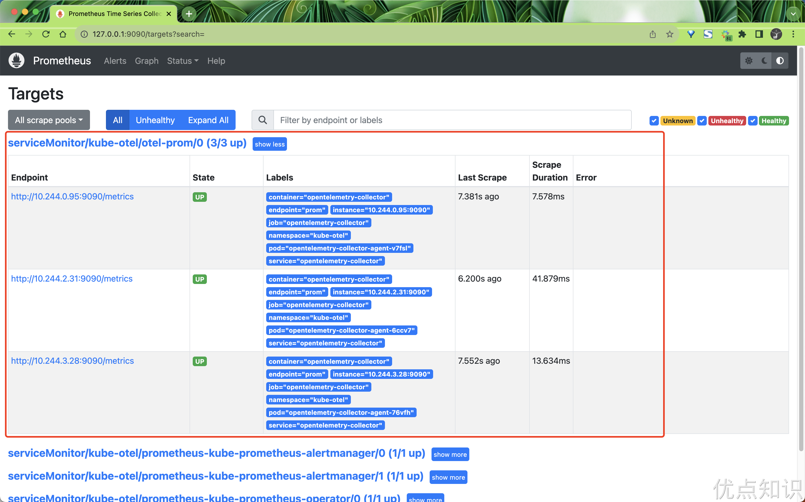
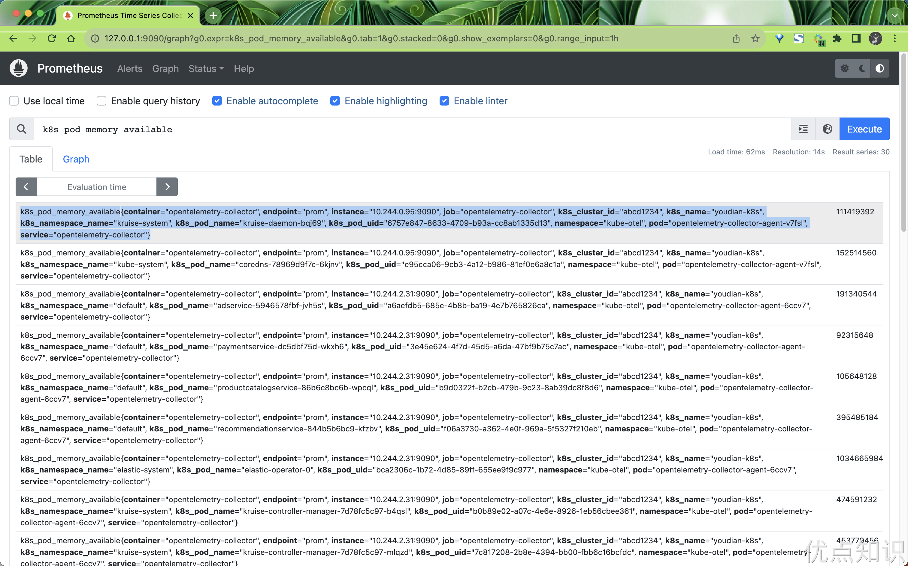
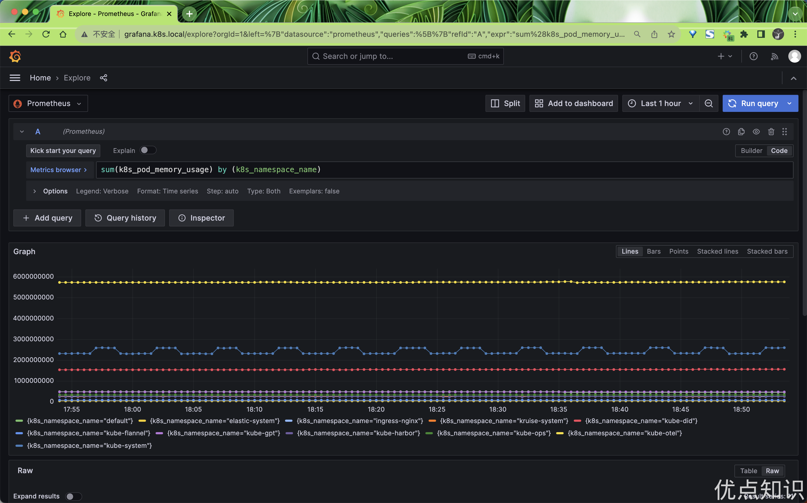
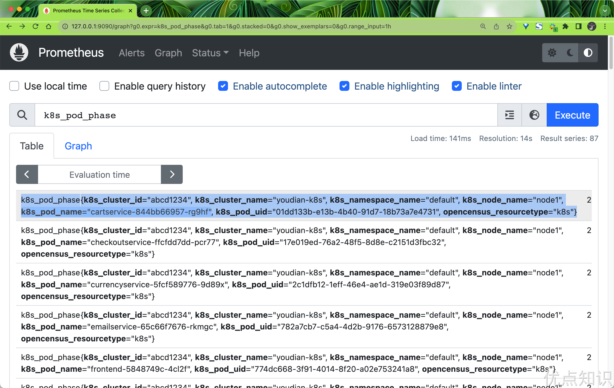
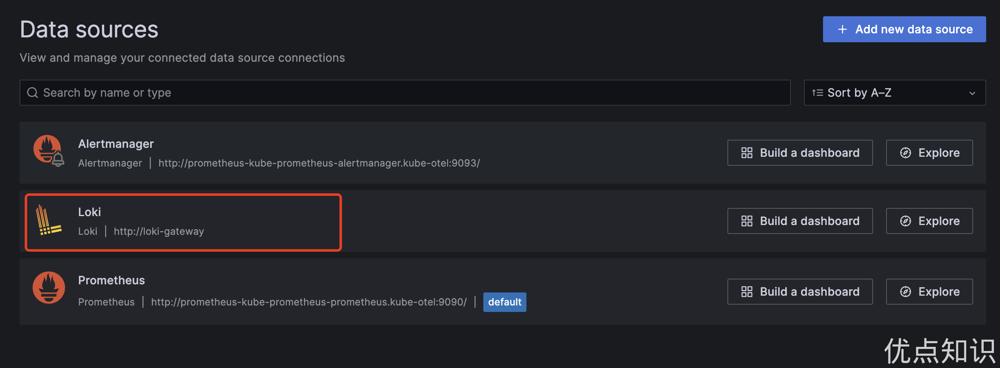
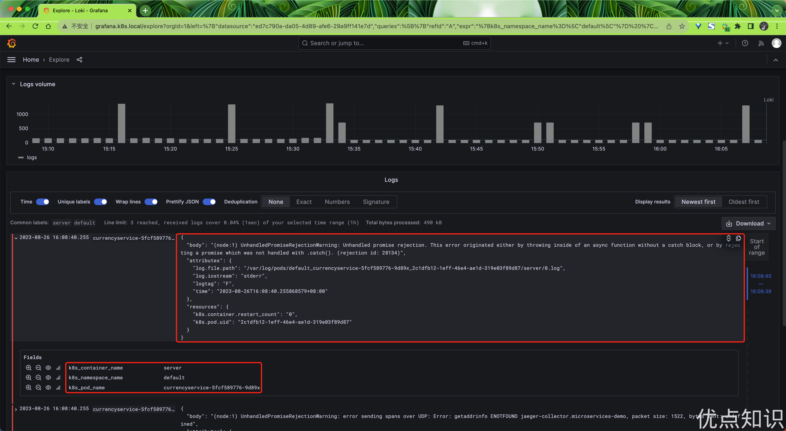
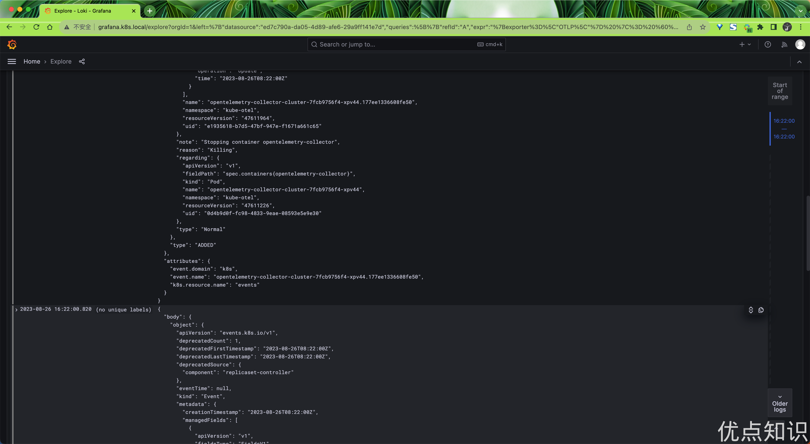

# 45.3 OpenTelemetry与Kubernetes结合使用

Kubernetes 已成为一个被广泛采用的行业工具，对可观测性工具的需求也在不断增加。为此，OpenTelemetry 创建了许多不同的工具，来帮助 Kubernetes 用户观察他们的集群和服务。

接下来我们将开始使用 OpenTelemetry 监控 Kubernetes 集群，将专注于收集 Kubernetes 集群、节点、pod 和容器的指标和日志，并使集群能够支持发出 OTLP 数据的服务。

Kubernetes 以多种不同的方式暴露了许多重要的遥测数据。它具有用于许多不同对象的日志、事件和指标，以及其工作负载生成的数据。
为了收集这些数据，我们将使用 OpenTelemetry Collector。该收集器可以高效地收集所有这些数据。

为了收集所有的数据，我们将需要安装两个收集器，一个作为 DaemonSet，一个作为 Deployment。收集器的 DaemonSet 将用于收集服务、日志和节点、Pod 和容器的指标，而 Deployment 将用于收集集群的指标和事件。

为了安装收集器，我们这里将使用 [OpenTelemetry Collector Helm 图表](https://github.com/open-telemetry/opentelemetry-helm-charts/tree/main/charts/opentelemetry-collector)，该图表带有一些配置选项，可以更轻松地配置收集器。

首先需要添加 OpenTelemetry Helm 仓库：

```bash
$ helm repo add open-telemetry https://open-telemetry.github.io/opentelemetry-helm-charts
$ helm repo update
```

收集 Kubernetes 遥测数据的第一步是部署一个 OpenTelemetry Collector 的 DaemonSet 实例，以收集与节点和运行在这些节点上的工作负载相关的遥测数据。使用 DaemonSet 可以确保此收集器实例被安装在所有节点上。每个 DaemonSet 中的收集器实例将仅从其运行的节点收集数据。

通过 OpenTelemetry Collector Helm Chat 配置所有这些组件非常简单，它还会处理所有与 Kubernetes 相关的细节，例如 RBAC、挂载和主机端口等。不过需要注意的是，默认情况下这个 Chart 图表不会将数据发送到任何后端。


### 指标采集

我们这里首先创建一个 Prometheus 实例来收集指标数据，如下所示，我们使用 Helm Chart 来快速部署 Prometheus：

```bash
$ helm repo add prometheus-community https://prometheus-community.github.io/helm-charts
$ helm repo update
```

然后创建一个 `prometheus-values.yaml` 文件来配置 Prometheus Helm Chart：

```yaml
# prometheus-values.yaml
kubeStateMetrics:
  enabled: false

nodeExporter:
  enabled: false

kubelet:
  enabled: false

kubeApiServer:
  enabled: false

kubeControllerManager:
  enabled: false

coreDns:
  enabled: false

kubeDns:
  enabled: false

kubeEtcd:
  enabled: false

kubeScheduler:
  enabled: false

kubeProxy:
  enabled: false

sidecar:
  datasources:
    label: grafana_datasource
    labelValue: "1"
  dashboards:
    enabled: true

prometheus:
  prometheusSpec:
    enableFeatures:
      - remote-write-receiver

prometheusOperator:
  enabled: true
  admissionWebhooks:
    patch:
      enabled: true
      image:
        registry: cnych
        repository: ingress-nginx-kube-webhook-certgen
        tag: v20221220-controller-v1.5.1-58-g787ea74b6

grafana:
  ingress:
    enabled: true
    ingressClassName: nginx
    hosts:
      - grafana.k8s.local
```

注意这里我们没有定制任何 Exporter，因为我们将使用 OpenTelemetry Collector 来收集指标数据，然后再将其发送到 Prometheus 中。此外为了能够将收集器指标发送到 Prometheus ，我们需要启用远程写入功能，正常只需要在 Prometheus 启动参数中指定 `--web.enable-remote-write-receiver` 即可，但是我们这里是通过 Prometheus Operator 方式部署的，所以我们需要去修改 Prometheus 的 CR 实例对象，启用 `remote-write-receiver` 特性。另外我们还为 Grafana 启用了 Ingress，这样我们就可以通过 `grafana.k8s.local` 来访问 Grafana 了，默认用户名为 `admin`，密码为 `prom-operator`。

接下来直接使用下面的命令一键部署 Prometheus 即可：

```bash
$ helm upgrade --install prometheus prometheus-community/kube-prometheus-stack -f prometheus-values.yaml --namespace kube-otel --create-namespace
Release "prometheus" does not exist. Installing it now.

NAME: prometheus
LAST DEPLOYED: Wed Aug 23 09:42:23 2023
NAMESPACE: kube-otel
STATUS: deployed
REVISION: 1
NOTES:
kube-prometheus-stack has been installed. Check its status by running:
  kubectl --namespace kube-otel get pods -l "release=prometheus"

Visit https://github.com/prometheus-operator/kube-prometheus for instructions on how to create & configure Alertmanager and Prometheus instances using the Operator.
```

部署后的资源对象如下所示：

```bash
$ kubectl get pods -n kube-otel
NAME                                                     READY   STATUS    RESTARTS   AGE
alertmanager-prometheus-kube-prometheus-alertmanager-0   2/2     Running   0          6m3s
prometheus-grafana-5d95cbc57f-v2bw8                      3/3     Running   0          61s
prometheus-kube-prometheus-operator-74fcfc7ff6-2bzfj     1/1     Running   0          6m19s
prometheus-prometheus-kube-prometheus-prometheus-0       2/2     Running   0          6m3s
$ kubectl get ingress -n kube-otel
NAME                 CLASS   HOSTS               ADDRESS       PORTS   AGE
prometheus-grafana   nginx   grafana.k8s.local   10.98.12.94   80      114s
```


#### Agent 模式

现在我们需要将指标数据发送到 Prometheus，所以我们需要在 Otel 采集器里面去配置导出器，可以使用到 `prometheus` 或者 `prometheusremotewrite` 导出器。我们这里将使用如下的 `otel-collector-ds-values.yaml` 文件来配置 OpenTelemetry Collector Helm Chart：

```yaml
# otel-collector-ds-values.yaml
mode: daemonset

tolerations:
  - key: node-role.kubernetes.io/control-plane
    effect: NoSchedule

clusterRole:
  create: true
  rules:
    - apiGroups:
        - ""
      resources:
        - nodes/proxy
      verbs:
        - get
        - watch
    - apiGroups:
        - ""
      resources:
        - nodes
      verbs:
        - list
        - watch
        - get

presets:
  hostMetrics:
    enabled: true
  kubernetesAttributes:
    enabled: true
  kubeletMetrics:
    enabled: true

ports:
  prom: # 添加一个 9090 端口，用于 Prometheus 抓取
    enabled: true
    containerPort: 9090
    servicePort: 9090
    protocol: TCP

service: # 创建一个 Service，后面 ServiceMonitor 会用到
  enabled: true

config:
  receivers:
    prometheus:
      config:
        scrape_configs:
          - job_name: opentelemetry-collector
            scrape_interval: 10s
            static_configs:
              - targets:
                  - ${env:MY_POD_IP}:8888
  exporters:
    logging:
      loglevel: debug
    prometheus:
      endpoint: "0.0.0.0:9090"
      metric_expiration: 180m
      resource_to_telemetry_conversion:
        enabled: true
  processors:
    metricstransform:
      transforms:
        include: .+
        match_type: regexp
        action: update
        operations:
          - action: add_label
            new_label: k8s.cluster.id
            new_value: abcd1234
          - action: add_label
            new_label: k8s.cluster.name
            new_value: youdian-k8s
  service:
    pipelines:
      metrics:
        exporters:
          - prometheus
        processors:
          - memory_limiter # 内存限制一般放在最前面
          - metricstransform
          - k8sattributes
          - batch # 批量处理器放在最后
        receivers:
          - otlp
          - hostmetrics
          - kubeletstats
          - prometheus
```

直接使用上面的配置文件来部署 OpenTelemetry Collector DaemonSet：

```bash
$ helm upgrade --install opentelemetry-collector open-telemetry/opentelemetry-collector -f otel-ds-values.yaml --namespace kube-otel --create-namespace
$ kubectl get pods -n kube-otel
NAME                                                     READY   STATUS      RESTARTS   AGE
opentelemetry-collector-agent-22rsm                      1/1     Running     0          18h
opentelemetry-collector-agent-v4nkh                      1/1     Running     0          18h
opentelemetry-collector-agent-xndlq                      1/1     Running     0          18h
```

安装后我们可以查看当前采集器的配置信息，使用命令 `kubectl get cm -n kube-otel opentelemetry-collector-agent -oyaml`：

```yaml
exporters:
  logging:
    loglevel: debug
  prometheus:
    endpoint: 0.0.0.0:9090
    metric_expiration: 180m
    resource_to_telemetry_conversion:
      enabled: true
extensions:
  health_check: {}
  memory_ballast:
    size_in_percentage: 40
processors:
  batch: {}
  k8sattributes:
    extract:
      metadata:
        - k8s.namespace.name
        - k8s.deployment.name
        - k8s.statefulset.name
        - k8s.daemonset.name
        - k8s.cronjob.name
        - k8s.job.name
        - k8s.node.name
        - k8s.pod.name
        - k8s.pod.uid
        - k8s.pod.start_time
    filter:
      node_from_env_var: K8S_NODE_NAME
    passthrough: false
    pod_association:
      - sources:
          - from: resource_attribute
            name: k8s.pod.ip
      - sources:
          - from: resource_attribute
            name: k8s.pod.uid
      - sources:
          - from: connection
  memory_limiter:
    check_interval: 5s
    limit_percentage: 80
    spike_limit_percentage: 25
  metricstransform:
    transforms:
      action: update
      include: .+
      match_type: regexp
      operations:
        - action: add_label
          new_label: k8s.cluster.id
          new_value: abcd1234
        - action: add_label
          new_label: k8s.cluster.name
          new_value: youdian-k8s
receivers:
  hostmetrics:
    collection_interval: 10s
    root_path: /hostfs
    scrapers:
      cpu: null
      disk: null
      filesystem:
        exclude_fs_types:
          fs_types:
            - autofs
            - binfmt_misc
            - bpf
            - cgroup2
            - configfs
            - debugfs
            - devpts
            - devtmpfs
            - fusectl
            - hugetlbfs
            - iso9660
            - mqueue
            - nsfs
            - overlay
            - proc
            - procfs
            - pstore
            - rpc_pipefs
            - securityfs
            - selinuxfs
            - squashfs
            - sysfs
            - tracefs
          match_type: strict
        exclude_mount_points:
          match_type: regexp
          mount_points:
            - /dev/*
            - /proc/*
            - /sys/*
            - /run/k3s/containerd/*
            - /var/lib/docker/*
            - /var/lib/kubelet/*
            - /snap/*
      load: null
      memory: null
      network: null
  kubeletstats:
    auth_type: serviceAccount
    collection_interval: 20s
    endpoint: ${K8S_NODE_NAME}:10250
  otlp:
    protocols:
      grpc:
        endpoint: ${env:MY_POD_IP}:4317
      http:
        endpoint: ${env:MY_POD_IP}:4318
  prometheus:
    config:
      scrape_configs:
        - job_name: opentelemetry-collector
          scrape_interval: 10s
          static_configs:
            - targets:
                - ${env:MY_POD_IP}:8888
service:
  extensions:
    - health_check
    - memory_ballast
  pipelines:
    metrics:
      exporters:
        - prometheus
      processors:
        - memory_limiter
        - metricstransform
        - k8sattributes
        - batch
      receivers:
        - otlp
        - hostmetrics
        - kubeletstats
        - prometheus
  telemetry:
    metrics:
      address: ${env:MY_POD_IP}:8888
# ...... 省略其他
```

上面的配置信息是 OpenTelemetry Collector 真正运行时的配置信息，我们这里只保留了和 metrics 相关的配置。从上面配置文件可以看出我们定义了 4 个接收器：

- hostmetrics 接收器
- kubeletstats 接收器
- otlp 接收器
- prometheus 接收器

4 个处理器：

- batch 处理器
- memory_limiter 处理器
- k8sattributes 处理器
- metricstransform 处理器

2 个导出器：

- logging 导出器
- prometheus 导出器

下面我们来详细介绍一下其他组件。

**otlp 接收器**

otlp 接收器是在 OTLP 格式中收集跟踪、指标和日志的最佳解决方案。如果您在以其他格式发出应用程序遥测数据，那么收集器很有可能也有一个相应的接收器。这个前面我们已经详细介绍过了，我们这里定义了 `http` 和 `grpc` 两种协议，分别监听 `4317` 和 `4318` 端口。配置如下所示：

```yaml
receivers:
  otlp:
    protocols:
      grpc:
        endpoint: ${env:MY_POD_IP}:4317
      http:
        endpoint: ${env:MY_POD_IP}:4318
```

**hostmetrics 接收器**

`hostmetrics` 接收器用于收集主机级别的指标，例如 CPU 使用率、磁盘使用率、内存使用率和网络流量。我们这里的配置如下所示：

```yaml
receivers:
  hostmetrics:
    collection_interval: 10s
    root_path: /hostfs
    scrapers:
      cpu: null
      disk: null
      filesystem:
        exclude_fs_types:
          fs_types:
            - autofs
            - binfmt_misc
            - bpf
            - cgroup2
            - configfs
            - debugfs
            - devpts
            - devtmpfs
            - fusectl
            - hugetlbfs
            - iso9660
            - mqueue
            - nsfs
            - overlay
            - proc
            - procfs
            - pstore
            - rpc_pipefs
            - securityfs
            - selinuxfs
            - squashfs
            - sysfs
            - tracefs
          match_type: strict
        exclude_mount_points:
          match_type: regexp
          mount_points:
            - /dev/*
            - /proc/*
            - /sys/*
            - /run/k3s/containerd/*
            - /var/lib/docker/*
            - /var/lib/kubelet/*
            - /snap/*
      load: null
      memory: null
      network: null
```

配置红通过 `collection_interval` 指定了每 10 秒收集一次指标，并使用根路径 `/hostfs` 来访问主机文件系统。

hostmetrics 接收器包括多个抓取器，用于收集不同类型的指标。例如，cpu 抓取器用于收集 CPU 使用率指标，disk 抓取器用于收集磁盘使用率指标，memory 抓取器用于收集内存使用率指标,load 抓取器用于收集 CPU 负载指标。要注意我们这里配置中的 `cpu: null` 并不是表示禁用 `cpu` 抓取，而是表示启用，如果不启用的话则不配置即可。

filesystem 抓取器的配置中，指定了要排除某些文件系统类型和挂载点的指标收集。具体来说，它排除了文件系统类型 `autofs`、`binfmt_misc`、`bpf`、`cgroup2`......，它还排除了挂载点 `/dev/*`、`/proc/*`、`/sys/*`、`/run/k3s/containerd/*`、`/var/lib/docker/*`、`/var/lib/kubelet/*` 和 `/snap/*`，这些排除操作确保只收集相关的文件系统使用率指标。

**kubeletstats 接收器**

Kubelet Stats Receiver 用于从 kubelet 上的 API 服务器中获取指标。通常用于收集与 Kubernetes 工作负载相关的指标，例如 CPU 使用率、内存使用率和网络流量。这些指标可用于监视 Kubernetes 集群和工作负载的健康状况和性能。

Kubelet Stats Receiver 默认支持在端口 10250 暴露的安全 Kubelet 端点和在端口 10255 暴露的只读 Kubelet 端点。如果 `auth_type` 设置为 none，则将使用只读端点。如果 `auth_type` 设置为以下任何值，则将使用安全端点：

- `tls` 告诉接收方使用 TLS 进行身份验证，并要求设置 `ca_file`、`key_file` 和 `cert_file` 字段。
- `serviceAccount` 告诉该接收者使用默认的 ServiceAccount 令牌来向 kubelet API 进行身份验证。
- `kubeConfig` 告诉该接收器使用 `kubeconfig` 文件（`KUBECONFIG` 环境变量或 `~/.kube/config`）进行身份验证并使用 APIServer 代理来访问 kubelet API。
- `initial_delay`（默认 = 1 秒），定义接收器在开始之前等待的时间。

此外还可以指定以下参数：

- `collection_interval`（默认= 10s），收集数据的时间间隔。
- `insecure_skip_verify`（默认= false），是否跳过证书验证。

默认情况下，所有生成的指标都基于 kubelet 的 `/stats/summary` 端点提供的资源标签。对于某些场景而言，这可能还不够。因此，可以利用其他端点来获取附加的元数据，并将它们设置为指标资源的额外标签。当前支持的元数据包括以下内容：

- `container.id` - 使用从通过 `/pods` 暴露的容器状态获取的容器 ID 标签来增强指标。
- `k8s.volume.type` - 从通过 `/pods` 暴露的 Pod 规范收集卷类型，并将其作为卷指标的标签。如果端点提供的信息不仅仅是卷类型，这些信息也会根据可用字段和卷类型进行同步。例如，`aws.volume.id` 将从 `awsElasticBlockStore` 同步，`gcp.pd.name` 将从 `gcePersistentDisk` 同步。

如果你希望将 `container.id` 标签添加到你的指标中，请使用 `extra_metadata_labels` 字段来启用它，例如：

```yaml
receivers:
  kubeletstats:
    collection_interval: 10s
    auth_type: "serviceAccount"
    endpoint: "${env:K8S_NODE_NAME}:10250"
    insecure_skip_verify: true
    extra_metadata_labels:
      - container.id
```

如果没有设置 `extra_metadata_labels`，则不会进行额外的 API 调用来获取额外的元数据。

默认情况下，该收集器将收集来自容器、pod 和节点的指标。我们可以通过设置一个 `metric_groups` 来指定要收集的数据来源，可以指定的值包括 `container`、`pod`、`node` 和 `volume`。比如希望仅从接收器收集节点和 Pod 指标，则可以使用以下配置：

```yaml
receivers:
  kubeletstats:
    collection_interval: 10s
    auth_type: "serviceAccount"
    endpoint: "${env:K8S_NODE_NAME}:10250"
    insecure_skip_verify: true
    metric_groups:
      - node
      - pod
```

`K8S_NODE_NAME` 环境变量在 Kubernetes 集群里面我们可以通过 Downward API 来注入。

**prometheus 接收器**

Prometheus 接收器以 Prometheus 格式接收指标数据。该接收器旨在最大限度地成为 Prometheus 的替代品，但是目前不支持下面这些 Prometheus 的高级功能：

- `alert_config.alertmanagers`
- `alert_config.relabel_configs`
- `remote_read`
- `remote_write`
- `rule_files`

该接收器是让 Prometheus 抓取你的服务的直接替代品。它支持 `scrape_config` 中的全部 Prometheus 配置，包括服务发现。就像在启动 Prometheus 之前在 YAML 配置文件中写入一样，例如：

```bash
prometheus --config.file=prom.yaml
```

> 注意：由于收集器配置支持 env 变量替换，prometheus 配置中的 `$` 字符将被解释为环境变量。如果要在 prometheus 配置中使用 `$` 字符，则必须使用 `$$` 对其进行转义。


比如我们可以通过下面的配置来让收集器接收 Prometheus 的指标数据，使用方法和 Prometheus 一样，只需要在 `scrape_configs` 中添加一个任务即可：

```yaml
receivers:
  prometheus:
    config:
      scrape_configs:
        - job_name: opentelemetry-collector
          scrape_interval: 10s
          static_configs:
            - targets:
                - ${env:MY_POD_IP}:8888
        - job_name: k8s
          kubernetes_sd_configs:
            - role: pod
          relabel_configs:
            - source_labels:
                [__meta_kubernetes_pod_annotation_prometheus_io_scrape]
              regex: "true"
              action: keep
          metric_relabel_configs:
            - source_labels: [__name__]
              regex: "(request_duration_seconds.*|response_duration_seconds.*)"
              action: keep
```

我们这里添加的 `opentelemetry-collector` 任务，是去抓取 `8888` 端口的数据，而 `8888` 端口就是 OpenTelemetry Collector 的端口，这个端口我们在 `service.telemetry` 中已经定义了，这样我们就可以通过该接收器来抓取 OpenTelemetry Collector 本身的指标数据了。

**batch 处理器**

批处理器接受追踪、指标或日志，并将它们分批处理。批处理有助于更好地压缩数据，并减少传输数据所需的外部连接数量。该处理器支持基于大小和时间的批处理。

强烈建议在每个采集器上配置批处理器。批处理器应该在内存限制器（`memory_limiter`）以及任何其他采样处理器之后的管道中定义。这是因为批处理应该在任何数据采样之后再发生。

批处理器中可以配置如下所示的一些参数：

- `send_batch_size`（默认值=8192）：无论超时如何，达到此数量的追踪、指标数据或日志记录后，都将立即发送批处理。`send_batch_size` 起到触发器的作用，不影响批处理的大小。如果需要强制限制发送到管道中下一个组件的批处理大小，可以配置 `send_batch_max_size`。
- `timeout`（默认值=200ms）：无论批处理大小如何，在经过一定时间后，将立即发送批处理。如果设置为零，则忽略`send_batch_size`，因为数据将立即发送，只受 `send_batch_max_size` 的限制。
- `send_batch_max_size`（默认值=0）：批处理大小的上限。0 表示批处理大小无上限，此属性确保较大的批处理被拆分为较小的单位。它必须大于或等于 `send_batch_size`。
- `metadata_keys`（默认值=空）：当设置时，此处理器将为 `client.Metadata` 中值的每个不同组合创建一个批处理程序实例。
- `metadata_cardinality_limit`（默认值=1000）：当 `metadata_keys` 不为空时，此设置限制将在进程的生命周期内处理的元数据键值的唯一组合的数量。

比如如下配置包含一个默认的批处理器和一个具有自定义设置的第二个批处理器。批处理器 `batch/2` 将在 10 秒内缓冲最多 10000 个 span、指标数据点或日志记录，而不会分割数据项以强制执行最大批处理大小。

```yaml
processors:
  batch:
  batch/2:
    send_batch_size: 10000
    timeout: 10s
```

下面的配置将强制执行最大批处理大小限制，即 10000 个 span、指标数据点或日志记录，而不引入任何人为的延迟。

```yaml
processors:
  batch:
    send_batch_max_size: 10000
    timeout: 0s
```

**memory_limiter 处理器**

内存限制处理器用于防止收集器的内存不足情况。考虑到收集器处理的数据的数量和类型是环境特定的，并且收集器的资源利用率也取决于配置的处理器，因此对内存使用情况进行检查非常重要。

`memory_limiter` 处理器允许定期检查内存使用情况，如果超过定义的限制，将开始拒绝数据并强制 GC 减少内存消耗。`memory_limiter` 使用软内存限制和硬内存限制，硬限制始终高于或等于软限制。

内存使用量随时间变化，**硬限制是进程堆分配的最大内存量**，超过此限制将触发内存限制操作。**软限制是内存使用量下降到硬限制以下的阈值**，恢复正常操作。

比如定义硬限制 `limit_mib` 为 100 MiB，软限制是 80 MiB，那么 `spike_limit_mib` 则为 20 MiB。当内存使用量超过硬限制时，处理器将拒绝接收数据，并强制执行垃圾收集以尝试释放内存。当内存使用量超过软限制时，处理器将进入内存限制模式，如果内存使用量下降到软限制以下，则恢复正常操作，数据将不再被拒绝，并且不会执行强制垃圾收集。

在内存限制模式下，处理器返回的错误是非永久性错误。当接收器方看到此错误时，他们会重试发送相同的数据。

强烈建议在每个收集器上配置 ballast 扩展以及 memory_limiter 处理器。ballast 扩展应配置为分配给收集器的内存的 1/3 到 1/2。 memory_limiter 处理器应该是管道中定义的第一个处理器（紧接在接收器之后）。这是为了确保可以将背压发送到适用的接收器，并在触发 memory_limiter 时将数据丢失的可能性降到最低。

内存限制器主要的配置选项包括下面这些：

- `check_interval`（默认 = 0s）：用于指定检查内存使用情况的时间间隔。比如设置为 5s，表示每 5 秒检查一次内存使用情况。
- `limit_mib`（默认 = 0）：进程堆分配的最大内存量（以 MiB 为单位）。请注意，通常进程的总内存使用量将比该值高出约 50MiB，这定义了硬限制。
- `spike_limit_mib`（默认 = `limit_mib` 的 20%）：内存使用测量之间预期的最大峰值。该值必须小于 `limit_mib`。软限制值将等于 `limit_mib - spike_limit_mib`。 `spike_limit_mib` 的建议值约为 `limit_mib` 的 20%。
- `limit_percentage`（默认值 = 0）：进程堆要分配的最大总内存量。此配置在具有 cgroup 的 Linux 系统上受支持，旨在用于像 docker 这样的动态平台。此选项用于根据可用总内存计算内存限制。例如，设置为 75%，总内存为 1GiB，将限制为 750 MiB。固定内存设置 (`limit_mib`) 优先于百分比配置。
- `spike_limit_percentage`（默认 = 0）：内存使用测量之间预期的最大峰值。该值必须小于 `limit_percentage`。该选项用于根据总可用内存计算 `spike_limit_mib`。例如，如果总内存为 1GiB，则设置为 25% 将峰值限制为 250MiB。此选项仅与 `limit_percentage` 一起使用。

**k8sattributes 处理器**

Kubernetes 属性处理器允许使用 K8s 元数据自动设置追踪、指标和日志资源属性。当 k8sattributes 处理器被应用于一个 Kubernetes 集群中的 Pod 时，它会从 Pod 的元数据中提取一些属性，例如 Pod 的名称、UID、启动时间等其他元数据。这些属性将与遥测数据一起发送到后端，以便在分析和调试遥测数据时可以更好地了解它们来自哪个 Pod。

在 k8sattributes 处理器中，`pod_association` 属性定义了如何将遥测数据与 Pod 相关联。例如，如果一个 Pod 发送了多个遥测数据，那么这些遥测数据将被关联到同一个 Pod 上，以便在后续的分析和调试中可以更好地了解它们来自哪个 Pod。

比如我们这里定义的处理器如下所示：

```yaml
k8sattributes:
  extract:
    metadata: # 列出要从k8s中提取的元数据属性
      - k8s.namespace.name
      - k8s.deployment.name
      - k8s.statefulset.name
      - k8s.daemonset.name
      - k8s.cronjob.name
      - k8s.job.name
      - k8s.node.name
      - k8s.pod.name
      - k8s.pod.uid
      - k8s.pod.start_time
  filter: # 只有来自与该值匹配的节点的数据将被考虑。
    node_from_env_var: K8S_NODE_NAME
  passthrough: false # 表示处理器不会传递任何不符合过滤条件的数据。
  pod_association:
    - sources:
        - from: resource_attribute # from 表示规则类型
          name: k8s.pod.ip
    - sources:
        - from: resource_attribute # resource_attribute 表示从接收到的资源的属性列表中查找的属性名称
          name: k8s.pod.uid
    - sources:
        - from: connection
```

其中 `extract` 选项列出要从 Kubernetes 中提取的元数据属性，我们这里包括命名空间、Deployment、StatefulSet、DaemonSet、CronJob、Job、Node、Pod 名称、Pod UID 和 Pod 启动时间。 `filter` 属性指定仅考虑名称与 `K8S_NODE_NAME` 环境变量的值匹配的节点的数据。`passthrough`选项设置为 false，这意味着处理器不会传递任何不符合过滤条件的数据。

最后，`pod_association` 选项定义了如何将从 Kubernetes 中提取的 Pod 元数据与遥测数据关联起来。在这个配置文件中，`pod_association` 属性定义了三个关联源，分别是 `k8s.pod.ip`、`k8s.pod.uid` 和 `connection`。

- 第一个关联源是 `k8s.pod.ip`，它使用 Pod IP 作为关联的来源。这意味着从同一个 Pod IP 发送的所有遥测数据都将与同一个 Pod 关联起来。
- 第二个关联源是 `k8s.pod.uid`，它使用 Pod UID 作为关联的来源。这意味着从同一个 Pod UID 发送的所有遥测数据都将与同一个 Pod 关联起来。
- 第三个关联源是 `connection`，它使用连接信息作为关联的来源。这意味着从同一个连接发送的所有遥测数据都将与同一个 Pod 关联起来。

如果未配置 Pod 关联规则，则资源仅通过连接的 IP 地址与元数据关联。

通过这些关联源，`pod_association` 属性可以确保遥测数据与正确的 Pod 相关联，从而使得在分析和调试遥测数据时更加方便和准确。

要收集的元数据由定义的元数据配置确定，该配置定义了要添加的资源属性列表。列表中的项与将要添加的资源属性名称完全相同。默认情况下添加以下属性：

- `k8s.namespace.name`
- `k8s.pod.name`
- `k8s.pod.uid`
- `k8s.pod.start_time`
- `k8s.deployment.name`
- `k8s.node.name`

你可以使用 `metadata` 配置更改此列表。并非所有属性都能够被添加。只有来自 `metadata` 的属性名称应该用于 `pod_association` 的 `resource_attribute`，空值或不存在的值将会被忽略。

此外 `k8sattributesprocessor` 还可以通过 pod 和命名空间的标签和注解来设置资源属性。

**metricstransform 处理器**

指标转换处理器可用于重命名指标，以及添加、重命名或删除标签键和值。它还可用于跨标签或标签值对指标执行缩放和聚合。下表提供了可应用于一个或多个指标的受支持操作的完整列表。

| 操作 | 示例 (基于指标 `system.cpu.usage`
) |
| --- | --- |
| Rename metrics | 重命名 `system.cpu.usage_time` |
| Add labels | 添加一个新的标签 `identifirer`
 值为 `1` |
| Rename label keys | 重命名标签 `state`
 为 `cpu_state` |
| Rename label values | 对于标签 `state`
, 将值 `idle`
 重命名为 `-` |
| Delete data points | 删除标签为 `state=idle`
 的所有数据点 |
| Toggle data type | 从 `int`
 数据点更改为 `double`
 数据点 |
| Scale value | 将值乘以 1000，从秒转换为毫秒。 |
| Aggregate across label sets | 仅保留标签 `state`
，对该标签具有相同值的所有点求平均值 |
| Aggregate across label values | 对于标签`state`
，将值为 `user`
 或 `system`
 的点求和，并赋给`used = user + system`
。 |


我们这里的添加的配置如下：

```yaml
metricstransform:
  transforms:
    action: update
    include: .+
    match_type: regexp
    operations:
      - action: add_label
        new_label: k8s.cluster.id
        new_value: abcd1234
      - action: add_label
        new_label: k8s.cluster.name
        new_value: youdian-k8s
```

表示我们会对所有的指标添加 `k8s.cluster.id` 和 `k8s.cluster.name` 两个标签。

**logging 导出器**

日志导出器，用于将数据导出到标准输出，主要用于调试阶段。

**prometheus 导出器**

Prometheus 导出器，该导出器可以指定一个端点，将从接收器接收到的指标数据通过这个端点进行导出，这样 Prometheus 只需要从这个端点拉取数据即可。而 `prometheusremotewrite` 导出器则是将指标数据直接远程写入到指定的地址，这个地址是支持 Prometheus 远程写入协议的地址。（经测试当前版本远程写入的导出器有一定问题）

我们这里的配置如下：

```yaml
prometheus:
  endpoint: 0.0.0.0:9090
  metric_expiration: 180m
  resource_to_telemetry_conversion:
    enabled: true
```

- `endpoint`：指标将通过路径 `/metrics` 暴露的地址，也就是我们想通过上面地址来访问指标数据，我们这里表示想在 9090 端口来暴露指标数据。
- `metric_expiration`（默认值= 5m）：定义了在没有更新的情况下暴露的指标的时间长度。
- `resource_to_telemetry_conversion`（默认为 false）：如果启用为 true，则所有资源属性将默认转换为指标标签。

所以最后我们可以在 Prometheus 中去采集 OpenTelemetry Collector 在 9090 端口暴露的指标数据，只需要创建一个如下所示的 `ServiceMonitor` 对象即可：

```yaml
apiVersion: monitoring.coreos.com/v1
kind: ServiceMonitor
metadata:
  name: otel-prom
  namespace: kube-otel
  labels:
    release: prometheus
spec:
  endpoints:
    - interval: 10s
      port: prom # 我们在helm values 中定义了一个 prom 的 Service 端口
      path: metrics
  selector:
    matchLabels:
      component: agent-collector
      app.kubernetes.io/instance: opentelemetry-collector
```

创建后我们就可以在 Prometheus 中找到 OpenTelemetry Collector 暴露的指标数据了。



采集到的指标里面包含了很多的标签，这些标签都是通过我们前面定义的处理器添加的，比如：



同样我们也可以通过 Grafana 来查询这些指标数据：




#### Gateway 模式

收集 Kubernetes 遥测数据的下一步是部署收集器的 Deployment 实例，以收集与整个集群相关的遥测数据。只部署一个副本可以确保我们不会产生重复的数据。

这里我们将使用如下的 `otel-collector-deploy-values.yaml` 文件来配置 OpenTelemetry Collector Helm Chart：

```yaml
# otel-collector-deploy-values.yaml
mode: deployment

# 我们只需要一个收集器 - 多了就会产生重复数据
replicaCount: 1

presets:
  # 启用 k8sclusterreceiver
  clusterMetrics:
    enabled: true

config:
  exporters:
    logging:
      loglevel: debug

    prometheusremotewrite:
      endpoint: http://prometheus-kube-prometheus-prometheus:9090/api/v1/write
      tls:
        insecure: true
      resource_to_telemetry_conversion:
        enabled: true # 转换资源属性为指标标签

  processors:
    metricstransform: # 转换我们的指标数据，可以使用这个处理器来清洗我们的数据
      transforms:
        include: .+
        match_type: regexp
        action: update
        operations: # 对所有的指标数据都加上下面的两个标签
          - action: add_label
            new_label: k8s.cluster.id
            new_value: abcd1234
          - action: add_label
            new_label: k8s.cluster.name
            new_value: youdian-k8s

  service:
    pipelines:
      metrics:
        exporters:
          - prometheusremotewrite
          - logging
        processors:
          - memory_limiter
          - metricstransform
          - batch
        receivers:
          - otlp
          - prometheus
          - k8s_cluster
```

同样直接使用下面的命令一键部署 OpenTelemetry Collector 即可：

```bash
$ helm upgrade --install opentelemetry-collector-cluster open-telemetry/opentelemetry-collector -f otel-collector-deploy-values.yaml --namespace kube-otel --create-namespace
Release "opentelemetry-collector-cluster" does not exist. Installing it now.
NAME: opentelemetry-collector-cluster
LAST DEPLOYED: Tue Aug 22 14:39:53 2023
NAMESPACE: kube-otel
STATUS: deployed
REVISION: 1
TEST SUITE: None
NOTES:
[INFO] as of chart version 0.47.0 the default collector configuration has been updated to use pod IP instead of 0.0.0.0 for its endpoints. See https://github.com/open-telemetry/opentelemetry-helm-charts/blob/main/charts/opentelemetry-collector/UPGRADING.md#0460-to-0470 for details.
[WARNING] As of 0.54.0 Collector chart, the default resource limits are removed. See https://github.com/open-telemetry/opentelemetry-helm-charts/blob/main/charts/opentelemetry-collector/UPGRADING.md#0531-to-0540 for details.
```

最后部署完成后，我们可以通过下面的命令来查看 OTel 采集器的 Pod：

```bash
$ kubectl get pods -n kube-otel
NAME                                                     READY   STATUS      RESTARTS   AGE
opentelemetry-collector-agent-22rsm                      1/1     Running     0          36h
opentelemetry-collector-agent-v4nkh                      1/1     Running     0          36h
opentelemetry-collector-agent-xndlq                      1/1     Running     0          36h
opentelemetry-collector-cluster-77d98956b9-kxdxm         1/1     Running     0          22m
```

我们重新查看下这里 Gateway 模式的采集器的完整配置信息，使用命令 `kubectl get cm -n kube-otel opentelemetry-collector-cluster -oyaml`：

```yaml
exporters:
  logging:
    loglevel: debug
  prometheusremotewrite:
    endpoint: http://prometheus-kube-prometheus-prometheus:9090/api/v1/write
    resource_to_telemetry_conversion:
      enabled: true
    tls:
      insecure: true
extensions:
  health_check: {}
  memory_ballast:
    size_in_percentage: 40
processors:
  batch: {}
  memory_limiter:
    check_interval: 5s
    limit_percentage: 80
    spike_limit_percentage: 25
  metricstransform:
    transforms:
      action: update
      include: .+
      match_type: regexp
      operations:
        - action: add_label
          new_label: k8s.cluster.id
          new_value: abcd1234
        - action: add_label
          new_label: k8s.cluster.name
          new_value: youdian-k8s
receivers:
  k8s_cluster:
    collection_interval: 10s
  otlp:
    protocols:
      grpc:
        endpoint: ${env:MY_POD_IP}:4317
      http:
        endpoint: ${env:MY_POD_IP}:4318
  prometheus:
    config:
      scrape_configs:
        - job_name: opentelemetry-collector
          scrape_interval: 10s
          static_configs:
            - targets:
                - ${env:MY_POD_IP}:8888
service:
  extensions:
    - health_check
    - memory_ballast
  pipelines:
    metrics:
      exporters:
        - prometheusremotewrite
        - logging
      processors:
        - memory_limiter
        - metricstransform
        - batch
      receivers:
        - otlp
        - prometheus
        - k8s_cluster
  telemetry:
    metrics:
      address: ${env:MY_POD_IP}:8888
# 只保留了metrics相关配置，其他省略......
```

从上面的配置可以看出我们一共配置了 3 个接收器：

- k8s_cluster 接收器
- otlp 接收器
- prometheus 接收器

3 个处理器：

- memory_limiter
- metricstransform
- batch

2 个导出器：

- prometheusremotewrite
- logging

其中大部分我们都已经介绍过了，这里我们主要介绍下 `k8s_cluster` 接收器和 `prometheusremotewrite` 导出器。

**k8s_cluster 接收器**

`k8s_cluster` 接收器用于收集 Kubernetes 集群的指标数据，它会从 Kubernetes APIServer 获取集群的指标数据。使用此接收器可以回答有关容器组阶段、节点状态等问题（基本相当于 `kube-state-metrics` 的作用）。由于接收器会收集整个集群的遥测数据，因此只需要在集群中使用一个实例的接收器即可收集所有数据。

该接收器的配置选项包括：

- `auth_type`（默认 = `serviceAccount`）：确定如何向 K8s APIServer 进行身份验证。这可以是 `none`（无身份验证）、`serviceAccount`（使用提供给代理 pod 的标准服务帐户令牌）或 `kubeConfig` 之一（使用 `~/.kube/config` 中的凭据）。
- `collection_interval`（默认值=`10s`）：此接收器使用 K8s API 持续监听事件。但是，所收集的指标仅在每个收集间隔之后发出一次。`collection_interval` 将确定此接收器发出指标的频率。
- `metadata_collection_interval`（默认值=`5m`）：用于 K8s 实体（例如 pods，nodes 等）的元数据的收集间隔。在实体发生更改时，将收集集群中特定实体的元数据。此外，即使没有发生更改，所有实体的元数据也会定期收集。将持续时间设置为 0 将禁用定期收集（但不会影响更改时的元数据收集）。
- `node_conditions_to_report`（默认=`[Ready]`）：此接收器应报告的节点条件数组。接收器将为数组中的每个条目发出一个指标。
- `distribution`（默认=`kubernetes`）：集群使用的 Kubernetes 发行版。目前支持的版本有 `kubernetes` 和 `openshift`。
- `allocatable_types_to_report`（默认值=`[]`）：这个接收器应该报告的可分配资源类型数组。 
   - `cpu`
   - `memory`
   - `ephemeral-storage`
   - `storage`
- `metrics`：允许启用/禁用指标。
- `resource_attributes`: 允许启用/禁用资源属性。

如下面的配置示例：

```yaml
k8s_cluster:
  auth_type: kubeConfig
  node_conditions_to_report: [Ready, MemoryPressure] # 将发出 k8s.node.condition_ready 和 k8s.node.condition_memory_pressure 指标
  allocatable_types_to_report: [cpu, memory] # 将发出 k8s.node.allocatable.cpu 和 k8s.node.allocatable.memory 指标
metrics:
  k8s.container.cpu_limit: # 禁用该指标
    enabled: false
resource_attributes:
  container.id: # 禁用该属性
    enabled: false
```

**prometheusremotewrite 导出器**

前面我们提到过要获取采集的指标数据，可以通过 `prometheus 导出器`和`prometheusremotewrite 导出器`来获取，前面 Agent 模式我们使用的是 `prometheus 导出器`，所以这里 Gateway 模式我们改用`prometheusremotewrite 导出器`。

`prometheusremotewrite 导出器` 将 OpenTelemetry 指标发送到 Prometheus 远程写入兼容的后端，例如 Cortex、Mimir 和 Thanos，如果要让 Prometheus 支持，则需要在 Prometheus 中开启 `--web.enable-remote-write-receiver` 配置。我们这里的配置如下所示：

```yaml
prometheusremotewrite:
  endpoint: http://prometheus-kube-prometheus-prometheus:9090/api/v1/write
  resource_to_telemetry_conversion:
    enabled: true
  tls:
    insecure: true
```

这里的 endpoint 地址就是 Prometheus 的远程写入地址，并禁用了 TLS。`resource_to_telemetry_conversion` 则表示所有资源属性将被转换为指标的标签。

因为远程写入可能因为远程问题而失败，所以我们还可以开启 WAL（Write-Ahead Log）来持久化指标数据，这样即使远程写入失败，指标数据也不会丢失，同样如果要添加额外的标签，也可以通过 `external_labels` 来添加，比如：

```yaml
exporters:
  prometheusremotewrite:
    endpoint: "https://my-cortex:7900/api/v1/push"
    wal: # 开启 WAL
      directory: ./prom_rw # WAL 持久化目录
      buffer_size: 100 # 可选，在截断之前从WAL中读取的元素个数；默认为300。
      truncate_frequency: 45s # 可选，WAL 应该被截断的频率。它是一个 time.ParseDuration；默认为 1 分钟
    resource_to_telemetry_conversion:
      enabled: true
    external_labels:
      label_name1: label_value1
      label_name2: label_value2
```

正常最后我们也可以在 Prometheus 中找到 OpenTelemetry Collector 远程写入的这些指标数据。



最后我们总结下 Agent 模式和 Gateway 模式里面使用到的这些指标采集器最终获取的指标数据的区别：

- hostmetrics 接收器：该接收器用于从主机操作系统中收集指标数据，例如 CPU 使用率、内存使用率、磁盘使用率等，如采集的指标 `system_cpu_load_average_5m` 表示 5 分钟节点的平均 CPU 负载，相当于 node-exporter 的部分指标数据。
- kubeletstats 接收器：该接收器用于从 kubelet API 中收集指标数据，例如容器/Pod CPU 使用率、内存使用率、网络使用率等，如指标 `container_memory_available` 表示容器可用内存，相当于 cadvisor 的部分指标数据。
- k8s_cluster 接收器：该接收器用于从 Kubernetes API 服务器中收集指标数据，例如节点条件、可分配资源类型等，如指标 `k8s_container_restarts` 表示容器重启次数，相当于 kube-state-metrics 的部分指标数据。


### 日志收集

接下来我们再部署 Loki 来收集日志数据，同样我们这里使用 Helm Chart 来快速部署，不过需要注意同样不需要部署任何日志采集器，因为我们将使用 OpenTelemetry Collector 来收集日志数据，然后再将其发送到 Loki 中。

```bash
$ helm repo add grafana https://grafana.github.io/helm-chart
$ helm repo update
```

我们这里创建一个 `loki-values.yaml` 文件来配置 Loki Helm Chart：

```yaml
# loki-values.yaml
loki:
  commonConfig:
    replication_factor: 1
  auth_enabled: false
  storage:
    type: "filesystem"
singleBinary:
  replicas: 1
  persistence:
    enabled: true
    size: 10Gi
    storageClass: cfsauto
monitoring:
  lokiCanary:
    enabled: false
  selfMonitoring:
    grafanaAgent:
      installOperator: false
test:
  enabled: false
gateway:
  ingress:
    enabled: true
    ingressClassName: nginx
    tls: []
    hosts:
      - host: loki.k8s.local
        paths:
          - path: /
            pathType: Prefix
```

然后直接使用下面的命令一键部署 Loki 即可：

```bash
$ helm upgrade --install loki grafana/loki -f loki-values.yaml --namespace kube-otel
$ kubectl get pods -n kube-otel -l app.kubernetes.io/instance=loki
NAME                            READY   STATUS    RESTARTS   AGE
loki-0                          1/1     Running   0          3m52s
loki-gateway-5ffc9fbbf5-m5q75   1/1     Running   0          8m42s
$ kubectl get ingress -n kube-otel
NAME                 CLASS   HOSTS               ADDRESS       PORTS   AGE
loki-gateway         nginx   loki.k8s.local      10.98.12.94   80      11m
```

接下来我们就需要配置 OpenTelemetry Collector 来将日志数据发送到 Loki 中，首先更新 `otel-collector-ds-values.yaml` 文件，我们需要添加一个 Loki 的导出器，并开启 `filelogreceiver` 接收器：

```yaml
# otel-collector-ds-values.yaml
mode: daemonset

presets:
  hostMetrics:
    enabled: true
  kubernetesAttributes:
    enabled: true
  kubeletMetrics:
    enabled: true
  # 启用 filelogreceiver 收集器
  logsCollection:
    enabled: true

config:
  exporters:
    loki:
      endpoint: http://loki-gateway/loki/api/v1/push
      timeout: 10s # 超时时间
      read_buffer_size: 200
      write_buffer_size: 100
      retry_on_failure: # 配置重试
        enabled: true
        initial_interval: 10s # 初始间隔
        max_interval: 60s # 最大间隔
        max_elapsed_time: 10m # 最大时间
      default_labels_enabled:
        exporter: false

  processors:
    resource:
      attributes:
        - action: insert
          key: loki.resource.labels
          value: k8s.namespace.name,k8s.pod.name,k8s.container.name

  service:
    pipelines:
      logs:
        exporters:
          - loki
        processors:
          - memory_limiter
          - k8sattributes
          - resource
          - batch
```

然后重新更新 OpenTelemetry Collector DaemonSet：

```bash
$ helm upgrade --install opentelemetry-collector ./opentelemetry-collector -f otel-ds-values.yaml --namespace kube-otel --create-namespace
```

同样更新后查看完整的配置信息，使用命令 `kubectl get cm -n opentelemetry-collector-agent -oyaml`：

```yaml
exporters:
  logging:
    loglevel: debug
  loki:
    endpoint: http://loki-gateway/loki/api/v1/push
    timeout: 10s # 超时时间
    read_buffer_size: 200
    write_buffer_size: 100
    retry_on_failure: # 配置重试
      enabled: true
      initial_interval: 10s # 初始间隔
      max_interval: 60s # 最大间隔
      max_elapsed_time: 10m # 最大时间
    default_labels_enabled:
      exporter: false
extensions:
  health_check: {}
  memory_ballast:
    size_in_percentage: 40
processors:
  batch: {}
  k8sattributes:
    extract:
      metadata:
        - k8s.namespace.name
        - k8s.deployment.name
        - k8s.statefulset.name
        - k8s.daemonset.name
        - k8s.cronjob.name
        - k8s.job.name
        - k8s.node.name
        - k8s.pod.name
        - k8s.pod.uid
        - k8s.pod.start_time
    filter:
      node_from_env_var: K8S_NODE_NAME
    passthrough: false
    pod_association:
      - sources:
          - from: resource_attribute
            name: k8s.pod.ip
      - sources:
          - from: resource_attribute
            name: k8s.pod.uid
      - sources:
          - from: connection
  memory_limiter:
    check_interval: 5s
    limit_percentage: 80
    spike_limit_percentage: 25
  resource:
    attributes:
      - action: insert
        key: loki.resource.labels
        value: k8s.namespace.name,k8s.pod.name,k8s.container.name
receivers:
  filelog:
    exclude:
      - /var/log/pods/kube-otel_opentelemetry-collector*_*/opentelemetry-collector/*.log
    include:
      - /var/log/pods/*/*/*.log
    include_file_name: false
    include_file_path: true
    operators:
      - id: get-format
        routes:
          - expr: body matches "^\\{"
            output: parser-docker
          - expr: body matches "^[^ Z]+ "
            output: parser-crio
          - expr: body matches "^[^ Z]+Z"
            output: parser-containerd
        type: router
      - id: parser-crio
        regex: ^(?P<time>[^ Z]+) (?P<stream>stdout|stderr) (?P<logtag>[^ ]*) ?(?P<log>.*)$
        timestamp:
          layout: 2006-01-02T15:04:05.999999999Z07:00
          layout_type: gotime
          parse_from: attributes.time
        type: regex_parser
      - combine_field: attributes.log
        combine_with: ""
        id: crio-recombine
        is_last_entry: attributes.logtag == 'F'
        max_log_size: 102400
        output: extract_metadata_from_filepath
        source_identifier: attributes["log.file.path"]
        type: recombine
      - id: parser-containerd
        regex: ^(?P<time>[^ ^Z]+Z) (?P<stream>stdout|stderr) (?P<logtag>[^ ]*) ?(?P<log>.*)$
        timestamp:
          layout: "%Y-%m-%dT%H:%M:%S.%LZ"
          parse_from: attributes.time
        type: regex_parser
      - combine_field: attributes.log
        combine_with: ""
        id: containerd-recombine
        is_last_entry: attributes.logtag == 'F'
        max_log_size: 102400
        output: extract_metadata_from_filepath
        source_identifier: attributes["log.file.path"]
        type: recombine
      - id: parser-docker
        output: extract_metadata_from_filepath
        timestamp:
          layout: "%Y-%m-%dT%H:%M:%S.%LZ"
          parse_from: attributes.time
        type: json_parser
      - id: extract_metadata_from_filepath
        parse_from: attributes["log.file.path"]
        regex: ^.*\/(?P<namespace>[^_]+)_(?P<pod_name>[^_]+)_(?P<uid>[a-f0-9\-]+)\/(?P<container_name>[^\._]+)\/(?P<restart_count>\d+)\.log$
        type: regex_parser
      - from: attributes.stream
        to: attributes["log.iostream"]
        type: move
      - from: attributes.container_name
        to: resource["k8s.container.name"]
        type: move
      - from: attributes.namespace
        to: resource["k8s.namespace.name"]
        type: move
      - from: attributes.pod_name
        to: resource["k8s.pod.name"]
        type: move
      - from: attributes.restart_count
        to: resource["k8s.container.restart_count"]
        type: move
      - from: attributes.uid
        to: resource["k8s.pod.uid"]
        type: move
      - from: attributes.log
        to: body
        type: move
    start_at: beginning
  otlp:
    protocols:
      grpc:
        endpoint: ${env:MY_POD_IP}:4317
      http:
        endpoint: ${env:MY_POD_IP}:4318
service:
  extensions:
    - health_check
    - memory_ballast
  pipelines:
    logs:
      exporters:
        - loki
      processors:
        - memory_limiter
        - k8sattributes
        - resource
        - batch
      receivers:
        - otlp
        - filelog
# 同样只保留了和 logs 相关的配置，其他省略......
```

我们新增加了一个 `loki` 的导出器以及 `filelog` 接收器。

**loki 导出器**

该导出器是通过 HTTP 将数据导出到 Loki。该导出器可以做以下一些配置：

- `endpoint`：Loki 的 HTTP 端点地址（如 `http://loki:3100/loki/api/v1/push`）。
- `default_labels_enabled`（可选）：允许禁用默认标签的映射：`exporter`、`job`、`instance`、`level`。如果省略`default_labels_enabled`，则会添加默认标签。如果在 `default_labels_enabled` 中省略了其中一个标签，则会添加该标签。

> 如果禁用了所有默认标签，并且没有添加其他标签，则日志条目将被丢弃，因为至少需要存在一个标签才能成功将日志记录写入 Loki 中。指标 `otelcol_lokiexporter_send_failed_due_to_missing_labels` 将会显示由于未指定标签而被丢弃的日志记录数量。


Loki 导出器可以将 OTLP 资源和日志属性转换为 Loki 标签，并对其进行索引。为此，需要配置提示，指定应将哪些属性设置为标签。提示本身就是属性，在导出到 Loki 时将被忽略。以下示例使用 `attributes` 处理器提示 Loki 导出器将 `event.domain` 属性设置为标签，并使用 `resource` 处理器提示 Loki 导出器将 `service.name` 设置为标签。

```yaml
processors:
  attributes:
    actions:
      - action: insert
        key: loki.attribute.labels
        value: event.domain

  resource:
    attributes:
      - action: insert
        key: loki.resource.labels
        value: service.name
```

除非通过 `default_labels_enabled` 设置禁用，默认标签始终会被设置。

- `job=service.namespace/service.name`
- `instance=service.instance.id`
- `exporter=OTLP`
- `level=severity`

如果 `service.name` 和 `service.namespace` 存在，那么设置 `job=service.namespace/service.name`。
如果 `service.name` 存在且 `service.namespace` 不存在，则会设置 `job=service.name`。
如果 `service.name` 不存在且 `service.namespace` 存在，则不会设置 `job` 标签。
如果存在 `service.instance.id` 则设置 `instance=service.instance.id`。
如果 `service.instance.id` 不存在，则不设置 `instance` 标签。

我们这里的完整配置如下：

```yaml
loki:
  endpoint: http://loki-gateway/loki/api/v1/push
  timeout: 10s # 超时时间
  read_buffer_size: 200
  write_buffer_size: 100
  retry_on_failure: # 配置重试
    enabled: true
    initial_interval: 10s # 初始间隔
    max_interval: 60s # 最大间隔
    max_elapsed_time: 10m # 最大时间
```

我们这里配置了超时时间，读写缓冲区大小，发送队列，重试等。

`read_buffer_size` 和 `write_buffer_size` 字段分别指定了 OpenTelemetry 导出器的读取和写入缓冲区的大小。这些缓冲区用于在发送数据之前缓存数据，以提高发送效率和可靠性。

`read_buffer_size` 字段指定了导出器从数据源读取数据时使用的缓冲区大小。如果数据源产生的数据量超过了缓冲区的大小，导出器将分批读取数据并将其缓存到缓冲区中，直到缓冲区被填满或数据源没有更多数据为止。

`write_buffer_size` 字段指定了导出器将指标数据写入目标时使用的缓冲区大小。如果导出器产生的数据量超过了缓冲区的大小，导出器将分批将数据写入目标，并将其缓存到缓冲区中，直到缓冲区被填满或目标不可用为止。

通过配置这些缓冲区的大小，您可以控制 OpenTelemetry 导出器的性能和可靠性。如果您的数据源产生的数据量很大，可以增加 `read_buffer_size` 和 `write_buffer_size` 的大小，以提高导出器的吞吐量和效率。如果您的目标不太稳定或网络不太可靠，可以减小 `write_buffer_size` 的大小，以减少数据丢失的风险。

另外添加了一个`resource`的处理器，将 `k8s.namespace.name`、`k8s.pod.name`、`k8s.container.name` 转换为 Loki 标签，这样我们就可以在 Loki 中对其进行索引了。

```yaml
resource:
  attributes:
    - action: insert
      key: loki.resource.labels
      value: k8s.namespace.name,k8s.pod.name,k8s.container.name
```

**filelog 接收器**

该接收器用于从文件中收集并解析日志数据，它会从指定的文件中读取日志数据，然后将其发送到 OpenTelemetry Collector 中。

我们这里对该接收器的配置如下所示：

```yaml
filelog:
  exclude:
    - /var/log/pods/kube-otel_opentelemetry-collector*_*/opentelemetry-collector/*.log
  include:
    - /var/log/pods/*/*/*.log
  include_file_name: false
  include_file_path: true
  operators:
    - id: get-format
      routes:
        - expr: body matches "^\\{"
          output: parser-docker
        - expr: body matches "^[^ Z]+ "
          output: parser-crio
        - expr: body matches "^[^ Z]+Z"
          output: parser-containerd
      type: router
    - id: parser-crio
      regex: ^(?P<time>[^ Z]+) (?P<stream>stdout|stderr) (?P<logtag>[^ ]*) ?(?P<log>.*)$
      timestamp:
        layout: 2006-01-02T15:04:05.999999999Z07:00
        layout_type: gotime
        parse_from: attributes.time
      type: regex_parser
    - combine_field: attributes.log
      combine_with: ""
      id: crio-recombine
      is_last_entry: attributes.logtag == 'F'
      max_log_size: 102400
      output: extract_metadata_from_filepath
      source_identifier: attributes["log.file.path"]
      type: recombine
    - id: parser-containerd
      regex: ^(?P<time>[^ ^Z]+Z) (?P<stream>stdout|stderr) (?P<logtag>[^ ]*) ?(?P<log>.*)$
      timestamp:
        layout: "%Y-%m-%dT%H:%M:%S.%LZ"
        parse_from: attributes.time
      type: regex_parser
    - combine_field: attributes.log
      combine_with: ""
      id: containerd-recombine
      is_last_entry: attributes.logtag == 'F'
      max_log_size: 102400
      output: extract_metadata_from_filepath
      source_identifier: attributes["log.file.path"]
      type: recombine
    - id: parser-docker
      output: extract_metadata_from_filepath
      timestamp:
        layout: "%Y-%m-%dT%H:%M:%S.%LZ"
        parse_from: attributes.time
      type: json_parser
    - id: extract_metadata_from_filepath
      parse_from: attributes["log.file.path"]
      regex: ^.*\/(?P<namespace>[^_]+)_(?P<pod_name>[^_]+)_(?P<uid>[a-f0-9\-]+)\/(?P<container_name>[^\._]+)\/(?P<restart_count>\d+)\.log$
      type: regex_parser
    - from: attributes.stream
      to: attributes["log.iostream"]
      type: move
    - from: attributes.container_name
      to: resource["k8s.container.name"]
      type: move
    - from: attributes.namespace
      to: resource["k8s.namespace.name"]
      type: move
    - from: attributes.pod_name
      to: resource["k8s.pod.name"]
      type: move
    - from: attributes.restart_count
      to: resource["k8s.container.restart_count"]
      type: move
    - from: attributes.uid
      to: resource["k8s.pod.uid"]
      type: move
    - from: attributes.log
      to: body
      type: move
  start_at: beginning
```

可以看到配置非常长，首先通过 `exclude` 排除一些不需要收集的日志文件，然后通过 `include` 指定了需要收集的日志文件，由于我们的 Kubernetes 集群是基于 Containerd 容器运行时的，所以采集的日志目录为 `/var/log/pods/*/*/*.log`，然后通过 `include_file_path` 来指定是否将文件路径添加为属性 `log.file.path`，`include_file_name` 指定是否将文件名添加为属性 `log.file.name`。

`start_at` 表示在启动时，从文件的哪个位置开始读取日志。选项有 `beginning` 或 `end`，默认为 `end`。

然后就是最重要的 `operators` 属性，用来指定如何处理日志文件，运算符是日志处理的最基本单元。每个运算符都完成一个单一的责任，比如从文件中读取行，或者从字段中解析 JSON。然后，这些运算符被链接在一起，形成一个管道，以实现所需的结果。

例如用户可以使用 `file_input` 操作符从文件中读取日志行。然后，这个操作的结果可以发送到 `regex_parser` 操作符，根据正则表达式创建字段。最后，这些结果可以发送到 `file_output` 操作符，将日志写入到磁盘上的文件中。

我们这里首先配置了一个 `router` 操作符：

```yaml
id: get-format
routes:
  - expr: body matches "^\\{"
    output: parser-docker
  - expr: body matches "^[^ Z]+ "
    output: parser-crio
  - expr: body matches "^[^ Z]+Z"
    output: parser-containerd
type: router
```

该操作符允许根据日志内容动态路由日志，我们这里是 Containerd 的容器运行时，产生的日志数据可以匹配 `body matches "^[^ Z]+Z"`，然后将数据路由到 `parser-containerd` 操作符。

```yaml
id: parser-containerd
regex: ^(?P<time>[^ ^Z]+Z) (?P<stream>stdout|stderr) (?P<logtag>[^ ]*) ?(?P<log>.*)$
timestamp:
  layout: "%Y-%m-%dT%H:%M:%S.%LZ"
  parse_from: attributes.time
type: regex_parser
```

`parser-containerd` 是一个 `regex_parser` 操作符，它使用指定的正则表达式来解析前面路由过来的日志数据，然后会将结果存储在 `time`、`stream`、`logtag`、`log` 等属性中，并格式化 timestamp 时间戳。

接下来再通过 `recombine` 操作符将连续的日志组合成单个日志。

```yaml
combine_field: attributes.log
combine_with: ""
id: containerd-recombine
is_last_entry: attributes.logtag == 'F'
max_log_size: 102400
output: extract_metadata_from_filepath
source_identifier: attributes["log.file.path"]
type: recombine
```

经过上面处理后进入 `extract_metadata_from_filepath` 这个操作符，该操作符使用正则表达式从文件路径中提取元数据，然后将其存储在 `namespace`、`pod_name`、`uid`、`container_name`、`restart_count` 等属性中。

```yaml
id: extract_metadata_from_filepath
parse_from: attributes["log.file.path"]
regex: ^.*\/(?P<namespace>[^_]+)_(?P<pod_name>[^_]+)_(?P<uid>[a-f0-9\-]+)\/(?P<container_name>[^\._]+)\/(?P<restart_count>\d+)\.log$
type: regex_parser
```

接下来就是通过 `move` 操作符将一个字段从一个位置移动（或重命名）到另一个位置。

```yaml
- from: attributes.stream
  to: attributes["log.iostream"]
  type: move
- from: attributes.container_name
  to: resource["k8s.container.name"]
  type: move
- from: attributes.namespace
  to: resource["k8s.namespace.name"]
  type: move
- from: attributes.pod_name
  to: resource["k8s.pod.name"]
  type: move
- from: attributes.restart_count
  to: resource["k8s.container.restart_count"]
  type: move
- from: attributes.uid
  to: resource["k8s.pod.uid"]
  type: move
- from: attributes.log
  to: body
  type: move
```

最后我们可以将 Loki 数据源添加到 Grafana 中：



然后在 Explorer 页面切换到 Loki 数据源下面就可以看到 Loki 中的日志数据了：



同样对于 Gateway 模式的采集器我们还可以去开启 `k8sobject` 接收器来采集 Kubernetes Events 数据，然后更新 `otel-collector-deploy-values.yaml` 文件：

```yaml
# otel-collector-deploy-values.yaml
mode: deployment

# 我们只需要一个收集器 - 多了就会产生重复数据
replicaCount: 1

presets:
  clusterMetrics:
    enabled: true
  kubernetesEvents:
    enabled: true

config:
  exporters:
    loki:
      endpoint: http://loki-gateway/loki/api/v1/push
      timeout: 10s # 超时时间
      read_buffer_size: 200
      write_buffer_size: 100
      retry_on_failure: # 配置重试
        enabled: true
        initial_interval: 10s # 初始间隔
        max_interval: 60s # 最大间隔
        max_elapsed_time: 10m # 最大时间

  service:
    pipelines:
      logs:
        exporters:
          - loki
```

然后重新更新 OpenTelemetry Collector Deployment：

```bash
$ helm upgrade --install opentelemetry-collector-cluster ./opentelemetry-collector -f otel-collector-deploy-values.yaml --namespace kube-otel --create-namespace
```

这里我们开启了 `kubernetesEvents` 预设，对应的配置如下所示：

```yaml
k8sobjects:
  objects:
    - group: events.k8s.io
      mode: watch
      name: events
```

`k8sobjects` 接收器可以用来拉取或 Watch Kubernetes API 服务器中的对象，我们这里通过 `group`、`mode`、`name` 来指定要拉取的 Kubernetes Events 对象。

最后我们也可以在 Loki 中查找到对应的 Events 日志数据。




> 原文: <https://www.yuque.com/cnych/k8s4/zgw7zqag5gn5o2k6>