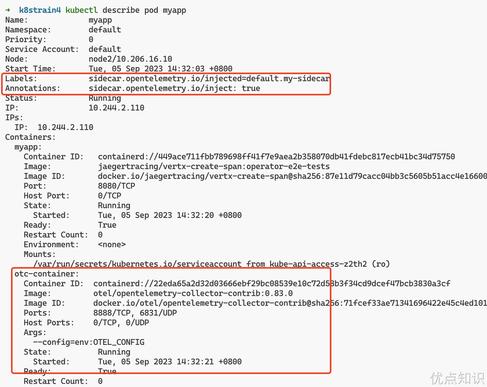
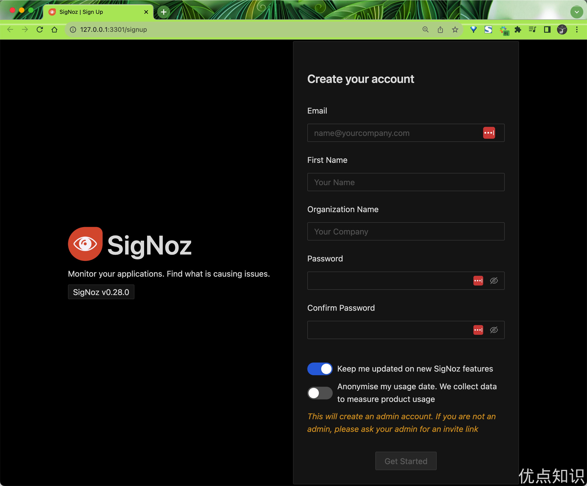
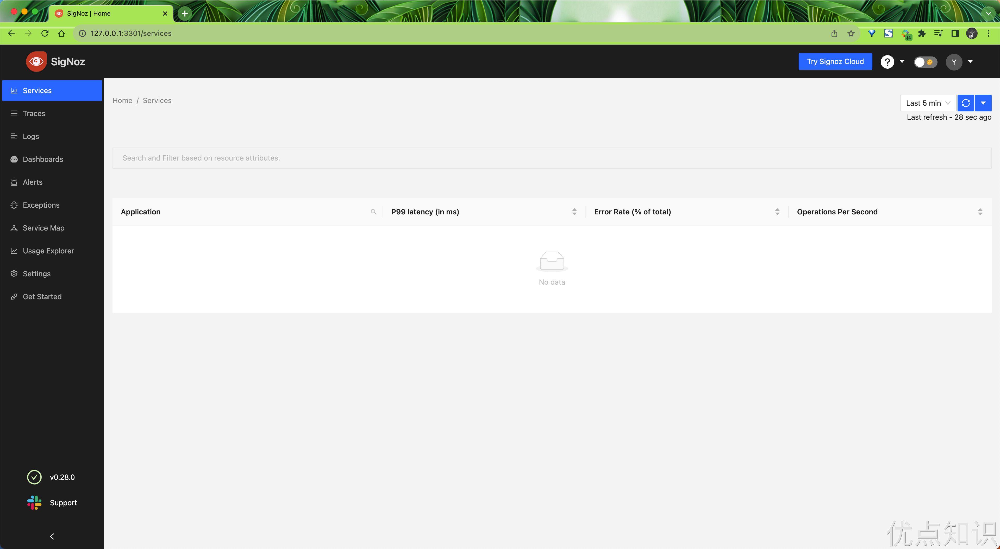
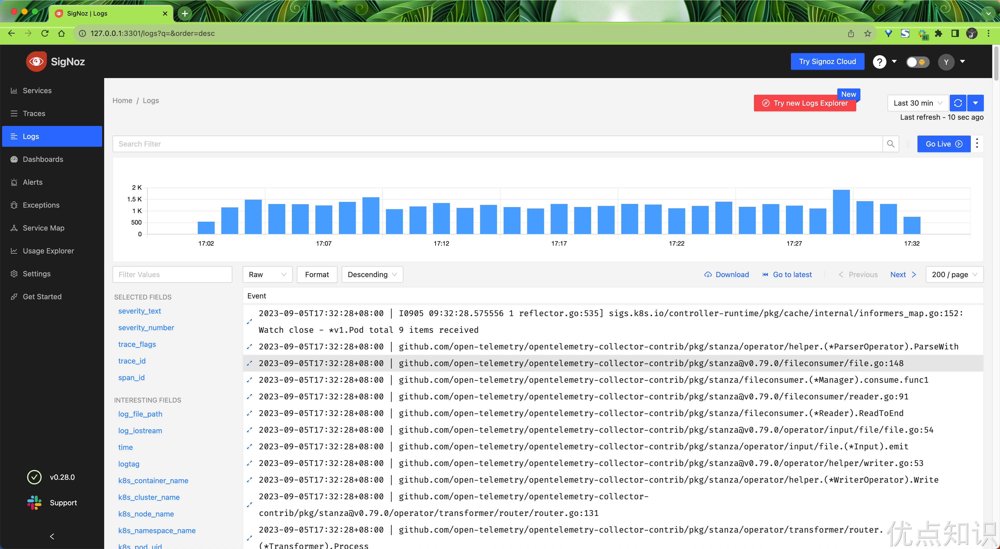
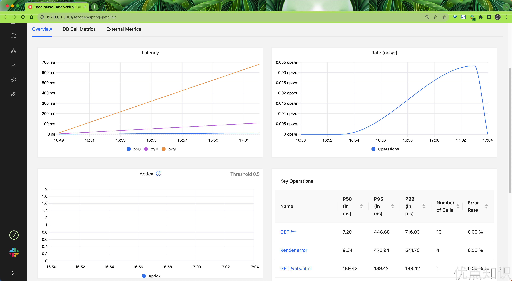
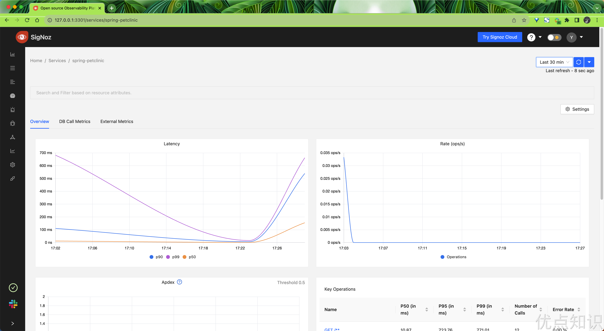

# 45.4 OpenTelemetry Operator

OpenTelemetry Operator 是一个用于部署和管理 OpenTelemetry 组件的 Kubernetes Operator。它是一个自定义的 Kubernetes 控制器，使用 Operator 模式自动化了 OpenTelemetry 环境的部署、配置和管理过程。

OpenTelemetry Operator 简化了在 Kubernetes 环境中部署和管理 OpenTelemetry Collector、OpenTelemetry Agent 等组件的流程。它可以通过 CRD 对 OpenTelemetry 组件进行集中化的管理。使用 OpenTelemetry Operator，可以轻松地在 Kubernetes 集群中创建、配置和管理 OpenTelemetry 组件的实例。它提供了许多有用的功能，例如自动创建和管理配置文件、自动注入收集器和代理配置、自动监视和扩展等。


### 部署

这里我们使用 Helm Chart 来部署 OpenTelemetry Operator，首先添加 Helm Chart 仓库：

```bash
$ helm repo add open-telemetry https://open-telemetry.github.io/opentelemetry-helm-charts
$ helm repo update
```

默认情况下会部署一个准入控制器，用于验证 OpenTelemetry Operator 的配置是否正确，为了使 APIServer 能够与 Webhook 组件进行通信，Webhook 需要一个由 APIServer 配置为可信任的 TLS 证书。有几种不同的方法可以用来生成/配置所需的 TLS 证书。

- 最简单的（默认）方法是安装 cert-manager 并将 `admissionWebhooks.certManager.create` 设置为 true。这样，cert-manager 就会生成一个自签名的证书。
- 可以通过配置 `admissionWebhooks.certManager.issuerRef` 值来提供自己的颁发者。需要指定类型（Issuer 或 ClusterIssuer）和名称。请注意，此方法还是需要安装 cert-manager。
- 可以通过将 `admissionWebhooks.certManager.enabled` 设置为 false 并将 `admissionWebhooks.autoGenerateCert` 设置为 true 来使用自动生成的自签名证书。Helm 将创建一个自签名证书和一个对应的 Secret。
- 可以通过将 `admissionWebhooks.certManager.enabled` 和 `admissionWebhooks.autoGenerateCert` 设置为 false 来使用自己生成的自签名证书。需要向 `admissionWebhooks.cert_file`、`admissionWebhooks.key_file` 和 `admissionWebhooks.ca_file` 提供必要的值。
- 可以通过禁用 `.Values.admissionWebhooks.create` 和 `admissionWebhooks.certManager.enabled` 来通过路径挂载自定义 Webhooks 和证书，同时在 `admissionWebhooks.secretName` 中设置自定义证书 Secret 名称。
- 可以通过禁用 `.Values.admissionWebhooks.create` 并将 env var 设置为 `ENABLE_WEBHOOKS: "false"` 来完全禁用 Webhooks。

为了简单我们这里可以选择第三种方式，直接使用自动生成的自签名证书，直接使用下面的命令一键安装 OpenTelemetry Operator：

```bash
$ helm upgrade --install --set admissionWebhooks.certManager.enabled=false --set admissionWebhooks.certManager.autoGenerateCert=true opentelemetry-operator open-telemetry/opentelemetry-operator --namespace kube-otel --create-namespace

Release "opentelemetry-operator" does not exist. Installing it now.
NAME: opentelemetry-operator
LAST DEPLOYED: Tue Sep  5 11:23:29 2023
NAMESPACE: kube-otel
STATUS: deployed
REVISION: 1
NOTES:
opentelemetry-operator has been installed. Check its status by running:
  kubectl --namespace kube-otel get pods -l "release=opentelemetry-operator"

Visit https://github.com/open-telemetry/opentelemetry-operator for instructions on how to create & configure OpenTelemetryCollector and Instrumentation custom resources by using the Operator.
```

正常部署完成后可以看到对应的 Pod 已经正常运行：

```bash
$ kubectl get pods -n kube-otel -l app.kubernetes.io/name=opentelemetry-operator
NAME                                      READY   STATUS    RESTARTS   AGE
opentelemetry-operator-6f77dc895c-924gf   2/2     Running   0          3m30s
```

此外还会自动为我们添加两个 OpenTelemetry 相关的 CRD：

```bash
$ kubectl get crd |grep opentelemetry
instrumentations.opentelemetry.io           2023-09-05T03:23:28Z
opentelemetrycollectors.opentelemetry.io    2023-09-05T03:23:28Z
```

到这里 OpenTelemetry Operator 就部署完成了。


### 配置

OpenTelemetry Operator 可以通过 CRD 来管理 OpenTelemetry 组件，其有 3 种不同的部署模式可用：

- DaemonSet
- Sidecar
- Deployment（默认模式）

`OpenTelemetryCollector` 类型的 CustomResource 暴露一个名为 `.Spec.Mode` 的属性，该属性可用于指定收集器是否应作为 DaemonSet、Sidecar 或 Deployment（默认）运行。

**Deployment 模式**

我们可以订阅一个如下所示的 `OpenTelemetryCollector` CRD，用来部署一个 Deployment 模式的 OpenTelemetry Collector：

```yaml
$ kubectl apply -f - <<EOF
apiVersion: opentelemetry.io/v1alpha1
kind: OpenTelemetryCollector
metadata:
  name: simplest
spec:
  mode: deployment
  config: |
    receivers:
      otlp:
        protocols:
          grpc:
          http:
    processors:
      batch:
    exporters:
      logging:
    service:
      pipelines:
        traces:
          receivers: [otlp]
          processors: [batch]
          exporters: [logging]
EOF
```

上面的 otelcol 示例使用 gRPC 和 HTTP 协议接收 OTLP 跟踪数据，对数据进行批处理并将其记录到控制台。应用该资源对象后，OpenTelemetry Operator 将创建一个名为 `simplest` 的 Deployment，该 Deployment 将运行一个 OpenTelemetry Collector 实例，该实例将使用上面的配置来接收、处理和导出跟踪数据。

```bash
$ kubectl get opentelemetrycollectors
NAME       MODE         VERSION   READY   AGE     IMAGE                                         MANAGEMENT
simplest   deployment   0.83.0    1/1     3m22s   otel/opentelemetry-collector-contrib:0.83.0   managed
$ kubectl get pods
NAME                                     READY   STATUS    RESTARTS       AGE
simplest-collector-6d9886f5d-shgdb       1/1     Running   0              3m30s
$ kubectl get svc
NAME                            TYPE        CLUSTER-IP       EXTERNAL-IP   PORT(S)                        AGE
kubernetes                      ClusterIP   10.96.0.1        <none>        443/TCP                        179d
simplest-collector              ClusterIP   10.108.169.24    <none>        4317/TCP,4318/TCP              3m43s
simplest-collector-headless     ClusterIP   None             <none>        4317/TCP,4318/TCP              3m43s
simplest-collector-monitoring   ClusterIP   10.103.173.212   <none>        8888/TCP                       3m43s
```

接下来我们可以按照以下步骤来安装一个 `telemetrygen` 工具，然后将示例跟踪发送到这个收集器进行测试：

```bash
$ go install github.com/open-telemetry/opentelemetry-collector-contrib/cmd/telemetrygen@latest
```

然后转发 OTLP 服务的 gRPC 端口：

```bash
$ kubectl port-forward service/simplest-collector 4317
```

在另一个终端中，执行以下命令以使用 `telemetrygen` 发送跟踪数据：

```bash
$ telemetrygen traces --traces 1 --otlp-endpoint localhost:4317 --otlp-insecure
```

然后我们可以查看采集器对应的日志，正常可以看到如下所示的日志：

```bash
$ kubectl logs -l app.kubernetes.io/name=simplest-collector
2023-09-05T06:18:43.299Z        info    TracesExporter  {"kind": "exporter", "data_type": "traces", "name": "logging", "resource spans": 1, "spans": 2}
```

最后，请确保清理 otelcol 实例。

```bash
$ kubectl delete otelcol simplest
```

**DaemonSet 模式**

同样，OpenTelemetry Collector 实例可以使用 DaemonSet 模式部署，这确保所有（或部分）节点运行收集器 pod 的副本。
对于 DaemonSet，只有 `Spec.Mode` 属性会更新为 `daemonset`。而前面的 otelcol YAML 示例中的配置可以保持原样，也可以根据需要进行更新。

DaemonSet 适用于诸如日志收集守护程序、存储守护程序和节点监控守护程序等任务。在这些情况下，需要在每个节点上运行一个收集器实例，以便从每个节点收集数据，前面其实我们已经介绍过。

**Sidecar 模式**

通过将 pod 注解 `sidecar.opentelemetry.io/inject` 设置为 `true` 或来自同一命名空间的具体 `OpenTelemetryCollector` 的名称，可以将具有 OpenTelemetry Collector 的 sidecar 注入到基于 pod 的工作负载中。

如下所示是创建一个以 jaeger 作为输入并将输出记录到控制台的 Sidecar 的示例：

```bash
$ kubectl apply -f - <<EOF
apiVersion: opentelemetry.io/v1alpha1
kind: OpenTelemetryCollector
metadata:
  name: my-sidecar
spec:
  mode: sidecar
  config: |
    receivers:
      jaeger:
        protocols:
          thrift_compact:
    processors:
    exporters:
      logging:
    service:
      pipelines:
        traces:
          receivers: [jaeger]
          processors: []
          exporters: [logging]
EOF
```

该示例将创建一个名为 `my-sidecar` 的 OpenTelemetry Collector sidecar，该 sidecar 将从 Jaeger 接收跟踪数据并将其记录到控制台。

```bash
$ kubectl get opentelemetrycollectors
NAME         MODE      VERSION   READY   AGE   IMAGE   MANAGEMENT
my-sidecar   sidecar   0.83.0            11s           managed
```

接下来，我们使用一个 jaeger 示例镜像来创建一个 Pod，并将 `sidecar.opentelemetry.io/inject` 注解设置为 `true`：

```bash
$ kubectl apply -f - <<EOF
apiVersion: v1
kind: Pod
metadata:
  name: myapp
  annotations:
    sidecar.opentelemetry.io/inject: "true"  # 注入 otelcol sidecar
spec:
  containers:
  - name: myapp
    image: jaegertracing/vertx-create-span:operator-e2e-tests
    ports:
      - containerPort: 8080
        protocol: TCP
EOF
```

应用该 Pod 后，OpenTelemetry Operator 会将上面定义的 `my-sidecar` 采集器作为 sidecar 注入到 Pod 中，该容器将运行一个 OpenTelemetry Collector 实例，该实例将使用上面的配置来接收、处理和导出跟踪数据。

```bash
$ kubectl get pods myapp
NAME    READY   STATUS    RESTARTS   AGE
myapp   2/2     Running   0          110s
```



这里我们可以转发下 myapp pod 的 8080 端口：

```bash
$ kubectl port-forward pod/myapp 8080:8080
```

然后在另一个终端中，使用 curl 发送 HTTP 请求：

```bash
$ curl http://localhost:8080
Hello from Vert.x!
```

然后可以查看 Sidecar 容器的输出日志，正常可以看到如下所示的 Trace 日志：

```bash
$ kubectl logs pod/myapp -c otc-container
# .......
2023-09-05T06:45:56.648Z        info    TracesExporter  {"kind": "exporter", "data_type": "traces", "name": "logging", "resource spans": 1, "spans": 4}
2023-09-05T06:45:56.648Z        info    TracesExporter  {"kind": "exporter", "data_type": "traces", "name": "logging", "resource spans": 1, "spans": 5}
2023-09-05T06:46:04.638Z        info    TracesExporter  {"kind": "exporter", "data_type": "traces", "name": "logging", "resource spans": 1, "spans": 4}
2023-09-05T06:46:04.638Z        info    TracesExporter  {"kind": "exporter", "data_type": "traces", "name": "logging", "resource spans": 1, "spans": 5}
```

最后记得清理 Sidecar 和 myapp pod:

```bash
$ kubectl delete otelcol/my-sidecar
$ kubectl delete pod/myapp
```


### 自动埋点注入

OpenTelemetry Operator 除了可以管理 OpenTelemetry Collector 之外，还可以注入和配置 OpenTelemetry 自动追踪库。

**埋点资源配置**

目前，支持 Java、NodeJS、Python 和 DotNet、Golang 语言的埋点。当以下注解应用于工作负载或命名空间时，将启用仪器化。

- `instrumentation.opentelemetry.io/inject-java: "true"` — 对于 Java
- `instrumentation.opentelemetry.io/inject-nodejs: "true"` — 对于 NodeJS
- `instrumentation.opentelemetry.io/inject-python: "true"` — 对于 Python
- `instrumentation.opentelemetry.io/inject-go: "true"` - 对于 Golang
- `instrumentation.opentelemetry.io/inject-dotnet: "true"` — 对于 DotNet
- `instrumentation.opentelemetry.io/inject-sdk: "true"` - 仅适用于 OpenTelemetry SDK 环境变量

> Go 语言的自动埋点功能目前是默认禁用的，如果要开启，则需要启用 Operator 中的 `operator.autoinstrumentation.go` feature gate 参数。


注解的可能值有：

- `true` - 从命名空间注入和埋点资源。
- `my-instrumentation` - 当前命名空间中 `Instrumentation` CR 实例的名称。
- `my-other-namespace/my-instrumentation` - 另一个命名空间中 `Instrumentation` CR 实例的名称和命名空间。
- `false` -不注入。

与其他语言的自动插装（auto-instrumentation）不同，Go通过运行在 Sidecar 中的 eBPF 代理工作。当选择使用时，Operator 会将这个 Sidecar 注入到您的 pod 中。除了上述提到的 `instrumentation.opentelemetry.io/inject-go` 注解之外，您还必须为 `OTEL_GO_AUTO_TARGET_EXE` 环境变量提供一个值。您可以通过`instrumentation.opentelemetry.io/otel-go-auto-target-exe` 注解来设置这个环境变量的值。

```yaml
instrumentation.opentelemetry.io/inject-go: 'true'
instrumentation.opentelemetry.io/otel-go-auto-target-exe: '/path/to/container/executable'
```

这个环境变量也可以通过 `Instrumentation` 资源来设置，注解具有优先权。由于 Go 自动注入需要设置 `OTEL_GO_AUTO_TARGET_EXE`，您必须通过注解或 `Instrumentation` 资源提供有效的可执行路径。未设置此值会导致注入的埋点功能中止，保持原始的 Pod 未改变。

由于 Go 自动注入使用 eBPF，还需要提升的权限。当您选择加入时，Operator 注入的 Sidecar 将需要以下权限：
```yaml
securityContext:
  capabilities:
    add:
      - SYS_PTRACE
  privileged: true
  runAsUser: 0
```

在使用自动插桩之前，我们需要使用 SDK 和插桩的配置来配置一个 `Instrumentation` 资源。

`Instrumentation` 由以下属性组成：

- `exporter.endpoint` -（可选）将遥测数据发送到 OTLP 格式的地址。
- `propagators` - 使所有数据源能够共享底层上下文机制，用于在事务的整个生命周期中存储状态和访问数据。
- `sampler` - 通过减少收集和发送到后端的跟踪样本数量来引入的噪音和开销的机制。 OpenTelemetry 提供两种类型：`StaticSampler` 和 `TraceIDRatioBased`。
- 语言属性，即 `java`、`nodejs`、`python` 和 `dotnet` - 根据 pod 注解中设置的语言，使用自动插桩的自定义镜像。

**安装 SigNoz**

下面我们准备使用 [SigNoz](https://github.com/signoz/signoz) 来作为 OTLP 接收器。SigNoz 是一个开源 APM，它可以帮助开发人员监控他们的应用程序并解决问题，是 DataDog、NewRelic 等的开源替代品。开源应用程序性能监控 (APM) 和可观察性工具。

要使用 SigNoz 自然我们需要首先安装，同样我们可以使用 Helm Chart 来部署 SigNoz：

```bash
$ helm repo add signoz https://charts.signoz.io
# 配置一个全局的 StorageClass 对象
$ helm upgrade --install signoz signoz/signoz --set global.storageClass=cfsauto --namespace kube-otel --create-namespace
Release "signoz" does not exist. Installing it now.
coalesce.go:175: warning: skipped value for zookeeper.initContainers: Not a table.
NAME: signoz
LAST DEPLOYED: Tue Sep  5 15:14:34 2023
NAMESPACE: kube-otel
STATUS: deployed
REVISION: 1
NOTES:
1. You have just deployed SigNoz cluster:

- frontend version: '0.28.0'
- query-service version: '0.28.0'
- alertmanager version: '0.23.3'
- otel-collector version: '0.79.6'
- otel-collector-metrics version: '0.79.6'

2. Get the application URL by running these commands:

  export POD_NAME=$(kubectl get pods --namespace kube-otel -l "app.kubernetes.io/name=signoz,app.kubernetes.io/instance=signoz,app.kubernetes.io/component=frontend" -o jsonpath="{.items[0].metadata.name}")
  echo "Visit http://127.0.0.1:3301 to use your application"
  kubectl --namespace kube-otel port-forward $POD_NAME 3301:3301


If you have any ideas, questions, or any feedback, please share on our Github Discussions:
  https://github.com/SigNoz/signoz/discussions/713
```

隔一会儿时间就可以看到对应的 Pod 已经正常运行：

```bash
$ kubectl get pods -n kube-otel
NAME                                                READY   STATUS    RESTARTS   AGE
chi-signoz-clickhouse-cluster-0-0-0                 1/1     Running   0          7m17s
signoz-alertmanager-0                               1/1     Running   0          13m
signoz-clickhouse-operator-557bdb6b69-tl6qd         2/2     Running   0          13m
signoz-frontend-756fc84cfb-kn6gk                    1/1     Running   0          13m
signoz-k8s-infra-otel-agent-85bw7                   1/1     Running   0          13m
signoz-k8s-infra-otel-agent-8l49k                   1/1     Running   0          13m
signoz-k8s-infra-otel-deployment-86798ddf86-fskll   1/1     Running   0          13m
signoz-otel-collector-6675cb6b-mbzkt                1/1     Running   0          13m
signoz-otel-collector-metrics-c6b457469-554sj       1/1     Running   0          13m
signoz-query-service-0                              1/1     Running   0          13m
signoz-zookeeper-0                                  1/1     Running   0          13m
$ kubectl get svc -n kube-otel
NAME                                 TYPE        CLUSTER-IP       EXTERNAL-IP   PORT(S)                                          AGE
chi-signoz-clickhouse-cluster-0-0    ClusterIP   None             <none>        9000/TCP,8123/TCP,9009/TCP                       11m
signoz-alertmanager                  ClusterIP   10.110.225.12    <none>        9093/TCP                                         19m
signoz-alertmanager-headless         ClusterIP   None             <none>        9093/TCP                                         19m
signoz-clickhouse                    ClusterIP   10.106.164.155   <none>        8123/TCP,9000/TCP                                11m
signoz-clickhouse-operator-metrics   ClusterIP   10.109.230.187   <none>        8888/TCP                                         19m
signoz-frontend                      ClusterIP   10.99.154.149    <none>        3301/TCP                                         19m
signoz-k8s-infra-otel-agent          ClusterIP   10.104.11.195    <none>        13133/TCP,8888/TCP,4317/TCP,4318/TCP             19m
signoz-k8s-infra-otel-deployment     ClusterIP   10.96.76.96      <none>        13133/TCP                                        19m
signoz-otel-collector                ClusterIP   10.109.84.177    <none>        14250/TCP,14268/TCP,8888/TCP,4317/TCP,4318/TCP   19m
signoz-otel-collector-metrics        ClusterIP   10.96.121.34     <none>        13133/TCP                                        19m
signoz-query-service                 ClusterIP   10.105.122.9     <none>        8080/TCP,8085/TCP                                19m
signoz-zookeeper                     ClusterIP   10.100.202.59    <none>        2181/TCP,2888/TCP,3888/TCP                       19m
signoz-zookeeper-headless            ClusterIP   None             <none>        2181/TCP,2888/TCP,3888/TCP                       19m
```

然后我们可以使用下面的方式来访问 SigNoz：

```bash
$ export POD_NAME=$(kubectl get pods --namespace kube-otel -l "app.kubernetes.io/name=signoz,app.kubernetes.io/instance=signoz,app.kubernetes.io/component=frontend" -o jsonpath="{.items[0].metadata.name}")
$ kubectl --namespace kube-otel port-forward $POD_NAME 3301:3301
```

然后就可以通过 `http://127.0.0.1:3301` 访问 SigNoz 了：



第一次访问的时候需要创建一个 admin 账号，根据页面提示创建即可。创建后就可以进入 SigNoz 的主界面了：



此外 SigNoz 还会采集 Kubernetes 集群的日志数据，我们可以在 `Logs` 页面查看：



到这里 SigNoz 就部署完成了。

**注入 OpenTelemetry SDK 环境变量**

我们可以通过使用 `inject-sdk` 来配置 OpenTelemetry SDK，以应用于目前无法自动插桩的应用程序。这会注入环境变量，例如 `OTEL_RESOURCE_ATTRIBUTES`、`OTEL_TRACES_SAMPLER` 和 `OTEL_EXPORTER_OTLP_ENDPOINT`，可以在 `Instrumentation` 中进行配置，但实际上不会提供 SDK。

下面我们来创建一个将 OTLP 接收器作为输入和输出的 Sidecar，将遥测数据发送到 SigNoz 采集器并将日志记录到控制台。

```yaml
$ kubectl apply -f - <<EOF
apiVersion: opentelemetry.io/v1alpha1
kind: OpenTelemetryCollector
metadata:
  name: my-sidecar
spec:
  mode: sidecar
  config: |
    receivers:
      otlp:
        protocols:
          http:
          grpc:
    processors:
      batch:
    exporters:
      logging:
      otlp:
        endpoint: http://signoz-otel-collector.kube-otel.svc.cluster.local:4317
        tls:
          insecure: true
    service:
      pipelines:
        traces:
          receivers: [otlp]
          processors: [batch]
          exporters: [logging, otlp]
        metrics:
          receivers: [otlp]
          processors: [batch]
          exporters: [logging, otlp]
EOF
```

这里我们重新定义了一个 Sidecar 模式的采集器，注意定义的 OTLP 导出器的 endpoint 地址为 `http://signoz-otel-collector.kube-otel.svc.cluster.local:4317`，这是上面我们安装的 Signoz 采集器的地址，当然也可以替换成你自己的 OTLP 接收器地址。

```bash
$ kubectl get opentelemetrycollectors
NAME         MODE      VERSION   READY   AGE    IMAGE   MANAGEMENT
my-sidecar   sidecar   0.83.0            102s           managed
```

**使用 Sidecar**

接下来可以创建一个 `Instrumentation` 实例：

```yaml
$ kubectl apply -f - <<EOF
apiVersion: opentelemetry.io/v1alpha1
kind: Instrumentation
metadata:
  name: my-instrumentation
spec:
  propagators:
    - tracecontext
    - baggage
    - b3
  sampler:
    type: parentbased_always_on
  java:
    image: ghcr.io/open-telemetry/opentelemetry-operator/autoinstrumentation-java:latest
  nodejs:
    image: ghcr.io/open-telemetry/opentelemetry-operator/autoinstrumentation-nodejs:latest
  python:
    image: ghcr.io/open-telemetry/opentelemetry-operator/autoinstrumentation-python:latest
  dotnet:
    image: ghcr.io/open-telemetry/opentelemetry-operator/autoinstrumentation-dotnet:latest
EOF
$ kubectl get instrumentation
NAME                 AGE   ENDPOINT   SAMPLER                 SAMPLER ARG
my-instrumentation   7s               parentbased_always_on
```

在这个资源对象中，我们将 pod 的注解 `instrumentation.opentelemetry.io/inject-java` 和 `sidecar.opentelemetry.io/inject` 设置为 `true`，这样可以在 Kubernetes 中配置工作负载的自动埋点。它会将 OTLP 数据发送到 Sidecar，而 Sidecar 会将数据传递给 SigNoz 收集器。

比如下面的应用程序：

```yaml
$ kubectl apply -f - <<EOF
apiVersion: apps/v1
kind: Deployment
metadata:
  name: spring-petclinic
spec:
  selector:
    matchLabels:
      app: spring-petclinic
  replicas: 1
  template:
    metadata:
      labels:
        app: spring-petclinic
      annotations:
        sidecar.opentelemetry.io/inject: "true"
        instrumentation.opentelemetry.io/inject-java: "true"
    spec:
      containers:
      - name: app
        image: cnych/spring-petclinic:latest
EOF
```

我们只需在 Pod 中添加 `instrumentation.opentelemetry.io/inject-{language}` 注解即可对已部署的工作负载启用自动检测功能。

应用上面的资源对象后，OpenTelemetry Operator 将创建一个名为 `my-sidecar` 的 OpenTelemetry Collector sidecar，该 sidecar 将从应用程序接收跟踪数据并将其发送到 SigNoz 采集器。

同样我们将该应用程序的 8080 端口转发到本地：

```bash
$ kubectl get pods
NAME                               READY   STATUS    RESTARTS   AGE
spring-petclinic-6bcb946c8-jgbfz   2/2     Running   0          28m
$ export POD_NAME=$(kubectl get pod -l app=spring-petclinic -o jsonpath="{.items[0].metadata.name}")
$ kubectl port-forward ${POD_NAME} 8080:8080
```

现在我们在浏览器中访问 `http://localhost:8080` 后就可以来生成遥测数据了。


然后我们可以在 SigNoz 中查看到对应的 Trace 数据。




最后让我们来清理下这些资源对象：

```bash
$ kubectl delete deployment/spring-petclinic
$ kubectl delete instrumentation/my-instrumentation
$ kubectl delete otelcol/my-sidecar
```

**无需 Sidecar 的自动埋点**

OpenTelemetry Operator 还支持无需 Sidecar 的自动埋点。同样我们这里创建将 OTLP 数据发送到 SigNoz 端点的 `Instrumentation` 实例：

```yaml
$ kubectl apply -f - <<EOF
apiVersion: opentelemetry.io/v1alpha1
kind: Instrumentation
metadata:
  name: my-instrumentation
spec:
  exporter:
    endpoint: http://signoz-otel-collector.kube-otel.svc.cluster.local:4317
  propagators:
    - tracecontext
    - baggage
    - b3
  sampler:
    type: parentbased_traceidratio
    argument: "0.25"
  java:
    image: ghcr.io/open-telemetry/opentelemetry-operator/autoinstrumentation-java:latest
  nodejs:
    image: ghcr.io/open-telemetry/opentelemetry-operator/autoinstrumentation-nodejs:latest
  python:
    image: ghcr.io/open-telemetry/opentelemetry-operator/autoinstrumentation-python:latest
  dotnet:
    image: ghcr.io/open-telemetry/opentelemetry-operator/autoinstrumentation-dotnet:latest
EOF
```

注意现在我们定义的 Instrumentation 实例中定义了 `exporter.endpoint` 属性，这样就可以将 OTLP 数据发送到 SigNoz 采集器了。

接下来我们只需要为我们在 K8s 中部署的 Java 工作负载设置 pod 注解 `instrumentation.opentelemetry.io/inject-java` 为`true` 即可。

如下所示是一个带有自动埋点的 spring petclinic 的示例：

```yaml
$ kubectl apply -f - <<EOF
apiVersion: apps/v1
kind: Deployment
metadata:
  name: spring-petclinic
spec:
  selector:
    matchLabels:
      app: spring-petclinic
  replicas: 1
  template:
    metadata:
      labels:
        app: spring-petclinic
      annotations:
        instrumentation.opentelemetry.io/inject-java: "true"
    spec:
      containers:
      - name: app
        image: cnych/spring-petclinic:latest
EOF
$ kubectl get instrumentation
NAME                 AGE   ENDPOINT                                                        SAMPLER                    SAMPLER ARG
my-instrumentation   14s   http://signoz-otel-collector.kube-otel.svc.cluster.local:4317   parentbased_traceidratio   0.25
```

应用部署后则只有一个容器，同样我们将该应用程序的 8080 端口转发到本地：

```bash
$ kubectl get pods
NAME                               READY   STATUS    RESTARTS   AGE
spring-petclinic-9f5fffc88-zt4qx   1/1     Running   0          4m45s
$ export POD_NAME=$(kubectl get pod -l app=spring-petclinic -o jsonpath="{.items[0].metadata.name}")
$ kubectl port-forward ${POD_NAME} 8080:8080
```

然后在浏览器中访问 `http://localhost:8080` 后就可以来生成遥测数据了。



如果在日志数据中加入了 traceId 和 spanId，我们就可以在 SigNoz 中将 trace 和 logs 数据关联起来了。SigNoz 还有报警、Dashboard 等功能，更多功能可以参考 [SigNoz 官方文档](https://signoz.io/docs/)。


> 原文: <https://www.yuque.com/cnych/k8s4/fm6gtfaxdio72mgq>