# 47.GitLab

GitLab 是一个基于 Web 流行开源 Git 仓库管理工具，可以实现代码仓库的管理、代码浏览、问题跟踪、CI/CD 等功能。GitLab 还提供了自己的 CI/CD 工具，可以方便地进行持续集成和持续部署。对于中国地区我们还可以适合国产化的版本：[极狐 GitLab](https://gitlab.cn/)，致力于实现一体化 DevOps 平台。


## 安装

GitLab 官方提供了 Helm 的方式在 Kubernetes 集群中来快速安装，所以我们可以直接使用 Helm 来安装 GitLab。

我们这里的安装环境如下所示：

```bash
$ kubectl get nodes
NAME      STATUS   ROLES           AGE    VERSION
master1   Ready    control-plane   183d   v1.26.2
node1     Ready    <none>          164d   v1.26.3
node2     Ready    <none>          183d   v1.26.2

$ kubectl version
Client Version: version.Info{Major:"1", Minor:"27", GitVersion:"v1.27.4", GitCommit:"fa3d7990104d7c1f16943a67f11b154b71f6a132", GitTreeState:"clean", BuildDate:"2023-07-19T12:20:54Z", GoVersion:"go1.20.6", Compiler:"gc", Platform:"darwin/arm64"}
Kustomize Version: v5.0.1
Server Version: version.Info{Major:"1", Minor:"26", GitVersion:"v1.26.2", GitCommit:"fc04e732bb3e7198d2fa44efa5457c7c6f8c0f5b", GitTreeState:"clean", BuildDate:"2023-02-22T13:32:22Z", GoVersion:"go1.19.6", Compiler:"gc", Platform:"linux/amd64"}

$ helm version
version.BuildInfo{Version:"v3.11.1", GitCommit:"293b50c65d4d56187cd4e2f390f0ada46b4c4737", GitTreeState:"clean", GoVersion:"go1.18.10"}
```

首先要添加极狐 GitLab 的 Helm Chart 仓库：

```bash
$ helm repo add jh-gitlab https://charts.gitlab.cn/
"jh-gitlab" has been added to your repositories
$ helm repo update
```

查看是否添加成功：

```bash
$ helm repo list
NAME      URL
jh-gitlab https://charts.gitlab.cn/
$ helm search repo jh-gitlab
NAME                    CHART VERSION   APP VERSION     DESCRIPTION
jh-gitlab/gitlab        7.3.2           v16.3.2         GitLab is the most comprehensive AI-powered Dev...
jh-gitlab/gitlab-runner 0.55.0          16.2.0          GitLab Runner
```

可以看到极狐 GitLab Chart 的版本是 7.3.2，对应的极狐 GitLab 版本是 16.3.2。

由于极狐 GitLab 包含非常多的组件，包括核心组件（诸如 Registry、Gitaly 等）、可选依赖组件（诸如 PostgreSQL、Redis 等）、可选附件组件（Prometheus、Grafana 等），整体的 Helm Values 文件比较复杂，可以根据自己的需求进行配置。

该 Chart 包是以分布式微服务的方式进行安装的，要搞清楚如何安装，我们需要先了解一下 GitLab 的架构，如下图所示：

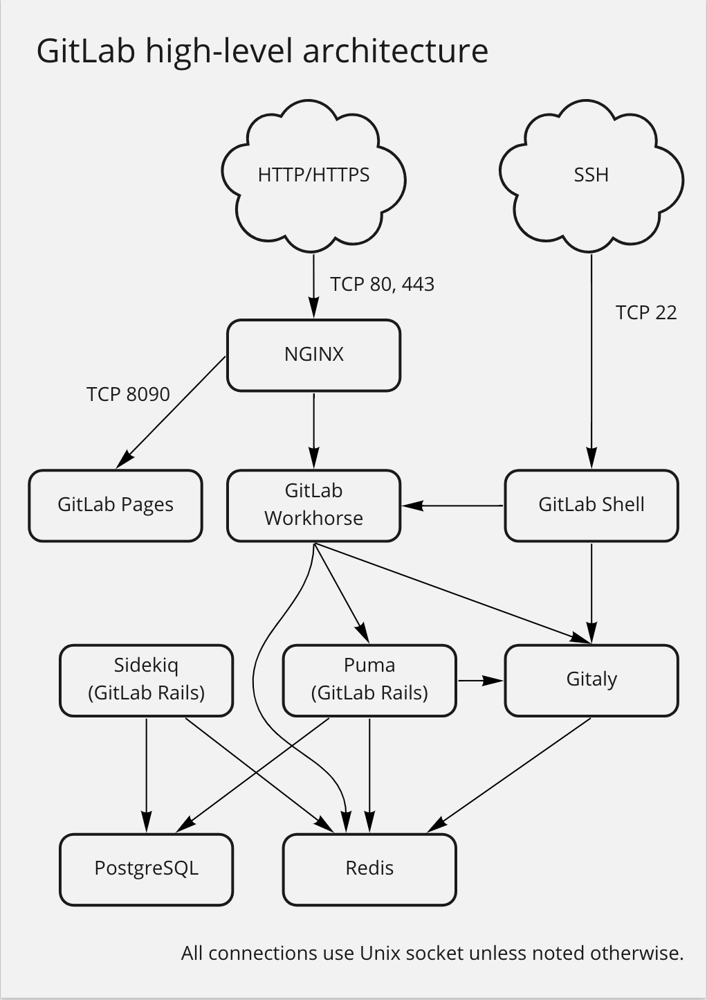

其中主要涉及到以下几个组件：

- `GitLab Workhorse`：轻量级反向代理服务器，可以处理一些大的 HTTP 请求，处理 Git Push/Pull 请求，处理到 Rails 的连接会反向代理给后端的 Puma。
- `Puma`：处理 Web 界面和 API 的请求。从 GitLab 13.0 开始，Puma 是默认的 Web 服务器。Puma 是一个 Ruby 应用程序服务器，用于运行核心 Rails 应用程序，该应用程序在 GitLab 中提供面向用户的功能。
- `GitLab Shell`：用于 SSH 交互，而不是 HTTP。
- `Redis`：缓存每个客户端的 sessions 和后台队列，负责分发任务。
- `Gitaly`：后台服务，专门负责访问磁盘以高效处理 `gitlab-shell` 和 `gitlab-workhorse` 的 git 操作，并缓存耗时操作。所有的 git 操作都通过 Gitaly 处理，并向 GitLab web 应用程序提供一个 API，以从 git 获取属性，并获取 blob 数据。
- `Sidekiq`：后台核心服务，可以从 Redis 队列中提取作业并对其进行处理。后台作业允许 GitLab 通过将工作移至后台来提供更快的请求/响应周期。

当然还有一些其他的组件，比如 `Minio`、`KAS`、`Prometheus` 等，这些都是可选的组件，可以根据自己的需求进行配置。其中 `KAS` 提供了 GitLab 代理服务器，管理 Kubernetes 的 GitLab 代理。

了解了基本的架构之后，我们就可以根据我们自身的需求来配置 Helm Values 文件了，我们这里使用的 `values.yaml` 文件内容如下：

```yaml
global:
  time_zone: "Asia/Shanghai" # 设置gitlab时区
  edition: ce # 设置gitlab版本 ce:社区版 ee:企业版

  hosts:
    domain: k8s.local # 配置根域名，用于gitlab生成（gitlab.k8s.local, kas.k8s.local, minio.k8s.local）
    https: false # 是否启用https访问，关闭 https

  ingress:
    configureCertmanager: false
    provider: nginx
    class: nginx
    enabled: true
    tls:
      enabled: false # 是否开启tls

  minio:
    enabled: true
    # persistence:
    #   enabled: true
    #   storageClass: cfsauto  # 无效
    #   size: 10Gi

# certmanager-issuer: # 证书生成所使用的邮箱
#   email: ych_1024@163.com

certmanager:
  installCRDs: false
  nameOverride: certmanager
  install: false
  rbac:
    create: true

nginx-ingress: &nginx-ingress
  enabled: false

prometheus:
  install: false

redis:
  install: true
  global:
    storageClass: cfsauto

postgresql:
  install: true
  global:
    storageClass: cfsauto

gitlab-runner:
  install: false

gitlab:
  gitaly:
    persistence:
      enabled: true
      storageClass: cfsauto
      size: 10Gi
  kas:
    minReplicas: 1
  gitlab-shell:
    minReplicas: 1
  webservice:
    minReplicas: 1

registry:
  enabled: false
```

这里我们不使用 TLS 访问，但是需要注意的是数据库这些组件的存储，一定要做好持久化工作，配置一个可用的存储类即可。然后使用下面的命令即可一键安装：

```bash
$ helm upgrade --install jh jh-gitlab/gitlab --namespace kube-ops -f gitlab-values.yaml
Release "jh" does not exist. Installing it now.
NAME: jh
LAST DEPLOYED: Sat Sep  9 15:30:31 2023
NAMESPACE: kube-ops
STATUS: deployed
REVISION: 1
NOTES:
=== NOTICE
The minimum required version of PostgreSQL is now 13. See https://gitlab.com/gitlab-org/charts/gitlab/-/blob/master/doc/installation/upgrade.md for more details.

=== WARNING
Automatic TLS certificate generation with cert-manager is disabled.
One or more of the components does not have a TLS certificate Secret configured.
As a result, Self-signed certificates were generated for these components.

You may retrieve the CA root for these certificates from the `jh-wildcard-tls-ca` secret, via the following command. It can then be imported to a web browser or system store.

  kubectl get secret jh-wildcard-tls-ca -ojsonpath='{.data.cfssl_ca}' | base64 --decode > gitlab.k8s.local.ca.pem

If you do not wish to use self-signed certificates, please set the following properties:
- global.ingress.tls.secretName
OR all of:
- global.ingress.tls.enabled (set to `true`)
- gitlab.webservice.ingress.tls.secretName
- minio.ingress.tls.secretName
- gitlab.kas.ingress.tls.secretName
```

安装后，隔一段时间就可以看到所有的组件都已经正常运行了：

```bash
$ kubectl get pods -n kube-ops
NAME                                      READY   STATUS      RESTARTS        AGE
jh-gitaly-0                               1/1     Running     0               2m32s
jh-gitlab-exporter-5cc8fbbdfd-msmk9       1/1     Running     0               2m32s
jh-gitlab-shell-5dc449db95-z5rgb          1/1     Running     0               2m32s
jh-kas-96fc4bbb5-z89z6                    1/1     Running     3 (2m10s ago)   2m32s
jh-migrations-1-vcqkc                     0/1     Completed   0               2m32s
jh-minio-89d5dc58-rqjmc                   1/1     Running     0               2m32s
jh-minio-create-buckets-1-vxz45           0/1     Completed   0               2m32s
jh-postgresql-0                           2/2     Running     0               2m21s
jh-redis-master-0                         2/2     Running     0               2m32s
jh-sidekiq-all-in-1-v2-6fdd868dcb-9zxbz   1/1     Running     0               2m32s
jh-toolbox-67c54d9987-ht8f9               1/1     Running     0               2m32s
jh-webservice-default-6d9986485f-rmsd4    2/2     Running     0               2m32s
$ kubectl get ingress -n kube-ops
NAME                    CLASS   HOSTS                   ADDRESS       PORTS     AGE
jh-kas                  nginx   kas.k8s.local           10.98.12.94   80        31m
jh-minio                nginx   minio.k8s.local         10.98.12.94   80        31m
jh-webservice-default   nginx   gitlab.k8s.local        10.98.12.94   80        31m
```

安装完成后我们就可以通过 `gitlab.k8s.local` 来访问 GitLab 了，但是要注意的是，我们这里是通过 Ingress 的方式来暴露服务的，所以我们需要修改本地的 hosts 文件，将 `gitlab.k8s.local` 指向到 Ingress 的 IP 地址。

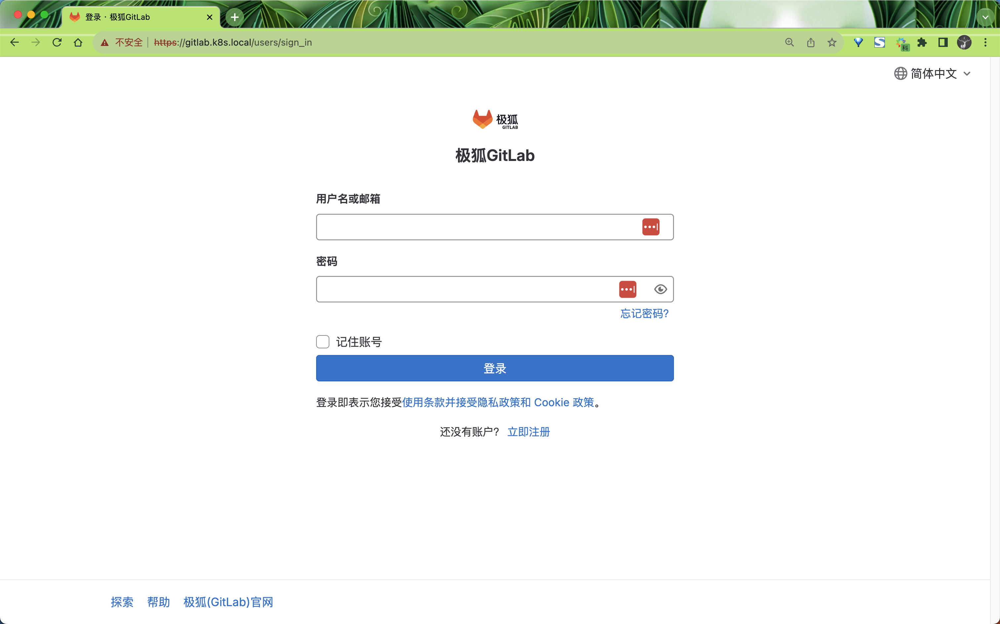

初始用户名为 `root`，密码是以 Secret 的形式存放的：

```bash
$ kubectl -n kube-ops get secret | grep root
jh-gitlab-initial-root-password   Opaque               1      58m

$ kubectl -n kube-ops get secret jh-gitlab-initial-root-password -o=jsonpath='{.data.password}' | base64 -d
1TkQrZQFMiqhvpgZR5E96ncnbOBQcDboXFwQ05PExuFDYwwc5x0cyjAyRSzIPeFd
```

使用上述密码以及 root 用户名即可登录极狐 GitLab 实例：

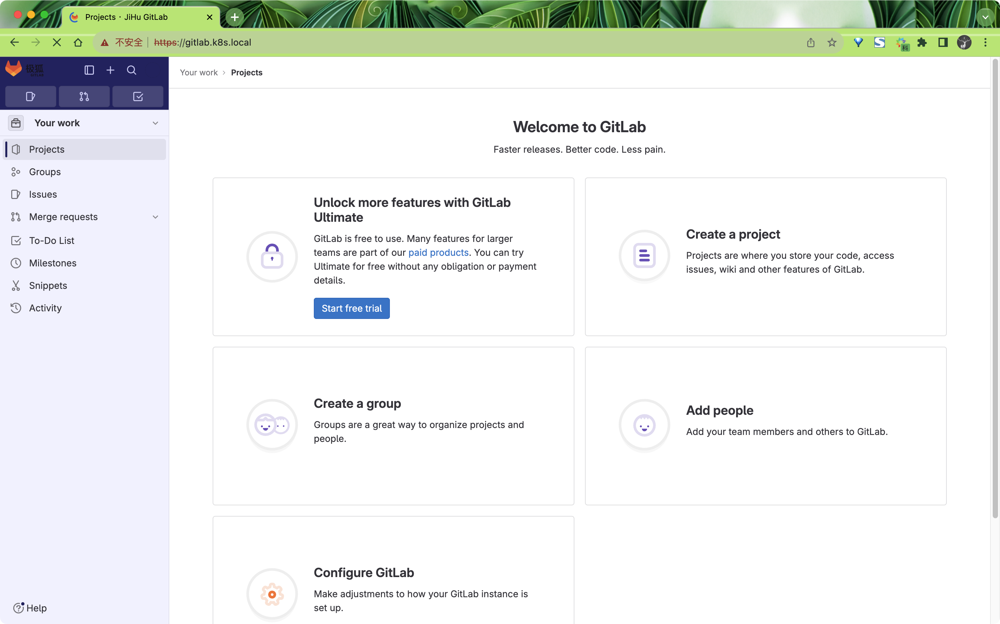

然后可以前往 [https://gitlab.k8s.local/-/profile/password/edit](https://gitlab.k8s.local/-/profile/password/edit) 页面修改密码，需要至少 8 位（比如 `root@321`），还可以修改用户名、语言等信息。


然后我们可以创建一个实例仓库来测试下：

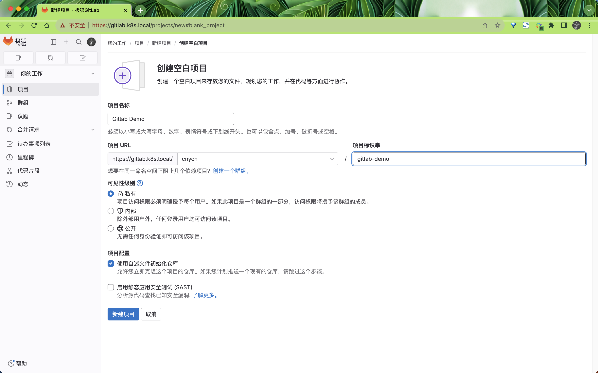

创建完成后，我们可以添加本地用户的一个 SSH-KEY，这样我们就可以通过 SSH 来拉取或者推送代码了。SSH 公钥通常包含在 `~/.ssh/id_rsa.pub`文件中，并以 ssh-rsa 开头。如果没有的话可以使用 ssh-keygen 命令来生成，`id_rsa.pub` 里面的内容就是我们需要的 SSH 公钥，然后添加到 Gitlab 中。

如果我们通过 SSH 方式去获取代码，这里需要注意我们服务的暴露方式，我们这里是通过 ingress-nginx 来暴露的服务，属于 7 层服务，而且我们这里本地是通过 LoadBalancer 去接入的 Ingress 流量，要通过 SSH 方式去获取代码，实际上是通过 gitlab-shell 组件来实现的，所以我们需要通过 ingress-nginx 去暴露 gitlab-shell 组件的 TCP 服务，这样我们才能通过 SSH 方式去获取代码。

```bash
$ kubectl get svc jh-gitlab-shell -n kube-ops
jh-gitlab-shell          ClusterIP   10.108.128.219   <none>        22/TCP                                27m
```

可以看到 gitlab-shell 的端口是 22，所以我们需要在 ingress-nginx 中添加一个 TCP 的暴露规则，上面使用 Helm Chart 方式安装后会自动创建：

```yaml
$ kubectl get cm -n kube-ops jh-nginx-ingress-tcp -oyaml
apiVersion: v1
data:
  "22": 'kube-ops/jh-gitlab-shell:22::'
kind: ConfigMap
metadata:
  annotations:
    meta.helm.sh/release-name: jh
    meta.helm.sh/release-namespace: kube-ops
  creationTimestamp: "2023-09-09T08:56:37Z"
  labels:
    app: gitlab-shell
    app.kubernetes.io/managed-by: Helm
    chart: gitlab-shell-7.3.2
    heritage: Helm
    release: jh
  name: jh-nginx-ingress-tcp
  namespace: kube-ops
```

而且该配置文件是不能被你自己的 ingress-nginx 识别的，所以上面这个 ConfigMap 其实并没有生效，而且如果你使用的是 hostNetwork 模式则可能会和宿主机的 22 端口冲突，这里我们可以修改一下端口，比如修改为 `2222`，比如我们这里的 ingress-nginx 监听的 tcp 配置的 ConfigMap 名为 `ingress-nginx-tcp`，则修改为如下内容：

```yaml
# tcp-ingress.yaml
apiVersion: v1
kind: ConfigMap
metadata:
  name: ingress-nginx-tcp
  namespace: ingress-nginx
data:
  "2222": "kube-ops/jh-gitlab-shell:22::"
```

然后在本地的 `~/.ssh/config` 文件中添加如下配置：

```bash
Host gitlab.k8s.local
  HostName gitlab.k8s.local
  User cnych
  Port 2222
  IdentityFile ~/.ssh/id_rsa
```

现在我们就可以通过 SSH 方式去获取代码了：

```bash
$ git clone git@gitlab.k8s.local:cnych/gitlab-demo.git
Cloning into 'gitlab-demo'...
The authenticity of host '[gitlab.k8s.local]:2222 ([43.137.15.212]:2222)' can't be established.
ED25519 key fingerprint is SHA256:X/LdrDCX1kxg/jqye2LJEHZfxONPm6iFUX2rwyUjuaY.
This key is not known by any other names
Are you sure you want to continue connecting (yes/no/[fingerprint])? yes
Warning: Permanently added '[gitlab.k8s.local]:2222' (ED25519) to the list of known hosts.
remote: Enumerating objects: 3, done.
remote: Counting objects: 100% (3/3), done.
remote: Compressing objects: 100% (2/2), done.
remote: Total 3 (delta 0), reused 0 (delta 0), pack-reused 0
Receiving objects: 100% (3/3), done.
```

同样现在我们也可以提交代码到 GitLab 了：

```bash
$ cd gitlab-demo/
$ echo "Hello GitLab Helm Chart" > README.md
$ git add .
$ git commit -m "add README.md"
[main 9deb0d5] add README.md
 1 file changed, 1 insertion(+), 92 deletions(-)
$ git push origin main
Enumerating objects: 5, done.
Counting objects: 100% (5/5), done.
Delta compression using up to 10 threads
Compressing objects: 100% (1/1), done.
Writing objects: 100% (3/3), 268 bytes | 268.00 KiB/s, done.
Total 3 (delta 0), reused 0 (delta 0), pack-reused 0
To gitlab.k8s.local:cnych/gitlab-demo.git
   36c0acb..9deb0d5  main -> main
```

我们可以在 GitLab 的 Web 界面上看到提交的代码了：

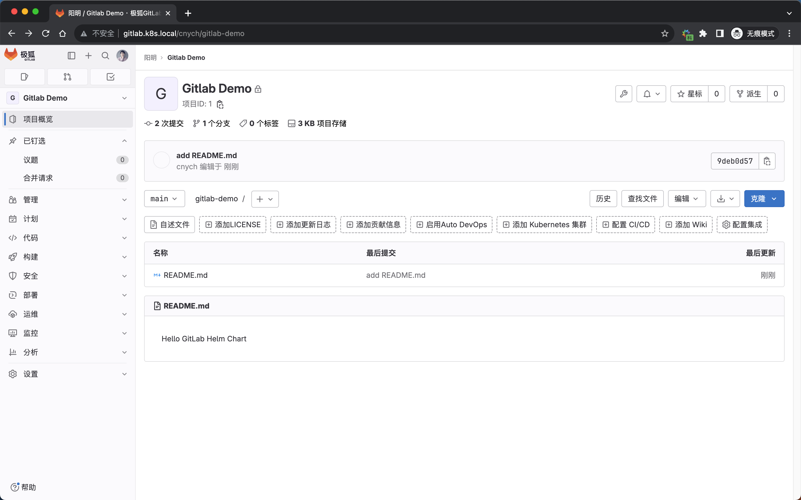

到这里我们就完成了 GitLab 的安装。如果你想要了解更多的 GitLab 的使用，可以参考 [GitLab 官方文档](https://docs.gitlab.cn/)。


## 触发 Jenkins 构建

到这里我们完成了 GitLab 和 Jenkins 的安装，其实我们还可以将 GitLab 和 Jenkins 结合起来使用，这样当我们提交代码到 GitLab 时，就可以触发 Jenkins 的构建了。

我们可以通过 GitLab 的 Web 界面来触发 Jenkins 的构建，首先我们需要在 Jenkins 中创建一个 Pipeline 项目，然后在 GitLab 中配置 Webhook，这样当我们提交代码到 GitLab 时，就会触发 Jenkins 的构建。

首先需要在 Jenkins 中安装插件 `Generic Webhook Trigger`。

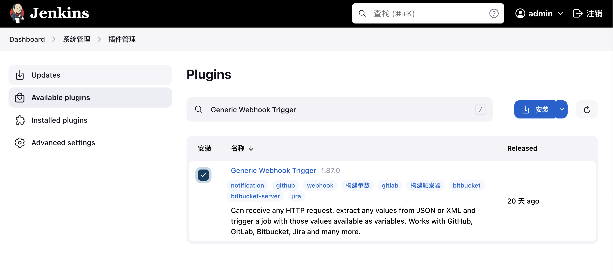

安装完成后，我们重新创建一个新的 Pipeline 任务，然后就可以选择这个触发器了。

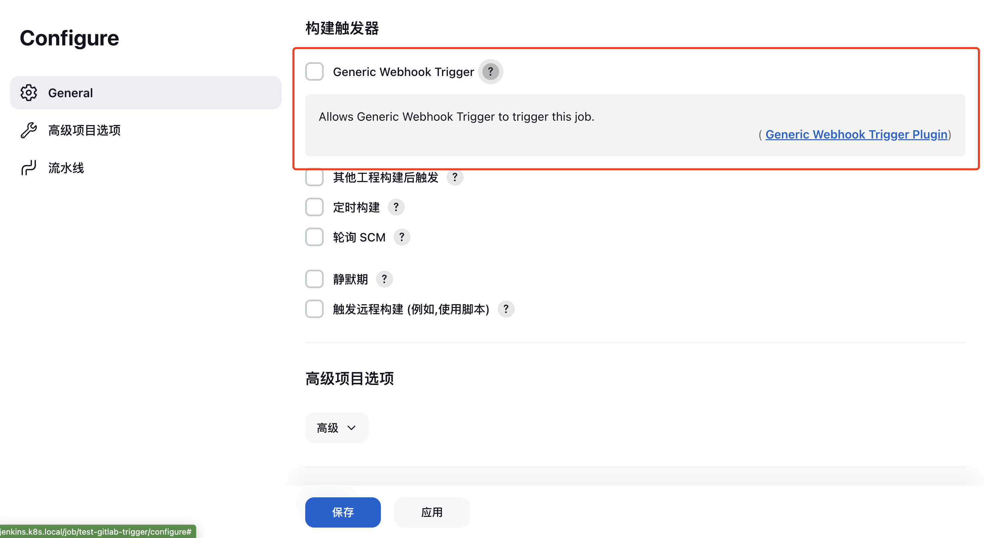

勾选 `Generic Webhook Trigger` 后， 相当于给 Jenkins 加了一个新的接口 `http://JENKINS_URL/generic-webhook-trigger/invoke`。

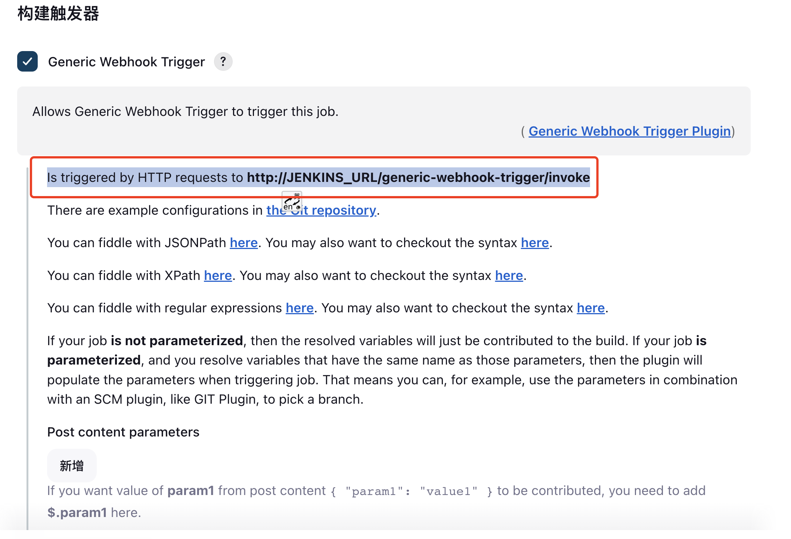

在使用的时候我们需要把 `JENKINS_URL` 换成自己真实的 Jenkins 服务器地址，有端口就加上端口，是域名就写域名。比如我们这里就是 `http://jenkins.k8s.local/generic-webhook-trigger/invoke`。

此外我们还可以为该触发器添加一个 Token，这样可以增加安全性，比如我们这里的 Token 是 `youdianzhishi`。

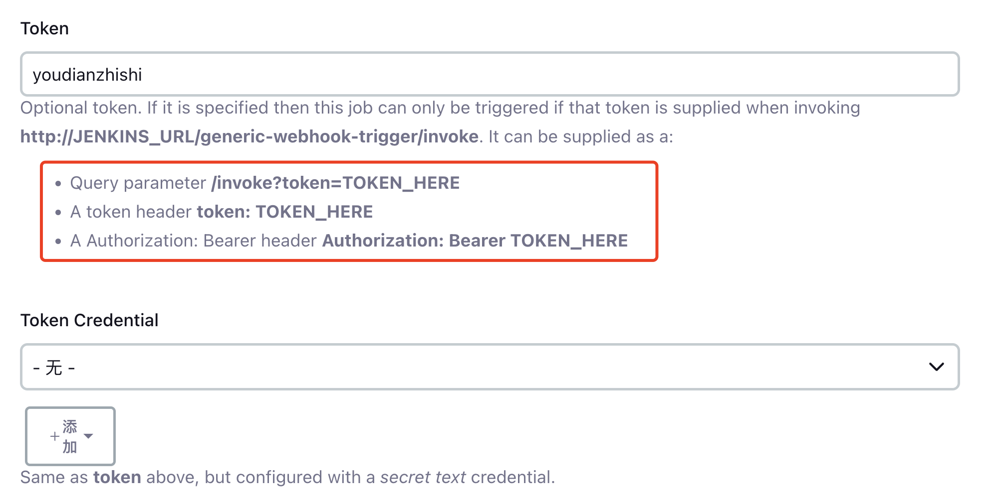

一共有 3 种方式可以使用这个 Token：

- 在 URL 中使用 `token` 参数，比如 `http://jenkins.k8s.local/generic-webhook-trigger/invoke?token=youdianzhishi`。
- 在 HTTP Header 中使用 `token` 参数，比如 `token: youdianzhishi`。
- 通过 HTTP Header 的 Bearer Token 传递，比如 `Authorization: Bearer youdianzhishi`。

此外还可以配置触发条件等等。然后定义流水线代码后保存即可。

这样 Jenkins 就开启 trigger 了，开启后，就可以实现其他系统通过一个指定的 URL 进行自动触发构建了。

就比如我们这里还是使用上面的 `gitlab-demo` 这个仓库。进入 GitLab 项目设置， 进入 Webhook 配置页面;

添加新的 webhook，配置要触发的 URL，即 Jenkins 触发器接口 URL：`http://jenkins.k8s.local/generic-webhook-trigger/invoke?token=youdianzhishi`。然后选择发生哪种 GitLab 事件后触发此 Webhook，例如：Push 提交代码、Tag 创建标签等等；

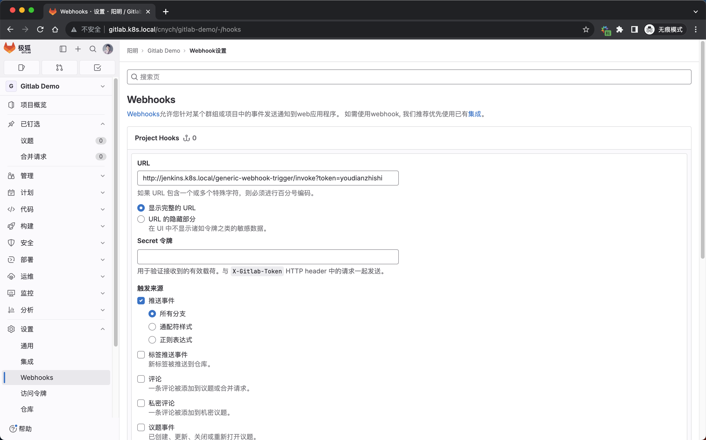

添加后如果出现 `Url is blocked: Requests to the local network are not allowed` 这样的错误信息，则需要进入管理中心 -> 网络页面，路径 `http://gitlab.k8s.local/admin/application_settings/network`，z 找到出站请求，勾选**允许来自 webhooks 和集成对本地网络的请求**。

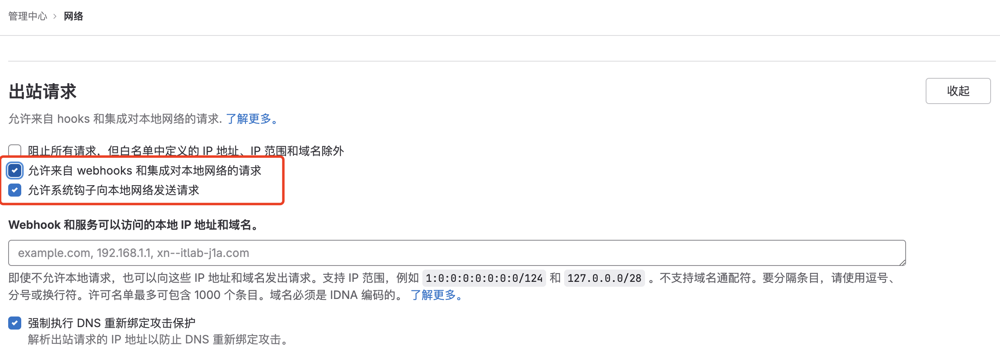

保存后重新再去添加 webhook，就可以成功了，然后我们可以通过测试按钮来测试下是否可以触发 Jenkins 的构建。

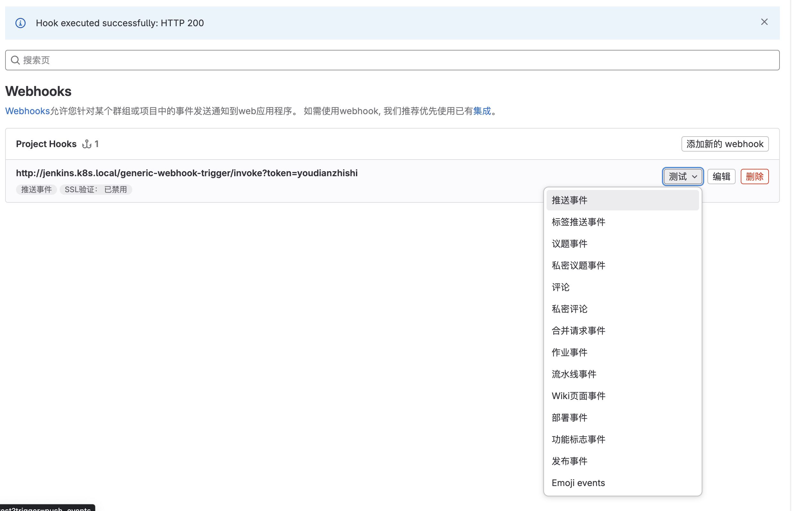

正常情况下，我们可以看到 Jenkins 的构建已经触发了：

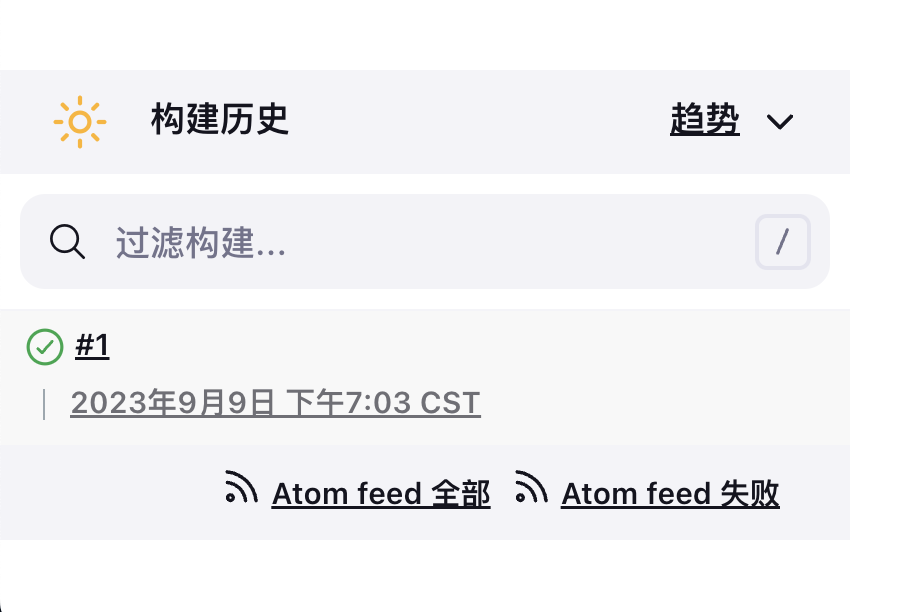

在 GitLab Webhook 这边我们也可以查看到请求日志，如果出现了错误，可以根据日志来进行排查：

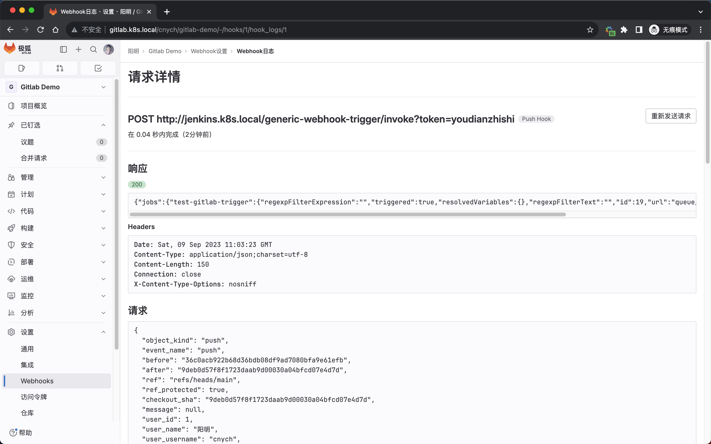

到这里我们就完成了 GitLab 和 Jenkins 的集成，当我们提交代码到 GitLab 时，就可以触发 Jenkins 的构建了，当然还有很多地方是可以优化的，我们将在后面的内容中进行介绍。


> 原文: <https://www.yuque.com/cnych/k8s4/dahg4ld4xedi3l69>