# 48.Jenkins Pipeline

要实现在 Jenkins 中的构建工作，可以有多种方式，我们这里采用比较常用的 Pipeline 这种方式。Pipeline，简单来说，就是一套运行在 Jenkins 上的工作流框架，将原来独立运行于单个或者多个节点的任务连接起来，实现单个任务难以完成的复杂流程编排和可视化的工作。

Jenkins Pipeline 有几个核心概念：

- `Node`：节点，一个 Node 就是一个 Jenkins 节点，Master 或者 Agent，是执行 Step 的具体运行环境，比如我们之前动态运行的 Jenkins Slave 就是一个 Node 节点
- `Stage`：阶段，一个 Pipeline 可以划分为若干个 Stage，每个 Stage 代表一组操作，比如：Build、Test、Deploy，Stage 是一个逻辑分组的概念，可以跨多个 Node
- `Step`：步骤，Step 是最基本的操作单元，可以是打印一句话，也可以是构建一个 Docker 镜像，由各类 Jenkins 插件提供，比如命令：sh 'make'，就相当于我们平时 shell 终端中执行 make 命令一样。

那么我们如何创建 Jenkins Pipline 呢？

- Pipeline 脚本是由 Groovy 语言实现的，但是我们没必要单独去学习 Groovy，当然你会的话最好
- Pipeline 支持两种语法：Declarative(声明式)和 Scripted Pipeline(脚本式)语法
- Pipeline 也有两种创建方法：可以直接在 Jenkins 的 Web UI 界面中输入脚本；也可以通过创建一个 Jenkinsfile 脚本文件放入项目源码库中
- 一般我们都推荐在 Jenkins 中直接从源代码控制中直接载入 Jenkinsfile Pipeline 这种方法

我们这里来给大家快速创建一个简单的 Pipeline，直接在 Jenkins 的 Web UI 界面中输入脚本运行。

-  新建任务：在 Web UI 中点击 `新建任务` -> 输入名称：`pipeline-demo` -> 选择下面的 `流水线` -> 点击 `确定` 
-  配置：在最下方的 Pipeline 区域输入如下 Script 脚本，然后点击保存。 
```groovy
node {
  stage('Clone') {
      echo "1.Clone Stage"
  }
  stage('Test') {
      echo "2.Test Stage"
  }
  stage('Build') {
      echo "3.Build Stage"
  }
  stage('Deploy') {
      echo "4. Deploy Stage"
  }
}
```
 

-  构建：点击左侧区域的 `立即构建`，可以看到 Job 开始构建了 

隔一会儿，构建完成，可以点击左侧区域的 `Console Output`，我们就可以看到如下输出信息：

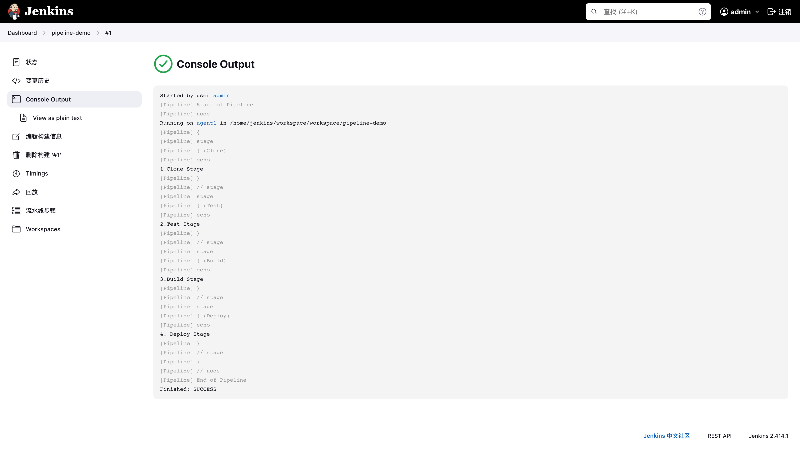

console output 我们可以看到上面我们 Pipeline 脚本中的 4 条输出语句都打印出来了，证明是符合我们的预期的。

如果大家对 Pipeline 语法不是特别熟悉的，可以前往输入脚本的下面的链接 [流水线语法](http://jenkins.k8s.local/job/pipeline-demo/pipeline-syntax) 中进行查看，这里有很多关于 Pipeline 语法的介绍，也可以自动帮我们生成一些脚本。


## 在 Slave 中构建任务

上面我们创建了一个简单的 Pipeline 任务，这个任务是在静态节点上运行的，那么如何让我们的任务跑在动态的 Slave 中呢？前面其实我们已经用过了，可以使用 Pod 模板用于创建 agent 节点，它们可以通过用户界面进行配置，也可以使用 `podTemplate` 步骤在管道中进行配置。无论哪种方式，它都提供对以下字段的访问：

如下：

```groovy
podTemplate(cloud: "Kubernetes") {  // 还可以指定 name
  node(POD_LABEL) {  // POD_LABEL 变量用于引用 Pod 的标签
    stage('Clone') {
        echo "1.Clone Stage"
    }
    stage('Test') {
        echo "2.Test Stage"
    }
    stage('Build') {
        echo "3.Build Stage"
    }
    stage('Deploy') {
        echo "4. Deploy Stage"
    }
  }
}
```

现在我们重新触发立刻构建：

```shell
$ kubectl get pods -n kube-ops
NAME                                      READY   STATUS              RESTARTS        AGE
pipeline-demo-6-fvbts-298xs-2ff1v         1/1     Running   0               3s
jenkins-55c4676f4d-q6rkf                  1/1     Running             0               3d23h
......
```

我们发现多了一个名叫 `pipeline-demo-6-fvbts-298xs-2ff1v` 的 Pod 正在运行，隔一会儿这个 Pod 就不再了。这也证明我们的 Job 构建完成了，同样回到 Jenkins 的 Web UI 界面中查看 Console Output，可以看到如下的信息：

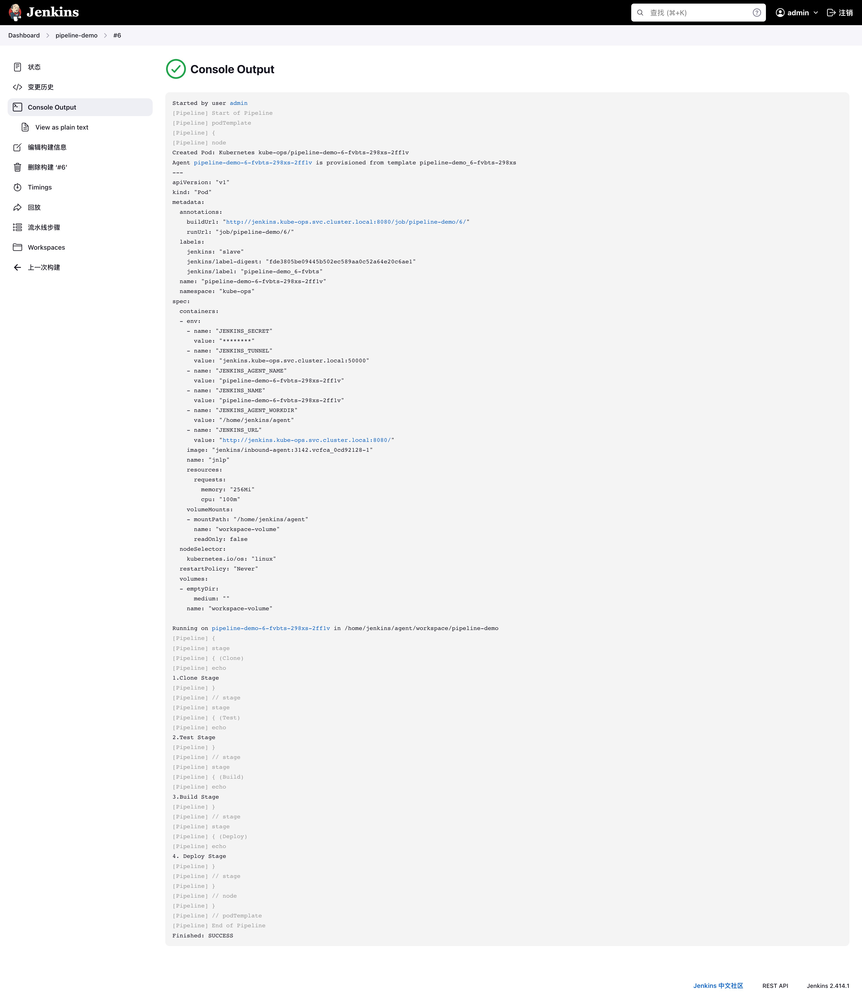

我们回到 Job 的主界面，也可以看到大家可能比较熟悉的 `阶段视图` 界面。

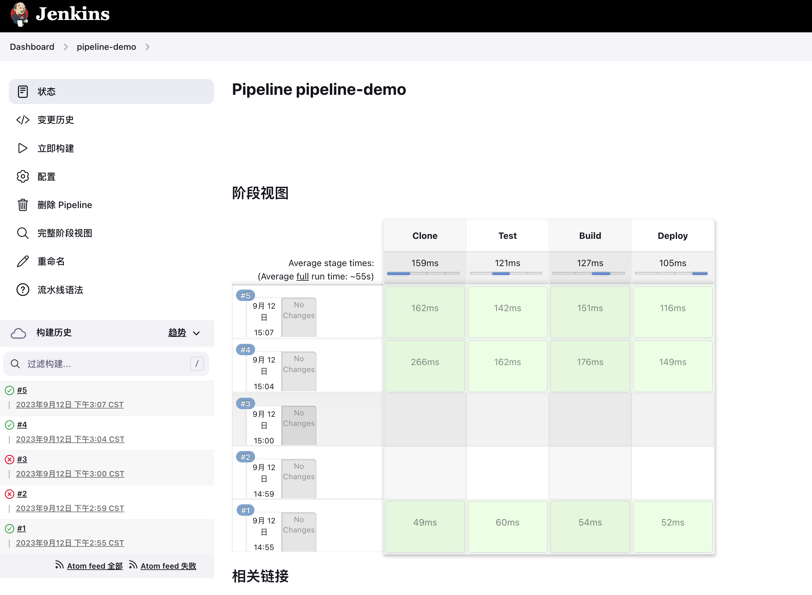

但是需要安装 `Pipeline: Stage View` 这个插件。

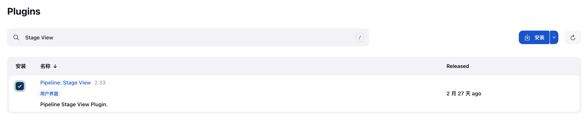


## 部署 Kubernetes 应用

上面我们已经知道了如何在 Jenkins Slave 中构建任务了，那么如何来部署一个原生的 Kubernetes 应用呢？ 要部署 Kubernetes 应用，我们就得对我们之前部署应用的流程要非常熟悉才行，我们之前的流程是怎样的：

- 编写代码
- 测试
- 编写 Dockerfile
- 构建打包 Docker 镜像
- 推送 Docker 镜像到仓库
- 编写 Kubernetes YAML 文件
- 更改 YAML 文件中 Docker 镜像 TAG
- 利用 kubectl 工具部署应用

我们之前在 Kubernetes 环境中部署一个原生应用的流程应该基本上是上面这些流程吧？现在我们就需要把上面这些流程放入 Jenkins 中来自动帮我们完成(当然编码除外)，从测试到更新 YAML 文件属于 CI 流程，后面部署属于 CD 的流程。如果按照我们上面的示例，我们现在要来编写一个 Pipeline 的脚本，应该怎么编写呢？

```groovy
podTemplate(cloud: "Kubernetes") {
    node(POD_LABEL) {
        stage('Clone') {
            echo "1.Clone Stage"
        }
        stage('Test') {
            echo "2.Test Stage"
        }
        stage('Build') {
            echo "3.Build Docker Image Stage"
        }
        stage('Push') {
            echo "4.Push Docker Image Stage"
        }
        stage('YAML') {
            echo "5.Change YAML File Stage"
        }
        stage('Deploy') {
            echo "6.Deploy Stage"
        }
    }
}
```

现在我们创建一个流水线的作业，直接使用上面的脚本来构建，同样可以得到正确的结果：

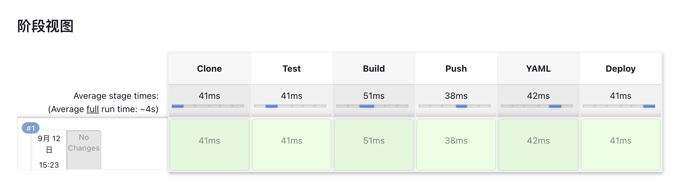

这里我们来将一个简单 golang 程序，部署到 kubernetes 环境中，代码链接：[https://github.com/cnych/drone-k8s-demo](https://github.com/cnych/drone-k8s-demo)。我们将代码推送到我们自己的 GitLab 仓库上去，地址：[http://gitlab.k8s.local/cnych/k8s-demo](http://gitlab.k8s.local/cnych/k8s-demo)，这样让 Jenkins 和 Gitlab 去进行连接进行 CI/CD。

如果按照之前的示例，我们是不是应该像这样来编写 Pipeline 脚本：

第一步，clone 代码
第二步，进行测试，如果测试通过了才继续下面的任务
第三步，由于 Dockerfile 基本上都是放入源码中进行管理的，所以我们这里就是直接构建 Docker 镜像了
第四步，镜像打包完成，就应该推送到镜像仓库中吧
第五步，镜像推送完成，是不是需要更改 YAML 文件中的镜像 TAG 为这次镜像的 TAG
第六步，万事俱备，只差最后一步，使用 kubectl 命令行工具进行部署了

到这里我们的整个 CI/CD 的流程是不是就都完成了。但是我们这里的项目是 golang 代码的，构建需要相应的环境，如果每次需要特定的环境都需要重新去定制下镜像这未免太麻烦了，我们这里可以通过自定义 `podTemplate` 来进行定制。我们可以直接在 Pipeline 中去自定义 Slave Pod 中所需要用到的容器模板，这样我们需要什么镜像只需要在 `Slave Pod Template` 中声明即可，完全不需要去定义一个庞大的 Slave 镜像了。

然后在下面的流水线区域我们可以选择 `Pipeline script` 然后在下面测试流水线脚本，我们这里选择 `Pipeline script from SCM`，意思就是从代码仓库中通过 `Jenkinsfile` 文件获取 `Pipeline script` 脚本定义，然后选择 SCM 来源为 Git（如果为空则需要安装 `git` 插件。），在出现的列表中配置上仓库地址 `http://gitlab.k8s.local/cnych/k8s-demo.git`，由于我们是在一个 Slave Pod 中去进行构建，所以如果使用 SSH 的方式去访问 Gitlab 代码仓库的话就需要频繁的去更新 `SSH-KEY`，所以我们这里采用直接使用用户名和密码的形式来方式：

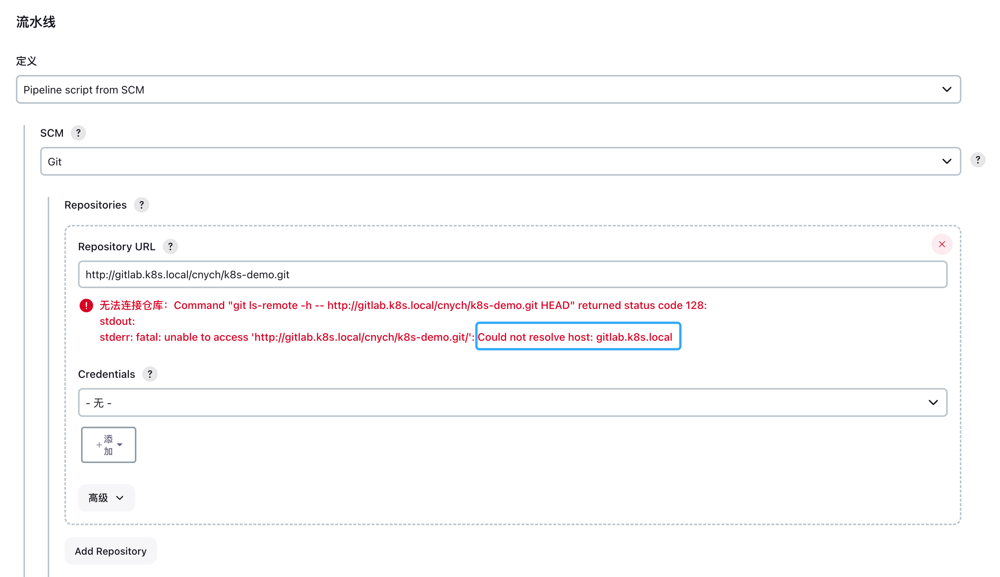

我们可以看到有一个明显的错误 `Could not resolve host: gitlab.k8s.local` 提示不能解析我们的 GitLab 域名，这是因为我们的域名都是自定义的，我们可以通过在 CoreDNS 中添加自定义域名解析来解决这个问题（如果你的域名是外网可以正常解析的就不会出现这个问题了）：

```shell
$ kubectl edit cm coredns -n kube-system
apiVersion: v1
data:
  Corefile: |
    .:53 {
        errors
        health {
           lameduck 5s
        }
        hosts {
          10.206.16.10 jenkins.k8s.local
          10.206.16.10 gitlab.k8s.local
          10.206.16.10 minio.k8s.local
          fallthrough
        }
......
```

修改完成后，隔一小会儿，CoreDNS 就会自动热加载，我们就可以在集群内访问我们自定义的域名了。然后肯定没有权限，所以需要配置帐号认证信息。

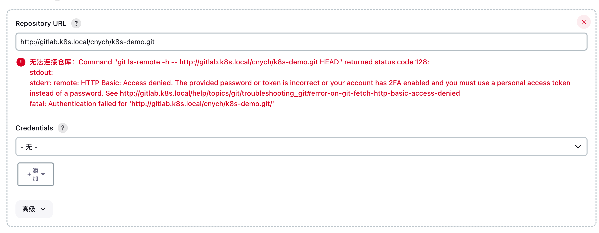

在 `Credentials` 区域点击添加按钮添加我们访问 Gitlab 的用户名和密码：

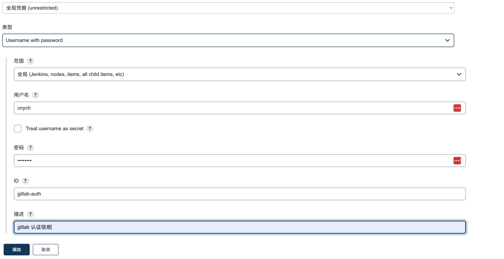

然后需要我们配置用于构建的分支，如果所有的分支我们都想要进行构建的话，只需要将 `Branch Specifier` 区域留空即可，一般情况下不同的环境对应的分支才需要构建，比如 main、dev、test 等，平时开发的 feature 或者 bugfix 的分支没必要频繁构建，我们这里就只配置 main 分支用于构建。

然后还要记得 Webhook Trigger，用于代码提交通知 Jenkins，勾选 `Generic Webhook Trigger`，并添加一个名为 `youdianzhishi` 的 Token，这个 Token 用于后面配置 Gitlab Webhook 的时候使用。

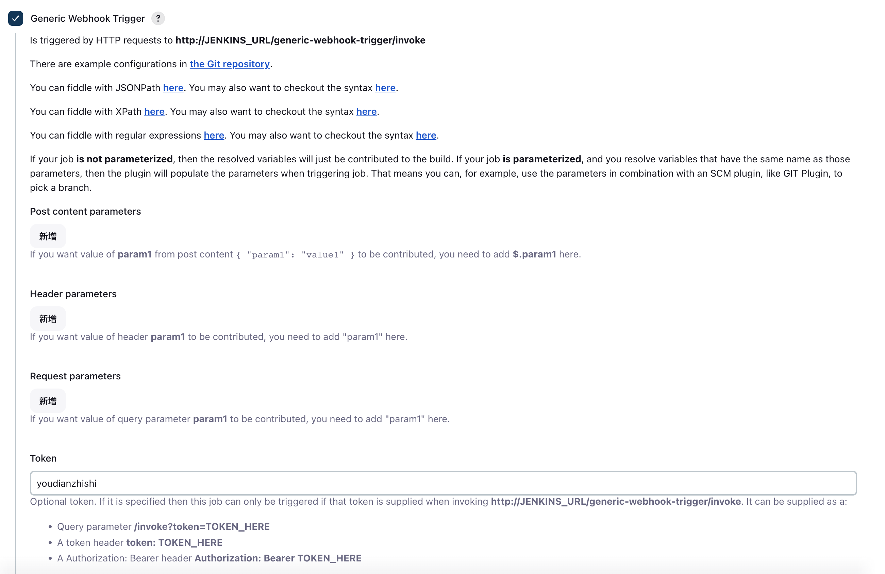

前往 Gitlab 中配置项目的 Webhook，`设置 -> Webhooks`，填写上面得到的 trigger 地址：

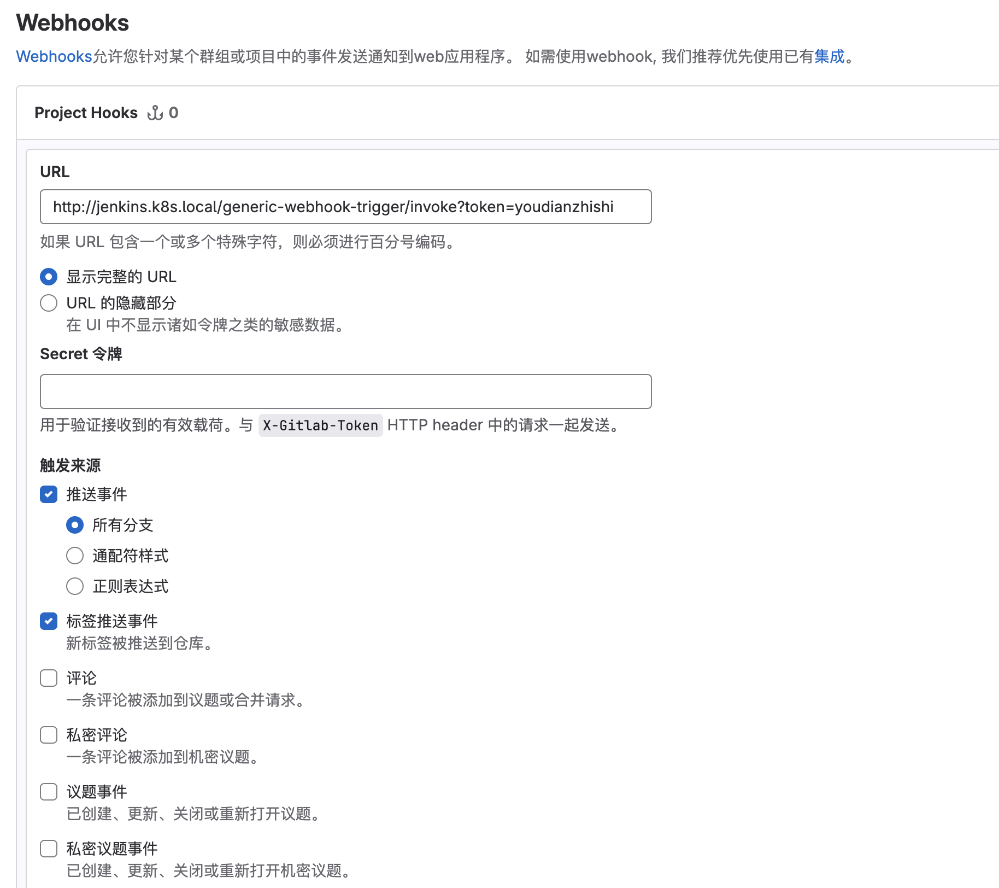

我们这里都是自定义的域名，也没有配置 https 服务，所以记得取消配置下面的 `启用SSL验证`。

现在就可以正常保存了，可以直接点击 `测试 -> Push Event` 测试是否可以正常访问 Webhook 地址，出现了 `Hook executed successfully: HTTP 200` 则证明 Webhook 配置成功了，否则就需要检查下 Jenkins 的安全配置是否正确了。

由于当前项目中还没有 `Jenkinsfile` 文件，所以触发过后会构建失败。

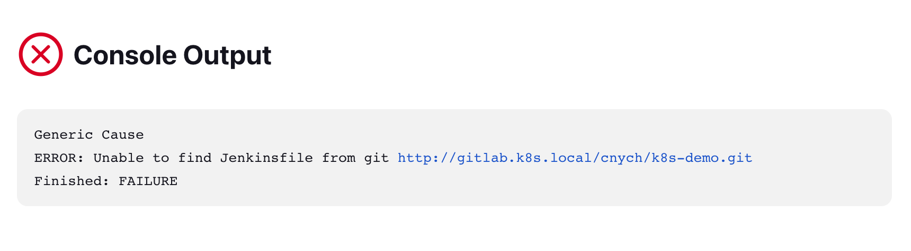

接下来我们直接在代码仓库根目录下面添加 `Jenkinsfile` 文件，用于描述流水线构建流程，整体实现流程如下图所示：


首先定义最简单的流程，要注意这里和前面的不同之处，这里我们使用 `podTemplate` 来定义不同阶段使用的的容器，有哪些阶段呢？

```shell
Clone 代码 -> 单元测试 -> Golang 编译打包 -> Docker 镜像构建/推送 -> Kubectl 部署服务。
```

Clone 代码在默认的 Slave 容器中即可；单元测试我们这里直接忽略，有需要这个阶段的同学自己添加上即可；Golang 编译打包肯定就需要 Golang 的容器了；Docker 镜像构建/推送是不是就需要 Docker 环境了；最后的 Kubectl 更新服务是不是就需要一个有 Kubectl 的容器环境了，所以我们这里就可以很简单的定义 `podTemplate` 了，如下定义：

```groovy
podTemplate(cloud: "Kubernetes", containers: [
  containerTemplate(name: 'golang', image: 'golang:1.18.3-alpine3.16', command: 'cat', ttyEnabled: true),
  containerTemplate(name: 'docker', image: 'docker:latest', command: 'cat', ttyEnabled: true),
  containerTemplate(name: 'kubectl', image: 'cnych/kubectl', command: 'cat', ttyEnabled: true)
], serviceAccount: 'jenkins', volumes: [
  hostPathVolume(mountPath: '/home/jenkins/.kube', hostPath: '/root/.kube')
], envVars: [
  envVar(key: 'DOCKER_HOST', value: 'tcp://docker-dind:2375')  // 环境变量
]) {
  node(POD_LABEL) {
    def myRepo = checkout scm
    def gitCommit = myRepo.GIT_COMMIT
    def gitBranch = myRepo.GIT_BRANCH

    stage('单元测试') {
      echo "测试阶段"
    }
    stage('代码编译打包') {
      container('golang') {
        echo "代码编译打包阶段"
      }
    }
    stage('构建 Docker 镜像') {
      container('docker') {
        echo "构建 Docker 镜像阶段"
      }
    }
    stage('运行 Kubectl') {
      container('kubectl') {
        echo "查看 K8S 集群 Pod 列表"
        sh "kubectl get pods"
      }
    }
  }
}
```

通过 `podTemplate` 可以来定义我们整个流水线的的模板了，每个阶段需要用到哪些容器都可以在该模板中定义，我们这里就定义了 golang、docker、kubectl 3 个容器。

注意这里我们配置了一个 `DOCKER_HOST` 的环境变量，这是因为我们现在的 Kubernetes 集群的容器运行时是 Containerd，这样节点上就没有 `docker.sock` 文件了，没有直接可用的 Docker Daemon 后端使用了，所以我们可以在集群中部署一个 Docker 后端服务，然后通过 `DOCKER_HOST` 环境变量来指定 Docker Daemon 的地址，这样我们就可以在容器中使用 Docker 命令构建镜像了，直接应用下面的资源清单文件即可：

```yaml
# docker-dind.yaml
apiVersion: v1
kind: PersistentVolume
metadata:
  name: docker-pv
spec:
  capacity:
    storage: 10Gi
  volumeMode: Filesystem
  accessModes:
    - ReadWriteOnce
  persistentVolumeReclaimPolicy: Delete
  storageClassName: local-storage
  local:
    path: /data/k8s/docker # demo-worker节点上的目录
  nodeAffinity:
    required:
      nodeSelectorTerms:
        - matchExpressions:
            - key: kubernetes.io/hostname
              operator: In
              values:
                - node2
---
apiVersion: v1
kind: PersistentVolumeClaim
metadata:
  labels:
    app: docker-dind
  name: docker-dind-data
  namespace: kube-ops
spec:
  accessModes:
    - ReadWriteOnce
  storageClassName: local-storage
  resources:
    requests:
      storage: 10Gi
---
apiVersion: apps/v1
kind: Deployment
metadata:
  name: docker-dind
  namespace: kube-ops
  labels:
    app: docker-dind
spec:
  selector:
    matchLabels:
      app: docker-dind
  template:
    metadata:
      labels:
        app: docker-dind
    spec:
      containers:
        - image: docker:dind
          name: docker-dind
          args:
            - --registry-mirror=https://ot2k4d59.mirror.aliyuncs.com/ # 指定一个镜像加速器地址
          env:
            - name: DOCKER_DRIVER
              value: vfs
            - name: DOCKER_HOST
              value: tcp://0.0.0.0:2375
            - name: DOCKER_TLS_CERTDIR # 禁用 TLS（最好别禁用）
              value: ""
          volumeMounts:
            - name: docker-dind-data-vol # 持久化docker根目录
              mountPath: /var/lib/docker/
          ports:
            - name: daemon-port
              containerPort: 2375
          securityContext:
            privileged: true # 需要设置成特权模式
      volumes:
        - name: docker-dind-data-vol
          persistentVolumeClaim:
            claimName: docker-dind-data
---
apiVersion: v1
kind: Service
metadata:
  name: docker-dind
  namespace: kube-ops
  labels:
    app: docker-dind
spec:
  ports:
    - port: 2375
      targetPort: 2375
  selector:
    app: docker-dind
```

然后在 volumes 中通过 `hostPathVolume` 将集群的 `kubeconfig` 文件挂载到容器中，这样我们就可以在容器中访问 Kubernetes 集群了，但是由于我们构建是在 Slave Pod 中去构建的，Pod 就很有可能每次调度到不同的节点去，这就需要保证每个节点上有 `kubeconfig` 文件才能挂载成功，所以这里我们使用另外一种方式。

通过将 `kubeconfig` 文件通过凭证上传到 Jenkins 中，然后在 Jenkinsfile 中读取到这个文件后，拷贝到 kubectl 容器中的 `~/.kube/config` 文件中，这样同样就可以正常使用 kubectl 访问集群了。在 Jenkins 页面中添加凭据，选择 `Secret file` 类型，然后上传 `kubeconfig` 文件，指定 ID 即可：

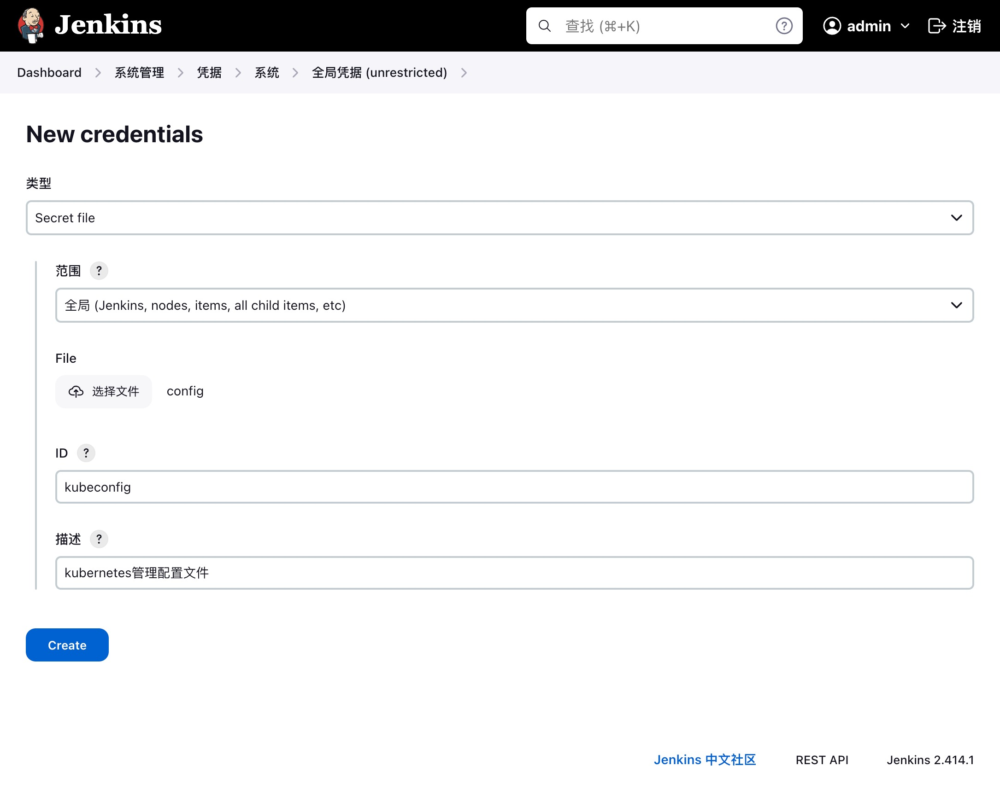

然后在 `Jenkinsfile` 的 kubectl 容器中读取上面添加的 `Secret file` 文件，拷贝到 `~/.kube/config` 即可：

```groovy
stage('运行 Kubectl') {
  container('kubectl') {
    withCredentials([file(credentialsId: 'kubeconfig', variable: 'KUBECONFIG')]) {
      echo "查看 K8S 集群 Pod 列表"
      sh "mkdir -p ~/.kube && cp ${KUBECONFIG} ~/.kube/config"
      sh "kubectl get pods"
    }
  }
}
```

现在我们直接将 `Jenkinsfile` 文件提交到 GitLab 代码仓库中，正常来说就可以触发 Jenkins 的构建了：

```shell
$ kubectl get pods -n kube-ops
NAME                                      READY   STATUS              RESTARTS       AGE
k8s-demo-5-4p9kp-6d80c-qc1jg              4/4     Running   0               6s
$ kubectl describe pod k8s-demo-5-4p9kp-6d80c-qc1jg           -n kube-ops
Name:                      k8s-demo-5-4p9kp-6d80c-qc1jg
Namespace:                 kube-ops
Priority:                  0
Service Account:           jenkins
Node:                      node2/10.206.16.10
Start Time:                Tue, 12 Sep 2023 16:07:55 +0800
Labels:                    jenkins=slave
                           jenkins/label=k8s-demo_5-4p9kp
                           jenkins/label-digest=a7284305127b88189426d6a30713b71daaa0fca7
Annotations:               buildUrl: http://jenkins.kube-ops.svc.cluster.local:8080/job/k8s-demo/5/
                           runUrl: job/k8s-demo/5/
# ......
Events:
  Type    Reason     Age   From               Message
  ----    ------     ----  ----               -------
  Normal  Scheduled  27s   default-scheduler  Successfully assigned kube-ops/k8s-demo-5-4p9kp-6d80c-qc1jg to node2
  Normal  Pulled     27s   kubelet            Container image "golang:1.18.3-alpine3.16" already present on machine
  Normal  Created    27s   kubelet            Created container golang
  Normal  Started    27s   kubelet            Started container golang
  Normal  Pulled     27s   kubelet            Container image "cnych/kubectl" already present on machine
  Normal  Created    27s   kubelet            Created container kubectl
  Normal  Started    26s   kubelet            Started container kubectl
  Normal  Pulled     26s   kubelet            Container image "docker:latest" already present on machine
  Normal  Created    26s   kubelet            Created container docker
  Normal  Started    26s   kubelet            Started container docker
  Normal  Pulled     26s   kubelet            Container image "jenkins/inbound-agent:3142.vcfca_0cd92128-1" already present on machine
  Normal  Created    26s   kubelet            Created container jnlp
  Normal  Started    26s   kubelet            Started container jnlp
  Normal  Killing    18s   kubelet            Stopping container jnlp
  Normal  Killing    18s   kubelet            Stopping container golang
  Normal  Killing    18s   kubelet            Stopping container docker
  Normal  Killing    18s   kubelet            Stopping container kubectl
```

我们可以看到生成的 slave Pod 包含了 4 个容器，其中还包含一个 jnlp 的容器，加上我们在 podTemplate 指定的加上 slave 的镜像，运行完成后该 Pod 也会自动销毁。


当然也可以安装 Blue Ocean 插件，这样可以更加直观的看到流水线的执行情况。

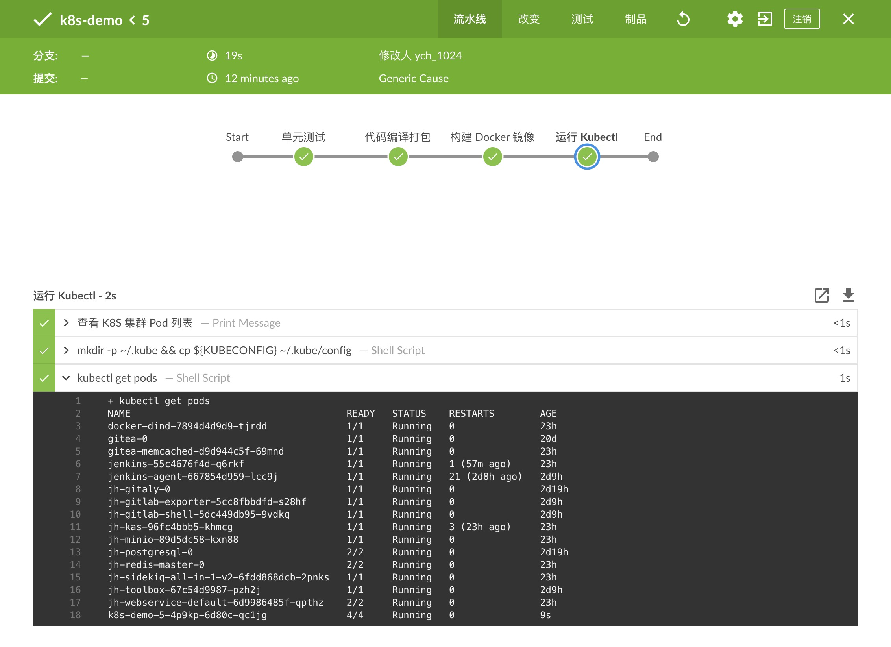


### Pipeline

接下来我们就来实现具体的流水线。

第一个阶段：单元测试，我们可以在这个阶段是运行一些单元测试或者静态代码分析的脚本，我们这里直接忽略。

第二个阶段：代码编译打包，我们可以看到我们是在一个 golang 的容器中来执行的，我们只需要在该容器中获取到代码，然后在代码目录下面执行打包命令即可，如下所示：

```groovy
stage('代码编译打包') {
  try {
    container('golang') {
      echo "2.代码编译打包阶段"
      sh """
        export GOPROXY=https://goproxy.cn
        GOOS=linux GOARCH=amd64 go build -v -o demo-app
        """
    }
  } catch (exc) {
    println "构建失败 - ${currentBuild.fullDisplayName}"
    throw(exc)
  }
}
```

第三个阶段：构建 Docker 镜像，要构建 Docker 镜像，就需要提供镜像的名称和 tag，要推送到 Harbor 仓库，就需要提供登录的用户名和密码，所以我们这里使用到了 `withCredentials` 方法，在里面可以提供一个 `credentialsId` 为 `dockerhub` 的认证信息，如下：

```groovy
stage('构建 Docker 镜像') {
  withCredentials([[$class: 'UsernamePasswordMultiBinding',
    credentialsId: 'docker-auth',
    usernameVariable: 'DOCKER_USER',
    passwordVariable: 'DOCKER_PASSWORD']]) {
      container('docker') {
        echo "3. 构建 Docker 镜像阶段"
        sh """
          docker login ${registryUrl} -u ${DOCKER_USER} -p ${DOCKER_PASSWORD}
          docker build -t ${image} .
          docker push ${image}
          """
      }
  }
}
```

其中 `${image}` 和 `${imageTag}` 我们可以在上面定义成全局变量：

```groovy
// 获取 git commit id 作为镜像标签
def imageTag = sh(script: "git rev-parse --short HEAD", returnStdout: true).trim()
// 仓库地址
def registryUrl = "harbor.k8s.local"
def imageEndpoint = "course/devops-demo"
// 镜像
def image = "${registryUrl}/${imageEndpoint}:${imageTag}"
```

这里定义的镜像名称为 `course/devops-demo`，所以需要提前在 Harbor 中新建一个名为 course 的私有项目：

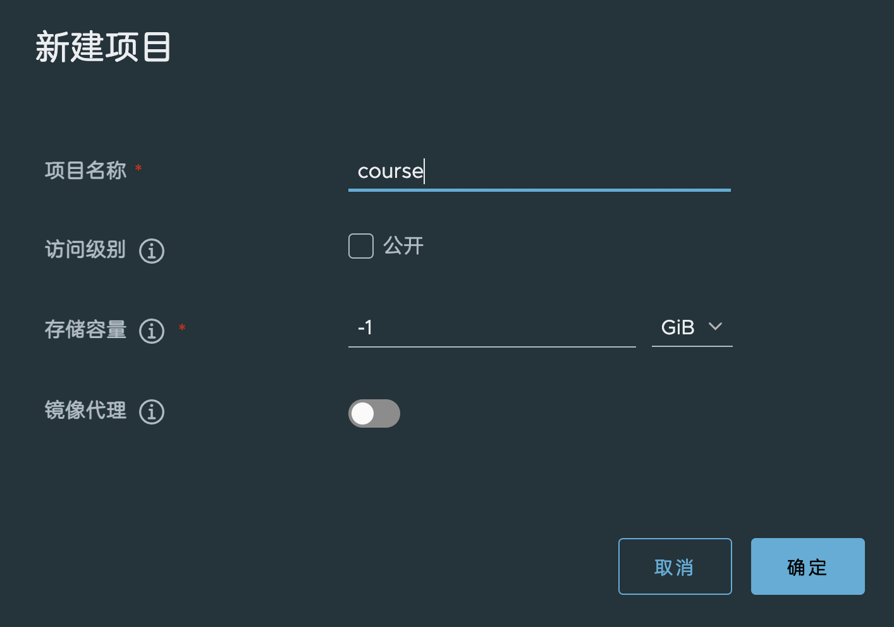

Docker 的用户名和密码信息则需要通过凭据来进行添加，进入 `http://jenkins.k8s.local/credentials/store/system/domain/_/` 页面添加凭据，选择用户名和密码类型的，其中 ID 一定要和上面的 `credentialsId` 的值保持一致：

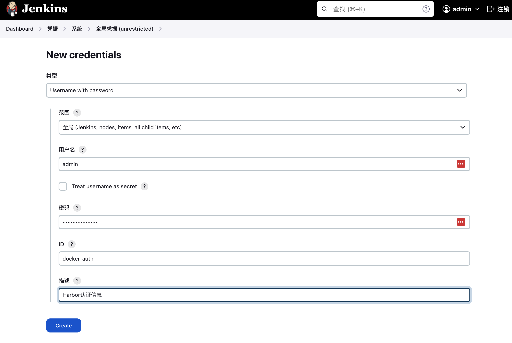

现在我们将上面的流水线代码重新更新，构建会正常在 Docker 阶段会出现如下所示的错误信息：

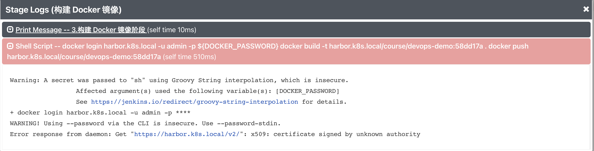

这是因为我们的 harbor 镜像仓库是自签名的证书，所以当执行 docker 命令的时候会出现相关的错误信息 `Error response from daemon: Get "https://harbor.k8s.local/v2/": x509: certificate signed by unknown authority`。

我们需要去修改前面部署的 `dind` Deployment，在启动参数中添加上 `--insecure-registry=harbor.k8s.local`：

```yaml
apiVersion: apps/v1
kind: Deployment
metadata:
  name: docker-dind
  namespace: kube-ops
# ......
      containers:
        - image: docker:dind
          name: docker-dind
          args:
            - --insecure-registry=harbor.k8s.local
            - --registry-mirror=https://ot2k4d59.mirror.aliyuncs.com/ # 指定一个镜像加速器地址
          env:
# ......
```

重新更新 `dind` 服务后，重新去触发下我们的流水线，docker 命令就可以正常使用了。

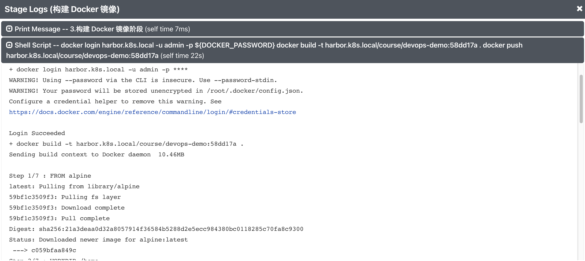

现在镜像我们都已经推送到了 Harbor 仓库中去了，接下来就可以部署应用到 Kubernetes 集群中了，当然可以直接通过 kubectl 工具去操作 YAML 文件来部署，我们这里的示例，编写了一个 Helm Chart 模板，所以我们也可以直接通过 Helm 来进行部署，所以当然就需要一个具有 helm 命令的容器，这里我们使用 `cnych/helm` 这个镜像，这个镜像也非常简单，就是简单的将 helm 二进制文件下载下来放到 PATH 路径下面去即可，对应的 Dockerfile 文件如下所示，大家也可以根据自己的需要来进行定制：

```dockerfile
FROM alpine
MAINTAINER cnych <icnych@gmail.com>
ARG HELM_VERSION="v3.2.1"
RUN apk add --update ca-certificates \
 && apk add --update -t deps wget git openssl bash \
 && wget https://get.helm.sh/helm-${HELM_VERSION}-linux-amd64.tar.gz \
 && tar -xvf helm-${HELM_VERSION}-linux-amd64.tar.gz \
 && mv linux-amd64/helm /usr/local/bin \
 && apk del --purge deps \
 && rm /var/cache/apk/* \
 && rm -f /helm-${HELM_VERSION}-linux-amd64.tar.gz
ENTRYPOINT ["helm"]
CMD ["help"]
```

我们这里使用的是 Helm3 版本，所以要想用 Helm 来部署应用，同样的需要配置一个 kubeconfig 文件在容器中，这样才能访问到 Kubernetes 集群。所以我们可以将 `运行 Kubectl` 的阶段做如下更改：

```groovy
stage('运行 Helm') {
  withCredentials([file(credentialsId: 'kubeconfig', variable: 'KUBECONFIG')]) {
    container('helm') {
      sh "mkdir -p ~/.kube && cp ${KUBECONFIG} ~/.kube/config"
      echo "4.开始 Helm 部署"
      helmDeploy(
          debug       : false,
          name        : "devops-demo",
          chartDir    : "./helm",
          namespace   : "kube-ops",
          valuePath   : "./helm/my-values.yaml",
          imageTag    : "${imageTag}"
      )
      echo "[INFO] Helm 部署应用成功..."
    }
  }
}
```

其中 `helmDeploy` 方法可以在全局中进行定义封装：

```groovy
def helmLint(String chartDir) {
    println "校验 chart 模板"
    sh "helm lint ${chartDir}"
}

def helmDeploy(Map args) {
    if (args.debug) {
        println "Debug 应用"
        sh "helm upgrade --dry-run --debug --install ${args.name} ${args.chartDir} -f ${args.valuePath} --set image.tag=${args.imageTag} --namespace ${args.namespace}"
    } else {
        println "部署应用"
        sh "helm upgrade --install ${args.name} ${args.chartDir} -f ${args.valuePath} --set image.tag=${args.imageTag} --namespace ${args.namespace}"
        echo "应用 ${args.name} 部署成功. 可以使用 helm status ${args.name} 查看应用状态"
    }
}
```

我们在 Chart 模板中定义了一个名为 `my-values.yaml` 的 Values 文件，用来覆盖默认的值，比如这里我们需要使用 Harbor 私有仓库的镜像，则必然需要定义 `imagePullSecrets`，所以需要在目标 namespace 下面创建一个 Harbor 登录认证的 Secret 对象：

```shell
$ kubectl create secret docker-registry harbor-auth --docker-server=harbor.k8s.local --docker-username=xxx --docker-password=xxxxx --docker-email=admin@admin.com --namespace kube-ops
secret/harbor-auth created
```

然后由于每次我们构建的镜像 tag 都会变化，所以我们可以通过 `--set` 来动态设置。

不过需要记得在上面容器模板中添加 helm 容器：

```shell
containerTemplate(name: 'helm', image: 'cnych/helm', command: 'cat', ttyEnabled: true)
```

对于不同的环境我们可以使用不同的 values 文件来进行区分，这样当我们部署的时候可以手动选择部署到某个环境下面去。

```groovy
def userInput = input(
  id: 'userInput',
  message: '选择一个部署环境',
  parameters: [
      [
          $class: 'ChoiceParameterDefinition',
          choices: "Dev\nQA\nProd",
          name: 'Env'
      ]
  ]
)
echo "部署应用到 ${userInput} 环境"
// 选择不同环境下面的 values 文件
if (userInput == "Dev") {
    // deploy dev stuff
} else if (userInput == "QA"){
    // deploy qa stuff
} else {
    // deploy prod stuff
}
// 根据 values 文件再去使用 Helm 进行部署
```

然后去构建应用的时候，在 Helm 部署阶段就会看到 Stage View 界面出现了暂停的情况，需要我们选择一个环境来进行部署：

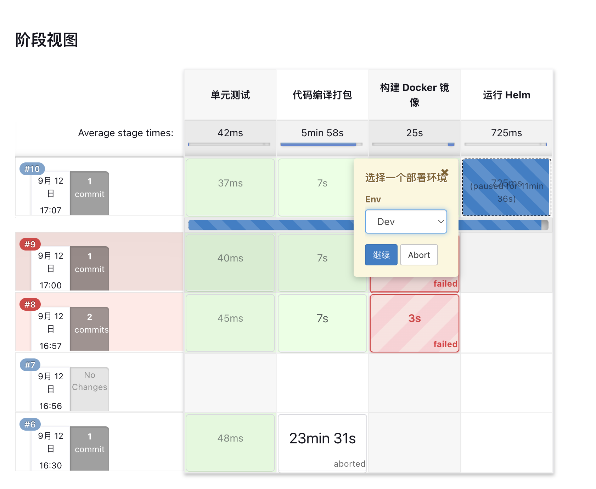

选择完成后再去部署应用。最后我们还可以添加一个 kubectl 容器来查看应用的相关资源对象：

```groovy
stage('运行 Kubectl') {
  withCredentials([file(credentialsId: 'kubeconfig', variable: 'KUBECONFIG')]) {
    container('kubectl') {
      sh "mkdir -p ~/.kube && cp ${KUBECONFIG} ~/.kube/config"
      echo "5.查看应用"
      sh "kubectl get all -n kube-ops -l app=devops-demo"
    }
  }
}
```

有时候我们部署的应用即使有很多测试，但是也难免会出现一些错误，这个时候如果我们是部署到线上的话，就需要要求能够立即进行回滚，这里我们同样可以使用 Helm 来非常方便的操作，添加如下一个回滚的阶段：

```groovy
stage('快速回滚?') {
  withCredentials([file(credentialsId: 'kubeconfig', variable: 'KUBECONFIG')]) {
    container('helm') {
      sh "mkdir -p ~/.kube && cp ${KUBECONFIG} ~/.kube/config"
      def userInput = input(
        id: 'userInput',
        message: '是否需要快速回滚？',
        parameters: [
            [
                $class: 'ChoiceParameterDefinition',
                choices: "Y\nN",
                name: '回滚?'
            ]
        ]
      )
      if (userInput == "Y") {
        sh "helm rollback devops-demo --namespace kube-ops"
      }
    }
  }
}
```

最后一条完整的流水线就完成了。

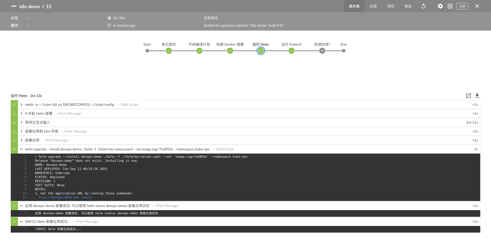

我们可以在本地加上应用域名 `devops-demo.k8s.local` 的映射就可以访问应用了：

```shell
$ curl http://devops-demo.k8s.local
{"msg":"Hello DevOps On Kubernetes"}
```

完整的 Jenkinsfile 文件如下所示：

```groovy
def helmLint(String chartDir) {
    println "校验 chart 模板"
    sh "helm lint ${chartDir}"
}

def helmDeploy(Map args) {
    if (args.debug) {
        println "Debug 应用"
        sh "helm upgrade --dry-run --debug --install ${args.name} ${args.chartDir} -f ${args.valuePath} --set image.tag=${args.imageTag} --namespace ${args.namespace}"
    } else {
        println "部署应用"
        sh "helm upgrade --install ${args.name} ${args.chartDir} -f ${args.valuePath} --set image.tag=${args.imageTag} --namespace ${args.namespace}"
        echo "应用 ${args.name} 部署成功. 可以使用 helm status ${args.name} 查看应用状态"
    }
}

podTemplate(cloud: "Kubernetes", containers: [
  containerTemplate(name: 'golang', image: 'golang:1.18.3-alpine3.16', command: 'cat', ttyEnabled: true),
  containerTemplate(name: 'docker', image: 'docker:latest', command: 'cat', ttyEnabled: true),
  containerTemplate(name: 'kubectl', image: 'cnych/kubectl', command: 'cat', ttyEnabled: true),
  containerTemplate(name: 'helm', image: 'cnych/helm', command: 'cat', ttyEnabled: true)
], serviceAccount: 'jenkins', envVars: [
  envVar(key: 'DOCKER_HOST', value: 'tcp://docker-dind:2375')  // 环境变量
]) {
  node(POD_LABEL) {
    def myRepo = checkout scm
    def gitCommit = myRepo.GIT_COMMIT
    def gitBranch = myRepo.GIT_BRANCH

    // 获取 git commit id 作为镜像标签
    def imageTag = sh(script: "git rev-parse --short HEAD", returnStdout: true).trim()
    // 仓库地址
    def registryUrl = "harbor.k8s.local"
    def imageEndpoint = "course/devops-demo"
    // 镜像
    def image = "${registryUrl}/${imageEndpoint}:${imageTag}"

    stage('单元测试') {
      echo "测试阶段"
    }
    stage('代码编译打包') {
        try {
            container('golang') {
            echo "2.代码编译打包阶段"
            sh """
                export GOPROXY=https://goproxy.io
                GOOS=linux GOARCH=amd64 go build -v -o demo-app
                """
            }
        } catch (exc) {
            println "构建失败 - ${currentBuild.fullDisplayName}"
            throw(exc)
        }
    }
    stage('构建 Docker 镜像') {
        withCredentials([[$class: 'UsernamePasswordMultiBinding',
            credentialsId: 'docker-auth',
            usernameVariable: 'DOCKER_USER',
            passwordVariable: 'DOCKER_PASSWORD']]) {
            container('docker') {
                echo "3. 构建 Docker 镜像阶段"
                sh """
                docker login ${registryUrl} -u ${DOCKER_USER} -p ${DOCKER_PASSWORD}
                docker build -t ${image} .
                docker push ${image}
                """
            }
        }
    }
    stage('运行 Helm') {
        withCredentials([file(credentialsId: 'kubeconfig', variable: 'KUBECONFIG')]) {
            container('helm') {
                sh "mkdir -p ~/.kube && cp ${KUBECONFIG} ~/.kube/config"
                echo "4.开始 Helm 部署"
                def userInput = input(
                    id: 'userInput',
                    message: '选择一个部署环境',
                    parameters: [
                        [
                            $class: 'ChoiceParameterDefinition',
                            choices: "Dev\nQA\nProd",
                            name: 'Env'
                        ]
                    ]
                )
                echo "部署应用到 ${userInput} 环境"
                // 选择不同环境下面的 values 文件
                if (userInput == "Dev") {
                    // deploy dev stuff
                } else if (userInput == "QA"){
                    // deploy qa stuff
                } else {
                    // deploy prod stuff
                }
                helmDeploy(
                    debug       : false,
                    name        : "devops-demo",
                    chartDir    : "./helm",
                    namespace   : "kube-ops",
                    valuePath   : "./helm/my-values.yaml",
                    imageTag    : "${imageTag}"
                )
                echo "[INFO] Helm 部署应用成功..."
            }
        }
    }
    stage('运行 Kubectl') {
        withCredentials([file(credentialsId: 'kubeconfig', variable: 'KUBECONFIG')]) {
            container('kubectl') {
                sh "mkdir -p ~/.kube && cp ${KUBECONFIG} ~/.kube/config"
                echo "5.查看应用"
                sh "kubectl get all -n kube-ops -l app=devops-demo"
            }
        }
    }
    stage('快速回滚?') {
        withCredentials([file(credentialsId: 'kubeconfig', variable: 'KUBECONFIG')]) {
            container('helm') {
            sh "mkdir -p ~/.kube && cp ${KUBECONFIG} ~/.kube/config"
            def userInput = input(
                id: 'userInput',
                message: '是否需要快速回滚？',
                parameters: [
                    [
                        $class: 'ChoiceParameterDefinition',
                        choices: "Y\nN",
                        name: '回滚?'
                    ]
                ]
            )
            if (userInput == "Y") {
                sh "helm rollback devops-demo --namespace kube-ops"
            }
            }
        }
    }
  }
}
```


> 原文: <https://www.yuque.com/cnych/k8s4/diu9ed2h5dxvc1gs>