# 50.Argo Rollouts

[Argo Rollouts](https://argoproj.github.io/argo-rollouts/) 是一个 Kubernetes Operator 实现，它为 Kubernetes 提供更加高级的部署能力，如蓝绿、金丝雀、金丝雀分析、实验和渐进式交付功能，为云原生应用和服务实现自动化、基于 GitOps 的逐步交付。

支持如下特性：

- 蓝绿更新策略
- 金丝雀更新策略
- 更加细粒度、加权流量拆分
- 自动回滚
- 手动判断
- 可定制的指标查询和业务 KPI 分析
- Ingress 控制器集成：NGINX，ALB
- 服务网格集成：Istio，Linkerd，SMI
- Metrics 指标集成：Prometheus、Wavefront、Kayenta、Web、Kubernetes Jobs、Datadog、New Relic、Graphite、InfluxDB


## 实现原理

与 Deployment 对象类似，Argo Rollouts 控制器将管理 ReplicaSets 的创建、缩放和删除，这些 ReplicaSet 由 Rollout 资源中的 `spec.template` 定义，使用与 Deployment 对象相同的 pod 模板。

当 `spec.template` 变更时，这会向 Argo Rollouts 控制器发出信号，表示将引入新的 ReplicaSet，控制器将使用 `spec.strategy` 字段内的策略来确定从旧 ReplicaSet 到新 ReplicaSet 的 rollout 将如何进行，一旦这个新的 ReplicaSet 被放大（可以选择通过一个 Analysis），控制器会将其标记为`稳定`。

如果在 `spec.template` 从稳定的 ReplicaSet 过渡到新的 ReplicaSet 的过程中发生了另一次变更（即在发布过程中更改了应用程序版本），那么之前的新 ReplicaSet 将缩小，并且控制器将尝试发布反映更新 `spec.template` 字段的 ReplicasSet。


## 相关概念

在继续之前我们先来了解一些基本的概念。


### Rollout(滚动)

`Rollout` 是一个 Kubernetes 的 CRD 资源，相当于 Kubernetes Deployment 对象，在需要更高级的部署或渐进式交付功能的情况下，它旨在取代 Deployment 对象，Rollout 提供了 Kubernetes Deployment 所不能提供的功能。

- 蓝绿部署
- 金丝雀部署
- 与 Ingress 控制器和服务网格整合，实现高级流量路由
- 与用于蓝绿和金丝雀分析的指标提供者集成
- 根据成功或失败的指标，自动发布或回滚


### 渐进式交付

渐进式交付是以受控和渐进的方式发布产品更新的过程，从而降低发布的风险，通常将自动化和指标分析结合起来以驱动更新的自动升级或回滚。

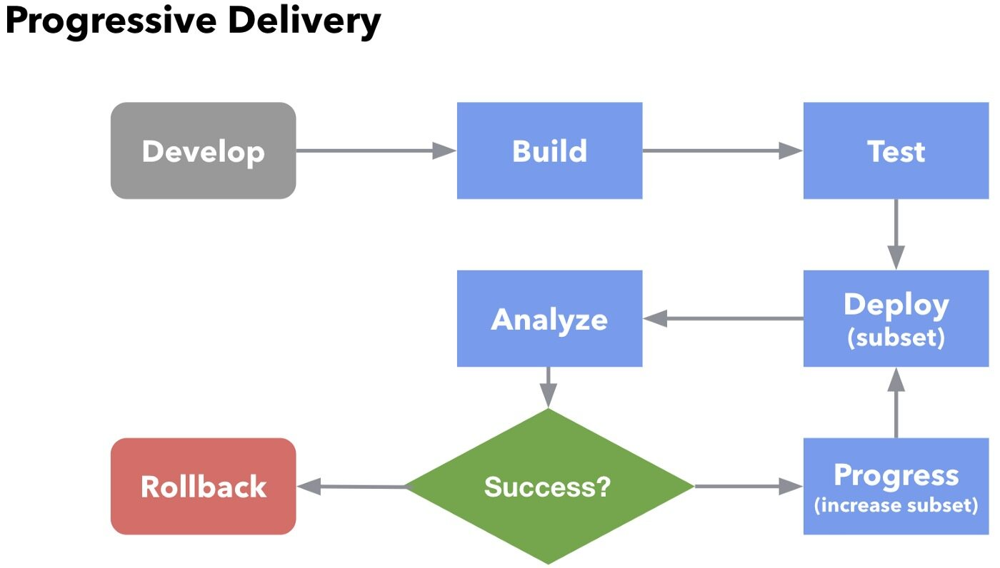

渐进式交付通常被描述为持续交付的演变，将 CI/CD 中的速度优势扩展到部署过程。通过将新版本限制在一部分用户，观察和分析正确的行为，然后逐渐增加更多的流量，同时不断验证其正确性。


### 部署策略

为了明确 Argo Rollouts 的行为方式，以下是 Argo Rollouts 提供的各种部署策略实施的描述。

- **RollingUpdate(滚动更新)**：慢慢地用新版本替换旧版本，随着新版本的出现，旧版本会慢慢缩减，以保持应用程序的总数量。这是 Deployment 对象的默认策略。
- **Recreate(重新创建)**：Recreate 会在启动新版本之前删除旧版本的应用程序，这可确保应用程序的两个版本永远不会同时运行，但在部署期间会出现停机时间。
- **Blue-Green(蓝绿)**：蓝绿发布指同时部署了新旧两个版本的应用程序，在此期间，只有旧版本的应用程序会收到生产流量，这允许开发人员在将实时流量切换到新版本之前针对新版本进行测试。

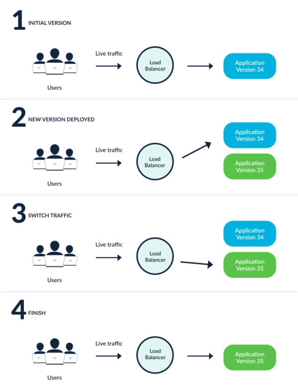

- **Canary(金丝雀)**：金丝雀发布指将一部分用户暴露在新版本的应用程序中，而将其余流量提供给旧版本，一旦新版本被验证是正确的，新版本可以逐渐取代旧版本。Ingress 控制器和服务网格，如 NGINX Ingress 和 Istio，可以使金丝雀的流量拆分模式比原生的更复杂（例如，实现非常细粒度的流量分割，或基于 HTTP 头的分割）。

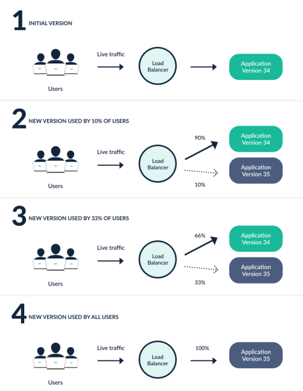

上图显示了一个有两个阶段的金丝雀（10%和 33%的流量进入新版本），通过使用 Argo Rollouts，我们可以根据实际的使用情况定义确切的阶段数和流量百分比。


## 场景

1.  用户希望在新版本开始为生产环境提供服务之前对其进行最后一分钟的功能测试，通过 BlueGreen 策略，Argo Rollouts 允许用户指定预览服务和活跃服务，Rollout 将配置预览服务以将流量发送到新版本，同时活跃服务继续接收生产流量。一旦达到要求，则可以将预览服务提升为新的活跃服务。 
2.  在新版本开始接收实时流量之前，需要预先执行一套通用步骤，通过使用 BlueGreen 策略，用户可以在不接收来自活动服务的流量的情况下启动新版本，一旦这些步骤执行完毕，就可以将流量切换到新版本了。 
3.  用户希望在几个小时内将一小部分生产流量提供给他们应用程序的新版本。之后，他们希望缩小新版本规模，并查看一些指标以确定新版本与旧版本相比是否具有性能问题，然后他们将决定是否为切换到新版本。使用金丝雀策略，rollout 可以用新版本扩大 ReplicaSet 的规模，以接收指定百分比的流量，等待指定的时间，然后将百分比设置回 0，然后等待用户满意后再发布，为所有的流量提供服务。 
4.  一个用户想慢慢给新版增加生产流量，先给它一小部分的实时流量，然后等待一段时间再给新版本更多的流量，最终，新版本将接收所有生产流量。使用金丝雀策略，用户指定他们希望新版本接收的百分比以及在百分比之间等待的时间。 
5.  用户想要使用 Deployment 中的正常滚动更新策略，如果用户使用没有步骤的金丝雀策略，rollout 将使用 maxSurge 和最大不可用值来滚动到新版本。 


## 架构

下面展示了由 Argo Rollouts 管理的 Deployment 的所有组件。

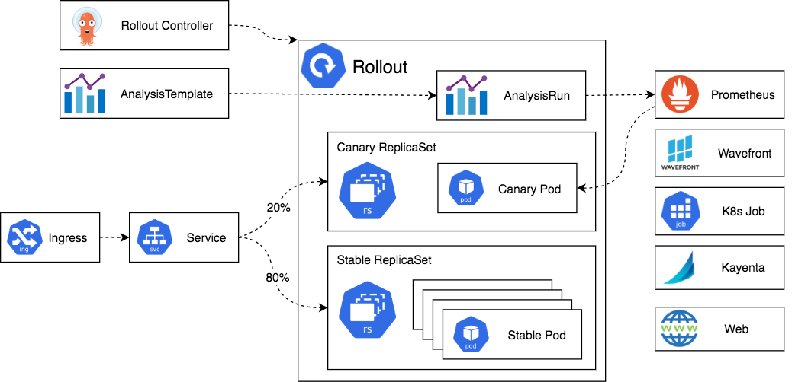


### Rollout Controller

这是主控制器，用于监视集群的事件并在 Rollout 类型的资源发生更改时做出反应。控制器将读取 rollout 的所有详细信息，并使集群处于 rollout 定义中描述的相同状态。

请注意，Argo Rollouts 不会篡改或响应正常 Deployment 资源上发生的任何变更，这意味着你可以在一个使用其他方法部署应用的集群中安装 Argo Rollouts。


### Rollout 资源

Rollout 资源是 Argo Rollouts 引入和管理的一种自定义 Kubernetes 资源，它与原生的 Kubernetes Deployment 资源基本兼容，但有额外的字段来控制更加高级的部署方法，如金丝雀和蓝/绿部署。

Argo Rollouts 控制器将只对 Rollout 资源中的变化做出反应，不会对正常的 Deployment 资源做任何事情，所以如果你想用 Argo Rollouts 管理你的 Deployment，你需要将你的 Deployment 迁移到 Rollouts。


### 旧版和新版的 ReplicaSets

这些是标准的 Kubernetes ReplicaSet 资源的实例，Argo Rollouts 给它们添加了一些额外的元数据，以便跟踪属于应用程序的不同版本。

还要注意的是，参加 Rollout 的 ReplicaSet 完全由控制器自动管理，你不应该用外部工具来篡改它们。


### Ingress/Service

用户的流量进入集群后，被重定向到合适的版本，Argo Rollouts 使用标准的 Kubernetes Service 资源，但有一些额外的元数据。

Argo Rollouts 在网络配置上非常灵活，首先，可以在 Rollout 期间使用不同的服务，这些服务仅适用于新版本、仅适用于旧版本或两者都适用。特别是对于 Canary 部署，Argo Rollouts 支持多种服务网格和 Ingress 解决方案，用于按特定百分比拆分流量，而不是基于 Pod 数量进行简单的配置。


### AnalysisTemplate 与 AnalysisRun

`Analysis` 是一种自定义 Kubernetes 资源，它将 Rollout 连接到指标提供程序，并为某些指标定义特定阈值，这些阈值将决定 Rollout 是否成功。对于每个 Analysis，你可以定义一个或多个指标查询及其预期结果，如果指标查询正常，则 Rollout 将继续发布；如果指标显示失败，则自动回滚；如果指标无法提供成功/失败的结果，则暂停发布。

为了执行分析，Argo Rollouts 提供了两个自定义的 Kubernetes 资源：`AnalysisTemplate` 和 `AnalysisRun`。

`AnalysisTemplate` 包含有关要查询哪些指标的说明。附加到 `Rollout` 的实际结果是 `AnalysisRun` 自定义资源，可以在特定 的 `Rollout` 上定义 `AnalysisTemplate`，也可以在集群上定义全局的 `AnalysisTemplate`，以供多个 `Rollout` 共享作为 `ClusterAnalysisTemplate`，而 `AnalysisRun` 资源的范围仅限于特定的 rollout。

请注意，在 Rollout 中使用分析和指标是完全可选的，你可以通过 API 或 CLI 手动暂停和继续发布，也可以使用其他外部方法（例如冒烟测试）。你不需要仅使用 Argo Rollouts 的指标解决方案，你还可以在 Rollout 中混合自动（即基于分析）和手动步骤。

除了指标之外，你还可以通过运行 Kubernetes Job 或运行 webhook 来决定发布的成功与否。


### Metric Providers

Argo Rollouts 包括多个流行指标提供程序的本机集成，您可以在分析资源中使用这些提供程序来自动升级或回滚部署。有关特定设置选项，请参阅每个提供商的文档。

Argo Rollouts 包括几个流行的指标提供者的集成，你可以在分析资源中使用，来自动升级或回滚发布。


### CLI 和 UI（图中未显示）

还可以使用 Argo Rollouts CLI 或集成 UI 查看和管理 Rollout，两者都是可选的。


## 安装

直接使用下面的命令安装 Argo Rollouts：

```shell
$ kubectl create namespace argo-rollouts
$ kubectl apply -n argo-rollouts -f https://github.com/argoproj/argo-rollouts/releases/download/v1.6.0/install.yaml
```

这里会创建一个名为 `argo-rollouts` 的命名空间，Argo Rollouts 控制器运行在上面。

```shell
$ kubectl get pods -n argo-rollouts
NAME                            READY   STATUS    RESTARTS   AGE
argo-rollouts-b9bbbc884-5h5jz   1/1     Running   0          7m21s
$ kubectl get crd |grep argo
analysisruns.argoproj.io               2023-09-21T06:20:34Z
analysistemplates.argoproj.io          2023-09-21T06:20:34Z
clusteranalysistemplates.argoproj.io   2023-09-21T06:20:34Z
experiments.argoproj.io                2023-09-21T06:20:35Z
rollouts.argoproj.io                   2023-09-21T06:20:35Z
```

此外，我们还可以安装一个 kubectl 插件，对于命令行管理和可视化发布非常方便。使用 curl 安装 Argo Rollouts kubectl 插件：

```shell
# https://ghproxy.com/https://github.com//argoproj/argo-rollouts/releases/download/v1.6.0/kubectl-argo-rollouts-linux-amd64
$ curl -LO https://github.com/argoproj/argo-rollouts/releases/download/v1.6.0/kubectl-argo-rollouts-linux-amd64
```

然后赋予 `kubectl-argo-rollouts` 二进制文件可执行权限：

```shell
$ chmod +x ./kubectl-argo-rollouts-linux-amd64
```

将该二进制文件移动到你的 PATH 路径下面去：

```shell
$ sudo mv ./kubectl-argo-rollouts-linux-amd64 /usr/local/bin/kubectl-argo-rollouts
```

执行下面的命令来验证插件是否安装成功：

```shell
$ kubectl argo rollouts version
kubectl-argo-rollouts: v1.6.0+7eae71e
  BuildDate: 2023-09-06T18:36:42Z
  GitCommit: 7eae71ed89f1a3769864435bddebe3ca05384df3
  GitTreeState: clean
  GoVersion: go1.20.7
  Compiler: gc
  Platform: linux/amd64
```


## 金丝雀发布

接下来我们通过几个简单的示例来说明 Rollout 的部署、升级、发布和中断等操作，以此来展示 Rollouts 的各种功能。


### 1. 部署 Rollout

首先我们部署一个 Rollout 资源和一个针对该资源的 Kubernetes Service 对象，这里我们示例中的 Rollout 采用了金丝雀的更新策略，将 20% 的流量发送到金丝雀上，然后手动发布，最后在升级的剩余时间内逐渐自动增大流量，可以通过如下所示的 Rollout 来描述这个策略：

```yaml
# basic-rollout.yaml
apiVersion: argoproj.io/v1alpha1
kind: Rollout
metadata:
  name: rollouts-demo
spec:
  replicas: 5 # 定义5个副本
  strategy: # 定义升级策略
    canary: # 金丝雀发布
      steps: # 发布的节奏
        - setWeight: 20
        - pause: {} # 会一直暂停
        - setWeight: 40
        - pause: { duration: 10 } # 暂停10s
        - setWeight: 60
        - pause: { duration: 10 }
        - setWeight: 80
        - pause: { duration: 10 }
  revisionHistoryLimit: 2 # 下面部分其实是和 Deployment 兼容的
  selector:
    matchLabels:
      app: rollouts-demo
  template:
    metadata:
      labels:
        app: rollouts-demo
    spec:
      containers:
        - name: rollouts-demo
          image: argoproj/rollouts-demo:blue
          ports:
            - name: http
              containerPort: 8080
              protocol: TCP
          resources:
            requests:
              memory: 32Mi
              cpu: 5m
```

还包括一个如下所示的 Service 资源对象：

```yaml
# basic-service.yaml
apiVersion: v1
kind: Service
metadata:
  name: rollouts-demo
spec:
  ports:
    - port: 80
      targetPort: http
      protocol: TCP
      name: http
  selector:
    app: rollouts-demo
```

直接创建上面的两个资源对象：

```shell
$ kubectl apply -f basic-rollout.yaml
$ kubectl apply -f basic-service.yaml
```

任何 Rollout 的初始创建都会立即将副本扩展到 100%（跳过任何金丝雀升级步骤、分析等...），因为还没有发生升级。

```shell
$ kubectl get pods -l app=rollouts-demo
NAME                             READY   STATUS    RESTARTS   AGE
rollouts-demo-687d76d795-7xztq   1/1     Running   0          4m48s
rollouts-demo-687d76d795-bnnwx   1/1     Running   0          4m48s
rollouts-demo-687d76d795-dtlns   1/1     Running   0          4m48s
rollouts-demo-687d76d795-q6867   1/1     Running   0          4m48s
rollouts-demo-687d76d795-zlzdv   1/1     Running   0          4m48s
```

Argo Rollouts 的 kubectl 插件允许我们可视化 Rollout 以及相关资源对象，并展示实时状态变化，要在部署过程中观察 Rollout，可以通过运行插件的 `get rollout --watch` 命令，比如：

```shell
$ kubectl argo rollouts get rollout rollouts-demo --watch
```

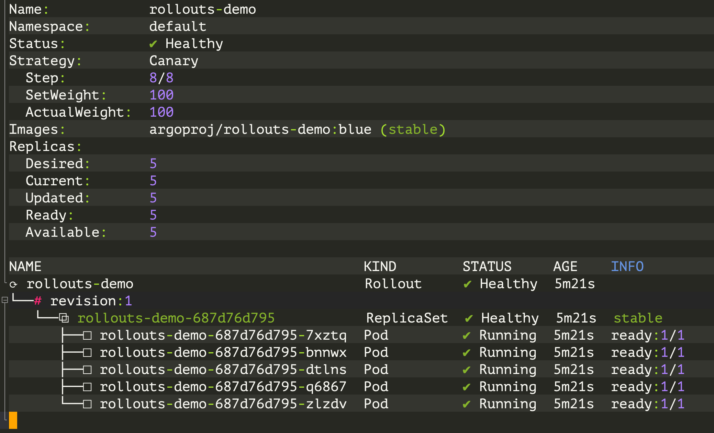


### 2. 更新 Rollout

上面已经部署完成，接下来就需要执行更新了，和 Deployment 类似，对 Pod 模板字段的任何变更都会导致新的版本（即 ReplicaSet）被部署，更新 Rollout 通常是修改容器镜像的版本，然后执行 `kubectl apply` ，为了方便，rollouts 插件还单独提供了一个 `set image` 的命令，比如这里我们运行以下所示命令，用 `yellow` 版本的容器更新上面的 Rollout：

```shell
$ kubectl argo rollouts set image rollouts-demo \
  rollouts-demo=argoproj/rollouts-demo:yellow
rollout "rollouts-demo" image updated
```

在 rollout 更新期间，控制器将通过 Rollout 更新策略中定义的步骤进行。这个示例的 rollout 为金丝雀设置了 20% 的流量权重，并一直暂停 rollout，直到用户取消或促进发布。在更新镜像后，再次观察 rollout，直到它达到暂停状态。

```shell
$ kubectl argo rollouts get rollout rollouts-demo --watch
```

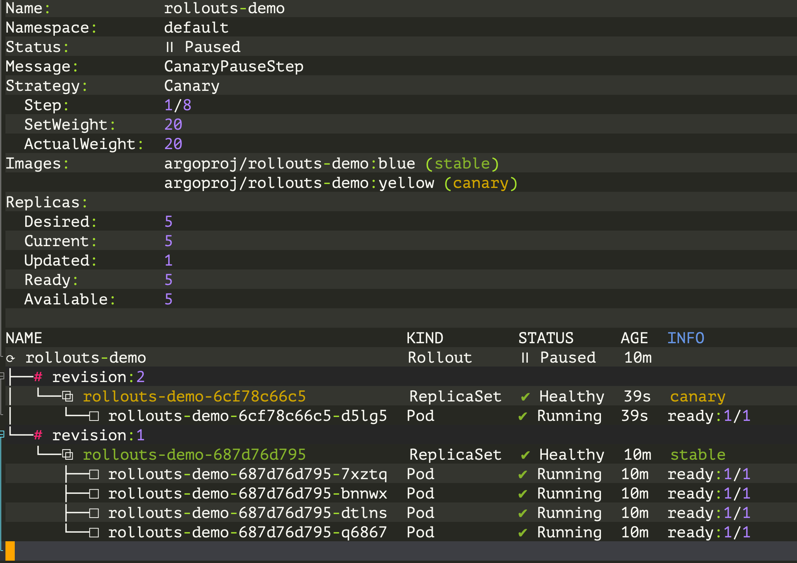

当 demo rollout 到达第二步时，我们可以从插件中看到，Rollout 处于暂停状态，现在有 5 个副本中的 1 个运行新版本的 pod，其余 4 个仍然运行旧版本，这相当于 `setWeight: 20` 步骤所定义的 20%的金丝雀权重。


### 3. Promote Rollout

经过上面的更新后，Rollout 现在处于暂停状态，当一个 Rollout 到达一个没有持续时间的暂停步骤时，它将一直保持在暂停状态，直到它被恢复/继续。要手动将 Rollout 切换到下一个步骤，请运行插件的 `promotion` 命令。

```shell
$ kubectl argo rollouts promote rollouts-demo
rollout 'rollouts-demo' promoted
```

切换后 Rollout 将继续执行剩余的步骤。在我们的例子中，剩余的步骤是完全自动化的，所以 Rollout 最终会完成步骤，直到它已经完全过渡到新版本。再次观察 Rollout，直到它完成所有步骤。

```shell
$ kubectl argo rollouts get rollout rollouts-demo --watch
```

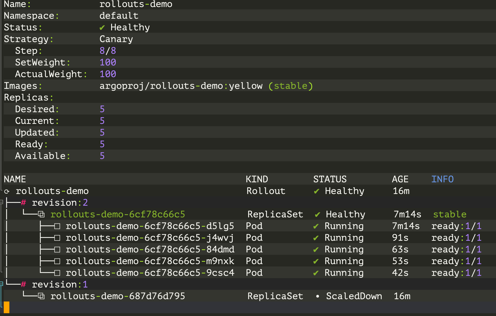

> `promote` 命令还支持用 `--full` 标志跳过所有剩余步骤和分析。


可以看到 `stable` 版本已经切换到 `revision:2` 这个 ReplicaSet 了。在更新过程中，无论何时，无论是通过失败的金丝雀分析自动中止，还是由用户手动中止，Rollout 都会退回到 `stable` 版本。


### 4. 中断 Rollout

接下来我们来了解如何在更新过程中手动中止 Rollout，首先，使用 `set image` 命令部署一个新的 `red` 版本的容器，并等待 rollout 再次达到暂停的步骤。

```shell
$ kubectl argo rollouts set image rollouts-demo \
  rollouts-demo=argoproj/rollouts-demo:red
rollout "rollouts-demo" image updated
```

这一次我们将中止更新，而不是将滚动切换到下一步，这样它就回到了 `stable` 版本，该插件同样提供了一个 `abort` 命令，可以在更新过程中的任何时候手动中止 Rollout。

```shell
$ kubectl argo rollouts abort rollouts-demo
```

当中止滚动时，它将扩大 ReplicaSet 的 `stable` 版本（在本例中是 `yellow` 版本），并缩小任何其他版本。尽管 ReplicaSet 的稳定版本可能正在运行，并且是健康的，但整个 Rollout 仍然被认为是退化的，因为期望的版本（`red` 版本）不是实际运行的版本。

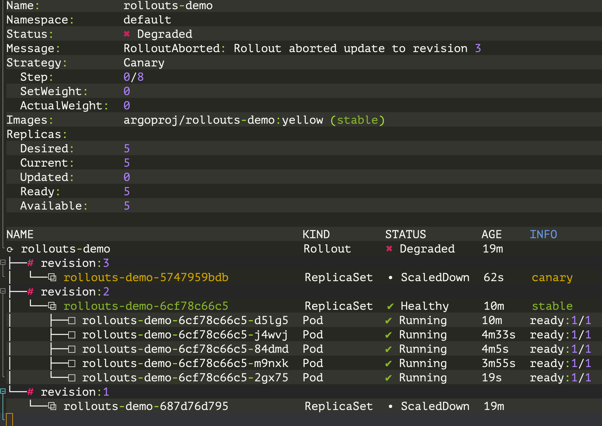

为了使 Rollout 再次被认为是健康的而不是有问题的版本，有必要将所需的状态改回以前的稳定版本。在我们的例子中，我们可以简单地使用之前的 `yellow` 镜像重新运行 `set image` 命令即可。

```shell
$ kubectl argo rollouts set image rollouts-demo \
  rollouts-demo=argoproj/rollouts-demo:yellow
```

运行这个命令后，可以看到 Rollout 立即变成了 health 状态，而且没有任何关于创建新 ReplicaSets 的动态。

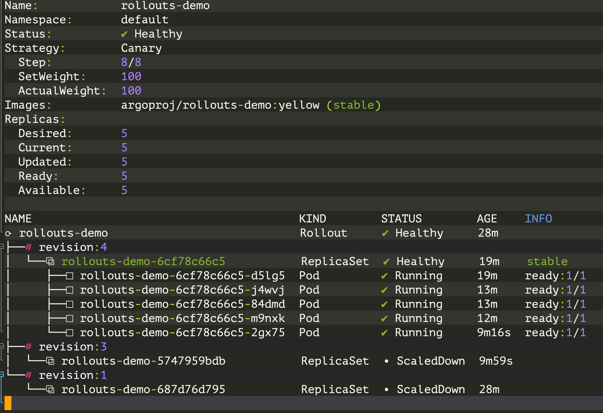

当 Rollout 还没有达到预期状态（例如它被中止了，或者正在更新中），而稳定版本的资源清单被重新应用，Rollout 检测到这是一个回滚，而不是一个更新，并将通过跳过分析和步骤快速部署稳定的 ReplicaSet。


## Argo Rollouts 与 NGINX Ingress 集成

上面例子中的 Rollout 没有使用 Ingress 控制器或服务网格来控制流量。它使用 Kubernetes Service 来实现近似的金丝雀权重，基于新旧副本数量的比例来实现。所以，这个 Rollout 有限制，为了实现更细粒度的金丝雀，这就需要一个 Ingress 控制器或服务网格了。

接下来我们介绍下 Argo Rollouts 如何与 NGINX Ingress Controller 集成以进行流量控制。

当然首先要保证已经在集群中安装了 ingress-nginx 控制器。当 NGINX Ingress 用作流量路由器时，Rollout 金丝雀策略必须定义以下强制字段：

```yaml
apiVersion: argoproj.io/v1alpha1
kind: Rollout
metadata:
  name: rollouts-demo
spec:
  strategy:
    canary:
      # 引用一个 Service，控制器将更新该服务以指向金丝雀 ReplicaSet
      canaryService: rollouts-demo-canary
      # 引用一个 Service，控制器将更新该服务以指向稳定的 ReplicaSet
      stableService: rollouts-demo-stable
      trafficRouting:
        nginx:
          # 指向稳定 Service 的规则所引用的 Ingress
          # 该 Ingress 将被克隆并赋予一个新的名称，以实现NGINX流量分割。
          stableIngress: rollouts-demo-stable
```

其中 `canary.trafficRouting.nginx.stableIngress` 中引用的 Ingress 需要有一个 host 规则，该规则具有针对 `canary.stableService` 下引用的服务的后端。

接下来按照上面的描述来定义我们示例的资源清单文件：

```yaml
# rollout.yaml
apiVersion: argoproj.io/v1alpha1
kind: Rollout
metadata:
  name: rollouts-demo
spec:
  replicas: 1
  strategy:
    canary:
      canaryService: rollouts-demo-canary
      stableService: rollouts-demo-stable
      trafficRouting:
        nginx:
          stableIngress: rollouts-demo-stable
      steps:
        - setWeight: 5
        - pause: {}
  revisionHistoryLimit: 2
  selector:
    matchLabels:
      app: rollouts-demo
  template:
    metadata:
      labels:
        app: rollouts-demo
    spec:
      containers:
        - name: rollouts-demo
          image: argoproj/rollouts-demo:blue
          ports:
            - name: http
              containerPort: 8080
              protocol: TCP
          resources:
            requests:
              memory: 32Mi
              cpu: 5m
```

上面的资源清单中，我们定义了一个 `rollouts-demo` 的 Rollout 资源，它的 `canaryService` 和 `stableService` 分别引用了两个 Service 资源， `stableIngress` 引用了一个 Ingress 资源，`steps` 定义了金丝雀发布的步骤，这里我们定义了两个步骤，第一个步骤将权重设置为 5%，第二个步骤是暂停，这样就可以在第一个步骤中将 5% 的流量发送到金丝雀上，然后手动发布，最后在升级的剩余时间内逐渐自动增大流量。对应的 Service 资源对象如下所示：

```yaml
# service.yaml
apiVersion: v1
kind: Service
metadata:
  name: rollouts-demo-canary
spec:
  ports:
    - port: 80
      targetPort: http
      protocol: TCP
      name: http
  selector:
    app: rollouts-demo
    # 该 selector 将使用金丝雀 ReplicaSet 的 pod-template-hash 进行更新，比如 rollouts-pod-template-hash: 7bf84f9696
---
apiVersion: v1
kind: Service
metadata:
  name: rollouts-demo-stable
spec:
  ports:
    - port: 80
      targetPort: http
      protocol: TCP
      name: http
  selector:
    app: rollouts-demo
    # 该 selector 将使用稳定版的 ReplicaSet 的 pod-template-hash 进行更新，比如 rollouts-pod-template-hash: 789746c88d
```

然后最后还需要定义一个 Ingress 对象：

```yaml
# ingress.yaml
apiVersion: networking.k8s.io/v1
kind: Ingress
metadata:
  name: rollouts-demo-stable
spec:
  ingressClassName: nginx
  rules:
    - host: rollouts-demo.local
      http:
        paths:
          - path: /
            pathType: Prefix
            backend:
              service:
                # 引用服务名称，也在 Rollout spec.strategy.canary.stableService 字段中指定
                name: rollouts-demo-stable
                port:
                  number: 80
```

接下来我们先删除前面示例的资源对象：

```shell
$ kubectl delete -f basic-rollout.yaml
$ kubectl delete -f basic-service.yaml
```

然后再创建上面的资源对象：

```shell
$ kubectl apply -f rollout.yaml
$ kubectl apply -f service.yaml
$ kubectl apply -f ingress.yaml
```

应用清单后，我们可以在集群中看到以下资源对象：

```bash
$ kubectl get ro
NAME            DESIRED   CURRENT   UP-TO-DATE   AVAILABLE   AGE
rollouts-demo   1         1         1            1           69s
$ kubectl get svc
NAME                   TYPE        CLUSTER-IP       EXTERNAL-IP   PORT(S)   AGE
rollouts-demo-canary   ClusterIP   10.111.85.229    <none>        80/TCP    72s
rollouts-demo-stable   ClusterIP   10.110.107.123   <none>        80/TCP    72s
$ kubectl get ing
NAME                                        CLASS   HOSTS                 ADDRESS   PORTS   AGE
rollouts-demo-rollouts-demo-stable-canary   nginx   rollouts-demo.local             80      41s
rollouts-demo-stable                        nginx   rollouts-demo.local             80      41s
```

我们可以注意到新增了一个名为 `rollouts-demo-rollouts-demo-stable-canary` 的 Ingress 对象。这个对象是 `canary ingress`，它是 `nginx.stableIngress` 下引用的用户管理 Ingress 的克隆。 nginx ingress 控制器使用它来实现金丝雀流量分割。生成的入口的名称是使用 `<ROLLOUT-NAME>-<INGRESS-NAME>-canary` 制定的。

同样现在也可以查看 Rollout 对象的具体状态：

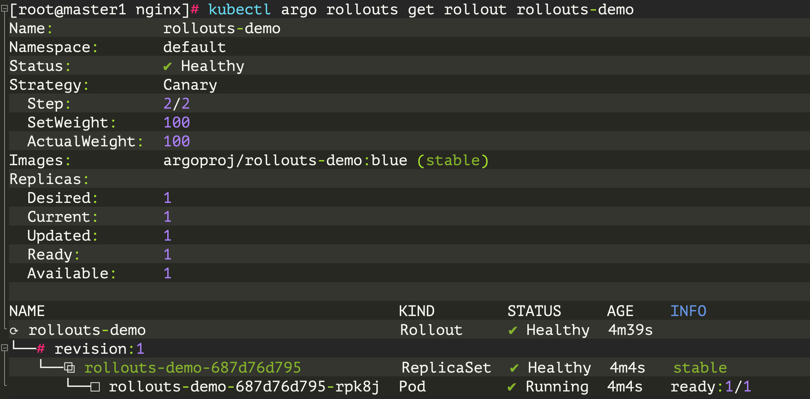

接下来我们通过更改镜像版本来更新发布，然后等待它达到暂停状态。

```bash
$ kubectl argo rollouts set image rollouts-demo rollouts-demo=argoproj/rollouts-demo:yellow
kubectl argo rollouts get rollout rollouts-demo
```

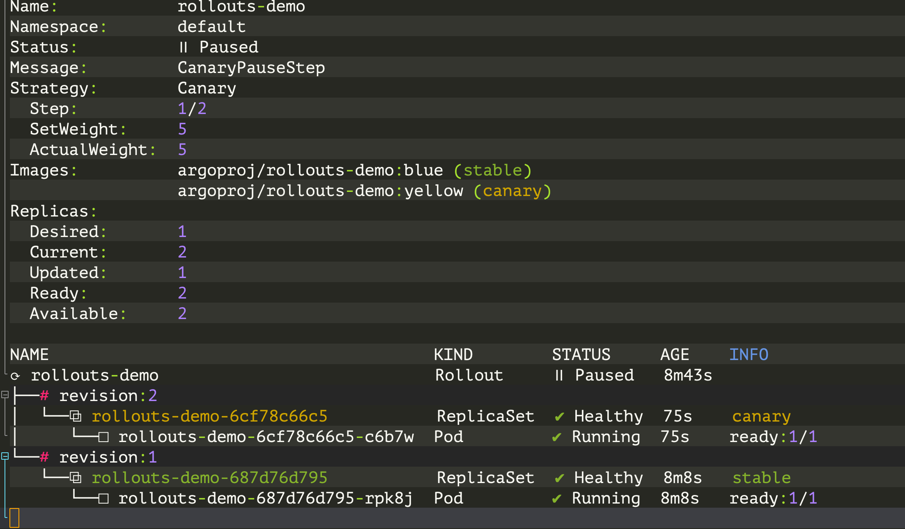

此时，Rollout 的金丝雀版和稳定版都在运行，其中 `5%` 的流量路由到金丝雀版。需要注意的一件事是，尽管只运行两个 pod，但此次发布仍能够实现 5% 的金丝雀权重。这是能够实现的，因为流量分割发生在 Ingress 控制器处。

可以通过访问该 Demo 来大致了解：

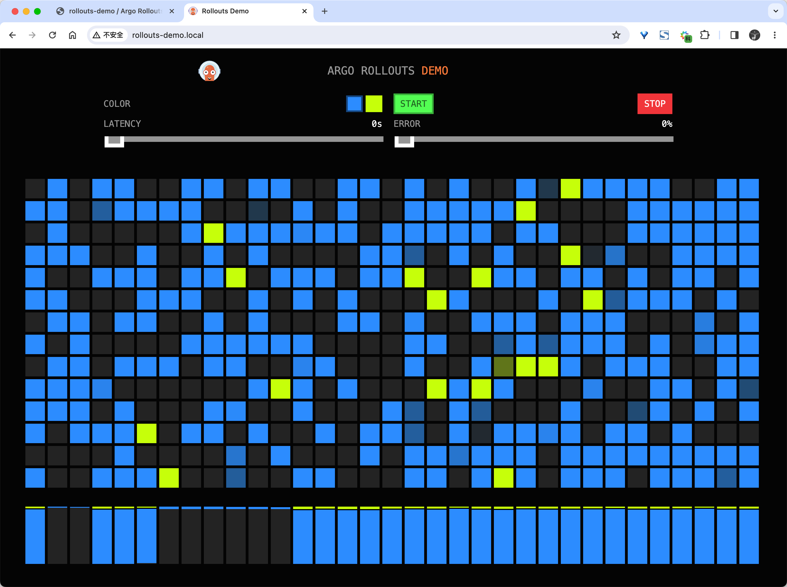

当检查 rollout 控制器生成的 Ingress 副本时，我们发现它比原始 Ingress 有以下变化：

- 注解中添加了两个额外的 NGINX 特定金丝雀注解。
- Ingress 规则将有一条将后端指向金丝雀服务的规则。

对应的资源清单如下所示：

```yaml
apiVersion: networking.k8s.io/v1
kind: Ingress
metadata:
  annotations:
    nginx.ingress.kubernetes.io/canary: "true"
    nginx.ingress.kubernetes.io/canary-weight: "5"
  name: rollouts-demo-rollouts-demo-stable-canary
  namespace: default
spec:
  ingressClassName: nginx
  rules:
    - host: rollouts-demo.local
      http:
        paths:
          - backend:
              service:
                name: rollouts-demo-canary
                port:
                  number: 80
            path: /
            pathType: Prefix
```

随着 Rollout 逐步进行，`canary-weight` 注解将调整以匹配步骤的当前 `setWeight`。NGINX Ingress 控制器检查原始 Ingress、金丝雀 Ingress 和金丝雀权重注解，以确定在两个入口之间分配的流量百分比。NGINX Ingress 如何实现金丝雀流量分割在 NGINX Ingress 章节中我们已经详细讲解过了。

最后我们可以执行 `promote` 命令来将 Rollout 推进到下一个步骤，这样就完成了金丝雀发布。

```shell
$ kubectl argo rollouts promote rollouts-demo
rollout 'rollouts-demo' promoted
```

当然此时应用会全部切换到 `yellow` 版本的容器：

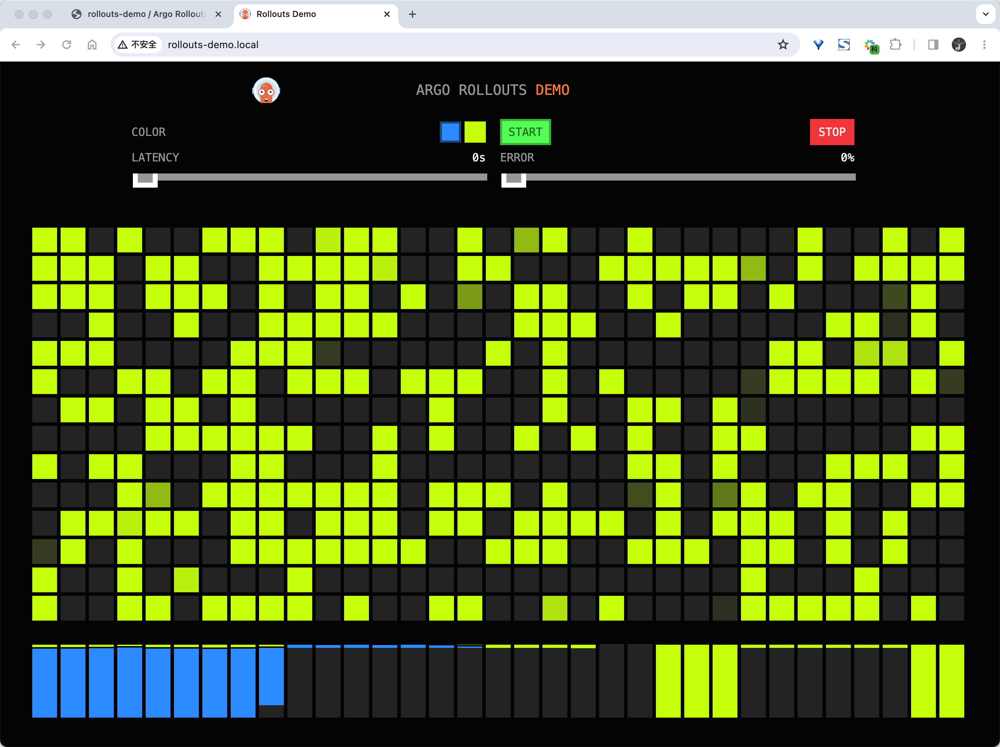


## Dashboard

Argo Rollouts Kubectl 插件可以提供一个本地 Dashboard，来可视化你的 Rollouts。

要启动这个 Dashboard，需要在包含 Rollouts 资源对象的命名空间中运行 `kubectl argo rollouts dashboard` 命令，然后访问`localhost:3100` 即可。

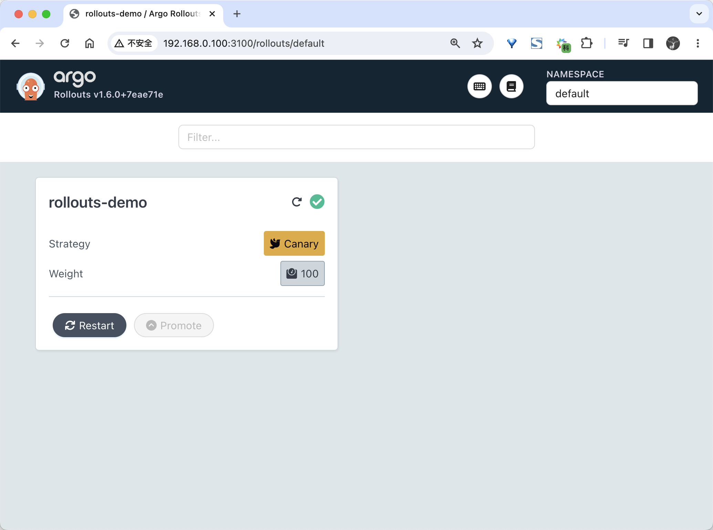

点击 Rollout 可以进行详细页面，在详细页面可以看到 Rollout 的配置信息，还可以直接在 UI 界面上执行一些常用的操作，比如重启、重启、中断等。

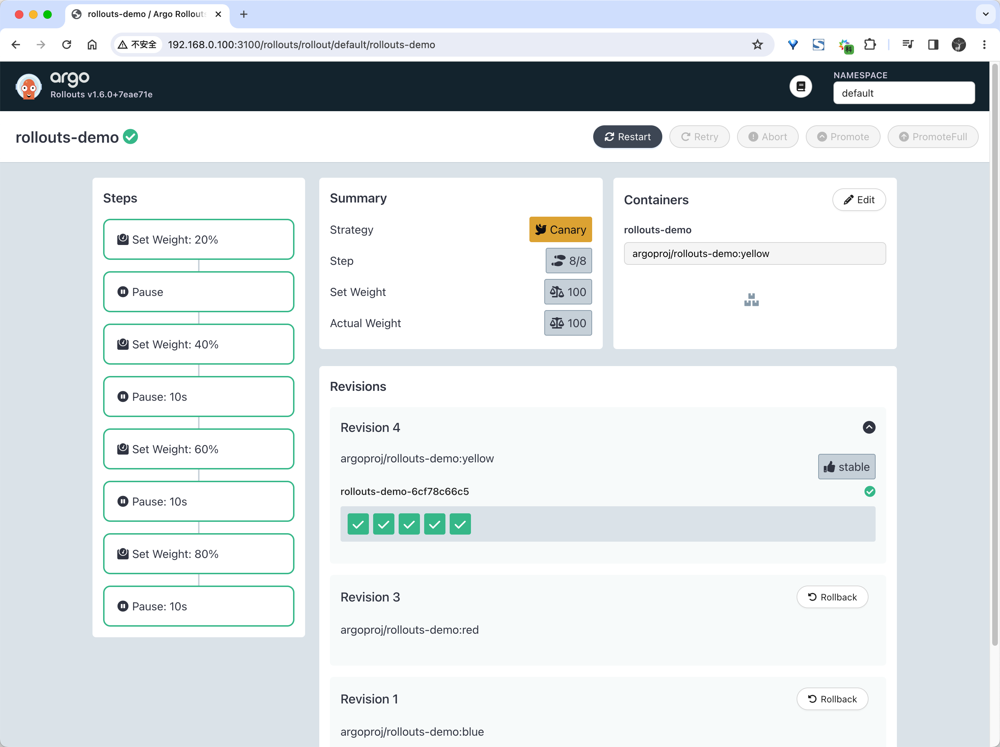


## Analysis 和渐进式交互

Argo Rollouts 提供了几种执行分析的方法来推动渐进式交付，首先需要了解几个 CRD 资源：

- `Rollout`：Rollout 是 Deployment 资源的直接替代品，它提供额外的 `blueGreen` 和 `canary` 更新策略，这些策略可以在更新期间创建 `AnalysisRuns` 和 `Experiments`，可以推进更新，或中止更新。
- `Experiments`：Experiments CRD 允许用户临时运行一个或多个 ReplicaSet。除了运行临时 ReplicaSet 之外，Experiments CRD 还可以与 ReplicaSet 一起启动 AnalysisRuns。通常，这些 AnalysisRun 用于确认新的 ReplicaSet 是否按预期运行。
- `AnalysisTemplate`：AnalysisTemplate 是一个模板，它定义了如何执行金丝雀分析，例如它应该执行的指标、频率以及被视为成功或失败的值，AnalysisTemplate 可以用输入值进行参数化。
- `ClusterAnalysisTemplate`：ClusterAnalysisTemplate 和 AnalysisTemplate 类似，但它是全局范围内的，它可以被整个集群的任何 Rollout 使用。
- `AnalysisRun`：AnalysisRun 是 AnalysisTemplate 的实例化。AnalysisRun 就像 Job 一样，它们最终会完成，完成的运行被认为是成功的、失败的或不确定的，运行的结果分别影响 Rollout 的更新是否继续、中止或暂停。

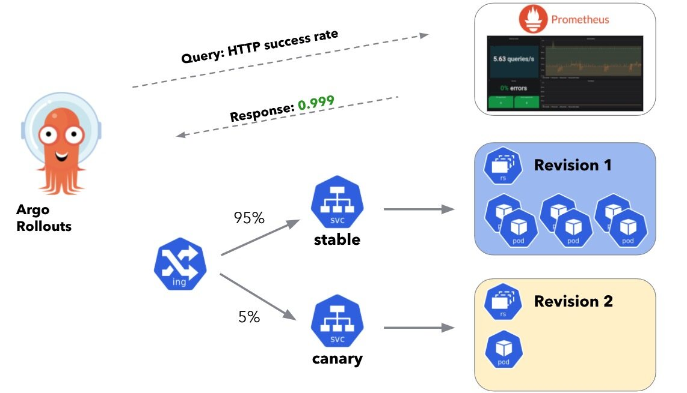


### 后台分析

金丝雀正在执行其部署步骤时，分析可以在后台运行。

以下示例是每 10 分钟逐渐将 Canary 权重增加 20%，直到达到 100%。在后台，基于名为 `success-rate` 的 `AnalysisTemplate` 启动 `AnalysisRun`，`success-rate` 模板查询 Prometheus 服务器，以 5 分钟间隔/样本测量 HTTP 成功率，它没有结束时间，一直持续到停止或失败。如果测量到的指标小于 95%，并且有三个这样的测量值，则分析被视为失败。失败的分析会导致 Rollout 中止，将 Canary 权重设置回零，并且 Rollout 将被视为降级。否则，如果 Rollout 完成其所有 Canary 步骤，则认为 rollout 是成功的，并且控制器将停止运行分析。

如下所示的 Rollout 资源对象：

```yaml
apiVersion: argoproj.io/v1alpha1
kind: Rollout
metadata:
  name: guestbook
spec:
  # ...
  strategy:
    canary:
      analysis:
        templates:
          - templateName: success-rate
        startingStep: 2 # 延迟开始分析，到第3步开始
        args:
          - name: service-name
            value: guestbook-svc.default.svc.cluster.local
      steps:
        - setWeight: 20
        - pause: { duration: 10m }
        - setWeight: 40
        - pause: { duration: 10m }
        - setWeight: 60
        - pause: { duration: 10m }
        - setWeight: 80
        - pause: { duration: 10m }
```

上面我们引用了一个 `success-rate` 的模板：

```yaml
apiVersion: argoproj.io/v1alpha1
kind: AnalysisTemplate
metadata:
  name: success-rate
spec:
  args:
    - name: service-name
  metrics:
    - name: success-rate
      interval: 5m
      # NOTE: prometheus queries return results in the form of a vector.
      # So it is common to access the index 0 of the returned array to obtain the value
      successCondition: result[0] >= 0.95
      failureLimit: 3
      provider:
        prometheus:
          address: http://prometheus.example.com:9090
          query: |
            sum(irate(
              istio_requests_total{reporter="source",destination_service=~"{{args.service-name}}",response_code!~"5.*"}[5m]
            )) /
            sum(irate(
              istio_requests_total{reporter="source",destination_service=~"{{args.service-name}}"}[5m]
            ))
```


### 内联分析

分析也可以作为内嵌分析步骤来执行，当分析以内联方式进行时，在到达该步骤时启动 AnalysisRun，并在运行完成之前阻止其推进。分析运行的成功或失败决定了部署是继续进行下一步，还是完全中止部署。

如下所示的示例中我们将 Canary 权重设置为 20%，暂停 5 分钟，然后运行分析。如果分析成功，则继续推出，否则中止。

```yaml
apiVersion: argoproj.io/v1alpha1
kind: Rollout
metadata:
  name: guestbook
spec:
  # ...
  strategy:
    canary:
      steps:
        - setWeight: 20
        - pause: { duration: 5m }
        - analysis:
            templates:
              - templateName: success-rate
            args:
              - name: service-name
                value: guestbook-svc.default.svc.cluster.local
```

上面的对象中我们将 analysis 作为一个步骤内联到了 Rollout 步骤中，当 20%流量暂停 5 分钟后，开始执行 `success-rate` 这个分析模板。

这里 AnalysisTemplate 与上面的后台分析例子相同，但由于没有指定间隔时间，分析将执行一次测量就完成了。

```yaml
apiVersion: argoproj.io/v1alpha1
kind: AnalysisTemplate
metadata:
  name: success-rate
spec:
  args:
    - name: service-name
    - name: prometheus-port
      value: 9090
  metrics:
    - name: success-rate
      successCondition: result[0] >= 0.95
      provider:
        prometheus:
          address: "http://prometheus.example.com:{{args.prometheus-port}}"
          query: |
            sum(irate(
              istio_requests_total{reporter="source",destination_service=~"{{args.service-name}}",response_code!~"5.*"}[5m]
            )) /
            sum(irate(
              istio_requests_total{reporter="source",destination_service=~"{{args.service-name}}"}[5m]
            ))
```

此外我们可以通过指定 count 和 interval 字段，可以在一个较长的时间段内进行多次测量。

```yaml
metrics:
  - name: success-rate
    successCondition: result[0] >= 0.95
    interval: 60s
    count: 5
    provider:
      prometheus:
        address: http://prometheus.example.com:9090
        query: ...
```


### 多个模板的分析

Rollout 在构建 AnalysisRun 时可以引用多个 AnalysisTemplate。这样我们就可以从多个 AnalysisTemplate 中来组成分析，如果引用了多个模板，那么控制器将把这些模板合并在一起，控制器会结合所有模板的指标和 args 字段。如下所示：

```yaml
apiVersion: argoproj.io/v1alpha1
kind: Rollout
metadata:
  name: guestbook
spec:
  # ...
  strategy:
    canary:
      analysis:
        templates:
          - templateName: success-rate
          - templateName: error-rate
        args:
          - name: service-name
            value: guestbook-svc.default.svc.cluster.local
---
apiVersion: argoproj.io/v1alpha1
kind: AnalysisTemplate
metadata:
  name: success-rate
spec:
  args:
    - name: service-name
  metrics:
    - name: success-rate
      interval: 5m
      successCondition: result[0] >= 0.95
      failureLimit: 3
      provider:
        prometheus:
          address: http://prometheus.example.com:9090
          query: |
            sum(irate(
              istio_requests_total{reporter="source",destination_service=~"{{args.service-name}}",response_code!~"5.*"}[5m]
            )) /
            sum(irate(
              istio_requests_total{reporter="source",destination_service=~"{{args.service-name}}"}[5m]
            ))
---
apiVersion: argoproj.io/v1alpha1
kind: AnalysisTemplate
metadata:
  name: error-rate
spec:
  args:
    - name: service-name
  metrics:
    - name: error-rate
      interval: 5m
      successCondition: result[0] <= 0.95
      failureLimit: 3
      provider:
        prometheus:
          address: http://prometheus.example.com:9090
          query: |
            sum(irate(
              istio_requests_total{reporter="source",destination_service=~"{{args.service-name}}",response_code=~"5.*"}[5m]
            )) /
            sum(irate(
              istio_requests_total{reporter="source",destination_service=~"{{args.service-name}}"}[5m]
            ))
```

当执行的分析的时候，控制器会将上面的 `success-rate` 和 `error-rate` 两个模板合并到一个 `AnalysisRun` 对象中去。

需要注意的是如果出现以下情况，控制器在合并模板时将出错：

- 模板中的多个指标具有相同的名称
- 两个同名的参数都有值


### 分析模板参数

AnalysisTemplates 可以声明一组参数，这些参数可以由 Rollouts 传递。然后，这些参数可以像在 metrics 配置中一样使用，并在 AnalysisRun 创建时被实例化，参数占位符被定义为 `{{ args.<name> }}`，如下所示：

```yaml
apiVersion: argoproj.io/v1alpha1
kind: AnalysisTemplate
metadata:
  name: args-example
spec:
  args:
    # required
    - name: service-name
    - name: stable-hash
    - name: latest-hash
    # optional
    - name: api-url
      value: http://example/measure
    # from secret
    - name: api-token
      valueFrom:
        secretKeyRef:
          name: token-secret
          key: apiToken
  metrics:
    - name: webmetric
      successCondition: result == 'true'
      provider:
        web:
          # placeholders are resolved when an AnalysisRun is created
          url: "{{ args.api-url }}?service={{ args.service-name }}"
          headers:
            - key: Authorization
              value: "Bearer {{ args.api-token }}"
          jsonPath: "{$.results.ok}"
```

在创建 AnalysisRun 时，Rollout 中定义的参数与 AnalysisTemplate 的参数会合并，如下所示：

```yaml
apiVersion: argoproj.io/v1alpha1
kind: Rollout
metadata:
  name: guestbook
spec:
---
strategy:
  canary:
    analysis:
      templates:
        - templateName: args-example
      args:
        # required value
        - name: service-name
          value: guestbook-svc.default.svc.cluster.local
        # override default value
        - name: api-url
          value: http://other-api
        # pod template hash from the stable ReplicaSet
        - name: stable-hash
          valueFrom:
            podTemplateHashValue: Stable
        # pod template hash from the latest ReplicaSet
        - name: latest-hash
          valueFrom:
            podTemplateHashValue: Latest
```

此外分析参数也支持 `valueFrom`，用于读取 meta 数据并将其作为参数传递给 AnalysisTemplate，如下例子是引用元数据中的 env 和 region 标签，并将它们传递给 AnalysisTemplate。

```yaml
apiVersion: argoproj.io/v1alpha1
kind: Rollout
metadata:
  name: guestbook
  labels:
    appType: demo-app
    buildType: nginx-app
    ...
    env: dev
    region: us-west-2
spec:
...
  strategy:
    canary:
      analysis:
        templates:
        - templateName: args-example
        args:
        ...
        - name: env
          valueFrom:
            fieldRef:
              fieldPath: metadata.labels['env']
        # region where this app is deployed
        - name: region
          valueFrom:
            fieldRef:
              fieldPath: metadata.labels['region']
```


### 蓝绿预发布分析

使用 BlueGreen 策略的 Rollout 可以在使用预发布将流量切换到新版本之前启动一个 AnalysisRun。分析运行的成功或失败决定 Rollout 是否切换流量，或完全中止 Rollout，如下所示：

```yaml
kind: Rollout
metadata:
  name: guestbook
spec:
---
strategy:
  blueGreen:
    activeService: active-svc
    previewService: preview-svc
    prePromotionAnalysis:
      templates:
        - templateName: smoke-tests
      args:
        - name: service-name
          value: preview-svc.default.svc.cluster.local
```

上面我们的示例中一旦新的 ReplicaSet 完全可用，Rollout 会创建一个预发布的 AnalysisRun，Rollout 不会将流量切换到新版本，而是会等到分析运行成功完成。

注意：如果指定了 `autoPromotionSeconds` 字段，并且 Rollout 已经等待了 `auto promotion seconds` 的时间，Rollout 会标记 AnalysisRun 成功，并自动将流量切换到新版本。如果 AnalysisRun 在此之前完成，Rollout 将不会创建另一个 AnalysisRun，并等待 `autoPromotionSeconds` 的剩余时间。


### 蓝绿发布后分析

使用 BlueGreen 策略的 Rollout 还可以在流量切换到新版本后使用发布后分析。如果发布后分析失败或出错，Rollout 则进入中止状态，并将流量切换回之前的稳定 ReplicaSet，当后分析成功时，Rollout 被认为是完全发布状态，新的 ReplicaSet 将被标记为稳定，然后旧的 ReplicaSet 将根据 `scaleDownDelaySeconds`（默认为 30 秒）进行缩减。

```yaml
apiVersion: argoproj.io/v1alpha1
kind: Rollout
metadata:
  name: guestbook
spec:
---
strategy:
  blueGreen:
    activeService: active-svc
    previewService: preview-svc
    scaleDownDelaySeconds: 600 # 10 minutes
    postPromotionAnalysis:
      templates:
        - templateName: smoke-tests
      args:
        - name: service-name
          value: preview-svc.default.svc.cluster.local
```


### 失败条件

`failureCondition` 可以用来配置分析运行失败，下面的例子是每隔 5 分钟持续轮询 Prometheus 服务器来获得错误总数，如果遇到 10 个或更多的错误，则认为分析运行失败。

```yaml
metrics:
  - name: total-errors
    interval: 5m
    failureCondition: result[0] >= 10
    failureLimit: 3
    provider:
      prometheus:
        address: http://prometheus.example.com:9090
        query: |
          sum(irate(
            istio_requests_total{reporter="source",destination_service=~"{{args.service-name}}",response_code~"5.*"}[5m]
          ))
```


### 无结果的运行

分析运行 j 结果也可以被认为是不确定的，这表明运行既不成功，也不失败。无结果的运行会导致发布在当前步骤上暂停。这时需要人工干预，以恢复运行，或中止运行。当一个指标没有定义成功或失败的条件时，分析运行可能成为无结果的一个例子。

```yaml
metrics:
  - name: my-query
    provider:
      prometheus:
        address: http://prometheus.example.com:9090
        query: ...
```

此外当同时指定了成功和失败的条件，但测量值没有满足任何一个条件时，也可能发生不确定的分析运行。

```yaml
metrics:
  - name: success-rate
    successCondition: result[0] >= 0.90
    failureCondition: result[0] < 0.50
    provider:
      prometheus:
        address: http://prometheus.example.com:9090
        query: ...
```

不确定的分析运行的一个场景是使 Argo Rollouts 能够自动执行分析运行，并收集测量结果，但仍然允许我们来判断决定测量值是否可以接受，并决定继续或中止。


### 延迟分析运行

如果分析运行不需要立即开始（即给指标提供者时间来收集金丝雀版本的指标），分析运行可以延迟特定的指标分析。每个指标可以被配置为有不同的延迟，除了特定指标的延迟之外，具有后台分析的发布可以延迟创建分析运行，直到达到某个步骤为止

如下所示延迟一个指定的分析指标:

```yaml
metrics:
  - name: success-rate
    # Do not start this analysis until 5 minutes after the analysis run starts
    initialDelay: 5m
    successCondition: result[0] >= 0.90
    provider:
      prometheus:
        address: http://prometheus.example.com:9090
        query: ...
```

延迟开始后台分析运行，直到步骤 3（设定重量 40%）。

```yaml
apiVersion: argoproj.io/v1alpha1
kind: Rollout
metadata:
  name: guestbook
spec:
  strategy:
    canary:
      analysis:
        templates:
          - templateName: success-rate
        startingStep: 2
      steps:
        - setWeight: 20
        - pause: { duration: 10m }
        - setWeight: 40
        - pause: { duration: 10m }
```


### Job Metrics

此外 Kubernetes Job 还可用于运行分析，使用 Job 时，如果 Job 完成且退出代码为零，则指标被视为成功，否则指标失败。

```yaml
metrics:
  - name: test
    provider:
      job:
        metadata:
          annotations:
            foo: bar # annotations defined here will be copied to the Job object
          labels:
            foo: bar # labels defined here will be copied to the Job object
        spec:
          backoffLimit: 1
          template:
            spec:
              containers:
                - name: test
                  image: my-image:latest
                  command:
                    [my-test-script, my-service.default.svc.cluster.local]
              restartPolicy: Never
```


### Web Metrics

同样还可以针对某些外部服务执行 HTTP 请求来获取测量结果。下面示例向某个 URL 发出 HTTP GET 请求。 Webhook 响应必须返回 JSON 内容。`jsonPath` 表达式的结果将分配给可在 `successCondition` 和 `failureCondition` 表达式中引用的 result 变量。如果省略，将使用整个 `body` 作为结果变量。

```yaml
metrics:
  - name: webmetric
    successCondition: result == true
    provider:
      web:
        url: "http://my-server.com/api/v1/measurement?service={{ args.service-name }}"
        timeoutSeconds: 20 # defaults to 10 seconds
        headers:
          - key: Authorization
            value: "Bearer {{ args.api-token }}"
        jsonPath: "{$.data.ok}"
```

比如下面的示例表示如果 `data.ok` 字段为真且 `data.successPercent` 大于 `0.90`，测量将是成功的。

```yaml
{ "data": { "ok": true, "successPercent": 0.95 } }
```

```yaml
metrics:
  - name: webmetric
    successCondition: "result.ok && result.successPercent >= 0.90"
    provider:
      web:
        url: "http://my-server.com/api/v1/measurement?service={{ args.service-name }}"
        headers:
          - key: Authorization
            value: "Bearer {{ args.api-token }}"
        jsonPath: "{$.data}"
```

当然关于 Argo Rollouts 的使用还有很多细节，可以参考官方文档：[https://argoproj.github.io/argo-rollouts/](https://argoproj.github.io/argo-rollouts/)以了解更多。


> 原文: <https://www.yuque.com/cnych/k8s4/cf5vc4a3zokcut8l>