# 52.KubeVela

[KubeVela](https://kubevela.io/) 是一个开箱即用的现代化应用交付与管理平台，它使得应用在面向混合云环境中的交付更简单、快捷，是开放应用模型（OAM）的一个实现，所以我们需要先了解下 OAM。


## OAM 简介

[OAM（Open Application Model）](https://oam.dev/) 是阿里巴巴和微软共同开源的**云原生应用规范模型**，OAM 的本质是根据软件设计的**兴趣点分离**原则对负责的 DevOps 流程的高度抽象和封装，一个以应用为中心的 K8s API 分层，这种模型旨在**定义云原生应用的标准**。

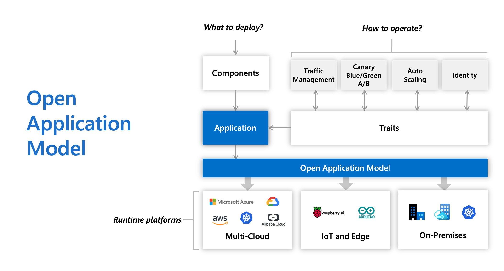

从 OAM 名称中可以看出，它是一个开放的应用模型：

- 开放（Open）：支持异构的平台、容器运行时、调度系统、云供应商、硬件配置等，总之与底层无关
- 应用（Application）：云原生应用
- 模型（Model）：定义标准，以使其与底层平台无关


### 为什么我们需要 OAM 模型呢？

现阶段应用管理的主要面临两个挑战：

- 对应用研发而言，Kubernetes 的 API 针对简单应用过于复杂，针对复杂应用却又难以上手；
- 对应用运维而言，Kubernetes 的扩展能力难以管理；Kubernetes 原生的 API 没有对云资源全部涵盖。

总体而言，面临的主要挑战就是：**如何基于 Kubernetes 提供真正意义上的应用管理平台，让研发和运维只需关注到应用本身**。

比如下面是一个典型的 K8s 资源清单文件，该 yaml 文件已经是被简化过的，但实际上还是比较长。

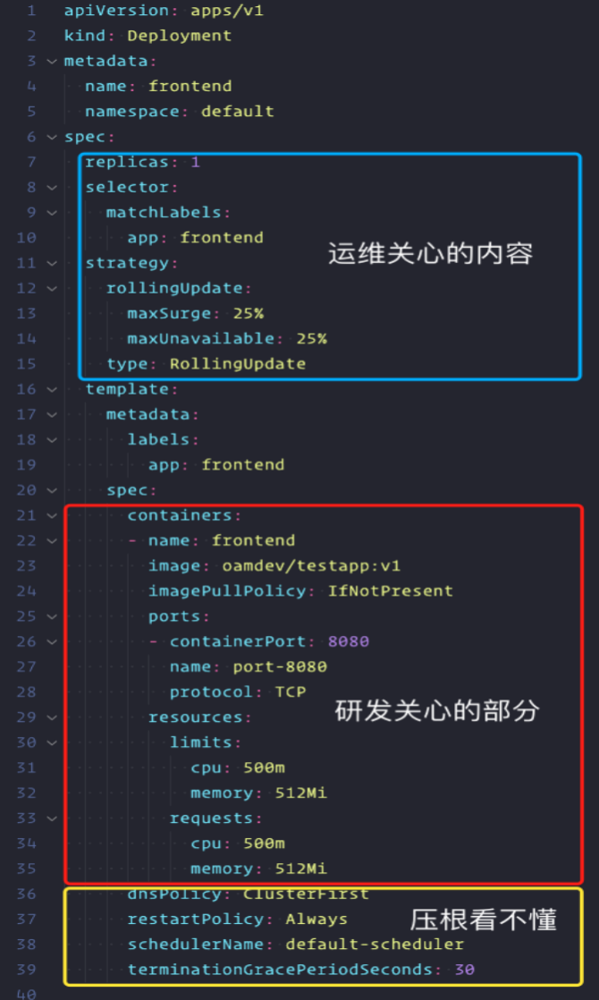

自上而下，我们可以大致把它们分为三块：

- 一块是扩缩容、滚动升级相关的参数，这一块一般是运维的同学比较关心的；
- 中间一块是镜像、端口、启动参数相关的，这一部分应该是开发的同学比较关心的；
- 最后一块大家可能根本看不懂，当然大部分情况下也不太需要明白，一般来说这属于 K8s 平台层的同学需要关心的内容。

看到这样一个 yaml 文件，我们很容易想到，只要把里面的字段封装一下，把该暴露的暴露出来就好了。这个时候我们就可以去开发一个应该管理平台，并做一个漂亮的前端界面给用户，只暴露给用户 5 个左右的字段，这显然可以大大降低用户理解 K8s 的心智负担，底层实现用类似模板的方式把这五个字段渲染成一个完整的 yaml 文件。

```yaml
image: quay.io/coreos/prometheus-operator:v0.34.0
args:
  - --logtostderr=true
ports:
  - containerPort: 8080
    name: http
    protocol: TCP
envs:
  - name: INNER-KEY
    value: app
volumes:
  - name: cache-volume
    emptyDir: {}
```

该方式针对简单无状态应用非常有效，精简 API 可以大大降低 K8s 的门槛。但是当出现大规模业务后，就会遇到很多复杂的应用，这个时候就会发现该 PaaS 应用平台能力不够了。比如 ZK 多实例选主、主从切换这些逻辑，在这五个字段里就很难描述了。因为屏蔽大量字段的方式会限制基础设施本身的能力，而 K8s 的能力是非常强大而灵活的，所以我们不可能为了简化而放弃掉 K8s 本身强大的能力。

中间件的工程师跟我们说，我这有个 Zookeeper 该用哪种 K8s 的工作负载接入呢？我们当然会想到可以让他们使用 Operator 了，于是他们就很懵逼的说到 Operator 是啥？

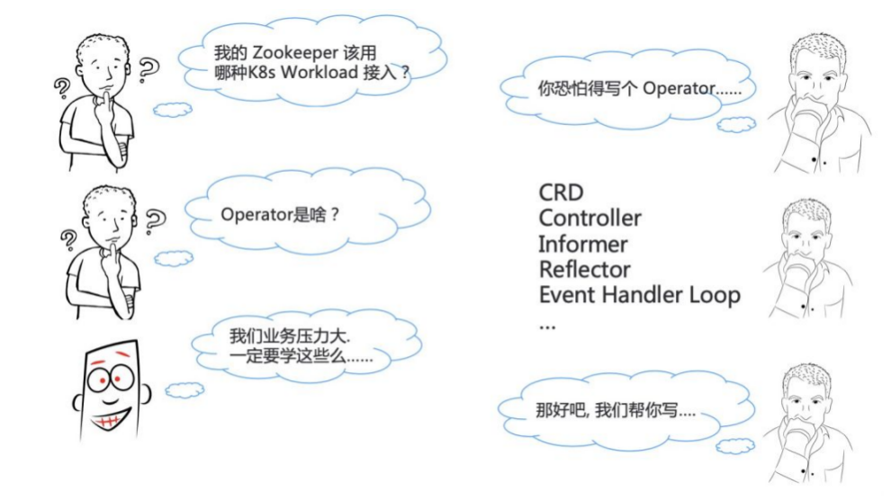

然后我们耐心的给他解释相关概念 `CRD`、`Controller`、`Informer`、`Reflector`、`Indexer` 这些就可以了，当然他们就更懵了，当然理论上也不需要理解。业务方更应该专注于他们的业务本身，当然我们就不得不帮他们一起写这个控制器了。为此我们需要一个统一的模型去解决研发对应用管理的诉求。

**除了研发侧的问题之外，在运维侧同样也会有很多挑战。**

K8s 的 CRD Operator 机制非常灵活而强大，不光是复杂应用可以通过编写 CRD Operator 实现，运维能力当然也可以通过 Operator 来扩展，比如灰度发布、流量管理、弹性扩缩容等等。

比如有一个案例就是开发了一个 CronHPA 的 CRD，可以定时设置 HPA 的范围，但是应用运维却并不知道该 CRD 会跟原生的 HPA 会产生冲突，结果自然是引起了故障。这血的教训提醒我们要做事前检查，熟悉 K8s 的机制很容易让我们想到为每个 Operator 加上 Admission Webhook。这个 Admission Webhook 需要拿到这个应用绑定的所有运维能力以及应用本身的运行模式，然后做统一的校验。如果这些运维能力都是一方提供的还好，如果存在两方，甚至三方提供的扩展能力，我们就没有一个统一的方式去获知了。

如果再深入思考下就知道我们需要一个统一的模型来协商并管理这些复杂的扩展能力。

云原生应用有一个很大的特点，那就是它往往会依赖云上的资源，包括数据库、网络、负载均衡、缓存等一系列资源。

当我们交付应用的时候比如使用 Helm 进行打包，我们只能针对 K8s 原生 API，而如果我们还想启动 RDS 数据库，就比较困难了。如果不想去数据库的交互页面，想通过 K8s 的 API 来管理，那就又不得不去写一个 CRD 来定义了，然后通过 Operator 去调用实际云资源的 API。

这一整套交付物实际上就是一个应用的完整描述，即我们所说的“应用定义”。这种定义方式最终所有的配置还是会全部堆叠到一个 yaml 文件里，这跟前面说的 all-in-one 问题其实是一样的，而且，这些应用定义最终也都成为了黑盒，除了对应项目本身可以使用，其他系统基本无法复用了。

而且事实上很多公司和团队也在根据自身业务需要进行定义，比如 Pinterest 定义的应用规范如下所示：


应用定义实际上是应用交付/分发不可或缺的部分，所以我们可以思考下是否可以定义足够开放的、可复用的应用模型呢？

一个应用定义需要容易上手，但又不失灵活性，更不能是一个黑盒。应用定义同样需要跟开源生态紧密结合，没有生态的应用定义注定是没有未来的，自然也很难持续的迭代和演进。

这也是为什么我们需要 OAM 的深层次的原因！！！

前面我们说的各种问题，归根结底在于 K8s 的 All in One API 是为平台提供者设计的，我们不能像下图左侧显示的一样，让应用的研发、运维跟 K8s 团队一样面对这一团 API。

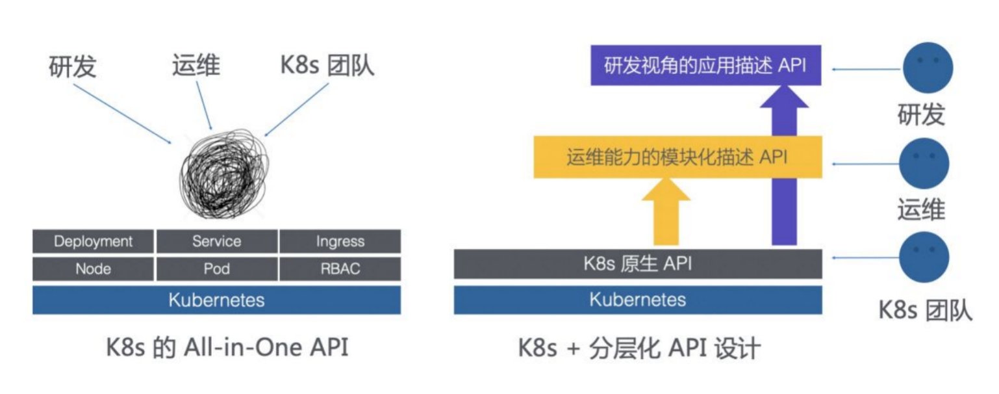

一个合理的应用模型应该具有区分使用者角色的分层结构，同时将运维能力模块化的封装。让不同的角色使用不同的 API，如上图右侧部分。


### OAM 模型定义

上面我们了解了为什么需要 OAM 模型，那么 OAM 模型到底是如何定义的呢？

在最新的 API 版本 v0.3.0 版本(core.oam.dev/v1beta1)中，OAM 定义了以下内容：

- `ComponentDefiniton`：组件模型，OAM 中最基础的单元，应用程序中的每个微服务都可以被描述为一个组件，在实践中，一个简单的容器化工作负载、Helm Chart 或云数据库都可以定义为一个组件。
- `WorkloadDefiniton`: 工作负载是一个特定组件定义的关键特征，由平台提供，以便用户可以检查平台并了解哪些工作负载类型可供使用。请注意，工作负载类型不允许最终用户创建新的（仅限平台提供商） 。
- `TraitDefinition`: 为组件工作负载实例增加的运维特征，运维人员可以对组件的配置做出具体的决定。例如，向 WordPress Helm Chart 的工作负载注入 sidecar 容器的 sidecar trait。特征可以是适用于单个组件的分布式应用程序的任何配置，例如负载均衡策略、网络入口路由、断路器、速率限制、自动扩展策略、升级策略等，特征是运维人员的关注点。
- `Application Scope`: 应用范围是通过提供不同形式的应用边界和相同组的行为，将组件组合成逻辑应用。应用范围可以决定组件是否可以被同时部署到同一应用范围类型的多个实例中。
- `Application`: Application 定义了在部署应用程序后将被实例化的组件列表。

因此，一个应用程序是由一组具有一些运维特征的组件组成的，并且被限定在一个或多个应用程序边界中。

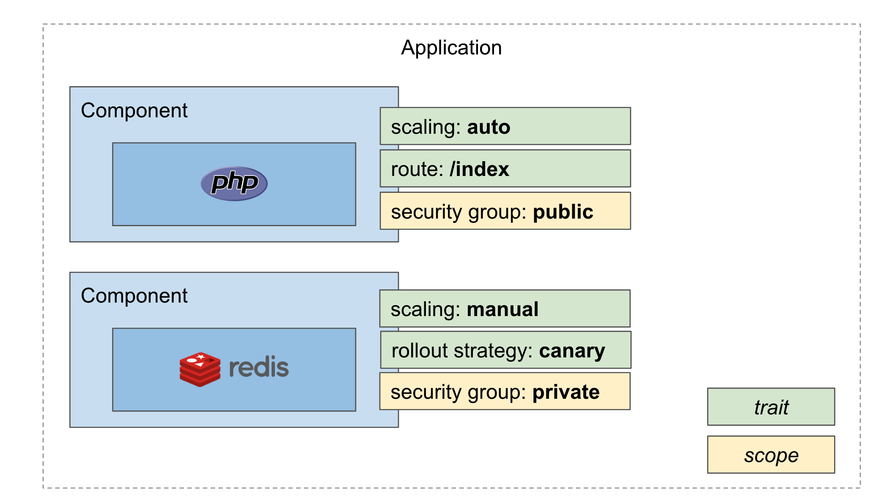

具体的模型定义规范可以查看 [OAM Spec](https://github.com/oam-dev/spec/blob/master/SPEC.md) 文档了解更多，不过需要注意的是现在 KubeVela 的规范和 OAM 的规范并不是完全一样的。


## KubeVela 简介

KubeVela 是 OAM 规范（实际上 OAM 规范会滞后于 KubeVela 中使用的规范）的一个实现，是一个开箱即用的现代化应用交付与管理平台，它使得应用在面向混合云环境中的交付更简单、快捷。使用 KubeVela 的软件开发团队，可以按需使用云原生能力构建应用，随着团队规模的发展、业务场景的变化扩展其功能，一次构建应用，随处运行。

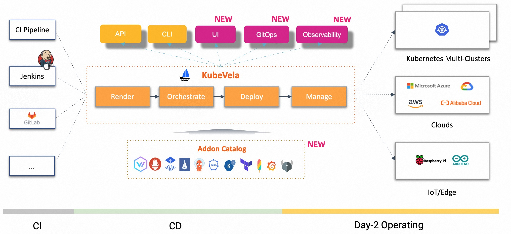


### 核心功能

KubeVela 具有以下几个核心功能：

-  应用部署即代码（Deployment as Code），完整定义全交付流程
使用 OAM 作为应用交付的顶层抽象，这种方式使你可以用声明式的方式描述应用交付全流程，自动化的集成 CI/CD 及 GitOps 体系，通过  CUE  轻松扩展或重新编写你的交付过程。 
-  天然支持企业级集成，安全、合规、可观测性一应俱全
支持多集群认证和授权并与 K8s RBAC 集成，还可以从社区的插件中心找到一系列开箱即用的平台扩展，包括多种用户体系（LDAP 等）集成、多租户权限控制、安全校验和扫描、应用可观测性等大量企业级能力。 
-  面向多云多集群混合环境，丰富的应用交付和管理能力
原生支持丰富的多集群/混合环境持续交付策略，包括金丝雀、蓝绿、多环境差异化配置等，同样也支持跨环境交付，这些交付策略为你的分布式交付流程提供了充足的效率和安全保证。 
-  轻量并且架构高度可扩展，满足企业不同场景的定制化需求
KubeVela 最小的部署模式仅需 1 个 pod （0.5 核 1G 内存）就可以用于部署上千个应用。其微内核、高可扩展的架构可以轻松满足你的扩展和定制化需求，衔接企业内部的权限体系、微服务、流量治理、配置管理、可观测性等模块。不仅如此，社区还有一个正在快速增长的插件市场可供你选择和使用，你可以在这里贡献、复用社区丰富的功能模块。 


### 关注点分离

关注点分离这个属于 KubeVela 的核心理念，它是 KubeVela 的设计哲学，也是 KubeVela 与众不同的地方。KubeVela 的用户天然分为两种角色，由公司的两个团队（或个人）承担。

-  **平台团队**
由平台工程师完成，他们需要准备应用部署环境，维护稳定可靠的基础设施功能（如 mysql operator），并将基础设施能力作为 KubeVela 模块定义注册到集群中。他们需要具备丰富的基础设施经验。 
-  **最终用户**
最终用户即业务应用的开发者，使用平台的过程中首先选择部署环境，然后挑选能力模块，填写业务参数并组装成 KubeVela 应用。他们无需关心基础设施细节。 

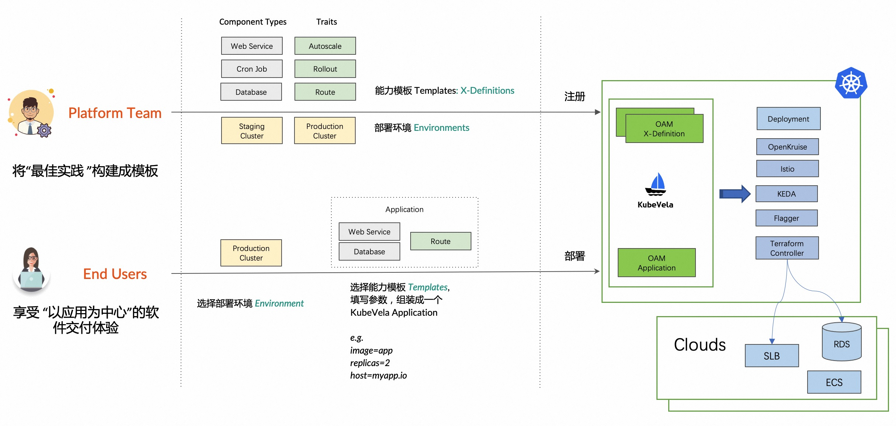


### 核心概念

KubeVela 遵循 OAM 规范通过一个 `Application` 的对象来声明一个微服务应用的完整交付流程，其中包含了待交付组件、关联的运维能力、交付流水线等内容。所有待交付组件、运维动作和流水线中的每一个步骤，都遵循 OAM 规范设计为独立的可插拔模块，允许用户按照自己的需求进行组合或者定制。

基本上 `Application`  对象是终端用户唯一需要了解的对象，它表达了一个微服务应用的部署计划。遵循 OAM 规范，一个应用部署计划（Application）由组件（Component）、运维特征（Trait）、部署工作流（Workflow）、应用执行策略（Policy）四部分组成，这些组件是平台构建者维护的可编程模块，这种抽象方式是高度可扩展、可定制的。

-  **组件（Component）**
组件是构成微服务应用的基本单元。一个应用中可以包括多个组件，最佳的实践方案是一个应用中包括一个主组件（核心业务）和附属组件（强依赖或独享的中间件，运维组件等）。KubeVela 内置支持多种类型的组件交付，包括 Helm Chart、容器镜像、CUE 模块、Terraform 模块等。同时也允许平台管理员以 CUE 语言的形式定制其它任意类型的组件。 
-  **运维特征（Trait）**
运维特征是可以随时绑定给待部署组件的模块化、可拔插的运维能力，比如：副本数调整、数据持久化、设置网关策略、自动设置 DNS 解析等。用户可以从社区获取成熟的能力，也可以自行定义。 
-  **工作流（Workflow）**
工作流由多个步骤组成，允许用户自定义应用在某个环境的交付过程。典型的工作流步骤包括人工审核、数据传递、多集群发布、通知等。 
-  **应用策略（Policy）**
应用策略负责定义指定应用交付过程中的策略，比如多集群部署的差异化配置、安全组策略、防火墙规则等。 

整体定义如下所示：

```yaml
apiVersion: core.oam.dev/v1beta1
kind: Application
metadata:
  name: <应用名称>
spec:
  components:
    - name: <组件名称1>
      type: <组件类型1>
      properties: <组件参数>
      traits:
        - type: <运维特征类型1>
          properties: <运维特征类型>
        - type: <运维特征类型2>
          properties: <运维特征类型>
    - name: <组件名称2>
      type: <组件类型2>
      properties: <组件参数>
  policies:
    - name: <应用策略名称>
      type: <应用策略类型>
      properties: <应用策略参数>
  workflow:
    - name: <工作流节点名称>
      type: <工作流节点类型>
      properties: <工作流节点参数>
```

无论待交付的组件是 Helm Chart 还是云数据库，目标基础设施是 Kubernetes 集群还是云平台，KubeVela 都通过 Application 这样一个统一的、上层的交付描述文件来同用户交互，不会泄露任何复杂的底层基础设施细节，真正做到让用户完全专注于应用研发和交付本身。

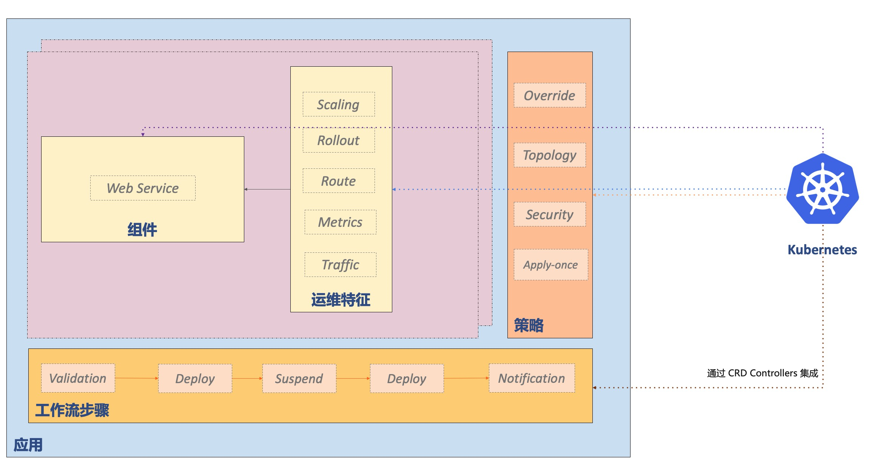

在实际使用时，用户通过上述 Application 对象来引用预置的组件、运维特征、应用策略、以及工作流节点模块，填写这些模块暴露的用户参数即可完成一次对应用交付的建模。

当然上面提到的几个类型背后都是由一组称为模块定义（Definitions）的可编程模块来提供具体功能。KubeVela 会像胶水一样基于 K8s API 定义基础设施定义的抽象并将不同的能力组合起来。

将定义的 OAM 模块和背后的 K8s CRD 控制器结合起来就可以形成 KubeVela 的 Addon 插件，社区已经有一个完善的且在不断扩大的插件市场，比如  `terraform` 插件提供了云资源的供给，`fluxcd` 插件提供了 GitOps 能力等等。我们可以自己根据需求开发插件，类似于 Helm 可以提供一个插件仓库来发现和分发插件。


### KubeVela 架构

KubeVela 的整体架构如下所示：

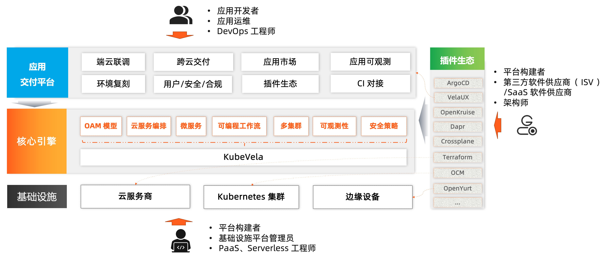

**KubeVela 是一个的应用交付与管理控制平面**，它架在 Kubernetes 集群、云平台等基础设施之上，通过 OAM 来对组件、云服务、运维能力、交付工作流进行统一的编排和交付。KubeVela 这种与基础设施本身完全解耦的设计，很容易就能帮助你面向混合云/多云/多集群基础设施进行应用交付与管理。

而为了能够同任何 CI 流水线或者 GitOps 工具无缝集成，KubeVela 的 API 被设计为是声明式、完全以应用为中心的，它包括：

- 帮助用户定义应用交付计划的 Application 对象
- 帮助平台管理员通过 CUE 语言定义平台能力和抽象的 `X-Definition` 对象，比如 `ComponentDefinition`、`TraitDefinition` 等。

在具体实现上，KubeVela 依赖一个独立的 Kubernetes 集群来运行。具体来说，KubeVela 主要由如下几个部分组成:

- **KubeVela 核心控制器**：为整个系统提供核心控制逻辑，完成诸如编排应用和工作流、修订版本快照、垃圾回收等等基础逻辑。
- **Cluster Gateway 控制器**：提供统一的多集群访问接口和操作。
- **插件体系**：注册和管理 KubeVela 的扩展功能，包括 CRD 控制器和相关模块定义。例如，下面列出了几个常用的插件： 
   - `VelaUX` 插件是 KubeVela 的 Web UI。 此外，它在架构中更像是一个功能齐全的 “应用交付平台”，将业务逻辑耦合在起特定的 API 中，并为不了解 k8s 的业务开发者提供开箱即用的平台体验。
   - `Workflow` 插件是一个独立的工作流引擎，可以作为统一的 Pipeline 运行以部署多个应用程序或其他操作。与传统 Pipeline 相比，它主要使用 CUE 驱动基于 IaC 的 API，而不是每一步都运行容器（或 pod）。 它与 KubeVela 核心控制器的应用工作流使用相同的机制。
   - `Vela Prism` 插件是 KubeVela 的扩展 API 服务器，基于 Kubernetes Aggregated API 机制构建。它可以将诸如 Grafana 创建仪表盘等第三方服务 API 映射为 Kubernetes API，方便用户将第三方资源作为 Kubernetes 原生资源进行 IaC 化管理。
   - `Terraform` 插件允许用户使用 Terraform 通过 Kubernetes 自定义资源管理云资源。
   - 此外，KubeVela 有一个不断增长的插件市场，其中已经包含 50 多个用于集成的社区插件，包括 ArgoCD、FluxCD、Backstage、OpenKruise、Dapr、Crossplane、Terraform、OpenYurt 等等。
- 如果你还没有任何 Kubernetes 集群，构建在 k3s 和 k3d 之上的 `VelaD` 工具可以帮助你一键启动所有这些东西。它将 KubeVela 与 Kubernetes 控制平面集成在一起，这对于构建开发/测试环境非常有帮助。

还有一个非常重要的点是 **KubeVela 是可编程的**。现实世界中的应用交付，往往是一个比较复杂的过程。哪怕是一个比较通用的交付流程，也会因为场景、环境、用户甚至团队的不同而千差万别。所以 KubeVela 从第一天起就采用了一种可编程式的方法来实现它的交付模型，这使得 KubeVela 可以以前所未有的灵活度适配到你的应用交付场景中。


## KubeVela 安装

如果你没有 K8s 环境，可以选择使用 [VelaD](https://github.com/kubevela/velad) 来独立安装 KubeVela。它是一个命令行工具，将 KubeVela 最小安装以及使用 VelaUX 的一切依赖打包为一个可执行文件，VelaD 会集成了 K3s 和 k3d 用于自动化管理 Kubernetes 集群。

我们这里当然选择基于先有的 K8s 集群来安装 KubeVela。要求集群版本 `>= v1.19 && <= v1.26`。

首先需要安装 KubeVela 命令行工具，KubeVela CLI 提供了常用的集群和应用管理能力，直接使用下面的命令即可安装：

```bash
curl -fsSl https://kubevela.io/script/install.sh | bash
```

安装完成后，可以通过 `vela version` 命令查看版本信息：

```bash
$ vela version
CLI Version: 1.9.6
Core Version:
GitRevision: git-9c57c098
GolangVersion: go1.19.12
```

然后我们可以使用如下命令来安装 KubeVela 控制平面：

```bash
vela install
```

安装完成后，会创建一个 `vela-system` 的命名空间，对应的 Pod 列表如下所示：

```bash
$ kubectl get pods -n vela-system
NAME                                                        READY   STATUS      RESTARTS   AGE
kubevela-cluster-gateway-b689d74dc-mtzrh                    1/1     Running     0          134m
kubevela-vela-core-85fd59d846-49q22                         1/1     Running     0          134m
kubevela-vela-core-admission-patch-8x9lv                    0/1     Completed   0          131m
kubevela-vela-core-cluster-gateway-tls-secret-patch-xjcw9   0/1     Completed   0          129m
```

当然如果你习惯使用 Helm，也可以通过如下 Helm 命令完成 VelaCore 的安装和升级：

```bash
helm repo add kubevela https://charts.kubevela.net/core
helm repo update
helm upgrade --install --create-namespace -n vela-system kubevela kubevela/vela-core --wait
```

上面的只是安装了 KubeVela 控制平面，我们一般情况下也会安装 VelaUX，它是 KubeVela 的 UI 控制台，可以通过浏览器访问它，当然你也可以不安装，这是可选的。

要安装也非常简单，只需要执行下面的命令启用 `velaux` 插件即可：

```bash
vela addon enable velaux
```

VelaUX 需要认证访问，默认的用户名是 `admin`，默认密码是 `VelaUX12345`。请务必在第一次登录之后重新设置和保管好你的新密码。

另外默认情况下，VelaUX 没有暴露任何端口。端口转发会以代理的方式允许你通过本地端口来访问 VelaUX 控制台。

```bash
vela port-forward addon-velaux -n vela-system
```

选择 `> local | velaux | velaux` 来启用端口转发。

VelaUX 控制台插件支持三种和 Kubernetes 服务一样的服务访问方式，它们是：`ClusterIP`、`NodePort` 以及 `LoadBalancer`，默认的服务访问方式为 ClusterIP。我们可以用下面的方式来改变 VelaUX 控制台的访问方式

```bash
vela addon enable velaux serviceType=LoadBalancer
# 或者
vela addon enable velaux serviceType=NodePort
```

一旦服务访问方式指定为 `LoadBalancer` 或者 `NodePort`，你可以通过执行 `vela status`来获取访问地址：

```bash
vela status addon-velaux -n vela-system --endpoint
```

期望得到的输出如下：

```bash
+----------------------------+----------------------+
|  REF(KIND/NAMESPACE/NAME)  |       ENDPOINT       |
+----------------------------+----------------------+
| Service/vela-system/velaux | http://<IP address> |
+----------------------------+----------------------+
```

如果你集群中拥有可用的 ingress 和域名，那么你可以按照下面的方式给你的 VelaUX 在部署过程中指定一个域名。

```bash
$ vela addon enable velaux domain=vela.k8s.local
Addon velaux enabled successfully.
Please access addon-velaux from the following endpoints:
+---------+---------------+-----------------------------------+--------------------------------+-------+
| CLUSTER |   COMPONENT   |     REF(KIND/NAMESPACE/NAME)      |            ENDPOINT            | INNER |
+---------+---------------+-----------------------------------+--------------------------------+-------+
| local   | velaux-server | Service/vela-system/velaux-server | velaux-server.vela-system:8000 | true  |
| local   | velaux-server | Ingress/vela-system/velaux-server | http://vela.k8s.local          | false |
+---------+---------------+-----------------------------------+--------------------------------+-------+
    To open the dashboard directly by port-forward:

    vela port-forward -n vela-system addon-velaux 8000:8000

    Please refer to https://kubevela.io/docs/reference/addons/velaux for more VelaUX addon installation and visiting method.
```

此外 VelaUX 支持 Kubernetes 和 MongoDB 作为其数据库。默认数据库为 Kubernetes，我们强烈建议你通过使用 MongoDB 来增强你的生产环境使用体验。

```bash
vela addon enable velaux dbType=mongodb dbURL=mongodb://<MONGODB_USER>:<MONGODB_PASSWORD>@<MONGODB_URL>
```


### VelaUX

现在我们可以通过 `http://vela.k8s.local` 来访问 VelaUX 控制台了，第一次访问可以配置管理员账号信息：

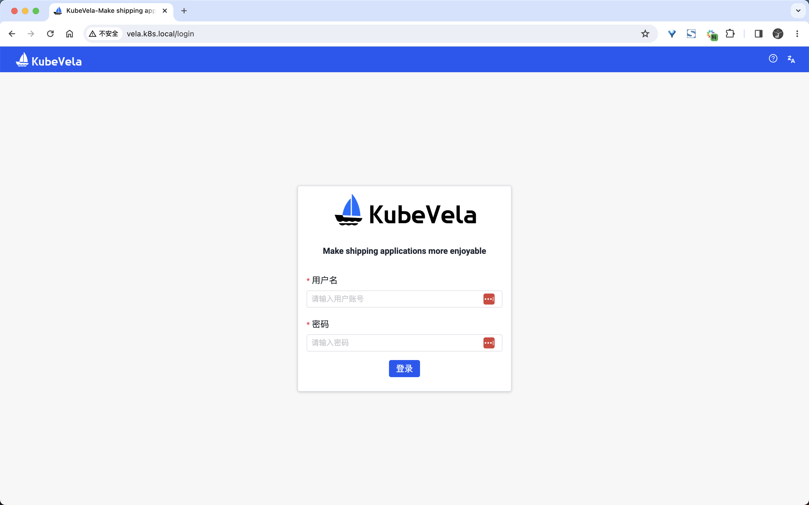

VelaUX 是 KubeVela 的插件，它是一个企业可以开箱即用的云原生应用交付和管理平台。与此同时，也加入了一些企业使用中需要的概念。

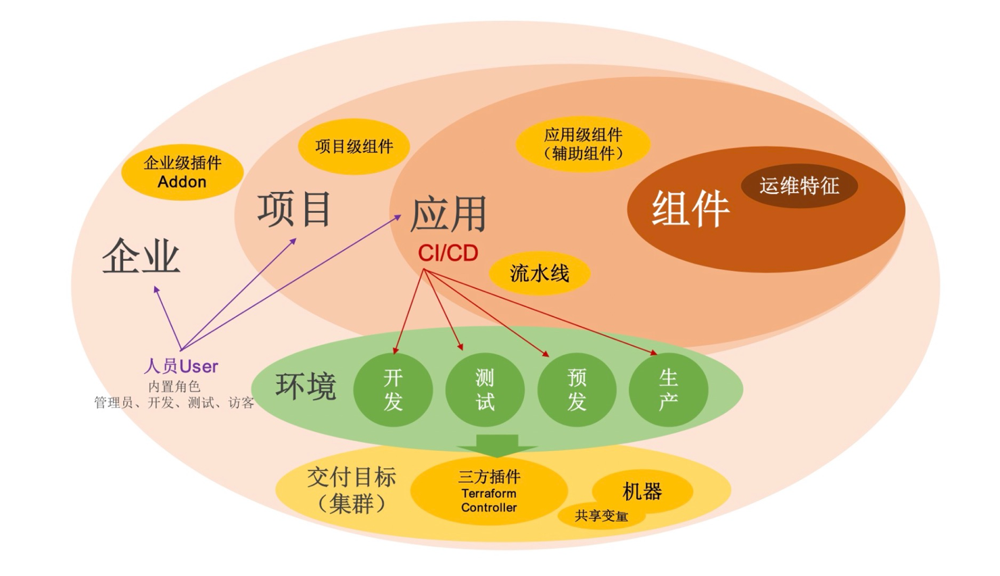

**项目（Project）**

项目作为在 KubeVela 平台组织人员和资源的业务承载，项目中可以设定成员、权限、应用和分配环境。在项目维度集成外部代码库、制品库，呈现完整 CI/CD Pipeline；集成外部需求管理平台，呈现项目需求管理；集成微服务治理，提供多环境业务联调和统一治理能力。项目提供了业务级的资源隔离能力。

默认情况下，VelaUX 会创建一个名为 `default` 的项目，你可以在 `项目管理` 中创建更多的项目。

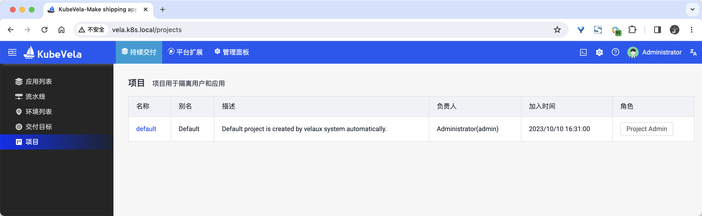

**环境（Environment）**

环境指通常意义的开发、测试、生产的环境业务描述，它可以包括多个交付目标。环境协调上层应用和底层基础设施的匹配关系，不同的环境对应管控集群的不同 Kubernetes Namespace。处在同一个环境中的应用才能具备内部互访和资源共享能力。

同样默认情况下，VelaUX 会创建一个名为 `default` 的环境，你可以在 `环境管理` 中创建更多的环境。

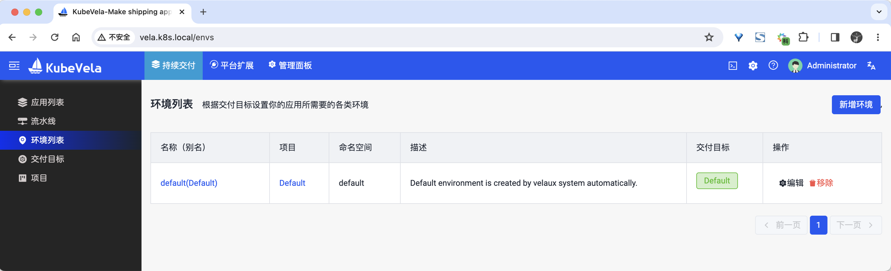

应用可绑定多个环境进行发布，对于每一个环境可设置环境级部署差异。

**交付目标（Target）**

交付目标用于描述应用的相关资源实际部署的物理空间，对应 Kubernetes 集群或者云的区域（Region）和专有网络（VPC）。对于普通应用，组件渲染生成的资源会在交付目标指定的 Kubernetes 集群中创建（可以精确到指定集群的 Namespace）；对于云服务，资源创建时会根据交付目标中指定的云厂商的参数创建到对应的区域和专有网络中，然后将生成的云资源信息分发到交付目标指定的 Kubernetes 集群中。单个环境可关联多个交付目标，代表该环境需要多集群交付。单个交付目标只能对应一个环境。

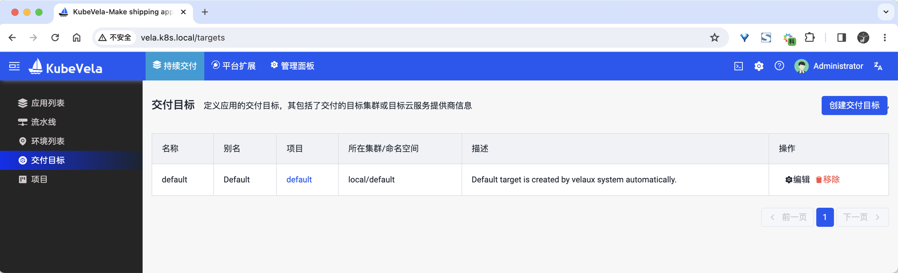

**应用（Application）**

应用是定义了一个微服务业务单元所包括的制品（二进制、Docker 镜像、Helm Chart...）或云服务的交付和管理需求，它由组件、运维特征、工作流、应用策略四部分组成，应用的生命周期操作包括：

- **创建(Create)** 应用是创建元信息，并不会实际部署和运行资源。
- **部署(Deploy)** 指执行指定的工作流， 将应用在某一个环境中完成实例化。
- **回收(Recycle)** 删除应用部署到某一个环境的实例，回收其占用的资源。
- **删除**应用会删除元数据，前提是应用实例已经完全被回收后才能删除。

VelaUX 应用中其他概念均与 KubeVela 控制器中的概念完全一致。


## 第一个 KubeVela 应用

上面我们已经安装好了 KubeVela，接下来我们就可以开始使用 KubeVela 来部署我们的第一个应用了。

下面我们定义了一个简单的 OAM 应用，它包括了一个无状态服务组件和运维特征，然后定义了三个部署策略和工作流步骤。此应用描述的含义是将一个服务部署到两个目标命名空间，并且在第一个目标部署完成后等待人工审核后部署到第二个目标，且在第二个目标时部署 2 个实例。

```yaml
# first-vela-app.yaml
apiVersion: core.oam.dev/v1beta1
kind: Application
metadata:
  name: first-vela-app
spec:
  components:
    - name: express-server
      type: webservice # webservice 是一个内置的组件类型
      properties: # 组件参数
        image: oamdev/hello-world
        ports:
          - port: 8000
            expose: true
      traits: # 组件运维特征
        - type: scaler
          properties:
            replicas: 1
  policies:
    - name: target-default
      type: topology # topology 是一个内置的应用策略类型，它可以将应用部署到多个目标
      properties:
        clusters: ["local"] # local 集群即 Kubevela 所在的集群
        namespace: "default"
    - name: target-prod
      type: topology
      properties:
        clusters: ["local"]
        namespace: "prod" # 此命名空间需要在应用部署前完成创建
    - name: deploy-ha
      type: override # override 是一个内置的应用策略类型，它可以覆盖组件的参数
      properties:
        components:
          - type: webservice
            traits:
              - type: scaler
                properties:
                  replicas: 2
  workflow: # 应用工作流
    steps:
      - name: deploy2default
        type: deploy # deploy 是一个内置的工作流类型，它可以将应用部署到指定的目标
        properties:
          policies: ["target-default"]
      - name: manual-approval
        type: suspend # suspend 是一个内置的工作流类型，它可以暂停工作流的执行
      - name: deploy2prod
        type: deploy
        properties:
          policies: ["target-prod", "deploy-ha"]
```

要先创建 `prod` 命名空间，可以使用 `vela env init` 命令，当然也可以直接使用 `kubectl create ns` 命令：

```bash
# 此命令用于在管控集群创建命名空间
vela env init prod --namespace prod
```

接下来就可以启动我们的第一个 KubeVela 应用了:

```bash
$ vela up -f first-vela-app.yaml
Applying an application in vela K8s object format...
✅ App has been deployed 🚀🚀🚀
    Port forward: vela port-forward first-vela-app -n prod
             SSH: vela exec first-vela-app -n prod
         Logging: vela logs first-vela-app -n prod
      App status: vela status first-vela-app -n prod
        Endpoint: vela status first-vela-app -n prod --endpoint
Application prod/first-vela-app applied.
```

`vela up` 命令会将上面定义的 Application 对象根据我们的描述翻译渲染成对应的 K8s 资源对象，部署完成后可以使用 vela 的相关命令来了解该应用的相关信息。

首先可以使用 `vela status` 命令来查看下应用的当前状态。由于上面应用定义的 Workflow 是先将应用部署到 local 集群的 default 命名空间中，然后进入第二个步骤的时候是一个 `suspend` 类型的工作流，所以正常情况下应用完成第一个目标部署后会进入暂停状态（左侧的 `workflowSuspending` 状态）。

```bash
$ vela status first-vela-app -n prod
About:

  Name:         first-vela-app
  Namespace:    prod
  Created at:   2023-10-10 16:50:17 +0800 CST
  Status:       workflowSuspending

Workflow:

  mode: StepByStep-DAG
  finished: false
  Suspend: true
  Terminated: false
  Steps
  - id: kkotnerd76
    name: deploy2default
    type: deploy
    phase: succeeded
  - id: axtmf24jcx
    name: manual-approval
    type: suspend
    phase: suspending
    message: Suspended by field suspend

Services:

  - Name: express-server
    Cluster: local  Namespace: default
    Type: webservice
    Healthy Ready:1/1
    Traits:
      ✅ scaler
```

要继续工作流，则需要进行人工审核（左侧显示的第二个步骤），批准应用进入第二个目标部署，直接使用下面的命令即可：

```bash
vela workflow resume first-vela-app
```

当然在 VelaxUX 控制台中也可以看到应用的状态，也可以在控制台中直接进行人工审核操作。


审批通过后会执行第三个步骤 `deploy2prod`，应用 `target-prod`、`deploy-ha` 这两个策略了。

经过上面的整个工作流过后，最终应用会在 default 命名空间下面创建一个 Pod，在 prod 命名空间下面创建两个副本的 Pod。

```bash
$ kubectl get pods -n prod
NAME                              READY   STATUS    RESTARTS   AGE
express-server-5447567596-jcpnh   1/1     Running   0          72s
express-server-5447567596-lgqdz   1/1     Running   0          72s
$ kubectl get pods
NAME                                     READY   STATUS    RESTARTS         AGE
express-server-5447567596-clbgb          1/1     Running   0                7m36s
```

在 VelaUX 控制台中也可以看到应用的状态：

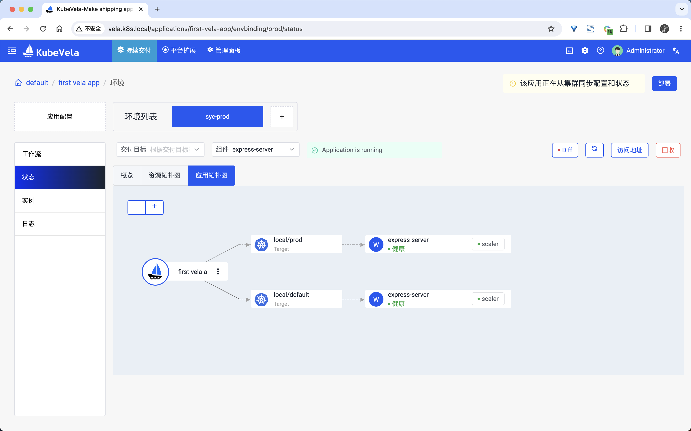

到这里就完成了我们的第一个 KubeVela 应用的部署流程。

## 应用交付

上面我们已经完成了第一个 KubeVela 应用的部署，接下来我们来看下 KubeVela 的应用交付的一些常用场景。


### 容器镜像交付

这里我们介绍 KubeVela 通过容器镜像交付业务应用的操作方式，通过该方式交付应用无需你学习过多的 Kubernetes 领域知识。

当然首先我们需要完成业务应用的容器化，无论使用的是何种开发语言，请先将其通过 CI 系统或在本地完成镜像打包。然后将镜像推送到镜像仓库中，并且保证 KubeVela 管理的集群可以正常获取到该镜像。

下面我们来通过 VelaUX 来完成一个简单的容器镜像交付的操作。

进入应用管理页面，点击右上方的**新增应用**按钮，进入应用创建弹窗页面，输入应用名称等基础信息，选择项目、选择 `webservice` 组件类型，并选择需要部署的环境。

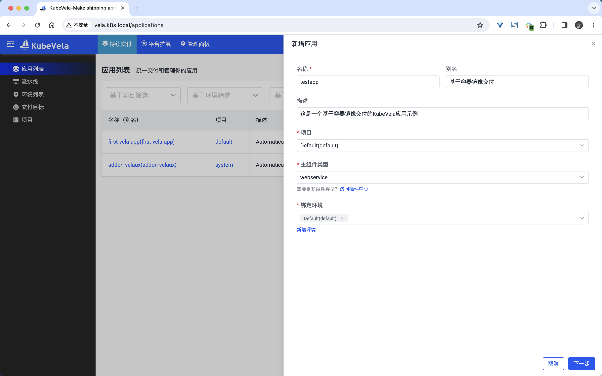

点击下一步进入组件部署属性配置页面，如图所示，填写镜像名称、启动命令，端口等信息。根据你的集群支持情况选择合适的服务暴露方式，这里我们选择 `NodePort` 方式。

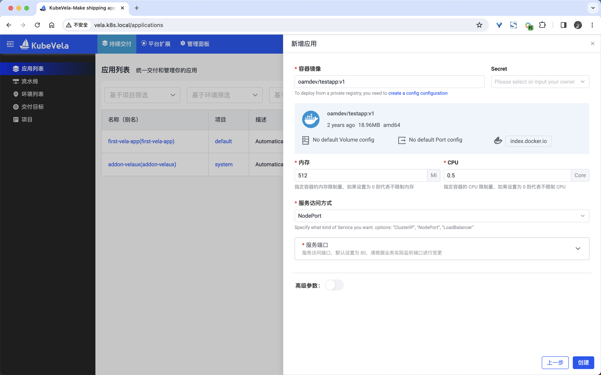

当你输入完镜像名称后，系统将自动开始加载镜像信息。如果你输入的镜像属于已配置的私有镜像仓库，Secret 字段将自动赋值。然后点开**服务端口**配置端口信息，点击**Add**按钮，输入端口号和协议，点击**确定**按钮完成端口配置。

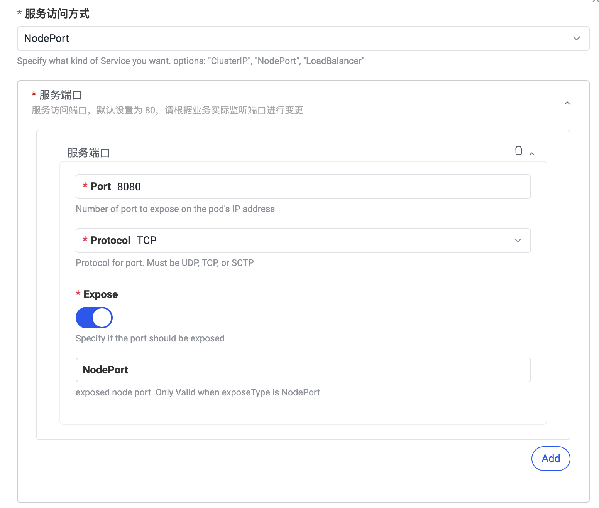

然后开启高级参数，因为这里我们需要配置 CMD 启动命令，开启后添加启动命令 `node server.js`。

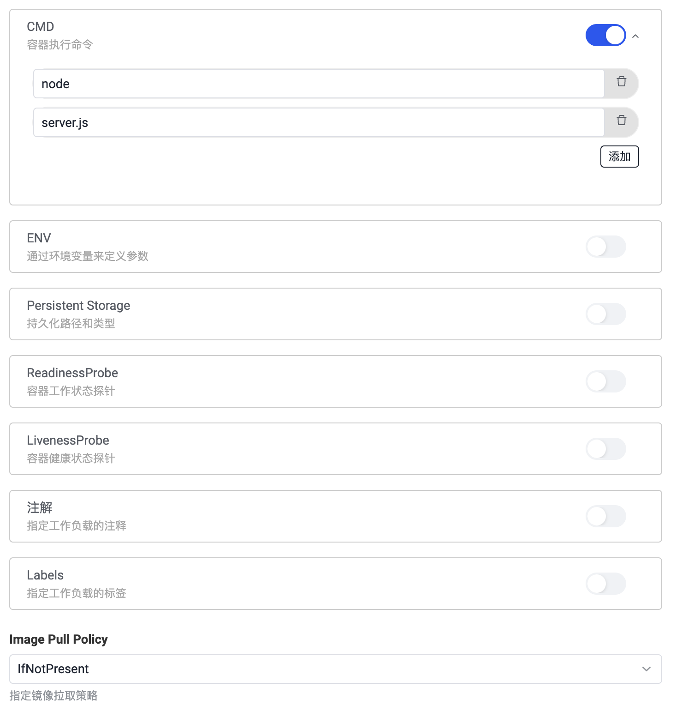

如果有其他需求，可以在高级参数中添加环境变量、挂载卷等信息。然后点击**创建**按钮即完成应用初始化配置。

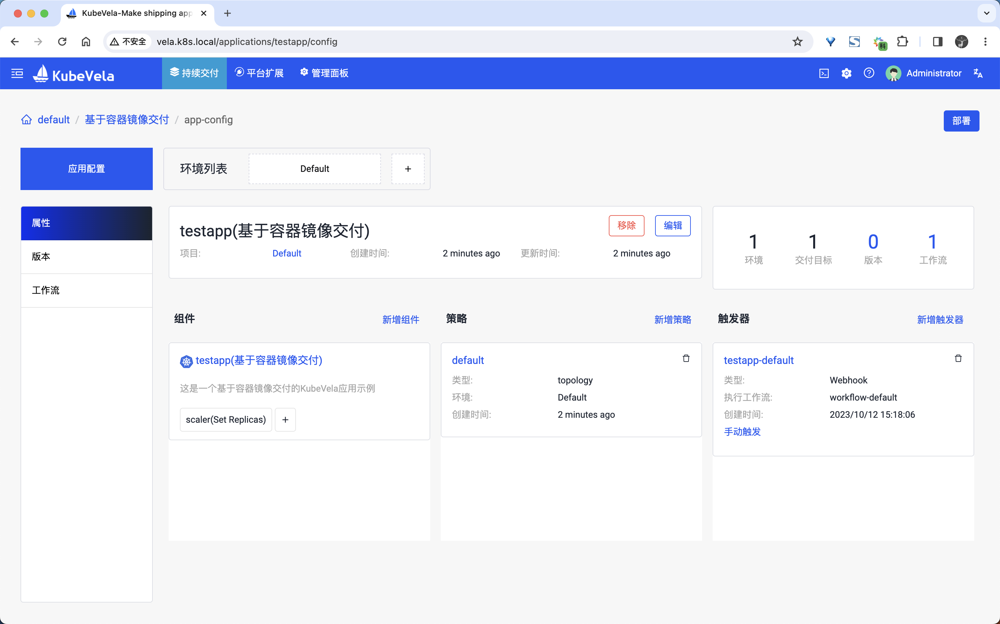

可以看到默认情况下组件会带上一个 `scaler` 的运维特征，它会将组件的副本数设置为 1。如果你需要修改副本数，可以点击**scaler**就行修改，修改副本数后点击**确定**按钮即可。

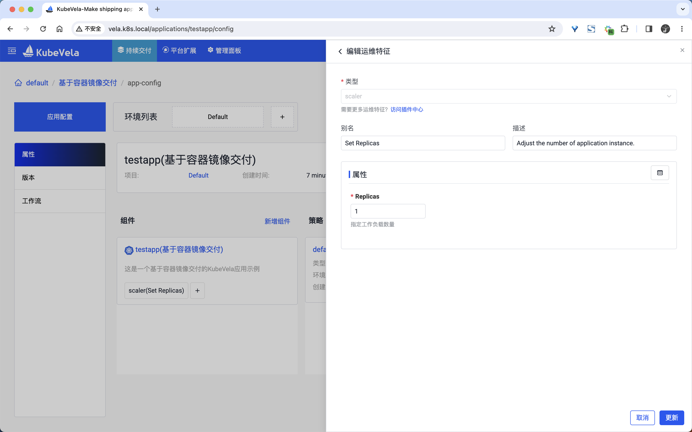

如果你还有其他运维需要，可以点击旁边的 `+` 按钮来添加其他运维特征，比如：`sidecar`、`storage`、`resource` 等等。

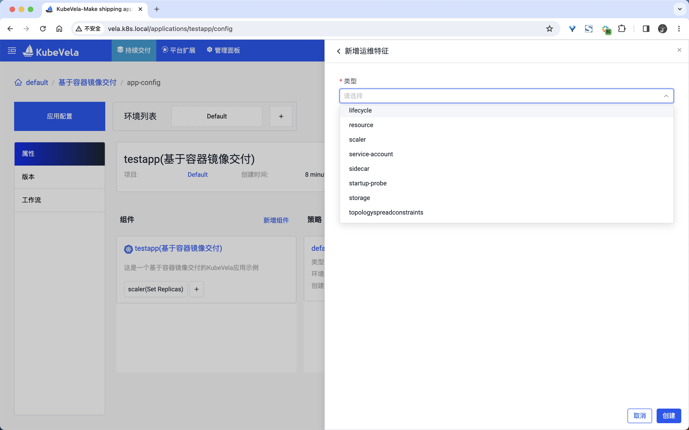

此外应用创建后默认不会自动部署，需要点击页面右上方的部署按钮，并选择需要执行的工作流，每一个工作流对应部署一个环境，默认的工作流就是执行 `default` 这个策略，也就是部署到我们上面绑定的 `default` 环境中。

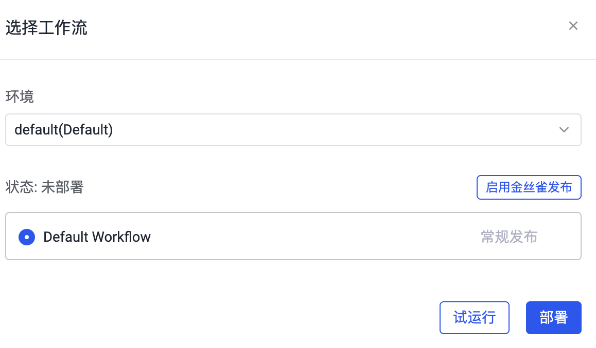

部署开始后可以点击**应用配置**旁边的不同 Tab 即进入不同环境的管理页面，部署后可以查看工作流的状态。

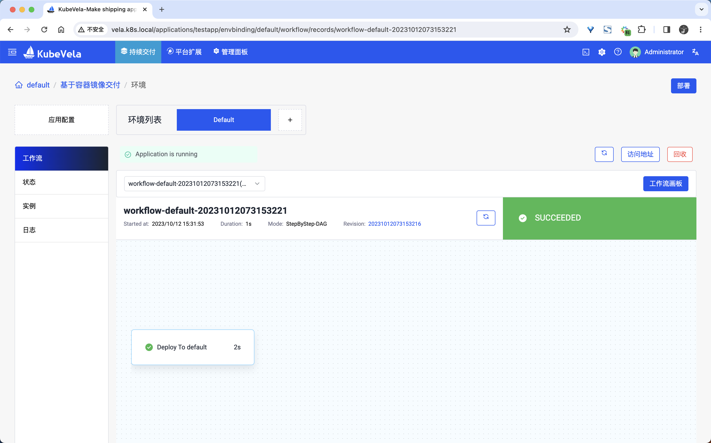

由于我们配置了 `NodePort` 的服务暴露方式，所以可以在页面查看到服务的访问地址。


当然我们也可以编写一个 Application 的资源对象，然后通过 `vela up` 命令来部署应用：

```yaml
apiVersion: core.oam.dev/v1beta1
kind: Application
metadata:
  annotations:
    app.oam.dev/appAlias: 基于容器镜像交付
    app.oam.dev/appName: testapp
  labels:
    app.oam.dev/appName: testapp
  name: testapp
spec:
  components:
    - name: testapp
      type: webservice
      properties:
        image: oamdev/testapp:v1
        cmd:
          - node
          - server.js
        cpu: "0.5"
        memory: 512Mi
        exposeType: NodePort
        ports:
          - expose: true
            port: 8080
            protocol: TCP
      traits:
        - type: scaler
          properties:
            replicas: 1
  policies:
    - name: default
      type: topology
      properties:
        clusters:
          - local
        namespace: default
  workflow:
    steps:
      - type: deploy
        meta:
          alias: Deploy To default
        name: default
        properties:
          policies:
            - default
```

目前，通过 CLI 部署的应用会同步到控制台中，但其为只读状态。


#### 金丝雀发布

上面我们了解了如何通过容器镜像交付应用，接下来我们来看下如何通过 KubeVela 来实现金丝雀发布。

前面我们和大家介绍了通过 `kruise-rollout` 或者 `argo-rollouts` 来实现金丝雀发布，而在 KubeVela 中金丝雀发布依赖 `kruise-rollout` 插件，所以我们需要先启用该插件。

```bash
$ vela addon enable kruise-rollout
Addon kruise-rollout enabled successfully.
Please access addon-kruise-rollout from the following endpoints:
+---------+----------------+-------------------------------------------------------+-------------------------------------------------------+-------+
| CLUSTER |   COMPONENT    |               REF(KIND/NAMESPACE/NAME)                |                       ENDPOINT                        | INNER |
+---------+----------------+-------------------------------------------------------+-------------------------------------------------------+-------+
| local   | kruise-rollout | Service/kruise-rollout/kruise-rollout-webhook-service | https://kruise-rollout-webhook-service.kruise-rollout | true  |
+---------+----------------+-------------------------------------------------------+-------------------------------------------------------+-------+
```

需要注意 `kruise-rollout` 插件需要依赖 `fluxcd` 插件，所以在启用 `kruise-rollout` 插件的时候会自动启用 `fluxcd` 插件，在 VelaUX 控制台中可以看到插件的状态。

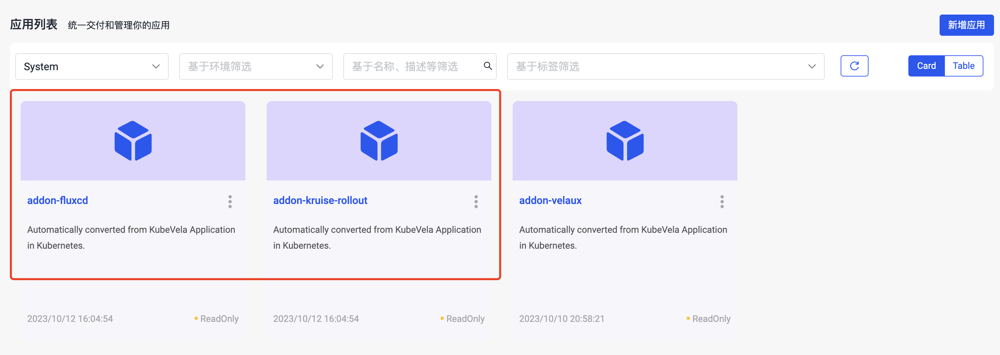

接下来我们通过 CLI 先部署一个简单的应用：

```bash
$ cat <<EOF | vela up -f -
apiVersion: core.oam.dev/v1beta1
kind: Application
metadata:
   name: canary-demo
   annotations:
      app.oam.dev/publishVersion: v1
spec:
   components:
      - name: canary-demo
        type: webservice
        properties:
           image: cnych/canarydemo:v1
           ports:
              - port: 8090
        traits:
           - type: scaler
             properties:
                replicas: 5
           - type: gateway
             properties:
                domain: canary-demo.k8s.local
                http:
                   "/version": 8090
EOF
```

首次部署就是进行一个普通的发布，你可以通过如下命令来检查应用的状态来确保可以进行下一步操作：

```bash
$ vela status canary-demo
About:

  Name:         canary-demo
  Namespace:    default
  Created at:   2023-10-12 16:22:53 +0800 CST
  Status:       running

Workflow:

  mode: DAG-DAG
  finished: true
  Suspend: false
  Terminated: false
  Steps
  - id: fncj73kut8
    name: canary-demo
    type: apply-component
    phase: succeeded

Services:

  - Name: canary-demo
    Cluster: local  Namespace: default
    Type: webservice
    Healthy Ready:5/5
    Traits:
      ✅ scaler      ✅ gateway: Host not specified, visit the cluster or load balancer in front of the cluster
```

当然我们也可以通过 VelaUX 页面的拓扑图来观察所有的 `v1` 版本应用是否都处于 ready 状态。

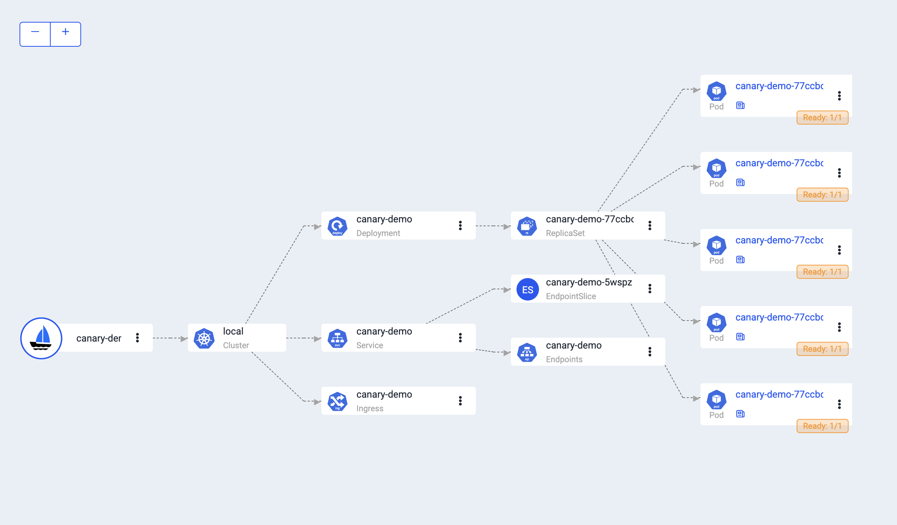

因为我们集群中已经按照了 ingress nginx，所以可以通过域名方式来访问应用（或者你也可以通过启用 ingress-nginx 插件来为你的集群安装一个 ingress 控制器）：

```bash
$ curl -H "Host: canary-demo.k8s.local" http://<ingress controller address>/version
Demo: V1
```

主机名 `canary-demo.k8s.local` 需要和应用 gateway 中的特性保持一致，我们当然也可以通过配置 `/etc/hosts` 来通过 Host 地址访问网关。

接下来让我们把组件的镜像版本从 `v1` 更新到 `v2`，如下所示：

```bash
$ cat <<EOF | vela up -f -
apiVersion: core.oam.dev/v1beta1
kind: Application
metadata:
   name: canary-demo
   annotations:
      app.oam.dev/publishVersion: v2
spec:
   components:
      - name: canary-demo
        type: webservice
        properties:
           image: cnych/canarydemo:v2
           ports:
              - port: 8090
        traits:
           - type: scaler
             properties:
                replicas: 5
           - type: gateway
             properties:
                domain: canary-demo.k8s.local
                http:
                   "/version": 8090
   workflow:
      steps:
         - type: canary-deploy
           name: rollout-20
           properties:
              weight: 20
         - name: suspend-1st
           type: suspend
         - type: canary-deploy
           name: rollout-50
           properties:
              weight: 50
         - name: suspend-2nd
           type: suspend
         - type: canary-deploy
           name: rollout-100
           properties:
              weight: 100
EOF
```

在这次更新中，我们除了更新了组件的镜像配置，还为这次更新设置了一条金丝雀发布的工作流，这个工作流包含 5 个步骤，总共 3 个阶段。

- 先进行第一批次的升级，更新 20% 的实例数量到 v2 版本。在这里我们一共设置了 5 个实例，所以这个阶段会升级 `5 * 20% = 1` 个实例版本到新版本。在所实例就绪之后好后，工作流会进入暂停状态，等待手工批准。
- 在手工批准后，会进入到第二个阶段，它会升级 `5 * 50% = 2.5` 3 个实例的新版本。接下来，工作流会再次进入暂停状态，等待下一步的手工批准。
- 在批准后，全部的实例都将会更新到新版本，并且所有的流量路由都指向新的版本的实例。

更新后你可以检查应用的状态：

```bash
$ vela status canary-demo
About:

  Name:         canary-demo
  Namespace:    default
  Created at:   2023-10-12 16:22:53 +0800 CST
  Status:       workflowSuspending

Workflow:

  mode: StepByStep-DAG
  finished: false
  Suspend: true
  Terminated: false
  Steps
  - id: 7hdawv1e4m
    name: rollout-20
    type: canary-deploy
    phase: succeeded
  - id: jl4jse28rd
    name: suspend-1st
    type: suspend
    phase: suspending
    message: Suspended by field suspend

Services:

  - Name: canary-demo
    Cluster: local  Namespace: default
    Type: webservice
    Healthy Ready:5/5
    Traits:
      ✅ rolling-release: workload deployment is completed      ✅ scaler      ✅ gateway: Host not specified, visit the cluster or load balancer in front of the cluster
```

应用的状态是 `workflowSuspending` 这意味着工作流进入到等待审批的阶段。

现在我们查看拓扑图，会看到现在 deployment 已经升级了一个实例到 `v2` 版本：

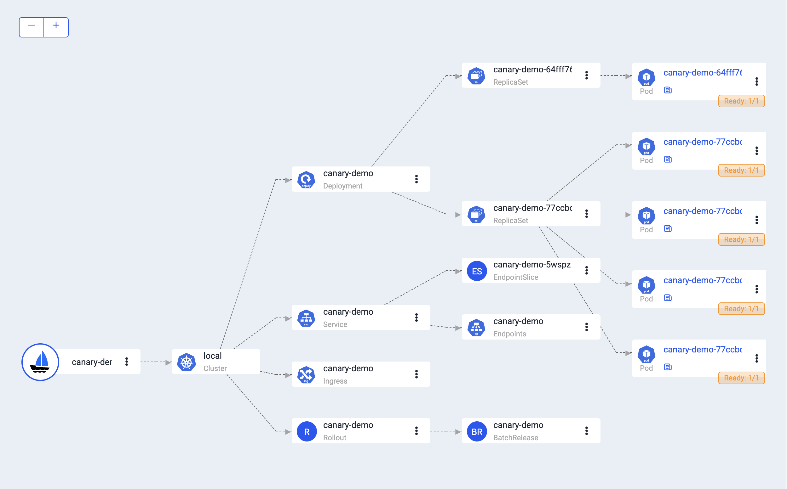

我们可以再次访问网关，你会发现访问结果中有 20% 的机率是 `Demo: v2`。

```bash
$ curl -H "Host: canary-demo.k8s.local" http://192.168.0.100/version
Demo: V2
```

然后我们可以通过检查业务的相关指标，如：日志、Metrics 等其它手段，验证金丝雀的版本是否正确，你可以继续执行工作流，让发布继续往下进行。

```bash
$ vela workflow resume canary-demo
```

审批完成后会进入到下一个阶段，会升级 `5 * 50%` 大约 3 个新版本的实例，升级完成后再多次重新访问网关后，你会发现机率大幅提升，有 50% 的结果是 `Demo: v2`。

```bash
$ curl -H "Host: canary-demo.k8s.local" http://192.168.0.100/version
Demo: V1
$ curl -H "Host: canary-demo.k8s.local" http://192.168.0.100/version
Demo: V2
```

如果金丝雀验证通过，那么可以全量发布，将所有的流量都指向新版本的实例。只需要审批通过即可：

```bash
vela workflow resume canary-demo
```

现在我们访问应用始终结果都是 `Demo: v2` 了：

```bash
$ curl -H "Host: canary-demo.k8s.local" http://192.168.0.100/version
Demo: V2
```

如果经过验证发现新版本有问题，你想中断发布，将应用回滚至上一个版本。可以如下操作快速将应用回滚：

```bash
$ vela workflow rollback canary-demo
Application spec rollback successfully.
Application status rollback successfully.
Successfully rollback rolloutApplication outdated revision cleaned up.
```

再次访问应用，你会看到结果一直是 `Demo: V1`:

```bash
$ curl -H "Host: canary-demo.k8s.local" <ingress-controller-address>/version
Demo: V1
```

需要注意的是，任何在应用处于发布中状态时的回滚操作，都会回滚到应用最后一次成功发布的版本，所以如果你已经成功部署了 v1 并且升级到 v2， 但是如果 v2 失败了但是你又继续更新到 v3。那么从 v3 回滚会自动到 v1，这是因为 v2 并不是成功发布的版本。

除了通过 Vela CLI 来实现金丝雀发布，我们也可以通过 VelaUX 来实现金丝雀发布。

同样首先在 VelaUX 界面上创建一个应用，其中包含了一个 `webservice` 类型的组件，并且将组件的镜像设置为 `cnych/canarydemo:v1` 如下图所示：

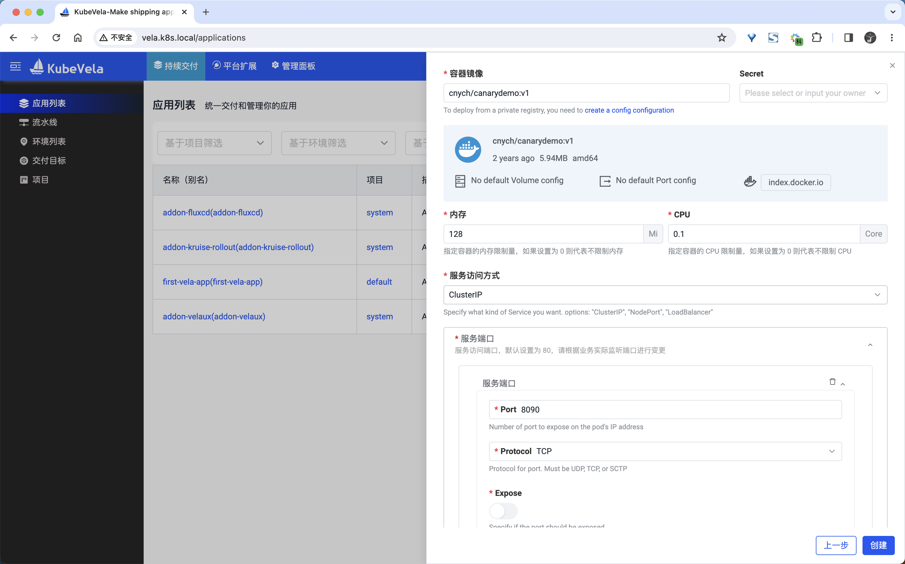

创建后，将这个组件 `scaler` 的运维特征更新为 `3` 个副本：

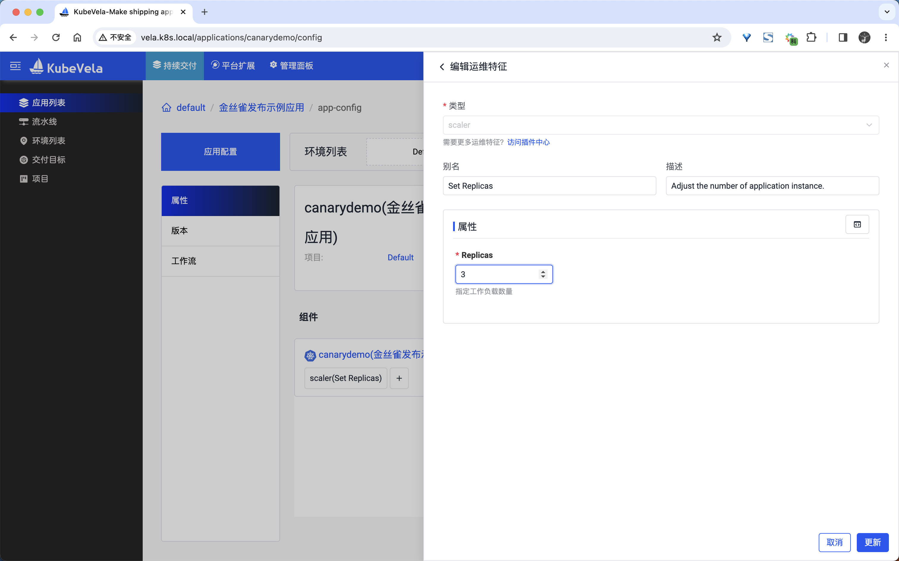

为了能够通过域名访问应用，然后我们为组件添加一个 `gateway` 运维特征，并设置响应的路由规则，如下：

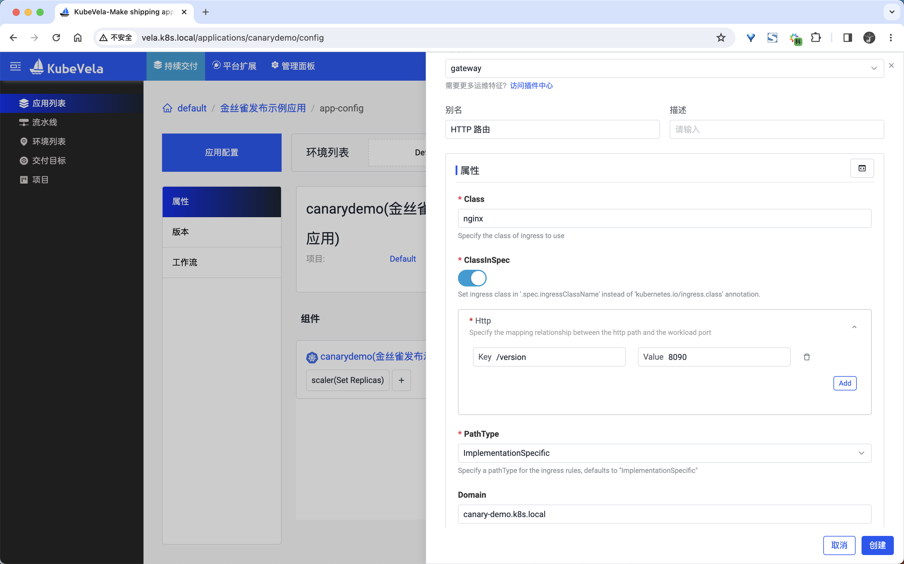

配置之后点击右上角的**部署**按钮进行部署，之后我们就可以在资源拓扑图页面中看到所有实例都已经被创建：

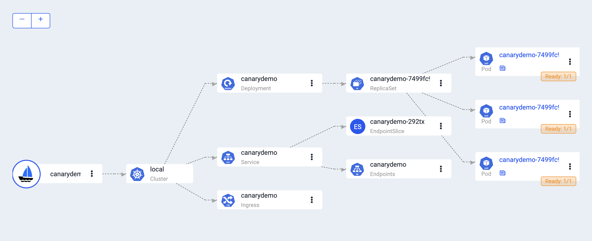

接下来进行金丝雀发布，将组件镜像更新为 `cnych/canarydemo:v2`。

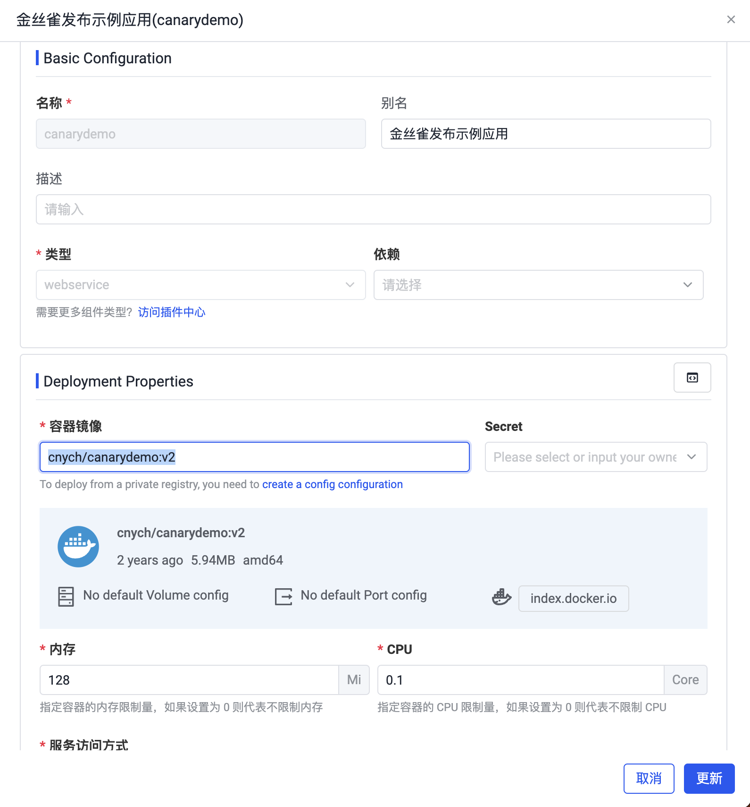

更新镜像后，同样点击页面右上角的**部署**按钮，并点击**启用金丝雀发布**创建金丝雀发布的工作流，如下所示：

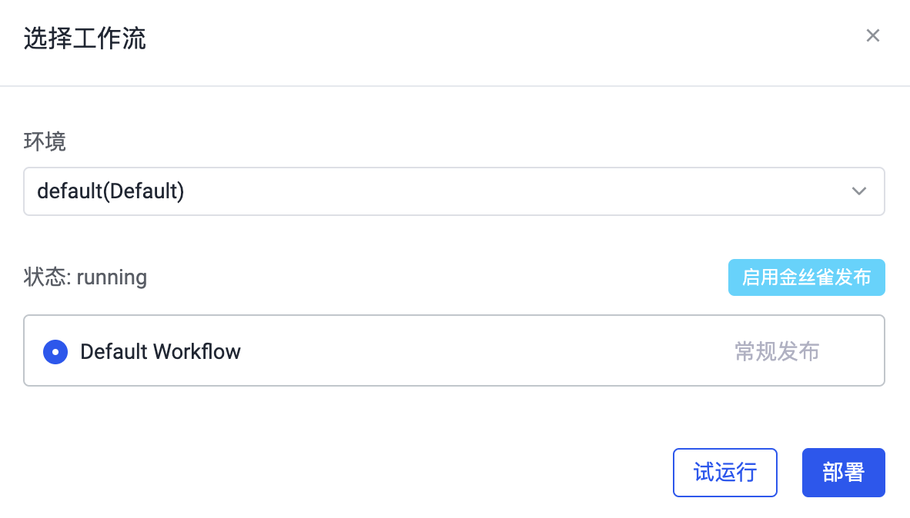

这里我们可以将批次设置为 3，从而对应用分三个批次进行升级：

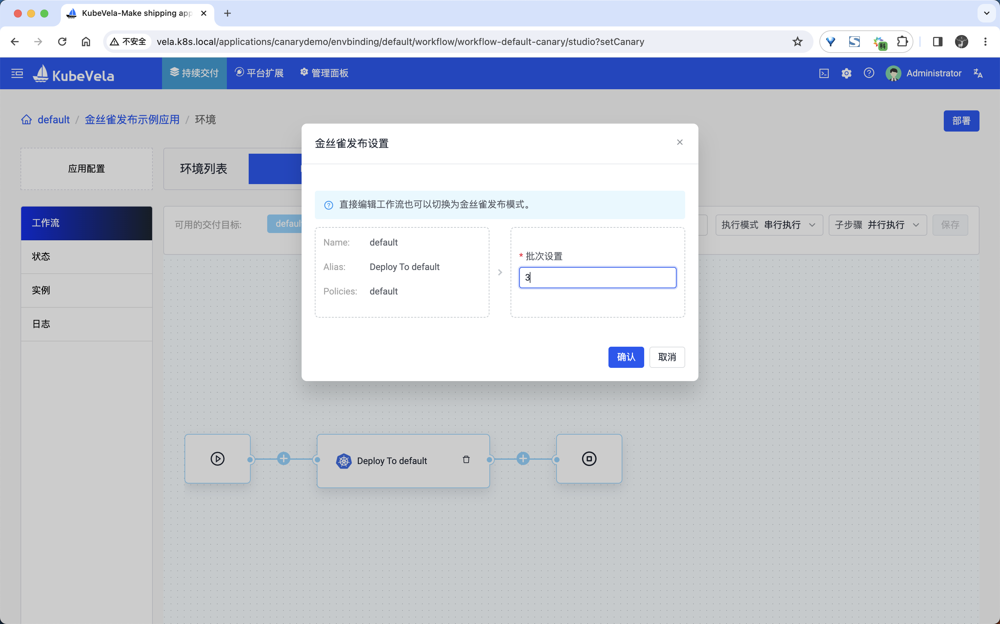

接下来可以看到新创建的了一条金丝雀发布的工作流，点击 save 按钮对工作流进行保存，如下所示：

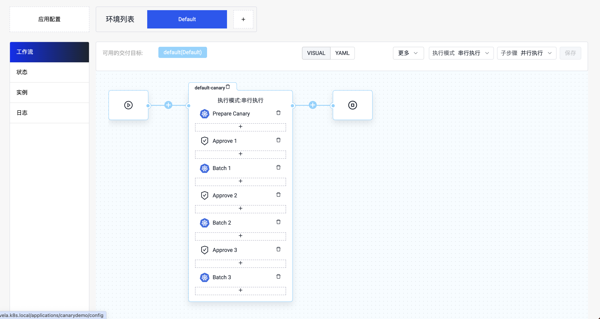

工作流包含三个 `canary-deploy` 的步骤，说明整个发布过程被分为了三批进行发布，每个批次有升级 1/3 的实例到新版本，并且将 1/3 的流量导入到新版本。两个 `canary-deploy` 步骤间有一个人工确认的步骤。你也可以编辑 `canary-deploy` 的步骤来修改每个批次的发布比例。

再次点击**部署**按钮发布，并选择刚才创建的 `Default Canary Workflow` 工作流开始发布，第一步是一个 `Prepare Canary`，然后需要我们手工确认，如下所示：

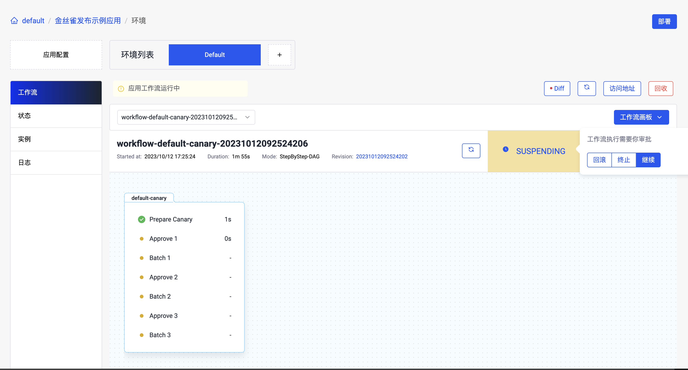

我们可以直接在页面上点击**继续**按钮，然后进入到第一个批次的发布，如下所示：

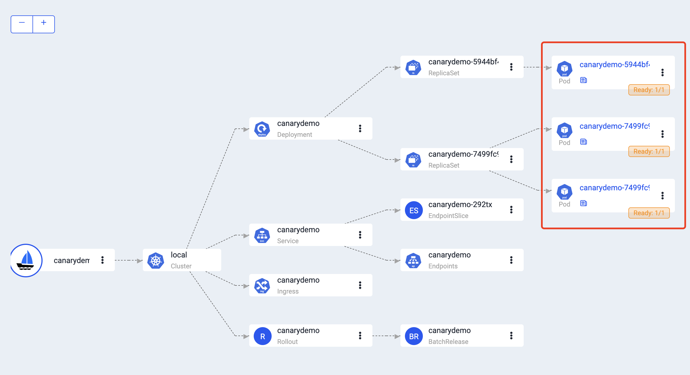

第一个批次发布完成后，我们可以在拓扑图中看到已经有 1 个实例已经升级到了新版本，同样我们可以通过下面的命令访问应用网关，你将会发现大约有 1/3 的概率看到 `Demo: V2` 的结果：

```bash
$ curl -H "Host: canary-demo.k8s.local" http://192.168.0.100/version
Demo: V1
$ curl -H "Host: canary-demo.k8s.local" http://192.168.0.100/version
Demo: V1
$ curl -H "Host: canary-demo.k8s.local" http://192.168.0.100/version
Demo: V2
```

当确认这部分发布没有问题后，我们可以继续发布下一个批次，在工作流页面，点击**继续**按钮继续后面的发布步骤，发布之后你将会看到有 2 个实例升级到新版本：

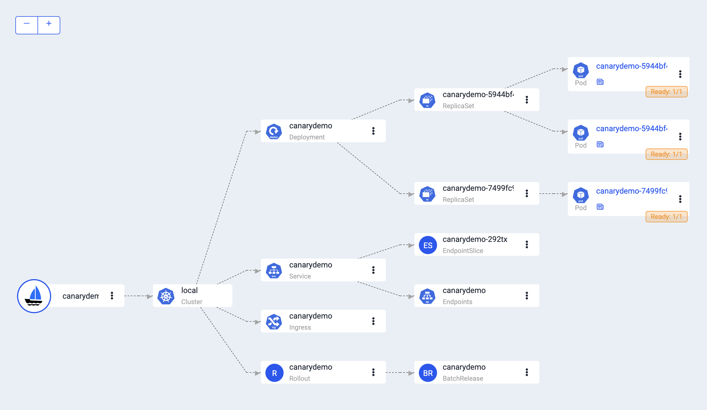

如果你想终止当前的发布工作流，并将应用的实例和流量回滚到发布前的状态，可以在工作流的页面点击**回滚**按钮来进行这个操作。

### 使用 Jenkins + KubeVela 完成应用的持续交付

KubeVela 打通了应用与基础设施之间的交付管控的壁垒，相较于原生的 Kubernetes 对象，KubeVela 的 Application 更好地简化抽象了开发者需要关心的配置，将复杂的基础设施能力及编排细节留给了平台工程师。而 KubeVela 的 `apiserver` 则是进一步为开发者提供了使用 HTTP Request 直接操纵 Application 的途径，使得开发者即使没有 Kubernetes 的使用经验与集群访问权限也可以轻松部署自己的应用。

接下来我们就以 Jenkins 为基础，结合 KubeVela 来实现一个简单的应用持续交付的流程。

要实现一个简单的应用持续交付，我们需要做如下几件事情：

- 需要一个 git 仓库来存放应用程序代码、测试代码，以及描述 KubeVela Application 的 YAML 文件。
- 需要一个持续集成的工具帮你自动化完成程序代码的测试，并打包成镜像上传到仓库中。
- 需要在 Kubernetes 集群上安装 KubeVela 并启用 apiserver 功能。

我们这里的演示 Demo 采用 Github 作为 git 仓库，Jenkins 作为 CI 工具，DockerHub 作为镜像仓库。应用程序以一个简单的 Golang HTTP Server 为例，整个持续交付的流程如下。

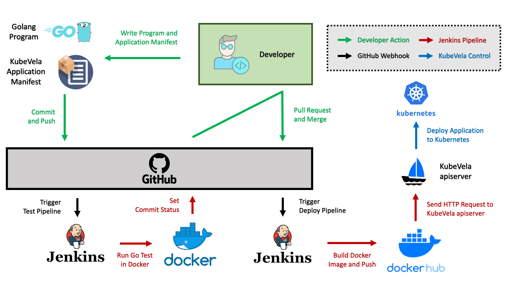

从整个流程可以看出开发者只需要关心应用的开发并使用 Git 进行代码版本的维护，即可自动走完测试流程并部署应用到 Kubernetes 集群中。

关于 Jenkins 在 Kubernetes 集群中的安装配置前面我们已经介绍过了，这里我们就不再赘述。


#### 应用配置

这里我们采用了 Github 作为代码仓库，仓库地址为 [https://github.com/cnych/KubeVela-demo-CICD-app](https://github.com/cnych/KubeVela-demo-CICD-app)，当然也可以根据各自的需求与喜好，使用其他代码仓库，如 Gitlab。为了 Jenkins 能够获取到 GitHub 中的更新，并将流水线的运行状态反馈回 GitHub，需要在 GitHub 中完成以下两步操作。

1.  配置 `Personal Access Token`。注意将 `repo:status` 勾选，以获得向 GitHub 推送 Commit 状态的权限，将生成的 Token 复制下来，下面会用到。
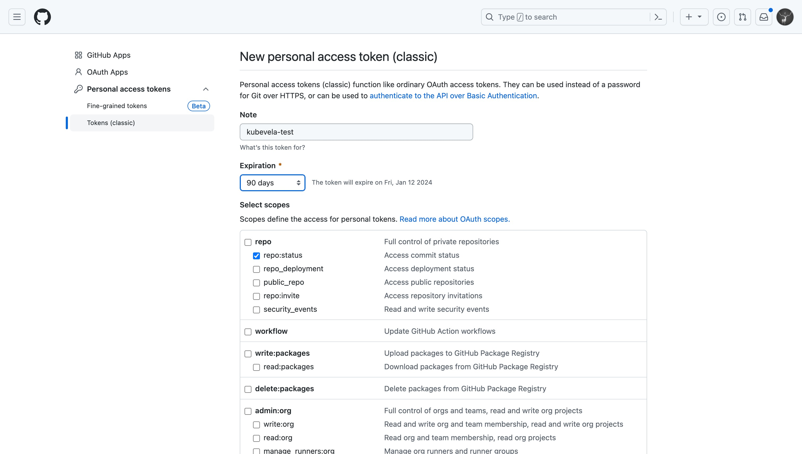 
2.  然后在 Jenkins 的 Credential 中加入 `Secret Text` 类型的 Credential 并将上述的 GitHub 的 Personal Access Token 填入。
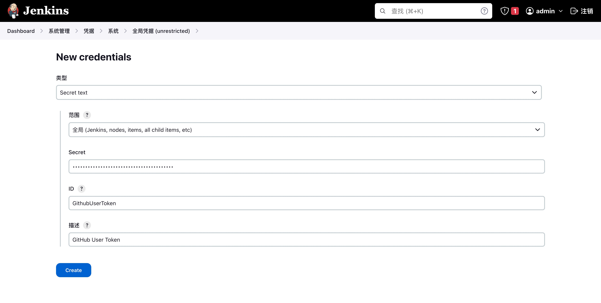 
3.  接下来到 Jenkins 的 `Dashboard > Manage Jenkins > Configure System > GitHub` 中点击 `Add GitHub Server` 并将刚才创建的 Credential 填入。完成后可以点击 Test connection 来验证配置是否正确。
 
4.  由于我们这里的 Jenkins 位于本地环境，要让 GitHub 通过 Webhook 来触发 Jenkins，我们需要提供一个可访问的地址，这里我们可以使用 `ngrok` 来实现，首先前往 [https://dashboard.ngrok.com](https://dashboard.ngrok.com) 注册一个账号，将 `Authtoken` 和 `APIKEY` 记录下来。 
```bash
export NGROK_AUTHTOKEN=<your-ngrok-authtoken>
export NGROK_API_KEY=<your-ngrok-apikey>
```

然后我们可以在本地 Kubernetes 集群中安装 ngrok ingress controller： 
```bash
helm repo add ngrok https://ngrok.github.io/kubernetes-ingress-controller
# 使用下面命令安装 ngrok ingress controller
helm install ngrok-ingress-controller ngrok/kubernetes-ingress-controller \
--namespace ngrok-ingress-controller \
--create-namespace \
--set credentials.apiKey=$NGROK_API_KEY \
--set credentials.authtoken=$NGROK_AUTHTOKEN
```

安装完成后为 Jenkins 创建一个 ngrok 的 ingress 路由： 
```yaml
apiVersion: networking.k8s.io/v1
kind: Ingress
metadata:
  name: jenkins-ngrok
  namespace: kube-ops
spec:
  ingressClassName: ngrok
  rules:
    - host: prompt-adjusted-sculpin.ngrok-free.app
      http:
        paths:
          - backend:
              service:
                name: jenkins
                port:
                  name: web
            path: /
            pathType: Prefix
```

上面的 host 域名是 ngrok 为我们分配的，你可以在 ngrok 的控制台中手动创建，应用上面的 ingress 对象后我们就可以通过 ngrok 为我们分配的域名来访问 Jenkins 了。
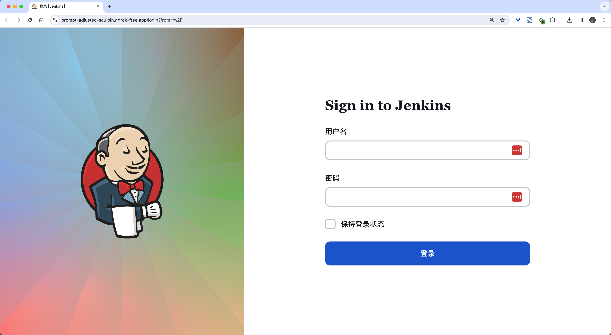 

5.  接下来我们就可以在 GitHub 的代码仓库的设定里添加 Webhook，将 Jenkins 的地址对应的 Webhook 地址填入 `<ngrok domain>/github-webhook/`，这样该代码仓库的所有 Push 事件推送到 Jenkins 中。
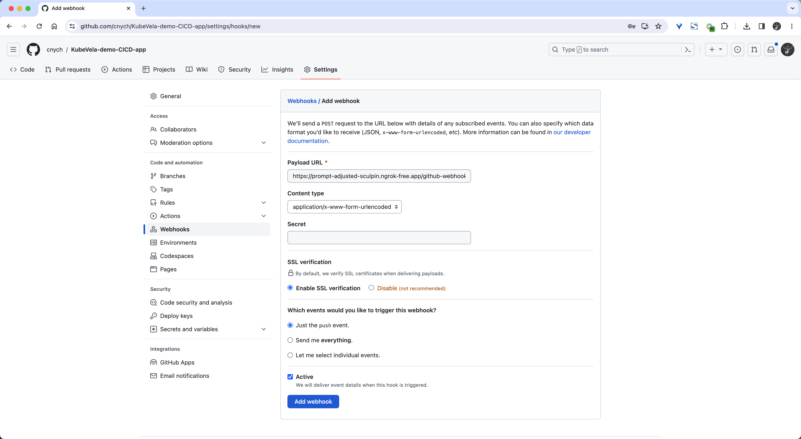 


#### 编写应用

我们这里采用的应用是一个基于 Golang 语言编写的简单的 HTTP Server。在代码中，声明了一个名叫 `VERSION` 的常量，并在访问该服务时打印出来。同时还附带一个简单的测试，用来校验 `VERSION` 的格式是否符合标准。

```go
// main.go
package main

import (
    "fmt"
    "net/http"
)

const VERSION = "0.1.0-v1alpha1"

func main() {
    http.HandleFunc("/", func(w http.ResponseWriter, r *http.Request) {
        _, _ = fmt.Fprintf(w, "Version: %s\n", VERSION)
    })
    if err := http.ListenAndServe(":8088", nil); err != nil {
        println(err.Error())
    }
}
```

测试代码如下所示：

```go
// main_test.go

package main

import (
    "regexp"
    "testing"
)

const verRegex string = `^v?([0-9]+)(\.[0-9]+)?(\.[0-9]+)?` +
`(-([0-9A-Za-z\-]+(\.[0-9A-Za-z\-]+)*))?` +
`(\+([0-9A-Za-z\-]+(\.[0-9A-Za-z\-]+)*))?$`

func TestVersion(t *testing.T) {
    if ok, _ := regexp.MatchString(verRegex, VERSION); !ok {
        t.Fatalf("invalid version: %s", VERSION)
    }
}
```

在应用交付时需要将 Golang 服务打包成镜像并以 KubeVela Application 的形式发布到 Kubernetes 集群中，因此在代码仓库中还包含 `Dockerfile` 。

```dockerfile
# Dockerfile
FROM golang:1.13-rc-alpine3.10 as builder
WORKDIR /app
COPY main.go .
RUN go build -o kubevela-demo-cicd-app main.go

FROM alpine:3.10
WORKDIR /app
COPY --from=builder /app/kubevela-demo-cicd-app /app/kubevela-demo-cicd-app
ENTRYPOINT ./kubevela-demo-cicd-app
EXPOSE 8088
```


#### 配置 CI 流水线

在这里我们将包含两条流水线，一条是用来进行测试的流水线 (对应用代码运行测试) ，一条是交付流水线 (将应用代码打包上传镜像仓库，同时更新目标环境中的应用，实现自动更新) 。

**测试流水线**

在 Jenkins 中创建一条新的名为 `KubeVela-demo-CICD-app-test` 的流水线：

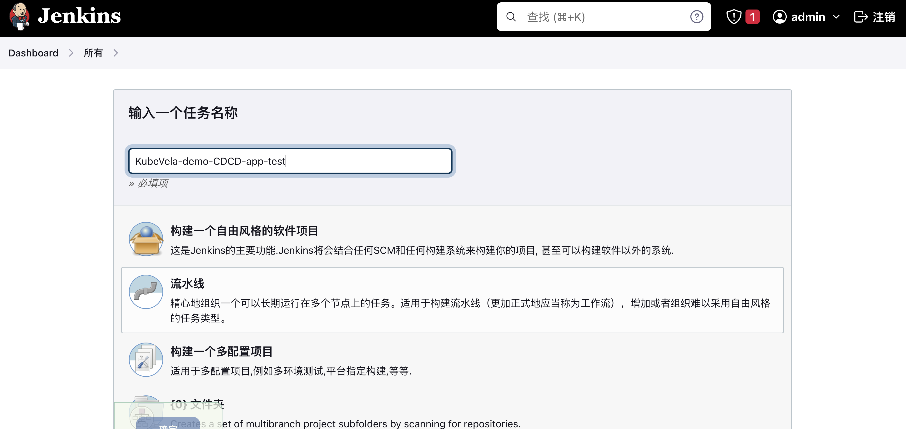

然后配置构建触发器为 `GitHub hook trigger for GITScm polling`:

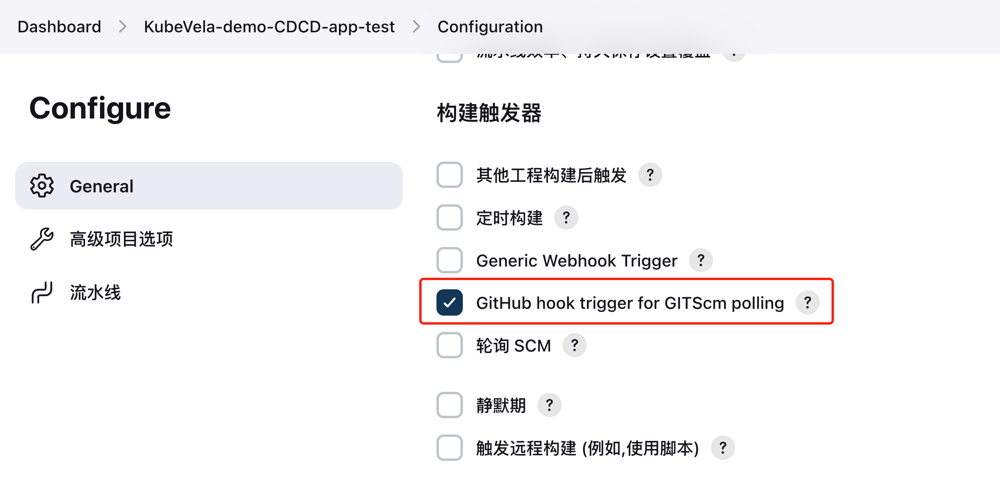

在这条流水线中，首先是采用了 golang 的镜像作为执行环境，方便后续运行测试。然后将分支配置为 GitHub 仓库中的 dev 分支，代表该条流水线被 Push 事件触发后会拉取 dev 分支上的内容并执行测试，测试结束后将流水线的状态回写至 GitHub 中。这里我们使用的是基于 Kubernetes 的动态 Slave Agent，因此在流水线中需要配置 Kubernetes 的相关信息，包括 Kubernetes 的地址、Service Account 等。

```groovy
void setBuildStatus(String message, String state) {
  step([
      $class: "GitHubCommitStatusSetter",
      reposSource: [$class: "ManuallyEnteredRepositorySource", url: "https://github.com/cnych/KubeVela-demo-CICD-app"],
      contextSource: [$class: "ManuallyEnteredCommitContextSource", context: "ci/jenkins/test-status"],
      errorHandlers: [[$class: "ChangingBuildStatusErrorHandler", result: "UNSTABLE"]],
      statusResultSource: [ $class: "ConditionalStatusResultSource", results: [[$class: "AnyBuildResult", message: message, state: state]] ]
  ]);
}

pipeline {
  agent {
    kubernetes {
      cloud 'Kubernetes'
      defaultContainer 'jnlp'
      containerTemplate {
        name 'golang'
        image 'golang:1.13-rc-alpine3.10'
        command 'cat'
        ttyEnabled true
      }
      serviceAccount 'jenkins'
    }
  }

  stages {
    stage('Prepare') {
        steps {
            script {
                def checkout = git branch: 'dev', url: 'https://github.com/cnych/KubeVela-demo-CICD-app.git'
                env.GIT_COMMIT = checkout.GIT_COMMIT
                env.GIT_BRANCH = checkout.GIT_BRANCH
                echo "env.GIT_BRANCH=${env.GIT_BRANCH},env.GIT_COMMIT=${env.GIT_COMMIT}"
            }
            setBuildStatus("Test running", "PENDING");
        }
    }
    stage('Test') {
        steps {
          container('golang') {
            sh 'CGO_ENABLED=0 GOCACHE=$(pwd)/.cache go test *.go'
          }
        }
    }
  }

  post {
    success {
        setBuildStatus("Test success", "SUCCESS");
    }
    failure {
        setBuildStatus("Test failed", "FAILURE");
    }
  }
}
```

我们可以使用上面的代码来执行流水线：

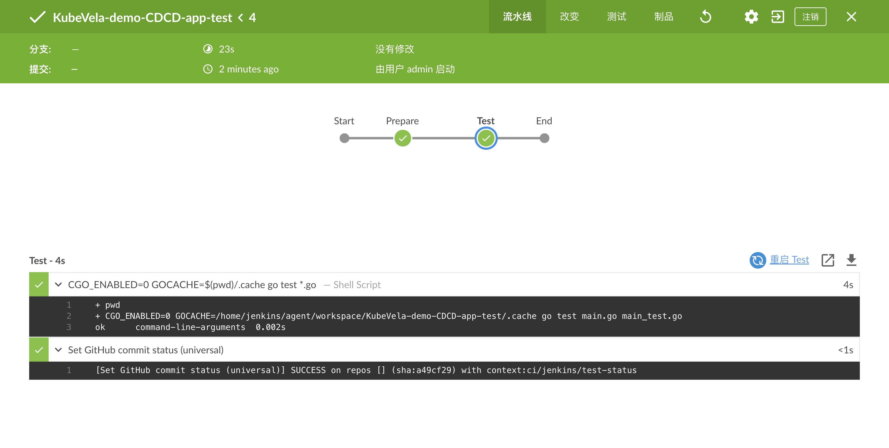

**部署流水线**

类似测试流水线创建一个名为 `KubeVela-demo-CICD-app-deploy` 的部署流水线，首先将代码仓库中的分支拉取下来，区别是这里采用 prod 分支。然后使用 Docker 进行镜像构建并推送至远端镜像仓库。构建成功后，再将 Application 对应的 YAML 文件转换为 JSON 文件并注入 `GIT_COMMIT`，最后向 KubeVela apiserver 发送请求进行创建或更新。

首先我们需要通过 VelaUX 来创建一个应用，这里我们创建一个名为 `kubevela-demo-app` 的应用，包含一个名为 `kubevela-demo-app-web` 的组件，组件类型为 `webservice`，并将组件的镜像设置为 `cnych/kubevela-demo-cicd-app`，如下图所示：

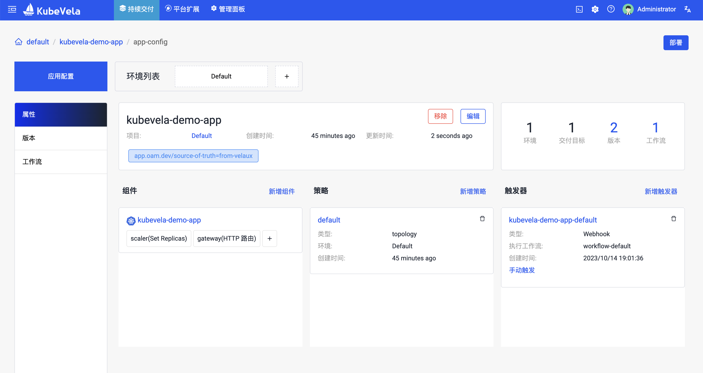

在应用面板上，我们可以找到一个默认的触发器，点击 **手动触发**，我们可以看到 `Webhook URL` 和 `Curl Command`，我们可以在 Jenkins 的流水线中使用任意一个。

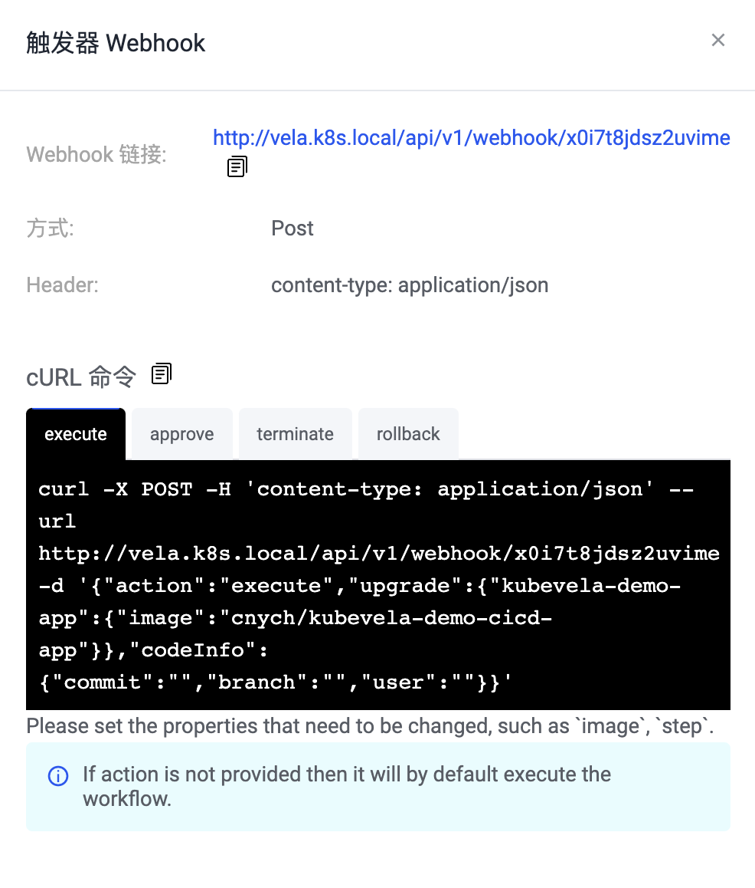

然后我们可以是部署流水线中使用上面的触发器来部署应用，的代码如下所示：

```groovy
void setBuildStatus(String message, String state) {
  step([
      $class: "GitHubCommitStatusSetter",
      reposSource: [$class: "ManuallyEnteredRepositorySource", url: "https://github.com/cnych/KubeVela-demo-CICD-app"],
      contextSource: [$class: "ManuallyEnteredCommitContextSource", context: "ci/jenkins/deploy-status"],
      errorHandlers: [[$class: "ChangingBuildStatusErrorHandler", result: "UNSTABLE"]],
      statusResultSource: [ $class: "ConditionalStatusResultSource", results: [[$class: "AnyBuildResult", message: message, state: state]] ]
  ]);
}
pipeline {
    agent {
      kubernetes {
        cloud 'Kubernetes'
        defaultContainer 'jnlp'
        yaml '''
        spec:
          serviceAccountName: jenkins
          containers:
          - name: golang
            image: golang:1.13-rc-alpine3.10
            command:
            - cat
            tty: true
          - name: docker
            image: docker:latest
            command:
            - cat
            tty: true
            env:
            - name: DOCKER_HOST
              value: tcp://docker-dind:2375
'''
      }
    }
    stages {
        stage('Prepare') {
            steps {
                script {
                    def checkout = git branch: 'prod', url: 'https://github.com/cnych/KubeVela-demo-CICD-app.git'
                    env.GIT_COMMIT = checkout.GIT_COMMIT
                    env.GIT_BRANCH = checkout.GIT_BRANCH
                    echo "env.GIT_BRANCH=${env.GIT_BRANCH},env.GIT_COMMIT=${env.GIT_COMMIT}"
                    setBuildStatus("Deploy running", "PENDING");
                }
            }
        }
        stage('Build') {
            steps {
              withCredentials([[$class: 'UsernamePasswordMultiBinding',
                  credentialsId: 'docker-auth',
                  usernameVariable: 'DOCKER_USER',
                  passwordVariable: 'DOCKER_PASSWORD']]) {
                  container('docker') {
                      sh """
                      docker login -u ${DOCKER_USER} -p ${DOCKER_PASSWORD}
                      docker build -t cnych/kubevela-demo-cicd-app .
                      docker push cnych/kubevela-demo-cicd-app
                      """
                  }
              }
            }
        }
        stage('Deploy') {
            steps {
                sh '''#!/bin/bash
                    set -ex
                    curl -X POST -H 'content-type: application/json' --url http://vela.k8s.local/api/v1/webhook/x0i7t8jdsz2uvime -d '{"action":"execute","upgrade":{"kubevela-demo-app":{"image":"cnych/kubevela-demo-cicd-app"}},"codeInfo":{"commit":"","branch":"","user":""}}'
                '''
            }
        }
    }
    post {
        success {
            setBuildStatus("Deploy success", "SUCCESS");
        }
        failure {
            setBuildStatus("Deploy failed", "FAILURE");
        }
    }
}
```

**测试效果**

在完成上述的配置流程后，持续交付的流程便已经搭建完成。我们可以来检验一下它的效果。

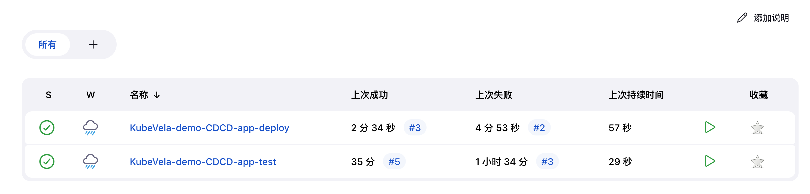

我们首先将 `main.go` 中的 `VERSION` 字段修改为 `Bad Version Number`，即

```
const VERSION = "Bad Version Number"
```

然后提交该修改至 `dev` 分支，我们可以看到 Jenkins 上的测试流水线被触发运行，失败后将该状态回写给 GitHub。

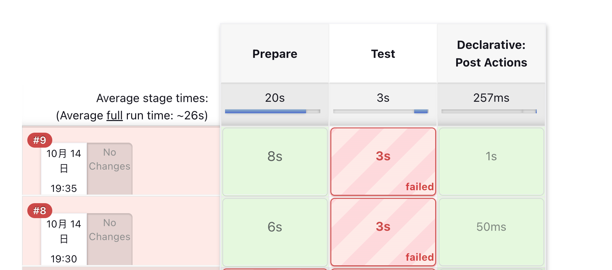

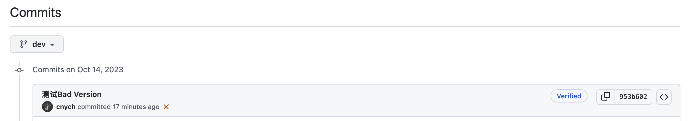

我们重新将 `VERSION` 修改为 `0.1.1`，然后再次提交。可以看到这一次测试流水线成功完成执行，并在 GitHub 对应的 Commit 上看到了成功的标志。

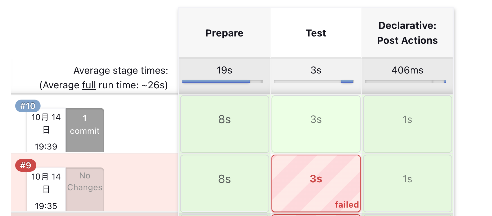

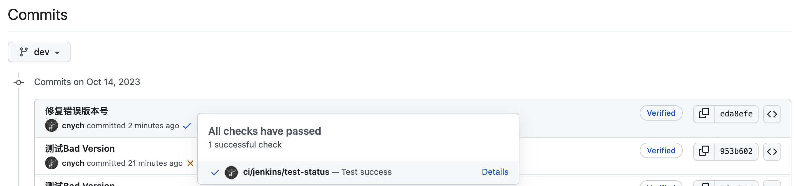

接下来我们在 GitHub 上提交 Pull Request 尝试将 dev 分支上的更新合并至 prod 分支上。

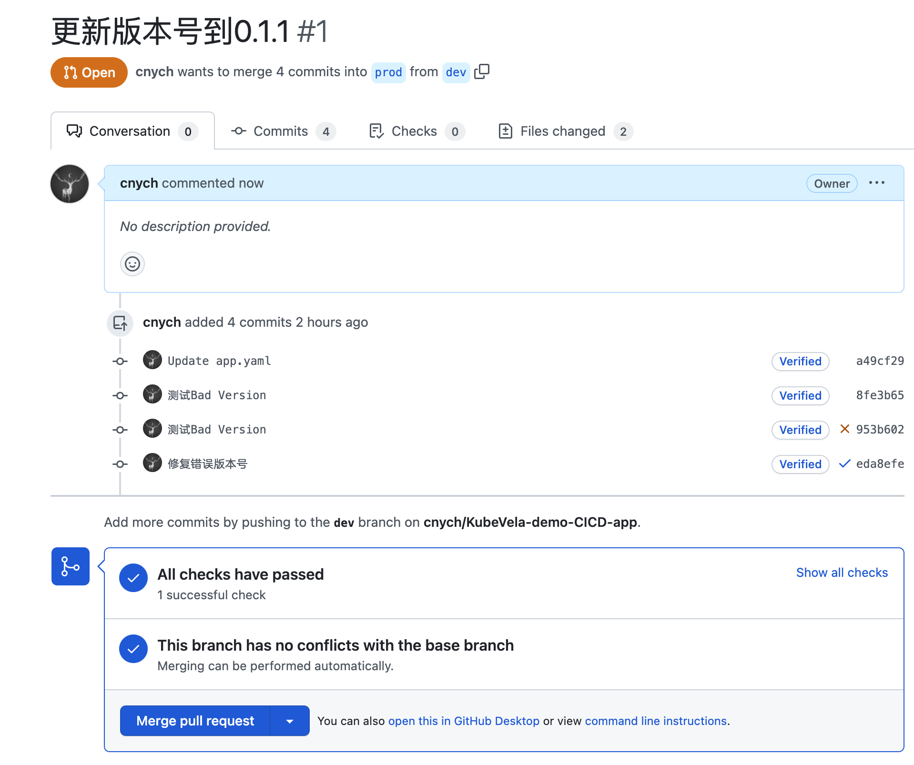

可以看到在 Jenkins 的部署流水线成功运行结束后，GitHub 上 prod 分支最新的 Commit 也显示了成功的标志。

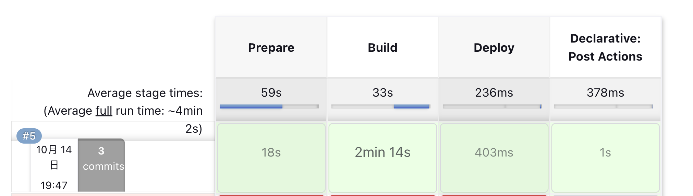

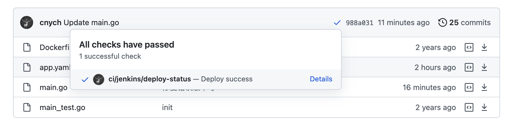

我们的应用已经成功部署了，当前 Deployment 的副本数是 3，并且还有一个 Ingress 对象，这时我们可以访问 Ingress 所配置的域名，成功显示了当前的版本号。

```bash
$ vela ls
APP                     COMPONENT               TYPE            TRAITS          PHASE   HEALTHY STATUS          CREATED-TIME
kubevela-demo-app       kubevela-demo-app       webservice      scaler,gateway  running healthy Ready:3/3       2023-10-14 19:11:59 +0800 CST
$ kubectl get pods
NAME                                     READY   STATUS    RESTARTS       AGE
kubevela-demo-app-675896596f-87kxl       1/1     Running   0              9m39s
kubevela-demo-app-675896596f-q5pvz       1/1     Running   0              9m39s
kubevela-demo-app-675896596f-v895m       1/1     Running   0              44m
$ kubectl get ingress
NAME                CLASS   HOSTS                              ADDRESS   PORTS   AGE
kubevela-demo-app   nginx   kubevela-demo-cicd-app.k8s.local             80      10m
$ curl -H "Host: kubevela-demo-cicd-app.k8s.local" http://<ingress controller address>
Version: 0.1.1
```

如果想实现金丝雀发布，则可以使用上节的 kruise rollout 来实现，至此，我们便已经成功实现了一整套持续交付流程。在这个流程中，应用的开发者借助 KubeVela + Jenkins 的能力，可以轻松完成应用的迭代更新、集成测试、自动发布与滚动升级，而整个流程在各个环节也可以按照开发者的喜好和条件选择不同的工具，比如使用 Gitlab 替代 GitHub，或是使用 TravisCI 替代 Jenkins。

### GitOps 交付

KubeVela 作为一个声明式的应用交付控制平面，天然就可以以 GitOps 的方式进行使用，并且这样做会在 GitOps 的基础上为用户提供更多的益处和端到端的体验，包括：

- 应用交付工作流（CD 流水线）：KubeVela 支持在 GitOps 模式中描述过程式的应用交付，而不只是简单的声明终态；
- 处理部署过程中的各种依赖关系和拓扑结构；
- 在现有各种 GitOps 工具的语义之上提供统一的上层抽象，简化应用交付与管理过程；
- 统一进行云服务的声明、部署和服务绑定；
- 提供开箱即用的交付策略（金丝雀、蓝绿发布等）；
- 提供开箱即用的混合云/多云部署策略（放置规则、集群过滤规则等）；
- 在多环境交付中提供 Kustomize 风格的 Patch 来描述部署差异，而无需学习任何 Kustomize 本身的细节

GitOps 模式需要依赖 FluxCD 插件，所以在使用 GitOps 模式下交付应用之前需要先启用 FluxCD 插件。

```bash
vela addon enable fluxcd
```

GitOps 工作流分为 `CI` 和 `CD` 两个部分：

- `CI`：持续集成对业务代码进行代码构建、构建镜像并推送至镜像仓库。目前有许多成熟的 CI 工具：如开源项目常用的 GitHub Action、Travis 等，以及企业中常用的 Jenkins、Tekton 等，KubeVela 围绕 GitOps 可以对接任意工具下的 CI 流程。
- `CD`：持续部署会自动更新集群中的配置，如将镜像仓库中的最新镜像更新到集群中。目前主要有两种方案的 CD： 
   - `Push-Based`：Push 模式的 CD 主要是通过配置 CI 流水线来完成的，这种方式需要将集群的访问秘钥共享给 CI，从而使得 CI 流水线能够通过命令将更改推送到集群中。前面我们讲解的 Jenkins 方式就属于该方案。
   - `Pull-Based`：Pull 模式的 CD 会在集群中监听仓库（代码仓库或者配置仓库）的变化，并且将这些变化同步到集群中。这种方式与 Push 模式相比，由集群主动拉取更新，从而避免了秘钥暴露的问题。前面课程中我们讲解的 Argo CD 与 Flux CD 就属于这种模式。

而交付面向的人员有以下两种：

- 面向平台管理员/运维人员的基础设施交付，用户可以通过直接更新仓库中的配置文件，从而更新集群中的基础设施配置，如系统的依赖软件、安全策略、存储、网络等基础设施配置。
- 面向终端开发者的交付，用户的代码一旦合并到应用代码仓库，就自动化触发集群中应用的更新，可以更高效的完成应用的迭代，与 KubeVela 的灰度发布、流量调拨、多集群部署等功能结合可以形成更为强大的自动化发布能力。


#### 面向平台管理员/运维人员的交付

如下图所示，对于平台管理员/运维人员而言，他们并不需要关心应用的代码，所以只需要准备一个 Git 配置仓库并部署 KubeVela 配置文件，后续对于应用及基础设施的配置变动，便可通过直接更新 Git 配置仓库来完成，使得每一次配置变更可追踪。

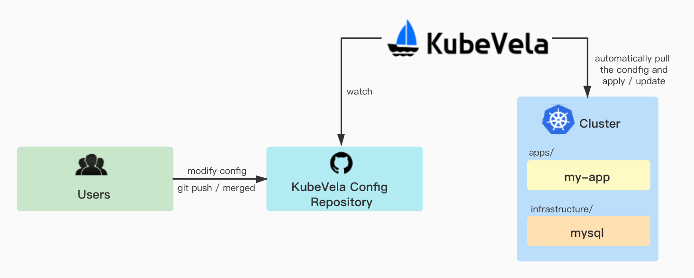

这里我们将部署一个 MySQL 数据库作为项目的基础设施，同时部署一个业务应用，使用这个数据库。配置仓库的目录结构如下:

- `clusters/` 中包含集群中的 KubeVela GitOps 配置，用户需要将 `clusters/` 中的文件手动部署到集群中。这个是一次性的管控操作，执行完成后，KubeVela 便能自动监听配置仓库中的文件变动且自动更新集群中的配置。其中，`clusters/apps.yaml` 将监听 `apps/` 下所有应用的变化，`clusters/infra.yaml` 将监听 `infrastructure/` 下所有基础设施的变化。
- `apps/` 目录中包含业务应用的所有配置，在本例中为一个使用数据库的业务应用。
- `infrastructure/` 中包含一些基础设施相关的配置和策略，在本例中为 MySQL 数据库。

```bash
├── apps
│   └── my-app.yaml
├── clusters
│   ├── apps.yaml
│   └── infra.yaml
└── infrastructure
    └── mysql.yaml
```

> KubeVela 建议使用如上的目录结构管理你的 GitOps 仓库。`clusters/` 中存放相关的 KubeVela GitOps 配置并需要被手动部署到集群中，`apps/` 和 `infrastructure/` 中分别存放你的应用和基础设施配置。通过把应用和基础配置分开，能够更为合理的管理你的部署环境，隔离应用的变动影响。


**clusters/ 目录**

首先，我们来看下 clusters 目录，这也是 KubeVela 对接 GitOps 的初始化操作配置目录。

以 `clusters/infra.yaml` 为例：

```yaml
apiVersion: core.oam.dev/v1beta1
kind: Application
metadata:
  name: infra
spec:
  components:
    - name: database-config
      type: kustomize
      properties:
        repoType: git
        # 将此处替换成你需要监听的 git 配置仓库地址
        url: https://github.com/cnych/KubeVela-GitOps-Infra-Demo
        # 如果是私有仓库，还需要关联 git secret
        # secretRef: git-secret
        # 自动拉取配置的时间间隔，由于基础设施的变动性较小，此处设置为十分钟
        pullInterval: 10m
        git:
          # 监听变动的分支
          branch: main
        # 监听变动的路径，指向仓库中 infrastructure 目录下的文件
        path: ./infrastructure
```

`apps.yaml` 与 `infra.yaml` 几乎保持一致，只不过监听的文件目录有所区别。在 `apps.yaml` 中，`properties.path` 的值将改为 `./apps`，表明监听 `apps/` 目录下的文件变动。

cluster 文件夹中的 GitOps 管控配置文件需要在初始化的时候一次性手动部署到集群中，在此之后 KubeVela 将自动监听 `apps/` 以及 `infrastructure/` 目录下的配置文件并定期更新同步。

**apps/ 目录**

`apps/` 目录中存放着应用配置文件，这是一个配置了数据库信息以及 Ingress 的简单应用。该应用将连接到一个 MySQL 数据库，并简单地启动服务。在默认的服务路径下，会显示当前版本号。在 `/db` 路径下，会列出当前数据库中的信息。

```yaml
apiVersion: core.oam.dev/v1beta1
kind: Application
metadata:
  name: my-app
  namespace: default
spec:
  components:
    - name: my-server
      type: webservice
      properties:
        image: cnych/kubevela-gitops-demo:main-76a34322-1697703461
        port: 8088
        env:
          - name: DB_HOST
            value: mysql-cluster-mysql.default.svc.cluster.local:3306
          - name: DB_PASSWORD
            valueFrom:
              secretKeyRef:
                name: mysql-secret
                key: ROOT_PASSWORD
      traits:
        - type: scaler
          properties:
            replicas: 1
        - type: gateway
          properties:
            class: nginx
            classInSpec: true
            domain: vela-gitops-demo.k8s.local
            http:
              /: 8088
            pathType: ImplementationSpecific
```

这是一个使用了 KubeVela 内置组件类型 `webservice` 的应用，该应用绑定了 `gateway` 运维特征。通过在应用中声明运维能力的方式，只需一个文件，便能将底层的 Deployment、Service、Ingress 集合起来，从而更为便捷地管理应用。

**infrastructure/ 目录**

`infrastructure/` 目录下存放一些基础设施的配置。此处我们使用 mysql controller 来部署了一个 MySQL 集群。

```yaml
apiVersion: core.oam.dev/v1beta1
kind: Application
metadata:
  name: mysql
  namespace: default
spec:
  components:
    - name: mysql-secret
      type: k8s-objects # 需要添加一个包含 ROOT_PASSWORD 的 secret
      properties:
        objects:
          - apiVersion: v1
            kind: Secret
            metadata:
              name: mysql-secret
            type: Opaque
            stringData:
              ROOT_PASSWORD: root321
    - name: mysql-operator
      type: helm
      properties:
        repoType: helm
        url: https://helm-charts.bitpoke.io
        chart: mysql-operator
        version: 0.6.3
    - name: mysql-cluster
      type: raw
      dependsOn:
        - mysql-operator
        - mysql-secret
      properties:
        apiVersion: mysql.presslabs.org/v1alpha1
        kind: MysqlCluster
        metadata:
          name: mysql-cluster
        spec:
          replicas: 1
          secretName: mysql-secret
```

在这个 MySQL 应用中，我们添加了 3 个 KubeVela 的组件，第一个是一个 `k8s-objects` 类型的组件，也就是直接应用 Kubernetes 资源对象，我们这里需要部署一个 Secret 对象；然后添加一个 `helm` 类型的组件，用来部署 MySQL 的 Operator。当 Operator 部署成功且正确运行后，最后我们将开始部署 MySQL 集群。

**部署 clusters/ 目录下的文件**

配置完以上文件并存放到 Git 配置仓库后，我们需要在集群中手动部署 `clusters/` 目录下的 KubeVela GitOps 配置文件。

首先，在集群中部署 `clusters/infra.yaml`。可以看到它自动在集群中拉起了 `infrastructure/` 目录下的 MySQL 部署文件：

```bash
$ kubectl apply -f clusters/infra.yaml
$ vela ls
APP             COMPONENT       TYPE            TRAITS          PHASE   HEALTHY STATUS                                                          CREATED-TIME
infra           database-config kustomize                       running healthy                                                                 2023-10-19 15:27:28 +0800 CST
mysql           mysql-operator  helm                            running healthy Fetch repository successfully, Create helm release              2023-10-19 15:27:31 +0800 CST
                                                                                successfully
└─              mysql-cluster   raw                             running healthy                                                                 2023-10-19 15:27:31 +0800 CST
```

至此，我们通过部署 KubeVela GitOps 配置文件，自动在集群中拉起了数据库基础设施。

```bash
$ kubectl get pods
NAME                                     READY   STATUS    RESTARTS         AGE
mysql-cluster-mysql-0                    4/4     Running   0                35m
mysql-operator-0                         2/2     Running   0                35m
```

通过这种方式，我们可以方便地通过更新 Git 配置仓库中的文件，从而自动化更新集群中的配置。


#### 面向终端开发者的交付

对于终端开发者而言，在 KubeVela Git 配置仓库以外，还需要准备一个应用代码仓库。在用户更新了应用代码仓库中的代码后，需要配置一个 CI 来自动构建镜像并推送至镜像仓库中。KubeVela 会监听镜像仓库中的最新镜像，并自动更新配置仓库中的镜像配置，最后再更新集群中的应用配置。使用户可以达成在更新代码后，集群中的配置也自动更新的效果，代码仓库位于 `https://github.com/cnych/KubeVela-GitOps-App-Demo`。

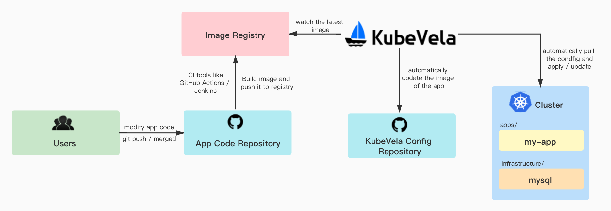

**准备代码仓库**

准备一个代码仓库，里面包含一些源代码以及对应的 `Dockerfile`。这些代码将连接到一个 MySQL 数据库，并简单地启动服务。在默认的服务路径下，会显示当前版本号。在 `/db` 路径下，会列出当前数据库中的信息，基本代码如下所示：

```
http.HandleFunc("/", func(w http.ResponseWriter, r *http.Request) {
    _, _ = fmt.Fprintf(w, "Version: %s\n", VERSION)
})
http.HandleFunc("/db", func(w http.ResponseWriter, r *http.Request) {
    rows, err := db.Query("select * from userinfo;")
    if err != nil {
        _, _ = fmt.Fprintf(w, "Error: %v\n", err)
    }
    for rows.Next() {
        var username string
        var desc string
        err = rows.Scan(&username, &desc)
        if err != nil {
            _, _ = fmt.Fprintf(w, "Scan Error: %v\n", err)
        }
        _, _ = fmt.Fprintf(w, "User: %s \nDescription: %s\n\n", username, desc)
    }
})

if err := http.ListenAndServe(":8088", nil); err != nil {
    panic(err.Error())
}
```

我们希望用户改动代码进行提交后，自动构建出最新的镜像并推送到镜像仓库。这一步 CI 可以通过前面我们讲解的 Jenkins 来实现，基本一致，具体的代码文件及配置位于 `https://github.com/cnych/KubeVela-GitOps-App-Demo`。

首先为代码仓库创建一个 Webhook，指向 Jenkins 的触发器地址：

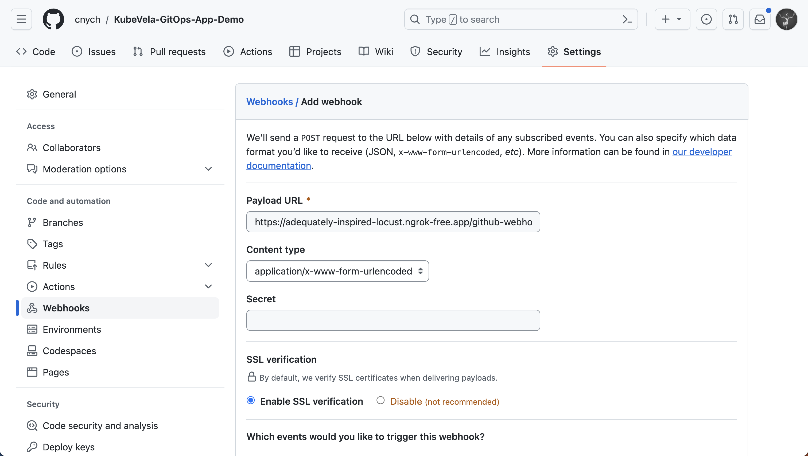

然后在 Jenkins 中创建一个名为 `KubeVela-GitOps-App-Demo` 的流水线：

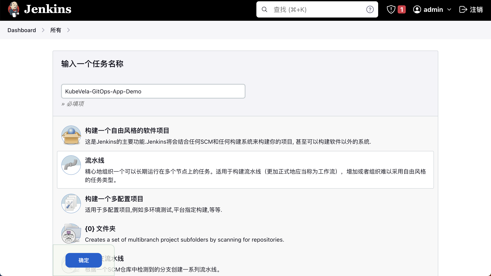

并勾选 **GitHub hook trigger for GITScm polling** 触发器。

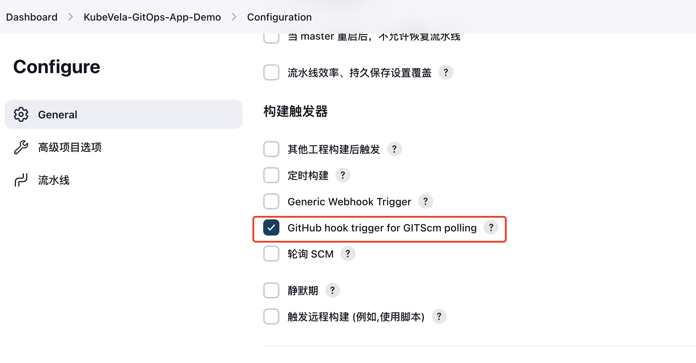

然后添加如下所示的流水线脚本：

```groovy
void setBuildStatus(String message, String state) {
  step([
      $class: "GitHubCommitStatusSetter",
      reposSource: [$class: "ManuallyEnteredRepositorySource", url: "https://github.com/cnych/KubeVela-GitOps-App-Demo"],
      contextSource: [$class: "ManuallyEnteredCommitContextSource", context: "ci/jenkins/deploy-status"],
      errorHandlers: [[$class: "ChangingBuildStatusErrorHandler", result: "UNSTABLE"]],
      statusResultSource: [ $class: "ConditionalStatusResultSource", results: [[$class: "AnyBuildResult", message: message, state: state]] ]
  ]);
}
pipeline {
    agent {
      kubernetes {
        cloud 'Kubernetes'
        defaultContainer 'jnlp'
        yaml '''
        spec:
          serviceAccountName: jenkins
          containers:
          - name: golang
            image: golang:1.16-alpine3.15
            command:
            - cat
            tty: true
          - name: docker
            image: docker:latest
            command:
            - cat
            tty: true
            env:
            - name: DOCKER_HOST
              value: tcp://docker-dind:2375
'''
      }
    }
    stages {
        stage('Prepare') {
            steps {
                script {
                    def checkout = git branch: 'main', url: 'https://github.com/cnych/KubeVela-GitOps-App-Demo.git'
                    env.GIT_COMMIT = checkout.GIT_COMMIT
                    env.GIT_BRANCH = checkout.GIT_BRANCH

                    def unixTime = (new Date().time.intdiv(1000))
                    def gitBranch = env.GIT_BRANCH.replace("origin/", "")
                    env.BUILD_ID = "${gitBranch}-${env.GIT_COMMIT.substring(0,8)}-${unixTime}"

                    echo "env.GIT_BRANCH=${env.GIT_BRANCH},env.GIT_COMMIT=${env.GIT_COMMIT}"
                    echo "env.BUILD_ID=${env.BUILD_ID}"

                    setBuildStatus("Deploy running", "PENDING");
                }
            }
        }
        stage('Test') {
            steps {
              container('golang') {
                sh 'GOPROXY=https://goproxy.io CGO_ENABLED=0 GOCACHE=$(pwd)/.cache go test *.go'
              }
            }
        }
        stage('Build') {
            steps {
              withCredentials([[$class: 'UsernamePasswordMultiBinding',
                  credentialsId: 'docker-auth',
                  usernameVariable: 'DOCKER_USER',
                  passwordVariable: 'DOCKER_PASSWORD']]) {
                  container('docker') {
                      sh """
                      docker login -u ${DOCKER_USER} -p ${DOCKER_PASSWORD}
                      docker build -t cnych/kubevela-gitops-demo:${env.BUILD_ID} .
                      docker push cnych/kubevela-gitops-demo:${env.BUILD_ID}
                      """
                  }
              }
            }
        }
    }
    post {
        success {
            setBuildStatus("Deploy success", "SUCCESS");
        }
        failure {
            setBuildStatus("Deploy failed", "FAILURE");
        }
    }
}
```

构建后我们就可以将应用的镜像打包后推送到 Docker Hub 去。

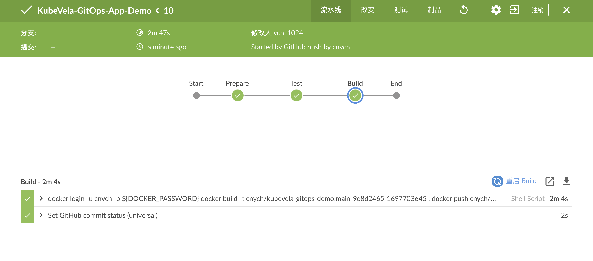

**配置秘钥信息**

在新的镜像推送到镜像仓库后，KubeVela 会识别到新的镜像，并更新仓库及集群中的 Application 配置文件。因此，我们需要一个含有 Git 信息的 Secret，使 KubeVela 向 Git 仓库进行提交。部署如下文件，将其中的用户名和密码替换成你的 Git 用户名及密码（或 Token）：

```yaml
apiVersion: v1
kind: Secret
metadata:
  name: git-secret
type: kubernetes.io/basic-auth
stringData:
  username: <your username>
  password: <your password>
```

**准备配置仓库**

配置仓库与之前面向运维人员的配置大同小异，只需要加上与镜像仓库相关的配置即可。

修改 `clusters/` 中的 `apps.yaml`，该 GitOps 配置会监听仓库中 `apps/` 下的应用文件变动以及镜像仓库中的镜像更新：

```yaml
# ...... 省略其他的
imageRepository:
  # 镜像地址
  image: <your image>
  # 如果这是一个私有的镜像仓库，可以通过 `kubectl create secret docker-registry` 创建对应的镜像秘钥并相关联
  secretRef: dockerhub-secret
  filterTags:
    # 可对镜像 tag 进行过滤
    pattern: "^main-[a-f0-9]+-(?P<ts>[0-9]+)"
    extract: "$ts"
  # 通过 policy 筛选出最新的镜像 Tag 并用于更新
  policy:
    numerical:
      order: asc
  # 追加提交信息
  commitMessage: "Image: {{range .Updated.Images}}{{println .}}{{end}}"
```

修改 `apps/my-app.yaml` 中的 `image` 字段，在后面加上 `# {"$imagepolicy": "default:apps"}` 的注释，KubeVela 会通过该注释去更新对应的镜像字段，`default:apps` 是上面 GitOps 配置对应的命名空间和名称。

```yaml
spec:
  components:
    - name: my-server
      type: webservice
      properties:
        image: cnych/kubevela-gitops-demo:main-9e8d2465-1697703645 # {"$imagepolicy": "default:apps"}
```

将 `clusters/` 中包含镜像仓库配置的文件更新到集群中后，我们便可以通过修改代码来完成应用的更新。

部署 `clusters/apps.yaml`：

```bash
$ kubectl apply -f clusters/apps.yaml
$ vela ls
APP             COMPONENT       TYPE            TRAITS          PHASE           HEALTHY         STATUS                                                     CREATED-TIME
apps            apps            kustomize                       running         healthy                                                                    2023-10-19 16:31:49 +0800 CST
my-app          my-server       webservice      scaler,gateway  runningWorkflow unhealthy       Ready:0/1                                                  2023-10-19 16:32:11 +0800 CST
$ kubectl get pods
NAME                                     READY   STATUS    RESTARTS         AGE
my-server-6947fd65f9-84zhv               1/1     Running   0                2m
```

这样我们就可以通过部署 KubeVela GitOps 配置文件，自动在集群中拉起应用了。我们可以通过 `curl` 应用的 Ingress 来验证结果是否正确，可以看到目前的版本是 0.1.5，并且成功地连接到了数据库：

```bash
$ kubectl get ingress
NAME           CLASS   HOSTS                        ADDRESS   PORTS   AGE
my-server      nginx   vela-gitops-demo.k8s.local             80      115s
$ curl -H "Host:vela-gitops-demo.k8s.local" http://192.168.0.100
Version: 0.1.8
$ curl -H "Host:vela-gitops-demo.k8s.local" http://192.168.0.100/db
User: KubeVela
Description: It's a test user
```

**修改代码**

将代码文件中的 Version 改为 `0.2.0`，并修改数据库中的数据:

```
const VERSION = "0.2.0"

...

func InsertInitData(db *sql.DB) {
    stmt, err := db.Prepare(insertInitData)
    if err != nil {
        panic(err)
    }
    defer stmt.Close()

    _, err = stmt.Exec("KubeVela2", "It's another test user")
    if err != nil {
        panic(err)
    }
}
```

提交该改动至代码仓库，正常我们配置的 CI 流水线就会自动开始构建镜像并推送至镜像仓库。

而 KubeVela 会通过监听镜像仓库，根据最新的镜像 Tag 来更新配置仓库中 `apps/` 下的应用 `my-app`。

此时，可以看到配置仓库中有一条来自 kubevelabot 的提交，提交信息均带有 `Update image automatically.` 前缀。你也可以通过 `{{range .Updated.Images}}{{println .}}{{end}}` 在 `commitMessage` 字段中追加你所需要的信息。

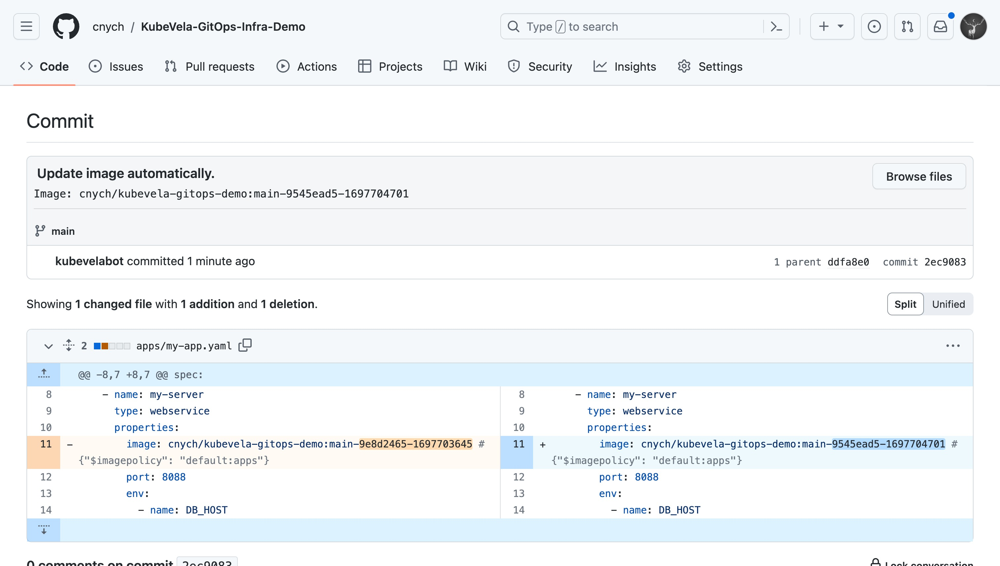

经过一段时间后，应用 `my-app` 就自动更新了。KubeVela 会通过你配置的 `interval` 时间间隔，来每隔一段时间分别从配置仓库及镜像仓库中获取最新信息：

- 当 Git 仓库中的配置文件被更新时，KubeVela 将根据最新的配置更新集群中的应用。
- 当镜像仓库中多了新的 Tag 时，KubeVela 将根据你配置的 policy 规则，筛选出最新的镜像 Tag，并更新到 Git 仓库中。而当代码仓库中的文件被更新后，KubeVela 将重复第一步，更新集群中的文件，从而达到了自动部署的效果。

通用我们可以通过 curl 对应的 Ingress 查看当前版本和数据库信息：

```bash
$ kubectl get ingress
NAME           CLASS   HOSTS                        ADDRESS   PORTS   AGE
my-server      nginx   vela-gitops-demo.k8s.local             80      12m

$ curl -H "Host:vela-gitops-demo.k8s.local" http://<ingress-ip>
Version: 0.2.0

$ curl -H "Host:vela-gitops-demo.k8s.local" http://<ingress-ip>/db
User: KubeVela
Description: It's a test user

User: KubeVela2
Description: It's another test user
```

版本已被成功更新！至此，我们完成了从变更代码，到自动部署至集群的全部操作。

#### 
**总结**

在运维侧，如若需要更新基础设施（如数据库）的配置，或是应用的配置项，只需要修改配置仓库中的文件，KubeVela 将自动把配置同步到集群中，简化了部署流程。

在研发侧，用户修改代码仓库中的代码后，KubeVela 将自动更新配置仓库中的镜像，从而进行应用的版本更新。通过与 GitOps 的结合，KubeVela 加速了应用从开发到部署的整个流程。可能你会觉得这和 Flux CD 不是差不多吗？的确是这样的，KubeVela 的 GitOps 功能本身就是依赖 Flux CD 的，但是 KubeVela 的功能可远远不止于此，比如说上面我们的应用使用的 MySQL 数据我们是通过 MySQL Operator 来部署的，那如果我现在还换成云资源 RDS 呢？按照以前的方式方法，那么我们需要去云平台手动开通 RDS 或者使用 Terraform 来进行管理，但在 KubeVela 中我们完全可以帮助开发者集成、编排不同类型的云资源，涵盖混合多云环境，让你用统一地方式去使用不同厂商的云资源。同样的我们只需要在 GitOps 仓库中的配置文件 Application 对象中去添加云资源的管理配置即可，这样做到了一个对象管理多种资源的能力，这也是 KubeVela 的核心能力之一。

最后如果你觉得应用太多管理不太方便，那么我们还可以使用 `vela top` 命令获取平台的概览信息以及对应用程序的资源状态进行诊断。

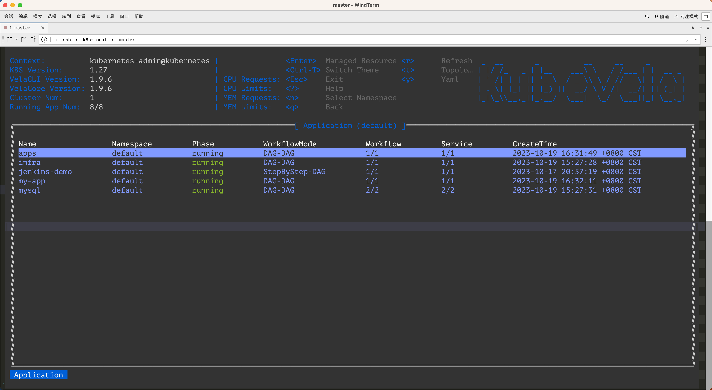

## 可观测性自动化

可观测性对于基础架构和应用程序至关重要。如果没有可观测性系统，就很难确定系统崩溃时发生了什么。强大的可观测性系统不仅可以为使用者提供信心，还可以帮助开发人员快速定位整个系统内部的性能瓶颈或薄弱环节。可观测性是 KubeVela 体系的一等公民，包含下面三个方面。

1. 自动化构建可观测性基础设施

为了帮助用户构建自己的可观测性系统，KubeVela 提供了开箱即用可观测性插件，包括：

**指标**

- `prometheus-server`: 以时间序列来记录指标的服务，支持灵活的查询。
- `kube-state-metrics`: Kubernetes 系统的指标收集器。
- `node-exporter`: Kubernetes 运行中的节点的指标收集器。

**日志**

- `loki`: 用于存储采集日志并提供查询服务的日志服务器。

**监控大盘**

- `grafana`: 提供分析和交互式可视化的 Web 应用程序。

当这些插件启动后，就会出现开箱即用的可观测性大盘，展示实时的系统状态。以后的版本还会引入用于 alerting 和 tracing 的插件。

2. 应用级可观测

KubeVela 的一大特点就是通过一个顶层应用描述（YAML）来驱动完整的应用交付，可观测性能力自然也不例外。对于应用而言，其使用体验就是选用日志或者指标对应的运维特征，KubeVela 控制器便会自动为其生成对应的监控大盘。

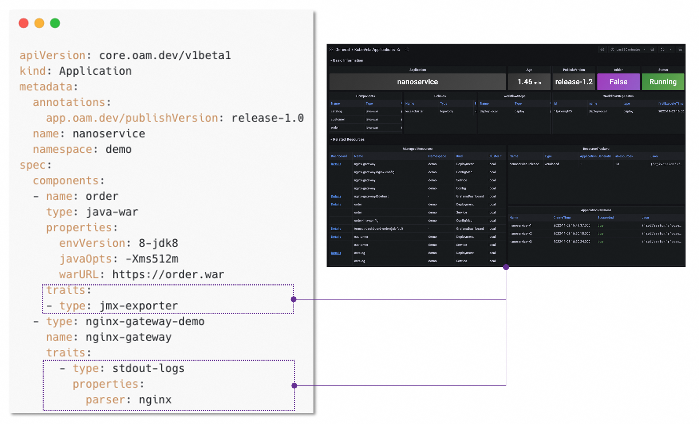

不仅如此，基于 KubeVela 的扩展体系，你也可以为你的平台自定义可观测运维特征。

3. 可观测性即代码

KubeVela 支撑应用可观测底层的能力全部通过 IaC（Infrastructure as Code）的方式完成，这也意味着 **KubeVela 打通了从指标（含日志）采集、解析、富化、存储、数据源注册，一直到大盘可视化全链路的 IaC 化**。

KubeVela 已经基于这一套 IaC 体系封装了创建数据源、创建大盘、导入大盘等通用的功能，你无需学习其中的细节便可以直接使用。如果你想要做一些自定义，也完全可以类似的通过 IaC 的方式编排你的流程，为你的平台自定义可观测能力。

接下来我们就来详细了解下上面提到的几个功能。


### 安装可观测性插件

要启用可观测性插件套件，只需运行 `vela addon enable` 命令按照即可（当然也可以通过 `VelaUX` 界面启用），如下所示。

**安装 kube-state-metrics 插件**

```bash
vela addon enable kube-state-metrics
```

**安装 node-exporter 插件**

```bash
vela addon enable node-exporter
```

**安装 prometheus-server**

```bash
vela addon enable prometheus-server
```

**安装 loki 插件**

```bash
vela addon enable loki
```

**安装 grafana 插件**

```bash
vela addon enable grafana
```

上面的命令会自动将所有的插件部署到 `o11y-system` 命名空间中，可以通过 `kubectl get pods -n o11y-system` 来查看插件的运行状态。

```bash
$ kubectl get pods -n o11y-system
NAME                                  READY   STATUS    RESTARTS   AGE
event-log-6f6ff5867f-cp54h            1/1     Running   0          136m
grafana-758f44bb8c-7s8v9              1/1     Running   0          132m
kube-state-metrics-7dbfd59f4d-rkrv9   1/1     Running   0          173m
loki-5fdf9bcc46-x77mk                 1/1     Running   0          139m
node-exporter-9642x                   1/1     Running   0          170m
node-exporter-tk99h                   1/1     Running   0          170m
prometheus-server-5bfb4c4f9f-z4fjn    1/1     Running   0          141m
vector-controller-f6f7dd9b7-nkgsl     1/1     Running   0          136m
vector-d49b8                          1/1     Running   0          136m
vector-km2lk                          1/1     Running   0          136m
```

然后我们可以通过端口转发访问 grafana

```bash
kubectl port-forward svc/grafana -n o11y-system 8080:3000
```

然后就可以通过 `http://localhost:8080` 在浏览器中访问 Grafana，默认的用户名和密码分别是 `admin` 和 `kubevela`。

> 可观测插件套件: 如果你想要通过一行命令来完成所有可观测性插件的安装，你可以使用 [WorkflowRun](https://github.com/kubevela/workflow) 来编排这些安装过程。它可以帮助你将复杂的安装流程代码化，并在各个系统中复用这个流程。


### 开箱即用的系统可观测

启用了可观测性插件后，我们可以在 Grafana 上看到若干预置的监控大盘，它们可以帮助你查看整个系统及各个应用的运行状态。

**KubeVela Application**

这个 dashboard 展示了应用的基本信息。地址：`http://localhost:8080/d/application-overview/kubevela-applications`

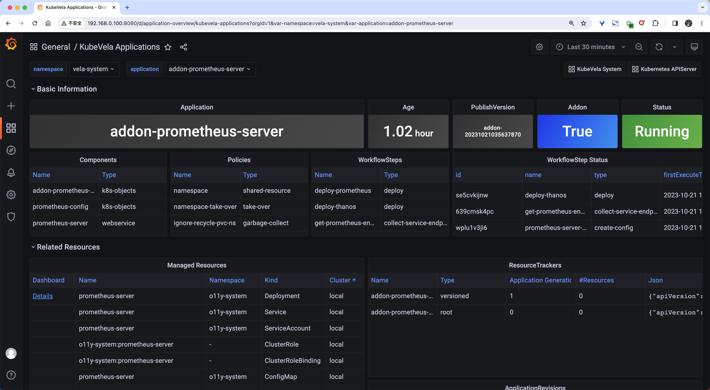

`KubeVela Application dashboard` 显示了应用的元数据概况。它直接访问 Kubernetes API 来检索运行时应用的信息，你可以将其作为入口。

- `Basic Information` 部分将关键信息提取到面板中，并提供当前应用最直观的视图。
- `Related Resource` 部分显示了与应用本身一起工作的那些资源，包括托管资源、记录的 `ResourceTracker` 和修正。

**Kubernetes Deployemnt**

这个 dashboard 显示原生 deployment 的概况。你可以查看跨集群的 deployment 的信息。地址: `http://localhost:8080/d/deployment-overview/kubernetes-deployment`。

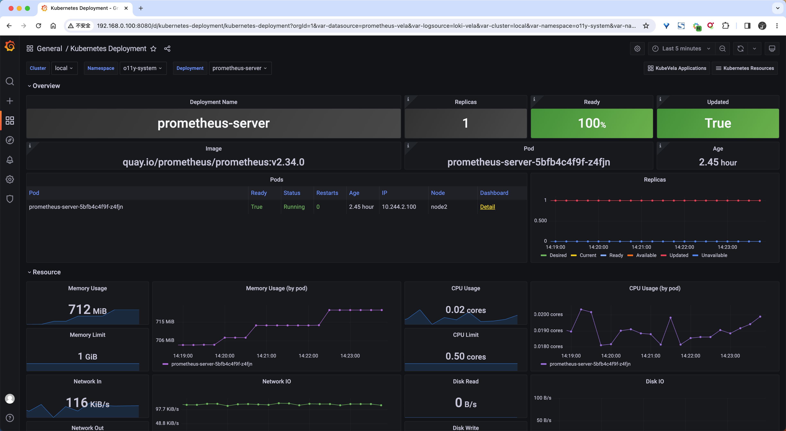

`Kubernetes Deployment dashboard` 向你提供 deployment 的详细运行状态。

- 其中 Pods 面板显示该 deployment 当前正在管理的 pod。
- `Replicas` 面板显示副本数量如何变化，用于诊断你的 deployment 何时以及如何转变到不希望的状态。
- Pod 部分包含资源的详细使用情况（包括 CPU / 内存 / 网络 / 存储），可用于识别 pod 是否面临资源压力或产生/接收意想不到的流量。

**KubeVela System**

这个 dashboard 显示 KubeVela 系统的概况。 它可以用来查看 KubeVela 控制器是否健康。地址: `http://localhost:8080/d/kubevela-system/kubevela-system`。

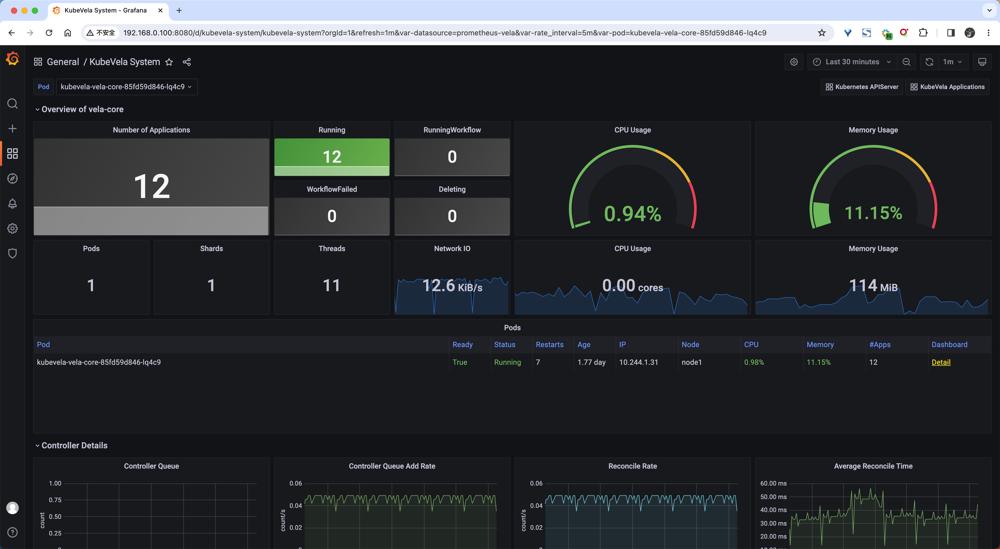

`KubeVela System dashboard` 提供 KubeVela 核心模块的运行详细信息，包括控制器和集群网关。

-  `Overview of vela-core` 部分显示了核心模块的使用情况。它可用于追踪是否存在内存泄漏（如果内存使用量不断增加）或处于高压状态（cpu 使用率总是很高）。如果内存使用量达到资源限制，则相应的模块将被杀死并重新启动，这表明计算资源不足。你应该为它们添加更多的 CPU/内存。 
-  `Controller Details` 部分包括各种面板，可帮助诊断你的 KubeVela 控制器的瓶颈。 
-  其中 `Controller Queue` 和 `Controller Queue Add Rate` 面板显示控制器工作队列的变化。如果控制器队列不断增加，说明系统中应用过多或应用的变化过多，控制器已经不能及时处理。那么这意味着 KubeVela 控制器存在性能问题。控制器队列的临时增长是可以容忍的，但维持很长时间将会导致内存占用的增加，最终导致内存不足的问题。 
-  `Reconcile Rate` 和 `Average Reconcile Time` 面板显示控制器状态的概况。如果调和速率稳定且平均调和时间合理（例如低于 500 毫秒，具体取决于你的场景），则你的 KubeVela 控制器是健康的。如果控制器队列入队速率在增加，但调和速率没有上升，会逐渐导致控制器队列增长并引发问题。 有多种情况表明你的控制器运行状况不佳： 
   - Reconcile 是健康的，但是应用太多，你会发现一切都很好，除了控制器队列指标增加。检查控制器的 CPU/内存使用情况。你可能需要添加更多的计算资源。
   - 由于错误太多，调和不健康。你会在 `Reconcile Rate` 面板中发现很多错误。这意味着你的系统正持续面临应用的处理错误。这可能是由错误的应用配置或运行工作流时出现的意外错误引起的。检查应用详细信息并查看哪些应用导致错误。
   - 由于调和时间过长导致的调整不健康。你需要检查 `ApplicationController Reconcile Time` 面板，看看它是常见情况（平均调和时间高），还是只有部分应用有问题（p95 调和时间高）。 对于前一种情况，通常是由于 CPU 不足（CPU 使用率高）或过多的请求和 kube-apiserver 限制了速率（检查 `ApplicationController Client Request Throughput` 和 `ApplicationController Client Request Average Time` 面板并查看哪些资源请求缓慢或过多）。对于后一种情况，你需要检查哪个应用很大并且使用大量时间进行调和。
   - 有时你可能需要参考 `ApplicationController Reconcile Stage Time`，看看是否有一些特殊的调和阶段异常。 例如，`GCResourceTracker` 使用大量时间意味着在 KubeVela 系统中可能存在阻塞回收资源的情况。

- `Application` 部分显示了整个 KubeVela 系统中应用的概况。可用于查看应用数量的变化和使用的工作流步骤。 `Workflow Initialize Rate` 是一个辅助面板，可用于查看启动新工作流执行的频率。`Workflow Average Complete Time` 可以进一步显示完成整个工作流程所需的时间。

**Kubernetes APIServer**

这个 dashboard 展示了所有 Kubernetes apiserver 的运行状态。地址: `http://localhost:8080/d/kubernetes-apiserver/kubernetes-apiserver`。

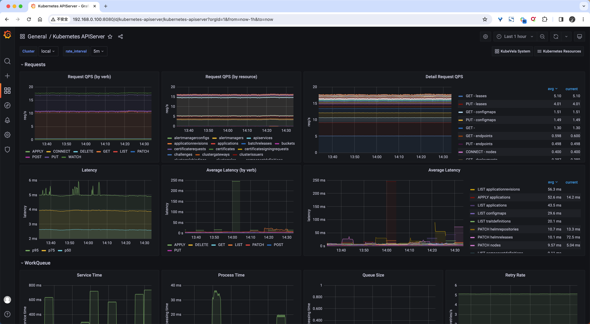

`Kubernetes APIServer dashboard` 可帮助你查看 Kubernetes 系统最基本的部分。如果你的 Kubernetes APIServer 运行不正常，你的 Kubernetes 系统中所有控制器和模块都会出现异常，无法成功处理请求。 因此务必确保此 dashboard 中的一切正常。

- `Requests` 部分包括一系列面板，用来显示各种请求的 QPS 和延迟。通常，如果请求过多，APIServer 可能无法响应。这时候就可以看到是哪种类型的请求出问题了。
- `WorkQueue` 部分显示 Kubernetes APIServer 的处理状态。如果 Queue Size 很大，则表示请求数超出了你的 Kubernetes APIServer 的处理能力。
- `Watches` 部分显示 Kubernetes APIServer 中的 watch 数量。与其他类型的请求相比，WATCH 请求会持续消耗 Kubernetes APIServer 中的计算资源，因此限制 watch 的数量会有所帮助。

当然除了上面几个主要的 Dashboard 之外还有其他的，比如 StatefulSet、DaemonSet、Pod、Events Dashboard 等，这里就不一一介绍了。

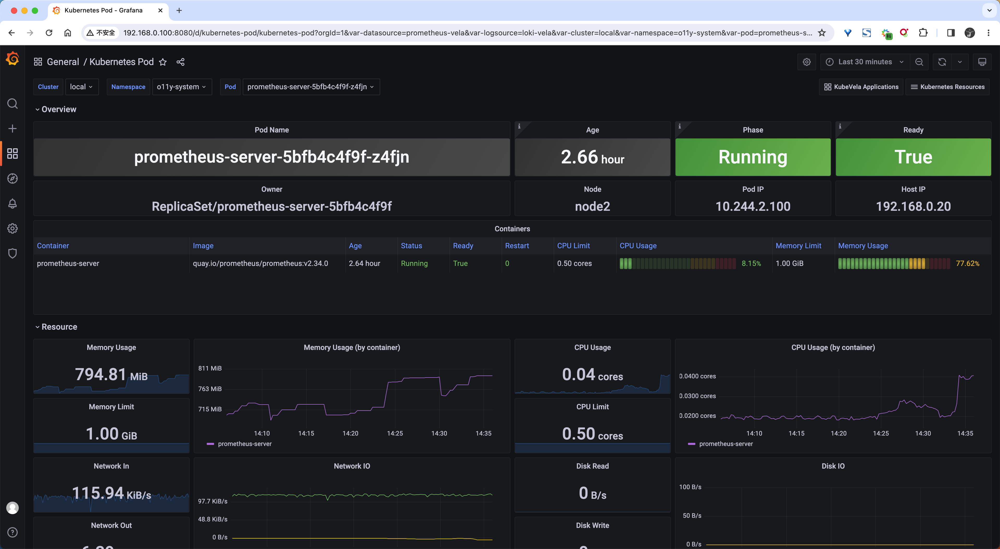


### 自定义指标采集

上面我们介绍的这些面板都是我们安装的可观测插件套件内置的采集的一些指标数据，那如果我们想要采集自己的指标数据应该怎么实现呢？

**采集应用指标**

在你的应用中，如果你想要将应用内组件（如 `webservice`）的指标暴露给 Prometheus，从而被指标采集器采集，你只需要为其添加 `prometheus-scrape` 运维特征即可，如下所示：

```yaml
apiVersion: core.oam.dev/v1beta1
kind: Application
metadata:
  name: prom-demo
spec:
  components:
    - name: my-app
      type: webservice
      properties:
        image: cnych/prometheus-client-example:new
      traits:
        - type: prometheus-scrape
```

你也可以显式指定指标的端口和路径。

```yaml
apiVersion: core.oam.dev/v1beta1
kind: Application
metadata:
  name: prom-demo
spec:
  components:
    - name: my-app
      type: webservice
      properties:
        image: cnych/prometheus-client-example:new
      traits:
        - type: prometheus-scrape
          properties:
            port: 8080
            path: /metrics
```

我们只需要添加一个 `prometheus-scrape` 类型的运维特征即可，KubeVela 就会自动采集到应用的指标。

**自定义 Prometheus 配置**

同样如果你想自定义安装 prometheus-server ，你可以把配置放到一个单独的 `ConfigMap` 中，比如在命名空间 `o11y-system` 中的 `my-prom`。要将你的自定义配置分发到所有集群，你还可以使用 KubeVela Application 来完成这项工作。

例如，如果你想在所有集群中的所有 prometheus 服务配置中添加一些记录规则，你可以创建一个 Application 来分发你的记录规则，如下所示。

```yaml
# my-prom.yaml
apiVersion: core.oam.dev/v1beta1
kind: Application
metadata:
  name: my-prom
  namespace: o11y-system
spec:
  components:
    - type: k8s-objects
      name: my-prom
      properties:
        objects:
          - apiVersion: v1
            kind: ConfigMap
            metadata:
              name: my-prom
              namespace: o11y-system
            data:
              my-recording-rules.yml: |
                groups:
                - name: example
                  rules:
                  - record: apiserver:requests:rate5m
                    expr: sum(rate(apiserver_request_total{job="kubernetes-nodes"}[5m]))
  policies:
    - type: topology
      name: topology
      properties:
        clusterLabelSelector: {}
```

然后你需要在 `prometheus-server` 插件的启用过程中添加 `customConfig` 参数，比如：

```bash
vela addon enable prometheus-server thanos=true serviceType=LoadBalancer storage=1G customConfig=my-prom
```

然后你将看到记录规则配置被分发到到所有 promethues 了。

同样要对告警规则等其他配置进行自定义，过程与上面显示的记录规则示例相同。你只需要在 application 中更改/添加 prometheus 配置。

```yaml
data:
  my-alerting-rules.yml: |
    groups:
    - name: example
      rules:
      - alert: HighApplicationQueueDepth
        expr: sum(workqueue_depth{app_kubernetes_io_name="vela-core",name="application"}) > 100
        for: 10m
        annotations:
          summary: High Application Queue Depth
```

然后在 Prometheus 中就可以包含你的告警规则了。

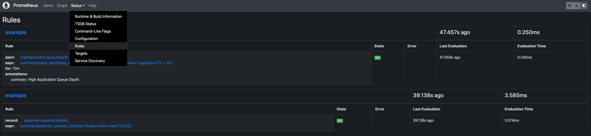

如果要更改 Grafana 的默认用户名和密码，可以运行以下命令：

```bash
vela addon enable grafana adminUser=super-user adminPassword=PASSWORD
```

这会将你的默认管理员用户更改为 `super-user`，并将其密码更改为 `PASSWORD`。

默认情况下 prometheus-server 的数据并没有持久化，如果你希望 prometheus-server 和 grafana 将数据持久化在卷中，可以在安装时指定 storage 参数，例如：

```bash
vela addon enable prometheus-server storage=1G
```

这将创建 PersistentVolumeClaims 并让插件使用提供的存储。需要注意的是即使插件被禁用，存储也不会自动回收。你需要手动清理存储。


### 自定义日志采集

应用日志对于发现和排查线上问题至关重要，KubeVela 提供了专门的日志收集插件，帮助用户快速地构建应用的日志可观测的能力。

首先确保你开启了 loki 和 grafana 两个插件。日志收集插件可以通过两种模式启用：

- 定向采集：指定日志采集运维特征（Trait）使用。
- 全部采集：容器 stdout 日志自动化全部采集。

**定向采集模式**

指定 `agent=vector` 参数启动 loki 插件。

```bash
vela addon enable loki agent=vector
```

启用该插件后会在管控集群部署一个 loki 服务作为日志存储数据仓库，并会在当前各被管控集群的节点上部署日志采集 agent vector 。

> 如果你只想指定部分集群安装 loki 插件，可以指定 `clusters` 参数启动插件。另外，新的集群被加入以后，你要重新运行一下插件启动命令来让这个集群生效。


启动日志收集之后，默认不会对应用的日志进行采集，需要应用配置专门的运维特征来开启。系统中会增加以下两个日志收集运维特征：

- `file-logs`：使用 vector 从文件或 stdout 收集日志
- `stdout-logs`：应用程序日志的 ETL 转换器

你需要为应用组件配置上述特征，同时该运维特征也支持配置 vector 处理脚本（VRL）对日志内容做自定义解析处理。

**默认全部采集模式（全采模式）**

```bash
vela addon enable loki agent=vector stdout=all
```

启用该插件后，日志采集 agent vector 会自动采集宿主机上实例的标准输出日志。收集的日志会被传输到管控集群的 loki 数据仓库。

这种方式启用的日志收集服务。不需要应用配置任何运维特征，即可对应用的标准输出日志进行采集，并将日志到汇总到控集群的 loki 服务当中。优点是配置简单。当然日志全采的方式也存在如下缺点：

- 对所有运行的容器进行采集，当应用很多时会对运行在管控集群的 loki 服务造成很大的压力。一方面太多的日志需要被持久化，占用大量硬盘资源。另一方面各个集群的 vector agent 都需要把采集到的日志传输至 loki 服务，会消耗大量系统带宽。
- 全采模式只能以统一的方式对日志进行收集，无法对不同应用的日志内容做特殊的处理。

**Kubernetes 系统事件日志**

loki 插件开启后会在各个集群装中安装一个专门的组件，负责采集各个集群中的 Kubernetes 事件并转换成日志的形式存储在 loki 中。你还可以通过 grafana 插件中专门的 Kubernetes 事件分析大盘对系统的事件进行汇总分析。

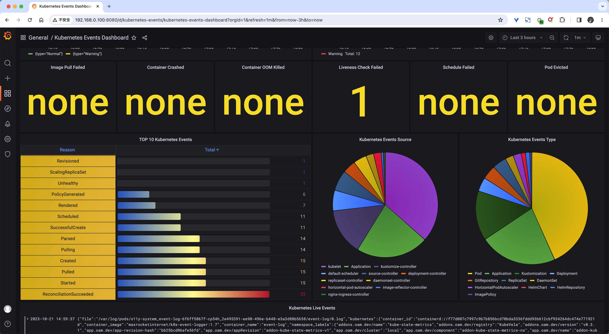

`KubeVela Events dashboard` 展示了系统中各个集群的 Kubernetes 事件日志。

- **Kubernetes Event overview** 以时间为维度，展示系统中各个时间段内新增的 Kubernetes 事件数目。
- **Warning Events** 统计系统中出现 `Warning` 类型的事件数目。
- **Image Pull Failed/Container Crashed .../Pod Evicted** 统计最近十二小时内，镜像拉取失败，实例被驱逐等各类标志应用失败的事件个数。
- **TOP 10 Kubernetes Events** 统计系统中最近十二小时内出现次数最高的十类事件
- **Kubernetes Events Source** 产生这些事件的控制器分布的饼状图。
- **Kubernetes Events Type** 与事件相关的资源对象类型的分布饼状图。
- **Kubernetes Live Events** 展示最近的事件日志。

**应用标准输出日志**

上面已经提到如果在启用插件时选择的是全采模式，不需要应用做任何特殊配置，即可完成对容器的标准输出日志的采集。我们这里并没有启用全采集模式，所以需要使用定向采集的模式完成标准输出日志的采集。

我们需要在组件中配置 `stdout-logs` 运维特征完成对组件容器日志的收集，如下所示：

```yaml
apiVersion: core.oam.dev/v1beta1
kind: Application
metadata:
  name: app-stdout-log
  namespace: default
spec:
  components:
    - type: webservice
      name: comp-stdout-log
      properties:
        image: busybox
      traits:
        - type: command
          properties:
            command:
              - sh
              - -c
              - |
                while :
                do
                  now=$(date +"%T")
                  echo "stdout: $now"
                  sleep 10
                done
        - type: stdout-logs
```

应用创建之后你可以在对应 grafana 应用大盘中找到该应用创建的 deployment 资源，从而点击跳转到 deployment 资源大盘，并在下面找到采集上来的日志数据。如下：

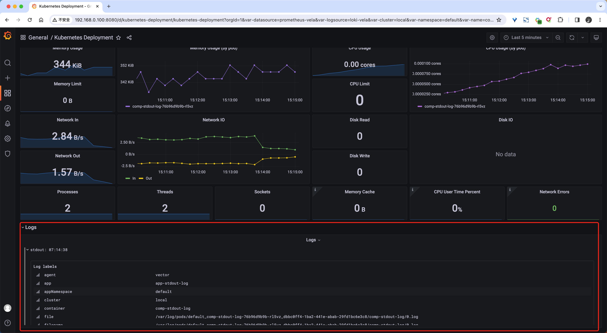

另外如果你的应用是一个 nginx 网关应用，`stdout-logs` 运维特征所提供的 `parser` 能力可以将 nginx 日志输出 `combined` 格式的日志文件转换成 json 格式，并提供专门的分析大盘对 nginx 的网关访问请求进行进一步的分析。

比如我们创建一个如下所示的 nginx 应用：

```yaml
# app-nginx-log.yaml
apiVersion: core.oam.dev/v1beta1
kind: Application
metadata:
  name: nginx-app
spec:
  components:
    - name: nginx-comp
      type: webservice
      properties:
        image: nginx:1.14.2
        ports:
          - port: 80
            expose: true
      traits:
        - type: stdout-logs
          properties:
            parser: nginx
```

这里我们启用了 `stdout-logs` 运维特征，并指定了 `parser` 为 `nginx`，这样我们就可以在 grafana 中找到 nginx 的分析大盘了。

我们可以通过 grafana 中的应用大盘跳转到专门的 nginx 日志分析大盘。地址：`http://localhost:8080/d/nginx-comp/kubevela-application-nginx-app-log-analytics`。

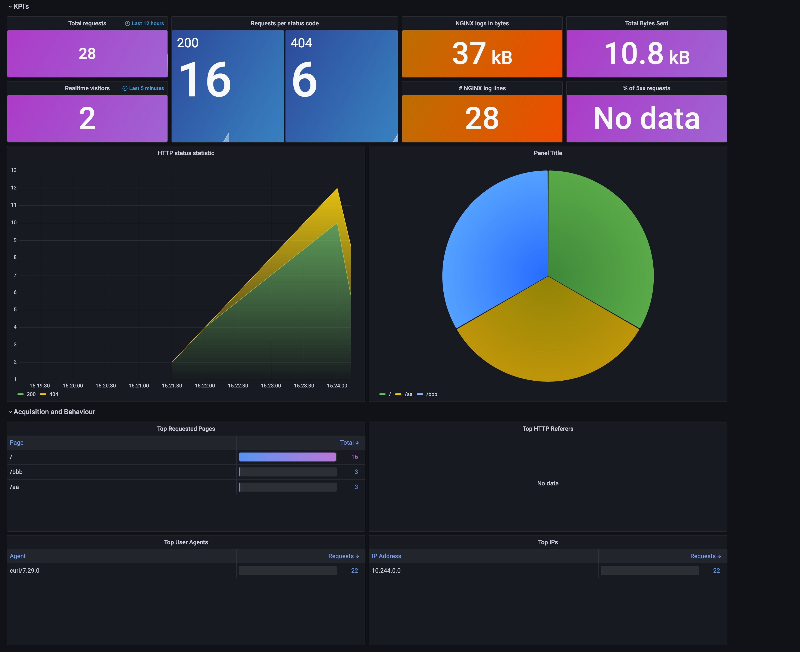

`KubeVela nginx application dashboard nginx` 网关应用的访问日志分析大盘。

- **KPI's** 包含网关的核心关键指标，例如，最近十二小时的总请求访问量，和 5xx 请求的百分占比。
- **HTTP status statistic** 时间维度上网关的各个请求码的请求数量统计。
- **Top Request Pages** 被访问最多的页面统计。

除了 Nginx 的 parser 能力之外，还提供了对于 Apache 或者自定义的日志分析能力。

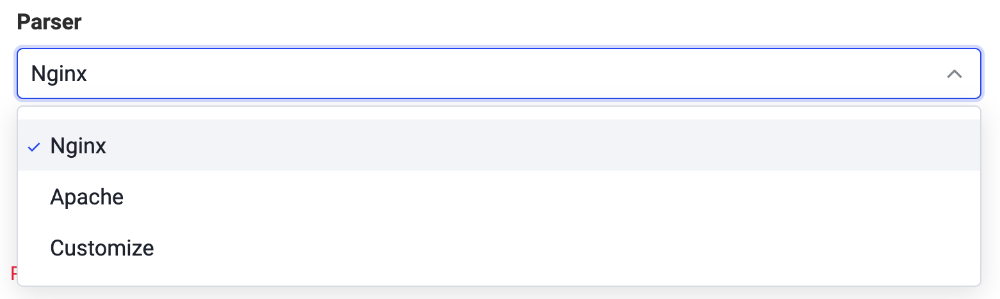

除了使用通过在运维特种中设定参数 `parser: nginx` 对日志内容做处理，我们还可以通过设置自定义的日志处理脚本对日志做自定义的处理。如下：

```yaml
apiVersion: core.oam.dev/v1beta1
kind: Application
metadata:
  name: nginx-app-2
spec:
  components:
    - name: nginx-comp
      type: webservice
      properties:
        image: nginx:1.14.2
        ports:
          - port: 80
            expose: true
      traits:
        - type: stdout-logs
          properties:
            parser: customize
            VRL: |
              .message = parse_nginx_log!(.message, "combined")
              .new_field = "new value"
```

该例子中，除了将 nginx 输出的 `combinded` 日志转换成 json 格式，并为每条日志增加一个 `new_field` 的 json key ，json value 的值为 `new value`。具体 vector VRL 如何编写请参考文档：`https://vector.dev/docs/reference/vrl/`。

**应用文件日志**

日志收集插件除了可以对容器标准输出日志进行收集，也可以对容器写到某个目录下的文件日志进行收集。如下：

```yaml
# app-file-log.yaml
apiVersion: core.oam.dev/v1beta1
kind: Application
metadata:
  name: app-file
  namespace: default
spec:
  components:
    - type: webservice
      name: file-log-comp
      properties:
        image: busybox
      traits:
        - type: command
          properties:
            command:
              - sh
              - -c
              - |
                while :
                do
                  now=$(date +"%T")
                  echo "file: $now" >> /root/verbose.log
                  sleep 10
                done
        - type: file-logs
          properties:
            path: /root/verbose.log
```

在上面的例子中，我们把日志输出到了容器内的 `/root/verbose.log` 路径下，然后应用了 `file-logs` 类型的运维特征。应用创建之后，我们就可以通过应用下的 deployment 大盘查看到对应的文件日志结果。

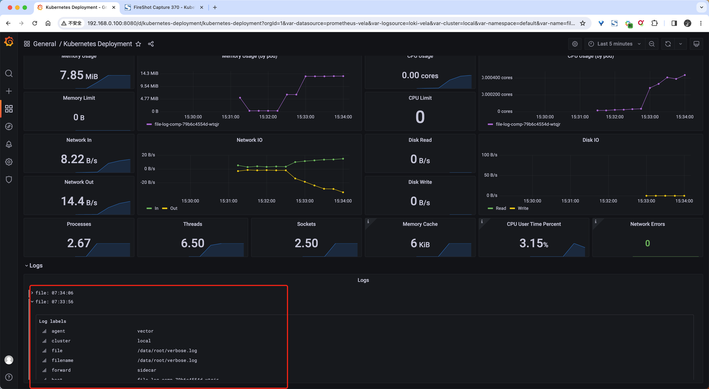


### 自定义监控大盘

在 KubeVela 中，借助 Kubernetes 原生的 Aggregated API Layer，KubeVela 用户可以比较轻易地在集群中操作修改 Grafana 上的监控大盘。

除了前面我们提到的开箱即用的 grafana 插件预置的监控大盘外，KubeVela 用户同样也可以在系统中部署自定义大盘。

> 如果你还不了解如何在 Grafana 上创建大盘并将它们以 JSON 格式导出，你可以阅读下列 [Grafana 官方文档](https://grafana.com/docs/grafana/latest/getting-started/build-first-dashboard/)来学习。


**使用应用组件部署监控大盘**

一种部署监控大盘的方式是在 KubeVela 应用中使用相应的组件类型。

```yaml
apiVersion: core.oam.dev/v1beta1
kind: Application
metadata:
  name: my-dashboard
spec:
  components:
    - name: my-dashboard
      type: grafana-dashboard
      properties:
        uid: my-example-dashboard
        data: |
          {
            "panels": [{
                "gridPos": {
                    "h": 9,
                    "w": 12
                },
                "targets": [{
                    "datasource": {
                        "type": "prometheus",
                        "uid": "prometheus-vela"
                    },
                    "expr": "max(up) by (cluster)"
                }],
                "title": "Clusters",
                "type": "timeseries"
            }],
            "title": "My Dashboard"
          }
```

我们可以通过在 Application 对象中指定 `grafana-dashboard` 类型的组件来部署一个自定义的监控大盘。在上面的例子中，我们部署了一个监控大盘，用于展示集群中各个节点的健康状态。

应用上面的资源对象后，我们就可以在 Grafana 中看到我们刚刚部署的监控大盘了。

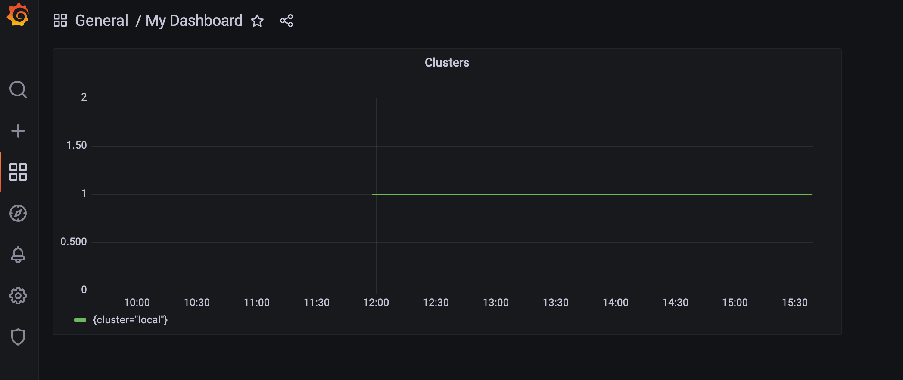

**使用应用运维特征部署监控大盘**

除了组件外，用户也可以将监控大盘放在运维特征中进行部署，如下所示：

```yaml
apiVersion: core.oam.dev/v1beta1
kind: Application
metadata:
  name: my-app-dashboard
spec:
  components:
    - name: my-app
      type: webservice
      properties:
        image: cnych/prometheus-client-example:new
      traits:
        - type: prometheus-scrape
        - type: grafana-dashboard
          properties:
            data: |
              {"__inputs":[{"name":"DS_PROMETHEUS","label":"prometheus-vela","description":"","type":"datasource","pluginId":"prometheus","pluginName":"Prometheus"}],"__elements":[],"__requires":[{"type":"grafana","id":"grafana","name":"Grafana","version":"8.5.3"},{"type":"panel","id":"graph","name":"Graph (old)","version":""},{"type":"datasource","id":"prometheus","name":"Prometheus","version":"1.0.0"}],"annotations":{"list":[{"builtIn":1,"datasource":{"type":"grafana","uid":"-- Grafana --"},"enable":true,"hide":true,"iconColor":"rgba(0, 211, 255, 1)","name":"Annotations & Alerts","target":{"limit":100,"matchAny":false,"tags":[],"type":"dashboard"},"type":"dashboard"}]},"description":"Auto-generated Dashboard","editable":true,"fiscalYearStartMonth":0,"graphTooltip":0,"id":null,"iteration":1667283876999,"links":[],"liveNow":false,"panels":[{"aliasColors":{},"bars":false,"dashLength":10,"dashes":false,"datasource":{"type":"prometheus","uid":"${DS_PROMETHEUS}"},"description":"Build information about the main Go module.","fill":1,"fillGradient":0,"gridPos":{"h":8,"w":6,"x":0,"y":0},"hiddenSeries":false,"id":1,"legend":{"avg":false,"current":false,"max":false,"min":false,"show":false,"total":false,"values":false},"lines":true,"linewidth":1,"nullPointMode":"null","options":{"alertThreshold":true},"percentage":false,"pluginVersion":"8.5.3","pointradius":2,"points":false,"renderer":"flot","seriesOverrides":[],"spaceLength":10,"stack":false,"steppedLine":false,"targets":[{"expr":"sum(go_build_info)","refId":"A"}],"thresholds":[],"timeRegions":[],"title":"go_build_info","tooltip":{"shared":true,"sort":0,"value_type":"individual"},"type":"graph","xaxis":{"mode":"time","show":true,"values":[]},"yaxes":[{"format":"short","logBase":1,"show":true},{"format":"short","logBase":1,"show":true}],"yaxis":{"align":false}},{"aliasColors":{},"bars":false,"dashLength":10,"dashes":false,"datasource":{"type":"prometheus","uid":"${DS_PROMETHEUS}"},"description":"A summary of the pause duration of garbage collection cycles.","fill":1,"fillGradient":0,"gridPos":{"h":8,"w":6,"x":6,"y":0},"hiddenSeries":false,"id":2,"legend":{"avg":false,"current":false,"max":false,"min":false,"show":true,"total":false,"values":false},"lines":true,"linewidth":1,"nullPointMode":"null","options":{"alertThreshold":true},"percentage":false,"pluginVersion":"8.5.3","pointradius":2,"points":false,"renderer":"flot","seriesOverrides":[],"spaceLength":10,"stack":false,"steppedLine":false,"targets":[{"expr":"sum(rate(go_gc_duration_seconds_sum[$rate_interval])) / sum(rate(go_gc_duration_seconds_count[$rate_interval]))","legendFormat":"avg","refId":"A"},{"expr":"histogram_quantile(0.75, sum(rate(go_gc_duration_seconds_bucket[$rate_interval])) by (le))","legendFormat":"p75","refId":"B"},{"expr":"histogram_quantile(0.99, sum(rate(go_gc_duration_seconds_bucket[$rate_interval])) by (le))","legendFormat":"p99","refId":"C"}],"thresholds":[],"timeRegions":[],"title":"go_gc_duration_seconds","tooltip":{"shared":true,"sort":0,"value_type":"individual"},"type":"graph","xaxis":{"mode":"time","show":true,"values":[]},"yaxes":[{"format":"short","logBase":1,"show":true},{"format":"short","logBase":1,"show":true}],"yaxis":{"align":false}},{"aliasColors":{},"bars":false,"dashLength":10,"dashes":false,"datasource":{"type":"prometheus","uid":"${DS_PROMETHEUS}"},"description":"Number of goroutines that currently exist.","fill":1,"fillGradient":0,"gridPos":{"h":8,"w":6,"x":12,"y":0},"hiddenSeries":false,"id":3,"legend":{"avg":false,"current":false,"max":false,"min":false,"show":false,"total":false,"values":false},"lines":true,"linewidth":1,"nullPointMode":"null","options":{"alertThreshold":true},"percentage":false,"pluginVersion":"8.5.3","pointradius":2,"points":false,"renderer":"flot","seriesOverrides":[],"spaceLength":10,"stack":false,"steppedLine":false,"targets":[{"expr":"sum(go_goroutines)","refId":"A"}],"thresholds":[],"timeRegions":[],"title":"go_goroutines","tooltip":{"shared":true,"sort":0,"value_type":"individual"},"type":"graph","xaxis":{"mode":"time","show":true,"values":[]},"yaxes":[{"format":"short","logBase":1,"show":true},{"format":"short","logBase":1,"show":true}],"yaxis":{"align":false}},{"aliasColors":{},"bars":false,"dashLength":10,"dashes":false,"datasource":{"type":"prometheus","uid":"${DS_PROMETHEUS}"},"description":"Information about the Go environment.","fill":1,"fillGradient":0,"gridPos":{"h":8,"w":6,"x":18,"y":0},"hiddenSeries":false,"id":4,"legend":{"avg":false,"current":false,"max":false,"min":false,"show":false,"total":false,"values":false},"lines":true,"linewidth":1,"nullPointMode":"null","options":{"alertThreshold":true},"percentage":false,"pluginVersion":"8.5.3","pointradius":2,"points":false,"renderer":"flot","seriesOverrides":[],"spaceLength":10,"stack":false,"steppedLine":false,"targets":[{"expr":"sum(go_info)","refId":"A"}],"thresholds":[],"timeRegions":[],"title":"go_info","tooltip":{"shared":true,"sort":0,"value_type":"individual"},"type":"graph","xaxis":{"mode":"time","show":true,"values":[]},"yaxes":[{"format":"short","logBase":1,"show":true},{"format":"short","logBase":1,"show":true}],"yaxis":{"align":false}},{"aliasColors":{},"bars":false,"dashLength":10,"dashes":false,"datasource":{"type":"prometheus","uid":"${DS_PROMETHEUS}"},"description":"Number of bytes allocated and still in use.","fill":1,"fillGradient":0,"gridPos":{"h":8,"w":6,"x":0,"y":8},"hiddenSeries":false,"id":5,"legend":{"avg":false,"current":false,"max":false,"min":false,"show":false,"total":false,"values":false},"lines":true,"linewidth":1,"nullPointMode":"null","options":{"alertThreshold":true},"percentage":false,"pluginVersion":"8.5.3","pointradius":2,"points":false,"renderer":"flot","seriesOverrides":[],"spaceLength":10,"stack":false,"steppedLine":false,"targets":[{"expr":"sum(go_memstats_alloc_bytes)","refId":"A"}],"thresholds":[],"timeRegions":[],"title":"go_memstats_alloc_bytes","tooltip":{"shared":true,"sort":0,"value_type":"individual"},"type":"graph","xaxis":{"mode":"time","show":true,"values":[]},"yaxes":[{"format":"short","logBase":1,"show":true},{"format":"short","logBase":1,"show":true}],"yaxis":{"align":false}},{"aliasColors":{},"bars":false,"dashLength":10,"dashes":false,"datasource":{"type":"prometheus","uid":"${DS_PROMETHEUS}"},"description":"Total number of bytes allocated, even if freed.","fill":1,"fillGradient":0,"gridPos":{"h":8,"w":6,"x":6,"y":8},"hiddenSeries":false,"id":6,"legend":{"avg":false,"current":false,"max":false,"min":false,"show":false,"total":false,"values":false},"lines":true,"linewidth":1,"nullPointMode":"null","options":{"alertThreshold":true},"percentage":false,"pluginVersion":"8.5.3","pointradius":2,"points":false,"renderer":"flot","seriesOverrides":[],"spaceLength":10,"stack":false,"steppedLine":false,"targets":[{"expr":"sum(rate(go_memstats_alloc_bytes_total[$rate_interval]))","refId":"A"}],"thresholds":[],"timeRegions":[],"title":"go_memstats_alloc_bytes_total","tooltip":{"shared":true,"sort":0,"value_type":"individual"},"type":"graph","xaxis":{"mode":"time","show":true,"values":[]},"yaxes":[{"format":"short","logBase":1,"show":true},{"format":"short","logBase":1,"show":true}],"yaxis":{"align":false}},{"aliasColors":{},"bars":false,"dashLength":10,"dashes":false,"datasource":{"type":"prometheus","uid":"${DS_PROMETHEUS}"},"description":"Number of bytes used by the profiling bucket hash table.","fill":1,"fillGradient":0,"gridPos":{"h":8,"w":6,"x":12,"y":8},"hiddenSeries":false,"id":7,"legend":{"avg":false,"current":false,"max":false,"min":false,"show":false,"total":false,"values":false},"lines":true,"linewidth":1,"nullPointMode":"null","options":{"alertThreshold":true},"percentage":false,"pluginVersion":"8.5.3","pointradius":2,"points":false,"renderer":"flot","seriesOverrides":[],"spaceLength":10,"stack":false,"steppedLine":false,"targets":[{"expr":"sum(go_memstats_buck_hash_sys_bytes)","refId":"A"}],"thresholds":[],"timeRegions":[],"title":"go_memstats_buck_hash_sys_bytes","tooltip":{"shared":true,"sort":0,"value_type":"individual"},"type":"graph","xaxis":{"mode":"time","show":true,"values":[]},"yaxes":[{"format":"short","logBase":1,"show":true},{"format":"short","logBase":1,"show":true}],"yaxis":{"align":false}},{"aliasColors":{},"bars":false,"dashLength":10,"dashes":false,"datasource":{"type":"prometheus","uid":"${DS_PROMETHEUS}"},"description":"Total number of frees.","fill":1,"fillGradient":0,"gridPos":{"h":8,"w":6,"x":18,"y":8},"hiddenSeries":false,"id":8,"legend":{"avg":false,"current":false,"max":false,"min":false,"show":false,"total":false,"values":false},"lines":true,"linewidth":1,"nullPointMode":"null","options":{"alertThreshold":true},"percentage":false,"pluginVersion":"8.5.3","pointradius":2,"points":false,"renderer":"flot","seriesOverrides":[],"spaceLength":10,"stack":false,"steppedLine":false,"targets":[{"expr":"sum(rate(go_memstats_frees_total[$rate_interval]))","refId":"A"}],"thresholds":[],"timeRegions":[],"title":"go_memstats_frees_total","tooltip":{"shared":true,"sort":0,"value_type":"individual"},"type":"graph","xaxis":{"mode":"time","show":true,"values":[]},"yaxes":[{"format":"short","logBase":1,"show":true},{"format":"short","logBase":1,"show":true}],"yaxis":{"align":false}},{"aliasColors":{},"bars":false,"dashLength":10,"dashes":false,"datasource":{"type":"prometheus","uid":"${DS_PROMETHEUS}"},"description":"Number of bytes used for garbage collection system metadata.","fill":1,"fillGradient":0,"gridPos":{"h":8,"w":6,"x":0,"y":16},"hiddenSeries":false,"id":9,"legend":{"avg":false,"current":false,"max":false,"min":false,"show":false,"total":false,"values":false},"lines":true,"linewidth":1,"nullPointMode":"null","options":{"alertThreshold":true},"percentage":false,"pluginVersion":"8.5.3","pointradius":2,"points":false,"renderer":"flot","seriesOverrides":[],"spaceLength":10,"stack":false,"steppedLine":false,"targets":[{"expr":"sum(go_memstats_gc_sys_bytes)","refId":"A"}],"thresholds":[],"timeRegions":[],"title":"go_memstats_gc_sys_bytes","tooltip":{"shared":true,"sort":0,"value_type":"individual"},"type":"graph","xaxis":{"mode":"time","show":true,"values":[]},"yaxes":[{"format":"short","logBase":1,"show":true},{"format":"short","logBase":1,"show":true}],"yaxis":{"align":false}},{"aliasColors":{},"bars":false,"dashLength":10,"dashes":false,"datasource":{"type":"prometheus","uid":"${DS_PROMETHEUS}"},"description":"Number of heap bytes allocated and still in use.","fill":1,"fillGradient":0,"gridPos":{"h":8,"w":6,"x":6,"y":16},"hiddenSeries":false,"id":10,"legend":{"avg":false,"current":false,"max":false,"min":false,"show":false,"total":false,"values":false},"lines":true,"linewidth":1,"nullPointMode":"null","options":{"alertThreshold":true},"percentage":false,"pluginVersion":"8.5.3","pointradius":2,"points":false,"renderer":"flot","seriesOverrides":[],"spaceLength":10,"stack":false,"steppedLine":false,"targets":[{"expr":"sum(go_memstats_heap_alloc_bytes)","refId":"A"}],"thresholds":[],"timeRegions":[],"title":"go_memstats_heap_alloc_bytes","tooltip":{"shared":true,"sort":0,"value_type":"individual"},"type":"graph","xaxis":{"mode":"time","show":true,"values":[]},"yaxes":[{"format":"short","logBase":1,"show":true},{"format":"short","logBase":1,"show":true}],"yaxis":{"align":false}},{"aliasColors":{},"bars":false,"dashLength":10,"dashes":false,"datasource":{"type":"prometheus","uid":"${DS_PROMETHEUS}"},"description":"Number of heap bytes waiting to be used.","fill":1,"fillGradient":0,"gridPos":{"h":8,"w":6,"x":12,"y":16},"hiddenSeries":false,"id":11,"legend":{"avg":false,"current":false,"max":false,"min":false,"show":false,"total":false,"values":false},"lines":true,"linewidth":1,"nullPointMode":"null","options":{"alertThreshold":true},"percentage":false,"pluginVersion":"8.5.3","pointradius":2,"points":false,"renderer":"flot","seriesOverrides":[],"spaceLength":10,"stack":false,"steppedLine":false,"targets":[{"expr":"sum(go_memstats_heap_idle_bytes)","refId":"A"}],"thresholds":[],"timeRegions":[],"title":"go_memstats_heap_idle_bytes","tooltip":{"shared":true,"sort":0,"value_type":"individual"},"type":"graph","xaxis":{"mode":"time","show":true,"values":[]},"yaxes":[{"format":"short","logBase":1,"show":true},{"format":"short","logBase":1,"show":true}],"yaxis":{"align":false}},{"aliasColors":{},"bars":false,"dashLength":10,"dashes":false,"datasource":{"type":"prometheus","uid":"${DS_PROMETHEUS}"},"description":"Number of heap bytes that are in use.","fill":1,"fillGradient":0,"gridPos":{"h":8,"w":6,"x":18,"y":16},"hiddenSeries":false,"id":12,"legend":{"avg":false,"current":false,"max":false,"min":false,"show":false,"total":false,"values":false},"lines":true,"linewidth":1,"nullPointMode":"null","options":{"alertThreshold":true},"percentage":false,"pluginVersion":"8.5.3","pointradius":2,"points":false,"renderer":"flot","seriesOverrides":[],"spaceLength":10,"stack":false,"steppedLine":false,"targets":[{"expr":"sum(go_memstats_heap_inuse_bytes)","refId":"A"}],"thresholds":[],"timeRegions":[],"title":"go_memstats_heap_inuse_bytes","tooltip":{"shared":true,"sort":0,"value_type":"individual"},"type":"graph","xaxis":{"mode":"time","show":true,"values":[]},"yaxes":[{"format":"short","logBase":1,"show":true},{"format":"short","logBase":1,"show":true}],"yaxis":{"align":false}},{"datasource":{"type":"prometheus","uid":"${DS_PROMETHEUS}"},"description":"Number of allocated objects.","gridPos":{"h":8,"w":6,"x":0,"y":24},"id":13,"legend":{"show":false},"targets":[{"expr":"sum(go_memstats_heap_objects)","refId":"A"}],"title":"go_memstats_heap_objects","type":"graph"},{"datasource":{"type":"prometheus","uid":"${DS_PROMETHEUS}"},"description":"Number of heap bytes released to OS.","gridPos":{"h":8,"w":6,"x":6,"y":24},"id":14,"legend":{"show":false},"targets":[{"expr":"sum(go_memstats_heap_released_bytes)","refId":"A"}],"title":"go_memstats_heap_released_bytes","type":"graph"},{"datasource":{"type":"prometheus","uid":"${DS_PROMETHEUS}"},"description":"Number of heap bytes obtained from system.","gridPos":{"h":8,"w":6,"x":12,"y":24},"id":15,"legend":{"show":false},"targets":[{"expr":"sum(go_memstats_heap_sys_bytes)","refId":"A"}],"title":"go_memstats_heap_sys_bytes","type":"graph"},{"datasource":{"type":"prometheus","uid":"${DS_PROMETHEUS}"},"description":"Number of seconds since 1970 of last garbage collection.","gridPos":{"h":8,"w":6,"x":18,"y":24},"id":16,"legend":{"show":false},"targets":[{"expr":"sum(go_memstats_last_gc_time_seconds)","refId":"A"}],"title":"go_memstats_last_gc_time_seconds","type":"graph"},{"datasource":{"type":"prometheus","uid":"${DS_PROMETHEUS}"},"description":"Total number of pointer lookups.","gridPos":{"h":8,"w":6,"x":0,"y":32},"id":17,"legend":{"show":false},"targets":[{"expr":"sum(rate(go_memstats_lookups_total[$rate_interval]))","refId":"A"}],"title":"go_memstats_lookups_total","type":"graph"},{"datasource":{"type":"prometheus","uid":"${DS_PROMETHEUS}"},"description":"Total number of mallocs.","gridPos":{"h":8,"w":6,"x":6,"y":32},"id":18,"legend":{"show":false},"targets":[{"expr":"sum(rate(go_memstats_mallocs_total[$rate_interval]))","refId":"A"}],"title":"go_memstats_mallocs_total","type":"graph"},{"datasource":{"type":"prometheus","uid":"${DS_PROMETHEUS}"},"description":"Number of bytes in use by mcache structures.","gridPos":{"h":8,"w":6,"x":12,"y":32},"id":19,"legend":{"show":false},"targets":[{"expr":"sum(go_memstats_mcache_inuse_bytes)","refId":"A"}],"title":"go_memstats_mcache_inuse_bytes","type":"graph"},{"datasource":{"type":"prometheus","uid":"${DS_PROMETHEUS}"},"description":"Number of bytes used for mcache structures obtained from system.","gridPos":{"h":8,"w":6,"x":18,"y":32},"id":20,"legend":{"show":false},"targets":[{"expr":"sum(go_memstats_mcache_sys_bytes)","refId":"A"}],"title":"go_memstats_mcache_sys_bytes","type":"graph"},{"datasource":{"type":"prometheus","uid":"${DS_PROMETHEUS}"},"description":"Number of bytes in use by mspan structures.","gridPos":{"h":8,"w":6,"x":0,"y":40},"id":21,"legend":{"show":false},"targets":[{"expr":"sum(go_memstats_mspan_inuse_bytes)","refId":"A"}],"title":"go_memstats_mspan_inuse_bytes","type":"graph"},{"datasource":{"type":"prometheus","uid":"${DS_PROMETHEUS}"},"description":"Number of bytes used for mspan structures obtained from system.","gridPos":{"h":8,"w":6,"x":6,"y":40},"id":22,"legend":{"show":false},"targets":[{"expr":"sum(go_memstats_mspan_sys_bytes)","refId":"A"}],"title":"go_memstats_mspan_sys_bytes","type":"graph"},{"datasource":{"type":"prometheus","uid":"${DS_PROMETHEUS}"},"description":"Number of heap bytes when next garbage collection will take place.","gridPos":{"h":8,"w":6,"x":12,"y":40},"id":23,"legend":{"show":false},"targets":[{"expr":"sum(go_memstats_next_gc_bytes)","refId":"A"}],"title":"go_memstats_next_gc_bytes","type":"graph"},{"datasource":{"type":"prometheus","uid":"${DS_PROMETHEUS}"},"description":"Number of bytes used for other system allocations.","gridPos":{"h":8,"w":6,"x":18,"y":40},"id":24,"legend":{"show":false},"targets":[{"expr":"sum(go_memstats_other_sys_bytes)","refId":"A"}],"title":"go_memstats_other_sys_bytes","type":"graph"},{"datasource":{"type":"prometheus","uid":"${DS_PROMETHEUS}"},"description":"Number of bytes in use by the stack allocator.","gridPos":{"h":8,"w":6,"x":0,"y":48},"id":25,"legend":{"show":false},"targets":[{"expr":"sum(go_memstats_stack_inuse_bytes)","refId":"A"}],"title":"go_memstats_stack_inuse_bytes","type":"graph"},{"datasource":{"type":"prometheus","uid":"${DS_PROMETHEUS}"},"description":"Number of bytes obtained from system for stack allocator.","gridPos":{"h":8,"w":6,"x":6,"y":48},"id":26,"legend":{"show":false},"targets":[{"expr":"sum(go_memstats_stack_sys_bytes)","refId":"A"}],"title":"go_memstats_stack_sys_bytes","type":"graph"},{"datasource":{"type":"prometheus","uid":"${DS_PROMETHEUS}"},"description":"Number of bytes obtained from system.","gridPos":{"h":8,"w":6,"x":12,"y":48},"id":27,"legend":{"show":false},"targets":[{"expr":"sum(go_memstats_sys_bytes)","refId":"A"}],"title":"go_memstats_sys_bytes","type":"graph"},{"datasource":{"type":"prometheus","uid":"${DS_PROMETHEUS}"},"description":"Number of OS threads created.","gridPos":{"h":8,"w":6,"x":18,"y":48},"id":28,"legend":{"show":false},"targets":[{"expr":"sum(go_threads)","refId":"A"}],"title":"go_threads","type":"graph"},{"datasource":{"type":"prometheus","uid":"${DS_PROMETHEUS}"},"description":"Total user and system CPU time spent in seconds.","gridPos":{"h":8,"w":6,"x":0,"y":56},"id":29,"legend":{"show":false},"targets":[{"expr":"sum(rate(process_cpu_seconds_total[$rate_interval]))","refId":"A"}],"title":"process_cpu_seconds_total","type":"graph"},{"datasource":{"type":"prometheus","uid":"${DS_PROMETHEUS}"},"description":"Maximum number of open file descriptors.","gridPos":{"h":8,"w":6,"x":6,"y":56},"id":30,"legend":{"show":false},"targets":[{"expr":"sum(process_max_fds)","refId":"A"}],"title":"process_max_fds","type":"graph"},{"datasource":{"type":"prometheus","uid":"${DS_PROMETHEUS}"},"description":"Number of open file descriptors.","gridPos":{"h":8,"w":6,"x":12,"y":56},"id":31,"legend":{"show":false},"targets":[{"expr":"sum(process_open_fds)","refId":"A"}],"title":"process_open_fds","type":"graph"},{"datasource":{"type":"prometheus","uid":"${DS_PROMETHEUS}"},"description":"Resident memory size in bytes.","gridPos":{"h":8,"w":6,"x":18,"y":56},"id":32,"legend":{"show":false},"targets":[{"expr":"sum(process_resident_memory_bytes)","refId":"A"}],"title":"process_resident_memory_bytes","type":"graph"},{"datasource":{"type":"prometheus","uid":"${DS_PROMETHEUS}"},"description":"Start time of the process since unix epoch in seconds.","gridPos":{"h":8,"w":6,"x":0,"y":64},"id":33,"legend":{"show":false},"targets":[{"expr":"sum(process_start_time_seconds)","refId":"A"}],"title":"process_start_time_seconds","type":"graph"},{"datasource":{"type":"prometheus","uid":"${DS_PROMETHEUS}"},"description":"Virtual memory size in bytes.","gridPos":{"h":8,"w":6,"x":6,"y":64},"id":34,"legend":{"show":false},"targets":[{"expr":"sum(process_virtual_memory_bytes)","refId":"A"}],"title":"process_virtual_memory_bytes","type":"graph"},{"datasource":{"type":"prometheus","uid":"${DS_PROMETHEUS}"},"description":"Maximum amount of virtual memory available in bytes.","gridPos":{"h":8,"w":6,"x":12,"y":64},"id":35,"legend":{"show":false},"targets":[{"expr":"sum(process_virtual_memory_max_bytes)","refId":"A"}],"title":"process_virtual_memory_max_bytes","type":"graph"},{"datasource":{"type":"prometheus","uid":"${DS_PROMETHEUS}"},"description":"RPC latency distributions.","gridPos":{"h":8,"w":6,"x":18,"y":64},"id":36,"targets":[{"expr":"sum(rate(rpc_durations_histogram_seconds_sum[$rate_interval])) / sum(rate(rpc_durations_histogram_seconds_count[$rate_interval]))","legendFormat":"avg","refId":"A"},{"expr":"histogram_quantile(0.75, sum(rate(rpc_durations_histogram_seconds_bucket[$rate_interval])) by (le))","legendFormat":"p75","refId":"B"},{"expr":"histogram_quantile(0.99, sum(rate(rpc_durations_histogram_seconds_bucket[$rate_interval])) by (le))","legendFormat":"p99","refId":"C"}],"title":"rpc_durations_histogram_seconds","type":"graph"},{"datasource":{"type":"prometheus","uid":"${DS_PROMETHEUS}"},"description":"RPC latency distributions.","gridPos":{"h":8,"w":6,"x":0,"y":72},"id":37,"targets":[{"expr":"sum(rate(rpc_durations_seconds_sum[$rate_interval])) / sum(rate(rpc_durations_seconds_count[$rate_interval]))","legendFormat":"avg","refId":"A"},{"expr":"histogram_quantile(0.75, sum(rate(rpc_durations_seconds_bucket[$rate_interval])) by (le))","legendFormat":"p75","refId":"B"},{"expr":"histogram_quantile(0.99, sum(rate(rpc_durations_seconds_bucket[$rate_interval])) by (le))","legendFormat":"p99","refId":"C"}],"title":"rpc_durations_seconds","type":"graph"}],"refresh":"30s","schemaVersion":36,"style":"dark","tags":[],"templating":{"list":[{"allFormat":"glob","current":{"selected":false,"text":"prometheus-vela","value":"prometheus-vela"},"hide":2,"includeAll":false,"label":"Data Source","multi":false,"name":"datasource","options":[],"query":"prometheus","refresh":1,"regex":"","skipUrlSync":false,"type":"datasource"},{"allFormat":"glob","auto":false,"auto_count":30,"auto_min":"10s","current":{"selected":false,"text":"3m","value":"3m"},"hide":2,"label":"Rate","name":"rate_interval","options":[{"selected":true,"text":"3m","value":"3m"},{"selected":false,"text":"5m","value":"5m"},{"selected":false,"text":"10m","value":"10m"},{"selected":false,"text":"30m","value":"30m"}],"query":"3m,5m,10m,30m","refresh":2,"skipUrlSync":false,"type":"interval"}]},"time":{"from":"now-1h","to":"now"},"timepicker":{},"timezone":"","title":"my-app","uid":"my-app-default","version":4,"weekStart":""}
```

这里我们首先为应用指定了一个 `prometheus-scrape` 运维特征，用来让 Prometheus 来采集应用的指标数据。然后我们又为应用指定了一个 `grafana-dashboard` 运维特征，用来部署我们的监控大盘。

应用上面的资源对象后，我们就可以在 Grafana 中看到我们刚刚部署的监控大盘了。

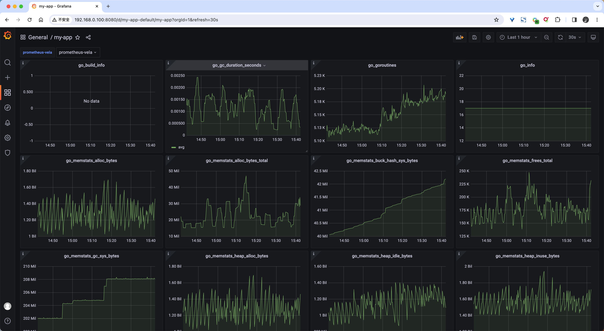

**通过 URL 导入监控大盘**

有时，你可能已经把编写好的 Grafana 监控大盘存储在了 OSS 或者其他 HTTP 服务器上。在 KubeVela 的应用中，你同样也可以使用 `import-grafana-dashboard` 工作流步骤来将大盘导入，如下所示：

```yaml
apiVersion: core.oam.dev/v1beta1
kind: Application
metadata:
  name: my-url-dashboard
spec:
  components: []
  workflow:
    steps:
      - type: import-grafana-dashboard
        name: import-grafana-dashboard
        properties:
          uid: my-url-dashboard
          title: My Dashboard
          url: https://kubevelacharts.oss-accelerate.aliyuncs.com/dashboards/up-cluster-dashboard.json
```

在 `import-grafana-dashboard` 步骤中, 应用首先将会从 URL 上下载监控大盘的数据，然后将它创建到 Grafana 上。同样应用上面的资源对象后，我们就可以在 Grafana 中看到我们刚刚部署的监控大盘了。

除此之外我们还可以使用 CUE 语言来动态生成监控大盘，但是这要求我们具有一定的 CUE 语言开发经验，尤其是 KubeVela 的工作流自定义步骤的开发经验，此外，Grafana 监控大盘基础数据结构的相关知识也是必要的。后面我们会去介绍下 CUE 语言的基本使用。

## 应用工作流

工作流作为一个应用部署计划的一部分，可以帮助你自定义应用部署计划中的步骤，粘合额外的交付流程，指定任意的交付环境。简而言之，工作流提供了定制化的控制逻辑，在原有 Kubernetes 模式交付资源（Apply）的基础上，提供了面向过程的灵活性。比如说，使用工作流实现**条件判断、暂停、状态等待、数据流传递、多环境灰度、A/B 测试等**复杂操作。

工作流由多个步骤组成，典型的工作流步骤包括步骤组（包含一系列子步骤）、人工审核、多集群发布、通知等。你可以在[内置工作流](https://kubevela.io/zh/docs/end-user/workflow/built-in-workflow-defs/)步骤中查看 KubeVela 默认提供的所有内置工作流步骤。如果内置的工作流步骤无法满足你的需求，你也可以[自定义工作流步骤](https://kubevela.io/zh/docs/platform-engineers/workflow/workflow/)。

实际上，如果你在应用部署计划中只使用了组件，并没有声明工作流时，KubeVela 会在运行这个应用时自动创建一个默认的工作流，用于部署应用中的组件。

在 VelaUX 中，你可以更加直观地感受工作流，在应用详情页中，你可以看到工作流的执行状态，如下图所示：

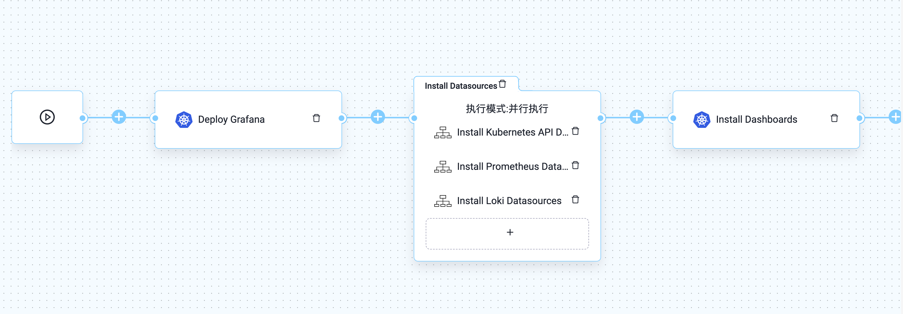

也可以通过 VelaUX 页面手动添加工作流步骤：

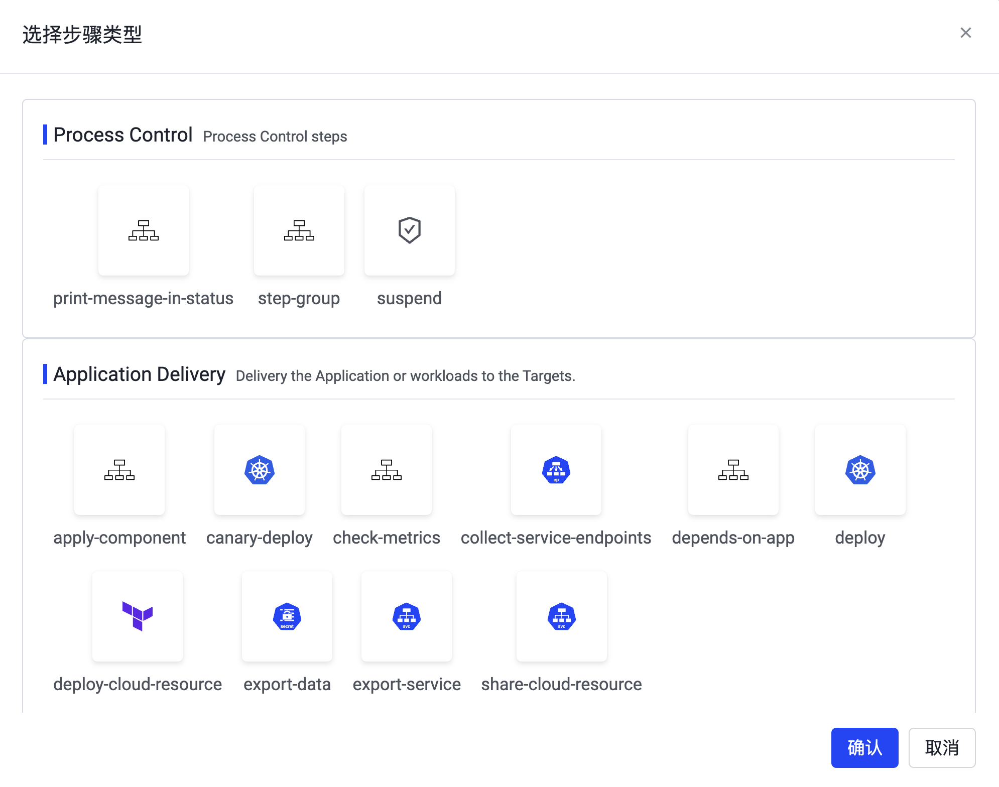


### 执行顺序

在工作流中，所有的步骤将顺序执行，下一个步骤将在上一个步骤成功后执行。如果一个步骤的类型为步骤组，那么它可以包含一系列子步骤，在执行这个步骤组时，所有子步骤都会一起执行。

在 KubeVela v1.5+ 中，你可以显示地指定步骤的执行方式来控制并发或者单步执行，如：

```yaml
workflow:
  mode:
    steps: StepByStep
    subSteps: DAG
```

执行方式有两种：`StepByStep` 顺序执行以及 `DAG` 并行执行。

`steps` 中可以指定步骤的执行方式，`subSteps` 指定步骤组中子步骤的执行方式。如果你不显示声明执行模式，默认 `steps` 以 `StepByStep` 顺序执行，`subSteps` 以 `DAG` 并行执行。


### 工作流与应用的状态对应
| 应用 | 工作流 | 说明 |
| --- | --- | --- |
| runningWorkflow | executing | 当工作流正在执行时，应用的状态为 runningWorkflow |
| workflowSuspending | suspending | 当工作流暂停时，应用的状态为 workflowSuspending |
| workflowTerminated | terminated | 当工作流被终止时，应用的状态为 workflowTerminated |
| workflowFailed | failed | 当工作流执行完成，且有步骤失败时，应用的状态为 workflowFailed |
| running | succeeded | 当工作流中所有步骤都成功执行后，应用的状态为 running |


### 工作流核心功能

工作流拥有丰富的流程控制能力，包括：

- **操作工作流**：在 CLI 命令行中操作工作流
- **暂停和继续工作流**：在工作流中使用暂停步骤完成人工审核，自动继续等功能
- **子步骤**：在工作流中使用子步骤完成一组步骤的执行
- **依赖关系**：指定工作流步骤间的依赖关系
- **数据传递**：通过 `inputs`、`outputs` 来进行步骤间的数据传递
- **使用条件判断**：使用条件判断来控制工作流步骤的执行
- **步骤的超时**：指定工作流步骤的超时时间
- **调试工作流**：在真实运行环境中排查工作流的问题


#### 操作工作流

本节将介绍如何使用 vela CLI 来进行操作工作流。

**暂停工作流**

如果你有一个正在执行中的工作流，那么，你可以用 `suspend` 命令来暂停这个工作流。

```bash
vela workflow suspend <name>
```

如果工作流已经执行完毕，对应用使用 `vela workflow suspend` 命令不会产生任何效果。

如果你希望经过了一段时间后，工作流能够自动被继续。那么，你可以在 `suspend` 步骤中加上 `duration` 参数，当 `duration` 时间超过后，工作流将自动继续执行。

```yaml
workflow:
  steps:
    - name: apply1
      type: apply-component
      properties:
        component: comp1
    - name: suspend
      type: suspend
      properties:
        duration: 5s
    - name: apply2
      type: apply-component
      properties:
        component: comp2
```

**继续工作流**

当工作流进入暂停状态后，你可以使用 `vela workflow resume` 命令来手动继续工作流。`workflow resume` 命令会把工作流从暂停状态恢复到执行状态。

```bash
vela workflow resume <name>
```

**终止工作流**

当工作流正在执行时，如果你想终止它，你可以使用 `vela workflow terminate` 命令来终止工作流。

```bash
vela workflow terminate <name>
```

区别于暂停，终止的工作流不能继续执行，只能重新运行工作流。重新运行意味着工作流会重新开始执行所有工作流步骤，而继续工作流则是从暂停的步骤后面继续执行。

> 需要注意是一旦应用被终止，KubeVela 控制器不会再对资源做状态维持，你可以对底层资源做手动修改但请注意防止配置漂移。


**重新运行工作流**

如果你希望重新运行工作流，那么你可以使用 `vale workflow restart` 命令来重新运行工作流。

```bash
vela workflow restart my-app
```

**查看工作流日志**

如果你想查看工作流的日志，你可以使用 `vela workflow logs` 命令来查看工作流的日志。

需要注意的是只有配置了 [op.#Log](https://kubevela.io/zh/docs/platform-engineers/workflow/cue-actions/#log) 的步骤才会有日志输出。

```bash
vela workflow logs <name>
```

**调试工作流**

如果你想在环境中调试工作流，你可以使用 `vela workflow debug` 命令来调试工作流。

```bash
vela workflow debug <name>
```


#### 子步骤

KubeVela 工作流中有一个特殊的步骤类型 `step-group`，在使用步骤组类型的步骤时，你可以在其中声明子步骤。

> 在 v1.4 及以前版本中，步骤组中的子步骤们是并发执行的。在 1.5+ 版本中，可以显示指定工作流步骤及子步骤的执行方式。


部署如下例子：

```yaml
apiVersion: core.oam.dev/v1beta1
kind: Application
metadata:
  name: sub-success
spec:
  components:
    - name: express-server1
      type: webservice
      properties:
        image: crccheck/hello-world
    - name: express-server2
      type: webservice
      properties:
        image: crccheck/hello-world
    - name: express-server3
      type: webservice
      properties:
        image: crccheck/hello-world

  workflow:
    steps:
      - name: step1
        type: apply-component
        properties:
          component: express-server1
      - name: step2
        type: step-group
        subSteps:
          - name: step2-sub1
            type: apply-component
            properties:
              component: express-server2
          - name: step2-sub2
            type: apply-component
            properties:
              component: express-server3
```

在默认情况下，步骤顺序执行，因此 step1 部署完成后才会执行 step2。而在步骤组中，默认子步骤将并发执行，因此 step2-sub1 和 step2-sub2 将同时部署。


#### 依赖关系

在 1.4 及以前版本中，工作流中的步骤是顺序执行的，这意味着步骤间有一个隐式的依赖关系，即：下一个步骤依赖上一个步骤的成功执行。此时，在工作流中指定依赖关系的意义可能不大。而在版本 1.5+ 中，你将可以显示指定工作流步骤的执行方式（如：改成 `DAG` 并行执行），此时，你可以通过指定步骤的依赖关系来控制工作流的执行。

在 KubeVela 中，可以在步骤中通过 `dependsOn` 来指定步骤间的依赖关系。比如我希望在部署完组件之后，发送一个消息通知：

```yaml
---
workflow:
  steps:
    - name: comp
      type: apply-component
    - name: notify
      type: notification
      dependsOn:
        - comp
```

在这种情况下，KubeVela 会等待步骤 `comp` 执行完毕后，再执行 `notify` 步骤发送消息通知。部署如下 YAML：

```yaml
apiVersion: core.oam.dev/v1beta1
kind: Application
metadata:
  name: dependsOn-app
  namespace: default
spec:
  components:
    - name: express-server
      type: webservice
      properties:
        image: oamdev/hello-world
        ports:
          - port: 8000
  workflow:
    steps:
      - name: comp
        type: apply-component
        properties:
          component: express-server
      - name: slack-message
        type: notification
        dependsOn:
          - comp
        properties:
          slack:
            url:
              value: <your slack url>
            message:
              text: depends on comp
```

使用 `vela status` 命令查看应用的状态：

```yaml
$ vela status depends
About:

  Name:         depends
  Namespace:    default
  Created at:   2022-06-24 17:20:50 +0800 CST
  Status:       running

Workflow:

  mode: StepByStep
  finished: true
  Suspend: false
  Terminated: false
  Steps
  - id:e6votsntq3
    name:comp
    type:apply-component
    phase:succeeded
    message:
  - id:esvzxehgwc
    name:slack-message
    type:notification
    phase:succeeded
    message:

Services:

  - Name: express-server
    Cluster: local  Namespace: default
    Type: webservice
    Healthy Ready:1/1
    No trait applied
```

可以看到，所有的步骤状态均为成功。并且，当组件被成功部署后，slack 中也收到了一条消息通知。


#### 数据传递

本节将介绍如何在 KubeVela 中使用 `Inputs` 和 `Outputs` 在工作流步骤间进行数据传递。

**Outputs**

`outputs` 由 `name` 和 `valueFrom` 组成。`name` 声明了这个 `output` 的名称，在 `input` 中将通过 `from` 引用 `output`。

`valueFrom` 有以下几种写法：

- 通过指定 value 来指定值，如：`valueFrom: output.value.status.workflow.message`。注意，`output.value.status.workflow.message` 将使用变量引用的方式从当前步骤的 CUE 模板中取值，如果该步骤的 CUE 模板中没有该字段，那么得到的值为空。
- 使用 CUE 表达式。如，用 `+` 来连接值和字符串: `valueFrom: output.metadata.name + "testString"`。你也可以引入 CUE 的内置包:

```
valueFrom: |
          import "strings"
          strings.Join(["1","2"], ",")
```

**Inputs**

`inputs` 由 `from` 和 `parameterKey` 组成。`from` 声明了这个 `input` 从哪个 `output` 中取值，`parameterKey` 为一个表达式，将会把 `input` 取得的值赋给对应的字段。

如果你想在 `parameterKey` 中使用一个非法的 CUE 变量名（如，含有 `-` 或者以数字开头），你可以用 `[]` 指定，如：

```yaml
inputs:
  - from: output
    parameterKey: data["my-input"]
```

如指定 inputs:

```yaml
---
- name: notify
  type: notification
  inputs:
    - from: read-status
      parameterKey: slack.message.text
```

**如何使用**

假设我们已经在集群中有了一个 `depends` 应用，我们希望在一个新的应用中读取到 `depends` 应用的工作流状态，并且发送状态信息到 Slack 中。部署如下应用：

```yaml
apiVersion: core.oam.dev/v1beta1
kind: Application
metadata:
  name: input-output
  namespace: default
spec:
  components:
    - name: express-server
      type: webservice
      properties:
        image: oamdev/hello-world
        ports:
          - port: 8000
  workflow:
    steps:
      - name: read
        type: read-object
        properties:
          name: depends
        outputs:
          - name: read-status
            valueFrom: output.value.status.workflow.message
      - name: slack-message
        type: notification
        inputs:
          - from: read-status
            parameterKey: slack.message.text
        properties:
          slack:
            url:
              value: <your slack url>
```

读取 `depends` 应用时，我们使用了 `read-object` 这个步骤类型，在这个步骤类型中，读取到的资源会被放在 `output.value` 中，因此，我们可以使用 `output.value.status.workflow.message` 读取到 `depends` 应用的工作流状态信息。

当应用成功运行后，我们可以在 Slack 消息通知中收到 `depends` 应用的工作流状态信息。


#### 条件判断

在 KubeVela 工作流中，每个步骤都可以指定一个 `if`，你可以使用 `if` 来确定是否应该执行该步骤。

**不指定 If**

在步骤没有指定 `If` 的情况下，KubeVela 会根据先前步骤的状态来判断是否应该执行该步骤。默认步骤的执行条件是：**在该步骤前的所有步骤状态均为成功**。

这意味着，如果步骤 A 执行失败，那么步骤 A 之后的步骤 B 会被跳过，不会被执行。比如我们部署如下例子：

```yaml
apiVersion: core.oam.dev/v1beta1
kind: Application
metadata:
  name: err-with-no-if
  namespace: default
spec:
  components:
    - name: express-server
      type: webservice
      properties:
        image: oamdev/hello-world
        ports:
          - port: 8000
  workflow:
    steps:
      - name: apply-err
        type: apply-object
        properties:
          value:
            test: err
      - name: apply-comp
        type: apply-component
        properties:
          component: express-server
```

使用 `vela status` 命令查看应用状态：

```bash
$ vela status err-with-no-if
About:

  Name:         err-with-no-if
  Namespace:    default
  Created at:   2022-06-24 18:14:46 +0800 CST
  Status:       workflowTerminated

Workflow:

  mode: StepByStep
  finished: true
  Suspend: false
  Terminated: true
  Steps
  - id:bztlmifsjl
    name:apply-err
    type:apply-object
    phase:failed
    message:step apply: run step(provider=kube,do=apply): Object 'Kind' is missing in '{"test":"err"}'
  - id:el8quwh8jh
    name:apply-comp
    type:apply-component
    phase:skipped
    message:

Services:
```

可以看到，步骤 `apply-err` 会因为尝试部署一个非法的资源而导致失败，同时，因为之前的步骤失败了，步骤 `apply-comp` 将被跳过。

**If Always**

如果你希望一个步骤无论如何都应该被执行，那么，你可以为这个步骤指定 `if` 为 `always`。比如我们部署如下例子：

```yaml
apiVersion: core.oam.dev/v1beta1
kind: Application
metadata:
  name: err-with-always
  namespace: default
spec:
  components:
    - name: invalid
      type: webservice
      properties:
        image: invalid
        ports:
          - port: 8000
  workflow:
    steps:
      - name: comp
        type: apply-component
        timeout: 5s
        outputs:
          - name: status
            valueFrom: output.status.conditions[0].type + output.status.conditions[0].status
        properties:
          component: invalid
      - name: notification
        type: notification
        inputs:
          - from: status
            parameterKey: slack.message.text
        if: always
        properties:
          slack:
            url:
              value: <your slack url>
```

使用 `vela status` 命令查看应用状态：

```bash
$ vela status err-with-always
About:

  Name:         err-with-always
  Namespace:    default
  Created at:   2022-06-27 17:30:29 +0800 CST
  Status:       workflowTerminated

Workflow:

  mode: StepByStep
  finished: true
  Suspend: false
  Terminated: true
  Steps
  - id:loeqr6dlcn
    name:comp
    type:apply-component
    phase:failed
    message:
  - id:hul9tayu82
    name:notification
    type:notification
    phase:succeeded
    message:

Services:

  - Name: invalid
    Cluster: local  Namespace: default
    Type: webservice
    Unhealthy Ready:0/1
    No trait applied
```

可以看到，步骤 `comp` 会去尝试部署一个镜像为 invalid 的组件，而组件因为拉取不到镜像，所以会在五秒后因为超时而失败，同时，这个步骤将组件的 status 作为 `outputs` 传出。而步骤 `notification` 因为指定了 `if: always`，所以一定会被执行，同时，消息通知的内容为上一个步骤中组件的状态，因此，我们可以在 slack 中看到携带状态信息的消息通知。

**自定义 If 条件判断**

> 注意：需要升级到 1.5 及以上版本来使用自定义 `If` 条件判断。


你也可以编写自己的判断逻辑来确定是否应该执行该步骤。注意： `if` 里的值将作为 `CUE` 代码执行。KubeVela 在 `if` 中提供了一些内置变量，它们是：

- `status：status` 中包含了所有工作流步骤的状态信息。你可以使用 `status.<step-name>.phase == "succeeded"` 来判断步骤的状态，也可以使用简化方式 `status.<step-name>.succeeded` 来进行判断。
- `inputs：inputs` 中包含了该步骤的所有 `inputs` 参数。你可以使用 `inputs.<input-name> == "value"` 来获取判断步骤的输入。

如果你的步骤名或者 `inputs` 名并不是一个有效的 `CUE` 变量名（如：包含 `-`，或者以数字开头等），你可以用如下方式引用：`status["invalid-name"].failed`

比如我们来部署如下例子：

```yaml
apiVersion: core.oam.dev/v1beta1
kind: Application
metadata:
  name: custom-if
  namespace: default
spec:
  components:
    - name: comp-custom-if
      type: webservice
      properties:
        image: crccheck/hello-world
        port: 8000
      traits:
  workflow:
    steps:
      - name: apply
        type: apply-component
        properties:
          component: comp-custom-if
        outputs:
          - name: comp-output
            valueFrom: context.name
      - name: notification
        type: notification
        inputs:
          - from: comp-output
            parameterKey: slack.message.text
        if: inputs["comp-output"] == "custom-if"
        properties:
          slack:
            url:
              value: <your slack url>
      - name: notification-skip
        type: notification
        if: status.notification.failed
        properties:
          slack:
            url:
              value: <your slack url>
            message:
              text: this notification should be skipped
      - name: notification-succeeded
        type: notification
        if: status.notification.succeeded
        properties:
          slack:
            url:
              value: <your slack url>
            message:
              text: the notification is succeeded
```

使用 `vela status` 命令查看应用状态：

```bash
$ vela status custom-if
About:

  Name:         custom-if
  Namespace:    default
  Created at:   2022-06-25 00:37:14 +0800 CST
  Status:       running

Workflow:

  mode: StepByStep
  finished: true
  Suspend: false
  Terminated: false
  Steps
  - id:un1zd8qc6h
    name:apply
    type:apply-component
    phase:succeeded
    message:
  - id:n5xbtgsi68
    name:notification
    type:notification
    phase:succeeded
    message:
  - id:2ufd3v6n78
    name:notification-skip
    type:notification
    phase:skipped
    message:
  - id:h644x6o8mb
    name:notification-succeeded
    type:notification
    phase:succeeded
    message:

Services:

  - Name: comp-custom-if
    Cluster: local  Namespace: default
    Type: webservice
    Healthy Ready:1/1
    No trait applied
```

可以看到，第一个步骤 `apply` 成功后，会输出一个 `outputs`。第二个步骤 `notification` 中引用第一个步骤的 `outputs` 作为 `inputs` 并且进行判断，满足条件后成功发送通知。第三个步骤 `notification-skip` 判断第二个步骤是否为失败状态，条件不满足，这个步骤跳过。第四个步骤 `notification-succeeded` 判断第二个步骤是否成功，条件满足，该步骤成功执行。


#### 步骤超时

你需要升级到 1.5 及以上版本来使用超时功能。

在 KubeVela 工作流中，每个步骤都可以指定一个 `timeout`，你可以使用 `timeout` 来指定该步骤的超时时间。

`timeout` 遵循 `duration` 格式，例如 30s、1m 等，可以参考 Golang 的 [parseDuration](https://pkg.go.dev/time#ParseDuration)。

如果一个步骤在指定的时间内没有完成，KubeVela 会将该步骤的状态置为 `failed`，步骤的 `Reason` 会设置为 `timeout`。

比如我们部署如下例子：

```yaml
apiVersion: core.oam.dev/v1beta1
kind: Application
metadata:
  name: timeout-example
  namespace: default
spec:
  components:
    - name: comp1
      type: webservice
      properties:
        image: crccheck/hello-world
        port: 8000
    - name: comp2
      type: webservice
      properties:
        image: crccheck/hello-world
        port: 8000
  workflow:
    steps:
      - name: apply-comp1
        type: apply-component
        properties:
          component: comp1
      - name: suspend
        type: suspend
        timeout: 5s
      - name: apply-comp2
        type: apply-component
        properties:
          component: comp2
```

使用 `vela status` 命令查看应用状态：

```bash
$ vela status timeout-example
About:

  Name:         timeout-example
  Namespace:    default
  Created at:   2022-06-25 00:51:43 +0800 CST
  Status:       workflowTerminated

Workflow:

  mode: StepByStep
  finished: true
  Suspend: false
  Terminated: true
  Steps
  - id:1f58n13qdp
    name:apply-comp1
    type:apply-component
    phase:succeeded
    message:
  - id:1pfije4ugt
    name:suspend
    type:suspend
    phase:failed
    message:
  - id:lqxyenjxj4
    name:apply-comp2
    type:apply-component
    phase:skipped
    message:

Services:

  - Name: comp1
    Cluster: local  Namespace: default
    Type: webservice
    Healthy Ready:1/1
    No trait applied
```

可以看到，当第一个组件被成功部署后，工作流会暂停在第二个 `suspend` 步骤上。该 `suspend` 步骤被设置了一个五秒的超时时间，如果在五秒内没有继续该工作流的话，该步骤会因为超时而失败。而第三个步骤因为前面的 `suspend` 步骤失败了，从而被跳过了执行。


#### 调试工作流

调试工作流依赖真实的运行环境，并且会实际执行，请确保你在测试环境中执行调试。

当在测试环境中部署应用，并发现应用出现问题时，你可能会想要在环境中调试应用。KubeVela 提供了 `vela debug` 命令，来帮助你在环境中调试应用。

**使用工作流的应用**

如果你的应用使用了工作流，那么在使用 `vela debug` 命令前，请确保你的应用中使用了 `debug` 策略：

```yaml
polices:
  - name: debug
    type: debug
```

你也可以使用 `vela up -f <application yaml> --debug` 来为你的应用自动加上 `debug` 策略。

对于使用了工作流的应用，`vela debug` 会首先列出工作流中的所有步骤，你可以选择指定的步骤进行调试。选择完步骤后，你可以分别查看该步骤中的所有 CUE 变量内容。其中：黄色标明的 `do` 和 `provider` 是本次使用的 CUE action，错误的内容将以红色标志。


你也可以使用 `vela debug <application-name> -s <step-name> -f <variable>` 来查看单个步骤中的指定变量的内容。


**仅使用组件的应用**

如果你的应用只使用了组件，没有使用工作流。那么，你可以直接使用 `vela debug <application-name>` 命令来进行调试你的应用。

部署如下应用，该应用的第一个组件会使用 `k8s-objects` 创建一个 Namespace，第二个组件则会使用 `webservice` 组件以及 `gateway` 运维特征，从而创建一个 Deployment 及其对应的 Service 和 Ingress。

```yaml
apiVersion: core.oam.dev/v1beta1
kind: Application
metadata:
  name: gateway-app
spec:
  components:
    - name: comp-namespace
      type: k8s-objects
      properties:
        objects:
          - apiVersion: v1
            kind: Namespace
            metadata:
              name: test-ns1
    - name: express-server
      type: webservice
      properties:
        image: oamdev/hello-world
        ports:
          - port: 8000
      traits:
        - type: gateway
          properties:
            domain: testsvc.example.com
            http:
              "/": 8000
```

部署完应用后，你可以使用 `vela debug <application-name>` 命令分组件来查看该应用渲染出来的所有资源。

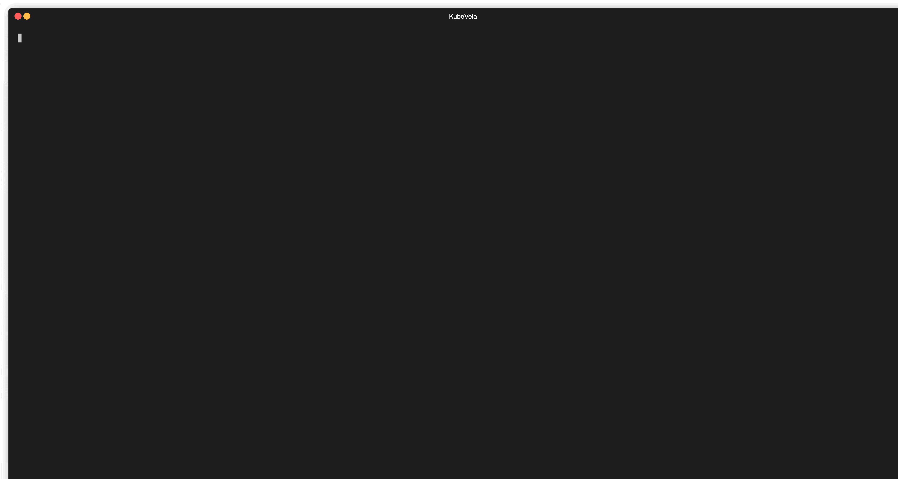

你也可以使用 `vela debug <application-name> -s <component-name>` 来查看单个组件中被渲染出来的所有资源。


## 工作流引擎

除了上面提到的应用工作流，KubeVela 还提供了一个独立运行的流水线功能，用于管理多个 KubeVela 应用，跨多个环境创建 - `KubeVela Workflow`。`KubeVela Workflow` 是一个开源云原生工作流项目，可用于编排 CI/CD 流程、terraform 资源、多 kubernetes 集群管理甚至你自己的功能调用。

得益于云原生蓬勃的生态发展，社区中已经有许多成熟的工作流项目，如 Tekton，Argo 等。在阿里云内部，也有一些编排引擎的沉淀。那么为什么要“新造一个轮子”，而不使用已有的技术呢？

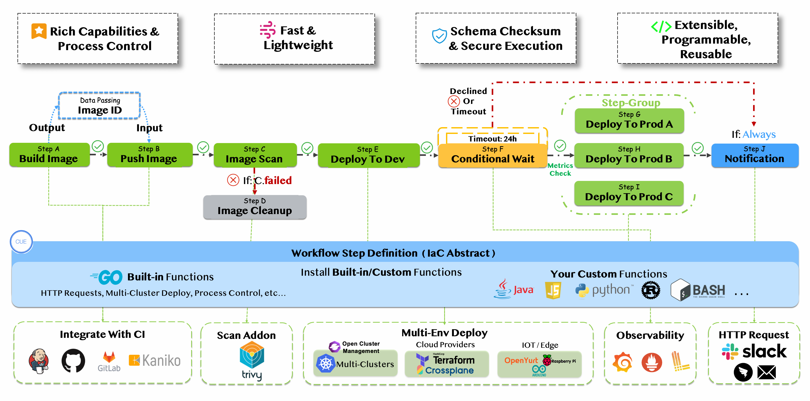

因为 KubeVela Workflow 在设计上有一个非常根本的区别：**工作流中的步骤面向云原生 IaC 体系设计，支持抽象封装和复用，相当于你可以直接在步骤中调用自定义函数级别的原子能力，而不仅仅是下发容器**。

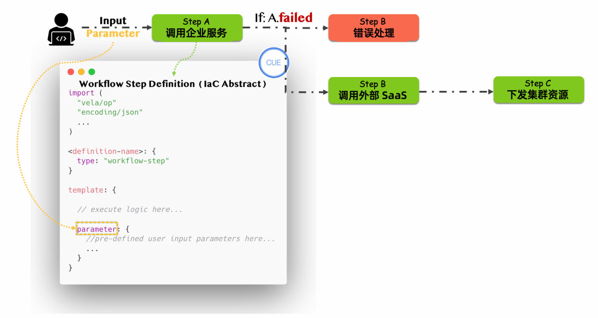

在 KubeVela Workflow 中，每个步骤都有一个步骤类型，而每一种步骤类型，都会对应 `WorkflowStepDefinition`（工作流步骤定义）这个资源。你可以使用 `CUE` 语言（一种 IaC 语言，是 JSON 的超集）来编写这个步骤定义，或者直接使用社区中已经定义好的步骤类型。

你可以简单地将步骤类型定义理解为一个函数声明，每定义一个新的步骤类型，就是在定义一个新的功能函数。函数需要一些输入参数，步骤定义也是一样的。在步骤定义中，你可以通过 `parameter` 字段声明这个步骤定义需要的输入参数和类型。当工作流开始运行时，工作流控制器会使用用户传入的实际参数值，执行对应步骤定义中的 CUE 代码，就如同执行你的功能函数一样。

独立运行的流水线功能相较于 KubeVela 本身具备的应用级工作流，具有以下特性：

- 它可以管理多个 KubeVela 应用，跨多个环境创建。
- 它不绑定应用，可以独立使用，如针对一组资源做扩缩容，针对一个应用做面向流程的灰度发布，批量执行一组运维操作。
- 它是一次性的，不对资源做管理，即使删除流水线也不会删除创建出来的资源。
- 它与应用流水线的执行引擎是同源的，这也完全继承了 KubeVela 轻量级工作流的特性，相较于传统的基于容器的 CI 流水线，KubeVela 的流水线在执行各类资源操作时不依赖容器、无需额外的计算资源。

为了更好地复用已有的能力及保证技术一致性，我们将原本应用工作流中的工作流引擎部分进行了拆分。应用内工作流和应用间流水线都使用了这个**工作流引擎**作为底层的技术实现。应用工作流体现为应用中的 `Workflow` 字段，而流水线则体现为 `WorkflowRun` 资源。

这意味着绝大部分工作流步骤在二者间都是通用的，如：暂停、通知、发送 HTTP 请求、读取配置等。

但 `WorkflowRun` 资源对象中只有步骤的配置，没有组件、运维特征、策略的配置。因此，与组件等相关的步骤只能在应用内工作流中使用，如：部署/更新组件、运维特征等。


### 安装

安装工作流引擎，我们可以使用下面的 Helm 方式来进行一键安装：

```bash
helm repo add kubevela https://kubevela.github.io/charts
helm repo update
helm install --create-namespace -n vela-system vela-workflow kubevela/vela-workflow
```

如果已经安装了 KubeVela，则可以使用 KubeVela Addon 安装 Workflow：

```bash
vela addon enable vela-workflow
```

KubeVela 工作流引擎提供一个 `WorkflowRun` 的资源对象，我们可以选择在 `WorkflowRun` 里执行一个外部的 `Workflow` 模板或者执行直接在里面配置要执行的步骤（如果你同时声明了二者，`WorkflowRun` 里的步骤配置会覆盖模板中的内容）。一个 `WorkflowRun` 的组成如下：

```yaml
apiVersion: core.oam.dev/v1alpha1
kind: WorkflowRun
metadata:
  name: <名称>
  namespace: <命名空间>
spec:
  mode: <可选项，WorkflowRun 的执行模式，默认步骤的执行模式是 StepByStep，子步骤为 DAG>
    steps: <DAG 或者 StepByStep>
    subSteps: <DAG 或者 StepByStep>
  context:
    <可选项，自定义上下文参数>
  workflowRef: <可选项，用于运行的外部 Workflow 模板>
  workflowSpec: <可选项，用于运行的配置>
    steps:
    - name: <名称>
      type: <类型>
      dependsOn:
        <可选项，该步骤需要依赖的步骤名称数组>
      meta: <可选项，该步骤的额外信息>
        alias: <可选项，该步骤的别名>
      properties:
        <步骤参数值>
      if: <可选项，用于判断该步骤是否要被执行>
      timeout: <可选项，该步骤的超时时间>
      outputs: <可选项，该步骤的输出>
        - name: <输出名>
          valueFrom: <输出来源>
      inputs: <可选项，该步骤的输入>
        - name: <输入来源名>
          parameterKey: <可选项，该输入要被设置为步骤的某个参数名>
      subSteps:
        <可选项，如果步骤类型为 step-group，可在这里声明子步骤>
```

基本使用和应用工作流中的使用方式基本一致，只是这里是一个单独的资源对象，而不是应用中的一个字段。


### 使用案例

如果你只希望使用定义好的步骤，那么，就如同调用一个封装好的第三方功能函数一样，你只需要关心你的输入参数，并且使用对应的步骤类型就可以了。比如一个典型的场景就是**构建镜像**，如下所示：

```yaml
apiVersion: core.oam.dev/v1alpha1
kind: WorkflowRun
metadata:
  name: build-push-image
  namespace: default
spec:
  workflowSpec:
    steps:
      - name: build-push
        type: build-push-image
        properties:
          # 使用你的 kaniko 执行器镜像，如下所示，如果没有设置，它将使用默认镜像 oamdev/kaniko-executor:v1.9.1
          # kanikoExecutor: gcr.io/kaniko-project/executor:latest
          # 可以将 context 与 git 和 branch 一起使用，也可以直接指定上下文，请参考 https://github.com/GoogleContainerTools/kaniko#kaniko-build-contexts
          context:
            git: github.com/cnych/KubeVela-GitOps-App-Demo
            branch: main
          image: cnych/kubevela-workflow-demo:v1
          # 指定你的dockerfile，如果没有设置，将使用默认的dockerfile ./Dockerfile
          # dockerfile: ./Dockerfile
          credentials:
            image:
              name: image-secret
          # buildArgs:
          #   - key="value"
          # platform: linux/arm
```

在这样一种架构下，步骤的抽象给步骤本身带来了无限可能性。当你需要在流程中新增一个节点时，你不再需要将业务代码进行**编译-构建-打包**后用 Pod 来执行逻辑，只需要修改步骤定义中的配置代码，再加上工作流引擎本身的编排控制能力，就能够完成新功能的对接。

首先，指定步骤类型为 `build-push-image`，然后可以指定一些属性来配置你的镜像构建：

- `kanikoExecutor`：用来指定 `kaniko` 执行器镜像，如果没有设置，它将使用默认镜像 `oamdev/kaniko-executor:v1.9.1`。
- `context`：用来指定构建镜像的上下文，可以将 `context` 与 `git` 和 `branch` 一起使用，也可以直接指定上下文，请参考 [https://github.com/GoogleContainerTools/kaniko#kaniko-build-contexts](https://github.com/GoogleContainerTools/kaniko#kaniko-build-contexts)。
- `image`：用来指定构建后的镜像名称。
- `dockerfile`：用来指定构建镜像的 Dockerfile，如果没有设置，将使用默认的 Dockerfile 为 `./Dockerfile`。
- `credentials.image.name`：用来指定构建镜像时需要使用的秘钥信息。
- `buildArgs`：用来指定构建镜像时需要使用的构建参数。
- `platform`：用来指定构建镜像时使用的平台。

上面我们定义的工作流就是将 Github 代码仓库中的代码构建成镜像，并且推送到镜像仓库中。其中还涉及到指定镜像仓库的秘钥信息，我们可以在工作流中添加一个 `export2secret` 的步骤来创建镜像仓库的秘钥信息，如下所示：

```yaml
# 或者使用 kubectl create secret docker-registry docker-regcred \
# --docker-server=https://index.docker.io/v1/ \
# --docker-username=<your-username> \
# --docker-password=<your-password>
- name: create-image-secret
  type: export2secret
  properties:
    secretName: image-secret # 和 build-push-image 步骤中的 credentials.image.name 对应
    kind: docker-registry
    dockerRegistry:
      username: <docker username>
      password: <docker password>
```

同样如果你的 Git 仓库是私有的代码仓库我们也可以用 `export2secret` 步骤来创建 Git 仓库的秘钥信息，如下所示：

```yaml
# 或者使用 kubectl create secret generic git-token --from-literal='GIT_TOKEN=<your-token>'
- name: create-git-secret
  type: export2secret
  properties:
    secretName: git-secret # 和 build-push-image 步骤中的 credentials.git.name 对应
    data:
      token: <git token>
```

最后当镜像构建推送完成后，我们可以将这个应用部署到 Kubernetes 集群中，那么我们可以添加一个 `apply-app` 的步骤，

```yaml
- name: apply-app
  type: apply-app
  inputs:
    - from: context.image
      parameterKey: data.spec.components[0].properties.image
  properties:
    data:
      apiVersion: core.oam.dev/v1beta1
      kind: Application
      metadata:
        name: my-workflow-app
      spec:
        components:
          - name: my-web
            type: webservice
            properties:
              # 这里的属性会被 inputs 的 image 替换
              image: cnych/kubevela-workflow-demo:v1
              imagePullSecrets:
                - image-secret
              ports:
                - port: 8088
                  expose: true
```

最后我们完整的工作流如下所示：

```yaml
# workflow-run.yaml
apiVersion: core.oam.dev/v1alpha1
kind: WorkflowRun
metadata:
  name: build-push-image
  namespace: default
spec:
  context:
    image: cnych/kubevela-workflow-demo:v1
  workflowSpec:
    steps:
      - name: create-secret
        type: step-group
        subSteps:
        - name: create-git-secret
          type: export2secret
          properties:
            secretName: git-secret
            data:
              token: <git token>
        - name: create-image-secret
          type: export2secret
          properties:
            secretName: image-secret
            kind: docker-registry
            dockerRegistry:
              username: <username>
              password: <password>
      - name: build-push
        type: build-push-image
        inputs:
          - from: context.image
            parameterKey: image
        properties:
          context:
            git: github.com/cnych/KubeVela-GitOps-App-Demo
            branch: main
          # 这里的属性会被 inputs 的 image 替换
          image: my-registry/test-image:v1
          # dockerfile: ./Dockerfile
          credentials:
            image:
              name: image-secret
            # git:
            #   name: git-secret
            #   key: token
      - name: apply-app
        type: apply-app
        inputs:
          - from: context.image
            parameterKey: data.spec.components[0].properties.image
        properties:
          data:
            apiVersion: core.oam.dev/v1beta1
            kind: Application
            metadata:
              name: my-app
            spec:
              components:
                - name: my-web
                  type: webservice
                  properties:
                    # 这里的属性会被 inputs 的 image 替换
                    image: my-registry/test-image:v1
                    imagePullSecrets:
                      - image-secret
                    ports:
                      - port: 8088
                        expose: true
                    env: # 指定环境变量
                      - name: DB_HOST
                        value: mysql-cluster-mysql.default.svc.cluster.local:3306
                      - name: DB_PASSWORD
                        valueFrom:
                          secretKeyRef:
                            name: mysql-secret
                            key: ROOT_PASSWORD
```

直接应用上面的资源对象即可：

```bash
$ kubectl apply -f workflow-run.yaml
$ kubectl get workflowrun
NAME               PHASE       AGE
build-push-image   executing   9s
$ kubectl get pods
NAME                                     READY   STATUS    RESTARTS         AGE
build-push-image-gnuutw4ugn-kaniko       1/1     Running   0                3s
```

镜像构建的底层是一个 Kaniko 容器，可以看到上面生成了一个 Pod 来构建镜像。镜像构建可能需要一些时间，我们可以使用 `vela workflow logs build-push-image --step build-push` 命令来查看构建日志。

```bash
$ vela workflow logs build-push-image --step build-push
+ build-push-image-ys44pm2ihm-kaniko › kaniko
kaniko 2023-10-24T15:55:14.212862875+08:00 Enumerating objects: 29, done.
Counting objects: 100% (29/29), done.08:00 Counting objects:   3% (1/29)
Compressing objects: 100% (25/25), done.00 Compressing objects:   4% (1/25)
kaniko 2023-10-24T15:55:14.214166765+08:00 Total 29 (delta 13), reused 13 (delta 4), pack-reused 0
# ...... 省略部分日志
kaniko 2023-10-24T15:56:00.194219886+08:00 INFO[0047] EXPOSE 8088
kaniko 2023-10-24T15:56:00.194221514+08:00 INFO[0047] Cmd: EXPOSE
kaniko 2023-10-24T15:56:00.194222688+08:00 INFO[0047] Adding exposed port: 8088/tcp
kaniko 2023-10-24T15:56:00.194535211+08:00 INFO[0047] Pushing image to cnych/kubevela-workflow-demo:v1
kaniko 2023-10-24T15:56:11.479356879+08:00 INFO[0058] Pushed index.docker.io/cnych/kubevela-workflow-demo@sha256:dee83e447e409f9d5b78d7052310bdd36142e879a88cfcb0c5e1236adcc78571
```

也可以直接使用命令 `vela workflow logs build-push-image` 然后选择要查看的步骤来查看日志：

```bash
$ vela workflow logs build-push-image
? Select a step to show logs:  [Use arrows to move, type to filter]
> ✅ create-secret
    ✅ create-git-secret
    ✅ create-image-secret
  ✅ build-push
  ✅ apply-app
```

如果想要去调试具体的步骤，我们需要在 `WorkflowRun` 对象中添加一个 annotations：`workflowrun.oam.dev/debug: true`，然后重新执行工作流过后，可以通过 `vela workflow debug <workflow name>` 来调试工作流步骤。
```bash
vela workflow debug build-push-image
? Select the workflow step to debug:  [Use arrows to move, type to filter]
> ✅ create-secret
    ✅ create-git-secret
    ✅ create-image-secret
  ✅ build-push
  ✅ apply-app
```
上面我们的镜像标签是固定的，一般我们会选择使用 git commit id 来动态生成，目前的步骤中不支持直接从 git 获取这些数据，所以我们可以添加一个 `request` 步骤来获取 git commit id，生成的镜像 tag 格式为 `"${branch}-${commit-sha.substring(0,8)}-${unixTime}"`，如下所示：

```yaml
- name: get-image-build-id
  type: request
  properties:
    url: https://api.github.com/repos/cnych/KubeVela-GitOps-App-Demo/commits/main
    method: GET
    headers:
      Accept: application/vnd.github.v3+json
    outputs:
      - name: image-build-id
        valueFrom: <todo>
```

这里定制镜像 tag 的方式需要用到 CUE 语言来实现，我们可以使用 `valueFrom` 来指定 CUE 语言的表达式，下节我们详细了解 CUE 语言的基本使用过后再来看这个问题吧。


## CUE 语言基础

[CUE](https://cuelang.org) 是一门开源语言，有丰富的 API 和 工具链。可以用于定义、生成以及校验各种各样的数据：配置、API、数据库结构、代码等等，应有尽有。


### 概述

CUE 是一个开源的数据验证语言和推理引擎，其根源在于逻辑编程。尽管这种语言不是一种通用编程语言，但它有许多应用，如数据验证、数据模板化、配置、查询、代码生成甚至脚本。推理引擎可用于在代码中验证数据，或将其作为代码生成流程的一部分包含在内。

CUE 与同类语言的一个关键区别在于它将类型和值合并为一个概念。尽管在大多数语言中类型和值严格区分，但 CUE 将它们按照一种层次结构（确切地说是格）进行排序。这是一个非常强大的概念，使 CUE 能够实现许多高级功能。它还简化了问题，例如，不需要泛型和枚举，求和类型和空值合并都是同一件事。

CUE 的设计确保以任意顺序组合 CUE 的值始终产生相同的结果，这使得 CUE 特别适合组合不同来源的 CUE 约束的情况：

- **数据验证**：不同部门或组织可以分别定义自己的约束，应用于相同的数据集。
- **代码提取和生成**：从多个来源（Go 代码、Protobuf）中提取 CUE 定义，将它们合并为单个定义，然后使用该定义生成另一种格式（例如 OpenAPI）的定义。
- **配置**：可以从不同的来源组合值，而不需要导入另一个。

值的排序还允许对整个配置进行集合包含分析。大多数验证系统只能检查具体值是否与模式匹配，而 CUE 可以验证一个模式的任何实例是否也是另一个模式的实例，或者计算一个新的模式，表示与另外两个模式匹配的所有实例。

KubeVela 中是基于 CUE 语言来实现抽象和扩展的，KubeVela 将 CUE 作为应用交付核心依赖和扩展方式的原因如下：

- **CUE 本身就是为大规模配置而设计:** CUE 能够感知非常复杂的配置文件，并且能够安全地更改可修改配置中成千上万个对象的值。这非常符合 KubeVela 的目标，即以可编程的方式，去定义和交付生产级别的应用程序。
- **CUE 支持一流的代码生成和自动化:** CUE 原生支持与现有工具以及工作流进行集成，反观其他工具则需要自定义复杂的方案才能实现。例如，需要手动使用 Go 代码生成 OpenAPI 模式。KubeVela 也是依赖 CUE 该特性进行构建开发工具和 GUI 界面的。
- **CUE 与 Go 完美集成:** KubeVela 像 Kubernetes 系统中的大多数项目一样使用 GO 进行开发。CUE 已经在 Go 中实现并提供了丰富的 API。KubeVela 以 CUE 为核心实现 Kubernetes 控制器。借助 CUE，KubeVela 可以轻松处理数据约束问题。


### 安装 CUE

Go 的 API 在 `cuelang.org/go` 模块中定义，可以使用 Go 的本地依赖管理工具添加为依赖。
cue 二进制文件可以通过以下方法之一进行安装。

安装 CUE 二进制文件最简单的方式是直接从[官方 Release 页面](https://github.com/cue-lang/cue/releases/)下载对应的二进制文件，然后将其放到你的 PATH 环境变量中即可，这种方式适合各种系统（包括 Linux、Windows 和 MacOS）:

```bash
# 比如我们这里是 Mac 系统，则下载下面的文件
$ wget https://github.com/cue-lang/cue/releases/download/v0.6.0/cue_v0.6.0_darwin_amd64.tar.gz
$ tar -xvf cue_v0.6.0_darwin_amd64.tar.gz
$ sudo mv cue /usr/local/bin
$ cue version
cue version v0.6.0

go version go1.20.6
      -buildmode exe
       -compiler gc
       -trimpath true
     CGO_ENABLED 0
          GOARCH amd64
            GOOS darwin
         GOAMD64 v1
```

另外如果你是 Mac 用户，也可以直接使用 `Homebrew` 进行一键安装：

```bash
brew install cue-lang/tap/cue
```

当然我们也可以直接从源码进行安装，这种方式要求 Go 1.16 或更高版本，然后使用 `go install` 命令安装：

```bash
go install cuelang.org/go/cmd/cue@latest
```

能正常使用 `cue` 命令即可。


### 命令行

CUE 是 JSON 的超集，我们可以像使用 JSON 一样使用 CUE，并具备以下特性：

- C 语言风格的注释
- 字段名称可以用双引号括起来，注意字段名称中不可以带特殊字符
- 可选字段末尾是否有逗号
- 允许数组中最后一个元素末尾带逗号
- 外大括号可选

首先创建一个名为 `first.cue` 的文件，内容如下所示：

```
a: 1.5
a: float
b: 1
b: int
d: [1, 2, 3]
g: {
    h: "abc"
}
e: string
```

然后我们以上面这个文件为例来了解下 CUE 命令行的相关指令。

**格式化**

要格式化 CUE 文件，我们可以使用 `cue fmt` 命令，该命令不仅可以格式化 CUE 文件，还能提示错误的模型，相当好用的命令。

```bash
cue fmt first.cue
```

**校验模型**

除了 `cue fmt` 命令外，我们还可以使用 `cue vet` 来校验模型。

```bash
$ cue vet first.cue
some instances are incomplete; use the -c flag to show errors or suppress this message

$ cue vet first.cue -c
e: incomplete value string:
    ./first.cue:9:4
```

上面的提示表示这个文件里的 `e` 这个变量，有数据类型 `string` 但并没有赋值。

**计算/渲染结果**

`cue eval` 命令可以计算 CUE 文件并且渲染出最终结果。

```bash
$ cue eval first.cue
a: 1.5
b: 1
d: [1, 2, 3]
g: {
    h: "abc"
}
e: string
```

我们看到最终结果中并不包含 `a: float` 和 `b: int`，这是因为这两个变量已经被计算填充。其中 `e: string` 没有被明确的赋值, 故保持不变.

此外还可以使用 `-e` 参数来指定渲染的结果，比如我们只想知道 `b` 的渲染结果，可以使用 `-e` 参数来指定。

```bash
$ cue eval -e b first.cue
1
```

**导出渲染结果**

`cue export` 可以导出最终渲染结果，如果一些变量没有被定义执行该命令将会报错。

```bash
$ cue export first.cue
e: incomplete value string
```

我们更新一下 `first.cue` 文件，给 `e` 赋值：

```
a: 1.5
a: float
b: 1
b: int
d: [1, 2, 3]
g: {
  h: "abc"
}
e: string
e: "abc"
```

然后，该命令就可以正常工作。默认情况下, 渲染结果会被格式化为 JSON 格式。

```bash
$ cue export first.cue
{
    "a": 1.5,
    "b": 1,
    "d": [
        1,
        2,
        3
    ],
    "g": {
        "h": "abc"
    },
    "e": "abc"
}
```

要导出 YAML 格式的渲染结果，我们可以使用 `--out yaml` 参数。

```bash
$ cue export first.cue --out yaml
a: 1.5
b: 1
d:
  - 1
  - 2
  - 3
g:
  h: abc
e: abc
```

同样可以使用 `-e` 参数来指定变量的结果。

```bash
$ cue export -e g first.cue
{
    "h": "abc"
}
```

以上就是一些常用的 CUE 命令行指令。


### 数据类型

在熟悉完常用 CUE 命令行指令后，接下来我们来进一步学习 CUE 语言。

先了解 CUE 的数据类型，以下是它的基础数据类型：

```
// float
a: 1.5

// int
b: 1

// string
c: "blahblahblah"

// array
d: [1, 2, 3, 1, 2, 3, 1, 2, 3]

// bool
e: true

// struct
f: {
    a: 1.5
    b: 1
    d: [1, 2, 3, 1, 2, 3, 1, 2, 3]
    g: {
        h: "abc"
    }
}

// byte
g: `byte`

// null
j: null
```

要自定义 CUE 类型，可以使用 `#` 符号来指定一些表示 CUE 类型的变量，比如：

```
#abc: string
```

我们将上述内容保存到 `second.cue` 文件，然后执行 `cue export` 命令并不会报 `#abc` 是一个类型不完整的值。

```bash
$ cue export second.cue
{}
```

你还可以定义更复杂的自定义结构，比如：

```
#abc: {
  x: int
  y: string
  z: {
    a: float
    b: bool
  }
}
```

自定义结构在 KubeVela 中被广泛用于模块定义（X-Definitions）和进行验证。


### CUE 模板

接下来我们来学习下如何定义 CUE 模版。

这里我们来尝试使用 CUE 定义一个 K8s Deployment 的模版，首先定义结构体变量 `parameter`：

```
parameter: {
  name: string
  image: string
}
```

保存上述变量到文件 `deployment.cue`。

然后要定义更复杂的结构变量 `template` 同时引用变量 `parameter`。

```
template: {
    apiVersion: "apps/v1"
    kind:       "Deployment"
    spec: {
        selector: matchLabels: {
            "app.oam.dev/component": parameter.name
        }
        template: {
            metadata: labels: {
                "app.oam.dev/component": parameter.name
            }
            spec: {
                containers: [{
                    name:  parameter.name
                    image: parameter.image
                }]
            }}}
}
```

熟悉 Kubernetes 的你可能已经知道，上面其实就是 Kubernetes Deployment 的模板。其中的 `parameter` 为模版的参数部分。

然后我们可以通过更新以下内容来完成变量赋值:

```
parameter:{
   name: "mytest"
   image: "nginx:v1"
}
```

最后, 导出渲染结果为 YAML 格式:

```yaml
$ cue export deployment.cue -e template --out yaml
apiVersion: apps/v1
kind: Deployment
spec:
  selector:
    matchLabels:
      app.oam.dev/component: mytest
  template:
    metadata:
      labels:
        app.oam.dev/component: mytest
    spec:
      containers:
        - name: mytest
          image: nginx:v1
```

这样就得到了一个 Kubernetes Deployment 类型的模板。


### 更多用法

上面只是一些 CUE 的基础用法，CUE 还有很多其他高级用法。

**(key)方式**

使用 `(key)` 的方式，可以将对象的值作为新的对象名，比如：

```
hello: "world"

(hello): "world2"
"my-\(hello)": "world3"
```

> 在 CUE v0.2.2 中，需要用 `"\(hello)"` 的方式来引用对象，在高版本的 CUE 中，可以被简化为 `(hello)`。


上面的代码将会渲染出以下结果：

```json
{
  "hello": "world",
  "world": "world2",
  "my-world": "world3"
}
```

**...用法**

如果在数组或者结构体中使用 `...`，则说明该对象为开放的。

- 数组对象 `[...string]`，说明该对象可以容纳多个字符串元素。如果不添加 `...`，该对象 `[string]` 说明数组只能容纳一个类型为 `string` 的元素。如下所示的结构体说明可以包含未知字段。

```
{
  abc: string
  ...
}
```

**|用法**

使用运算符 `|` 来表示两种类型的值。如下所示，变量 `a` 表示类型可以是字符串或者整数类型。

```
a: string | int
```

使用符号 `*` 定义变量的默认值。通常它与符号 `|` 配合使用，代表某种类型的默认值。如下所示，变量 `a` 类型为 `int`，默认值为 1。

```
a: *1 | int
```

**选填**

某些情况下，一些变量不一定被使用，这些变量就是可选变量，我们可以使用 `?:` 定义此类变量。如下所示, `a` 是可选变量, 自定义 `#my` 对象中 `x` 和 `z` 为可选变量 而 `y` 为必填字段。

> 注意，`?:` 和 `*` 不可同时使用，如果已经指定了某变量为可选变量，那么它的默认值就不再生效。


```
a?: int

#my: {
  x?: string
  y:  int
  z?: float
}
```

选填变量可以被跳过，这经常和条件判断逻辑一起使用。具体来说，如果某些字段不存在，则 CUE 语法为 `if _variable_！= _ | _` ，如下所示：

```
parameter: {
    name: string
    image: string
    config?: [...#Config]
}
output: {
    ...
    spec: {
        containers: [{
            name:  parameter.name
            image: parameter.image
            if parameter.config != _|_ {
                config: parameter.config
            }
        }]
    }
    ...
}
```

**&用法**

使用运算符 `&` 来运算两个变量。

```
a: *1 | int
b: 3
c: a & b
```

可以使用 `cue eval` 来验证上面的结果：

```bash
$ cue eval third.cue
a: 1
b: 3
c: 3
```

**条件判断**

当你执行一些级联操作时，不同的值会影响不同的结果，条件判断就非常有用 因此，你可以在模版中执行 `if..else` 的逻辑。

```
price: number
feel: *"good" | string
// Feel bad if price is too high
if price > 100 {
    feel: "bad"
}
price: 200
```

使用 cue eval 来验证结果：

```bash
$ cue eval fourth.cue
price: 200
feel:  "bad"
```

另一个示例是将布尔类型作为参数。

```
parameter: {
    name:   string
    image:  string
    useENV: bool
}
output: {
    ...
    spec: {
        containers: [{
            name:  parameter.name
            image: parameter.image
            if parameter.useENV == true {
                env: [{name: "my-env", value: "my-value"}]
            }
        }]
    }
    ...
}
```

**For 循环**

我们为了避免减少重复代码，常常使用 For 循环。比如映射遍历：

```
parameter: {
    name:  string
    image: string
    env: [string]: string
}
output: {
    spec: {
        containers: [{
            name:  parameter.name
            image: parameter.image
            env: [
                for k, v in parameter.env {
                    name:  k
                    value: v
                },
            ]
        }]
    }
}
```

类型遍历：

```
#a: {
    "hello": "Barcelona"
    "nihao": "Shanghai"
}

for k, v in #a {
    "\(k)": {
        nameLen: len(v)
        value:   v
    }
}
```

切片遍历:

```
parameter: {
    name:  string
    image: string
    env: [...{name:string,value:string}]
}
output: {
  ...
     spec: {
        containers: [{
            name:  parameter.name
            image: parameter.image
            env: [
                for _, v in parameter.env {
                    name:  v.name
                    value: v.value
                },
            ]
        }]
    }
}
```

循环内使用条件判断：

```
parameter: [
{
  name: "empty"
}, {
  name: "xx1"
},
]

dataFrom: [ for _, v in parameter {
if v.name != "empty" {
  name: v.name
}
}]
```

结果是：

```bash
$ cue eval a.cue -e dataFrom
[{}, {
  name: "xx1"
}]
```

将条件判断作为循环的条件：

```
parameter: [
{
  name: "empty"
}, {
  name: "xx1"
},
]

dataFrom: [ for _, v in parameter if v.name != "empty" {
  name: v.name
}]
```

结果是：

```bash
$ cue eval a.cue -e dataFrom
[{
  name: "xx1"
}]
```

另外，可以使用 `"\( _my-statement_ )"` 进行字符串内部计算，比如上面类型循环示例中，获取值的长度等等操作。


### 包

CUE 有很多 internal packages 可以被 KubeVela 使用，这样可以满足更多的开发需求。

比如，使用 `strings.Join` 方法将字符串数组拼接成字符串。

```
import ("strings")

parameter: {
    outputs: [{ip: "1.1.1.1", hostname: "xxx.com"}, {ip: "2.2.2.2", hostname: "yyy.com"}]
}
output: {
    spec: {
        if len(parameter.outputs) > 0 {
            _x: [ for _, v in parameter.outputs {
                "\(v.ip) \(v.hostname)"
            }]
            message: "Visiting URL: " + strings.Join(_x, "")
        }
    }
}
```

到这里我们就了解了 CUE 的基础用法，如果你还想了解更多的 CUE 实践细节，可以参考其官方文档：`https://cuelang.org/docs`。


## 模块定义（Definition）

**模块定义是组成 KubeVela 平台的基本扩展能力单元**，一个模块定义就像乐高积木，它将底层的能力封装成抽象的模块，使得这些能力可以被最终用户快速理解、使用并和其他能力组装、衔接，最终构成一个具有丰富功能的业务应用。**模块定义最大的优势是可以被分发和共享，在不同的业务应用中重复使用，在基于 KubeVela 的不同平台上均能执行**。

通过模块定义，平台构建者可以很容易的将云原生生态的基础设施组件扩展为应用层能力，基于最佳实践为上层开发者屏蔽底层细节而不失可扩展性。最重要的是，模块定义为上层应用提供了良好的抽象体系，能力的实现层即使被完全替换也不会影响上层应用，真正做到基础设施无关。

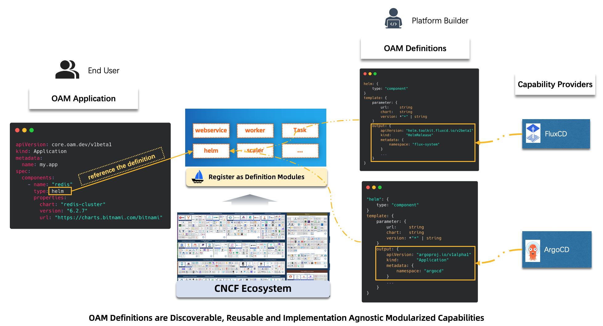

上图给出了以 `helm` 为例的原理示意图，平台构建者可以基于 FluxCD 或者 ArgoCD 编写模块定义并注册为 `helm` 模块，最终用户可以自动发现这个模块并在应用中定义 `helm` 模块暴露的参数。模块定义的编写就是基于 CUE 语言。

目前 KubeVela 一共有四种不同类型的模块定义，分别是`组件定义（ComponentDefinition）`、`运维特征定义（TraitDefinition）`、`策略定义（PolicyDefinition）`以及 `工作流步骤定义（WorkflowStepDefinition）`，对应了构成应用的四个基本概念。

当我们安装 KubeVela 后，就会自动安装一些内置的模块定义。此外 KubeVela 社区还有一个插件注册中心，包含了大量开箱即用的插件，由 KubeVela 核心维护者负责认证和维护，作为 KubeVela 的扩展，每一个插件都包含一组模块定义以及支撑其功能的 CRD Controller。


### 模块定义基础

当模块定义被安装到 KubeVela 控制平面以后，最终用户就可以立即发现和查看它们。

- 查看模块定义列表

```bash
$ vela def list
vela def list
NAME                                    TYPE                    NAMESPACE       SOURCE-ADDON            DESCRIPTION
cron-task                               ComponentDefinition     vela-system                             Describes cron jobs that run code or a script to completion.
daemon                                  ComponentDefinition     vela-system                             Describes daemonset services in Kubernetes.
grafana-access                          ComponentDefinition     vela-system     o11y-definitions        The access credential for grafana.
grafana-dashboard                       ComponentDefinition     vela-system     o11y-definitions        The dashboard for grafana.
# ......
```

- 查看模块定义的参数

```bash
$ vela show webservice
# Specification
+------------------+-------------------------------------------------------------------------------------------+---------------------------------------+----------+---------+
|       NAME       |                                        DESCRIPTION                                        |                 TYPE                  | REQUIRED | DEFAULT |
+------------------+-------------------------------------------------------------------------------------------+---------------------------------------+----------+---------+
| labels           | Specify the labels in the workload.                                                       | map[string]string                     | false    |         |
| annotations      | Specify the annotations in the workload.                                                  | map[string]string                     | false    |         |
| image            | Which image would you like to use for your service.                                       | string                                | true     |         |
| imagePullPolicy  | Specify image pull policy for your service.                                               | "Always" or "Never" or "IfNotPresent" | false    |         |
| hostAliases      | Specify the hostAliases to add.                                                           | [[]hostAliases](#hostaliases)         | false    |         |
+------------------+-------------------------------------------------------------------------------------------+---------------------------------------+----------+---------+


## ports
# ......
```

此外我们也可以通过命令行打开一个网页查看这些参数：

```bash
vela show webservice --web
```

- 在 KubeVela 的 UI 控制台

模块定义在 UI 控制台上可以比较方便的查看和使用，更重要的是，你还可以自定义 UI 展示来优化 UI 控制台上模块定义的参数展示。

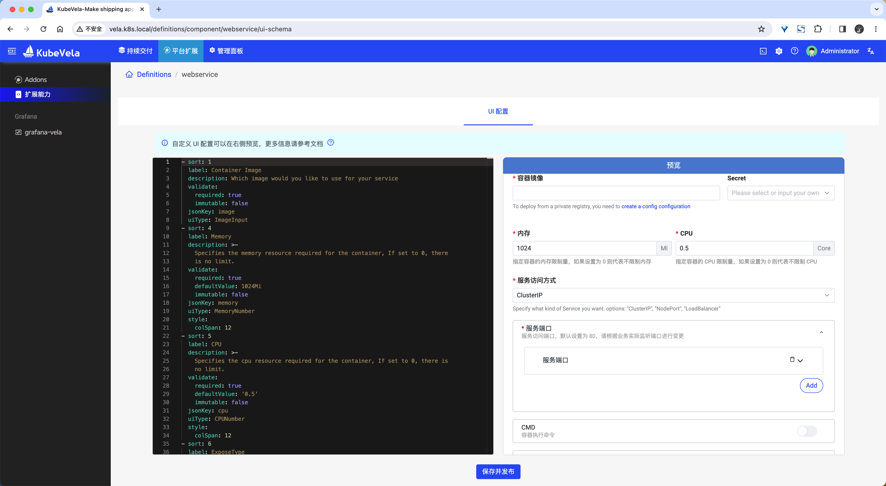

在 KubeVela 的 UI 控制台上使用模块定义是非常自然的，整个流程紧紧围绕应用部署计划展开，你只要跟着界面操作指引一步步点击即可使用。分为如下几步：

1. 创建应用选择组件类型，这个过程就是选择使用某个组件定义。
2. 填写组件的参数则会根据组件定义的不同出现不同的待填写参数。
3. 运维特征、策略、工作流步骤的使用也是如此，分别在不同的应用部署计划业务流程中体现。

最终 UI 控制台会组装成一个如下所示的符合 OAM 模型定义的完整应用部署计划（也就是 Application 对象），然后 KubeVela 控制器会自动化处理剩下的事情：

```yaml
apiVersion: core.oam.dev/v1beta1
kind: Application
metadata:
  name: first-vela-app
spec:
  components:
    - name: express-server
      type: webservice
      properties:
        image: oamdev/hello-world
        ports:
          - port: 8000
            expose: true
      traits:
        - type: scaler
          properties:
            replicas: 1
  policies:
    - name: target-default
      type: topology
      properties:
        clusters: ["local"]
        namespace: "default"
    - name: target-prod
      type: topology
      properties:
        clusters: ["local"]
        namespace: "prod"
    - name: deploy-ha
      type: override
      properties:
        components:
          - type: webservice
            traits:
              - type: scaler
                properties:
                  replicas: 2
  workflow:
    steps:
      - name: deploy2default
        type: deploy
        properties:
          policies: ["target-default"]
      - name: manual-approval
        type: suspend
      - name: deploy2prod
        type: deploy
        properties:
          policies: ["target-prod", "deploy-ha"]
```

使用 KubeVela 命令行工具来使用模块定义也是如此，只要编写上述 Application 对象的 YAML 文件即可，可以使用 vela 命令如下：

```bash
vela up -f https://kubevela.net/example/applications/first-app.yaml
```

Application 也是一种 Kubernetes 的 CRD，你可以通过 kubectl 工具，或者直接调用 Kubernetes API 集成 KubeVela 功能。


### 自定义模块定义

在 KubeVela CLI 工具中，`vela def` 命令组为开发者提供了一系列便捷的模块定义 `X-Definition` 编写工具，使得扩展模块的编写可以全部在 `CUE` 文件中进行，避免将 Template CUE 与 Kubernetes 的 YAML 格式进行混合，方便进行格式化与校验。

**init**

`vela def init` 命令是一个用来帮助用户初始化新的 Definition 的脚手架命令。用户可以通过 如下命令来创建一个新的空白 `TraitDefinition`。

```bash
vela def init my-trait -t trait --desc "My trait description."
```

上面命令会生成如下所示的 CUE 文件：

```
"my-trait": {
        alias: ""
        annotations: {}
        attributes: {
                appliesToWorkloads: []
                conflictsWith: []
                definitionRef: {}
                podDisruptive:   false
                workloadRefPath: ""
        }
        description: "My trait description."
        labels: {}
        type: "trait"
}

template: {
        patch: {}
        parameter: {}
}
```

除此之外，如果用户创建 `ComponentDefinition` 的目的是一个 Deployment（或者是其他的 Kubernetes Object ），而这个 Deployment 已经有了 YAML 格式的模版，用户还可以通过 `--template-yaml` 参数来完成从 YAML 到 CUE 的自动转换。例如如下的 `my-deployment.yaml`：

```yaml
# my-deployment.yaml
apiVersion: apps/v1
kind: Deployment
metadata:
  name: hello-world
spec:
  replicas: 1
  selector:
    matchLabels:
      app.kubernetes.io/name: hello-world
  template:
    metadata:
      labels:
        app.kubernetes.io/name: hello-world
    spec:
      containers:
        - name: hello-world
          image: somefive/hello-world
          ports:
            - name: http
              containerPort: 80
              protocol: TCP
---
apiVersion: v1
kind: Service
metadata:
  name: hello-world-service
spec:
  selector:
    app: hello-world
  ports:
    - name: http
      protocol: TCP
      port: 80
      targetPort: 8080
  type: LoadBalancer
```

我们可以运行如下命令可以得到 CUE 格式的 `ComponentDefinition`：

```bash
vela def init my-comp -t component --desc "My component." --template-yaml ./my-deployment.yaml
```

得到的结果如下：

```
"my-comp": {
        alias: ""
        annotations: {}
        attributes: workload: definition: {
                apiVersion: "<change me> apps/v1"
                kind:       "<change me> Deployment"
        }
        description: "My component."
        labels: {}
        type: "component"
}

template: {
        output: {
                apiVersion: "apps/v1"
                kind:       "Deployment"
                metadata: name: "hello-world"
                spec: {
                        replicas: 1
                        selector: matchLabels: "app.kubernetes.io/name": "hello-world"
                        template: {
                                metadata: labels: "app.kubernetes.io/name": "hello-world"
                                spec: containers: [{
                                        image: "somefive/hello-world"
                                        name:  "hello-world"
                                        ports: [{
                                                containerPort: 80
                                                name:          "http"
                                                protocol:      "TCP"
                                        }]
                                }]
                        }
                }
        }
        outputs: "hello-world-service": {
                apiVersion: "v1"
                kind:       "Service"
                metadata: name: "hello-world-service"
                spec: {
                        ports: [{
                                name:       "http"
                                port:       80
                                protocol:   "TCP"
                                targetPort: 8080
                        }]
                        selector: app: "hello-world"
                        type: "LoadBalancer"
                }
        }
        parameter: {}
}
```

然后就就可以在该文件的基础上进一步做进一步的修改了。

**vet**

在初始化 `Definition` 文件之后，可以运行 `vela def vet my-comp.cue` 来校验 `Definition` 是否在语法上有错误。

```bash
vela def vet my-comp.cue
```

比如如果少写了一个括号，该命令能够帮助用户识别出来。

**apply**

确认 `Definition` 撰写无误后，开发者就可以将模块部署到控制面集群中了。

```bash
vela def apply my-comp.cue -n default
```

将该 `Definition` 将部署到 Kubernetes 的 `default` 命名空间中。默认情况下，如果不指定 namespace，就会部署到 `vela-system` 命名空间。

> 如果模块定义被部署到 `vela-system` 命名空间，意味着这个模块全局可用，而指定到其他命名空间的模块只有在该命名空间可用，这个功能可以用于多租户场景。


**dry-run**

如果想了解一下 CUE 格式的 `Definition` 文件会被渲染成什么样的 Kubernetes YAML 文件，可以使用 `--dry-run` 来预先渲染成 Kubernetes API YAML 进行确认。

```bash
vela def apply my-comp.cue --dry-run
```

结果如下所示：

```yaml
apiVersion: core.oam.dev/v1beta1
kind: ComponentDefinition
metadata:
  annotations:
    definition.oam.dev/alias: ""
    definition.oam.dev/description: My component.
  labels: {}
  name: my-comp
  namespace: vela-system
spec:
  schematic:
    cue:
      template: |
        output: {
                apiVersion: "apps/v1"
                kind:       "Deployment"
                metadata: name: "hello-world"
                spec: {
                        replicas: 1
                        selector: matchLabels: "app.kubernetes.io/name": "hello-world"
                        template: {
                                metadata: labels: "app.kubernetes.io/name": "hello-world"
                                spec: containers: [{
                                        image: "somefive/hello-world"
                                        name:  "hello-world"
                                        ports: [{
                                                containerPort: 80
                                                name:          "http"
                                                protocol:      "TCP"
                                        }]
                                }]
                        }
                }
        }
        outputs: "hello-world-service": {
                apiVersion: "v1"
                kind:       "Service"
                metadata: name: "hello-world-service"
                spec: {
                        ports: [{
                                name:       "http"
                                port:       80
                                protocol:   "TCP"
                                targetPort: 8080
                        }]
                        selector: app: "hello-world"
                        type: "LoadBalancer"
                }
        }
        parameter: {}
  workload:
    definition:
      apiVersion: apps/v1
      kind: Deployment
```

**get**

在 `apply` 命令后，开发者可以采用原生的 `kubectl get` 从 Kubernetes 集群中查看对结果进行确认，但是正如我们上文提到的，YAML 格式的结果会相对复杂，并且嵌套在 YAML 中的 CUE 字符串会比较难编辑。使用 `vela def get` 命令可以自动将其转换成 CUE 格式，方便用户查看。

```bash
vela def get my-comp
```

要查看其他类型的 `Definition`，可以使用 `--type` 参数来指定，有效值包括：trait、policy、workload、workflow-step、component：

```bash
vela def get --type workflow-step build-push-image
```

**list**

用户可以通过列表查询查看当前系统中安装的所有 Definition。

```bash
vela def list
```

也可以指定类型筛选：

- 按组件筛选：`vela def list -t component`
- 按运维特征筛选：`vela def list -t trait`
- 按工作流步骤筛选：`vela def list -t workflow-step`
- 按策略筛选：`vela def list -t policy`

**edit**

你可以使用 `vela def edit` 命令来编辑 Definition 时，用户也只需要对转换过的 CUE 格式 Definition 进行修改，该命令会自动完成格式转换。

```bash
$ vela def edit my-comp
```

**调试**

当我们希望通过实际的应用调试模块定义的时候，我们可以使用 `vela dry-run --definitions` 命令（`-d` 是缩写）指定本地的模块定义文件执行应用渲染。

`Dry-run` 命令可以帮助你清晰的查看实际运行到 Kubernetes 的资源是什么。换句话说，你可以在本地看到 KubeVela 控制器运行的结果。

比如我们使用 `dry-run` 运行如下应用：

```yaml
# app.yaml
apiVersion: core.oam.dev/v1beta1
kind: Application
metadata:
  name: vela-app
spec:
  components:
    - name: express-server
      type: my-comp
```

然后可以使用如下命令来查看渲染结果：

```bash
vela dry-run -f app.yaml -d my-comp.cue
```

会输出如下所示的结果：

```yaml
---
# Application(vela-app) -- Component(express-server)
---
apiVersion: apps/v1
kind: Deployment
metadata:
  annotations: {}
  labels:
    app.oam.dev/appRevision: ""
    app.oam.dev/component: express-server
    app.oam.dev/name: vela-app
    app.oam.dev/namespace: default
    app.oam.dev/resourceType: WORKLOAD
    workload.oam.dev/type: my-comp
  name: hello-world
  namespace: default
spec:
  replicas: 1
  selector:
    matchLabels:
      app.kubernetes.io/name: hello-world
  template:
    metadata:
      labels:
        app.kubernetes.io/name: hello-world
    spec:
      containers:
        - image: somefive/hello-world
          name: hello-world
          ports:
            - containerPort: 80
              name: http
              protocol: TCP

---
## From the auxiliary workload
apiVersion: v1
kind: Service
metadata:
  annotations: {}
  labels:
    app.oam.dev/appRevision: ""
    app.oam.dev/component: express-server
    app.oam.dev/name: vela-app
    app.oam.dev/namespace: default
    app.oam.dev/resourceType: TRAIT
    trait.oam.dev/resource: hello-world-service
    trait.oam.dev/type: AuxiliaryWorkload
  name: hello-world-service
  namespace: default
spec:
  ports:
    - name: http
      port: 80
      protocol: TCP
      targetPort: 8080
  selector:
    app: hello-world
  type: LoadBalancer

---
```

**delete**

用户可以运行 `vela def del` 来删除相应的 Definition。

```bash
$ vela def del my-comp -n default
Are you sure to delete the following definition in namespace vela-system?
ComponentDefinition my-comp: My component.
[yes|no] > yes
ComponentDefinition my-comp in namespace vela-system deleted.
```

下图简单展示了如何使用 `vela def` 命令来操作管理 Definition。


这些命令对于 Definition 的开发者来说非常有用，可以帮助开发者快速的进行 Definition 的开发、调试和部署。


### 实践自定义组件

下面我们以组件定义的例子来详细展开说明，介绍如何使用 `CUE` 语言通过组件定义 `ComponentDefinition` 来自定义应用部署计划的组件。


#### 交付一个简单的自定义组件

比如现在我们有一个简单的 YAML 文件，它描述了一个 Deployment 类型的 Kubernetes 对象：

```yaml
# stateless.yaml
apiVersion: "apps/v1"
kind: "Deployment"
spec:
  selector:
    matchLabels:
      "app.oam.dev/component": "name"
  template:
    metadata:
      labels:
        "app.oam.dev/component": "name"
    spec:
      containers:
        - name: "name"
          image: "image"
```

我们可以通过 `vela def init` 来根据已有的 YAML 文件来生成一个 `ComponentDefinition` 模板。

```bash
$ vela def init stateless -t component --template-yaml ./stateless.yaml -o stateless.cue
Definition written to stateless.cue
```

得到的 `stateless.cue` 文件内容如下所示：

```
stateless: {
        alias: ""
        annotations: {}
        attributes: workload: definition: {
                apiVersion: "<change me> apps/v1"
                kind:       "<change me> Deployment"
        }
        description: ""
        labels: {}
        type: "component"
}

template: {
        output: {
                apiVersion: "apps/v1"
                kind:       "Deployment"
                spec: {
                        selector: matchLabels: "app.oam.dev/component": "name"
                        template: {
                                metadata: labels: "app.oam.dev/component": "name"
                                spec: containers: [{
                                        image: "image"
                                        name:  "name"
                                }]
                        }
                }
        }
        outputs: {}
        parameter: {}
}
```

在这个自动生成的模板中：

- `stateless` 是组件定义的名称，可以在组件初始化时自行定义。
- `stateless.attributes.workload` 表示该组件的工作负载类型，它可以帮助与适用于这种工作负载的特征集成。
- `template` 是一个 CUE 模板： 
   - `output` 和 `outputs` 字段定义组件将组成的资源。
   - `parameter` 字段定义了组件的参数，即应用程序中暴露的可配置属性（并且将根据它们自动生成 schema 模式以供最终用户学习此组件）。

下面我们来给这个自动生成的自定义组件添加参数并进行赋值：

```
stateless: {
    annotations: {}
    attributes: workload: definition: {
        apiVersion: "apps/v1"
        kind:       "Deployment"
    }
    description: ""
    labels: {}
    type: "component"
}

template: {
    output: {
        spec: {
            selector: matchLabels: "app.oam.dev/component": parameter.name
            template: {
                metadata: labels: "app.oam.dev/component": parameter.name
                spec: containers: [{
                    name:  parameter.name
                    image: parameter.image
                }]
            }
        }
        apiVersion: "apps/v1"
        kind:       "Deployment"
    }
    outputs: {}
    parameter: {
      name: string
      image: string
    }
}
```

修改后可以用 `vela def vet` 做一下格式检查和校验。

```bash
$ vela def vet stateless.cue
Validation stateless.cue succeed.
```

然后我们可以将上述 `ComponentDefinition` 应用于 Kubernetes 集群，使其正常工作。

```bash
$ vela def apply stateless.cue
ComponentDefinition stateless created in namespace vela-system.
```

然后我们就可以检查 schema 并在应用程序中使用它：

```bash
$ vela show stateless
# Specification
+-------+-------------+--------+----------+---------+
| NAME  | DESCRIPTION |  TYPE  | REQUIRED | DEFAULT |
+-------+-------------+--------+----------+---------+
| name  |             | string | true     |         |
| image |             | string | true     |         |
+-------+-------------+--------+----------+---------+
```

接着，我们再声明另一个名为 `task` 的组件，其原理类似。

```bash
vela def init task -t component -o task.cue
```

得到如下结果：

```bash
$ cat task.cue
task: {
        alias: ""
        annotations: {}
        attributes: workload: definition: {
                apiVersion: "<change me> apps/v1"
                kind:       "<change me> Deployment"
        }
        description: ""
        labels: {}
        type: "component"
}

template: {
        output: {}
        parameter: {}
}
```

然后修改该组件定义，使其成为 Job 类型的 Kubernetes 对象：

```
task: {
    annotations: {}
    attributes: workload: definition: {
        apiVersion: "batch/v1"
        kind:       "Job"
    }
    description: ""
    labels: {}
    type: "component"
}

template: {
  output: {
    apiVersion: "batch/v1"
    kind:       "Job"
    spec: {
      parallelism: parameter.count
      completions: parameter.count
      template: spec: {
        restartPolicy: parameter.restart
        containers: [{
          image: parameter.image
          if parameter["cmd"] != _|_ {
            command: parameter.cmd
          }
        }]
      }
    }
  }
    parameter: {
    count:   *1 | int
    image:   string
    restart: *"Never" | string
    cmd?: [...string]
  }
}
```

将以上两个组件定义部署到集群中：

```bash
$ vela def apply task.cue
ComponentDefinition task created in namespace vela-system.
$ vela show task
# Specification
+---------+-------------+----------+----------+---------+
|  NAME   | DESCRIPTION |   TYPE   | REQUIRED | DEFAULT |
+---------+-------------+----------+----------+---------+
| count   |             | int      | false    |       1 |
| image   |             | string   | true     |         |
| restart |             | string   | false    | Never   |
| cmd     |             | []string | false    |         |
+---------+-------------+----------+----------+---------+
```

这两个已经定义好的组件，最终会在应用部署计划中实例化，我们引用自定义的组件类型 `stateless`，命名为 `hello`。同样，我们也引用了自定义的第二个组件类型 `task`，并命令为 `countdown`。

创建一个如下所示的 Application 资源对象：

```yaml
apiVersion: core.oam.dev/v1beta1
kind: Application
metadata:
  name: website
spec:
  components:
    - name: hello
      type: stateless
      properties:
        image: oamdev/hello-world
        name: mysvc
    - name: countdown
      type: task
      properties:
        image: centos:7
        cmd:
          - "bin/bash"
          - "-c"
          - "for i in 9 8 7 6 5 4 3 2 1 ; do echo $i ; done"
```

然后我们可以先使用 `dry-run` 命令来查看上面的 Application 对象最终可以渲染成什么样的 Kubernetes YAML 文件：

```bash
$ vela dry-run -f test.yaml -d stateless.cue -d task.cue
---
# Application(website) -- Component(hello)
---

apiVersion: apps/v1
kind: Deployment
metadata:
  annotations: {}
  labels:
    app.oam.dev/appRevision: ""
    app.oam.dev/component: hello
    app.oam.dev/name: website
    app.oam.dev/namespace: default
    app.oam.dev/resourceType: WORKLOAD
    workload.oam.dev/type: stateless
  name: hello
  namespace: default
spec:
  selector:
    matchLabels:
      app.oam.dev/component: mysvc
  template:
    metadata:
      labels:
        app.oam.dev/component: mysvc
    spec:
      containers:
      - image: oamdev/hello-world
        name: mysvc

---

---
# Application(website) -- Component(countdown)
---

apiVersion: batch/v1
kind: Job
metadata:
  annotations: {}
  labels:
    app.oam.dev/appRevision: ""
    app.oam.dev/component: countdown
    app.oam.dev/name: website
    app.oam.dev/namespace: default
    app.oam.dev/resourceType: WORKLOAD
    workload.oam.dev/type: task
  name: countdown
  namespace: default
spec:
  completions: 1
  parallelism: 1
  template:
    spec:
      containers:
      - command:
        - bin/bash
        - -c
        - for i in 9 8 7 6 5 4 3 2 1 ; do echo $i ; done
        image: centos:7
      restartPolicy: Never

---
```

如果没有问题那么就可以直接应用该对象。

到这里我们就完成了一个自定义应用组件的应用交付全过程。值得注意的是，作为管理员的我们，可以通过 CUE 提供用户所需要的任何自定义组件类型，同时也为用户提供了模板参数 `parameter` 来灵活地指定对 Kubernetes 相关资源的要求。


#### 使用 CUE Context 获取运行时信息

我们还可以通过 `context` 关键字来引用 KubeVela 的运行时相关信息。

最常用的就是应用部署计划的名称 `context.appName` 和组件的名称 `context.name`。

```bash
context: {
  appName: string
  name: string
}
```

比如你在实现一个组件定义，希望将容器的名称填充为组件的名称。那么可以这样做：

```
parameter: {
    image: string
}
output: {
  ...
    spec: {
        containers: [{
            name:  context.name
            image: parameter.image
        }]
    }
  ...
}
```


#### 交付一个复合的自定义组件

除了上面这个例子外，一个组件的定义通常也会由多个 Kubernetes API 资源组成。例如，一个由 Deployment 和 Service 组成的 webserver 组件。CUE 同样能很好的满足这种自定义复合组件的需求。

> 与使用 Helm 相比，这种方法更灵活，因为你可以随时控制抽象，并更好地集成到 KubeVela 中的特性和工作流程中。


我们会使用 `output` 这个字段来定义工作负载类型的模板，而其他剩下的资源模板，都在 `outputs` 这个字段里进行声明，格式如下：

```
output: {
  <template of main workload structural data>
}
outputs: {
  <unique-name>: {
    <template of auxiliary resource structural data>
  }
}
```

比如 `webserver` 这个复合自定义组件上，它的 `CUE` 文件编写如下：

```
webserver: {
    annotations: {}
    attributes: workload: definition: {
        apiVersion: "apps/v1"
        kind:       "Deployment"
    }
    description: ""
    labels: {}
    type: "component"
}

template: {
  output: {
    apiVersion: "apps/v1"
    kind:       "Deployment"
    spec: {
      selector: matchLabels: {
        "app.oam.dev/component": context.name
      }
      template: {
        metadata: labels: {
          "app.oam.dev/component": context.name
        }
        spec: {
          containers: [{
            name:  context.name
            image: parameter.image

            if parameter["cmd"] != _|_ {
              command: parameter.cmd
            }

            if parameter["env"] != _|_ {
              env: parameter.env
            }

            if context["config"] != _|_ {
              env: context.config
            }

            ports: [{
              containerPort: parameter.port
            }]

            if parameter["cpu"] != _|_ {
              resources: {
                limits:
                  cpu: parameter.cpu
                requests:
                  cpu: parameter.cpu
              }
            }
          }]
        }
      }
    }
  }
  // an extra template
  outputs: service: {
    apiVersion: "v1"
    kind:       "Service"
    spec: {
      selector: {
        "app.oam.dev/component": context.name
      }
      ports: [
        {
          port:       parameter.port
          targetPort: parameter.port
        },
      ]
    }
  }
    parameter: {
    image: string
    cmd?: [...string]
    port: *80 | int
    env?: [...{
      name:   string
      value?: string
      valueFrom?: {
        secretKeyRef: {
          name: string
          key:  string
        }
      }
    }]
    cpu?: string
  }
}
```

可以看到：

- 最核心的工作负载，需要定义在 `output` 字段里，这里定义了一个要交付的 Deployment 类型的 Kubernetes 资源。
- Service 类型的资源，则放到 `outputs` 里定义。以此类推，如果你要复合第三个资源，只需要继续在后面以键值对的方式添加：

```
outputs: service: {
            apiVersion: "v1"
            kind:       "Service"
            spec: {
...
outputs: third-resource: {
            apiVersion: "v1"
            kind:       "Service"
            spec: {
...
```

在理解这些之后，将上面的组件定义对象保存到 CUE 文件中，并部署到你的 Kubernetes 集群。

```bash
vela def apply webserver.cue
```

然后，我们使用它们，来编写一个应用部署计划：

```yaml
apiVersion: core.oam.dev/v1beta1
kind: Application
metadata:
  name: webserver-demo
  namespace: default
spec:
  components:
    - name: hello-world
      type: webserver
      properties:
        image: oamdev/hello-world
        port: 8000
        env:
          - name: "foo"
            value: "bar"
        cpu: "100m"
```

进行部署：

```bash
$ vela up -f webserver.yaml
```

最后，它将在运行时集群生成相关 Kubernetes 资源如下：

```bash
$ vela status webserver-demo --tree --detail
CLUSTER       NAMESPACE     RESOURCE                                             STATUS    APPLY_TIME          DETAIL
local     ─── default   ─┬─ Service/hello-webserver-auxiliaryworkload-685d98b6d9 updated   2022-10-15 21:58:35 Type: ClusterIP
                         │                                                                                     Cluster-IP: 10.43.255.55
                         │                                                                                     External-IP: <none>
                         │                                                                                     Port(s): 8000/TCP
                         │                                                                                     Age: 66s
                         └─ Deployment/hello-webserver                           updated   2022-10-15 21:58:35 Ready: 1/1  Up-to-date: 1
                                                                                                               Available: 1  Age: 66s
```

当然除了自定义组件之外，还可以自定义运维特征、策略、工作流等等，其余的内容可以参考 [KubeVela 官方文档](https://kubevela.io/zh/docs/platform-engineers/cue/basic/) 了解如何使用 CUE 语言来自定义 KubeVela 的各种资源。


> 原文: <https://www.yuque.com/cnych/k8s4/oo92gg6838gt8q75>