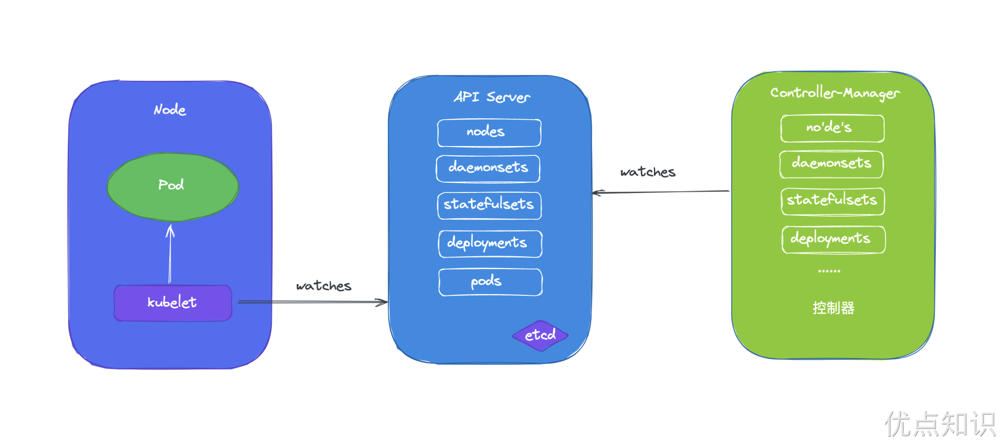
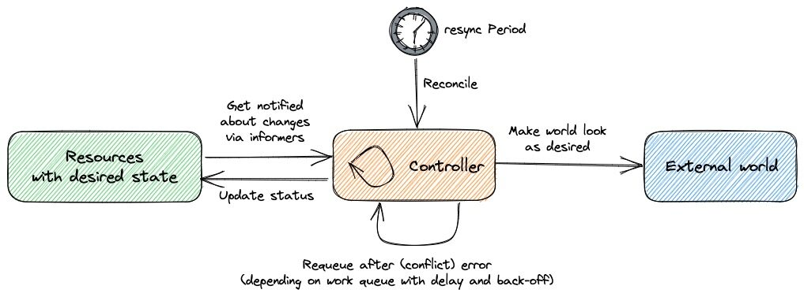
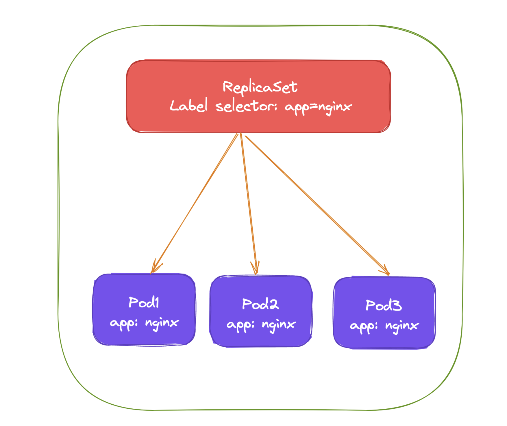
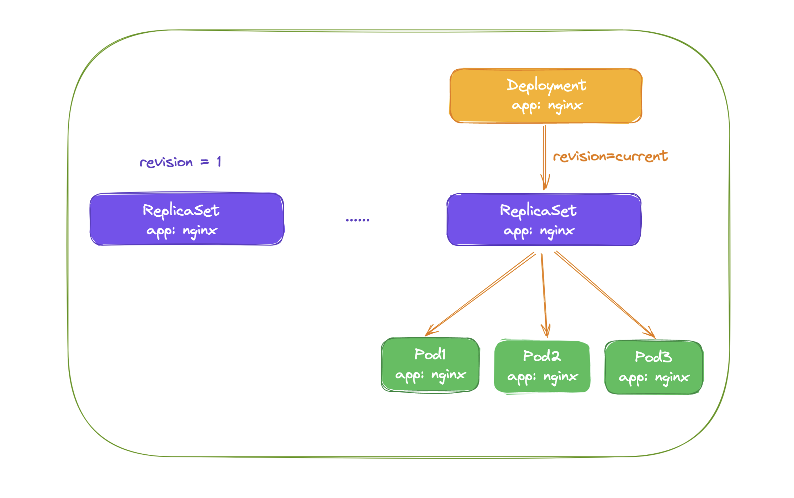
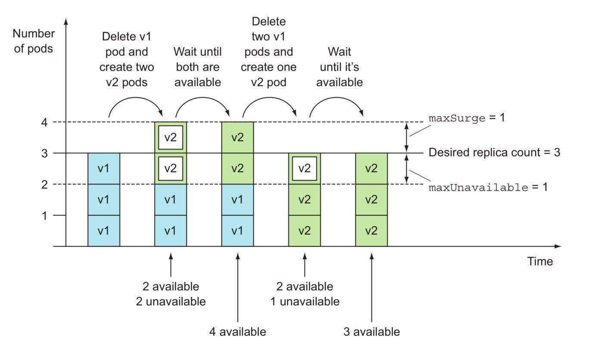
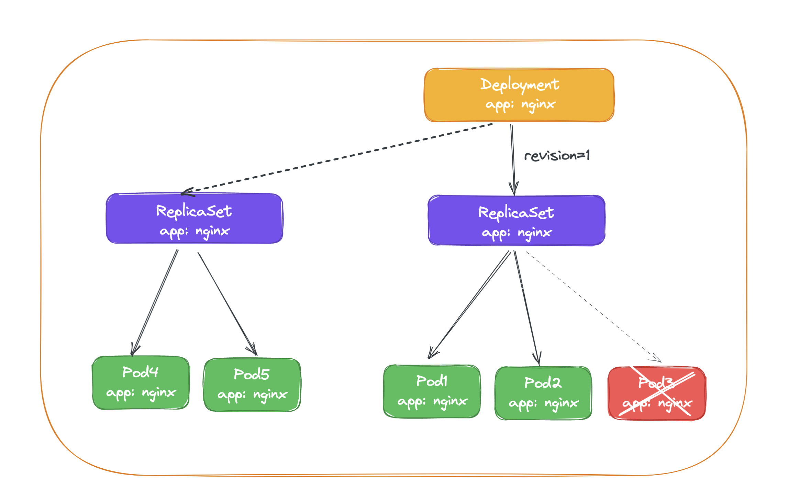

# 6.ReplicaSet与Deployment

前面我们学习了 Pod 的原理和一些基本使用，但是在实际使用的时候并不会直接使用 Pod，而是会使用各种更高层级的控制器，Kubernetes 中运行了一系列控制器来确保集群的当前状态与期望状态保持一致，它们就是 Kubernetes 的大脑。例如，ReplicaSet 控制器负责维护集群中运行的 Pod 数量；Node 控制器负责监控节点的状态，并在节点出现故障时及时做出响应。总而言之，在 Kubernetes 中，每个控制器只负责某种类型的特定资源。


## 控制器

通过前面的课程学习我们知道了 master 的各组件中，API Server 仅负责将资源存储于 etcd 中，并将其变动通知给各其他组件，如 kubelet、kube-scheduler、kube-proxy 和 kube-controller-manager 等，kube-scheduler 监控到处于未绑定状态的 Pod 对象出现时就启动调度器为其挑选最合适的工作节点，另外 Kubernetes 的核心功能之一还在于要确保各资源对象的当前状态（status）已匹配用户期望的状态（spec），使当前状态不断地向期望状态“调谐”（Reconcile）来完成容器应用管理，这些就是 kube-controller-manager 的任务，kube-controller-manager 是一个独立的组件，但是它却包含了很多功能不同的控制器。



Kubernetes 控制器会监听资源的 `创建/更新/删除` 事件，并触发 `Reconcile` 调谐函数作为响应，整个调整过程被称作 `Reconcile Loop（调谐循环）` 或者 `Sync Loop（同步循环）`。Reconcile 是一个使用资源对象的命名空间和资源对象名称来调用的函数，使得资源对象的实际状态与 资源清单中定义的状态保持一致。调用完成后，Reconcile 会将资源对象的状态更新为当前实际状态。我们可以用下面的一段伪代码来表示这个过程：

```go
for {
  desired := getDesiredState()  // 期望的状态
  current := getCurrentState()  // 当前实际状态
  if current == desired {  // 如果状态一致则什么都不做
    // nothing to do
  } else {  // 如果状态不一致则调整编排，到一致为止
    // change current to desired status
  }
}
```

这个编排模型就是 Kubernetes 项目中的一个通用编排模式，即：`控制循环（control loop）`。

创建为具体的控制器对象之后，每个控制器均通过 API Server 提供的接口持续监控相关资源对象的当前状态，并在因故障、更新或其他原因导致系统状态发生变化时，尝试让资源的当前状态向期望状态迁移。简单来说，每个控制器对象运行一个调谐循环负责状态同步，并将目标资源对象的当前状态写入到其 status 字段中。



实现调谐功能是依靠的 Kubernetes 实现的核心机制之一的 List-Watch，在资源对象的状态发生变动时，由 API Server 负责写入 etcd 并通过水平触发机制主动通知给相关的客户端程序以确保其不会错过任何一个事件。控制器通过 API Server 的 Watch 接口实时监控目标资源对象的变动并执行调谐操作，但并不会与其他控制器进行任何交互。

工作负载（workload）一类的控制器资源类型包括 ReplicaSet、Deployment、DaemonSet、StatefulSet、Job 和 CronJob 等，它们分别代表了一种类型的 Pod 控制器资源，接下来我们将分别介绍这些工作负载控制器的使用。


## ReplicaSet

假如我们现在有一个 Pod 正在提供线上的服务，我们来想想一下我们可能会遇到的一些场景：

- 某次运营活动非常成功，网站访问量突然暴增
- 运行当前 Pod 的节点发生故障了，Pod 不能正常提供服务了

第一种情况，可能比较好应对，活动之前我们可以大概计算下会有多大的访问量，提前多启动几个 Pod 副本，活动结束后再把多余的 Pod 杀掉，虽然有点麻烦，但是还是能够应对这种情况的。

第二种情况，可能某天夜里收到大量报警说服务挂了，然后起来打开电脑在另外的节点上重新启动一个新的 Pod，问题可以解决。

但是如果我们都人工的去解决遇到的这些问题，似乎又回到了以前刀耕火种的时代了是吧？如果有一种工具能够来帮助我们自动管理 Pod 就好了，Pod 挂了自动帮我在合适的节点上重新启动一个 Pod，这样是不是遇到上面的问题我们都不需要手动去解决了。

而 ReplicaSet 这种资源对象就可以来帮助我们实现这个功能，`ReplicaSet（RS）` 的主要作用就是维持一组 Pod 副本的运行，保证一定数量的 Pod 在集群中正常运行，ReplicaSet 控制器会持续监听它说控制的这些 Pod 的运行状态，在 Pod 发送故障数量减少或者增加时会触发调谐过程，始终保持副本数量一定。

和 Pod 一样我们仍然还是通过 YAML 文件来描述我们的 ReplicaSet 资源对象，如下 YAML 文件是一个常见的 ReplicaSet 定义：

```yaml
# nginx-rs.yaml
apiVersion: apps/v1
kind: ReplicaSet
metadata:
  name: nginx-rs
  namespace: default
spec:
  replicas: 3 # 期望的 Pod 副本数量，默认值为1
  selector: # Label Selector，必须匹配 Pod 模板中的标签
    matchLabels:
      app: nginx
  template: # Pod 模板
    metadata:
      labels:
        app: nginx
    spec:
      containers:
        - name: nginx
          image: nginx
          ports:
            - containerPort: 80
```

上面的 YAML 文件结构和我们之前定义的 Pod 看上去没太大两样，有常见的 apiVersion、kind、metadata，在 spec 下面描述 ReplicaSet 的基本信息，其中包含 3 个重要内容：

- replias：表示期望的 Pod 的副本数量
- selector：Label Selector，用来匹配要控制的 Pod 标签，需要和下面的 Pod 模板中的标签一致
- template：Pod 模板，实际上就是以前我们定义的 Pod 内容，相当于把一个 Pod 的描述以模板的形式嵌入到了 ReplicaSet 中来。

> Pod 模板这个概念非常重要，因为后面我们讲解到的大多数控制器，都会使用 Pod 模板来统一定义它所要管理的 Pod。更有意思的是，我们还会看到其他类型的对象模板，比如 Volume 的模板等。


上面就是我们定义的一个普通的 ReplicaSet 资源清单文件，ReplicaSet 控制器会通过定义的 Label Selector 标签去查找集群中的 Pod 对象：



我们直接来创建上面的资源对象：

```shell
☸ ➜ kubectl apply -f nginx-rs.yaml
replicaset.apps/nginx-rs created
☸ ➜ kubectl get rs nginx-rs
NAME       DESIRED   CURRENT   READY   AGE
nginx-rs   3         3         3       17m
```

通过查看 RS 可以看到当前资源对象的描述信息，包括 `DESIRED`、`CURRENT`、`READY` 的状态值，创建完成后，可以利用如下命令查看下 Pod 列表：

```shell
☸ ➜ kubectl get pods -l app=nginx
NAME             READY   STATUS              RESTARTS   AGE
nginx-rs-nxklf   1/1     Running   0          52s
nginx-rs-t46qc   1/1     Running   0          52s
nginx-rs-xfqrn   1/1     Running   0          52s
```

可以看到现在有 3 个 Pod，这 3 个 Pod 就是我们在 RS 中声明的 3 个副本，比如我们删除其中一个 Pod：

```shell
☸ ➜ kubectl delete pod nginx-rs-xfqrn
pod "nginx-rs-xfqrn" deleted
```

然后再查看 Pod 列表：

```shell
☸ ➜ kubectl get pods -l app=nginx
NAME             READY   STATUS    RESTARTS   AGE
nginx-rs-nxklf   1/1     Running   0          3m19s
nginx-rs-t46qc   1/1     Running   0          3m19s
nginx-rs-xsb59   1/1     Running   0          10s
```

可以看到又重新出现了一个 Pod，这个就是上面我们所说的 ReplicaSet 控制器为我们做的工作，我们在 YAML 文件中声明了 3 个副本，然后现在我们删除了一个副本，就变成了两个，这个时候 ReplicaSet 控制器监控到控制的 Pod 数量和期望的 3 不一致，所以就需要启动一个新的 Pod 来保持 3 个副本，这个过程上面我们说了就是**调谐**的过程。同样可以查看 RS 的描述信息来查看到相关的事件信息：

```shell
☸ ➜ kubectl describe rs nginx-rs
Name:         nginx-rs
Namespace:    default
Selector:     app=nginx
Labels:       <none>
Annotations:  kubectl.kubernetes.io/last-applied-configuration:
                {"apiVersion":"apps/v1","kind":"ReplicaSet","metadata":{"annotations":{},"name":"nginx-rs","namespace":"default"},"spec":{"replicas":3,"se...
Replicas:     3 current / 3 desired
Pods Status:  3 Running / 0 Waiting / 0 Succeeded / 0 Failed
Pod Template:
  Labels:  app=nginx
  Containers:
   nginx:
    Image:        nginx
    Port:         80/TCP
    Host Port:    0/TCP
    Environment:  <none>
    Mounts:       <none>
  Volumes:        <none>
Events:
  Type    Reason            Age   From                   Message
  ----    ------            ----  ----                   -------
  Normal  SuccessfulCreate  17m   replicaset-controller  Created pod: nginx-rs-xfqrn
  Normal  SuccessfulCreate  17m   replicaset-controller  Created pod: nginx-rs-nxklf
  Normal  SuccessfulCreate  17m   replicaset-controller  Created pod: nginx-rs-t46qc
  Normal  SuccessfulCreate  14m   replicaset-controller  Created pod: nginx-rs-xsb59
```

可以发现最开始通过 ReplicaSet 控制器创建了 3 个 Pod，后面我们删除了 Pod 后， ReplicaSet 控制器又为我们创建了一个 Pod，和上面我们的描述是一致的。如果这个时候我们把 RS 资源对象的 Pod 副本更改为 2 `spec.replicas=2`，这个时候我们来更新下资源对象：

```shell
☸ ➜ kubectl apply -f rs.yaml
replicaset.apps/nginx-rs configured
☸ ➜ kubectl get rs nginx-rs
NAME       DESIRED   CURRENT   READY   AGE
nginx-rs   2         2         2       27m
$ kubectl describe rs nginx-rs
Name:         nginx-rs
Namespace:    default
Selector:     app=nginx
Labels:       <none>
Annotations:  kubectl.kubernetes.io/last-applied-configuration:
                {"apiVersion":"apps/v1","kind":"ReplicaSet","metadata":{"annotations":{},"name":"nginx-rs","namespace":"default"},"spec":{"replicas":2,"se...
Replicas:     2 current / 2 desired
Pods Status:  2 Running / 1 Waiting / 0 Succeeded / 0 Failed
Pod Template:
  Labels:  app=nginx
  Containers:
   nginx:
    Image:        nginx
    Port:         80/TCP
    Host Port:    0/TCP
    Environment:  <none>
    Mounts:       <none>
  Volumes:        <none>
Events:
  Type    Reason            Age   From                   Message
  ----    ------            ----  ----                   -------
  Normal  SuccessfulCreate  27m   replicaset-controller  Created pod: nginx-rs-xfqrn
  Normal  SuccessfulCreate  27m   replicaset-controller  Created pod: nginx-rs-nxklf
  Normal  SuccessfulCreate  27m   replicaset-controller  Created pod: nginx-rs-t46qc
  Normal  SuccessfulCreate  24m   replicaset-controller  Created pod: nginx-rs-xsb59
  Normal  SuccessfulDelete  7s    replicaset-controller  Deleted pod: nginx-rs-xsb59
```

可以看到 Replicaset 控制器在发现我们的资源声明中副本数变更为 2 后，就主动去删除了一个 Pod，这样副本数就和期望的始终保持一致了：

```shell
☸ ➜ kubectl get pods -l app=nginx
NAME             READY   STATUS    RESTARTS   AGE
nginx-rs-nxklf   1/1     Running   0          30m
nginx-rs-t46qc   1/1     Running   0          30m
```

我们可以随便查看一个 Pod 的描述信息可以看到这个 Pod 的所属控制器信息：

```shell
☸ ➜ kubectl describe pod nginx-rs-xsb59
Name:               nginx-rs-xsb59
Namespace:          default
Priority:           0
PriorityClassName:  <none>
Node:               demo-worker/172.18.0.3
Start Time:         Tue, 06 Dec 2022 20:09:49 +0800
Labels:             app=nginx
Annotations:        <none>
Status:             Running
IP:                 10.244.1.148
Controlled By:      ReplicaSet/nginx-rs
.......
```

另外被 ReplicaSet 持有的 Pod 有一个 `metadata.ownerReferences` 指针指向当前的 ReplicaSet，表示当前 Pod 的所有者，这个引用主要会被集群中的**垃圾收集器**使用以清理失去所有者的 Pod 对象。这个 `ownerReferences` 和数据库中的`外键`是不是非常类似。可以通过将 Pod 资源描述信息导出查看：

```shell
☸ ➜ kubectl get pod nginx-rs-xsb59 -o yaml
apiVersion: v1
kind: Pod
metadata:
  creationTimestamp: "2022-12-06T20:18:10Z"
  generateName: nginx-rs-
  labels:
    app: nginx
  name: nginx-rs-xsb59
  namespace: default
  ownerReferences:
  - apiVersion: apps/v1
    blockOwnerDeletion: true
    controller: true
    kind: ReplicaSet
    name: nginx-rs
    uid: 4a3121fa-b5ae-4def-b2d2-bf17bc06b7b7
  resourceVersion: "1781596"
  selfLink: /api/v1/namespaces/default/pods/nginx-rs-xsb59
  uid: 0a4cae9a-105b-4024-ae96-ee516bfb2d23
......
```

我们可以看到 Pod 中有一个 `metadata.ownerReferences` 的字段指向了 ReplicaSet 资源对象。如果要彻底删除 Pod，我们就只能删除 RS 对象：

```shell
☸ ➜ kubectl delete rs nginx-rs
# 或者执行 kubectl delete -f nginx-rs.yaml
```

这就是 ReplicaSet 对象的基本使用。


## Deployment

前面我们学习了 ReplicaSet 控制器，了解到该控制器是用来维护集群中运行的 Pod 数量的，但是往往在实际操作的时候，我们反而不会去直接使用 RS，而是会使用更上层的控制器，比如接下来我们要学习的主角 Deployment，Deployment 一个非常重要的功能就是实现了 Pod 的滚动更新，比如我们应用更新了，我们只需要更新我们的容器镜像，然后修改 Deployment 里面的 Pod 模板镜像，那么 Deployment 就会用**滚动更新（Rolling Update）**的方式来升级现在的 Pod，这个能力是非常重要的，因为对于线上的服务我们需要做到不中断服务，所以滚动更新就成了必须的一个功能。而 Deployment 这个能力的实现，依赖的就是前面的 ReplicaSet 这个资源对象，实际上我们可以通俗的理解就是**每个 Deployment 就对应集群中的一次部署**，这样就更好理解了。

Deployment 资源对象的格式和 ReplicaSet 几乎一致，如下资源对象就是一个常见的 Deployment 资源类型：

```yaml
# nginx-deploy.yaml
apiVersion: apps/v1
kind: Deployment
metadata:
  name: nginx-deploy
  namespace: default
spec:
  replicas: 3 # 期望的 Pod 副本数量，默认值为1
  selector: # Label Selector，必须匹配 Pod 模板中的标签
    matchLabels:
      app: nginx
  template: # Pod 模板
    metadata:
      labels:
        app: nginx
    spec:
      containers:
        - name: nginx
          image: nginx
          ports:
            - containerPort: 80
```

我们这里只是将类型替换成了 Deployment，我们可以先来创建下这个资源对象：

```shell
☸ ➜ kubectl apply -f nginx-deploy.yaml
deployment.apps/nginx-deploy created
☸ ➜ kubectl get deployment
NAME           READY   UP-TO-DATE   AVAILABLE   AGE
nginx-deploy   3/3     3            3           58s
```

创建完成后，查看 Pod 状态：

```shell
☸ ➜ kubectl get pods -l app=nginx
NAME                            READY   STATUS    RESTARTS   AGE
nginx-deploy-85ff79dd56-7r76h   1/1     Running   0          41s
nginx-deploy-85ff79dd56-d5gjs   1/1     Running   0          41s
nginx-deploy-85ff79dd56-txc4h   1/1     Running   0          41s
```

到这里我们发现和之前的 RS 对象是否没有什么两样，都是根据`spec.replicas`来维持的副本数量，我们随意查看一个 Pod 的描述信息：

```shell
☸ ➜ kubectl describe pod nginx-deploy-85ff79dd56-txc4h
Name:               nginx-deploy-85ff79dd56-txc4h
Namespace:          default
Priority:           0
PriorityClassName:  <none>
Node:               demo-worker/172.18.0.3
Start Time:         Sat, 16 Nov 2022 16:01:25 +0800
Labels:             app=nginx
                    pod-template-hash=85ff79dd56
Annotations:        podpreset.admission.kubernetes.io/podpreset-time-preset: 2062768
Status:             Running
IP:                 10.244.1.166
Controlled By:      ReplicaSet/nginx-deploy-85ff79dd56
......
Events:
  Type    Reason     Age        From                 Message
  ----    ------     ----       ----                 -------
  Normal  Scheduled  <unknown>  default-scheduler    Successfully assigned default/nginx-deploy-85ff79dd56-txc4h to demo-worker
  Normal  Pulling    2m         kubelet, node1  Pulling image "nginx"
  Normal  Pulled     117s       kubelet, node1  Successfully pulled image "nginx"
  Normal  Created    117s       kubelet, node1  Created container nginx
  Normal  Started    116s       kubelet, node1  Started container nginx
```

我们仔细查看其中有这样一个信息 `Controlled By: ReplicaSet/nginx-deploy-85ff79dd56`，什么意思？是不是表示当前我们这个 Pod 的控制器是一个 ReplicaSet 对象啊，我们不是创建的一个 Deployment 吗？为什么 Pod 会被 RS 所控制呢？那我们再去看下这个对应的 RS 对象的详细信息如何呢：

```shell
☸ ➜ kubectl describe rs nginx-deploy-85ff79dd56
Name:           nginx-deploy-85ff79dd56
Namespace:      default
Selector:       app=nginx,pod-template-hash=85ff79dd56
Labels:         app=nginx
                pod-template-hash=85ff79dd56
Annotations:    deployment.kubernetes.io/desired-replicas: 3
                deployment.kubernetes.io/max-replicas: 4
                deployment.kubernetes.io/revision: 1
Controlled By:  Deployment/nginx-deploy
Replicas:       3 current / 3 desired
Pods Status:    3 Running / 0 Waiting / 0 Succeeded / 0 Failed
......
Events:
  Type    Reason            Age    From                   Message
  ----    ------            ----   ----                   -------
  Normal  SuccessfulCreate  4m52s  replicaset-controller  Created pod: nginx-deploy-85ff79dd56-7r76h
  Normal  SuccessfulCreate  4m52s  replicaset-controller  Created pod: nginx-deploy-85ff79dd56-d5gjs
  Normal  SuccessfulCreate  4m52s  replicaset-controller  Created pod: nginx-deploy-85ff79dd56-txc4h
```

其中有这样的一个信息：`Controlled By: Deployment/nginx-deploy`，明白了吧？意思就是我们的 Pod 依赖的控制器 RS 实际上被我们的 Deployment 控制着呢，我们可以用下图来说明 Pod、ReplicaSet、Deployment 三者之间的关系：



通过上图我们可以很清楚的看到，定义了 3 个副本的 Deployment 与 ReplicaSet 和 Pod 的关系，就是一层一层进行控制的。ReplicaSet 作用和之前一样还是来保证 Pod 的个数始终保存指定的数量，所以 Deployment 中的容器 `restartPolicy=Always` 是唯一的就是这个原因，因为容器必须始终保证自己处于 Running 状态，ReplicaSet 才可以去明确调整 Pod 的个数。而 Deployment 是通过管理 ReplicaSet 的数量和属性来实现`水平扩展/收缩`以及`滚动更新`两个功能的。


### 水平伸缩

`水平扩展/收缩`的功能比较简单，因为 ReplicaSet 就可以实现，所以 Deployment 控制器只需要去修改它缩控制的 ReplicaSet 的 Pod 副本数量就可以了。比如现在我们把 Pod 的副本调整到 4 个，那么 Deployment 所对应的 ReplicaSet 就会自动创建一个新的 Pod 出来，这样就水平扩展了，我们可以使用一个新的命令 `kubectl scale` 命令来完成这个操作：

```shell
☸ ➜ kubectl scale deployment nginx-deploy --replicas=4
deployment.apps/nginx-deployment scaled
```

扩展完成后可以查看当前的 RS 对象：

```shell
☸ ➜ kubectl get rs
NAME                      DESIRED   CURRENT   READY   AGE
nginx-deploy-85ff79dd56   4         4         3       40m
```

可以看到期望的 Pod 数量已经变成 4 了，只是 Pod 还没准备完成，所以 READY 状态数量还是 3，同样查看 RS 的详细信息：

```shell
☸ ➜ kubectl describe rs nginx-deploy-85ff79dd56
Name:           nginx-deploy-85ff79dd56
Namespace:      default
Selector:       app=nginx,pod-template-hash=85ff79dd56
......
Events:
  Type    Reason            Age   From                   Message
  ----    ------            ----  ----                   -------
  Normal  SuccessfulCreate  40m   replicaset-controller  Created pod: nginx-deploy-85ff79dd56-7r76h
  Normal  SuccessfulCreate  40m   replicaset-controller  Created pod: nginx-deploy-85ff79dd56-d5gjs
  Normal  SuccessfulCreate  40m   replicaset-controller  Created pod: nginx-deploy-85ff79dd56-txc4h
  Normal  SuccessfulCreate  17s   replicaset-controller  Created pod: nginx-deploy-85ff79dd56-tph9g
```

可以看到 ReplicaSet 控制器增加了一个新的 Pod，同样的 Deployment 资源对象的事件中也可以看到完成了扩容的操作：

```shell
☸ ➜ kubectl describe deploy nginx-deploy
Name:                   nginx-deploy
Namespace:              default
......
OldReplicaSets:  <none>
NewReplicaSet:   nginx-deploy-85ff79dd56 (4/4 replicas created)
Events:
  Type    Reason             Age    From                   Message
  ----    ------             ----   ----                   -------
  Normal  ScalingReplicaSet  43m    deployment-controller  Scaled up replica set nginx-deploy-85ff79dd56 to 3
  Normal  ScalingReplicaSet  3m16s  deployment-controller  Scaled up replica set nginx-deploy-85ff79dd56 to 4
```


### 滚动更新

如果只是`水平扩展/收缩`这两个功能，就完全没必要设计 Deployment 这个资源对象了，Deployment 最突出的一个功能是支持**滚动更新**，比如现在我们需要把应用容器更改为 `nginx:1.7.9` 版本，修改后的资源清单文件如下所示：

```yaml
apiVersion: apps/v1
kind: Deployment
metadata:
  name: nginx-deploy
  namespace: default
spec:
  replicas: 3
  selector:
    matchLabels:
      app: nginx
  minReadySeconds: 5
  strategy:
    type: RollingUpdate # 指定更新策略：RollingUpdate和Recreate
    rollingUpdate:
      maxSurge: 1
      maxUnavailable: 1
  template:
    metadata:
      labels:
        app: nginx
    spec:
      containers:
        - name: nginx
          image: nginx:1.7.9
          ports:
            - containerPort: 80
```

后前面相比较，除了更改了镜像之外，我们还指定了更新策略：

```yaml
minReadySeconds: 5
strategy:
  type: RollingUpdate
  rollingUpdate:
    maxSurge: 1
    maxUnavailable: 1
```

- `minReadySeconds`：表示 Kubernetes 在等待设置的时间后才进行升级，如果没有设置该值，Kubernetes 会假设该容器启动起来后就提供服务了，如果没有设置该值，在某些极端情况下可能会造成服务不正常运行，默认值就是 0。
- `type=RollingUpdate`：表示设置更新策略为滚动更新，可以设置为 `Recreate` 和 `RollingUpdate` 两个值，`Recreate` 表示全部重新创建，默认值就是 `RollingUpdate`。
- `maxSurge`：表示升级过程中最多可以比原先设置多出的 Pod 数量，例如：`maxSurage=1，replicas=5`，就表示 Kubernetes 会先启动一个新的 Pod，然后才删掉一个旧的 Pod，整个升级过程中最多会有`5+1`个 Pod。
- `maxUnavaible`：表示升级过程中最多有多少个 Pod 处于无法提供服务的状态，当 `maxSurge` 不为 0 时，该值也不能为 0，例如：`maxUnavaible=1`，则表示 Kubernetes 整个升级过程中最多会有 1 个 Pod 处于无法服务的状态。



> `maxSurge` 和 `maxUnavailable` 属性的值不可同时为 0，否则 Pod 对象的副本数量在符合用户期望的数量后无法做出合理变动以进行滚动更新操作。


现在我们来直接更新上面的 Deployment 资源对象：

```shell
☸ ➜ kubectl apply -f nginx-deploy.yaml
```

> 我们可以添加了一个额外的 `--record` 参数来记录下我们的每次操作所执行的命令，以方便后面查看。


更新后，我们可以执行下面的 `kubectl rollout status` 命令来查看我们此次滚动更新的状态：

```shell
☸ ➜ kubectl rollout status deployment/nginx-deploy
Waiting for deployment "nginx-deploy" rollout to finish: 2 out of 3 new replicas have been updated...
```

从上面的信息可以看出我们的滚动更新已经有两个 Pod 已经更新完成了，在滚动更新过程中，我们还可以执行如下的命令来暂停更新：

```shell
☸ ➜ kubectl rollout pause deployment/nginx-deploy
deployment.apps/nginx-deploy paused
```

这个时候我们的滚动更新就暂停了，此时我们可以查看下 Deployment 的详细信息：

```shell
☸ ➜ kubectl describe deploy nginx-deploy
Name:                   nginx-deploy
Namespace:              default
CreationTimestamp:      Sat, 16 Nov 2022 16:01:24 +0800
Labels:                 <none>
Annotations:            deployment.kubernetes.io/revision: 2
                        kubectl.kubernetes.io/last-applied-configuration:
                          {"apiVersion":"apps/v1","kind":"Deployment","metadata":{"annotations":{},"name":"nginx-deploy","namespace":"default"},"spec":{"minReadySec...
Selector:               app=nginx
Replicas:               3 desired | 2 updated | 4 total | 4 available | 0 unavailable
StrategyType:           RollingUpdate
MinReadySeconds:        5
RollingUpdateStrategy:  1 max unavailable, 1 max surge
......
OldReplicaSets:  nginx-deploy-85ff79dd56 (2/2 replicas created)
NewReplicaSet:   nginx-deploy-5b7b9ccb95 (2/2 replicas created)
Events:
  Type    Reason             Age    From                   Message
  ----    ------             ----   ----                   -------
  Normal  ScalingReplicaSet  26m    deployment-controller  Scaled up replica set nginx-deploy-85ff79dd56 to 4
  Normal  ScalingReplicaSet  3m44s  deployment-controller  Scaled down replica set nginx-deploy-85ff79dd56 to 3
  Normal  ScalingReplicaSet  3m44s  deployment-controller  Scaled up replica set nginx-deploy-5b7b9ccb95 to 1
  Normal  ScalingReplicaSet  3m44s  deployment-controller  Scaled down replica set nginx-deploy-85ff79dd56 to 2
  Normal  ScalingReplicaSet  3m44s  deployment-controller  Scaled up replica set nginx-deploy-5b7b9ccb95 to 2
```



我们仔细观察 Events 事件区域的变化，上面我们用 `kubectl scale` 命令将 Pod 副本调整到了 4，现在我们更新的时候是不是声明又变成 3 了，所以 Deployment 控制器首先是将之前控制的 `nginx-deploy-85ff79dd56` 这个 RS 资源对象进行缩容操作，然后滚动更新开始了，可以发现 Deployment 为一个新的 `nginx-deploy-5b7b9ccb95` RS 资源对象首先新建了一个新的 Pod，然后将之前的 RS 对象缩容到 2 了，再然后新的 RS 对象扩容到 2，后面由于我们暂停滚动升级了，所以没有后续的事件了，大家有看明白这个过程吧？这个过程就是滚动更新的过程，启动一个新的 Pod，杀掉一个旧的 Pod，然后再启动一个新的 Pod，这样滚动更新下去，直到全都变成新的 Pod，这个时候系统中应该存在 4 个 Pod，因为我们设置的策略 `maxSurge=1`，所以在升级过程中是允许的，而且是两个新的 Pod，两个旧的 Pod：

```shell
☸ ➜ kubectl get pods -l app=nginx
NAME                            READY   STATUS    RESTARTS   AGE
nginx-deploy-5b7b9ccb95-k6pkh   1/1     Running   0          11m
nginx-deploy-5b7b9ccb95-l6lmx   1/1     Running   0          11m
nginx-deploy-85ff79dd56-7r76h   1/1     Running   0          75m
nginx-deploy-85ff79dd56-txc4h   1/1     Running   0          75m
```

查看 Deployment 的状态也可以看到当前的 Pod 状态：

```shell
☸ ➜ kubectl get deployment
NAME           READY   UP-TO-DATE   AVAILABLE   AGE
nginx-deploy   4/3     2            4           75m
```

这个时候我们可以使用 `kubectl rollout resume` 来恢复我们的滚动更新：

```shell
☸ ➜ kubectl rollout resume deployment/nginx-deploy
deployment.apps/nginx-deploy resumed
☸ ➜ kubectl rollout status deployment/nginx-deploy
Waiting for deployment "nginx-deploy" rollout to finish: 2 of 3 updated replicas are available...
deployment "nginx-deploy" successfully rolled out
```

看到上面的信息证明我们的滚动更新已经成功了，同样可以查看下资源状态：

```shell
☸ ➜ kubectl get pod -l app=nginx
NAME                            READY   STATUS    RESTARTS   AGE
nginx-deploy-5b7b9ccb95-gmq7v   1/1     Running   0          115s
nginx-deploy-5b7b9ccb95-k6pkh   1/1     Running   0          15m
nginx-deploy-5b7b9ccb95-l6lmx   1/1     Running   0          15m
☸ ➜ kubectl get deployment
NAME           READY   UP-TO-DATE   AVAILABLE   AGE
nginx-deploy   3/3     3            3           79m
```

这个时候我们查看 ReplicaSet 对象，可以发现会出现两个：

```shell
☸ ➜ kubectl get rs -l app=nginx
NAME                      DESIRED   CURRENT   READY   AGE
nginx-deploy-5b7b9ccb95   3         3         3       18m
nginx-deploy-85ff79dd56   0         0         0       81m
```

从上面可以看出滚动更新之前我们使用的 RS 资源对象的 Pod 副本数已经变成 0 了，而滚动更新后的 RS 资源对象变成了 3 个副本，我们可以导出之前的 RS 对象查看：

```shell
☸ ➜ kubectl get rs nginx-deploy-85ff79dd56 -o yaml
apiVersion: apps/v1
kind: ReplicaSet
metadata:
  annotations:
    deployment.kubernetes.io/desired-replicas: "3"
    deployment.kubernetes.io/max-replicas: "4"
    deployment.kubernetes.io/revision: "1"
  creationTimestamp: "2022-11-16T08:01:24Z"
  generation: 5
  labels:
    app: nginx
    pod-template-hash: 85ff79dd56
  name: nginx-deploy-85ff79dd56
  namespace: default
  ownerReferences:
  - apiVersion: apps/v1
    blockOwnerDeletion: true
    controller: true
    kind: Deployment
    name: nginx-deploy
    uid: b0fc5614-ef58-496c-9111-740353bd90d4
  resourceVersion: "2140545"
  selfLink: /apis/apps/v1/namespaces/default/replicasets/nginx-deploy-85ff79dd56
  uid: 8eca2998-3610-4f80-9c21-5482ba579892
spec:
  replicas: 0
  selector:
    matchLabels:
      app: nginx
      pod-template-hash: 85ff79dd56
  template:
    metadata:
      creationTimestamp: null
      labels:
        app: nginx
        pod-template-hash: 85ff79dd56
    spec:
      containers:
      - image: nginx
        imagePullPolicy: Always
        name: nginx
        ports:
        - containerPort: 80
          protocol: TCP
        resources: {}
        terminationMessagePath: /dev/termination-log
        terminationMessagePolicy: File
      dnsPolicy: ClusterFirst
      restartPolicy: Always
      schedulerName: default-scheduler
      securityContext: {}
      terminationGracePeriodSeconds: 30
status:
  observedGeneration: 5
  replicas: 0
```

我们仔细观察这个资源对象里面的描述信息除了副本数变成了 `replicas=0` 之外，和更新之前没有什么区别吧？大家看到这里想到了什么？有了这个 RS 的记录存在，是不是我们就可以回滚了啊？而且还可以回滚到前面的任意一个版本，这个版本是如何定义的呢？我们可以通过命令 `rollout history` 来获取：

```shell
☸ ➜ kubectl rollout history deployment nginx-deploy
deployment.apps/nginx-deploy
REVISION  CHANGE-CAUSE
1         <none>
2         <none>
```

其实 `rollout history` 中记录的 `revision` 是和 `ReplicaSets` 一一对应。如果我们手动删除某个 `ReplicaSet`，对应的`rollout history`就会被删除，也就是说你无法回滚到这个`revison`了，同样我们还可以查看一个`revison`的详细信息：

```shell
☸ ➜ kubectl rollout history deployment nginx-deploy --revision=1
deployment.apps/nginx-deploy with revision #1
Pod Template:
  Labels:       app=nginx
        pod-template-hash=85ff79dd56
  Containers:
   nginx:
    Image:      nginx
    Port:       80/TCP
    Host Port:  0/TCP
    Environment:        <none>
    Mounts:     <none>
  Volumes:      <none>
```

假如现在要直接回退到当前版本的前一个版本，我们可以直接使用如下命令进行操作：

```shell
☸ ➜ kubectl rollout undo deployment nginx-deploy
```

当然也可以回退到指定的`revision`版本：

```shell
☸ ➜ kubectl rollout undo deployment nginx-deploy --to-revision=1
deployment "nginx-deploy" rolled back
```

回滚的过程中我们同样可以查看回滚状态：

```shell
☸ ➜ kubectl rollout status deployment/nginx-deploy
Waiting for deployment "nginx-deploy" rollout to finish: 1 old replicas are pending termination...
Waiting for deployment "nginx-deploy" rollout to finish: 1 old replicas are pending termination...
Waiting for deployment "nginx-deploy" rollout to finish: 1 old replicas are pending termination...
Waiting for deployment "nginx-deploy" rollout to finish: 2 of 3 updated replicas are available...
Waiting for deployment "nginx-deploy" rollout to finish: 2 of 3 updated replicas are available...
deployment "nginx-deploy" successfully rolled out
```

这个时候查看对应的 RS 资源对象可以看到 Pod 副本已经回到之前的 RS 里面去了。

```shell
☸ ➜ kubectl get rs -l app=nginx
NAME                      DESIRED   CURRENT   READY   AGE
nginx-deploy-5b7b9ccb95   0         0         0       31m
nginx-deploy-85ff79dd56   3         3         3       95m
```

不过需要注意的是回滚的操作滚动的 `revision` 始终是递增的：

```shell
☸ ➜ kubectl rollout history deployment nginx-deploy
deployment.apps/nginx-deploy
REVISION  CHANGE-CAUSE
2         <none>
3         <none>
```

> 在很早之前的 Kubernetes 版本中，默认情况下会为我们暴露下所有滚动升级的历史记录，也就是 ReplicaSet 对象，但一般情况下没必要保留所有的版本，毕竟会存在 etcd 中，我们可以通过配置 `spec.revisionHistoryLimit` 属性来设置保留的历史记录数量，不过新版本中该值默认为 10，如果希望多保存几个版本可以设置该字段。


> 原文: <https://www.yuque.com/cnych/k8s4/qgsh1scu2sl7mhsk>