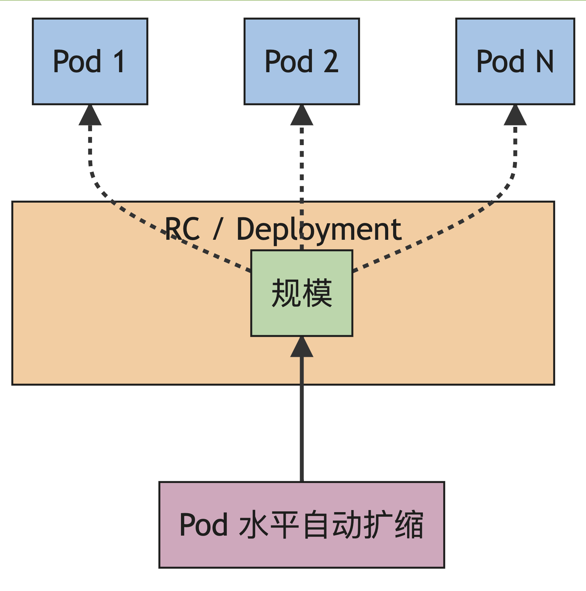
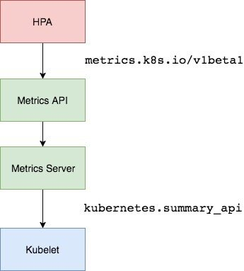
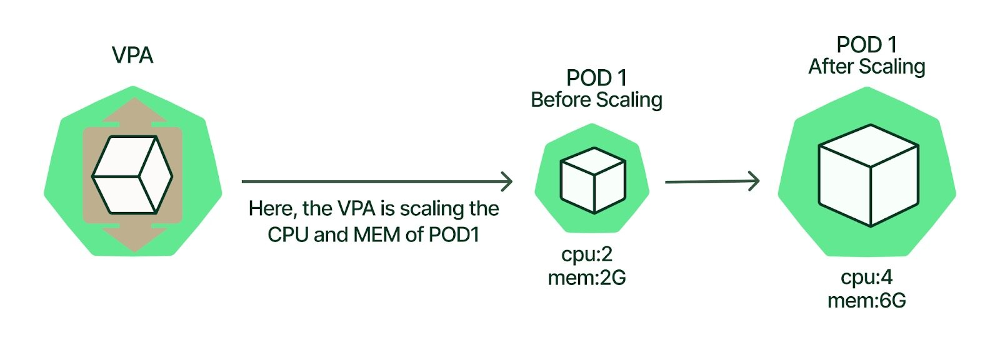
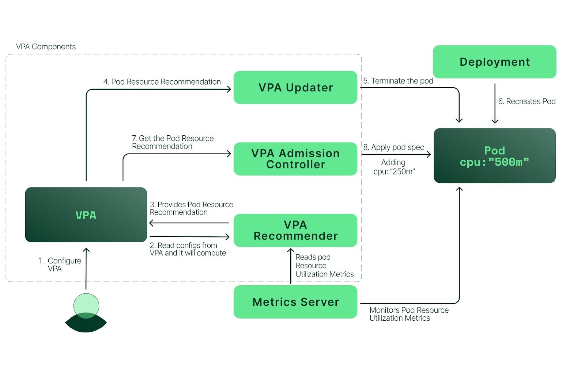

# 9.HPA与VPA

在前面的学习中我们使用了一个 `kubectl scale` 命令可以来实现 Pod 的扩缩容功能，但是这个是完全手动操作的，要应对线上的各种复杂情况，我们需要能够做到自动化去感知业务，来自动进行扩缩容。为此，Kubernetes 也为我们提供了这样的一个资源对象：`Horizontal Pod Autoscaling（Pod 水平自动伸缩）`，简称 `HPA`，HPA 通过监控分析一些控制器控制的所有 Pod 的负载变化情况来确定是否需要调整 Pod 的副本数量，在 Kubernetes 控制平面内运行的 HPA 控制器会定期调整其目标（例如：Deployment）的所需规模，以匹配观察到的指标，例如，平均 CPU 利用率、平均内存利用率或你指定的任何其他自定义指标。


## 工作原理



对于按 Pod 统计的资源指标（如 CPU），控制器从资源指标 API 中获取每一个 HorizontalPodAutoscaler 指定的 Pod 的 metrics 值，如果设置了目标使用率，控制器获取每个 Pod 中的容器资源使用情况，并计算资源使用率。如果设置了 target 值，将直接使用原始数据（不再计算百分比）。接下来，控制器根据平均的资源使用率或原始值计算出扩缩的比例，进而计算出目标副本数。

需要注意的是，如果 Pod 某些容器不支持资源采集，那么控制器将不会使用该 Pod 的 CPU 使用率。

如果 Pod 使用自定义指示，控制器机制与资源指标类似，区别在于自定义指标只使用原始值，而不是使用率。如果 Pod 使用对象指标和外部指标（每个指标描述一个对象信息）。 这个指标将直接根据目标设定值相比较，并生成一个上面提到的扩缩比例。 在 `autoscaling/v2beta2` 版本 API 中，这个指标也可以根据 Pod 数量平分后再计算。

对 Metrics API 的支持解释了这些不同 API 的稳定性保证和支持状态。

HorizontalPodAutoscaler 控制器访问支持扩缩的相应工作负载资源（例如：Deployment 和 StatefulSet）。这些资源每个都有一个名为 scale 的子资源，该接口允许你动态设置副本的数量并检查它们的每个当前状态。


## Metrics Server

Kubernetes 将水平 Pod 自动扩缩实现为一个间歇运行的控制回路（不是一个连续的过程）。间隔由 `kube-controller-manager` 的 `--horizontal-pod-autoscaler-sync-period` 参数设置（默认间隔为 15 秒）。

在每个时间段内，控制器都会根据每个 `HorizontalPodAutoscaler` 对象中指定的指标查询资源利用率。控制器找到由 `scaleTargetRef` 定义的目标资源，然后根据目标资源的 `.spec.selector` 标签选择 Pod， 并从资源 Metrics API（针对每个 Pod 的资源指标）或自定义指标获取指标 API（适用于所有其他指标）。

而 HPA 通常会从聚合 API （`metrics.k8s.io`、`custom.metrics.k8s.io` 或 `external.metrics.k8s.io`）获取指标数据。 `metrics.k8s.io` API 通常由名为 Metrics Server 的插件提供，需要单独启动。`Metrics Server` 可以通过标准的 Kubernetes API 把监控数据暴露出来，有了 `Metrics Server` 之后，我们就完全可以通过标准的 Kubernetes API 来访问我们想要获取的监控数据了：

```shell
https://10.96.0.1/apis/metrics.k8s.io/v1beta1/namespaces/<namespace-name>/pods/<pod-name>
```

比如当我们访问上面的 API 的时候，我们就可以获取到该 Pod 的资源数据，这些数据其实是来自于 kubelet 的 `Summary API` 采集而来的。不过需要说明的是我们这里可以通过标准的 API 来获取资源监控数据，并不是因为 `Metrics Server` 就是 APIServer 的一部分，而是通过 Kubernetes 提供的 `Aggregator` 汇聚插件来实现的，是独立于 APIServer 之外运行的。




### 聚合 API

`Aggregator` 允许开发人员编写一个自己的服务，把这个服务注册到 Kubernetes 的 APIServer 里面去，这样我们就可以像原生的 APIServer 提供的 API 使用自己的 API 了，我们把自己的服务运行在 Kubernetes 集群里面，然后 Kubernetes 的 `Aggregator` 通过 Service 名称就可以转发到我们自己写的 Service 里面去了。这样这个聚合层就带来了很多好处：

- 增加了 API 的扩展性，开发人员可以编写自己的 API 服务来暴露他们想要的 API。
- 丰富了 API，核心 kubernetes 团队阻止了很多新的 API 提案，通过允许开发人员将他们的 API 作为单独的服务公开，这样就无须社区繁杂的审查了。
- 开发分阶段实验性 API，新的 API 可以在单独的聚合服务中开发，当它稳定之后，在合并会 APIServer 就很容易了。
- 确保新 API 遵循 Kubernetes 约定，如果没有这里提出的机制，社区成员可能会被迫推出自己的东西，这样很可能造成社区成员和社区约定不一致。


### 安装

所以现在我们要使用 HPA，就需要在集群中安装 `Metrics Server` 服务，要安装 `Metrics Server` 就需要开启 `Aggregator`，因为 `Metrics Server` 就是通过该代理进行扩展的，不过我们集群是通过 Kubeadm 搭建的，默认已经开启了，如果是二进制方式安装的集群，需要单独配置 kube-apsierver 添加如下所示的参数：

```yaml
--requestheader-client-ca-file=<path to aggregator CA cert>
--requestheader-allowed-names=aggregator
--requestheader-extra-headers-prefix=X-Remote-Extra-
--requestheader-group-headers=X-Remote-Group
--requestheader-username-headers=X-Remote-User
--proxy-client-cert-file=<path to aggregator proxy cert>
--proxy-client-key-file=<path to aggregator proxy key>
```

如果 `kube-proxy` 没有和 APIServer 运行在同一台主机上，那么需要确保启用了如下 kube-apsierver 的参数：

```yaml
--enable-aggregator-routing=true
```

对于这些证书的生成方式，我们可以查看官方文档：[https://github.com/kubernetes-sigs/apiserver-builder-alpha/blob/master/docs/concepts/auth.md](https://github.com/kubernetes-sigs/apiserver-builder-alpha/blob/master/docs/concepts/auth.md)。

`Aggregator` 聚合层启动完成后，就可以来安装 `Metrics Server` 了，我们可以获取该仓库的官方安装资源清单：

```shell
# 官方仓库地址：https://github.com/kubernetes-sigs/metrics-server
☸ ➜ wget https://github.com/kubernetes-sigs/metrics-server/releases/download/v0.6.2/components.yaml
```

在部署之前，修改 `components.yaml` 的镜像地址为：

```yaml
# hostNetwork: true # 使用hostNetwork模式
containers:
  - name: metrics-server
    image: cnych/metrics-server:v0.6.2
```

等部署完成后，可以查看 Pod 日志是否正常：

```shell
☸ ➜ kubectl apply -f components.yaml
☸ ➜ kubectl get pods -n kube-system -l k8s-app=metrics-server
NAME                              READY   STATUS    RESTARTS   AGE
metrics-server-b5855c89c-f2ggz    0/1     Running   0          7m52s
☸ ➜ kubectl logs -f metrics-server-b5855c89c-f2ggz -n kube-system
E1220 06:25:58.932870       1 scraper.go:140] "Failed to scrape node" err="Get \"https://172.18.0.2:10250/metrics/resource\": x509: cannot validate certificate for 172.18.0.2 because it doesn't contain any IP SANs" node="demo-worker"
E1220 06:25:58.932959       1 scraper.go:140] "Failed to scrape node" err="Get \"https://172.18.0.3:10250/metrics/resource\": x509: cannot validate certificate for 172.18.0.3 because it doesn't contain any IP SANs" node="demo-worker2"
E1220 06:25:58.940568       1 scraper.go:140] "Failed to scrape node" err="Get \"https://172.18.0.4:10250/metrics/resource\": x509: cannot validate certificate for 172.18.0.4 because it doesn't contain any IP SANs" node="demo-control-plane"
I1220 06:25:58.949522       1 configmap_cafile_content.go:201] "Starting controller" name="client-ca::kube-system::extension-apiserver-authentication::client-ca-file"
I1220 06:25:58.949673       1 configmap_cafile_content.go:201] "Starting controller" name="client-ca::kube-system::extension-apiserver-authentication::requestheader-client-ca-file"
......
```

因为部署集群的时候，CA 证书并没有把各个节点的 IP 签上去，所以这里 `Metrics Server` 通过 IP 去请求时，提示签的证书没有对应的 IP（错误：`x509: cannot validate certificate for xxxx because it doesn't contain any IP SANs`），我们可以添加一个 `--kubelet-insecure-tls` 参数跳过证书校验：

```yaml
args:
  - --cert-dir=/tmp
  - --secure-port=443
  - --kubelet-preferred-address-types=InternalIP,ExternalIP,Hostname
  - --kubelet-use-node-status-port
  - --metric-resolution=15s
  - --kubelet-insecure-tls
```

然后再重新安装即可成功！可以通过如下命令来验证：

```shell
☸ ➜ kubectl apply -f components.yaml
☸ ➜ kubectl get pods -n kube-system -l k8s-app=metrics-server
NAME                              READY   STATUS    RESTARTS   AGE
metrics-server-56c5d7b58b-9bjh2   1/1     Running   0          32s
☸ ➜ kubectl logs -f metrics-server-56c5d7b58b-9bjh2 -n kube-system
I1220 06:29:32.882564       1 serving.go:342] Generated self-signed cert (/tmp/apiserver.crt, /tmp/apiserver.key)
I1220 06:29:38.865624       1 requestheader_controller.go:169] Starting RequestHeaderAuthRequestController
I1220 06:29:38.865859       1 shared_informer.go:240] Waiting for caches to sync for RequestHeaderAuthRequestController
I1220 06:29:38.867216       1 configmap_cafile_content.go:201] "Starting controller" name="client-ca::kube-system::extension-apiserver-authentication::client-ca-file"
I1220 06:29:38.868981       1 shared_informer.go:240] Waiting for caches to sync for client-ca::kube-system::extension-apiserver-authentication::client-ca-file
I1220 06:29:38.870568       1 dynamic_serving_content.go:131] "Starting controller" name="serving-cert::/tmp/apiserver.crt::/tmp/apiserver.key"
I1220 06:29:38.867210       1 configmap_cafile_content.go:201] "Starting controller" name="client-ca::kube-system::extension-apiserver-authentication::requestheader-client-ca-file"
I1220 06:29:38.871159       1 shared_informer.go:240] Waiting for caches to sync for client-ca::kube-system::extension-apiserver-authentication::requestheader-client-ca-file
I1220 06:29:38.885533       1 tlsconfig.go:240] "Starting DynamicServingCertificateController"
I1220 06:29:38.885773       1 secure_serving.go:266] Serving securely on [::]:4443
W1220 06:29:38.888701       1 shared_informer.go:372] The sharedIndexInformer has started, run more than once is not allowed
I1220 06:29:38.966546       1 shared_informer.go:247] Caches are synced for RequestHeaderAuthRequestController
I1220 06:29:38.969873       1 shared_informer.go:247] Caches are synced for client-ca::kube-system::extension-apiserver-authentication::client-ca-file
I1220 06:29:38.971307       1 shared_informer.go:247] Caches are synced for client-ca::kube-system::extension-apiserver-authentication::requestheader-client-ca-file
......
☸ ➜ kubectl get apiservice | grep metrics
v1beta1.metrics.k8s.io                 kube-system/metrics-server   True        2d21h
☸ ➜ kubectl get --raw "/apis/metrics.k8s.io/v1beta1/nodes"
{"kind":"NodeMetricsList","apiVersion":"metrics.k8s.io/v1beta1","metadata":{},"items":[{"metadata":{"name":"demo-control-plane","creationTimestamp":"2022-12-20T06:31:33Z","labels":{"beta.kubernetes.io/arch":"arm64","beta.kubernetes.io/os":"linux","kubernetes.io/arch":"arm64","kubernetes.io/hostname":"demo-control-plane","kubernetes.io/os":"linux","node-role.kubernetes.io/control-plane":"","node.kubernetes.io/exclude-from-external-load-balancers":""}},"timestamp":"2022-12-20T06:31:20Z","window":"20.06s","usage":{"cpu":"216193070n","memory":"694896Ki"}},{"metadata":{"name":"demo-worker","creationTimestamp":"2022-12-20T06:31:33Z","labels":{"beta.kubernetes.io/arch":"arm64","beta.kubernetes.io/os":"linux","kubernetes.io/arch":"arm64","kubernetes.io/hostname":"demo-worker","kubernetes.io/os":"linux"}},"timestamp":"2022-12-20T06:31:21Z","window":"20.042s","usage":{"cpu":"52906147n","memory":"203752Ki"}},{"metadata":{"name":"demo-worker2","creationTimestamp":"2022-12-20T06:31:33Z","labels":{"beta.kubernetes.io/arch":"arm64","beta.kubernetes.io/os":"linux","kubernetes.io/arch":"arm64","kubernetes.io/hostname":"demo-worker2","kubernetes.io/os":"linux"}},"timestamp":"2022-12-20T06:31:21Z","window":"20.064s","usage":{"cpu":"30671850n","memory":"132564Ki"}}]}
☸ ➜ kubectl top nodes
NAME                 CPU(cores)   CPU%   MEMORY(bytes)   MEMORY%
demo-control-plane   260m         5%     659Mi           8%
demo-worker          53m          1%     198Mi           2%
demo-worker2         36m          0%     128Mi           1%
```

现在我们可以通过 `kubectl top` 命令来获取到资源数据了，证明 `Metrics Server` 已经安装成功了。


## HPA

现在我们用 Deployment 来创建一个 Nginx Pod，然后利用 `HPA` 来进行自动扩缩容。资源清单如下所示：

```yaml
# hpa-demo.yaml
apiVersion: apps/v1
kind: Deployment
metadata:
  name: hpa-demo
spec:
  selector:
    matchLabels:
      app: nginx
  template:
    metadata:
      labels:
        app: nginx
    spec:
      containers:
        - name: nginx
          image: nginx
          ports:
            - containerPort: 80
```

然后直接创建 Deployment，注意一定先把之前创建的具有 `app=nginx` 的 Pod 先清除掉：

```shell
☸ ➜ kubectl apply -f hpa-demo.yaml
deployment.apps/hpa-demo created
☸ ➜ kubectl get pods -l app=nginx
NAME                        READY   STATUS    RESTARTS   AGE
hpa-demo-ff6774dc6-v88qw    1/1     Running   0          56s
```

现在我们来创建一个 `HPA` 资源对象，可以使用 `kubectl autoscale` 命令来创建：

```shell
☸ ➜ kubectl autoscale deployment hpa-demo --cpu-percent=10 --min=1 --max=10
horizontalpodautoscaler.autoscaling/hpa-demo autoscaled
☸ ➜ kubectl get hpa
NAME       REFERENCE             TARGETS         MINPODS   MAXPODS   REPLICAS   AGE
hpa-demo   Deployment/hpa-demo   <unknown>/10%   1         10        0          4s
```

此命令创建了一个关联资源 hpa-demo 的 HPA，最小的 Pod 副本数为 1，最大为 10。HPA 会根据设定的 cpu 使用率（10%）动态的增加或者减少 Pod 数量。

当然我们依然还是可以通过创建 YAML 文件的形式来创建 HPA 资源对象。如果我们不知道怎么编写的话，可以查看上面命令行创建的 HPA 的 YAML 文件：

```shell
☸ ➜ kubectl get hpa hpa-demo -o yaml
apiVersion: autoscaling/v2
kind: HorizontalPodAutoscaler
metadata:
  creationTimestamp: "2022-12-20T06:33:28Z"
  name: hpa-demo
  namespace: default
  resourceVersion: "484312"
  uid: 4907fadd-348b-46f1-a954-d08a13c11c98
spec:
  maxReplicas: 10
  metrics:
  - resource:
      name: cpu
      target:
        averageUtilization: 10
        type: Utilization
    type: Resource
  minReplicas: 1
  scaleTargetRef:
    apiVersion: apps/v1
    kind: Deployment
    name: hpa-demo
status:
  conditions:
  - lastTransitionTime: "2022-12-20T06:33:43Z"
    message: the HPA controller was able to get the target's current scale
    reason: SucceededGetScale
    status: "True"
    type: AbleToScale
  - lastTransitionTime: "2022-12-20T06:33:43Z"
    message: 'the HPA was unable to compute the replica count: failed to get cpu utilization:
      missing request for cpu'
    reason: FailedGetResourceMetric
    status: "False"
    type: ScalingActive
  currentMetrics: null
  currentReplicas: 1
  desiredReplicas: 0
```

然后我们可以根据上面的 YAML 文件就可以自己来创建一个基于 YAML 的 HPA 描述文件了。但是我们发现上面信息里面出现了一些 Fail 信息，我们来查看下这个 HPA 对象的信息：

```shell
☸ ➜ kubectl describe hpa hpa-demo
Name:                                                  hpa-demo
Namespace:                                             default
Labels:                                                <none>
Annotations:                                           <none>
CreationTimestamp:                                     Tue, 20 Dec 2022 14:33:28 +0800
Reference:                                             Deployment/hpa-demo
Metrics:                                               ( current / target )
  resource cpu on pods  (as a percentage of request):  <unknown> / 10%
Min replicas:                                          1
Max replicas:                                          10
Deployment pods:                                       1 current / 0 desired
Conditions:
  Type           Status  Reason                   Message
  ----           ------  ------                   -------
  AbleToScale    True    SucceededGetScale        the HPA controller was able to get the target's current scale
  ScalingActive  False   FailedGetResourceMetric  the HPA was unable to compute the replica count: failed to get cpu utilization: missing request for cpu
Events:
  Type     Reason                        Age               From                       Message
  ----     ------                        ----              ----                       -------
  Warning  FailedGetResourceMetric       4s (x3 over 34s)  horizontal-pod-autoscaler  failed to get cpu utilization: missing request for cpu
  Warning  FailedComputeMetricsReplicas  4s (x3 over 34s)  horizontal-pod-autoscaler  invalid metrics (1 invalid out of 1), first error is: failed to get cpu resource metric value: failed to get cpu utilization: missing request for cpu
```

我们可以看到上面的事件信息里面出现了 `failed to get cpu utilization: missing request for cpu` 这样的错误信息。这是因为我们上面创建的 Pod 对象**没有添加 request 资源**声明，这样导致 HPA 读取不到 CPU 指标信息，所以如果要想让 HPA 生效，对应的 Pod 资源必须添加 requests 资源声明，更新我们的资源清单文件：

```yaml
apiVersion: apps/v1
kind: Deployment
metadata:
  name: hpa-demo
spec:
  selector:
    matchLabels:
      app: nginx
  template:
    metadata:
      labels:
        app: nginx
    spec:
      containers:
        - name: nginx
          image: nginx
          ports:
            - containerPort: 80
          resources:
            requests:
              memory: 50Mi
              cpu: 50m
```

然后重新更新 Deployment，重新创建 HPA 对象：

```shell
☸ ➜ kubectl apply -f hpa-demo.yaml
deployment.apps/hpa-demo configured
☸ ➜ kubectl get pods -o wide -l app=nginx
NAME                      READY   STATUS    RESTARTS   AGE     IP           NODE          NOMINATED NODE   READINESS GATES
hpa-demo-f5597c99-pt4lh   1/1     Running   0          2m29s   10.244.1.4   demo-worker   <none>           <none>
☸ ➜ kubectl delete hpa hpa-demo
☸ ➜ kubectl autoscale deployment hpa-demo --cpu-percent=10 --min=1 --max=10
☸ ➜ kubectl describe hpa hpa-demo
Name:                                                  hpa-demo
Namespace:                                             default
Labels:                                                <none>
Annotations:                                           <none>
CreationTimestamp:                                     Tue, 20 Dec 2022 14:38:38 +0800
Reference:                                             Deployment/hpa-demo
Metrics:                                               ( current / target )
  resource cpu on pods  (as a percentage of request):  0% (0) / 10%
Min replicas:                                          1
Max replicas:                                          10
Deployment pods:                                       1 current / 1 desired
Conditions:
  Type            Status  Reason               Message
  ----            ------  ------               -------
  AbleToScale     True    ScaleDownStabilized  recent recommendations were higher than current one, applying the highest recent recommendation
  ScalingActive   True    ValidMetricFound     the HPA was able to successfully calculate a replica count from cpu resource utilization (percentage of request)
  ScalingLimited  False   DesiredWithinRange   the desired count is within the acceptable range
Events:           <none>
☸ ➜ kubectl get hpa
NAME       REFERENCE             TARGETS   MINPODS   MAXPODS   REPLICAS   AGE
hpa-demo   Deployment/hpa-demo   0%/10%    1         10        1          49s
```

现在可以看到 HPA 资源对象已经正常了，现在我们来增大负载进行测试，我们来创建一个 busybox 的 Pod，并且循环访问上面创建的 Pod：

```shell
☸ ➜ kubectl run -it --image busybox test-hpa --restart=Never --rm /bin/sh
If you don't see a command prompt, try pressing enter.
/ # while true; do wget -q -O- http://10.244.1.4; done
```

然后观察 Pod 列表，可以看到，HPA 已经开始工作：

```shell
☸ ➜ kubectl get hpa
NAME       REFERENCE             TARGETS    MINPODS   MAXPODS   REPLICAS   AGE
hpa-demo   Deployment/hpa-demo   140%/10%   1         10        1          2m
☸ ➜ kubectl get pods -l app=nginx --watch
NAME                      READY   STATUS    RESTARTS   AGE
hpa-demo-f5597c99-pt4lh   1/1     Running   0          4m23s
hpa-demo-f5597c99-fgjrx   0/1     Pending   0          0s
hpa-demo-f5597c99-4h2df   0/1     Pending   0          0s
hpa-demo-f5597c99-l5x2q   0/1     Pending   0          0s
hpa-demo-f5597c99-4h2df   0/1     ContainerCreating   0          1s
# ......
```

我们可以看到已经自动拉起了很多新的 Pod，最后会定格在了我们上面设置的 10 个 Pod，同时查看资源 hpa-demo 的副本数量，副本数量已经从原来的 1 变成了 10 个：

```shell
☸ ➜ kubectl get deploy hpa-demo
NAME       READY   UP-TO-DATE   AVAILABLE   AGE
hpa-demo   10/10   10           10          9m12s
```

查看 HPA 资源的对象了解工作过程：

```shell
☸ ➜ kubectl describe hpa hpa-demo
Name:                                                  hpa-demo
Namespace:                                             default
Labels:                                                <none>
Annotations:                                           <none>
CreationTimestamp:                                     Tue, 20 Dec 2022 14:38:38 +0800
Reference:                                             Deployment/hpa-demo
Metrics:                                               ( current / target )
  resource cpu on pods  (as a percentage of request):  24% (12m) / 10%
Min replicas:                                          1
Max replicas:                                          10
Deployment pods:                                       10 current / 10 desired
Conditions:
  Type            Status  Reason               Message
  ----            ------  ------               -------
  AbleToScale     True    ScaleDownStabilized  recent recommendations were higher than current one, applying the highest recent recommendation
  ScalingActive   True    ValidMetricFound     the HPA was able to successfully calculate a replica count from cpu resource utilization (percentage of request)
  ScalingLimited  True    TooManyReplicas      the desired replica count is more than the maximum replica count
Events:
  Type    Reason             Age   From                       Message
  ----    ------             ----  ----                       -------
  Normal  SuccessfulRescale  78s   horizontal-pod-autoscaler  New size: 4; reason: cpu resource utilization (percentage of request) above target
  Normal  SuccessfulRescale  63s   horizontal-pod-autoscaler  New size: 8; reason: cpu resource utilization (percentage of request) above target
  Normal  SuccessfulRescale  47s   horizontal-pod-autoscaler  New size: 10; reason: cpu resource utilization (percentage of request) above target
```

同样的这个时候我们来关掉 busybox 来减少负载，然后等待一段时间观察下 HPA 和 Deployment 对象：

```shell
☸ ➜ kubectl get hpa
NAME       REFERENCE             TARGETS   MINPODS   MAXPODS   REPLICAS   AGE
hpa-demo   Deployment/hpa-demo   0%/10%    1         10        10         3m46s
☸ ➜ kubectl get deployment hpa-demo
NAME       READY   UP-TO-DATE   AVAILABLE   AGE
hpa-demo   1/1     1            1           24m
```

> 从 Kubernetes `v1.12` 版本开始我们可以通过设置 `kube-controller-manager` 组件的`--horizontal-pod-autoscaler-downscale-stabilization` 参数来设置一个持续时间，用于指定在当前操作完成后，`HPA` 必须等待多长时间才能执行另一次缩放操作。默认为 5 分钟，也就是默认需要等待 5 分钟后才会开始自动缩放。


可以看到副本数量已经由 10 变为 1，当前我们只是演示了 CPU 使用率这一个指标，在后面的课程中我们还会学习到根据自定义的监控指标来自动对 Pod 进行扩缩容。


## 内存

要使用基于内存或者自定义指标进行扩缩容（现在的版本都必须依赖 metrics-server 这个项目）。现在我们再用 Deployment 来创建一个 Nginx Pod，然后利用 HPA 来进行自动扩缩容。资源清单如下所示：

```yaml
# hpa-mem-demo.yaml
apiVersion: apps/v1
kind: Deployment
metadata:
  name: hpa-mem-demo
spec:
  selector:
    matchLabels:
      app: nginx
  template:
    metadata:
      labels:
        app: nginx
    spec:
      volumes:
        - name: increase-mem-script
          configMap:
            name: increase-mem-config
      containers:
        - name: nginx
          image: nginx
          ports:
            - containerPort: 80
          volumeMounts:
            - name: increase-mem-script
              mountPath: /etc/script
          resources:
            requests:
              memory: 50Mi
              cpu: 50m
          securityContext:
            privileged: true
```

这里和前面普通的应用有一些区别，我们将一个名为 `increase-mem-config` 的 ConfigMap 资源对象挂载到了容器中，该配置文件是用于后面增加容器内存占用的脚本，配置文件如下所示：

```yaml
# increase-mem-cm.yaml
apiVersion: v1
kind: ConfigMap
metadata:
  name: increase-mem-config
data:
  increase-mem.sh: |
    #!/bin/bash
    mkdir /tmp/memory
    mount -t tmpfs -o size=40M tmpfs /tmp/memory
    dd if=/dev/zero of=/tmp/memory/block
    sleep 60
    rm /tmp/memory/block
    umount /tmp/memory
    rmdir /tmp/memory
```

由于这里增加内存的脚本需要使用到 `mount` 命令，这需要声明为特权模式，所以我们添加了 `securityContext.privileged=true` 这个配置。现在我们直接创建上面的资源对象即可：

```shell
☸ ➜ kubectl apply -f increase-mem-cm.yaml
☸ ➜ kubectl apply -f hpa-mem-demo.yaml
☸ ➜ kubectl get pods -l app=nginx
NAME                            READY   STATUS    RESTARTS   AGE
hpa-mem-demo-6f6455888b-m7tqj   1/1     Running   0          17s
```

然后需要创建一个基于内存的 HPA 资源对象：

```yaml
# hpa-mem.yaml
apiVersion: autoscaling/v2
kind: HorizontalPodAutoscaler
metadata:
  name: hpa-mem-demo
  namespace: default
spec:
  maxReplicas: 5
  minReplicas: 1
  scaleTargetRef:
    apiVersion: apps/v1
    kind: Deployment
    name: hpa-mem-demo
  metrics: # 指定内存的一个配置
    - type: Resource
      resource:
        name: memory
        target:
          type: Utilization
          averageUtilization: 30
```

要注意这里使用的 `apiVersion` 是 `autoscaling/v2`，然后 `metrics` 属性里面指定的是内存的配置，直接创建上面的资源对象即可：

```shell
☸ ➜ kubectl apply -f hpa-mem.yaml
☸ ➜ kubectl get hpa
NAME           REFERENCE                 TARGETS   MINPODS   MAXPODS   REPLICAS   AGE
hpa-mem-demo   Deployment/hpa-mem-demo   9%/30%    1         5         1          49s
```

到这里证明 HPA 资源对象已经部署成功了，接下来我们对应用进行压测，将内存压上去，直接执行上面我们挂载到容器中的 `increase-mem.sh` 脚本即可：

```shell
☸ ➜ kubectl exec -it hpa-mem-demo-6f6455888b-m7tqj -- /bin/bash
root@hpa-mem-demo-6f6455888b-m7tqj:/# ls /etc/script/
increase-mem.sh
root@hpa-mem-demo-6f6455888b-m7tqj:/# source /etc/script/increase-mem.sh
dd: writing to '/tmp/memory/block': No space left on device
81921+0 records in
81920+0 records out
41943040 bytes (42 MB, 40 MiB) copied, 0.193129 s, 217 MB/s
```

然后打开另外一个终端观察 HPA 资源对象的变化情况：

```shell
☸ ➜ kubectl get hpa -w
NAME           REFERENCE                 TARGETS   MINPODS   MAXPODS   REPLICAS   AGE
hpa-mem-demo   Deployment/hpa-mem-demo   92%/30%   1         5         1          3m30s
☸ ➜ kubectl describe hpa hpa-mem-demo
Warning: autoscaling/v2beta2 HorizontalPodAutoscaler is deprecated in v1.23+, unavailable in v1.26+; use autoscaling/v2 HorizontalPodAutoscaler
Name:                                                     hpa-mem-demo
Namespace:                                                default
Labels:                                                   <none>
Annotations:                                              <none>
CreationTimestamp:                                        Tue, 20 Dec 2022 14:59:02 +0800
Reference:                                                Deployment/hpa-mem-demo
Metrics:                                                  ( current / target )
  resource memory on pods  (as a percentage of request):  92% (48390144) / 30%
Min replicas:                                             1
Max replicas:                                             5
Deployment pods:                                          1 current / 4 desired
Conditions:
  Type            Status  Reason              Message
  ----            ------  ------              -------
  AbleToScale     True    SucceededRescale    the HPA controller was able to update the target scale to 4
  ScalingActive   True    ValidMetricFound    the HPA was able to successfully calculate a replica count from memory resource utilization (percentage of request)
  ScalingLimited  False   DesiredWithinRange  the desired count is within the acceptable range
Events:
  Type    Reason             Age   From                       Message
  ----    ------             ----  ----                       -------
  Normal  SuccessfulRescale  11s   horizontal-pod-autoscaler  New size: 4; reason: memory resource utilization (percentage of request) above target
☸ ➜ kubectl top pod hpa-mem-demo-6f6455888b-m7tqj
NAME                            CPU(cores)   MEMORY(bytes)
hpa-mem-demo-6f6455888b-m7tqj   0m           41Mi
```

可以看到内存使用已经超过了我们设定的 30% 这个阈值了，HPA 资源对象也已经触发了自动扩容，变成了 4 个副本了：

```shell
☸ ➜ kubectl get pods -l app=nginx
hpa-mem-demo-6f6455888b-jmmvl   1/1     Running   0          33s
hpa-mem-demo-6f6455888b-m7tqj   1/1     Running   0          12m
hpa-mem-demo-6f6455888b-qhh6k   1/1     Running   0          33s
hpa-mem-demo-6f6455888b-rnljn   1/1     Running   0          33s
test-hpa                        1/1     Running   0          23m
```

当内存释放掉后，controller-manager 默认 5 分钟过后会进行缩放，到这里就完成了基于内存的 HPA 操作。


## 扩缩容行为

如果使用 v2 版本的 HPA API，我们还可以使用 `behavior` 字段来配置单独的放大和缩小行为，可以通过在 `behavior` 字段下设置 `scaleUp` 和/或 `scaleDown` 来指定这些行为。

你可以指定一个**稳定窗口**，以防止扩缩目标的副本计数发生波动，扩缩策略还允许你在扩缩时控制副本的变化率。

**扩缩策略**

可以在 behavior 部分中指定一个或多个扩缩策略，当指定多个策略时，允许最大更改量的策略是默认选择的策略，如下示例显示了缩小时的这种行为：

```yaml
behavior:
  scaleDown:
    policies:
      - type: Pods
        value: 4
        periodSeconds: 60
      - type: Percent
        value: 10
        periodSeconds: 60
```

`periodSeconds` 表示在过去的多长时间内要求策略值为真，第一个策略（Pods）表示允许在一分钟内最多缩容 4 个副本，第二个策略（Percent）表示允许在一分钟内最多缩容当前副本个数的百分之十。

由于默认情况下会选择容许更大程度作出变更的策略，只有 Pod 副本数大于 40 时，第二个策略才会被采用。如果副本数为 40 或者更少，则应用第一个策略。例如，如果有 80 个副本，并且目标必须缩小到 10 个副本，那么在第一步中将减少 8 个副本。在下一轮迭代中，当副本的数量为 72 时，10% 的 Pod 数为 7.2，但是这个数字向上取整为 8。在 autoscaler 控制器的每个循环中，将根据当前副本的数量重新计算要更改的 Pod 数量，当副本数量低于 40 时，应用第一个策略（Pods），一次减少 4 个副本。

**稳定窗口**

当用于扩缩的指标不断波动时，稳定窗口用于限制副本计数的波动。自动扩缩算法使用此窗口来推断先前的期望状态并避免对工作负载规模进行不必要的更改。例如，在以下示例中，为 `scaleDown` 指定了稳定窗口。

```yaml
behavior:
  scaleDown:
    stabilizationWindowSeconds: 300
```

当指标显示目标应该缩容时，自动扩缩算法查看之前计算的期望状态，并使用指定时间间隔内的最大值。在上面的例子中，过去 5 分钟的所有期望状态都会被考虑。

这近似于滚动最大值，并避免了扩缩算法频繁删除 Pod 而又触发重新创建等效 Pod。

**默认行为**

要使用自定义扩缩，也不需要指定所有字段，只有需要自定义的字段才需要指定。这些自定义值与默认值合并。默认值与 HPA 算法中的现有行为匹配。

```yaml
behavior:
  scaleDown:
    stabilizationWindowSeconds: 300
    policies:
      - type: Percent
        value: 100
        periodSeconds: 15
  scaleUp:
    stabilizationWindowSeconds: 0
    policies:
      - type: Percent
        value: 100
        periodSeconds: 15
      - type: Pods
        value: 4
        periodSeconds: 15
    selectPolicy: Max # Min 意味着会选择影响 Pod 数量最小的策略，Disabled 会关闭对指定方向的缩容
```

用于缩小稳定窗口的时间为 300 秒（或是 `--horizontal-pod-autoscaler-downscale-stabilization` 参数设定值）。只有一种缩容的策略，允许 100% 删除当前运行的副本，这意味着扩缩目标可以缩小到允许的最小副本数。对于扩容，没有稳定窗口，当指标显示目标应该扩容时，目标会立即扩容。这里有两种策略，每 15 秒添加 4 个 Pod 或 100% 当前运行的副本数，直到 HPA 达到稳定状态。


## VPA

VPA 全称 `VerticalPodAutoscaler`，即 Pod 的纵向扩缩容，和 HPA 是相对应的，其根据容器资源使用率自动设置 CPU 和内存的 requests 及 limit，从而允许在节点上进行适当的调度，以便为每个 Pod 提供适当的资源。它既可以缩小过度请求资源的容器，也可以根据其使用情况随时提升资源不足的容量。我们可以通过 VPA 来自动资源配置提升管理效率、提高集群资源利用率。

例如，你有一个 Pod 使用了 CPU 的 50%，但只请求 10%，VPA 会认定该 Pod 消耗的 CPU 多于请求的 CPU，并删除 Pod。工作负载对象（如副本集）会重启 Pod，VPA 使用推荐的资源更新新 Pod。对于开发人员，你可以使用 VPA 来帮助确保 Pod 在高负载时可以继续工作，具体方法是将 Pod 调度到每个 Pod 具有适当资源的节点上。

管理员可以使用 VPA 来更好地利用集群资源，例如防止 Pod 保留比所需的 CPU 资源更多的资源。VPA 监控实际使用的工作负载，并对资源进行调整，以确保可以满足其他工作负载的需要。VPA 还维护初始容器配置中指定的限值和请求之间的比例。



VPA 主要由三个组件组成，分别为 `recommender`、`updater`、`admission-controller`。

- `recommender`：引入 `VerticalPodAutoscaler` 对象，其由 Pod 的标签选择器、资源策略（控制 VPA 如何计算资源）、更新策略（控制如何将更改应用于 Pod）和推荐的 Pod 资源组成，其根据 `metric-server` 获取到的容器指标并观测 OOM 事件，计算推荐指标，最终更新 `VerticalPodAutoscaler` 对象
- `updater`：其是负责 Pod 更新的组件。如果 Pod 在 `Auto` 模式下使用 VPA，则 `Updater` 可以决定使用推荐器资源对其进行更新。这只是通过驱逐 Pod 以便使用新资源重新创建它来实现的。简单来说，其是根据 pod 的 request 中设置的指标和 recommend 计算的推荐指标，在一定条件下驱逐 pod，
- `admission-controller`：这是一个 webhook 组件，所有 Pod 创建请求都通过 VPA Admission Controller，如果 Pod 与 VerticalPodAutoscaler 对象匹配，把 recommend 计算出的指标应用到 pod 的 request 和 limit，如果 Recommender 不可用，它会回退到 VPA 对象中缓存的推荐。



使用 VPA 主要会用到两个资源：`VerticalPodAutoscaler` 、`VerticalPodAutoscalerCheckpoint`。

- `VerticalPodAutoscaler`：该资源由用户创建，用于设置纵向扩容的目标对象和存储 recommend 组件计算出的推荐指标。
- `VerticalPodAutoscalerCheckpoint`：该资源由 recommend 组件创建和维护，用于存储指标相关信息，一个 vpa 对应的多个容器，每个容器创建一个该资源。

VPA 也需要依赖 `metrics-server`，所以也需要提前安装。然后我们可以通过下面命令来安装 VPA 相关组件。

```bash
☸ ➜ git clone https://github.com/kubernetes/autoscaler.git
☸ ➜ cd autoscaler/vertical-pod-autoscaler
☸ ➜ ./hack/vpa-up.sh
```

默认 VPA 使用的是 `k8s.gcr.io` 的镜像，如果不能正常拉取镜像，可以重新修改下镜像地址。

```bash
☸ ➜ kubectl edit deploy vpa-admission-controller -n kube-system
# ......
# image: k8s.gcr.io/autoscaling/vpa-admission-controller:0.12.0
image: cnych/vpa-admission-controller:0.12.0
# ......
☸ ➜ kubectl edit deploy vpa-recommender -n kube-system
# ......
# image: k8s.gcr.io/autoscaling/vpa-recommender:0.12.0
image: cnych/vpa-recommender:0.12.0
# ......
☸ ➜ kubectl edit deploy vpa-recommender -n kube-system
# ......
# image: k8s.gcr.io/autoscaling/vpa-updater:0.12.0
image: cnych/vpa-updater:0.12.0
# ......
```

部署完成后会在 `kube-system` 命名空间下面启动 3 个 Pod：

```bash
☸ ➜ kubectl get pods -n kube-system |grep vpa
vpa-admission-controller-64cb9cfb4b-5qvpn    1/1     Running   0              12m
vpa-recommender-6fdd69df6c-gprsl             1/1     Running   0              12m
vpa-updater-8567bff646-wnw5d                 1/1     Running   0              12m
```

接下来我们就可以来了解下如何使用 VPA。首先创建一个如下所示的普通的应用：

```yaml
# vpa-demo.yaml
apiVersion: apps/v1
kind: Deployment
metadata:
  name: vpa-demo
spec:
  replicas: 1
  selector:
    matchLabels:
      app: vpa
  template:
    metadata:
      labels:
        app: vpa
    spec:
      containers:
        - image: nginx
          name: nginx
          resources:
            requests:
              cpu: 20m
              memory: 25Mi
```

直接应用该资源即可：

```bash
☸ ➜ kubectl apply -f vpa-demo.yaml
☸ ➜ kubectl get pods -o wide
NAME                        READY   STATUS    RESTARTS   AGE    IP            NODE          NOMINATED NODE   READINESS GATES
vpa-demo-5968fdf4df-tct6k   1/1     Running   0          106s   10.244.1.14   demo-worker   <none>           <none>
☸ ➜ curl -I 10.244.1.14
HTTP/1.1 200 OK
Server: nginx/1.23.3
# ......
```

接下来我们就可以创建一个 VPA 对象，我们这里使用 `updateMode: "Off"` 模式，其仅计算资源的推荐而不应用 Pod:

```yaml
# nginx-vpa-test.yaml
apiVersion: autoscaling.k8s.io/v1beta2
kind: VerticalPodAutoscaler
metadata:
  name: nginx-vpa-test
spec:
  targetRef:
    apiVersion: apps/v1
    kind: Deployment
    name: vpa-demo
  updatePolicy:
    updateMode: "Off" # 必须带双引号
  resourcePolicy:
    containerPolicies:
      - containerName: nginx
        minAllowed:
          cpu: 50m
          memory: 50Mi
        maxAllowed:
          cpu: 1000m
          memory: 1024M
```

同样直接应用该资源对象即可：

```bash
☸ ➜ kubectl apply -f nginx-vpa-test.yaml
verticalpodautoscaler.autoscaling.k8s.io/nginx-vpa-test created
☸ ➜ kubectl get vpa
NAME             MODE   CPU    MEM       PROVIDED   AGE
nginx-vpa-test   Off    143m   262144k   True       33s
```

我们可以通过 `kubectl describe` 命令来查看该 VPA 对象：

```bash
☸ ➜ kubectl describe vpa nginx-vpa-test
Name:         nginx-vpa-test
Namespace:    default
Labels:       <none>
Annotations:  <none>
API Version:  autoscaling.k8s.io/v1
Kind:         VerticalPodAutoscaler
# ......
Spec:
  Resource Policy:
    Container Policies:
      Container Name:  nginx
      Max Allowed:
        Cpu:     1000m
        Memory:  1024Mi
      Min Allowed:
        Cpu:     50m
        Memory:  50Mi
  Target Ref:
    API Version:  apps/v1
    Kind:         Deployment
    Name:         vpa-demo
  Update Policy:
    Update Mode:  Off
Status:
  Conditions:
    Last Transition Time:  2022-12-20T08:36:54Z
    Status:                True
    Type:                  RecommendationProvided
  Recommendation:
    Container Recommendations:
      Container Name:  nginx
      Lower Bound:
        Cpu:     50m
        Memory:  262144k
      Target:
        Cpu:     143m
        Memory:  262144k
      Uncapped Target:
        Cpu:     143m
        Memory:  262144k
      Upper Bound:
        Cpu:     1
        Memory:  645982758
Events:          <none>
```

我们可以看到推荐由四部分组成，其中 `lower` 为下限值，`target` 为推荐值，而 `upper` 为上限值，其中 `uncap` 为实际值。

同样我们可以来对应用进行压测，创建一个 busybox 的 Pod，循环访问上面创建的 Pod：

```shell
☸ ➜ kubectl run -it --image busybox test-vpa --restart=Never --rm /bin/sh
If you don't see a command prompt, try pressing enter.
/ # while true; do wget -q -O- http://10.244.1.14; done
```

此时我们可以观察 VPA 给出的推荐值：

```bash
☸ ➜ kubectl describe vpa nginx-vpa |tail -n 20
    Last Transition Time:  2022-12-20T08:36:54Z
    Status:                True
    Type:                  RecommendationProvided
  Recommendation:
    Container Recommendations:
      Container Name:  nginx
      Lower Bound:
        Cpu:     50m
        Memory:  262144k
      Target:
        Cpu:     143m
        Memory:  262144k
      Uncapped Target:
        Cpu:     143m
        Memory:  262144k
      Upper Bound:
        Cpu:     1
        Memory:  603986583
Events:          <none>
```

从上面可以看到给出的 `Target` 为 `143m`，因为设置 `updateMode:"Off"`，所以不会应用到 Pod。

VPA 中的 `UpdateMode` 有多个有效的选项。他们是：

- `Auto` 和 `Recreate` 模式会在 pod 生命周期内自动应用 VPA 对 CPU 和内存建议。VPA 会删除项目中任何与建议不兼容的 pod。当由工作负载对象重新部署时，VPA 会在其建议中更新新 pod。
- `Initial` 模式仅在创建 pod 时自动应用 VPA 建议。
- `Off` 模式只提供推荐的资源限制和请求信息，用户可以手动应用其中的建议。off 模式不会更新 pod。

当然 VPA 也并不是万能的，具有一些局限性，在使用的时候以下注意事项值得我们关注：

- 不要将 VPA 与 HPA 一起使用，后者基于相同的资源指标（例如 CPU 和 MEMORY 使用率）进行缩放。这是因为当指标(CPU/MEMORY)达到其定义的阈值时，VPA 和 HPA 将同时发生缩放事件，这可能会产生未知的副作用并可能导致问题。
- VPA 可能会推荐比集群中可用的资源更多的资源，从而导致 Pod 未分配给节点（由于资源不足），因此永远不会运行。
- VPA 不会驱逐不在控制器下运行的 pod，驱逐可以单独处理

为了能够自动资源配置提升管理效率、提高集群资源利用率，除了 VPA 之外，我们后续还会学习其他更智能更适合生产环境使用的工具，不过 VPA 的实现思路值得我们学习。


> 原文: <https://www.yuque.com/cnych/k8s4/aeg6w370rwuz9nl3>