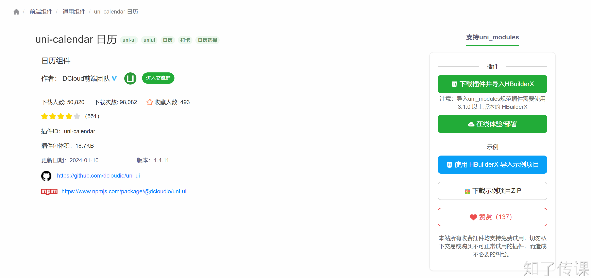

# 第三节：常用组件

`uni-app`中的组件包含内置组件和`uni-ui`组件库。内置组件库无须安装即可使用，而`uni-ui`组件库需要安装才可使用。

## 一、内置组件
### text组件
+ `text` 组件相当于行内标签、在同一行显示
+ 除了文本节点以外的其他节点都无法长按选中

text组件的相关属性如下：

| 属性 | 类型 | 默认值 | 必填 | 说明 |
| :---: | :---: | :---: | :---: | :---: |
| selectable | boolean | false | 否 | 文本是否可选 |
| space | string | . | 否 | 显示连续空格，可选参数：`ensp`、`emsp`、`nbsp` |
| decode | boolean | false | 否 | 是否解码 |


示例代码如下：

```html
<view>
  <text selectable>长按可复制</text>
</view>

<view>
  <text>长按不可复制</text>
</view>

<view>
  <text space='ensp'>中文  字符空格一半大小</text>
</view>
<view>
  <text space='emsp'>中文  字符空格大小</text>
</view>
<view>
  <text space='nbsp'>根据字体  设置的空格大小</text>
</view>
```

+ <font style="color:rgb(44, 62, 80);">支持 </font>`<font style="color:rgb(233, 105, 0);">\n</font>`<font style="color:rgb(44, 62, 80);"> 方式换行。</font>
+ <font style="color:rgb(44, 62, 80);">decode 可以解析的有</font><font style="color:rgb(44, 62, 80);"> </font>`<font style="color:rgb(233, 105, 0);">&nbsp;</font>`<font style="color:rgb(44, 62, 80);"> </font>`<font style="color:rgb(233, 105, 0);">&lt;</font>`<font style="color:rgb(44, 62, 80);"> </font>`<font style="color:rgb(233, 105, 0);">&gt;</font>`<font style="color:rgb(44, 62, 80);"> </font>`<font style="color:rgb(233, 105, 0);">&amp;</font>`<font style="color:rgb(44, 62, 80);"> </font>`<font style="color:rgb(233, 105, 0);">&apos;</font>`<font style="color:rgb(44, 62, 80);"> </font>`<font style="color:rgb(233, 105, 0);">&ensp;</font>`<font style="color:rgb(44, 62, 80);"> </font>`<font style="color:rgb(233, 105, 0);">&emsp;</font>`<font style="color:rgb(44, 62, 80);">。</font>
+ <font style="color:rgb(44, 62, 80);">各个操作系统的空格标准并不一致。</font>
+ <font style="color:rgb(44, 62, 80);">除了文本节点以外的其他节点都无法长按选中。</font>
+ <font style="color:rgb(44, 62, 80);">如果使用 </font>`<font style="color:rgb(233, 105, 0);"><span></font>`<font style="color:rgb(44, 62, 80);"> 组件编译时会被转换为 </font>`<font style="color:rgb(233, 105, 0);"><text></font>`<font style="color:rgb(44, 62, 80);">。</font>

<font style="color:rgb(44, 62, 80);">更多请参考：</font>[https://zh.uniapp.dcloud.io/component/text.html](https://zh.uniapp.dcloud.io/component/text.html)

### <font style="color:rgb(44, 62, 80);">view组件</font>
view组件相当于HTML中的div。常用属性如下：

| <font style="color:rgb(44, 62, 80);">属性名</font> | <font style="color:rgb(44, 62, 80);">类型</font> | <font style="color:rgb(44, 62, 80);">默认值</font> | <font style="color:rgb(44, 62, 80);">说明</font> |
| :--- | :--- | :--- | :--- |
| <font style="color:rgb(44, 62, 80);">hover-class</font> | <font style="color:rgb(44, 62, 80);">String</font> | <font style="color:rgb(44, 62, 80);">none</font> | <font style="color:rgb(44, 62, 80);">指定按下去的样式类。当 hover-class="none" 时，没有点击态效果</font> |
| <font style="color:rgb(44, 62, 80);">hover-stop-propagation</font> | <font style="color:rgb(44, 62, 80);">Boolean</font> | <font style="color:rgb(44, 62, 80);">false</font> | <font style="color:rgb(44, 62, 80);">指定是否阻止本节点的祖先节点出现点击态，App、H5、支付宝小程序、百度小程序不支持（支付宝小程序、百度小程序文档中都有此属性，实测未支持）</font> |
| <font style="color:rgb(44, 62, 80);">hover-start-time</font> | <font style="color:rgb(44, 62, 80);">Number</font> | <font style="color:rgb(44, 62, 80);">50</font> | <font style="color:rgb(44, 62, 80);">按住后多久出现点击态，单位毫秒</font> |
| <font style="color:rgb(44, 62, 80);">hover-stay-time</font> | <font style="color:rgb(44, 62, 80);">Number</font> | <font style="color:rgb(44, 62, 80);">400</font> | <font style="color:rgb(44, 62, 80);">手指松开后点击态保留时间，单位毫秒</font> |


<font style="color:rgb(44, 62, 80);">示例代码如下：</font>

```html
<view class="box2" hover-class="box2_active">
  <view class='box1' hover-class='active' hover-stop-propagation :hover-start-time="2000" :hover-stay-time='2000'>

  </view>
</view>
```

更多请参考：[https://zh.uniapp.dcloud.io/component/view.html](https://zh.uniapp.dcloud.io/component/view.html)

### button组件
按钮组件，`button`组件默认独占一行，设置`size`为`mini`时可以在一行显示多个。其常用属性

| 属性名 | 类型 | 默认值 | 说明 |
| :---: | :---: | :---: | :---: |
| size | String | default | 按钮的大小 |
| type | String | default | 按钮的样式类型 |
| plain | Boolean | false | 按钮是否镂空，背景色透明 |
| disabled | Boolean | false | 是否按钮 |
| loading | Boolean | false | 名称是否带 loading图标 |


示例代码如下：

```html
<button type='primary'>登录</button>

<button size='mini' type='default' disabled='true'>登录</button>

<button size='mini' type='warn' loading='true'>登录</button>
```

更多请参考：[https://zh.uniapp.dcloud.io/component/button.html](https://zh.uniapp.dcloud.io/component/button.html)

### image组件
图片组件。常用属性如下：

| <font style="color:rgb(44, 62, 80);">属性名</font> | <font style="color:rgb(44, 62, 80);">类型</font> | <font style="color:rgb(44, 62, 80);">默认值</font> | <font style="color:rgb(44, 62, 80);">说明</font> |
| :--- | :--- | :--- | :--- |
| <font style="color:rgb(44, 62, 80);">src</font> | <font style="color:rgb(44, 62, 80);">String</font> | | <font style="color:rgb(44, 62, 80);">图片资源地址</font> |
| <font style="color:rgb(44, 62, 80);">mode</font> | <font style="color:rgb(44, 62, 80);">String</font> | <font style="color:rgb(44, 62, 80);">'scaleToFill'</font> | <font style="color:rgb(44, 62, 80);">图片裁剪、缩放的模式</font> |


<font style="color:rgb(44, 62, 80);">注意：</font>

+ `<font style="color:rgb(233, 105, 0);"><image></font>`<font style="color:rgb(44, 62, 80);"> </font><font style="color:rgb(44, 62, 80);">组件未设置宽高时，默认宽度320px、高度240px。尤其注意当图片加载失败时，widthFix模式指定宽度的图片，虽然图片空白，但其高度会变成240px；</font>`<font style="color:rgb(233, 105, 0);">app-nvue平台，暂时默认为屏幕宽度、高度 240px；</font>`
+ `<font style="color:rgb(233, 105, 0);">src</font>`<font style="color:rgb(44, 62, 80);"> 仅支持相对路径、绝对路径，支持 base64 编码；</font>
+ <font style="color:rgb(44, 62, 80);">页面结构复杂，css样式太多的情况，使用 image 可能导致样式生效较慢，出现 “闪一下” 的情况，此时设置</font><font style="color:rgb(44, 62, 80);"> </font>`<font style="color:rgb(233, 105, 0);">image{will-change: transform}</font>`<font style="color:rgb(44, 62, 80);">，可优化此问题。</font>
+ <font style="color:rgb(44, 62, 80);">自定义组件里面使用 </font>`<font style="color:rgb(233, 105, 0);"><image></font>`<font style="color:rgb(44, 62, 80);">时，若 </font>`<font style="color:rgb(233, 105, 0);">src</font>`<font style="color:rgb(44, 62, 80);"> 使用相对路径可能出现路径查找失败的情况，故建议使用绝对路径。</font>

更多请参考：[https://zh.uniapp.dcloud.io/component/image.html#image](https://zh.uniapp.dcloud.io/component/image.html#image)

### 更多
uni-app的内置组件库非常的丰富，包含了视图容器、基础内容、表单组件、路由与页面跳转、媒体组件、地图、画布、webview、广告等。完整的内置组件请参考：[https://zh.uniapp.dcloud.io/component/view.html](https://zh.uniapp.dcloud.io/component/view.html)

## 二、uni-ui组件库
uni-ui组件库是对内置组件库的补充，提供了更加符合实际业务的组件，比如倒计时组件、搜索栏组、评分组件等。

### 下载
这个组件库中的组件下载方式与以往其他组件库不同，首先使用`HBuilderX`打开项目，然后在`ext.dcloud.net.cn/plugin`中找到想要的组件，比如我们这里以日历组件为例[https://ext.dcloud.net.cn/plugin?name=uni-calendar](https://ext.dcloud.net.cn/plugin?name=uni-calendar)，然后点击右边的`下载插件并导入HBuilderX`，然后用微信扫码看广告，看完广告后即可下载。



### 使用
在下载完插件后，用起来就很简单了，只需要按照官方文档提供的属性以及事件使用即可，比如以`uni-calendar`组件为例，其用法如下：

```html
<template>
	<view class="main">
		<uni-calendar 
		ref="calendar"
		:insert="false"
		@confirm="confirm"
		 />
		 <button @click="open">打开日历</button>
	</view>
</template>

<script setup>
	import {ref} from "vue";
	const calendar = ref();
	function open(){
		calendar.value.open();
	}
	function confirm(e){
		console.log(e);
	}
</script>
```


> 原文: <https://www.yuque.com/hynever/uniapp/qf4hfei8ytnrdgld>