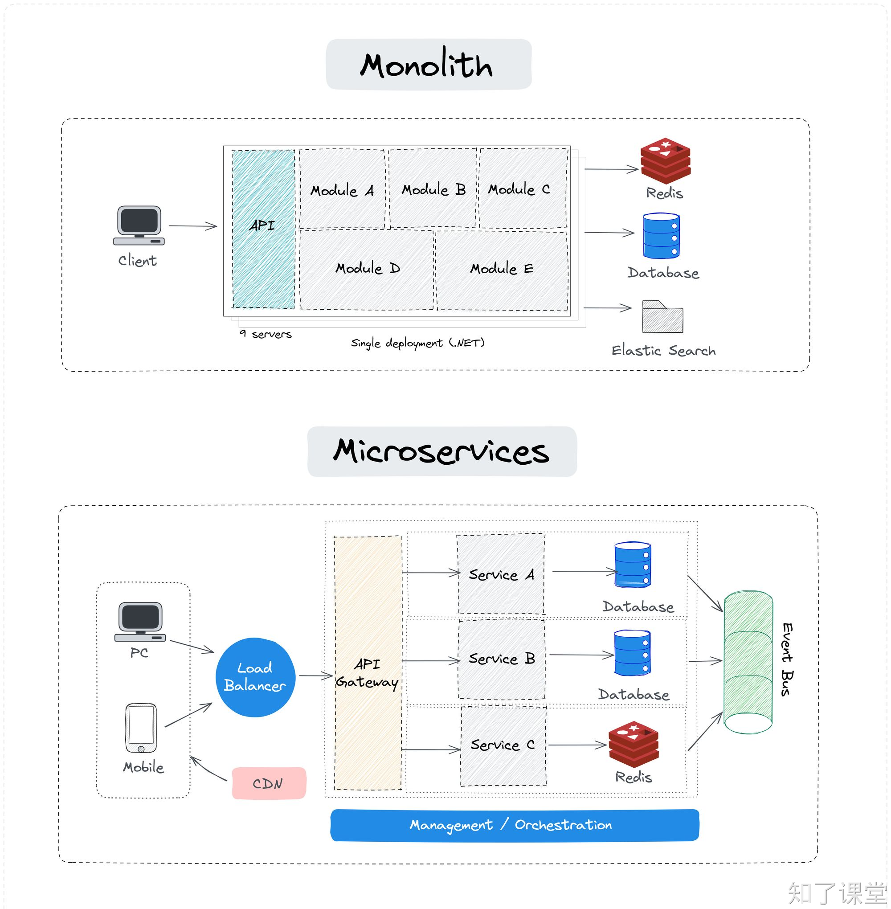

# 第一节：微服务介绍

## 一、微服务介绍
微服务是一种将应用程序分解为一组小型、独立的服务单元的架构风格，每个服务单元实现特定的业务功能。微服务具有高度可扩展、独立部署、弹性容错和简化开发等特点。在微服务架构中，服务之间需要通过网络进行通信，因此需要使用一些协议来实现服务之间的交互。常见的微服务协议包括RESTful API、gRPC和Thrift等。

## 二、微服务的优缺点
### 1. 优点：
1. **模块化和服务解耦**：微服务架构将应用程序分解为小型、独立的服务，每个服务负责一块业务功能。这种解耦使得团队可以独立开发和部署服务，提高了系统的模块化程度。
2. **易于扩展和缩放**：由于服务是独立的，可以根据需求单独扩展或缩放某个服务，而不需要整个应用程序进行调整。
3. **灵活的技术栈**：每个微服务可以采用不同的技术栈，允许团队根据服务的需求选择最合适的技术和工具。
4. **容错和故障隔离**：微服务架构可以通过隔离故障点来提高系统的容错性。如果一个服务失败，不会影响到其他服务的正常运行。
5. **持续交付和部署**：微服务支持持续交付和部署，可以频繁地发布新功能或修复错误，加快迭代速度。
6. **易于理解和维护**：由于服务规模较小，新的开发者可以更快地理解和上手，提高了开发效率。

## 2. 缺点：
1. **分布式系统的复杂性**：微服务架构引入了分布式系统的复杂性，包括服务发现、负载均衡、网络通信、数据一致性等问题。
2. **最终一致性的挑战**：在微服务架构中，保持数据一致性可能会很复杂，通常需要采用最终一致性策略。
3. **部署和运维的复杂性**：微服务增加了部署和运维的复杂性，需要管理更多的服务实例和服务间的关系。
4. **测试复杂性**：由于服务之间的依赖关系，测试微服务应用程序可能会更加复杂，需要考虑接口兼容性和集成测试。
5. **初始开发和资源成本**：微服务架构可能需要更多的初期投资，包括基础设施、服务拆分和团队培训等。

## 三、常见微服务协议
常见的微服务协议包括：

1. **RESTful API**：基于HTTP/HTTPS协议，使用标准的GET、POST、PUT、DELETE等HTTP方法来进行资源的增删改查操作。RESTful API简单易用，无状态，易于理解和实现，且具有良好的可缓存性。
2. **gRPC**：由Google开发的一个高性能、通用的RPC框架，支持多种编程语言。gRPC使用Protocol Buffers作为接口定义语言，可以定义服务接口和消息类型。它使用HTTP/2作为传输协议，支持双向流和消息头压缩，提供了高性能的数据传输效率和丰富的功能特性。
3. **Thrift**：由Facebook开发的一个跨语言的RPC框架，支持多种编程语言。Thrift允许定义服务接口和数据类型，然后自动生成不同语言的服务端和客户端代码。它支持多种传输层协议和消息格式，提供了较高的灵活性和性能。
4. **JSON-RPC**：JSON-RPC是一个无状态的、轻量级的远程过程调用（RPC）协议，它使用JSON格式的数据进行通信。它简单易实现，但不支持内置的客户端和服务器端代码生成。

## 四、gRPC协议介绍
gRPC是由Google开发的一个高性能、通用的RPC（Remote Process Call，远程过程调用）框架，它支持多种编程语言。gRPC使用Protocol Buffers作为接口定义语言，可以定义服务接口和消息类型。它使用HTTP/2作为传输协议，支持双向流和消息头压缩，提供了高性能的数据传输效率和丰富的功能特性。

gRPC的主要特点包括：

1. **高性能**：gRPC使用HTTP/2作为传输协议，支持双向流和消息头压缩，可以提高数据传输效率和性能。
2. **多语言支持**：gRPC支持多种编程语言，可以方便地在不同的服务之间进行通信。
3. **强类型**：gRPC使用Protocol Buffers定义接口和消息类型，可以保证数据的一致性和正确性。
4. **异步编程**：gRPC支持异步编程模型，可以提高服务的并发处理能力。
5. **支持多种数据格式**：gRPC支持多种数据格式，包括Protocol Buffers、JSON等，可以根据需求选择合适的数据格式。
6. **安全性**：gRPC支持TLS/SSL加密，可以保证通信过程的安全性。

gRPC适用于构建分布式系统和服务化架构，可以简化服务之间的通信和数据的交换。它特别适用于需要高性能和低延迟的场景，如移动应用、云服务和微服务架构等。

+ gRPC官网：[https://grpc.io/](https://grpc.io/)
+ gRPC Github地址：[https://github.com/grpc/grpc](https://github.com/grpc/grpc)
+ gRPC Asyncio API地址：[https://grpc.github.io/grpc/python/grpc_asyncio.html](https://grpc.github.io/grpc/python/grpc_asyncio.html)

> 原文: <https://www.yuque.com/hynever/micro-service/qesgear6wuxao18l>