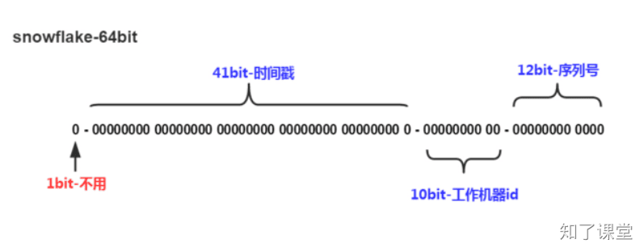

# 第一节：雪花算法

## 一、雪花算法原理
Snowflake，雪花算法是由Twitter开源的分布式ID生成算法，以划分命名空间的方式将 64-bit位分割成多个部分，每个部分代表不同的含义。

+ **第1位**占用1bit，其值始终是0，可看做是符号位不使用。
+ **第2位**开始的41位是时间戳，41-bit位可表示2^41个数，每个数代表毫秒，那么雪花算法可用的时间年限是`(1L<<41)/(1000L360024*365)`=69 年的时间。
+ **中间的10-bit位**可表示机器数，即2^10 = 1024台机器，但是一般情况下我们不会部署这么台机器。如果我们对IDC（互联网数据中心）有需求，还可以将 10-bit 分 5-bit 给 IDC，分5-bit给工作机器。这样就可以表示32个IDC，每个IDC下可以有32台机器，具体的划分可以根据自身需求定义。
+ **最后12-bit位**是自增序列，可表示2^12 = 4096个数。

这样的划分之后相当于**在一毫秒一个数据中心的一台机器上可产生4096个有序的不重复的ID**。

上面只是一个将64bit划分的标准，当然也不一定这么做，可以根据不同业务的具体场景来划分，比如下面给出一个业务场景：

+ 服务目前QPS10万，预计几年之内会发展到百万。
+ 当前机器三地部署，上海，北京，深圳都有。
+ 当前机器10台左右，预计未来会增加至百台。

这个时候我们根据上面的场景可以再次合理的划分64bit，QPS几年之内会发展到百万，那么每毫秒就是千级的请求，目前10台机器那么每台机器承担百级的请求，为了保证扩展，后面的循环位可以限制到1024，也就是2^10，那么循环位10位就足够了。

机器三地部署我们可以用3bit总共8来表示机房位置，当前的机器10台，为了保证扩展到百台那么可以用7bit 128来表示，时间位依然是41bit,那么还剩下64-10-3-7-41-1 = 2bit，还剩下2bit可以用来进行扩展。

## 二、时钟回拨
因为机器的原因会发生时间回拨，我们的雪花算法是强依赖我们的时间的，如果时间发生回拨，有可能会生成重复的ID。我们可以用当前时间和上一次的时间进行判断，如果当前时间小于上一次的时间那么肯定是发生了回拨，算法会直接抛出异常。

> 原文: <https://www.yuque.com/hynever/shtqfp/xz112md91wuvfq73>