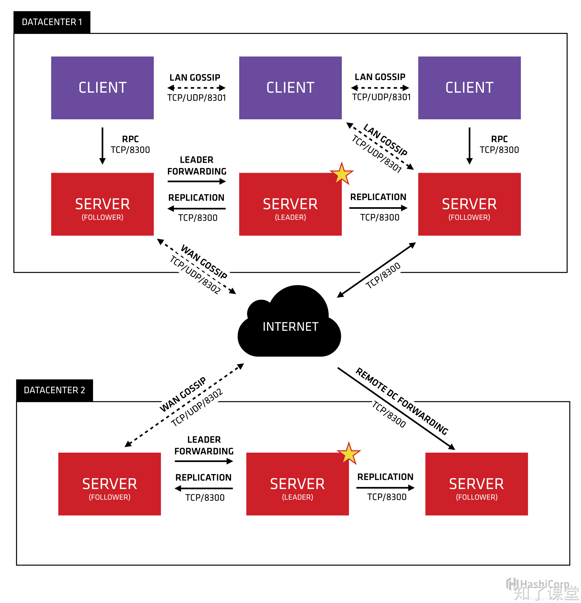

# 第七节：Consul

## 一、服务注册与发现
微服务架构中，系统被拆分成多个独立、可扩展、松耦合的服务单元，这些服务单元可能部署在不同的服务器或容器上，且数量众多。在这样的架构下，服务之间的相互调用变得复杂，因此需要一个机制来管理和维护服务实例的信息，这就是注册发现机制的重要性所在。注册发现机制确保了服务消费者能够快速、准确地找到所需的服务提供者，从而实现服务的透明调用，提高了系统的动态伸缩性和故障容错能力。

## 二、Consul介绍
在微服务架构中，常见的注册发现软件包括Zookeeper、Eureka、Consul、Etcd等。这些软件都提供了服务注册、服务发现、服务健康检查等功能，但它们在实现细节和特性上各有千秋。

我们课程中用Consul，它是一个功能全面的服务发现和配置工具，具有以下特点：

1. **<font style="color:rgb(26, 32, 41);">服务注册与发现</font>**<font style="color:rgb(26, 32, 41);">：Consul允许服务在启动时注册自己，并可以通过DNS或HTTP接口查询服务信息。</font>
2. **<font style="color:rgb(26, 32, 41);">健康检查</font>**<font style="color:rgb(26, 32, 41);">：Consul提供了健康检查机制，可以定期检查服务实例的健康状态，确保服务列表中的信息是最新的。</font>
3. **<font style="color:rgb(26, 32, 41);">键值存储</font>**<font style="color:rgb(26, 32, 41);">：Consul内置了分布式键值存储，可以用于存储服务配置信息，支持动态更新。</font>
4. **<font style="color:rgb(26, 32, 41);">多数据中心支持</font>**<font style="color:rgb(26, 32, 41);">：Consul原生支持多数据中心，可以在不同的数据中心之间进行服务注册和发现。</font>
5. **<font style="color:rgb(26, 32, 41);">Raft算法</font>**<font style="color:rgb(26, 32, 41);">：Consul使用Raft算法来保证集群的一致性，即使在网络分区或节点故障的情况下也能保持服务的稳定性。</font>
6. **<font style="color:rgb(26, 32, 41);">易于集成</font>**<font style="color:rgb(26, 32, 41);">：Consul提供了丰富的API和集成接口，可以轻松与其他系统集成。</font>

## <font style="color:rgb(26, 32, 41);">三、Consul架构</font>


<font style="color:rgb(26, 32, 41);">Consul 的架构设计是为了提供高可用性和灵活性的服务发现和配置解决方案。Consul 集群由多个节点组成，这些节点可以是服务器（Server）节点或客户端（Client）节点。以下是 Consul 的架构概述，包括 Server 和 Client 两种模式的详细介绍：</font>

### <font style="color:rgb(26, 32, 41);">Consul 架构概览</font>
1. **<font style="color:rgb(26, 32, 41);">数据中心</font>**<font style="color:rgb(26, 32, 41);">：Consul 支持多个数据中心，每个数据中心都有一个或多个 Server 节点。</font>
2. **<font style="color:rgb(26, 32, 41);">Server 节点</font>**<font style="color:rgb(26, 32, 41);">：Server 节点负责维护集群状态、处理查询、维护数据一致性、以及与集群中的其他 Server 节点进行通信。</font>
3. **<font style="color:rgb(26, 32, 41);">Client 节点</font>**<font style="color:rgb(26, 32, 41);">：Client 节点相对轻量级，主要负责转发请求到 Server 节点，以及执行健康检查。</font>
4. **<font style="color:rgb(26, 32, 41);">Gossip Protocol</font>**<font style="color:rgb(26, 32, 41);">：Consul 使用 Gossip Protocol（八卦协议）来管理成员关系和广播消息。</font>

### <font style="color:rgb(26, 32, 41);">Server 模式</font>
+ **<font style="color:rgb(26, 32, 41);">数据存储</font>**<font style="color:rgb(26, 32, 41);">：Server 节点存储了所有的服务和健康检查的状态信息。这些数据被复制到集群中的所有 Server 节点，以实现数据冗余和高可用性。</font>
+ **<font style="color:rgb(26, 32, 41);">一致性保证</font>**<font style="color:rgb(26, 32, 41);">：Server 节点使用 Raft Consensus Algorithm（Raft 一致性算法）来确保数据的一致性和可靠性。Raft 算法允许在出现网络分区或节点故障时选举出一个领导者，并确保所有 Server 节点上的数据是一致的。</font>
+ **<font style="color:rgb(26, 32, 41);">领导者选举</font>**<font style="color:rgb(26, 32, 41);">：在 Consul 集群中，Server 节点通过 Raft 算法选举出一个领导者来处理所有的写入操作。其他 Server 节点作为跟随者，同步领导者的状态。</font>
+ **<font style="color:rgb(26, 32, 41);">多数据中心</font>**<font style="color:rgb(26, 32, 41);">：在多数据中心部署中，每个数据中心都有自己的 Server 集群，并且可以通过 WAN Gossip 协议跨数据中心通信。</font>

### <font style="color:rgb(26, 32, 41);">Client 模式</font>
+ **<font style="color:rgb(26, 32, 41);">服务注册</font>**<font style="color:rgb(26, 32, 41);">：Client 节点允许服务实例在其上注册。注册信息包括服务的地址、端口、健康检查等。</font>
+ **<font style="color:rgb(26, 32, 41);">健康检查</font>**<font style="color:rgb(26, 32, 41);">：Client 节点定期执行健康检查，并将结果报告给 Server 节点。这些健康检查可以是脚本、HTTP 接口、TCP 端口检查等。</font>
+ **<font style="color:rgb(26, 32, 41);">请求转发</font>**<font style="color:rgb(26, 32, 41);">：Client</font><font style="color:rgb(26, 32, 41);"> </font><font style="color:rgb(26, 32, 41);">节点接收来自应用程序的查询请求，并将其转发到 Server 节点。这样可以减少应用程序直接与 Server 节点通信的复杂性。</font>
+ **<font style="color:rgb(26, 32, 41);">轻量级</font>**<font style="color:rgb(26, 32, 41);">：Client 节点不参与 Raft 共识过程，因此它们对资源的需求较低，可以大量部署。</font>

## 四、安装
1. 安装方式选择：[https://developer.hashicorp.com/consul/docs/install](https://developer.hashicorp.com/consul/docs/install)
2. 下载地址：[https://developer.hashicorp.com/consul/install](https://developer.hashicorp.com/consul/install)

其中在Ubuntu下的安装，也可以通过命令的形式：

```shell
wget -O- https://apt.releases.hashicorp.com/gpg | sudo gpg --dearmor -o /usr/share/keyrings/hashicorp-archive-keyring.gpg
echo "deb [signed-by=/usr/share/keyrings/hashicorp-archive-keyring.gpg] https://apt.releases.hashicorp.com $(lsb_release -cs) main" | sudo tee /etc/apt/sources.list.d/hashicorp.list
sudo apt update && sudo apt install consul
```

在`CentOS`和`Mac`上也可以通过命令安装，具体请参考以上链接。

## 五、运行
这里我们在windows上运行`consul`，将下载下来的`consul.exe`所在的路径添加到环境变量中。然后通过以下命令即可查看是否安装成功：

```shell
$ consul version
```

由于在开发阶段，这里仅创建一个`server`和一个`client`，并且都在同一台机器上。执行以下命令即可启动：

```shell
$ consul agent -dev
```

## 六、操作方式
### 通过API
服务注册与发现，可以直接使用Consul API，然后通过网络请求库，比如`requests/httpx`来发送请求。

Consul API接口文档请见：[https://developer.hashicorp.com/consul/api-docs/agent/service](https://developer.hashicorp.com/consul/api-docs/agent/service)

### 通过SDK
也可以使用SDK来操作。操作Consul的各种官方和非官方的SDK地址：[https://developer.hashicorp.com/consul/api-docs/libraries-and-sdks](https://developer.hashicorp.com/consul/api-docs/libraries-and-sdks)

## 七、py-consul文档
这里我们使用一个第三方的`py-consul`库来进行服务注册与发现。

py-consul github地址：[https://github.com/criteo/py-consul/tree/master?tab=readme-ov-file](https://github.com/criteo/py-consul/tree/master?tab=readme-ov-file)

python-consul文档地址：[https://python-consul.readthedocs.io/en/latest/](https://python-consul.readthedocs.io/en/latest/)

### 安装
通过以下命令即可安装：

```shell
$ pip install py-consul==1.5.1
```

### 服务注册
GRPC服务与HTTP服务都是服务，都可以注册进Consul中。注册方法类似，不同的是健康检查。

#### GRPC服务注册
```shell
def register_consul():
    client = consul.Consul(host='localhost', port=8500)
    client.agent.service.register(
        name='user_service',
        service_id='user_service',
        address='192.168.0.16',
        port=5001,
        tags=['user'],
        check=consul.Check.tcp(host='192.168.0.16', port=5001, interval='10s')
    )
```

#### HTTP服务注册
```shell
def register_consul():
    client = consul.Consul(host='localhost', port=8500)
    client.agent.service.register(
        name='user_api',
        service_id='user_api',
        address='192.168.0.16',
        port=8000,
        tags=['user'],
        check=consul.Check.http('http://127.0.0.1:8000/health', interval='10s')
    )
```

#### 自动获取IP和端口
在注册服务时，最好不要将IP地址硬编码在程序中，因此可以通过代码自动获取IP地址和端口号。代码如下：

```python
import socket

def get_ip_port() -> Tuple[str, int]:
    sock_ip = socket.socket(socket.AF_INET, socket.SOCK_DGRAM)
    sock_ip.connect(('8.8.8.8', 80))
    ip = sock_ip.getsockname()[0]
    sock_ip.close()

    sock_port = socket.socket(socket.AF_INET, socket.SOCK_STREAM)
    sock_port.bind(("", 0))
    _, port = sock_port.getsockname()
    sock_port.close()
    return ip, port
```

### 服务发现
在所有服务都注册进Consul后，如果我们需要调用某个服务，那么可以通过dns来查找其IP地址和端口号。首先要安装一个DNS查找的包：

```shell
$ pip install dnspython
```

然后通过以下代码即可查找到`user_service`的所有可用`ip:port`。代码如下：

```python
async def get_services() -> list[str]:
    resolver = asyncresolver.Resolver()
    resolver.nameservers = ['127.0.0.1']
    # dns服务是8600端口
    resolver.port = 8600

    from dns import rdatatype
    dnsanswer = await resolver.resolve(f"user_service.service.consul", rdatatype.A)
    dnsanswer_srv = await resolver.resolve(f"user_service.service.consul", rdatatype.SRV)
    addresses = []
    ip = dnsanswer[0].address
    for srv in dnsanswer_srv:
        addresses.append(f"{ip}:{srv.port}")
    return addresses
```

### 取消注册
如果想要取消注册，则只需要调用`deregister`方法即可。示例代码如下：

```python
client = consul.Consul(host='localhost', port=8500)

def deregister_consul(service_id):
    client.agent.service.deregister(service_id)
```

## 八、负载均衡和重用连接
+ 负载均衡：[https://github.com/grpc/grpc/blob/master/doc/load-balancing.md](https://github.com/grpc/grpc/blob/master/doc/load-balancing.md)
+ 重用连接：[https://github.com/grpc/grpc/issues/20985](https://github.com/grpc/grpc/issues/20985)

## 九、参考资料
python与consul注册：[https://www.cnblogs.com/yuzhenjie/p/9398569.html](https://www.cnblogs.com/yuzhenjie/p/9398569.html)


> 原文: <https://www.yuque.com/hynever/shtqfp/zm0hv5kb6zxgp877>