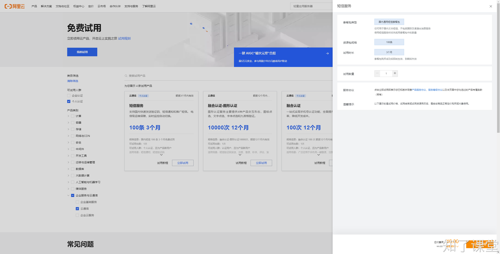
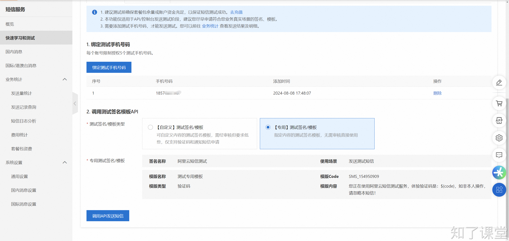

# 第三节：短信验证码

这里我们用阿里云的短信服务来发送短信验证码。如果是个人用户，并且之前没有试用过，那么可以申请试用。如果是企业用户，则必须花最低35元购买1000条短信。

## 一、试用教程
个人试用教程：[https://help.aliyun.com/document_detail/2253435.html](https://help.aliyun.com/document_detail/2253435.html)

前提是要先注册并登录阿里云，并且已经完成了个人实名认证。

### 申请试用
在这个链接：[https://free.aliyun.com/?spm=a2c4g.2253435.0.0.1ad031b1QQ76IF&product=1410&crowd=personal](https://free.aliyun.com/?spm=a2c4g.2253435.0.0.1ad031b1QQ76IF&product=1410&crowd=personal)，然后选中`短信服务`，点击`立即试用`。



### 绑定测试手机号
来到快速学习和测试链接：[https://dysms.console.aliyun.com/quickstart](https://dysms.console.aliyun.com/quickstart)

选中`API发送测试`，点击`绑定测试手机号码`，添加自己的手机号码。

### 选择模板
这里可以选择`【自定义】测试签名/模板`、`【专用】测试签名/模板`，其中自定义的模板是需要审核的，专用的模板是可以直接使用的，这里为了能快速进行测试，我们选择专用即可。

还要记得添加测试手机号码。

## 二、SDK文档
[https://next.api.aliyun.com/api-tools/sdk/Dysmsapi?version=2017-05-25&language=python-tea&tab=primer-doc](https://next.api.aliyun.com/api-tools/sdk/Dysmsapi?version=2017-05-25&language=python-tea&tab=primer-doc)

安装包：

```shell
$ pip install alibabacloud_dysmsapi20170525==3.0.0
```


## 三、配置环境变量
通过SDK操作阿里云相关资源，那么必须要提供`ALIBABA_CLOUD_ACCESS_KEY_ID`和`ALIBABA_CLOUD_ACCESS_KEY_SECRET`，而这些信息是非常敏感的，在团队中只能有少数人能有权限查看，所以我们可以配置在环境变量中，然后在代码中读取。

注意：在配置完环境变量后，重启pycharm后才能在代码中读取到。


> 原文: <https://www.yuque.com/hynever/shtqfp/mqbghdxhiwa8gaov>