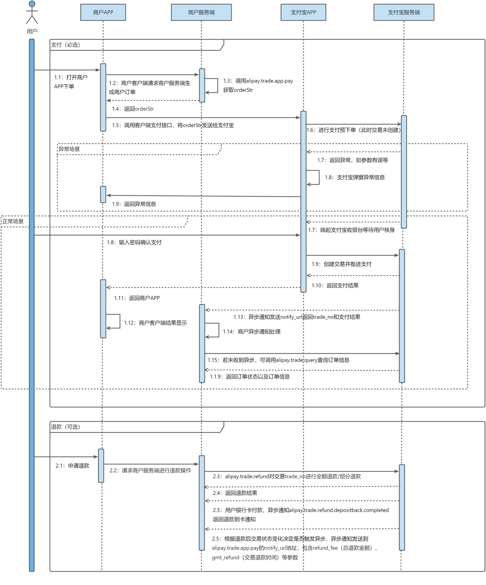
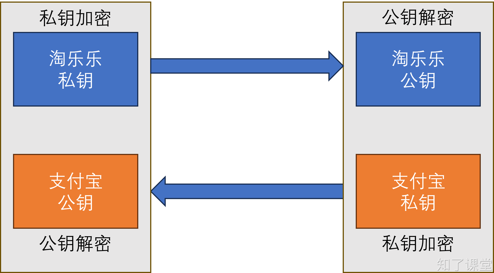

# 第九节：支付宝支付

由于微信支付必须用到企业资质，而支付宝有沙箱环境，可以用于开发阶段测试，所以本项目采用支付宝支付，微信支付可参考支付宝支付。

## 一、相关链接
+ 控制台首页：[https://open.alipay.com/develop/manage](https://open.alipay.com/develop/manage)
+ 沙盒环境首页：[https://open.alipay.com/develop/sandbox/app](https://open.alipay.com/develop/sandbox/app)
+ python-alipay-sdk github地址（非官方）：[https://github.com/fzlee/alipay/blob/master/README.zh-hans.md](https://github.com/fzlee/alipay/blob/master/README.zh-hans.md)
+ APP接入指南：[https://opendocs.alipay.com/open/204/01dcc0?pathHash=cf89b2be](https://opendocs.alipay.com/open/204/01dcc0?pathHash=cf89b2be)

## 二、支付流程


## 三、准备工作
### 安装`python-alipay-sdk`
首先，通过以下命令安装`python-alipay-sdk`：

```shell
$ pip install python-alipay-sdk==3.3.0
```

### 生成密钥文件
在cmd终端输入`openssl`，如果没有提示找不到命令，则可以直接使用。如果提示找不到命令。则需要先安装OpenSSL，下载地址为：[https://wiki.openssl.org/index.php/Binaries](https://wiki.openssl.org/index.php/Binaries)，在安装完后，需要把OpenSSL文件所在的路径添加到环境变量中，否则无法直接在cmd中使用。

在`openssl`命令可用的情况下，输入以下两条命令，用于生成公钥和私钥：

```shell
# 生成私钥
$ openssl genrsa -out app_private_key.pem 2048
# 生成公钥
$ openssl rsa -in app_private_key.pem -pubout -out app_public_key.pem
```

如果是mac或者linux系统，则应该先输入`openssl`，再输入剩余的命令：

```shell
openssl
OpenSSL> genrsa -out app_private_key.pem   2048  # 私钥
OpenSSL> rsa -in app_private_key.pem -pubout -out app_public_key.pem # 导出公钥
OpenSSL> exit
```

关于支付宝公钥和密钥，以及应用的公钥和密钥的关系，请参考下图：



如果是用沙盒环境，则可以直接使用默认的`应用公钥`、`应用私钥`、`支付宝公钥`：[https://open.alipay.com/develop/sandbox/app](https://open.alipay.com/develop/sandbox/app)

## 四、代码实现
### 生成orderStr
```python
app_private_key_string = open("keys/app_private.key").read()
alipay_public_key_string = open("keys/alipay_public.pem").read()
alipay = AliPay(
    appid="9021000135607826",
    app_notify_url="http://www.example.com/order/alipay_notify",  # 默认回调 url
    app_private_key_string=app_private_key_string,
    # 支付宝的公钥，验证支付宝回传消息使用，不是你自己的公钥,
    alipay_public_key_string=alipay_public_key_string,
    sign_type="RSA2",  # RSA 或者 RSA2
    debug=True,  # 默认 False
    verbose=True,  # 输出调试数据
    config=AliPayConfig(timeout=15)  # 可选，请求超时时间
)
order_string = alipay.api_alipay_trade_app_pay(
    out_trade_no=str(order.id),
    total_amount=float(order.amount),
    subject=seckill.commodity.title
)
```

### uniapp打开支付宝
```javascript
onLoad(async (query) => {
  var EnvUtils = plus.android.importClass("com.alipay.sdk.app.EnvUtils");
  EnvUtils.setEnv(EnvUtils.EnvEnum.SANDBOX);
})

let address_str = currentAddress.value;
try{
  const result = await seckillHttp.buySeckill(goods.id, address_str, 1)
  let alipayOrderStr = result.alipay_order
  let tllOrder = result.order_id
  
  uni.getProvider({
      service: 'payment',
      success: function (res) {
          console.log(res.provider)
          if (~res.provider.indexOf('alipay')) {
              uni.requestPayment({
                  "provider": "alipay",   //固定值为"alipay"
                  "orderInfo": alipayOrderStr, //此处为服务器返回的订单信息字符串
                  success: function (res) {
                      var rawdata = JSON.parse(res.rawdata);
                      console.log("支付成功");
                  },
                  fail: function (err) {
                      console.log('支付失败:' + JSON.stringify(err));
                  }
              });
          }
      }
  });
}catch(e){
  console.log(e);
}
```

教程：[https://uniapp.dcloud.net.cn/tutorial/app-payment-alipay.html#%E5%BC%80%E9%80%9A](https://uniapp.dcloud.net.cn/tutorial/app-payment-alipay.html#%E5%BC%80%E9%80%9A)

### 实现回调
在支付宝上支付成功后，支付宝会调用指定的`app_notify_url`（这个url是我们服务器实现的），我们服务器收到这个请求后，首先要进行校验，校验通过后要修改原订单的状态（已支付、支付失败）。示例代码如下：

```python
from fastapi import Request
@router.post("/alipay/notify")
async def alipay_notify(
    request: Request,
    session: AsyncSession=Depends(get_db_session)
):
    result = await request.form()
    print(result)
    return "ok"
```

通知参数详解：[https://opendocs.alipay.com/open/203/105286](https://opendocs.alipay.com/open/203/105286)

## 五、沙盒支付宝APP
### 安装
由于我们是做安卓应用，在使用支付宝支付时需要打开支付宝app。为此支付宝专门做了一个沙箱环境的app，可以在沙箱环境进行使用。相关链接如下：

+ 扫码下载链接：[https://open.alipay.com/develop/sandbox/tool/alipayclint](https://open.alipay.com/develop/sandbox/tool/alipayclint)
+ 浏览器下载链接：[https://u.alipay.cn/_3qjuojwqOOw](https://u.alipay.cn/_3qjuojwqOOw)

在使用浏览器下载后，可以直接拖拽到mumu模拟器中，会自动安装。

### 登录
在链接：[https://open.alipay.com/develop/sandbox/account](https://open.alipay.com/develop/sandbox/account)，中找到买家信息，然后进行登录。


> 原文: <https://www.yuque.com/hynever/shtqfp/ebiq9qqemrel1rqk>