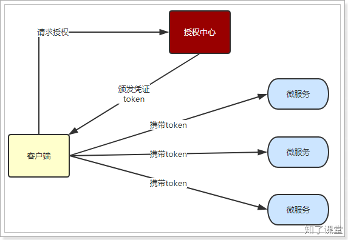

# 第五节：JWToken

关于JWToken的介绍，这里就不做过多讲解。我们重点介绍一下为什么有一个`access token`还要用`refresh token`。看以下图：

授权中心用于生成`refresh token`和`access token`的，`access token`过期时间很短，一般只有几分钟，而`refresh token`过期时间很长，一般可以设置7天，设置1个月都可以。授权中心除了在登录完成后返回`refresh token`和`access token`外，还可以使用`refresh token`来重新获取`access token`。

客户端在拿到`refresh/access token`后，就可以使用`access token`去访问其他微服务，其他微服务可以独立对`access token`进行解码操作，得到用户信息。

如果没有`refresh token`，并且把`access token`过期时间设置得很长，那么如果我们想让某个用户立马下线，面对这么多微服务，几乎是没法实现的。而有了`refresh token`，我们就只需要在授权中心，将需要下线的用户的`refresh token`删除（或者加入黑名单），而`access token`的过期时间又很短，在过期后需要使用`refresh token`重新获取`access token`，但是现在`refresh token`又已经不可用了，那么这个用户就没法再继续操作了。

> 原文: <https://www.yuque.com/hynever/shtqfp/ghqm6cn2bmn5xbgm>