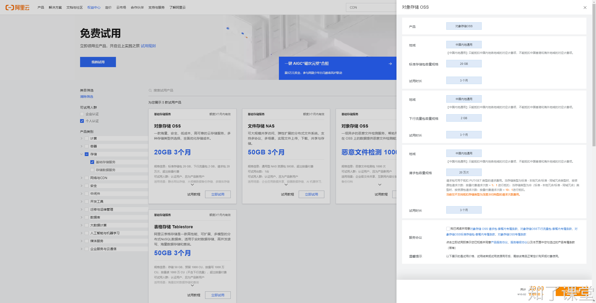
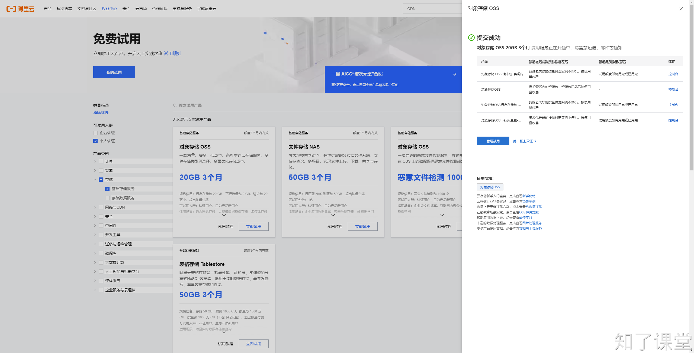
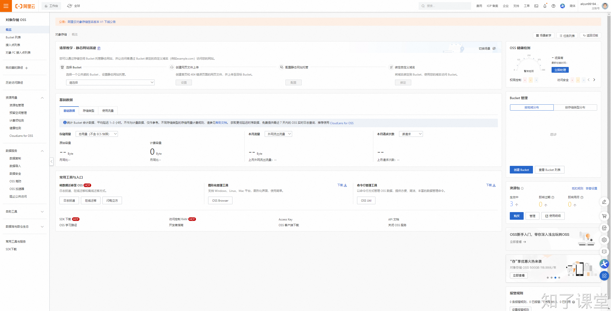
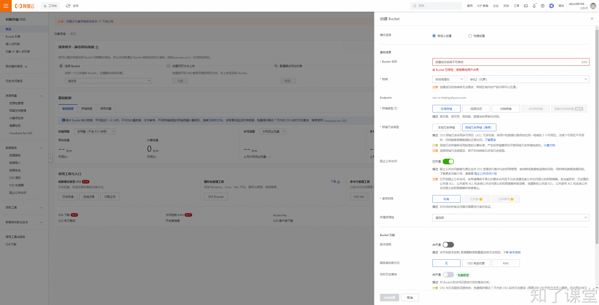

# 第六节：阿里云OSS

## 一、试用文档
1. [https://help.aliyun.com/zh/oss/product-overview/free-quota-for-new-users](https://help.aliyun.com/zh/oss/product-overview/free-quota-for-new-users)
2. [https://free.aliyun.com/](https://free.aliyun.com/)

## 二、试用教程
点击：[https://free.aliyun.com/](https://free.aliyun.com/)，然后选择`存储->基础存储服务`，点击`对象存储OSS`的`立即试用`。





## 三、使用教程
### 打开OSS控制台
进入阿里云oss控制台：[https://oss.console.aliyun.com/overview](https://oss.console.aliyun.com/overview)

### 创建Bucket
创建Bucket：[https://oss.console.aliyun.com/bucket](https://oss.console.aliyun.com/bucket)

### 添加权限
之前我们在使用阿里云短信服务的时候，创建了一个tll的用户，当时只给这个用户添加短信服务，为了能使用这个账号的`AccessKey`和`SecretKey`来上传文件到OSS中，还需要给这个账号添加OSS的权限。

## 四、上传图片
### 教程
Python SDK教程：[https://www.alibabacloud.com/help/zh/oss/developer-reference/preface](https://www.alibabacloud.com/help/zh/oss/developer-reference/preface?spm=a2c63.p38356.0.0.719e1d7akgOysf)

### 安装SDK
通过以下命令安装操作阿里云OSS服务的SDK：

```shell
$ pip install oss2==2.18.6
```

### 环境变量
与使用阿里云短信验证码类似，也需要在环境变量中配置`ALIBABA_CLOUD_ACCESS_KEY_ID`、`ALIBABA_CLOUD_ACCESS_KEY_SECRET`。然后通过以下代码设置连接凭证。

```python
import oss2

access_key_id = os.environ['ALIBABA_CLOUD_ACCESS_KEY_ID']
access_key_secret = os.environ['ALIBABA_CLOUD_ACCESS_KEY_SECRET']

# 使用环境变量中获取的RAM用户访问密钥配置访问凭证
auth = oss2.AuthV4(access_key_id, access_key_secret)
```

### 上传文件
```python
# -*- coding: utf-8 -*-
import oss2

access_key_id = os.environ['ALIBABA_CLOUD_ACCESS_KEY_ID']
access_key_secret = os.environ['ALIBABA_CLOUD_ACCESS_KEY_SECRET']

# 使用环境变量中获取的RAM用户访问密钥配置访问凭证
auth = oss2.AuthV4(access_key_id, access_key_secret)
# 填写Bucket所在地域对应的Endpoint。以华东1（杭州）为例，Endpoint填写为https://oss-cn-hangzhou.aliyuncs.com。
# yourBucketName填写存储空间名称。
bucket = oss2.Bucket(auth, 'https://oss-cn-hangzhou.aliyuncs.com', 'taolele-abc', region='cn-hangzhou')

# 上传文件到OSS。
# yourObjectName由包含文件后缀，不包含Bucket名称组成的Object完整路径，例如abc/efg/123.jpg。
# yourLocalFile由本地文件路径加文件名包括后缀组成，例如/users/local/myfile.txt。
bucket.put_object(filename, file)
```

### 删除文件
```python
# -*- coding: utf-8 -*-
import oss2

access_key_id = os.environ['ALIBABA_CLOUD_ACCESS_KEY_ID']
access_key_secret = os.environ['ALIBABA_CLOUD_ACCESS_KEY_SECRET']

# 使用环境变量中获取的RAM用户访问密钥配置访问凭证
auth = oss2.AuthV4(access_key_id, access_key_secret)
# 填写Bucket所在地域对应的Endpoint。以华东1（杭州）为例，Endpoint填写为https://oss-cn-hangzhou.aliyuncs.com。
# yourBucketName填写存储空间名称。
bucket = oss2.Bucket(auth, 'https://oss-cn-hangzhou.aliyuncs.com', 'yourBucketName', region='cn-hangzhou')

# yourObjectName表示删除OSS文件时需要指定包含文件后缀，不包含Bucket名称在内的完整路径，例如abc/efg/123.jpg。
bucket.delete_object('yourObjectName')
```

### 同步转异步
由于oss2这个`SDK`是同步的，没有提供异步版本，所以我们需要借助到一个工具`asgiref`，将同步转为异步。安装命令如下：

```shell
$ pip install asgiref==3.8.1
```

然后将上传图片的同步代码转换为异步：

```python
async_put_object = sync_to_async(bucket.put_object)
```

## 五、FastAPI上传图片
### 安装依赖包
首先通过以下命令安装依赖包：

```shell
$ pip install python-multipart==0.0.9
```

### 上传头像示例代码如下：
```python
async def oss_upload_image(file, max_size: int=1024*1024) -> str|None:
    if file.size > max_size:
        raise HTTPException(status_code=400, detail=f'图片大小不能超过{max_size}！')
    # 获取扩展名
    extension = os.path.splitext(file.filename)[1]
    if extension not in [".jpg", '.jpeg', '.png']:
        raise HTTPException(status_code=400, detail='请上传正确格式的图片！')

    auth = oss2.AuthV4(access_key_id, access_key_secret)
    bucket = oss2.Bucket(auth, settings.ALIYUN_OSS_ENDPOINT, settings.ALIYUN_OSS_BUCKET,
                         region=settings.ALIYUN_OSS_REGION)

    # 生成随机的文件名
    # uuid.uuid4().hex生成32位的随机字符
    # 生成随机文件名
    filename = f"{uuid.uuid4().hex}{extension}"
    # 上传文件到OSS。
    filedata = await file.read()
    async_put_object = sync_to_async(bucket.put_object)
    result = await async_put_object(key=filename, data=filedata)
    if result.status == 200:
        file_url = f"{settings.ALIYUN_OSS_FILE_DOMAIN}{filename}"
        return file_url
    else:
        logger.error(result.resp.response.text)
        return None
```


> 原文: <https://www.yuque.com/hynever/shtqfp/bwwcm0bz9zlsd87w>