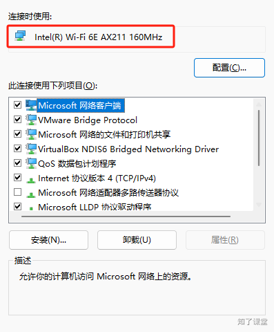
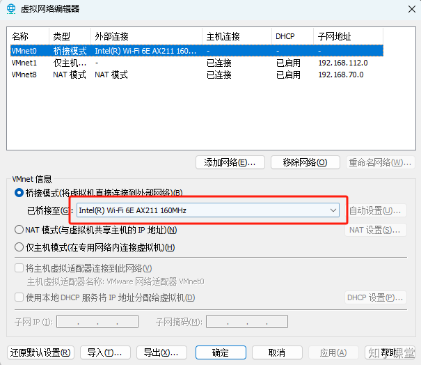

# 11.1. 虚拟机准备

后期我们需要搭建Redis的主从复制、哨兵主从以及集群模式，最少需要多台虚拟机，当然也可以直接在一台机器上，通过配置不同端口来模拟不同的Redis主机。课程用的是`Ubuntu 24.04版本`。

## 一、设置静态IP
### **查看局域网网关**
****在宿主机的终端上输入`ipconfig`查看默认网关，就是局域网的子网地址，比如我电脑的局域网信息如下：

```bash
无线局域网适配器 WLAN:

   连接特定的 DNS 后缀 . . . . . . . :
   本地链接 IPv6 地址. . . . . . . . : fe80::85d9:7263:fcd0:e5f5%10
   IPv4 地址 . . . . . . . . . . . . : 192.168.0.7
   子网掩码  . . . . . . . . . . . . : 255.255.255.0
   默认网关. . . . . . . . . . . . . : 192.168.0.1
```

那么我的网关就是192.168.0.1，并且子网掩码是255.255.255.0，从而本局域网的IP地址范围可以为：`192.168.0.2~192.168.0.254`。

### **配置系统模板静态IP**
****在ubuntu中，首先将`/etc/netplan/*.yaml`文件移动到当前home目录下：`sudo mv /etc/netplan/* ./`，主要是做一个备份。然后在`/etc/netplan`下创建一个`yaml`文件，比如叫做`my-network.yaml`文件，然后填入以下配置信息：

```yaml
network:
    version: 2
    renderer: networkd
    ethernets:
        ens33:
            dhcp4: no
            addresses:
                - 192.168.0.110/24
            routes:
                - to: default
                  via: 192.168.0.1
            nameservers:
                addresses:
                    - 119.29.29.29
                    - 114.114.114.114
                    - 8.8.8.8
```

### 重启网络
使用命令：`sudo netplan apply`重启网络。若出现：

```shell
Permissions for /etc/netplan/my-network.yaml are too open.
```

则可以执行命令将`my-network.yaml`文件权限设置为`600`，执行命令如下：

```shell
$ sudo chmod 600 my-network.yaml
# 再重新netplan apply
$ netplan apply
```

### 错误处理
> 如果以上配置完成后，出现无法ping通宿主机的ip，或者网关的IP，那么可以通过以下方式解决。
>
> 第一步：在宿主机上打开`查看网络连接`，找到你现在电脑连接的网卡。比如我电脑用的是无线网，网卡信息为：
>
> 
>
> 第二步：点击Vmware上，`编辑->虚拟网络编辑器->更改设置`，然后选择桥接模式，并将桥接网卡选择宿主机一样的网卡。比如我的是：
>
> 
>
> 点击确定后，使用`reboot`重启系统后，再重新`ping`宿主机的IP就能成功了。
>

## 二、安装Redis
在ubuntu下使用命令：

```shell
# 安装redis服务器
$ apt install redis
# 安装redis哨兵
$ apt install redis-sentinel
```

即可安装redis。


> 原文: <https://www.yuque.com/hynever/shtqfp/so70duav1uo1ansx>