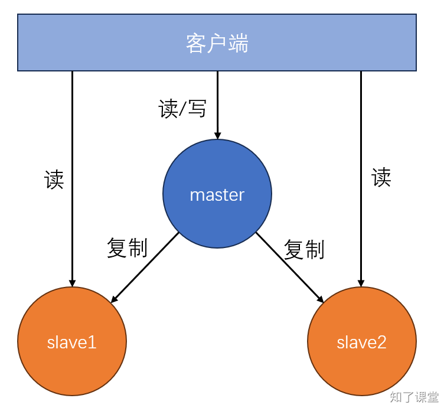

# 11.2. 主从复制

## 一、主从复制结构
在并发量稍微大一点的网站，而且要考虑数据安全性的时候，可以使用主从复制，即有一个master节点和多个slave节点。结构如下：



主从复制有以下几个特点：<font style="color:rgb(26, 32, 41);"></font>

1. **<font style="color:rgb(26, 32, 41);">数据复制</font>**<font style="color:rgb(26, 32, 41);">：主节点（Master）上的数据会被复制到一个或多个从节点（Slave），确保从节点拥有主节点数据的副本。</font>
2. **<font style="color:rgb(26, 32, 41);">读写分离</font>**<font style="color:rgb(26, 32, 41);">：在主从复制架构中，通常主节点负责处理写操作，而从节点负责处理读操作。这种读写分离的模式可以减轻主节点的压力，提高整体性能。</font>
3. **<font style="color:rgb(26, 32, 41);">数据冗余</font>**<font style="color:rgb(26, 32, 41);">：通过将数据复制到多个从节点，增加了数据的冗余性，从而提高了数据的可靠性。即使某个从节点发生故障，其他从节点仍然可以提供服务。</font>
4. **<font style="color:rgb(26, 32, 41);">故障转移</font>**<font style="color:rgb(26, 32, 41);">：虽然主从复制本身不提供自动故障转移功能，但当主节点发生故障时，可以通过手动的方式将一个从节点提升为新的主节点，继续提供服务。</font>
5. **<font style="color:rgb(26, 32, 41);">扩展性</font>**<font style="color:rgb(26, 32, 41);">：可以通过添加更多的从节点来扩展读取能力，从而提高系统的水平扩展性。</font>
6. **<font style="color:rgb(26, 32, 41);">同步和部分同步</font>**<font style="color:rgb(26, 32, 41);">：Redis支持全量同步（同步所有数据）和部分同步（同步自上次同步以来的数据变化）。全量同步通常在从节点初次连接主节点时发生，而部分同步用于后续的数据同步。</font>

## <font style="color:rgb(26, 32, 41);">二、主从复制配置</font>
### master配置
如果想要让其他机器能够访问当前机器的，那么必须设置bind为当前机器的IP地址，以及设置密码，所以master主机的redis.conf文件配置修改如下：

```powershell
# 监听IP
bind 127.0.0.1 192.168.0.110 -::1

# 设置密码
requirepass zhiliao
# protected-model
```

### slave配置
slave主机由于也承担了读的操作功能，因此也要设置bind为当前机器的IP地址以及密码，并且还需要设置`replicaof`以及master主机的IP地址。slave主机的redis.conf文件配置修改如下：

```shell
# 监听IP
bind 127.0.0.1 192.168.0.111 -::1

# master主机的IP和PORT
replicaof 192.168.0.110 6379

# master主机的密码
masterauth zhiliao

# slave主机的密码
requirepass zhiliao
```

先运行master主机，然后再运行slave主机后，在master主机中添加一个key，然后在slave主机中能够通过get命令获取到对应的值。

## 三、Python代码实现主从
使用Python Redis库操作Redis主从，示例代码如下：

```python
from redis import Redis

master = Redis(host='192.168.0.110', port=6379, password='zhiliao')
slave = Redis(host='192.168.0.111', port=6379, password='zhiliao')

# 从master中设置值
master.set('username', '知了课堂', ex=1000)

# 从slave中读取值
value = slave.get('username')

print('value:', value.decode('utf-8'))
```


> 原文: <https://www.yuque.com/hynever/shtqfp/yu0v6pb0r0orsgvr>