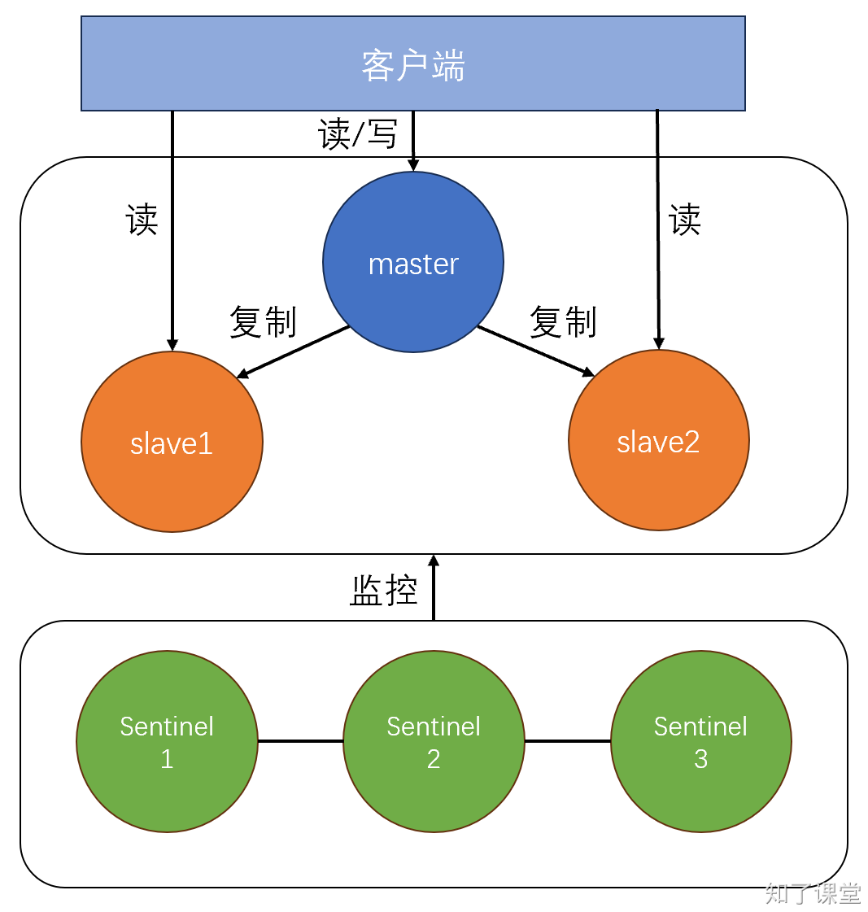

# 11.3. 哨兵模式

## 一、哨兵模式介绍
前面提到的主从复制，虽然提高了redis操作的性能，但是在高可用性方面却存在很大的问题，一旦master节点挂掉后，整个redis将无法使用，必须通过人工的方式重启master节点。而哨兵模式正是为了解决这个问题出现的。哨兵模式在redis主从复制的基础上，加一个哨兵集群，哨兵集群的作用是用来监控真正存储数据的redis集群，一旦检测到redis集群中master节点出现问题，那么就会自动的在redis集群中重新选举一个新的节点作为master节点，全程无须人工干涉。



## 二、主库下线判定
+ 主观下线：哨兵判断master节点下线了。
+ 客观下线：哨兵集群共同判断master节点下线了。

 当某个哨兵判断主库“主观下线”后，就会给其他哨兵发送 `is-master-down-by-addr` 命令。接着，其他哨兵会根据自己和主库的连接情况，做出 Y 或 N 的响应，Y 相当于赞成票，N 相当于反对票。<font style="color:rgb(44, 62, 80);">如果赞成票数（这里是2）是大于等于哨兵配置文件中的 </font>`quorum`<font style="color:rgb(44, 62, 80);"> 配置项（比如这里如果是quorum=2）, 则可以判定</font>**<font style="color:rgb(44, 62, 80);">主库客观下线</font>**<font style="color:rgb(44, 62, 80);">了。</font>

## <font style="color:rgb(44, 62, 80);">三、新master选举</font>
在master节点因为某种原因离线后，哨兵需要重新选举新的master节点。选举算法采用的是Raft算法，只有选举的票数大于等于`N/2+1`（这里`N`是哨兵的数量）时，这个节点才会成为新的master节点。

## 四、Redis集群配置
这里我们使用主从复制那一节的配置，在一台主机上配置master节点，在另外一台主机上配置两个slave节点。然后在另外一台主机上配置三个哨兵。配置文件如下：

```shell
# master节点：192.168.0.110:6379
# 监听IP
bind 127.0.0.1 192.168.0.110 -::1
# 端口号
port 6379
# 设置密码
requirepass zhiliao
# 设置pid
pidfile "/run/redis/redis-server.pid"
# 设置日志
logfile "/var/log/redis/redis-server.log"

# slave1节点：192.168.0.110:6380
bind 127.0.0.1 192.168.0.111 -::1
# 端口号
port 6380
# 设置密码
requirepass zhiliao
# 设置pid
pidfile "/run/redis/redis-server-slave1.pid"
# 设置日志
logfile "/var/log/redis/redis-server-slave1.log"

#  slave2节点：192.168.0.110:6381
bind 127.0.0.1 192.168.0.111 -::1
# 端口号
port 6381
# 设置密码
requirepass zhiliao
# 设置pid
pidfile "/run/redis/redis-server-slave2.pid"
# 设置日志
logfile "/var/log/redis/redis-server-slave2.log"
```

通过以下三条命令即可启动master和两个slave：

```python
$ redis-server master.conf
$ redis-server slave1.conf
$ redis-server slave2.conf
```

使用以下命令即可查看redis集群的状态：

```shell
# 进入redis客户端
$ redis-cli -p 6379

# 查看集群状态
127.0.0.1:6379> info replication
```

## 五、哨兵集群配置
这里我们也启动3个redis服务作为哨兵，配置文件如下：

```python
# sentinel1.conf
# 哨兵1监听端口号
port 26379
# 监听的redis集群的ip地址和端口号，末尾数字2代表quorum值
sentinel monitor mymaster 192.168.0.110 6379 2
# master主机的密码
sentinel auth-pass mymaster zhiliao
# 日志文件路径
logfile "/var/log/redis/redis-sentinel1.log"
# pid文件路径
pidfile "/run/sentinel/redis-sentinel1.pid"
# 作为守护进程
daemonize yes
# 配置一下当监听到master节点失去连接后多久认为是已经下线了
sentinel down-after-milliseconds mymaster 4000


# sentinel2.conf
# 哨兵2监听的端口号
port 26380
# 监听redis集群的IP地址和端口号
sentinel monitor mymaster 192.168.0.110 6379 2
# master主机的密码
sentinel auth-pass mymaster zhiliao
# 日志文件路径
logfile "/var/log/redis/redis-sentinel2.log"
# pid文件路径
pidfile "/run/sentinel/redis-sentinel2.pid"
# 作为守护进程
daemonize yes
# 配置一下当监听到master节点失去连接后多久认为是已经下线了
sentinel down-after-milliseconds mymaster 4000

# sentinel3.conf
# 哨兵3监听的端口号
port 26381
# 监听redis集群的IP地址和端口号
sentinel monitor mymaster 192.168.0.110 6379 2
# master主机的密码
sentinel auth-pass mymaster zhiliao
# 日志文件路径
logfile "/var/log/redis/redis-sentinel3.log"
# pid文件路径
pidfile "/run/sentinel/redis-sentinel3.pid"
# 作为守护进程
daemonize yes
# 配置一下当监听到master节点失去连接后多久认为是已经下线了
sentinel down-after-milliseconds mymaster 4000
```

启动三个哨兵的方式命令如下：

```python
$ redis-server sentinel1.conf --sentinel
$ redis-server sentinel2.conf --sentinel
$ redis-server sentinel3.conf --sentinel
```

通过以下命令即可查看哨兵状态：

```shell
# 进入哨兵
$ redis-cli -p 26381
$ info sentinel
```

## <font style="color:rgb(44, 62, 80);">六、Python操作哨兵</font>
```python
# 哨兵模式
from redis.sentinel import Sentinel


sentinel_nodes = [
    ('192.168.0.112', 26379),
    ('192.168.0.112', 26380),
    ('192.168.0.112', 26381),
]

# 创建哨兵连接
sentinel = Sentinel(sentinel_nodes)

# 配置服务的名称，这是你在哨兵配置文件中定义的名称
service_name = 'mymaster'

# 获取主节点信息
master = sentinel.discover_master(service_name)
print(f"Master Node: {master}")

# 获取从节点信息
slaves = sentinel.discover_slaves(service_name)
print(f"Slave Nodes: {slaves}")

# 使用哨兵获取主节点的连接
master_client = sentinel.master_for(service_name, password='zhiliao')

# 使用哨兵获取从节点的连接
slave_client = sentinel.slave_for(service_name, password='zhiliao')

# 现在可以使用这些客户端来执行Redis命令
# 设置一个键值对
master_client.set('username', 'zhiliao')

# 从从节点获取值，这样可以避免对主节点的读取压力
value = slave_client.get('username')
print(f"获取到: {value}")
```


> 原文: <https://www.yuque.com/hynever/shtqfp/dmf8gxczby5woziz>