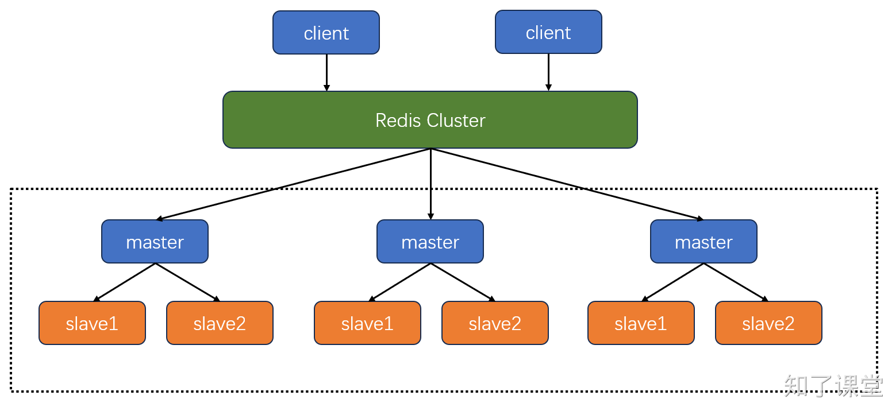

# 11.4. Cluster模式

## 一、Cluster模式介绍
哨兵模式虽然可以保证在master节点挂掉后能够自动重启，但是由于只有一个主节点对外提供服务，所以无法支持高并发，<font style="color:rgb(37, 41, 51);">且单个主节点内存也不宜设置得过大（一般建议不超过10GB），否则会导致持久化文件过大，影响数据恢复或主从同步的效率。</font>



Redis Cluster模式是一个由多个主从节点群组成的分布式服务器群，它具有复制、高可用和分片的特性。Redis Cluster不需要哨兵也能完成节点移除和故障转移。Cluster模式没有中心节点，可水平扩展，<font style="color:rgb(37, 41, 51);">据官方文档称可以线性扩展到上万个节点(</font>**<font style="color:rgb(37, 41, 51);">官方推荐不超过10000个节点</font>**<font style="color:rgb(37, 41, 51);">)。redis集群的性能和高可用性均优于之前版本的哨兵模式，且集群配置非常简单。</font>

## <font style="color:rgb(37, 41, 51);">二、数据分片</font>
Redis Cluster总共有16384个槽位，槽位从0开始，Redis Cluster会将这16384个槽位平均分配给每个主从集群，比如现在我们有三个主从，那么槽位分配分别为：`0-5460`、`5461-10922`、`10923-16383`。槽位的作用是什么呢？这里来详细解释下：当客户端存入一个key到Redis Cluster中时，Cluster会使用CRC16算法计算key的哈希值，这个哈希值是一个`0-65535`之间的整数，然后Cluster会将这个整数与`16384`进行取模，得到一个`0-16383`之间的数值，用公式表示就是：`hash_slot = CRC16(key) mod 16384`，接着Cluster再将这个key存入对应的主从集群中。也就是说，Redis Cluster存储数据才是真正分布式的，每个主从复制集群只存储一部分的key。

## 三、Redis Cluster搭建
### 结构
Redis Cluster最少需要三个master节点。这里我们还是使用三台虚拟机来演示Redis Cluster集群的搭建。每台主机一个master搭配一个slave，具体结构如下：

```plain
192.168.0.110 (master:7000,slave:7001)
192.168.0.111 (master:8000,slave:8001)
192.168.0.112 (master:9000,slave:9001)
```

### 配置文件
+ 第一台主机配置（`192.168.0.110`）：

```shell
# master.conf
daemonize yes
# 绑定的IP
bind 127.0.0.1 192.168.0.110 -::1
# 绑定的PORT
port 7000
# 设置数据文件存放路径（AOF，RDB）
dir "/home/zhiliao/cluster/master"
# 设置pid
pidfile "/run/redis/redis-server-master.pid"
# 设置日志
logfile "/var/log/redis/redis-server-master.log"
# 密码
requirepass "zhiliao"
# 启动集群模式
cluster-enabled yes
# cluster自动生成的配置文件名称
cluster-config-file cluster-master.conf
# 集群节点超时时间
cluster-node-timeout 10000


# slave.conf
daemonize yes
# 绑定的IP
bind 127.0.0.1 192.168.0.110 -::1
# 绑定的PORT
port 7001
# 设置数据文件存放路径
dir "/home/zhiliao/cluster/slave"
# 设置pid
pidfile "/run/redis/redis-server-slave.pid"
# 设置日志
logfile "/var/log/redis/redis-server-slave.log"
# 密码
requirepass zhiliao
# master节点的密码
masterauth "zhiliao"
# 启动集群模式
cluster-enabled yes
# cluster自动生成的配置文件名称
cluster-config-file cluster-slave.conf
# 集群节点超时时间
cluster-node-timeout 10000
```

+ 第二台主机配置（`192.168.0.111`）：

```shell
# master.conf
daemonize yes
# 绑定的IP
bind 127.0.0.1 192.168.0.111 -::1
# 绑定的PORT
port 8000
# 设置数据文件存放路径
dir "/home/zhiliao/cluster/master"
# 设置pid
pidfile "/run/redis/redis-server-master.pid"
# 设置日志
logfile "/var/log/redis/redis-server-master.log"
# 密码
requirepass "zhiliao"
# 启动集群模式
cluster-enabled yes
# cluster自动生成的配置文件名称
cluster-config-file cluster-master.conf
# 集群节点超时时间
cluster-node-timeout 10000


# slave.conf
daemonize yes
# 绑定的IP
bind 127.0.0.1 192.168.0.111 -::1
# 绑定的PORT
port 8001
# 设置数据文件存放路径
dir "/home/zhiliao/cluster/slave"
# 设置pid
pidfile "/run/redis/redis-server-slave.pid"
# 设置日志
logfile "/var/log/redis/redis-server-slave.log"
# 密码
requirepass zhiliao
# master节点的密码
masterauth "zhiliao"
# 启动集群模式
cluster-enabled yes
# cluster自动生成的配置文件名称
cluster-config-file cluster-slave.conf
# 集群节点超时时间
cluster-node-timeout 10000
```

+ 第三台主机配置（`192.168.0.112`）:

```shell
# master.conf
daemonize yes
# 绑定的IP
bind 127.0.0.1 192.168.0.112 -::1
# 绑定的PORT
port 9000
# 设置数据文件存放路径
dir "/home/zhiliao/cluster/master"
# 设置pid
pidfile "/run/redis/redis-server-master.pid"
# 设置日志
logfile "/var/log/redis/redis-server-master.log"
# 密码
requirepass "zhiliao"
# 启动集群模式
cluster-enabled yes
# cluster自动生成的配置文件名称
cluster-config-file cluster-master.conf
# 集群节点超时时间
cluster-node-timeout 10000


# slave.conf
daemonize yes
# 绑定的IP
bind 127.0.0.1 192.168.0.112 -::1
# 绑定的PORT
port 9001
# 设置数据文件存放路径
dir "/home/zhiliao/cluster/slave"
# 设置pid
pidfile "/run/redis/redis-server-slave.pid"
# 设置日志
logfile "/var/log/redis/redis-server-slave.log"
# 密码
requirepass zhiliao
# master节点的密码
masterauth "zhiliao"
# 启动集群模式
cluster-enabled yes
# cluster自动生成的配置文件名称
cluster-config-file cluster-slave.conf
# 集群节点超时时间
cluster-node-timeout 10000
```

### 启动集群
使用以下命令即可启动集群：

```shell
# 在每台机器上启动master和slave
$ redis-server master.conf
$ redis-server slave.conf

$ redis-cli -a zhiliao --cluster create --cluster-replicas 1 192.168.0.110:7000 192.168.0.111:8000 192.168.0.112:9000 192.168.0.110:7001 192.168.0.111:8001 192.168.0.112:9001
```

命令解释：

+ `-a zhiliao`：指定master节点的密码。
+ `--cluster create`：创建集群。
+ `--cluster-replicas 1`：每个master节点有一个slave节点。
+ 前面三个IP地址代表master节点的IP地址，末尾三个IP代表slave节点的IP地址。

### 相关命令
+ 查看集群信息：`cluster info`
+ 查看集群节点信息：`cluster nodes`

## 四、Python操作Redis Cluster
```python
from redis.cluster import RedisCluster, ClusterNode

# 定义Redis Cluster的启动节点和端口列表
startup_nodes = [
    ClusterNode(host='192.168.0.110', port=7000),
    ClusterNode(host='192.168.0.110', port=8000),
    ClusterNode(host='192.168.0.110', port=9000),
]

# 创建Redis Cluster连接
# 请根据你的实际情况替换以下密码
redis_cluster = RedisCluster(startup_nodes=startup_nodes, decode_responses=True, password='zhiliao')

# 设置一个键值对
redis_cluster.set('university', '北京大学')

# 获取刚才设置的键值
value = redis_cluster.get('university')
print(f"university is: {value}")

# 关闭连接
redis_cluster.close()
```


> 原文: <https://www.yuque.com/hynever/shtqfp/agwrqtv3c00l42zc>