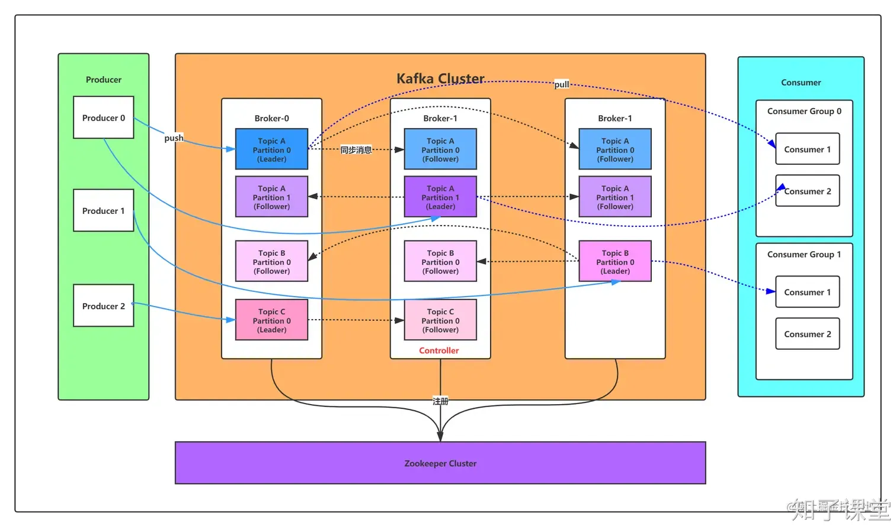
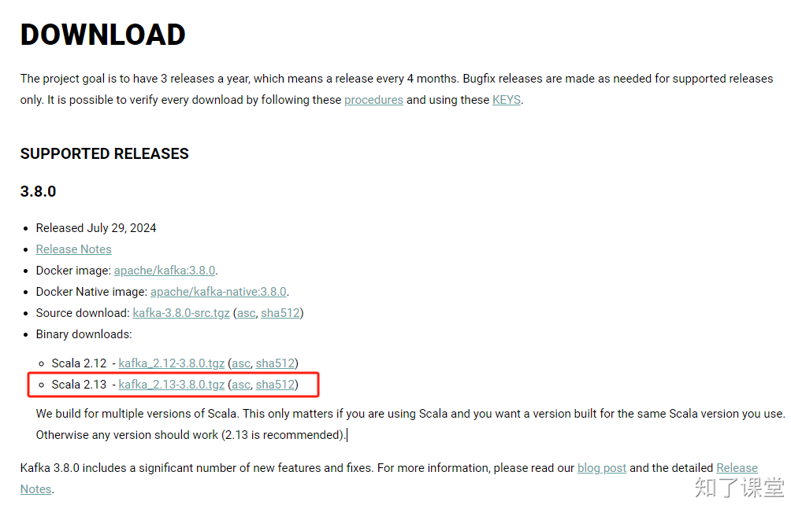

# 第十节：kafka

## 一、消息队列
<font style="color:rgb(26, 32, 41);">消息队列（Message Queue）是一种用于在不同进程、不同服务器之间传递消息的中间件技术。它提供了一种异步的通信机制，允许消息的发送者和接收者无需同时在线，从而提高了系统的解耦性和伸缩性。消息队列在分布式系统中扮演着至关重要的角色，它能够有效地缓冲和调度消息流，确保数据的一致性和系统的稳定性。</font>

<font style="color:rgb(26, 32, 41);">常见的消息队列有以下几种：</font>

1. <font style="color:rgb(26, 32, 41);">RabbitMQ：适用于数据量不是特别大，但对消息传递的可靠性和事务性有较高要求的应用。</font>
2. <font style="color:rgb(26, 32, 41);">RocketMQ：适用于需要高可靠、高可用的大规模分布式系统。</font>
3. <font style="color:rgb(26, 32, 41);">Redis：虽然主要用作缓存数据库，但Redis也提供了消息队列的功能，如发布/订阅模式。</font>
4. <font style="color:rgb(26, 32, 41);">Kafka：一个分布式流处理平台，具有高吞吐量、可扩展性和容错性。</font>

选择：DMA

+ **<font style="color:rgb(26, 32, 41);">如果需要处理大量数据，并且关注吞吐量和可扩展性</font>**<font style="color:rgb(26, 32, 41);">，那么Kafka可能是最佳选择。</font>
+ **<font style="color:rgb(26, 32, 41);">如果系统对消息的可靠性和事务性有较高要求，并且消息路由较为复杂</font>**<font style="color:rgb(26, 32, 41);">，RabbitMQ可能更适合。</font>
+ **<font style="color:rgb(26, 32, 41);">如果系统规模较大，需要高可靠、高可用的消息服务，并且有顺序消息或分布式事务的需求</font>**<font style="color:rgb(26, 32, 41);">，RocketMQ可能是更合适的选择。</font>

## <font style="color:rgb(26, 32, 41);">二、kafka介绍</font>
<font style="color:rgb(26, 32, 41);">Kafka是由Apache软件基金会开发的一个开源流处理平台，它以其高吞吐量、可扩展性和容错性而闻名。Kafka主要用于构建实时的数据流和消息系统，以下是Kafka的一些关键特性：</font>

+ <font style="color:rgb(26, 32, 41);">分布式架构：Kafka集群由多个服务器组成，可以跨多个数据中心部署，保证了高可用性和可扩展性。</font>
+ <font style="color:rgb(26, 32, 41);">高吞吐量：Kafka能够处理大量的数据流，适用于需要高吞吐量的应用场景。</font>
+ <font style="color:rgb(26, 32, 41);">持久化：Kafka将消息存储在磁盘上，即使系统发生故障，也能保证数据不丢失。</font>
+ <font style="color:rgb(26, 32, 41);">可扩展性：Kafka支持水平扩展，可以通过增加更多的服务器来提高集群的处理能力。</font>
+ <font style="color:rgb(26, 32, 41);">多个消费者：Kafka支持多个消费者同时消费同一消息流，且每个消费者可以独立控制消费的位置。</font>
+ <font style="color:rgb(26, 32, 41);">消息持久化：Kafka能够保留大量的消息数据，支持数据回溯和重放。</font>
+ <font style="color:rgb(26, 32, 41);">流处理：Kafka提供了流处理API，允许用户在数据流动过程中进行实时处理和分析。</font>

<font style="color:rgb(26, 32, 41);">Kafka的这些特性使其在日志收集、流数据处理、实时分析、事件源等场景中得到了广泛的应用。例如，Kafka可以用于处理用户行为数据、应用程序日志、系统监控数据等，是构建大数据和实时数据处理平台的重要工具。</font>

### 三、Kafka相关术语
下面是消息(Event)相关术语：

| 名称 | 解释 |
| --- | --- |
| Broker | 消息中间件处理节点，一个Kafka节点就是一个broker，一个或者多个Broker可以组成一个Kafka集群 |
| Topic | Kafka根据topic对消息进行归类，发布到Kafka集群的每条消息都需要指定一个topic |
| Event | 发送到指定topic的“消息” |
| Producer | 消息生产者，向Broker发送消息的客户端 |
| Consumer | 消息消费者，从Broker读取消息的客户端 |
| ConsumerGroup | 每个Consumer属于一个特定的Consumer Group，一条消息可以被多个不同的Consumer Group消费，但是一个Consumer Group中只能有一个Consumer能够消费该消息 |
| Partition | 物理上的概念，一个topic可以分为多个partition，每个partition内部消息是有序的 |




## 四、kafka安装
这里我们用最新版的Kafka，由于Kafka是使用Scalar语言编写的，而Scalar语言是将<font style="color:rgb(51, 51, 51);">函数式编程语言的特点融合到Java中而形成的，所以也能在JDK上运行。这里我们首先安装JDK：</font>

```bash
$ apt install default-jdk
```

### 下载


下载链接：[https://kafka.apache.org/downloads](https://kafka.apache.org/downloads)

这里我们下载Scalar 2.13，3.8版本的Kafka，下载好了后，然后通过以下命令解压：

```bash
$ tar -zxvf kafka_2.13-3.8.0.tgz
```

### 运行
进入到kafka的目录后，通过以下命令即可运行：

```bash
$ bin/kafka-server-start.sh config/kraft/server.properties
```

但是以上命令在运行过程中只能在本机访问，如果想要让局域网中其他主机能访问到，则必须修改`config/kraft/server.properties`文件：

```bash
advertised.listeners=PLAINTEXT://[你的IP地址]:9092
```

若重启虚拟机后出现以下错误：

```protobuf
No `meta.properties` found in /tmp/kraft-combined-logs
```

则通过执行以下命令即可解决：

```shell
$ bin/kafka-storage.sh random-uuid
oSDmOeaRRdCKM3xV6Nfjqw

$ bin/kafka-storage.sh format -t oSDmOeaRRdCKM3xV6Nfjqw -c config/kraft/server.properties
```

### 创建topic
由于消息是要发送给指定的topic，因此在这里我们先创建一个topic。

```bash
$ bin/kafka-topics.sh --create --topic seckill --bootstrap-server localhost:9092
```

### 生产消息
在容器中，执行以下命令，即可输入内容，生产消息：

```bash
$ bin/kafka-console-producer.sh --topic seckill --bootstrap-server localhost:9092
>This is my first event
>This is my second event
```

### 消费消息
使用以下命令即可消费消息。

```bash
$ bin/kafka-console-consumer.sh --topic seckill --from-beginning --bootstrap-server localhost:9092
This is my first event
This is my second event
```

## 五、项目结构
kafka可以作为秒杀系统中的中间件，起到削峰填谷的功能。当秒杀开始时，会有大量的请求过来，这时候我们先把请求封装成Event，然后存放到kafka的指定Topic中，接着我们可以再启一个项目，专门从kafka中读取请求消息进行处理。

## 六、Python操作kafka
这里我们借助`kafka-python`库来操作kafka。

### 安装
通过以下命令即可安装：

```bash
$ pip install kafka-python
```

到目前为止，以上包在Python3.12上存在bug，解决方法是不使用以上命令安装，而是使用：

```bash
$ pip install git+https://github.com/dpkp/kafka-python.git
```

### 生产者
在使用生产者生产数据前，需要先创建一个topic。然后使用以下代码即可发布数据到消息队列中：

```python
from kafka import KafkaProducer
import json

kafka_producer = KafkaProducer(bootstrap_servers='192.168.0.7:9092', value_serializer=lambda v: json.dumps(v).encode('utf-8'))

@router.post('/buy')
async def buy(
    data: BuySchema,
    user_id: int=Depends(auth_handler.auth_access_dependency)
):
    buy_data = data.model_dump()
    buy_data['user_id'] = user_id
    kafka_producer.send('seckill', buy_data)
    return "ok"
```

### 消费者
```python
consumer = KafkaConsumer(
    'seckill',
    auto_offset_reset='earliest',
    bootstrap_servers=[settings.KAFKA_SERVER],
    value_deserializer=lambda m: json.loads(m.decode('utf-8'))
)

async def order_consumer():
    print("coming...")
    for message in consumer:
        print(message)
```


> 原文: <https://www.yuque.com/hynever/shtqfp/cp2sihr22a6kg4g3>